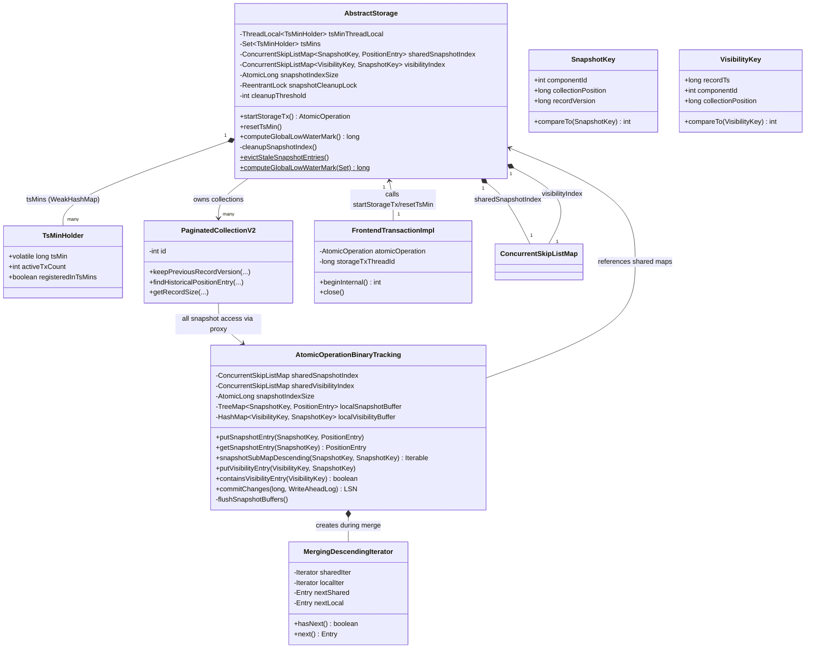
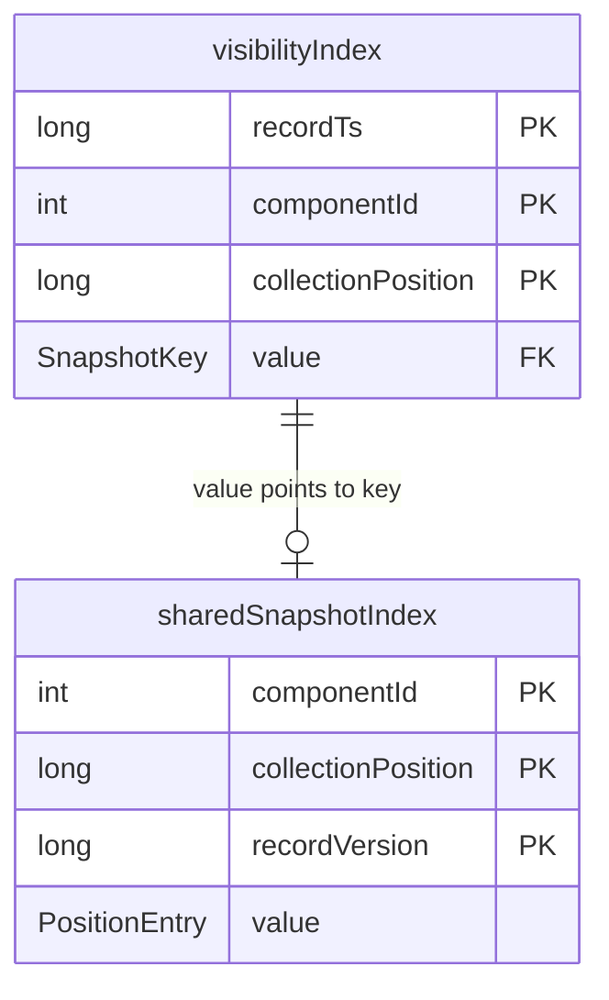
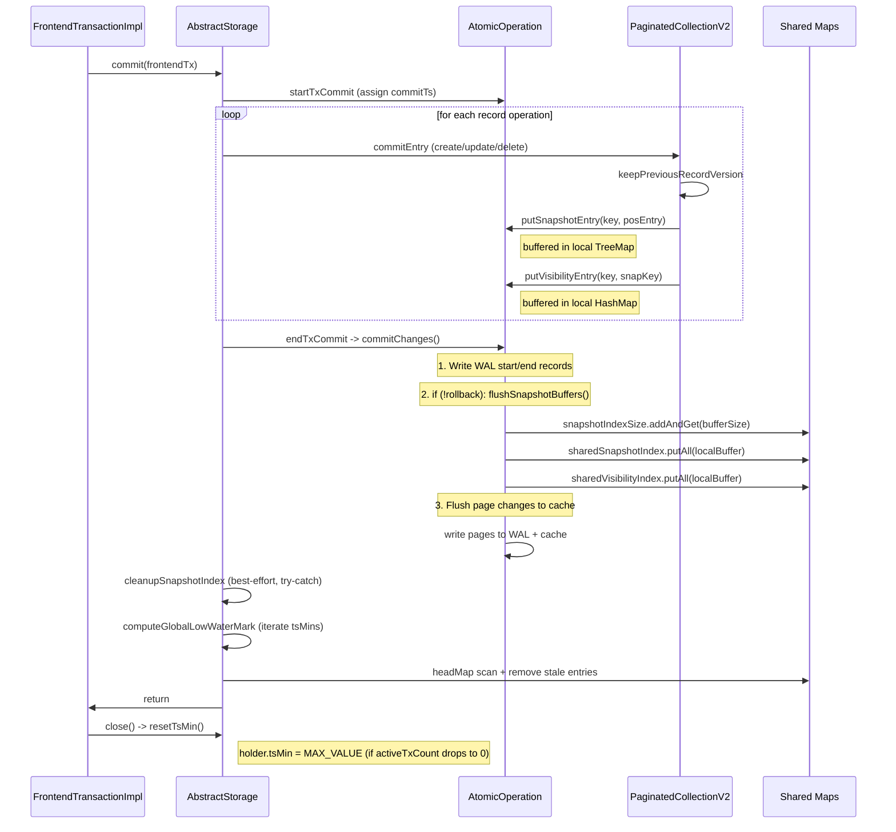
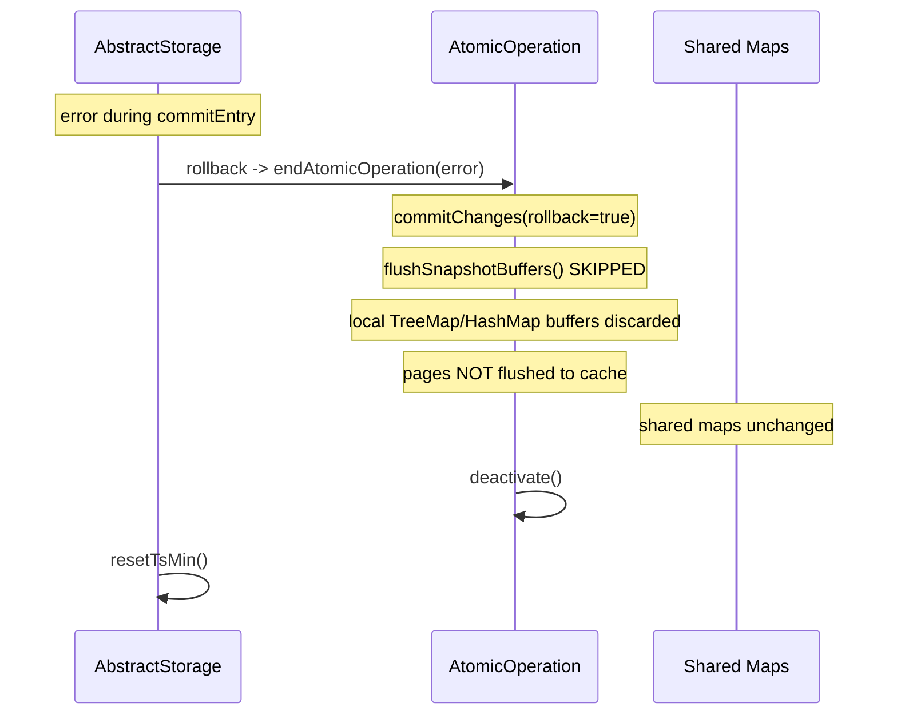
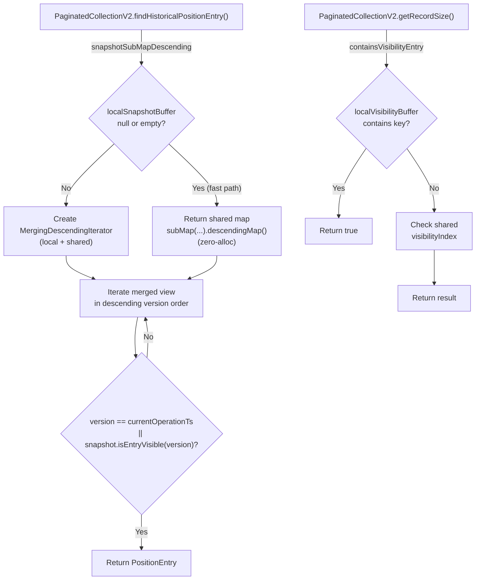
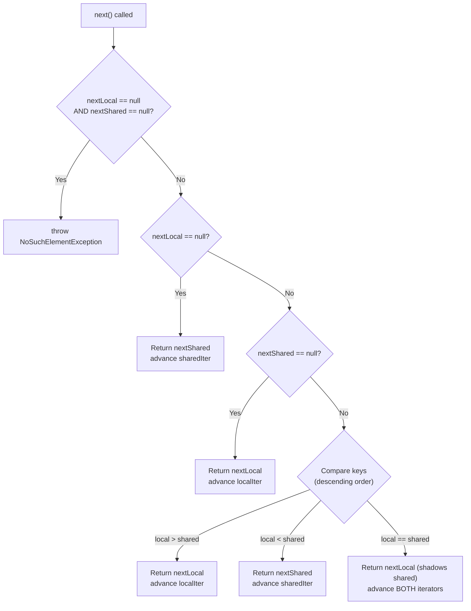
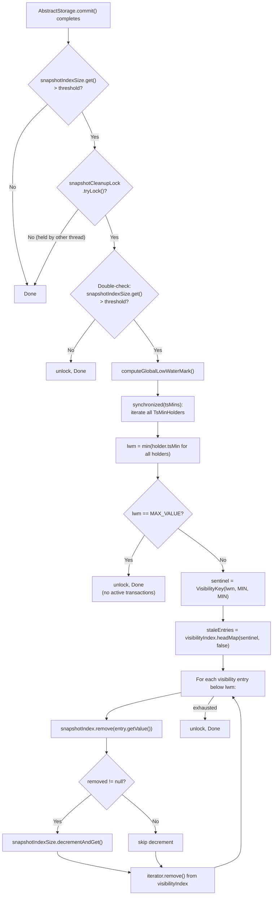
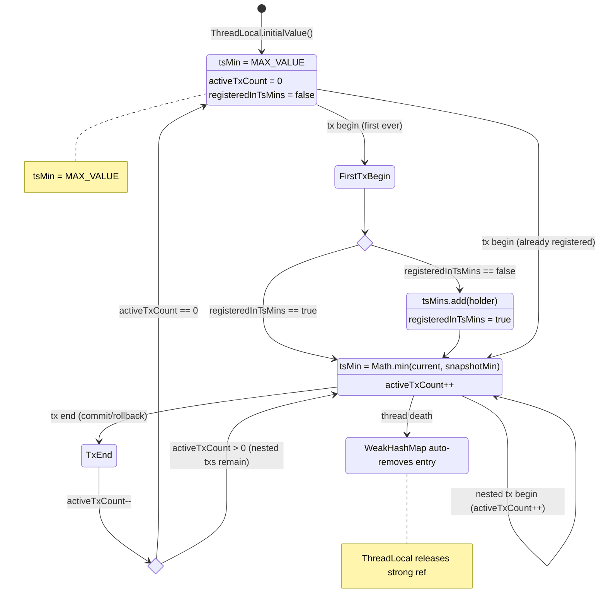
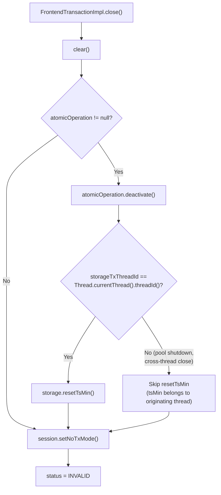
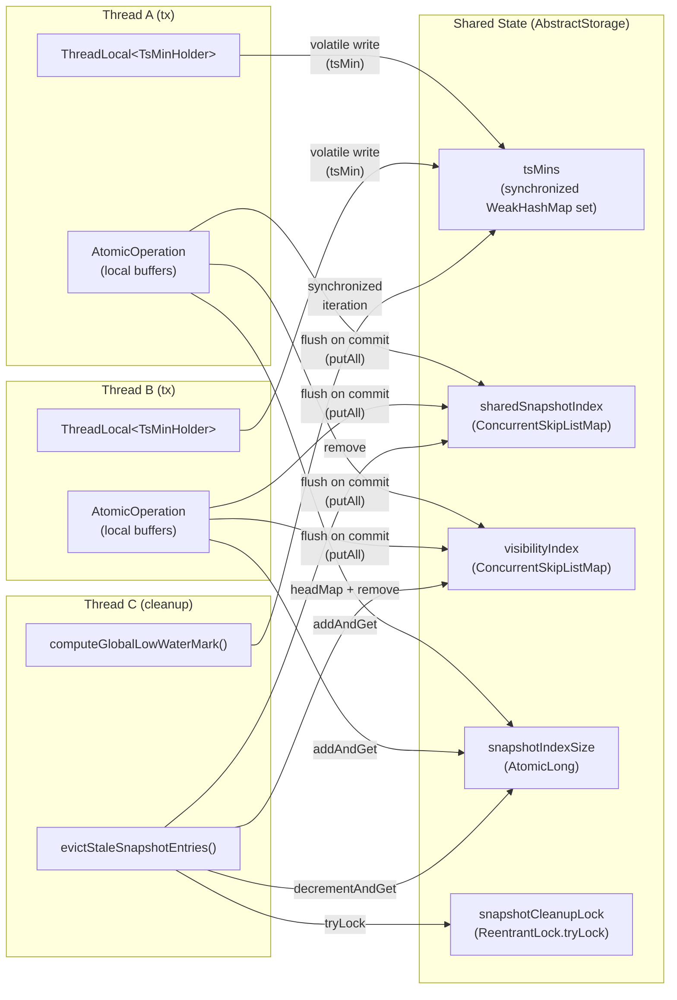

# Snapshot Index GC — Final Design (YTDB-510)

## Problem

`PaginatedCollectionV2` maintained per-instance `snapshotIndex` and `visibleSnapshotIndex` maps for MVCC snapshot isolation. These maps grew unboundedly because entries were never removed, eventually causing OOM under update-heavy workloads. The per-collection `visibleSnapshotIndex` was keyed incorrectly (`(newRecordVersion, collectionPosition)`) and could not support efficient range-based eviction by timestamp.

## Solution

Replace per-collection snapshot maps with a centralized, garbage-collected snapshot index at the storage level. The design has four pillars:

1. **Shared indexes** on `AbstractStorage` — a single `sharedSnapshotIndex` and `visibilityIndex` serve all collections, keyed by dedicated record types.
2. **Per-thread low-water-mark tracking** via `TsMinHolder` + `WeakHashMap` — replaces the old `transactionsTracker` (`ConcurrentHashMap`) that introduced write memory barriers on every transaction begin/end.
3. **Buffered writes via `AtomicOperation` proxy** — snapshot/visibility entries are buffered locally during a transaction and flushed to shared maps only on commit (write-nothing-on-error pattern).
4. **Threshold-gated cleanup** at the end of `AbstractStorage.commit()` — when the index exceeds a configurable size, stale entries below the global low-water-mark are evicted.

---

## Architecture

### Class hierarchy and ownership



### New types

#### `SnapshotKey` (Java record)
**Package**: `com.jetbrains.youtrackdb.internal.core.storage.collection`
**File**: `core/.../storage/collection/SnapshotKey.java`

```java
public record SnapshotKey(int componentId, long collectionPosition, long recordVersion)
    implements Comparable<SnapshotKey>
```

- Natural ordering: `componentId` -> `collectionPosition` -> `recordVersion` (all ascending).
- Replaces `CompositeKey(collectionPosition, recordVersion)` — type-safe, primitive-based, no `List<Object>` overhead.
- Used as key in `ConcurrentSkipListMap<SnapshotKey, PositionEntry>`.
- The `componentId` field (the collection's `int id`) namespaces entries so all collections share one map.

#### `VisibilityKey` (Java record)
**Package**: `com.jetbrains.youtrackdb.internal.core.storage.collection`
**File**: `core/.../storage/collection/VisibilityKey.java`

```java
public record VisibilityKey(long recordTs, int componentId, long collectionPosition)
    implements Comparable<VisibilityKey>
```

- Natural ordering: `recordTs` -> `componentId` -> `collectionPosition`.
- Timestamp-first ordering enables efficient `headMap(lwm)` range-scan eviction.
- Each entry maps back to a `SnapshotKey`, forming the bridge used during cleanup.

#### `TsMinHolder` (mutable, package-private class)
**Package**: `com.jetbrains.youtrackdb.internal.core.storage.impl.local`
**File**: `core/.../storage/impl/local/TsMinHolder.java`

```java
final class TsMinHolder {
  volatile long tsMin = Long.MAX_VALUE;
  int activeTxCount;
  boolean registeredInTsMins;
}
```

| Field | Visibility | Purpose |
|---|---|---|
| `tsMin` | `volatile` | Minimum `minActiveOperationTs` across active transactions on this thread. Volatile so the cleanup thread sees current values. Reset to `MAX_VALUE` when all transactions end. |
| `activeTxCount` | thread-local only | Counts overlapping transactions on the owning thread (e.g., nested metadata-loading tx). `tsMin` is only reset when this drops to zero. |
| `registeredInTsMins` | thread-local only | Lazy registration flag — holder is added to `AbstractStorage.tsMins` at most once. |

Uses identity-based `equals`/`hashCode` (inherited from `Object`) because instances are `WeakHashMap` keys.

### Index key relationships



### Configuration

| Property | Key | Type | Default |
|---|---|---|---|
| `STORAGE_SNAPSHOT_INDEX_CLEANUP_THRESHOLD` | `youtrackdb.storage.snapshotIndex.cleanupThreshold` | `Integer` | `10,000` |

Read from per-storage `ContextConfiguration`, falling back to `GlobalConfiguration` default. Configurable at runtime via JVM property.

### Removed fields

- `PaginatedCollectionV2.snapshotIndex` (`NavigableMap<CompositeKey, PositionEntry>`) — **removed**
- `PaginatedCollectionV2.visibleSnapshotIndex` (`NavigableMap<CompositeKey, CompositeKey>`) — **removed**
- `AbstractStorage.transactionsTracker` (`ConcurrentHashMap`) — **removed**
- `AbstractStorage.registryFrontendTransaction()`, `unregisterFrontendTransaction()`, `getActiveTransactionsCount()` — **removed**

---

## Data flows

### Commit flow (happy path)



### Rollback flow



### Read flow (AtomicOperation proxy)



### MergingDescendingIterator logic



### Cleanup: low-water-mark and eviction



### TsMinHolder lifecycle



### Cross-thread safety in FrontendTransactionImpl.close()



---

## Key design decisions

### Shared vs. per-collection index
Shared at `AbstractStorage` level. Avoids iterating all collections during cleanup and enables a single threshold check. The key is extended with `componentId` (the collection's `int id`) to namespace entries.

### `volatile tsMin`
Initially non-volatile (the plan assumed stale reads were safe). Integration testing revealed that the cleanup thread must see current `tsMin` values of threads with active read sessions — a stale `MAX_VALUE` would let cleanup evict entries those sessions need. Made `volatile` in the integration test fix commit.

### `AtomicLong snapshotIndexSize` instead of `ConcurrentSkipListMap.size()`
`ConcurrentSkipListMap.size()` is O(n) — it traverses the entire map. Calling it on every commit caused resource exhaustion under sustained heavy concurrent load (30-minute soak tests with 10+ threads). The `AtomicLong` counter is approximate (slight overcounting is harmless — just triggers cleanup slightly earlier) and provides O(1) checks.

### `TreeMap` for local snapshot buffer (not `HashMap`)
`TreeMap` supports zero-copy `subMap()` range queries in `snapshotSubMapDescending` — no intermediate collection or sort needed. `HashMap` would require filtering and sorting on every range query.

### `HashMap` for local visibility buffer
Only needs `containsKey` — no ordering or range queries. Simpler and faster than `TreeMap`.

### Lazy buffer allocation
Local buffers start as `null` and are allocated on first write. Avoids overhead for read-only transactions, which are the majority.

### Best-effort cleanup
`cleanupSnapshotIndex()` is wrapped in try-catch after `endTxCommit()`. If cleanup throws, the commit already succeeded (WAL flushed, pages applied). Stale entries accumulate until the next successful cleanup pass.

### `currentOperationTs` self-read check preserved
The plan originally proposed removing `currentOperationTs` self-read checks as dead code. This was incorrect: internal atomic operations (managed by `AtomicOperationsManager`) freely mix reads and writes within the same scope. Records are stamped with `commitTs >= maxActiveOperationTs`, so `snapshot.isEntryVisible()` returns false for self-reads. The `recordVersion == currentOperationTs` shortcut makes these work. Removing it caused 5,323 test failures. The checks are preserved with inline documentation.

### Disabled `BTreeLinkBagConcurrencySingleBasedLinkBagTestIT.testConcurrency`
`updateOppositeLinks` loads linked entities that may not exist in the reader's snapshot under the new SI model, causing `RecordNotFoundException`. Disabled with `@Ignore("YTDB-510: Disabled until LinkBag is SI-aware")`.

---

## Files changed

### New production files (3)

| File | Lines | Purpose |
|---|---|---|
| `core/.../storage/collection/SnapshotKey.java` | 26 | Typed key for shared snapshot index |
| `core/.../storage/collection/VisibilityKey.java` | 27 | Typed key for visibility index (timestamp-first ordering) |
| `core/.../storage/impl/local/TsMinHolder.java` | 56 | Per-thread min-timestamp holder for low-water-mark computation |

### New test files (6)

| File | Tests | Purpose |
|---|---|---|
| `core/.../storage/collection/SnapshotKeyTest.java` | 8 | Ordering, equality, range-scan behavior |
| `core/.../storage/collection/VisibilityKeyTest.java` | 9 | Ordering, equality, headMap range-scan |
| `core/.../storage/impl/local/TsMinHolderTest.java` | 13 | Defaults, mutation, LWM computation, WeakHashMap GC, threading |
| `core/.../storage/impl/local/SnapshotIndexCleanupTest.java` | 25 | Eviction logic, threshold, concurrency, boundary values, stress |
| `core/.../atomicoperations/AtomicOperationSnapshotProxyTest.java` | 52 | Overlay semantics, merge iteration, flush, rollback, isolation |
| `core/.../storage/impl/local/SharedSnapshotIndexFieldsTest.java` | 10 | Field initialization, accessor stability, config entry |

**Total: 117 new test methods** across 6 test files.

### Modified production files (7)

| File | Changes |
|---|---|
| `AbstractStorage.java` | Added shared indexes, TsMinHolder infrastructure, cleanup logic, `startStorageTx()`, `resetTsMin()`, `cleanupSnapshotIndex()`, `evictStaleSnapshotEntries()`, `computeGlobalLowWaterMark()`. Removed `transactionsTracker` and its 3 methods. |
| `AtomicOperation.java` | Added 5 proxy interface methods: `putSnapshotEntry`, `getSnapshotEntry`, `snapshotSubMapDescending`, `putVisibilityEntry`, `containsVisibilityEntry`. |
| `AtomicOperationBinaryTracking.java` | Added local buffer fields, proxy method implementations, `flushSnapshotBuffers()`, `MergingDescendingIterator` nested class. Extended constructor to accept shared map refs and `snapshotIndexSize`. |
| `AtomicOperationsManager.java` | Passes shared maps from `AbstractStorage` to `AtomicOperationBinaryTracking` constructor. |
| `PaginatedCollectionV2.java` | Removed per-instance `snapshotIndex` and `visibleSnapshotIndex`. Migrated 6 call sites to `AtomicOperation` proxy with typed keys. |
| `FrontendTransactionImpl.java` | Added `storageTxThreadId` field. Calls `resetTsMin()` in `close()` guarded by thread identity check. Removed `transactionsTracker` calls. |
| `GlobalConfiguration.java` | Added `STORAGE_SNAPSHOT_INDEX_CLEANUP_THRESHOLD` enum entry. |

### Modified test/config files

- `TransactionTest.java` — Added 4 multi-threaded snapshot isolation variants (12 tests total).
- `BTreeLinkBagConcurrencySingleBasedLinkBagTestIT.java` — Disabled test with `@Ignore`.
- `pom.xml` — Added `youtrackdb.test.deadlock.timeout.minutes=60` to CI integration test profile.
- 30+ test files — Wrapped read operations in transactions for SI compatibility.

---

## Thread safety model



| Resource | Protection mechanism | Accessed by |
|---|---|---|
| `sharedSnapshotIndex` | `ConcurrentSkipListMap` (lock-free) | All transaction threads (read + write during flush), cleanup thread (remove) |
| `visibilityIndex` | `ConcurrentSkipListMap` (lock-free) | All transaction threads (read + write during flush), cleanup thread (headMap + remove) |
| `snapshotIndexSize` | `AtomicLong` | Flush threads (addAndGet), cleanup thread (decrementAndGet + get) |
| `tsMins` set | `Collections.synchronizedSet` | Transaction threads (add, lazy), cleanup thread (synchronized iteration) |
| `TsMinHolder.tsMin` | `volatile` field | Owning thread (write), cleanup thread (read) |
| `TsMinHolder.activeTxCount` | Owning thread only (no sync needed) | Owning thread |
| `localSnapshotBuffer` | Thread-confined to `AtomicOperation` | Owning transaction thread only |
| `localVisibilityBuffer` | Thread-confined to `AtomicOperation` | Owning transaction thread only |
| `snapshotCleanupLock` | `ReentrantLock.tryLock()` | Committing threads (non-blocking) |

---

## Invariants

1. **Snapshot entries are only visible after commit**: `flushSnapshotBuffers()` runs inside `commitChanges()` after WAL but before page cache flush. Concurrent readers cannot see new record versions until pages are flushed, and by that point the snapshot entries are already in the shared maps.

2. **Rollback never leaks entries**: The `if (!rollback)` guard in `commitChanges()` skips `flushSnapshotBuffers()`. Local buffers are discarded when the `AtomicOperation` is deactivated.

3. **Cleanup never removes entries needed by active readers**: `computeGlobalLowWaterMark()` returns the minimum `tsMin` across all registered holders. Any entry with `recordTs >= lwm` is preserved. The committing thread's own `tsMin` is still set during cleanup (`resetTsMin()` runs later in `FrontendTransactionImpl.close()`), so the lwm is always <= the committing transaction's snapshot.

4. **Dead threads don't block cleanup**: `WeakHashMap` entries are automatically removed when the `TsMinHolder` becomes unreachable (after thread death releases the `ThreadLocal`'s strong reference). Dead-thread holders with `tsMin = MAX_VALUE` are effectively ignored anyway.

5. **Only one cleanup runs at a time**: `snapshotCleanupLock.tryLock()` ensures at most one thread performs cleanup. Others skip without blocking.

6. **Self-reads work**: `recordVersion == currentOperationTs` shortcut in `findHistoricalPositionEntry` handles internal atomic operations that read records they just wrote (e.g., schema initialization).

---

## Verification

All tests pass across both storage modes:

| Suite | Command | Result |
|---|---|---|
| Core unit tests | `./mvnw -pl core test` | 6,549 tests, 0 failures |
| Full unit test suite | `./mvnw clean package` | All 10 modules, 0 failures |
| Disk-based unit tests | `./mvnw clean package -Dyoutrackdb.test.env=ci` | 0 failures |
| Integration tests (memory) | `./mvnw clean verify -P ci-integration-tests` | 0 failures |
| Integration tests (disk) | `./mvnw clean verify -P ci-integration-tests -Dyoutrackdb.test.env=ci` | 0 failures |

JaCoCo coverage for new components: `SnapshotKey`, `VisibilityKey`, `TsMinHolder`, `MergingDescendingIterator` — all at 100% instruction and branch coverage. `AtomicOperationBinaryTracking` proxy methods at 100%.
