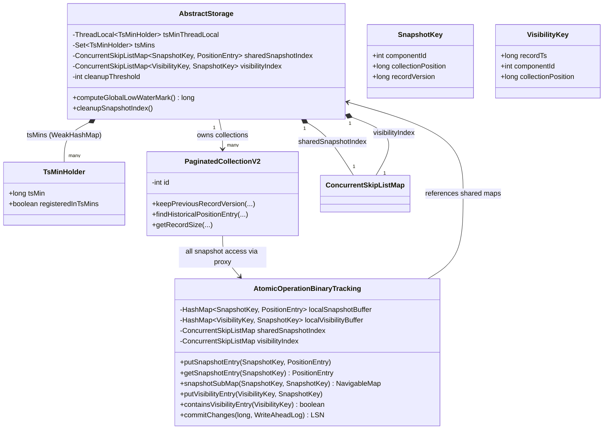
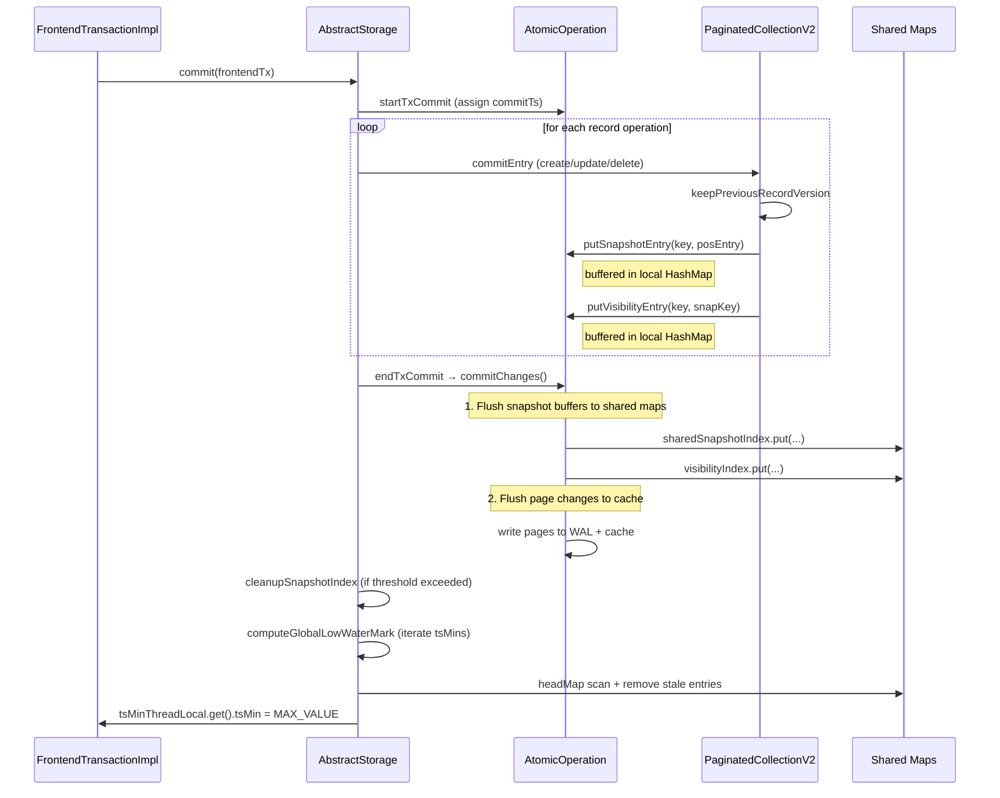
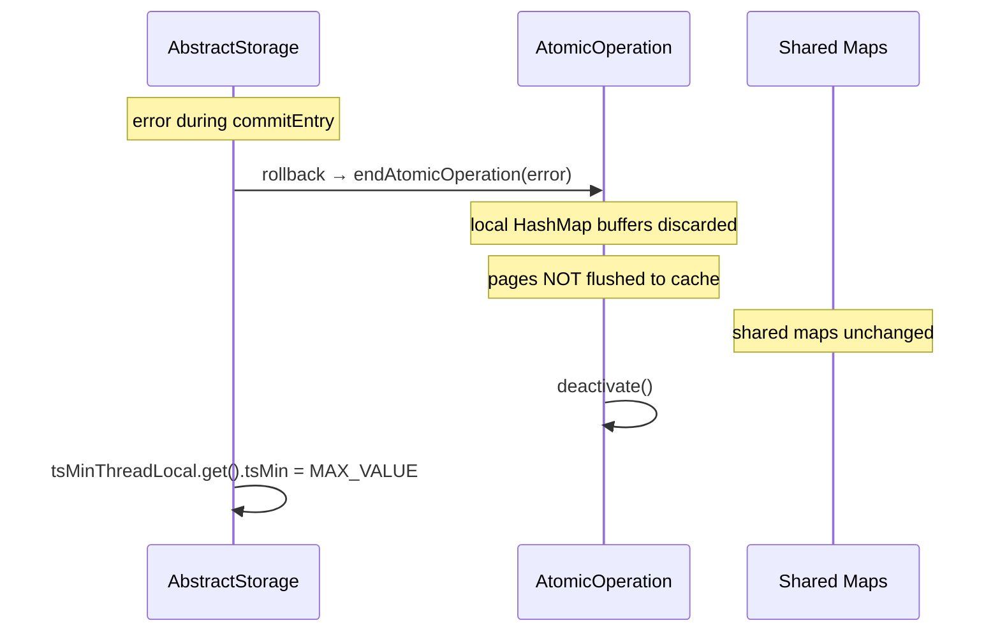
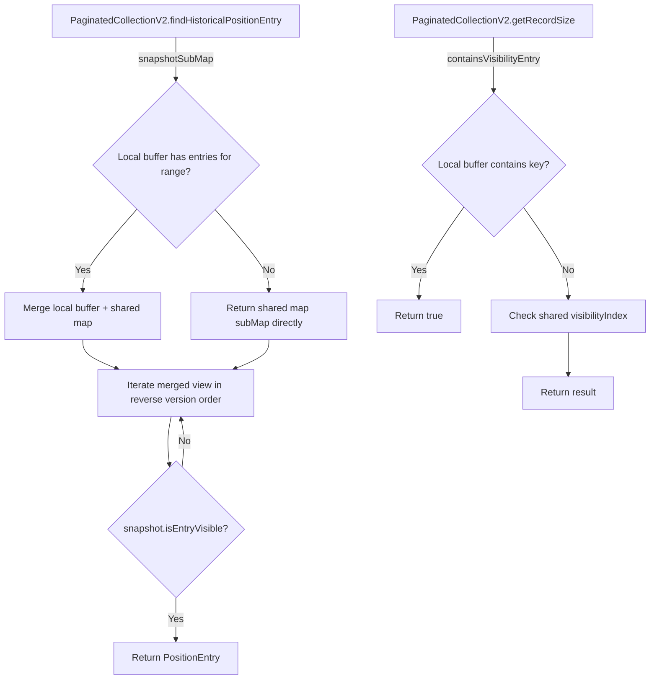
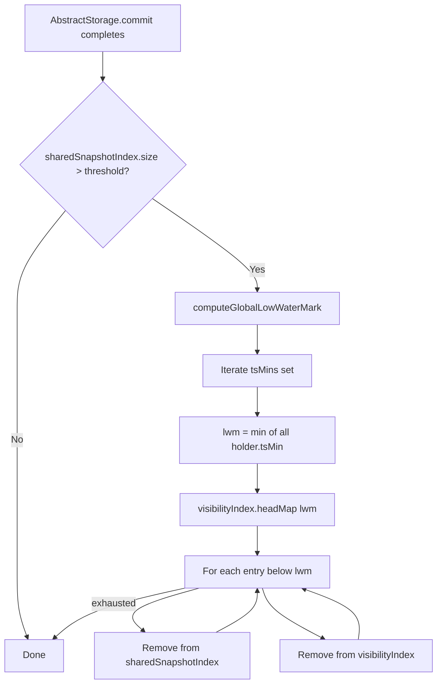
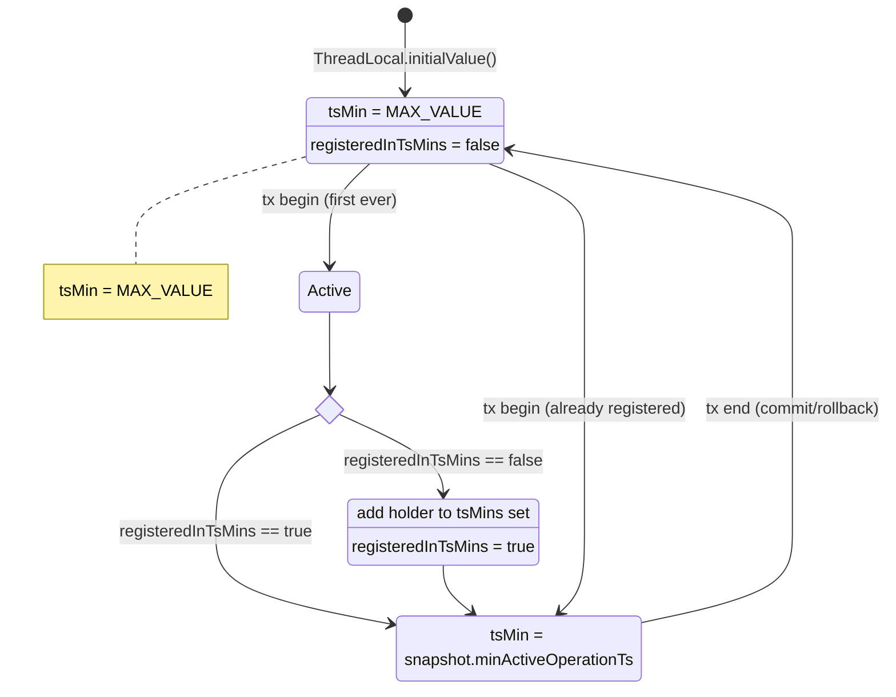

# Snapshot Index Cleanup (Low-Water-Mark GC for Historical Record Versions)

## High-level plan

### Problem
`PaginatedCollectionV2.snapshotIndex` holds references to historical record versions for MVCC snapshot isolation and grows unboundedly because entries are never removed, eventually causing OOM under update-heavy workloads. The companion `visibleSnapshotIndex` was intended to track which snapshot entries can be garbage-collected, but it is implemented incorrectly (per-collection, never cleaned, wrong key semantics for efficient range-based eviction). It must be **replaced** — not migrated — with a correctly designed global `visibilityIndex`.

### Goals
1. **Shared snapshot index**: Move per-collection `snapshotIndex` to a single storage-wide index, keyed by `(componentId, ...)` so all collections share one structure and cleanup is centralized.
2. **Low-water-mark tracking**: Replace the existing `transactionsTracker` (`ConcurrentHashMap`) — which introduces write memory barriers on every transaction begin/end — with a `tsMins` set backed by `WeakHashMap<ThreadLocal<TsMinHolder>, Boolean>`. Each thread publishes its `tsMin` into a `TsMinHolder` (shared mutable object accessible both via `ThreadLocal` and the `tsMins` set). The global low-water-mark is computed during cleanup by iterating `tsMins` and taking `min(holder.tsMin)`.
3. **Replace `visibleSnapshotIndex` with correct `visibilityIndex`**: The existing per-collection `visibleSnapshotIndex` (keyed by `(newRecordVersion, collectionPosition)`) is incorrectly designed — it cannot support efficient range-based eviction by timestamp. Replace it with a global `visibilityIndex` keyed by `(recordTs, componentId, collectionPosition)` → `SnapshotKey`, enabling fast `headMap` range-scan eviction of all entries below the low-water-mark.
4. **Threshold-based cleanup trigger**: At the end of `AbstractStorage.commit(...)`, check the size of the shared snapshot index; if it exceeds a configured threshold, compute the low-water-mark and purge stale entries.
5. **Rollback safety via buffered writes**: Buffer snapshot/visibility index entries in the `AtomicOperation` during the commit phase instead of writing to shared maps eagerly. On successful commit, `commitChanges()` flushes buffered entries to shared maps (before flushing page changes to cache). On rollback, the buffer is simply discarded — implicit cleanup via the "write-nothing-on-error" pattern already used by the rest of `AtomicOperation`.

### Architecture

```
AbstractStorage
  ├── tsMinThreadLocal: ThreadLocal<TsMinHolder>          (per-thread tsMin, replaces transactionsTracker)
  ├── tsMins: Collections.synchronizedSet(Collections.newSetFromMap(WeakHashMap<TsMinHolder, Boolean>))
  ├── sharedSnapshotIndex: ConcurrentSkipListMap<SnapshotKey, PositionEntry>
  │     Key: (componentId: int, collectionPosition: long, recordVersion: long)
  ├── visibilityIndex: ConcurrentSkipListMap<VisibilityKey, SnapshotKey>
  │     Key: (recordTs: long, componentId: int, collectionPosition: long)
  └── cleanupThreshold: int (from GlobalConfiguration)
```

**Cleanup algorithm** (at end of commit):
1. If `sharedSnapshotIndex.size() > cleanupThreshold`:
   a. Compute `globalLowWaterMark = min(holder.tsMin for each holder in tsMins)` (direct iteration, no ThreadLocal indirection).
   b. Range-scan `visibilityIndex` from `(Long.MIN_VALUE, ...)` to `(globalLowWaterMark, ...)` exclusive.
   c. For each entry in range: remove the corresponding `SnapshotKey` from `sharedSnapshotIndex` and remove the `VisibilityKey` entry from `visibilityIndex`.

### Diagrams

#### Class hierarchy and ownership



#### Commit flow (happy path)



#### Rollback flow



#### Read flow (AtomicOperation proxy)



#### Low-water-mark and cleanup



#### TsMinHolder lifecycle



### Key Decisions
- **Shared vs per-collection index**: Shared at `AbstractStorage` level. This avoids iterating all collections during cleanup and enables a single threshold check. The key is extended with `componentId` (the collection's `int id`) to namespace entries.
- **Thread-local `tsMin` with WeakHashMap (replaces `transactionsTracker`)**: Each transaction-carrying thread holds a `ThreadLocal<TsMinHolder>` where `TsMinHolder` is a shared mutable object with `long tsMin` (non-volatile) and `boolean registeredInTsMins`. The `TsMinHolder` itself (not the `ThreadLocal`) is the key in a `WeakHashMap<TsMinHolder, Boolean>`-backed set. This is because `ThreadLocal.get()` only works from the owning thread — during cleanup, we iterate `tsMins` and read `holder.tsMin` directly. When a thread dies, the `ThreadLocal`'s strong reference to `TsMinHolder` is released, allowing the `WeakHashMap` to GC the entry. The existing `transactionsTracker` (`ConcurrentHashMap`) is removed since it introduces write memory barriers on every tx begin/end; the `tsMins` set avoids this (writes go to the thread-local holder, the set is only mutated during lazy registration).
- **`tsMin` lifecycle**:
  - Transaction begin: set `tsMin` to `minActiveOperationTs` from the `AtomicOperationsSnapshot` (obtained when the `AtomicOperation` is created).
  - Transaction end (commit/rollback): set `tsMin = Long.MAX_VALUE` (signals "no active tx on this thread").
  - Lazy registration: only register the `ThreadLocal` in `tsMins` on first use.
- **Cleanup trigger location**: End of `AbstractStorage.commit(...)`, after `endTxCommit(atomicOperation)` returns but before releasing `stateLock`. This ensures the committing transaction's timestamp is already committed in the table.
- **Configuration**: New `GlobalConfiguration` entry `STORAGE_SNAPSHOT_INDEX_CLEANUP_THRESHOLD` with a reasonable default (e.g., 10,000).
- **`CompositeKey` replacement**: Define dedicated record types (`SnapshotKey`, `VisibilityKey`) instead of reusing the general-purpose `CompositeKey` class. This gives type safety, avoids the `List<Object>` overhead, and enables efficient `Comparable` implementations with primitive fields.

### Rollback safety via buffered writes

Page changes in `AtomicOperation` are already buffered — they live in the operation's local overlay and are only flushed to the shared cache during `commitChanges()`. Before that point, no concurrent reader can see the new record versions (they read old pages from the cache). This means snapshot index entries are also not needed by concurrent readers until pages are flushed.

Therefore, snapshot/visibility entries can follow the same "write-nothing-on-error" pattern:

1. **Proxy**: All snapshot/visibility index access goes through `AtomicOperation`, which maintains local `HashMap` buffers as an overlay on the shared `ConcurrentSkipListMap` instances (same pattern as page reads). Writes go to the local buffer; reads check buffer first, then shared maps.
2. **Commit**: During `commitChanges()`, flush buffered entries to shared maps **before** flushing page changes to cache. This ensures entries are visible by the time any concurrent reader can see the new record versions.
3. **Rollback**: The buffer is simply discarded when the `AtomicOperation` is deactivated — no explicit cleanup needed.

### Constraints
- `PaginatedCollectionV2` must still work correctly for reads, updates, and deletes — all snapshot lookups are redirected to the shared index.
- Cleanup must be thread-safe (indexes are `ConcurrentSkipListMap`; low-water-mark computation iterates the synchronized `tsMins` set).
- Cleanup must not hold exclusive locks on collections — it only manipulates the shared in-memory maps.
- The old `visibleSnapshotIndex.containsKey(new CompositeKey(commitTs, position))` usage in `getRecordSize` (checking "did the current transaction delete this position?") must be re-implemented against the new `visibilityIndex` key structure `(recordTs, componentId, collectionPosition)`.
- Existing tests must pass unchanged (behavior is preserved; only storage location of the maps changes).

---

## Checklist

- [x] **1. Introduce dedicated key record types**
  - [x] Leaf: Create `SnapshotKey` record (`int componentId`, `long collectionPosition`, `long recordVersion`) implementing `Comparable<SnapshotKey>` with natural ordering by `(componentId, collectionPosition, recordVersion)`. Create `VisibilityKey` record (`long recordTs`, `int componentId`, `long collectionPosition`) implementing `Comparable<VisibilityKey>` with natural ordering by `(recordTs, componentId, collectionPosition)`. Placed in `com.jetbrains.youtrackdb.internal.core.storage.collection` package (not `v2`) since they will be used across the storage layer by `AbstractStorage` and `AtomicOperation`.
    > **Done.** Created `SnapshotKey.java` and `VisibilityKey.java` as Java records with primitive-based `Comparable` implementations in the `collection` package. Tests in `SnapshotKeyTest.java` (8 tests) and `VisibilityKeyTest.java` (8 tests) cover ordering, equality/hashCode, and `ConcurrentSkipListMap` range-scan/headMap behavior. Commit: `37136633b5`.

- [x] **2. Introduce `TsMinHolder` and low-water-mark infrastructure in `AbstractStorage`**
  - [x] Leaf: Create `TsMinHolder` class (mutable, with `long tsMin = Long.MAX_VALUE` (non-volatile — stale reads are safe since `tsMin` only grows; cleanup is merely slightly more conservative) and `boolean registeredInTsMins = false`). Add to `AbstractStorage`: a `ThreadLocal<TsMinHolder> tsMinThreadLocal`, a `Set<TsMinHolder> tsMins` (backed by `Collections.synchronizedSet(Collections.newSetFromMap(new WeakHashMap<>()))`), and a method `long computeGlobalLowWaterMark()` that iterates `tsMins` and reads `holder.tsMin` directly from each entry, returning the minimum value. Place `TsMinHolder` as a package-private class in the `impl.local` package (or nested in `AbstractStorage`). Remove the `transactionsTracker` field and its `registryFrontendTransaction`/`unregisterFrontendTransaction`/`getActiveTransactionsCount` methods (replace all callers in subsequent leaves).
    > **Done.** Created `TsMinHolder.java` as a package-private mutable class in `impl.local` with `long tsMin` and `boolean registeredInTsMins` fields. Added `tsMinThreadLocal` (`ThreadLocal<TsMinHolder>`) and `tsMins` (`WeakHashMap`-backed synchronized set) to `AbstractStorage`. Added static package-private `computeGlobalLowWaterMark(Set<TsMinHolder>)` (for testability) with a public instance delegate. Removed `transactionsTracker` field and its 3 methods; deleted the 2 call sites in `FrontendTransactionImpl`. Tests in `TsMinHolderTest.java` (10 tests) cover defaults, mutation, low-water-mark computation (single/multiple/idle/empty/dynamic), and ThreadLocal identity. Commit: `850e55eb83`.

- [x] **3. Wire `tsMin` lifecycle into transaction begin/end (replacing `transactionsTracker`)**
  - [x] Leaf: In `AbstractStorage.startStorageTx()` (or the call site that previously called `registryFrontendTransaction`): obtain the `TsMinHolder` from `tsMinThreadLocal`. **Validate single-tx-per-thread**: if `holder.tsMin != Long.MAX_VALUE`, throw `IllegalStateException` — a transaction is already active on this thread. Then set `holder.tsMin` to the snapshot's `minActiveOperationTs`, and lazily add the `holder` to `tsMins` if `registeredInTsMins` is false (then set `registeredInTsMins = true`). At transaction end (the call site that previously called `unregisterFrontendTransaction`): set `tsMinThreadLocal.get().tsMin = Long.MAX_VALUE`. Update all callers of the removed `transactionsTracker` methods (e.g., `FrontendTransactionImpl.beginInternal()`, `close()`).
    > **Done.** Wired tsMin lifecycle into transaction begin/end. In `AbstractStorage.startStorageTx()`: sets `holder.tsMin = Math.min(current, snapshotMin)`, increments `activeTxCount`, and lazily registers in `tsMins`. Added `resetTsMin()` to `AbstractStorage` that decrements `activeTxCount` and resets `tsMin` to `MAX_VALUE` when count reaches zero (throws `IllegalStateException` on underflow). In `FrontendTransactionImpl.close()`: calls `resetTsMin()` guarded by `storageTxThreadId == currentThread` to handle pool-shutdown cross-thread close safely. Added `activeTxCount` field to `TsMinHolder` to support multiple overlapping sessions per thread (e.g., session init loads metadata in a nested tx). Added `assertOnOwningThread()` defensive assertions to 7 key tx methods (`beginInternal`, `commitInternal`, `getRecord`, `exists`, `loadRecord`, `deleteRecord`, `addRecordOperation`). `TransactionTest`: preserved all 8 original single-threaded tests (with try-finally for db1 cleanup) + added 4 multi-threaded variants with `CountDownLatch` coordination. `TsMinHolderTest`: added `activeTxCount` lifecycle test. 6460 core tests pass. Commit: `d53e23a3aa`.

- [x] **4. Add shared snapshot and visibility indexes to `AbstractStorage`**
  - [x] Leaf: Add two fields to `AbstractStorage`: `ConcurrentSkipListMap<SnapshotKey, PositionEntry> sharedSnapshotIndex = new ConcurrentSkipListMap<>()` and `ConcurrentSkipListMap<VisibilityKey, SnapshotKey> visibilityIndex = new ConcurrentSkipListMap<>()` (use concrete types so the JVM can devirtualize method calls). Add accessor methods `getSharedSnapshotIndex()` and `getVisibilityIndex()` so `PaginatedCollectionV2` can access them. Also add `GlobalConfiguration.STORAGE_SNAPSHOT_INDEX_CLEANUP_THRESHOLD` (property name: `youtrackdb.storage.snapshotIndex.cleanupThreshold`, default: `10_000`, type: `Integer`).
    > **Done.** Added `sharedSnapshotIndex` (`ConcurrentSkipListMap<SnapshotKey, PositionEntry>`) and `visibilityIndex` (`ConcurrentSkipListMap<VisibilityKey, SnapshotKey>`) as `protected final` fields to `AbstractStorage`, with `public` getters returning concrete types for devirtualization. Indexes will be passed to `AtomicOperation` (leaf 5) rather than accessed directly by `PaginatedCollectionV2`. Added `GlobalConfiguration.STORAGE_SNAPSHOT_INDEX_CLEANUP_THRESHOLD` (key: `youtrackdb.storage.snapshotIndex.cleanupThreshold`, default: 10,000). Added `.clear()` calls for both maps in `doShutdown()` and `doShutdownOnDelete()` for consistency with existing cleanup pattern. Tests in `SharedSnapshotIndexFieldsTest.java` (10 tests) cover initialization, accessor stability, put/get, concrete type, and config entry. 6470 core tests pass.

- [x] **5. Add snapshot/visibility index proxy to `AtomicOperation`**
  - [x] Leaf: The `AtomicOperation` becomes the single point of access for snapshot and visibility indexes — same overlay pattern as page reads. Add to `AtomicOperation` interface: (a) `void putSnapshotEntry(SnapshotKey key, PositionEntry value)` — buffers locally; (b) `PositionEntry getSnapshotEntry(SnapshotKey key)` — checks local buffer first, falls back to shared map; (c) `NavigableMap<SnapshotKey, PositionEntry> snapshotSubMap(SnapshotKey from, SnapshotKey to)` — returns a merged view (local buffer + shared map) for range scans in `findHistoricalPositionEntry`; (d) `void putVisibilityEntry(VisibilityKey key, SnapshotKey value)` — buffers locally; (e) `boolean containsVisibilityEntry(VisibilityKey key)` — checks local buffer first, falls back to shared map. Implement in `AtomicOperationBinaryTracking`: use `HashMap<SnapshotKey, PositionEntry>` and `HashMap<VisibilityKey, SnapshotKey>` as local buffers (initially `null`, lazily allocated to avoid overhead for read-only transactions). Pass references to the shared `ConcurrentSkipListMap` instances at construction time. In `commitChanges()`, **before** flushing page changes to cache: iterate local buffers and write each entry to the shared maps. On rollback, buffers are simply discarded (implicit write-nothing-on-error pattern).
    > **Done.** Added 5 proxy methods to `AtomicOperation` interface: `putSnapshotEntry`, `getSnapshotEntry`, `snapshotSubMapDescending`, `putVisibilityEntry`, `containsVisibilityEntry`. Implemented in `AtomicOperationBinaryTracking` with lazily-allocated local buffers (`TreeMap` for snapshot — enables zero-copy `subMap` range queries; `HashMap` for visibility — only needs `containsKey`). `snapshotSubMapDescending` returns the shared map's descending view directly when no local entries exist (zero-alloc fast path); otherwise merges via `MergingDescendingIterator` (two-pointer merge of shared and local descending views, local shadows shared on equal keys). `flushSnapshotBuffers()` publishes local buffers to shared maps in `commitChanges()` after WAL but before page cache flush, guarded by `!rollback`. `AtomicOperationsManager` passes shared maps from `AbstractStorage` to the constructor. Tests in `AtomicOperationSnapshotProxyTest.java` (33 tests) cover overlay semantics, merged iteration, flush, rollback discard, deactivation rejection, lazy allocation, and `MergingDescendingIterator` directly. All new code >= 85% branch coverage. 6506 core tests pass.

- [ ] **6. Remove `currentOperationTs` self-read checks from snapshot visibility logic**
  - [ ] Leaf: The commit phase never reads records it's writing (verified: `commitEntry` only calls `doCreateRecord`/`doUpdateRecord`/`doDeleteRecord`, never `readRecord`/`doReadRecord`). Therefore the `recordVersion == currentOperationTs` shortcut in `isRecordVersionVisible` (line 949, comment "we always read what we wrote") and the `version == currentOperationTs` check in `findHistoricalPositionEntry` (line 981) are unnecessary artifacts. Remove them: (a) replace `isRecordVersionVisible(recordVersion, currentOperationTs, snapshot)` with just `snapshot.isEntryVisible(recordVersion)` — eliminate the method and its `currentOperationTs` parameter entirely; (b) in `findHistoricalPositionEntry`, remove the `currentOperationTs` parameter — the search bound becomes simply `snapshot.maxActiveOperationTs()`, and the visibility check in the loop becomes just `snapshot.isEntryVisible(version)`; (c) update all callers of these methods (`doReadRecord`, `internalReadRecord`, `getRecordSize`) to stop passing `commitTs`/`operationTs`. This simplifies the snapshot read logic by removing a code path that can never be reached.

- [ ] **7. Migrate `PaginatedCollectionV2` to use `AtomicOperation` as snapshot/visibility proxy**
  - [ ] Leaf: Remove the per-instance `snapshotIndex` and `visibleSnapshotIndex` fields from `PaginatedCollectionV2`. All access now goes through `AtomicOperation`: (a) `keepPreviousRecordVersion(...)` calls `atomicOperation.putSnapshotEntry(new SnapshotKey(id, collectionPosition, oldRecordVersion), positionEntry)` and `atomicOperation.putVisibilityEntry(new VisibilityKey(newRecordVersion, id, collectionPosition), snapshotKey)`; (b) `findHistoricalPositionEntry(...)` uses `atomicOperation.snapshotSubMap(lowerKey, upperKey)` for the range scan; (c) `getRecordSize(...)` uses `atomicOperation.containsVisibilityEntry(new VisibilityKey(commitTs, id, position))` to replace the old `visibleSnapshotIndex.containsKey(...)` check. Callers don't need to know whether entries are in the local buffer or shared maps — the proxy handles it transparently. Ensure `close()` and `delete()` no longer need to clear per-instance maps.

- [ ] **8. Implement cleanup logic in `AbstractStorage.commit(...)`**
  - [ ] Leaf: At the end of `AbstractStorage.commit(...)`, after `endTxCommit(atomicOperation)` succeeds and before the outer `finally` block: check `sharedSnapshotIndex.size() > cleanupThreshold`. If exceeded, call a new private method `cleanupSnapshotIndex()` that: (a) computes `globalLowWaterMark = computeGlobalLowWaterMark()`, (b) iterates `visibilityIndex.headMap(new VisibilityKey(globalLowWaterMark, Integer.MIN_VALUE, Long.MIN_VALUE), false)`, (c) for each entry removes the corresponding `SnapshotKey` from `sharedSnapshotIndex` and removes the `VisibilityKey` entry from `visibilityIndex`. This runs outside the `stateLock` if possible (the maps are concurrent), or inside the read lock if necessary for correctness.

- [ ] **9. Add unit tests for new components**
  - [ ] Leaf: Write unit tests for `SnapshotKey` and `VisibilityKey` — verify `Comparable` ordering, `equals`/`hashCode` contracts, and range-scan behavior with `ConcurrentSkipListMap.subMap()` / `headMap()`.
  - [ ] Leaf: Write unit tests for `TsMinHolder`, `tsMins`, and `computeGlobalLowWaterMark()` — verify: single thread returns its `tsMin`; multiple threads return the minimum; thread death (WeakHashMap GC removes entry) does not break computation; `Long.MAX_VALUE` entries (idle threads) are correctly handled; lazy registration only adds to `tsMins` once.
  - [ ] Leaf: Write unit tests for `cleanupSnapshotIndex()` — verify: entries below the low-water-mark are removed from both maps; entries at or above the low-water-mark are preserved; concurrent reads during cleanup see consistent data; cleanup with an empty index is a no-op.
  - [ ] Leaf: Write unit tests for `AtomicOperation` snapshot/visibility proxy methods — verify: `putSnapshotEntry`/`getSnapshotEntry` overlay works (local buffer shadows shared map); `putVisibilityEntry`/`containsVisibilityEntry` overlay works; `snapshotSubMap` returns merged view of local buffer + shared map in correct order; reads from a fresh operation (no local writes) fall through to shared maps; lazy `HashMap` allocation (null until first write).
  - [ ] Leaf: Write unit tests for buffered snapshot entry flush and rollback — verify: buffered entries are flushed to shared maps during `commitChanges()` (before page flush); on rollback, buffered entries are discarded and shared maps remain unchanged; entries from other committed transactions are unaffected by rollback.

- [ ] **10. Run existing test suite and fix regressions**
  - [ ] Leaf: Run `./mvnw -pl core test` and fix any compilation errors or test failures introduced by the migration.
  - [ ] Leaf: Run the full unit test suite `./mvnw clean package` and fix any failures across all modules.
  - [ ] Leaf: Run integration tests `./mvnw clean verify -P ci-integration-tests` and fix any failures.
