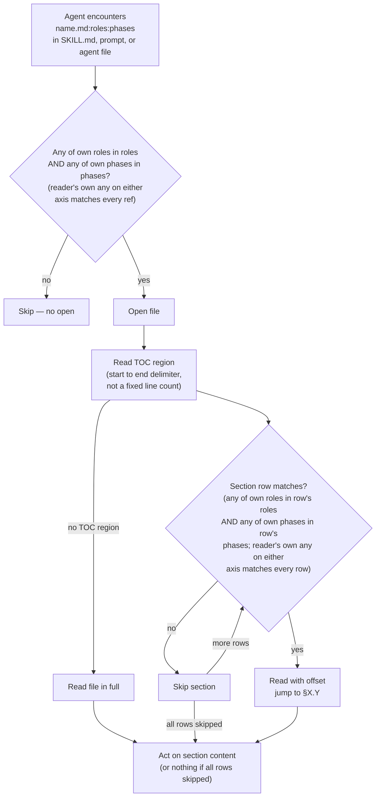

# Conventions

<!--Document index start-->

| Section | Roles | Phases | Summary |
|---|---|---|---|
| §1.1 Glossary | any | any | Closed-term definitions every phase shares: enums, annotations, TOC region, staging, stamps. |
| §1.2 Plan File Structure | planner,orchestrator,decomposer | 1,2,3A | Layout of the plan file and track files: sections, status markers, scope indicators. |
| §Per-tier artifact set | planner,orchestrator | 1,2 | Which artifacts each tier produces; log, ledger, and plan-review are universal; plan is lite/full, design is full only. |
| §Plan file content (`implementation-plan.md`) — thinned `lite`/`full` plan | planner | 1 | The thinned derived-mirror plan: Checklist plus a thin cross-track Component Map; minimal has no plan. |
| §Section budgets | planner,final-designer | 1,4 | Soft length caps per plan and design section. |
| §Track file content (`plan/track-N.md`) | planner,orchestrator,decomposer,implementer | 1,3A,3B,3C | The 15-section track-file shape and what each section holds. |
| §Status markers | orchestrator,planner | 1,2,3A,3B,3C | Checkbox and timestamp conventions for progress lines. |
| §Scope indicators (required) | planner,reviewer-plan | 1,2 | In-scope / out-of-scope markers required on every plan and track. |
| §1.3 Review Iteration Protocol | orchestrator,reviewer-technical,reviewer-risk,reviewer-adversarial,reviewer-design,reviewer-plan,reviewer-dim-step,reviewer-dim-track | 2,3A,3B,3C | Shared iterate-to-PASS loop: findings, fixes, re-review, iteration cap. |
| §1.4 Tooling discipline — prefer mcp-steroid PSI for Java symbol audits | any | any | When to route symbol audits through PSI vs grep; mcp-steroid IDE routing for refactors and Maven. |
| §Session-start preflight | any | any | One-time mcp-steroid liveness + open-project check before symbol work. |
| §When PSI is required (not optional) | implementer,planner,reviewer-technical | 0,1,3A,3B,3C | Load-bearing audits (deletions, renames, signature changes) must use PSI when the IDE is reachable. |
| §Sub-agent delegation | orchestrator,planner | 0,1,2,3A,3B,3C | Sub-agents default to grep; PSI requests must say so explicitly in the delegation. |
| §Other mcp-steroid routes (Maven, refactoring, multi-site edits) | implementer | 3B,3C | Maven single-test reruns, IDE refactors, and apply-patch for multi-site literal edits. |
| §Recipes — load on demand for specific operations | implementer,reviewer-technical | 3A,3B,3C | Catalogue of IDE-control recipes: safe-delete, change-signature, call hierarchy, test failure details. |
| §1.5 Writing style for Markdown and prose artifacts | any | any | House-style tiers: full style for Markdown and prose, AI-tell subset for code comments and tests. |
| §1.6 Workflow-SHA stamps on `_workflow/**` artifacts | orchestrator,planner,migrator,final-designer | 1,2,3A,3B,3C,4 | Stamp format, SHA computation, range, and the unstamped-artifact protocol for workflow files. |
| §(a) Format definition and writer-side position contract | orchestrator,planner,migrator | 1,3A,3B,3C,4 | The line-1 stamp comment shape and where the writer places it. |
| §(a1) Canonical parser idioms | migrator,orchestrator | 3A,3B,3C,4 | Reusable bash/python snippets that read the stamp consistently. |
| §(b) SHA computation at artifact-creation time | orchestrator,planner,migrator | 1,3A,3B,3C,4 | Which commit SHA stamps a new artifact and how it is captured. |
| §(c) Stamp range definition | migrator,orchestrator | 3A,3B,3C,4 | The commit range a stamp implies when replaying workflow-format changes. |
| §(d) Unstamped-artifact protocol | migrator,orchestrator | 3A,3B,3C,4 | How to treat an artifact with no stamp: derive a base or escalate. |
| §(e) Non-rule: no silent auto-computed default | migrator,orchestrator | 3A,3B,3C,4 | Why the script never guesses a stamp; an absent stamp is an explicit decision point. |
| §(f) Stamped artifact types and exclusions | orchestrator,planner,migrator | 1,3A,3B,3C,4 | Which artifact kinds carry a stamp and which are excluded. |
| §(g) Active-plan scope | orchestrator,migrator | 2,3A,3B,3C,4 | The stamp applies to the active branch's plan, not historical ones. |
| §(h) Phase 1 walk bash block | planner,orchestrator | 1 | The bash walk that stamps the initial plan artifacts at Phase 1. |
| §1.7 Staging for workflow-modifying branches | orchestrator,implementer,planner,final-designer | 1,3A,3B,3C,4 | Routing rule that keeps live workflow at develop while staged edits accumulate until promotion. |
| §(a) Staged-subtree path layout | orchestrator,implementer,final-designer | 3A,3B,3C,4 | The _workflow/staged-workflow/.claude mirror path layout. |
| §(b) Canonical workflow-modifying marker | orchestrator,implementer,planner | 1,3A,3B,3C,4 | The canonical marker sentence and the stable prefix consumers match on to flag a plan as workflow-modifying. |
| §(c) Detection rule — two signals, two consumers | orchestrator,implementer | 3A,3B,3C,4 | How the marker plus path-touch signal is detected and who acts on it. |
| §(d) Reads precedence — staged copy authoritative when present | orchestrator,implementer,final-designer,migrator | 3A,3B,3C,4 | Read the staged copy when it exists, else the live file. |
| §(e) Write routing and copy-then-edit on first touch | implementer,orchestrator,final-designer | 3A,3B,3C,4 | Route writes to the staged path; copy the live file in verbatim on first touch. |
| §(f) Rebase-precedes-promotion | orchestrator,final-designer | 4 | Rebase onto develop before the Phase 4 promotion overwrites live. |
| §(g) The I6 invariant | orchestrator,implementer | 3A,3B,3C,4 | Live workflow stays at develop state for the whole branch until promotion. |
| §(h) Forward-applicable to future workflow-modifying branches | orchestrator,planner | 1,3A,3B,3C,4 | The staging convention generalizes to every future workflow-modifying plan. |
| §(i) Worked example — on-disk shape | implementer,orchestrator | 3A,3B,3C,4 | A concrete on-disk layout of staged vs live paths. |
| §(j) Aborted-promotion resume semantics | orchestrator,final-designer | 4 | How to resume a promotion that was interrupted mid-commit. |
| §(k) Prose-rule self-application opt-out | orchestrator,implementer,planner,final-designer,reviewer-technical,reviewer-risk,reviewer-adversarial | 1,3A,3B,3C,4 | Judgment-layer plans opt out of staging via a marker and edit workflow prose live; criteria re-pointing stays on. |
| §(l) Opt-out criteria-switch extension | reviewer-technical,reviewer-risk,reviewer-adversarial,orchestrator | 3A | Phase-3A criteria-switch blocks also fire on the opt-out marker; staged-read blocks stay workflow-modifying-only. |
| §1.8 Per-section role/phase annotations and TOC region | any | any | Canonical schema for per-section annotations, the role/phase enums, the TOC region, and cross-refs. |
| §(a) Role enum | any | any | The closed 15-value role token set used in annotations and cross-reference suffixes. |
| §(b) Phase enum | any | any | The closed 8-value phase token set used in annotations and cross-reference suffixes. |
| §(c) Annotation idiom | any | any | The one-line HTML comment shape carrying roles, phases, and a summary after each heading. |
| §(d) TOC region format | any | any | The delimiter-bounded TOC table and its three anchor shapes: under-H1, after-frontmatter, top-of-file. |
| §(e) Cross-reference convention | any | any | Hand-written cross-file and auto-stamped in-file ref suffixes plus subset drift detection. |
| §(f) Read-decision flow | any | any | How an agent filters on file-level then section-level roles+phases before reading. |
| §(g) Worked example | any | any | A fully-annotated heading and its matching TOC row. |
| §(h) References | any | any | Decision-record pointers and design-doc cross-links for this section. |

<!--Document index end-->

Shared formats, rules, and glossary used by all phases of the workflow.

For execution-specific conventions (episodes, commit format, code review,
complexity tiers, decomposition rules), see
conventions-execution.md:decomposer,final-designer,implementer,orchestrator:3A,3B,3C,4 — loaded only
during Phase 3 execution.

---

## 1.1 Glossary
<!-- roles=any phases=any summary="Closed-term definitions every phase shares: enums, annotations, TOC region, staging, stamps." -->

| Term | Definition |
|---|---|
| **Track** | One PR in a stacked-diff series: it builds on the tracks before it, stands alone as an independently reviewable and mergeable unit, and carries as much of the feature as one reviewable diff holds. Contains steps. Sized by file footprint, not step count: the planner *maximizes* — packs work in up to a soft footprint ceiling, related or not — and clamps with a floor below (≤~12 in-scope files that folds into a neighbor) and a ceiling above (split candidate at >~20-25). The bounds are soft: a track outside them passes planning when its track file carries a written justification. Full rule in `planning.md` §Track descriptions. |
| **Step** | One change = one commit, fully tested. Coherence (one logically continuous change committed together, not a minimal file count) is mandatory for `high` steps and preferred for `low`/`medium` steps, which may merge several changes toward the fill target. For the coherence boundary by tier, the fill target, and the under-fill rule, see `track-review.md` §Step Decomposition. |
| **Episode** | Structured record of what happened during a step or track. |
| **Scope indicator** | Rough sketch of expected work in a track: the planned file footprint and what it covers (`~N files covering X, Y, Z`). Format and rules in §Scope indicators (required). |
| **Risk tag** | Per-step `low` / `medium` / `high` label assigned by the Phase A decomposer. Gates whether Phase B runs step-level dimensional review (`high` only) and signals focal points to Phase C track-level review (`medium` and `high`). Locked once the step is implemented. Criteria, override rules, and lifecycle live in `risk-tagging.md`; sub-step gating reads only the tag value, not the criteria. |
| **Research** | Phase 0 — interactive exploration before planning. The agent answers questions, explores code, and does internet research. Completes only when the user explicitly asks to create the plan. Same session as Phase 1. |
| **Session** | One invocation of `/execute-tracks`. Handles one sub-phase (A, B, or C) of one track. Sessions are separated by context clearing. Episodes bridge context across sessions. The only exception: the Track Pre-Flight gate + Phase A share a single session. |
| **Sub-agent** | A spawned agent for self-contained tasks — review (technical/risk/adversarial, dimensional code review, test quality review) where fresh perspective matters, or implementation (Phase B per-step implementer) where context absorption matters. The orchestrator retains session-level state. |
| **Orchestrator** | The session-level agent driving `/execute-tracks`. In Phase B owns sub-steps 4–7 of step implementation and all session-level decisions (cross-track impact, escalation, episode synthesis, context-level session-end gate). Distinct from the implementer. |
| **Implementer** | A fresh sub-agent spawned per step in Phase B that performs sub-steps 1–3 of step implementation (implement, test, commit) and returns a structured handoff to the orchestrator. See implementer-rules.md:implementer:3B,3C. |
| **Track file** | `plan/track-N.md` — the per-track ExecPlan working file. Created during Phase 1 (in `lite`/`full` alongside `implementation-plan.md`; in `minimal` the only Phase-1 plan artifact) with the four Phase 1 track-level sections populated (`## Purpose / Big Picture`, `## Context and Orientation`, `## Plan of Work`, `## Interfaces and Dependencies`) plus any track-level Mermaid diagram; the remaining sections are filled by Phase A → C. See `conventions-execution.md §2.1` *Track file content* for the full 15-section ExecPlan shape (the 12 ExecPlan sections plus the combined `## Invariants & Constraints` section per D9) and the workflow-specific `## Episodes` and `## Base commit` siblings. Lives under `_workflow/plan/` (tracked on the branch for backup and team visibility, removed in Phase 4 cleanup before merge). |
| **Mid-phase handoff** | An on-disk file `_workflow/handoff-*.md` written when a session pauses with un-derivable mid-phase state (research notes, verbatim re-present text, partial reviews). Distinct from the implementer-return "handoff" — see mid-phase-handoff.md:orchestrator,planner:0,1,2,3A,3B,3C,4 for the protocol. Resolved and deleted on resume; otherwise removed by the Phase 4 cleanup commit. |
| **Change tier** | The change-level ceremony level — `full`, `lite`, or `minimal` — proposed by `/create-plan` Step 4 from the research log at the Phase 0 → 1 boundary and confirmed by the user. It selects which Phase-1 artifacts the change produces (a `design.md` in `full` only; a thinned **derived-mirror plan** in `lite`/`full` and none in `minimal`; self-contained track files in every tier) and which Phase-2/3A review passes run. Distinct from the per-step **risk tag** (`low`/`medium`/`high`) and the Phase-3A step-count axis (Simple/Moderate/Complex) — the three vocabularies never collide. Persisted as a field in the **phase ledger** so every fresh `/execute-tracks` session reads it (D4) — the ledger, not a plan line, is the resume-state and tier home. Full rule in `planning.md` §Tier classification. |
| **Tier gates** | The two orthogonal yes/no questions the tier factors into: Gate 1 — does the change need a `design.md`? — and Gate 2 — does the change span multiple tracks? Gate 1 reuses the HIGH-risk category list in `risk-tagging.md` read at the change level (a category is *central* to the change's purpose, not merely touched). `design = yes` implies multi-track, so the two gates collapse to three reachable tiers: `full` (design + multi-track), `lite` (no design + multi-track), `minimal` (no design + single track). |
| **Research log** | `_workflow/research-log.md` — the single durable Phase-0/1 decision ledger, produced in every tier. Five sections: `## Initial request` (the verbatim aim), `## Decision Log`, `## Surprises & Discoveries`, `## Open Questions` (the three append-only continuous logs), and `## Baseline and re-validation` (filled only on workflow-modifying branches). The adversarial review runs on it as a gate at the Phase 0 → 1 boundary. Consumed by the later artifacts (seeding the carriers) at the two sanctioned read points only and never cross-linked from them; removed in the Phase 4 cleanup. Unstamped (D19) — see §1.6(f):orchestrator,planner,migrator:1,3A,3B,3C,4. |
| **Aggregator plan** | Superseded by the **Derived-mirror plan** (D1). `implementation-plan.md` no longer carries the resume state the machinery reads — that moved to the **phase ledger** (D3) — so the plan is no longer an always-present aggregator. It is now a thinned cross-track summary present in `lite`/`full` only and dropped in `minimal` (D2). See the *Derived-mirror plan* and *Phase ledger* rows above. |
| **Track-canonical live decision** | The rule (D7) that the per-track `## Decision Log` carries the full inline Decision Record in every tier and is the *authoritative* live carrier through Phase 3. In `full`, the frozen `design.md` keeps a seed D-record for derivation, navigation, and `**Full design**` references — historical provenance, never authority. After a track absorbs a decision, the track is the source of truth; a cross-track propagation duty keeps duplicated records one logical decision through replans. |
| **Phase ledger** | `_workflow/phase-ledger.md` — an append-only, unstamped event log, one line per phase boundary, that owns the branch-level state the machinery reads: the resume phase, the active track, the change tier and its matched categories, the §1.7:orchestrator,implementer,planner,final-designer:1,3A,3B,3C,4 staging mode, and pause events. Replaces the plan checkboxes and the plan tier line `determine_state` parsed today; present in every tier. A reader keeps the latest value of each key (last-value-wins), so a mid-flight tier or phase change appends a new line rather than rewriting one. Written by the orchestrator's `workflow-startup-precheck.sh --append-ledger` subcommand (D6). Authoritative for resume phase state (D3); the track file's `## Progress` still owns the within-track sub-state (the two-level resume). Unstamped (D13) — see §1.6(f):orchestrator,planner,migrator:1,3A,3B,3C,4. |
| **Derived-mirror plan** | `implementation-plan.md` reduced (D1) to a cross-track summary — the `## Checklist` plus a thin cross-track Component Map — that mirrors content the track files own and holds no fact a track does not already own. Present in `lite` and `full` only; `minimal` drops the plan outright (D2), because a one-track plan mirrors a single track and its cross-track view is vacuous. Replaces the plan as an owner of Goals, Constraints, and Architecture Notes (those move to the track files or the research log per D5). Full rule in `planning.md` §Plan file structure. |
| **Plan-review document** | `_workflow/plan-review.md` — a separate cold-record document holding the Phase-2 consistency and structural audit summary, present in every tier (D7). Replaces the audit text that overwrote the plan's `## Plan Review` section. The review *state* lives in the phase ledger (the resume hot path); the multi-line review *summary* lives here (rarely read during development), so the ledger tail stays terse for `determine_state` to grep. `/review-plan` re-runs append their verdict here; Phase 4 folds the verdict into `adr.md` or the `minimal` PR-description summary. |
| **Combined Invariants & Constraints section** | The track-file section `## Invariants & Constraints` (D9, the 15th track-file section) that holds both per-track constraints and the testable invariants the plan's Architecture Notes carried — they share the same shape (a property that must hold, backed by a test). A process-only, non-testable constraint goes to `## Context and Orientation` or the `## Decision Log` instead. Integration Points fold into the existing `## Interfaces and Dependencies`; Non-Goals move to the research log and the PR `## Motivation` (and `design.md` in `full`). Template and lifecycle in `conventions-execution.md §2.1`. |
| **Workflow-SHA stamp** | The HTML comment `<!-- workflow-sha: <40-char SHA> -->` written on line 1 of each `_workflow/**` artifact, recording the workflow-format commit reachable from HEAD at the moment of artifact creation. Drift detection and migration replay both read it; the H1 title starts on line 2. Full rule, canonical parser idioms, range definition, and unstamped-artifact protocol live in §1.6:orchestrator,planner,migrator,final-designer:1,2,3A,3B,3C,4. |
| **Workflow drift** | A mismatch between the branch's `_workflow/**` artifact shape and the workflow format encoded in commits reachable from HEAD (section names, mandatory artifacts, step-file schema). Surfaces when workflow-format commits land on `develop` while a branch runs. Detected at session-start of `/create-plan` (D9) and in turn 1 of `/execute-tracks` by the gate at workflow-drift-check.md:orchestrator,planner:2,3A; the migration itself is owned by the `/migrate-workflow` skill. |
| **Role enum** | The closed 15-value set of agent-role tokens (`any`, `orchestrator`, `planner`, `implementer`, `decomposer`, `final-designer`, `migrator`, `pr-reviewer`, `reviewer-technical`, `reviewer-risk`, `reviewer-adversarial`, `reviewer-plan`, `reviewer-design`, `reviewer-dim-step`, `reviewer-dim-track`) used in per-section annotations and cross-reference suffixes. Closed at rollout; new roles require a workflow-format commit. Full list with per-value descriptions in §1.8:any:any. |
| **Phase enum** | The closed 8-value set of workflow-phase tokens (`0`, `1`, `2`, `3A`, `3B`, `3C`, `4`, `any`) used in per-section annotations and cross-reference suffixes. Inline-replanning and review-mode passes reuse existing phase tokens (`3A,3C`) rather than carving out separate tokens; `edit-design` mutations run in Phase 1 and 4 only (the design is frozen after Phase 1, so no Phase 3 design mutation runs) and tag `1,4`; `/migrate-workflow` and `/review-workflow-pr` sit outside the phase taxonomy and use `phases=any`. Full list in §1.8:any:any. |
| **Section annotation** | The one-line HTML comment `<!-- roles=<comma-list> phases=<comma-list> summary="<one-line>" -->` placed immediately after every annotated `##` or `###` heading. Carries the section's role and phase audience plus a ≤120-char summary; the TOC region's summary cell reads from `summary="..."` verbatim. Comma-separated lists carry no spaces. Required at the same density on `### ` as on `## ` (one literal-heading exception: the bootstrap-block heading `## Reading workflow files (TOC protocol)`). Format definition in §1.8:any:any. |
| **TOC region** | The Markdown table between the literal `<!--Document index start-->` and `<!--Document index end-->` comment delimiters, sitting directly under a workflow doc's H1. Columns are fixed at `Section | Roles | Phases | Summary`; rows map 1:1 to every `^## ` and `^### ` heading (bootstrap-block heading exempted). `workflow-reindex.py --write` rebuilds the table from per-section annotations; authors do not maintain it by hand. Format definition in §1.8:any:any. |
| **Cross-reference convention** | The `roles:phases` suffix on workflow-doc references that lets a reader filter before opening (cross-file refs) or before jumping to a section (in-file refs). Cross-file refs in every in-scope file — workflow docs, prompts, `SKILL.md` startup read-lists, and `.claude/agents/*.md` files — use the full `name.md:roles:phases` form and are hand-written; references to non-annotatable targets are backtick-wrapped instead. In-file `§X.Y(z):roles:phases` refs inside a workflow doc are auto-stamped by `workflow-reindex.py --write` from the target heading's annotation. The reindex script subset-validates cross-file suffixes against the target. Format, examples, and drift-detection rules in §1.8:any:any. |
| **Bootstrap block** | The ~30-line instruction block placed between the frontmatter (when present) and the H1 of every workflow-related system prompt (7 `SKILL.md`, 11 `.claude/workflow/prompts/*.md`, 20 `.claude/agents/*.md` — 38 files total). The block names the agent's role and embeds enough of the TOC-aware reading protocol that a freshly spawned sub-agent applies the filter from its first Read instead of paying the full-file cost to bootstrap itself from `conventions.md §1.8`. Block body and scope live in `design.md §"Bootstrap protocol for agent system prompts"` during Phase 1 and in `design-final.md` after the Phase 4 squash-merge; the reindex script's presence check is rule 7. |

---

## 1.2 Plan File Structure
<!-- roles=planner,orchestrator,decomposer phases=1,2,3A summary="Layout of the plan file and track files: sections, status markers, scope indicators." -->

All workflow phases reference this structure.
`<dir-name>` is the plan directory name — provided explicitly by the user, or
defaulting to the current git branch name.

```
docs/adr/<dir-name>/
  ## Ephemeral working files (tracked under _workflow/ during the branch
  ## lifetime; removed in Phase 4 cleanup before merge)
  _workflow/
    phase-ledger.md               <- append-only, unstamped event log (every
                                     tier): one line per phase boundary owning
                                     the branch-level state the machinery reads
                                     (resume phase, active track, tier + matched
                                     categories, §1.7 mode, pause events).
                                     Last-value-wins per key on read. Written by
                                     `workflow-startup-precheck.sh
                                     --append-ledger`; read by determine_state
                                     and create-plan Step 1c. Unstamped — see
                                     §1.6(f).
    implementation-plan.md        <- derived-mirror plan (lite/full only):
                                     cross-track summary — the Checklist plus a
                                     thin cross-track Component Map — mirroring
                                     content the track files own. Holds no fact
                                     a track does not own; per-track detailed
                                     content lives in plan/track-N.md, sectioned
                                     per conventions-execution.md §2.1. Dropped
                                     in `minimal` (one track, no cross-track
                                     view — see §Per-tier artifact set).
    plan-review.md                <- Phase-2 consistency + structural audit
                                     summary (every tier). The review state
                                     lives in the ledger; this cold record
                                     holds the multi-line summary. /review-plan
                                     re-runs append their verdict here.
                                     Unstamped — see §1.6(f).
    design.md                     <- narrative: concept-first Overview
                                     (first content), Core Concepts vocabulary
                                     primer (when doc has Parts or ≥3 new
                                     domain terms), class diagrams, workflow
                                     diagrams, per-section TL;DR + mechanism
                                     overview + edge cases + References
                                     footer. Every modification goes through
                                     the mutation action defined in
                                     design-document-rules.md § Mutation
                                     discipline. Frozen between Phase 1 end
                                     and Phase 4 start.
    design-mechanics.md           <- (optional, length-triggered) long-form
                                     derivations, file:line citations,
                                     edit-list subsections, full state-
                                     machine tables. Created when design.md
                                     exceeds ~2,000 lines / ~50K tokens.
                                     Section names match design.md so
                                     `**Full design**` refs in the plan
                                     resolve in either file.
    design-mutations.md           <- append-only log of every design.md
                                     mutation: diff summary, mechanical-check
                                     result, cold-read verdict, iteration
                                     count. Read by `edit-design`'s
                                     `design-sync` step to find the last
                                     sync point.
    research-log.md               <- single durable Phase-0/1 decision
                                     ledger, produced in every tier: the
                                     verbatim aim, the append-only Decision
                                     Log / Surprises / Open Questions, and a
                                     Baseline section on workflow-modifying
                                     branches. The adversarial review gates
                                     it at the Phase 0 → 1 boundary. Consumed
                                     by the later artifacts at the two
                                     sanctioned read points (Step 4a/4b
                                     authoring, the Phase-2 consistency
                                     cross-check), never cross-linked from
                                     them. Unstamped — see §1.6(f).
    plan/
      track-1.md                  <- per-track ExecPlan; 15 sections per
                                     conventions-execution.md §2.1
      track-2.md
      ...
    handoff-*.md                  <- (optional, transient) mid-phase handoff
                                     written when a session pauses with un-
                                     derivable in-flight state; deleted on
                                     resume, otherwise removed in the Phase 4
                                     cleanup commit. See
                                     `mid-phase-handoff.md` for the protocol.

  ## Final artifacts (committed in Phase 4 — the only files that survive
  ## merge into develop)
  design-final.md                 <- post-implementation design reflecting
                                     what was actually built; same shape as
                                     design.md (mutation discipline applies)
  adr.md                          <- architecture decision record with actual
                                     outcomes, aggregated from all episodes
```

The `_workflow/` subtree is **tracked** in git during the branch lifetime —
each session commits and pushes its workflow-file changes alongside its code
commits, so the branch on GitHub always reflects the latest progress (useful
for team visibility on a draft PR, and as a backup against local disk loss).
At Phase 4, after `design-final.md` and `adr.md` are committed, the entire
`_workflow/` directory is removed in a single cleanup commit so only the two
durable artifacts survive the squash-merge into `develop`. See
`workflow.md` § Final Artifacts for the cleanup procedure.

Every ephemeral `_workflow/**` artifact in the listing above (`implementation-plan.md`,
`design.md`, optional `design-mechanics.md`, and each `plan/track-*.md`)
carries a line-1 workflow-SHA stamp recording the workflow-format commit
reachable from HEAD at creation time. `phase-ledger.md`, `plan-review.md`,
and `research-log.md` are unstamped append-only logs — see §1.6(f):orchestrator,planner,migrator:1,3A,3B,3C,4 for the
exclusion and its rationale. The stamp format, canonical parser
idioms, SHA computation rule, stamp range definition, unstamped-artifact
protocol, and the positive list of stamped artifact types (plus the Phase 4
final-artifact and `design-mutations.md` exclusions) live in [§1.6:orchestrator,planner,migrator,final-designer:1,2,3A,3B,3C,4](#16-workflow-sha-stamps-on-_workflow-artifacts);
the §1.1:any:any glossary row "Workflow-SHA stamp" gives the one-line definition.

The on-disk shape of `_workflow/**` may shift between sessions when
workflow-format commits land on `develop` while the branch runs. The
session-start gate at workflow-drift-check.md:orchestrator,planner:2,3A
detects such drift at every `/create-plan` (D9) and `/execute-tracks`
startup and routes the user through the `/migrate-workflow` skill to
realign.

### Per-tier artifact set
<!-- roles=planner,orchestrator phases=1,2 summary="Which artifacts each tier produces; log, ledger, and plan-review are universal; plan is lite/full, design is full only." -->

Not every change produces every artifact in the layout above. The
**change tier** (§1.1:any:any glossary; full rule in `planning.md` §Tier
classification) selects the Phase-1 artifact set:

| Artifact | `full` | `lite` | `minimal` |
|---|---|---|---|
| `research-log.md` | yes | yes | yes |
| `phase-ledger.md` (append-only resume-state log) | yes | yes | yes |
| `plan-review.md` (Phase-2 audit summary) | yes | yes | yes |
| `implementation-plan.md` (derived-mirror plan) | yes (thinned) | yes (thinned) | — (dropped) |
| `plan/track-N.md` (self-contained, inline Decision Records) | yes (N tracks) | yes (N tracks) | yes (one track) |
| `design.md` (+ optional `design-mechanics.md`) | yes | — | — |
| Phase 4 durable carrier | `design-final.md` + `adr.md` | `adr.md` | PR-description verdict summary |

The research log, the phase ledger, and the plan-review document are
universal. The log is the one adversarially-gated decision ledger every
tier produces; the ledger is the append-only event log the resume state
machine reads to derive state (D3, §1.1:any:any *Phase ledger*), so resume
state has a home that does not depend on a plan; the plan-review document
holds the Phase-2 audit summary in every tier (D7). The
`implementation-plan.md` is now a **derived-mirror plan** (D1): a
cross-track summary of the track files, present only in `lite` and `full`
and thinned to the `## Checklist` plus a thin cross-track Component Map.
`minimal` drops it (D2) — a one-track plan would mirror a single track and
its cross-track view is vacuous, and the ledger now owns the resume state
the stub plan used to carry. `design.md` exists only when Gate 1 says the
change needs one (`full`). The track files are self-contained in every
tier — the per-track `## Decision Log` carries the full inline Decision
Record (the **track-canonical live decision**, §1.1:any:any), and in `full` the
frozen `design.md` keeps a seed copy as historical provenance. A
`minimal`→`lite`/`full` escalation materializes the dropped plan (and
`design.md` for `full`) through the inline-replan ESCALATE path (D11).

### Plan file content (`implementation-plan.md`) — thinned `lite`/`full` plan
<!-- roles=planner phases=1 summary="The thinned derived-mirror plan: Checklist plus a thin cross-track Component Map; minimal has no plan." -->

The plan is a **derived-mirror plan** (D1): a cross-track summary of the
track files, present only in `lite` and `full`. `minimal` has no plan
(D2). It carries only what a fresh `/execute-tracks` session needs to pick
up the next track and assess cross-track impact — the `## Checklist` and a
thin cross-track Component Map — and holds no fact a track file does not
already own.

```markdown
# <Feature Name>

<!-- `## Design Document` is `full`-only — omit these two lines in lite,
     which has no design.md (see §Per-tier artifact set above). -->
## Design Document
[design.md](design.md)

## Component Map
<!-- Thin cross-track Component Map only: the slice of the system the change
     touches, for cross-track impact assessment. Per-track detail, Decision
     Records, invariants, and constraints live in the track files, not here. -->
<Mermaid diagram (when 3+ components) + annotated bullet list — see planning.md>

## Checklist
- [ ] Track 1: <title>
  > <intro paragraph — high-level context; detailed description in plan/track-1.md>
  > **Scope:** ~N files covering X, Y, Z
- [ ] Track 2: <title>
  > <intro paragraph — high-level context; detailed description in plan/track-2.md>
  > **Scope:** ~N files covering X, Y, Z
  > **Depends on:** Track 1 (when applicable)
```

The plan no longer carries `### Goals`, `### Constraints`,
`### Architecture Notes` (the full Decision Records, Invariants, and
Integration Points), `## Plan Review`, or `## Final Artifacts` (D5/D7).
Each old plan section is disposed per D5:

- **`### Goals`** is dropped — the aim lives in the research log's
  `## Initial request` and the PR `## Motivation`.
- **`### Constraints`** and the Architecture Notes **Invariants** move to
  each track's combined `## Invariants & Constraints` section (D9). The
  §1.7:orchestrator,implementer,planner,final-designer:1,3A,3B,3C,4 marker that the `### Constraints` block carried is now a ledger
  field (D4 — see §1.7(b):orchestrator,implementer,planner:1,3A,3B,3C,4/(k) below).
- **`### Architecture Notes` Decision Records** are track-canonical under
  D7, so the plan stops carrying them; the plan keeps only the thin
  cross-track **Component Map** for impact assessment. **Integration
  Points** move to each track's `## Interfaces and Dependencies` (D9).
- **`## Plan Review`** is removed: resume state lives in the phase ledger
  (D3) and the Phase-2 audit summary lives in `plan-review.md` (D7), so
  the plan no longer carries the State-0 checkbox the startup protocol
  used to read. The tier line and matched categories also move to the
  ledger (D4), so the former `**Change tier:**` line leaves the plan.
- **`## Final Artifacts`** is removed: Phase-4 progress and the final
  carrier are ledger / `plan-review.md` concerns, and the tier-keyed
  durable carrier is governed by §Per-tier artifact set above.

The `## Design Document` block is `full`-only: the §Per-tier artifact set
matrix above is the authority on which artifacts each tier produces, and
the `create-plan` templates are the operative per-tier source. The
schematic above shows the `full` shape; `lite` omits the `## Design
Document` block, and `minimal` has no plan at all.

The Phase-2 plan review and the resume-state routing read the phase
ledger and `plan-review.md`, not a plan checkbox (D3/D7). A user forces a
re-validation by invoking `/review-plan`, whose verdict appends to
`plan-review.md`. The runtime re-pointing of `determine_state` and the
startup protocol onto the ledger is Track 2's work; this section specifies
the artifact shape the consumers branch on.

**Planning rule:** Size each track by its planned in-scope file footprint,
not its step count. *Maximize* — extend a track up to the soft footprint
ceiling, packing in autonomous units whether or not they are thematically
related, and open a new track only when the next unit breaches the ceiling or
breaks the track's independent mergeability. A track ≤~12 in-scope files that
folds into a neighbor under the ceiling is a merge candidate (flag-only); a
track over ~20-25 in-scope files is a split candidate. The bounds are soft: an
out-of-bounds track passes planning when its track file carries a written
justification, and only escalates when it does not. Track sequencing and
episode propagation between dependent tracks is handled by the session
workflow. The full rule lives in `planning.md` §Track descriptions.

### Section budgets
<!-- roles=planner,final-designer phases=1,4 summary="Soft length caps per plan and design section." -->

`implementation-plan.md` is loaded at every `/execute-tracks` startup,
so each section of the plan file obeys a length budget. Targets:
plan-file total ~1,500 lines / ~30K tokens; DR ≤ ~30 lines; invariant
≤ ~5; integration-point bullet ≤ ~3; component intent bullet ≤ ~5.
See planning.md:planner,reviewer-plan:0,1,2 § Architecture Notes format for the
per-section budgets and rationale, and
structural-review.md:orchestrator,reviewer-plan:2,3A,3C § Bloat checks for how
the structural review enforces them.

### Track file content (`plan/track-N.md`)
<!-- roles=planner,orchestrator,decomposer,implementer phases=1,3A,3B,3C summary="The 15-section track-file shape and what each section holds." -->

Created during Phase 1 (in `lite`/`full` alongside `implementation-plan.md`;
in `minimal` as the only Phase-1 plan artifact), one file per planned
track. The full file shape is defined in
`conventions-execution.md §2.1` *Track file content*. It is the 12
OpenAI-style ExecPlan sections
(`## Purpose / Big Picture`, `## Progress`,
`## Surprises & Discoveries`, `## Decision Log`,
`## Outcomes & Retrospective`, `## Context and Orientation`,
`## Plan of Work`, `## Concrete Steps`, `## Validation and Acceptance`,
`## Idempotence and Recovery`, `## Artifacts and Notes`,
`## Interfaces and Dependencies`) plus the combined
`## Invariants & Constraints` section (D9) and the workflow-specific
siblings `## Episodes` and `## Base commit`, together with any optional
track-level Mermaid diagram — 15 sections total. That doc is also where
Phase A → C subsequent population is documented.

`/execute-tracks` startup derives resume state from the phase ledger (D3)
and, in `lite`/`full`, reads `implementation-plan.md` for cross-track
orientation; `minimal` has no plan, so its resume runs off the ledger and
the single `plan/track-1.md` alone. Track files are read on demand: by
Phase 2 reviews (which read the track files for pending tracks) and by
Phase A/B/C of the active track.

### Status markers
<!-- roles=orchestrator,planner phases=1,2,3A,3B,3C summary="Checkbox and timestamp conventions for progress lines." -->

| Marker | Meaning | Used in |
|---|---|---|
| `[ ]` | Not started | Tracks, Phase 4 |
| `[>]` | In progress | Phase 4 |
| `[x]` | Completed | Tracks, Phase 4 |
| `[~]` | Skipped | Tracks only (recommended by track review or the orchestrator) |

### Scope indicators (required)
<!-- roles=planner,reviewer-plan phases=1,2 summary="In-scope / out-of-scope markers required on every plan and track." -->

Every track must include a **Scope** line in its description block: a rough
sketch of the expected work — the planned file footprint and a brief list of
what those files cover. The footprint is a per-track soft heuristic, not the
per-step `~12` fill target: it estimates how many files the whole track
touches, not how large any one step is. A file count is knowable at plan time (the
in-scope file set already lives in each track file's §Interfaces and
Dependencies), whereas a step count pre-judges Phase A decomposition, which
happens only at execution time. Scope indicators are strategic signals, not
tactical commitments. Phase A always does full step decomposition at execution
time regardless.

Format: `> **Scope:** ~N files covering X, Y, Z`

Scope indicators serve three purposes:
1. **Structural review** can catch sizing issues by applying the two-sided
   footprint bound (the full rule lives in `planning.md` §Track descriptions
   and is summarized in §1.2:planner,orchestrator,decomposer:1,2,3A): a footprint over the `~20-25` in-scope-files
   ceiling is a split candidate, a footprint ≤~12 files that folds into a
   neighbor is a merge candidate, and an out-of-bounds track without a written
   justification escalates. It also catches ordering problems (scope of Track B
   implies a dependency on Track A's output). The track-level ceiling is
   distinct from the per-step `~12` fill target and `~5` MEDIUM trigger that
   `track-review.md` §Step Decomposition applies during Phase A: a maximized
   track aggregates many steps, so its footprint sits well above those per-step
   numbers, and reusing the per-step numbers as the track ceiling would mis-flag
   normal-sized tracks. The check is plan-file-only: both the footprint count
   and the coverage-list cardinality sit on the `**Scope:**` line itself.
2. **Human reviewers** can quickly gauge relative effort across tracks.
3. **Execution planning** — Phase A uses scope indicators as a starting
   point for just-in-time step decomposition, not as a binding contract.

**Rules:**
- The planner should focus energy on track descriptions, architecture notes,
  and inter-track dependencies — not premature step decomposition.
- Scope indicators are estimates. "~3-5 files" is fine; exact counts are
  not required.
- The brief list (covering X, Y, Z) names the major pieces of work, not
  individual commits. Think "what" not "how."
- Do NOT include full step descriptions, `- [ ] Step:` items, or
  *(provisional)* markers. Steps are decomposed during Phase 3 execution.

---

## 1.3 Review Iteration Protocol
<!-- roles=orchestrator,reviewer-technical,reviewer-risk,reviewer-adversarial,reviewer-design,reviewer-plan,reviewer-dim-step,reviewer-dim-track phases=2,3A,3B,3C summary="Shared iterate-to-PASS loop: findings, fixes, re-review, iteration cap." -->

Shared by structural review, track pre-execution reviews, and track-level
code review. Severity levels: **blocker** / **should-fix** / **suggestion**
/ **skip** (track reviews only — recommends skipping the entire track).

**Full protocol** (iteration limits, finding ID prefixes, finding format,
gate verification output): review-iteration.md:orchestrator,reviewer-plan,reviewer-dim-step,reviewer-dim-track:2,3A,3B,3C —
load when running a review loop.

---

## 1.4 Tooling discipline — prefer mcp-steroid PSI for Java symbol audits
<!-- roles=any phases=any summary="When to route symbol audits through PSI vs grep; mcp-steroid IDE routing for refactors and Maven." -->

The project's `CLAUDE.md` § MCP Steroid (sub-sections "Session-start
preflight" and "Grep vs PSI — when to switch") is the single
authoritative source for when to route through the IntelliJ IDE via
mcp-steroid versus when to fall back to `grep`/`rg`/Bash. This
subsection is a workflow-level reminder that those rules apply to
**every phase of the workflow** —
research, planning, Phase A review, Phase B implementation, Phase C
code review, Phase 4 final artifacts — and to **every sub-agent** the
workflow spawns.

### Session-start preflight
<!-- roles=any phases=any summary="One-time mcp-steroid liveness + open-project check before symbol work." -->

The SessionStart hook prints an `mcp-steroid: …` status line. Trust it
as the canonical IDE state for the session, do not re-probe, and act on
its three outcomes:

- **`mcp-steroid: reachable`** — call `steroid_list_projects` once
  before the first symbol-related action to confirm the open project
  matches the working tree, then route every reference-accuracy
  question about Java symbols through PSI for the rest of the session.
- **`mcp-steroid: NOT reachable`** — IDE control is unavailable. Symbol
  audits must use `grep`/`rg` and every audit conclusion that depends
  on a symbol search must explicitly note the reference-accuracy caveat
  ("grep-based; may miss polymorphic call sites / Javadoc / generics").
- **cwd mismatch** (`steroid_list_projects` reports a different open
  project than the working tree) — pause and ask the user to switch
  the open project before running any load-bearing symbol audit. Do
  not silently fall back to grep.

### When PSI is required (not optional)
<!-- roles=implementer,planner,reviewer-technical phases=0,1,3A,3B,3C summary="Load-bearing audits (deletions, renames, signature changes) must use PSI when the IDE is reachable." -->

When mcp-steroid is reachable, **load-bearing audits MUST use PSI** —
grep is not acceptable for the search that drives the action. A search
is load-bearing if a missed or spurious reference would corrupt the
result: deletions, renames, signature changes, "no production callers"
claims, "field is referenced only inside its declaring class" claims,
"this slot has no consumer" claims, etc. The cost of a missed
polymorphic call site is "tests pass at the deletion commit but
production breaks at runtime" — exactly the failure mode PSI exists to
prevent.

The examples listed above are **illustrative, not exhaustive**. The
operative test is the criterion ("would a missed or spurious reference
corrupt the result?"), not the example set. When a case isn't listed,
apply the criterion; when in doubt, treat the audit as load-bearing
and route through PSI. The project's `CLAUDE.md` § MCP Steroid
(sub-sections "Session-start preflight" and "Grep vs PSI — when to
switch") is the last authoritative source for edge cases.

This rule applies to design and research sessions too. Design
conclusions often hinge on reference-accuracy facts that grep can
silently miss — so research, Phase 1 planning, and Phase A track
reviews are not exempt.

### Sub-agent delegation
<!-- roles=orchestrator,planner phases=0,1,2,3A,3B,3C summary="Sub-agents default to grep; PSI requests must say so explicitly in the delegation." -->

Delegating a symbol-usage question to a sub-agent (Explore, Phase A
review prompts, code review prompts, Phase 4 final-artifact prompts)
**does not bypass the PSI requirement.** Sub-agents default to
Bash/grep, so an unannotated delegation routes through grep regardless
of the question's shape. When passing a reference-accuracy question
to any sub-agent, the prompt MUST explicitly say *"use mcp-steroid PSI
find-usages, not grep, for these reference-accuracy questions"*. The
canonical review prompts under `prompts/` already embed this
instruction; custom delegations and on-the-fly prompts must do the
same.

### Other mcp-steroid routes (Maven, refactoring, multi-site edits)
<!-- roles=implementer phases=3B,3C summary="Maven single-test reruns, IDE refactors, and apply-patch for multi-site literal edits." -->

The project's `CLAUDE.md` § MCP Steroid also covers when to route
Maven runs, Java refactors, and multi-site text edits through the
IDE. Three project-relevant defaults:

- **Single-test reruns** during step implementation (e.g. `-Dtest=Foo#bar`
  after a focused fix) and **compile-fix loops** benefit from
  `steroid_execute_code` — the IDE returns parsed test results and
  filtered compiler output. Full-suite runs, coverage profiles, JMH
  benchmarks, and integration-test suites stay on Bash `./mvnw` per the
  Maven-routing rule in the project's `CLAUDE.md` § MCP Steroid.
- **Renames, moves, signature changes, extract-method, pull-up/push-down,
  and any refactor that touches more than one reference site** route
  through the IDE refactoring engine via mcp-steroid, not raw `Edit`.
  Pure single-file edits and changes that don't move references stay on
  `Edit`. After an IDE refactor, run Spotless on the affected modules
  and re-run the relevant tests — the engine doesn't enforce project
  formatting.
- **Multi-site / multi-file literal-text edits that don't need symbol
  resolution** (e.g. updating a recurring string literal, switching a
  Javadoc tag across many files, fixing the same boilerplate at several
  call sites) route through the dedicated **`steroid_apply_patch`** tool
  rather than 2+ chained native `Edit` calls. The native tool bypasses
  IntelliJ — VFS, PSI, and search indices go stale until something
  forces a refresh; `steroid_apply_patch` is atomic, all-or-nothing
  pre-flight, and fits the ~60 s MCP timeout even on large patches. Use
  the dedicated tool, not `steroid_execute_code`'s `applyPatch { }`
  DSL — the latter requires kotlinc compile and risks blowing the
  timeout. Single-site edits stay on `Edit`.

The three examples above are **illustrative, not exhaustive** — they
name the project-relevant defaults, not the full set of cases where
mcp-steroid is the right route. The full Maven, refactoring, and
multi-site-edit routing tables live in the project's `CLAUDE.md`
§ MCP Steroid (sub-sections "Maven — when to route through
mcp-steroid", "Refactoring — IDE refactor vs raw Edit", and the
`apply-patch-tool-description` load-on-demand entry); when a
situation isn't covered here, that file is the last authoritative
source.

All three routes require the same `steroid_list_projects` preflight as
PSI audits.

### Recipes — load on demand for specific operations
<!-- roles=implementer,reviewer-technical phases=3A,3B,3C summary="Catalogue of IDE-control recipes: safe-delete, change-signature, call hierarchy, test failure details." -->

The project's `CLAUDE.md` § MCP Steroid → Recipes lists the catalogue
of pre-built scripts that automate common IDE-routed operations
through `steroid_execute_code`; the full trigger list and use cases
live in `.claude/docs/mcp-steroid/recipes.md`. Fetch the named
`mcp-steroid://` resource via `steroid_fetch_resource` and adapt the
script template — do not rederive the IntelliJ API calls from memory.

Recipes most relevant to the workflow:

| Workflow situation | Recipe(s) to load |
|---|---|
| About to delete a method / field / class — confirm no remaining production callers (`mode=FIX_REVIEW_FINDINGS` cleanup, deprecated-API removal, internal-helper pruning) | `mcp-steroid://ide/safe-delete` |
| Phase A track review needs the full implementer / override map of an SPI before a contract change | `mcp-steroid://ide/hierarchy-search` |
| Phase A track review or inline replanning needs the upward-caller tree for a low-level signature, not just immediate callers | `mcp-steroid://ide/call-hierarchy` |
| IDE-routed Maven test failed — read structured per-test details / statistics instead of parsing surefire XML | `mcp-steroid://test/failure-details`, `mcp-steroid://test/statistics`, `mcp-steroid://test/find-recent-test-run` |
| Phase C pre-PR pass — surface semantic issues Spotless and the coverage gate won't catch (redundant casts, atomic-on-volatile, format-string mismatches) on the cumulative track diff | `mcp-steroid://ide/inspect-and-fix`, `mcp-steroid://lsp/code-action` |
| Module-graph question during research / planning ("does X depend on Y?", "what depends on lucene?") | `mcp-steroid://ide/project-dependencies` |
| Class-shape refactor — extract interface, pull-up / push-down members, formalize an SPI contract | `mcp-steroid://ide/extract-interface`, `mcp-steroid://ide/pull-up-members`, `mcp-steroid://ide/push-down-members` |
| Add / remove / reorder a parameter on a method with many overrides | `mcp-steroid://ide/change-signature` |
| Implementer hits an opaque test failure (concurrency hang, mid-operation state corruption) and the stack trace doesn't explain it | `mcp-steroid://debugger/overview` (then per-step recipes — `add-breakpoint`, `debug-run-configuration`, `wait-for-suspend`, `evaluate-expression`, `step-over`) |

The recipe table is **illustrative, not exhaustive** — load only the
recipe(s) the current step / iteration needs, never pre-load the
whole catalogue. `.claude/docs/mcp-steroid/recipes.md` is the last
authoritative source for the trigger list and use cases.

---

## 1.5 Writing style for Markdown and prose artifacts
<!-- roles=any phases=any summary="House-style tiers: full style for Markdown and prose, AI-tell subset for code comments and tests." -->

Every prose surface in this repo follows the rules in
`.claude/output-styles/house-style.md`.
That file is the single declarative source: BLUF lead, banned
vocabulary, banned sentence patterns, banned analysis patterns,
punctuation and typography, structural rules, and document-shape rules
for design / ADR artifacts. Every cross-reference from a workflow
prompt, review agent, implementer file, or orchestrator file resolves
to that file by repo-relative path.

Rules apply at two tiers. Markdown gets the full rule set; Java and
Kotlin source gets the AI-tell subset that applies at code-comment
scale. Other extensions stay silent.

| Surface | Tier | Sections that apply |
|---|---|---|
| All `*.md` files (design docs, ADRs, plans, track files, reviews, issue and PR bodies, status updates) | Full house-style | Every section of `house-style.md` |
| PR titles and descriptions, commit message bodies, YouTrack issue bodies | Full house-style | Every section of `house-style.md` |
| `*.java`, `*.kt` source (code comments, Javadoc rationale) | AI-tell subset | `§ Orientation`, `§ Plain language`, `§ Banned vocabulary`, `§ Banned sentence patterns`, `§ Banned analysis patterns`, `§ Em-dash discipline` (H3 nested under `§ Punctuation and typography`) |
| Other extensions | Silent | n/a |

The six Tier-B section names are stable headings after YTDB-836; a
future rename in `house-style.md` requires updating every pointer in
the same commit. Run `grep -rnE '## Orientation|## Plain language|§ Orientation|§ Plain language|Banned vocabulary|Banned sentence patterns|Banned analysis patterns|Em-dash discipline' .claude/ CLAUDE.md` to enumerate pointer sites before renaming. `Orientation` and `Plain language` are common words, so the scan matches them only in their `##` / `§` heading-pointer form to stay precise; the other four names are distinctive enough to match bare.

For the `*.java` / `*.kt` Tier-B surface, the `§ Orientation` floor is
restated: a code-comment reader has the file open by definition, so the
literal "too terse to follow without opening the code" test does not
transfer. Instead, rationale comments must not assume context **outside the
file**: distant call-site behavior, issue history, reviewer-thread knowledge.
They must gloss the project-specific entity the rationale turns on (a class
role, an invariant, a RID-layout fact). This bans out-of-file assumptions, not
in-file terseness; it is not a license to add tutorial comments.

For the same Tier-B surface, the `§ Plain language` floor is partial. Three
moves carry to comment scale: prefer the common word, expand a non-floor
acronym on first use, and avoid idioms and ambiguous phrasal verbs. A rationale
comment reads best in plain words for the same reason prose does. The
short-sentence and clause-nesting move does not carry, because a one-line
comment holds no causal chain to split across sentences. Plain language at
comment scale is the word-choice subset, not the sentence-shape one.

---

## 1.6 Workflow-SHA stamps on `_workflow/**` artifacts
<!-- roles=orchestrator,planner,migrator,final-designer phases=1,2,3A,3B,3C,4 summary="Stamp format, SHA computation, range, and the unstamped-artifact protocol for workflow files." -->

Every ephemeral `_workflow/**` artifact carries a line-1
`<!-- workflow-sha: <40-char SHA> -->` stamp. The stamp records the
workflow-format commit the artifact was written against; the drift
check and the per-branch migration both resolve their reference point
from this stamp. This section is the single source of truth for the
format, the canonical parser idioms, the SHA computation rule at
creation, the stamp range, the unstamped-artifact protocol, the
non-rule against silent auto-computed defaults, the positive
enumeration of stamped artifact types, the active-plan scope, and the
shared Phase 1 walk bash block. Every downstream writer (skill
template, drift check, migration, validator) resolves to this section
rather than restating the rule locally.

### (a) Format definition and writer-side position contract
<!-- roles=orchestrator,planner,migrator phases=1,3A,3B,3C,4 summary="The line-1 stamp comment shape and where the writer places it." -->

The stamp is `<!-- workflow-sha: <40-char SHA> -->` on line 1; the H1
title is on line 2. Any tool or skill that edits a stamped artifact
MUST preserve the stamp's line-1 position. `edit-design` mutations
(`section-add`, `section-move`, `structural-rewrite`, `content-edit`,
and every other shape) treat line 1 as immutable. The
position-preservation rule is the runtime complement to I4 (the
structural invariant that every stamped artifact begins with the stamp
at line 1); together they keep the stamp parseable by the canonical
regex in (a1) after any mutation sequence.

### (a1) Canonical parser idioms
<!-- roles=migrator,orchestrator phases=3A,3B,3C,4 summary="Reusable bash/python snippets that read the stamp consistently." -->

Two regex forms. `workflow-startup-precheck.sh` is the single
implementation that embodies both idioms; this subsection is the spec
it conforms to, checked by the conformance fixture under
`.claude/scripts/tests/`:

- Value extraction (drift check, range derivation):
  ```bash
  head -1 file.md | grep -oE 'workflow-sha: [0-9a-f]{40}' | grep -oE '[0-9a-f]{40}$'
  ```
  The `workflow-sha:` anchor rejects 40-hex sequences in H1 titles
  like `# Backport of <SHA>: <description>` (verified by reproduction
  during Phase A adversarial review).
- Presence check (lockstep advance, validators):
  ```bash
  head -1 file.md | grep -qE '<!-- workflow-sha: [0-9a-f]{40} -->'
  ```

Explicitly NOT canonical: `head -1 | grep -oE '[0-9a-f]{40}'` without
the `workflow-sha:` anchor returns false positives on any H1 that
happens to contain a 40-hex run.

### (b) SHA computation at artifact-creation time
<!-- roles=orchestrator,planner,migrator phases=1,3A,3B,3C,4 summary="Which commit SHA stamps a new artifact and how it is captured." -->

Writers compute the stamp value from a path-scoped log over the
workflow tooling itself:

```bash
WORKFLOW_SHA="$(git log -1 --format=%H HEAD -- .claude/workflow .claude/skills .claude/agents)"
[ -z "$WORKFLOW_SHA" ] && WORKFLOW_SHA="$(git rev-parse HEAD)"
```

When the path-scoped log returns the empty string (no commit in HEAD's
ancestry has touched `.claude/workflow/`, `.claude/skills/`, or
`.claude/agents/`), the writer falls back to `git rev-parse HEAD`. Every
downstream writer
(create-plan, edit-design phase1-creation, edit-design length-trigger,
migration final-batch) copies the paired idiom above verbatim so the
fallback behaves identically across writer sites. In every repo where
workflow tooling exists in any reachable commit, the fallback never
fires; documenting it keeps the rule portable to fresh repos and to
repos where workflow paths have been moved. Both commands returning
empty is a precondition violation (a repo with no HEAD commits) — the
skill halts rather than writes a malformed stamp.

### (c) Stamp range definition
<!-- roles=migrator,orchestrator phases=3A,3B,3C,4 summary="The commit range a stamp implies when replaying workflow-format changes." -->

The drift / migration range is `BASE_SHA..HEAD`, where `BASE_SHA` is
the oldest stamp reachable from HEAD via a pairwise `git merge-base`
fold across the set of stamps gathered by the Phase 1 walk in (h).
HEAD is the upper bound because the branch is a self-contained capsule
(workflow-format commits enter only via explicit rebase or merge of
`develop`; see plan D10).

A fatal `git merge-base` failure (a stamp pointing at a `git
gc`-pruned commit, or two stamps with no reachable common ancestor in
the local repo) routes to the unstamped-artifact bootstrap prompt in
(d). The pairwise fold may surface multiple failures across one
session — each failing `git merge-base` call contributes its
participating stamps to the affected set. Every stamp in that set is
treated as unstamped for the rest of the session, and the bootstrap
prompt in (d) covers the full set in a single user prompt (matching
the batch semantics for genuinely-unstamped artifacts). The recovery
path keeps the gate usable when stamps drift onto commits the local
repo no longer has.

### (d) Unstamped-artifact protocol
<!-- roles=migrator,orchestrator phases=3A,3B,3C,4 summary="How to treat an artifact with no stamp: derive a base or escalate." -->

When any artifact in the active plan's `_workflow/` is unstamped, the
drift check signals drift unconditionally (no fold, no range
computation). The migration prompts the user once for a base SHA
covering the unstamped set and validates the input:

```bash
git rev-parse --verify "$SHA^{commit}" && git merge-base --is-ancestor "$SHA" HEAD
```

The `^{commit}` peel rejects tag and ref names; only commit SHAs pass.
Short prefixes are accepted as input, but the writer canonicalizes the
value to the 40-char form via the `rev-parse` stdout before storing it
in any stamp file (the stamp regex `[0-9a-f]{40}` rejects shorter
values on subsequent parse).

On validation failure (either subcommand returns non-zero), the
migration re-prompts the user with the failure cause. After three
failed attempts the migration halts with an error and the user
`/clear`s the session to abandon the migration. The bounded retry
count keeps a typo recoverable without trapping the session in an
unbounded loop.

The prompt records the user's best guess; the per-commit replay loop's
halt-on-ambiguity is a partial safety net, not a guarantee. A too-old
SHA silently bloats the replay range; a too-new SHA silently skips
needed migrations. Both failure modes are documented here so debug
sessions have a starting point.

### (e) Non-rule: no silent auto-computed default
<!-- roles=migrator,orchestrator phases=3A,3B,3C,4 summary="Why the script never guesses a stamp; an absent stamp is an explicit decision point." -->

No auto-computed reference (fork-point with `develop`, HEAD itself,
`git merge-base origin/develop HEAD`, or any other variant) is a
silent default for unstamped artifacts. Under rebase any such
reference shifts forward, marking unstamped artifacts as
already-current and silently skipping the migration; the gate's "no
drift" report would then mask data loss the user cannot detect. The
rationale lives in plan D8; the rule is restated here because the
non-rule is as load-bearing as the positive rules above.

### (f) Stamped artifact types and exclusions
<!-- roles=orchestrator,planner,migrator phases=1,3A,3B,3C,4 summary="Which artifact kinds carry a stamp and which are excluded." -->

Positive enumeration of stamped artifacts:

- `_workflow/implementation-plan.md`
- `_workflow/design.md`
- `_workflow/design-mechanics.md` (when the length trigger has fired and the file exists)
- Every `_workflow/plan/track-*.md`

Explicitly NOT stamped:

- Phase 4 final artifacts (`design-final.md`, `design-mechanics-final.md`, `adr.md`). These survive
  the merge into `develop` where per-branch migration never applies,
  so a stamp would be both stale on first commit and meaningless once
  the branch is squashed.
- `_workflow/design-mutations.md`. The file is an append-only log
  whose stamp would always equal `design.md`'s; the append-only
  contract makes the file replay-immune by construction.
- `_workflow/research-log.md`. The research log (§1.2:planner,orchestrator,decomposer:1,2,3A *Per-tier artifact
  set*) is an append-only Phase-0/1 ledger that no §1.6(h):planner,orchestrator:1 walk
  enumerates and no phase machinery rewrites or re-derives — its
  post-authoring reads consume decision *content*, never re-emit the
  file's format — so it is replay-immune by construction, the same
  rationale recorded for `design-mutations.md` above. Stamping it would
  mean adding `research-log.md` to the §1.6(h):planner,orchestrator:1 Phase-1 walk glob, and
  that glob is not a single site: the same four-type enumeration recurs
  at all three `workflow-startup-precheck.sh` walks (the drift walk, the
  migrate-range walk, and the no-drift normalization recompute). Growing
  the stamped set means editing all three sites and the conformance
  fixture that pins the §1.6(h):planner,orchestrator:1 byte-source, which §1.7:orchestrator,implementer,planner,final-designer:1,3A,3B,3C,4 staging's S1
  invariant forbids on this branch. The append-only/replay-immune nature
  removes the need: no script change, no conformance break, no migration
  coverage gap.
- `_workflow/phase-ledger.md` (D13). The phase ledger (§1.1:any:any
  *Phase ledger*) is an append-only event log that no §1.6(h):planner,orchestrator:1 walk
  enumerates and no phase re-derives — on read, a consumer keeps the
  last value of each key, never re-emitting the file's format — so it is
  replay-immune by construction, the same rationale as `research-log.md`
  above. It is excluded **by omission**: the §1.6(h):planner,orchestrator:1 Phase-1 walk
  glob and the matching `workflow-startup-precheck.sh` `detect_drift`
  walk enumerate a fixed four-type artifact list
  (`implementation-plan.md`, `design.md`, `design-mechanics.md`,
  `plan/track-*.md`) that does not name the ledger, so no script change is
  needed to exclude it — adding the ledger to that glob would trip the
  drift gate's unstamped detection on a file that is replay-immune. The
  stamped drift anchor stays `plan/track-*.md` (always present and
  stamped in every tier), so dropping the `minimal` plan does not weaken
  drift detection.
- `_workflow/plan-review.md` (D7). The plan-review document (§1.1:any:any
  *Plan-review document*) holds the Phase-2 audit summary as a cold record
  appended to over the branch's life. It is not in the §1.6(h):planner,orchestrator:1 walk
  glob and no phase re-derives its format, so it is excluded by omission
  on the same grounds as the ledger above.

### (g) Active-plan scope
<!-- roles=orchestrator,migrator phases=2,3A,3B,3C,4 summary="The stamp applies to the active branch's plan, not historical ones." -->

Both the drift check and the migration operate on the plan dir the
caller resolved at startup: `/create-plan <dir>`, `/execute-tracks
<dir>`, or `/migrate-workflow`'s zero / one / many ladder over
`docs/adr/*/_workflow/`. See §1.2:planner,orchestrator,decomposer:1,2,3A *Plan File Structure* (the
`<dir-name>` default to current git branch name) for the resolution
rule.

Cross-plan folding is out of scope (plan D13): each plan migrates
independently, and folding across plans would over-include older
commits the active plan was always synced past. This scope rests on
the one-plan-per-branch project convention, not a correctness
invariant; a future change allowing multiple plans per branch would
force a rethink of this section.

### (h) Phase 1 walk bash block
<!-- roles=planner,orchestrator phases=1 summary="The bash walk that stamps the initial plan artifacts at Phase 1." -->

The enumerate-and-classify block below is the readable spec for the
Phase 1 walk; this section is the declared single source of truth for
the stamp format, parser idioms, and walk, so the block lives here.
`workflow-startup-precheck.sh` is the single implementation of this
walk (the drift detection, the migrate-range walk, and the no-drift
normalization recompute all run it); this subsection is the spec it
conforms to, checked by the conformance fixture under
`.claude/scripts/tests/` (the fixture extracts this block and asserts
the script's walk enumerates the same artifact globs with the same
anchored regex, so a future spec edit the script misses fails the
suite). A future format change edits this block and the script
together; the spec and its one implementation move in lockstep. The
block survives Phase 4 (`design.md` is removed in the cleanup commit;
`conventions.md` is not):

```bash
PLAN_DIR="docs/adr/<dir-name>"
STAMPED_SHAS=""
UNSTAMPED_FILES=""
# design-mechanics.md is optional; absent until the length trigger fires.
# The ls 2>/dev/null swallows the stderr for any artifact kind that is not
# yet present on disk, so missing files do not abort the walk.
for f in $(ls "$PLAN_DIR/_workflow/implementation-plan.md" \
              "$PLAN_DIR/_workflow/design.md" \
              "$PLAN_DIR/_workflow/design-mechanics.md" \
              "$PLAN_DIR/_workflow/plan/"track-*.md 2>/dev/null); do
    SHA="$(head -1 "$f" | grep -oE 'workflow-sha: [0-9a-f]{40}' | grep -oE '[0-9a-f]{40}$')"
    if [ -n "$SHA" ]; then
        STAMPED_SHAS="$STAMPED_SHAS $SHA"
    else
        UNSTAMPED_FILES="$UNSTAMPED_FILES $f"
    fi
done
```

The `<dir-name>` placeholder is the active plan dir resolved per (g)
above. Downstream writers replace it at invocation time; the literal
form lands here so the block stays copy-paste-ready.

When both `STAMPED_SHAS` and `UNSTAMPED_FILES` are empty after the
walk, the active plan has no stampable artifacts on disk (for example,
a freshly-created `_workflow/` directory that holds only a transient
`handoff-*.md`). Callers treat this as a no-op: the drift check exits
successfully with no drift to report, and the migration skill refuses
with `no artifacts to migrate`. The empty-input case is distinct from
the all-stamped case (`STAMPED_SHAS` non-empty, `UNSTAMPED_FILES`
empty) and from the partially-stamped case (`UNSTAMPED_FILES`
non-empty, which routes to the bootstrap prompt in (d) regardless of
`STAMPED_SHAS` content).

The walk's glob set deliberately omits `$PLAN_DIR/_workflow/staged-workflow/`
on workflow-modifying plans (see §1.7:orchestrator,implementer,planner,final-designer:1,3A,3B,3C,4 below). The staged subtree mirrors
live `.claude/workflow/**`, `.claude/skills/**`, `.claude/agents/**`, and
`.claude/scripts/**`
paths under a plan-scoped prefix; those files are not `_workflow/**`
artifacts in the
stamping sense and do not carry workflow-SHA stamps. Adding the staged
prefix to the walk would produce spurious `UNSTAMPED_FILES` entries on
every workflow-modifying plan and route them through the bootstrap
prompt in (d), which is the wrong recovery path for an authoring buffer
that Phase 4 promotes into the live tree.

## 1.7 Staging for workflow-modifying branches
<!-- roles=orchestrator,implementer,planner,final-designer phases=1,3A,3B,3C,4 summary="Routing rule that keeps live workflow at develop while staged edits accumulate until promotion." -->

Workflow-modifying branches accumulate every edit to `.claude/workflow/**`,
`.claude/skills/**`, `.claude/agents/**`, and `.claude/scripts/**` under a
plan-scoped staging
subtree during
execution, and a single Phase 4 promotion commit copies the staged
content into the live paths just before final artifacts land. The live
workflow files in the branch's checkout stay at develop's state for the
duration of Phase B and Phase C, so plan citations resolve against a
stable surface, reviewers see one consistent rule body, and the drift
gate at the next session start does not flag the branch's own authoring
as drift on itself.

This section is the single source of truth for the staged-subtree path
layout, the canonical workflow-modifying marker spelling, the detection
rule split between the implementer enforcement gate and the Phase 4
promotion guard, the implementer write-routing rule, the reads-precedence
rule, the copy-then-edit-on-first-touch rule, the rebase-precedes-promotion
rule, and the precise wording of the staging invariant. Every downstream
writer resolves to this section rather than restating any clause
locally: the `implementer-rules.md` path-mapping rule, the
`step-implementation.md` prompt-template reference, `workflow.md`
§ Final Artifacts, the Phase 4 prompt at `prompts/create-final-design.md`,
the `workflow-drift-check.md` pathspec defensive comment, and the
`mid-phase-handoff.md` § Resume protocol acknowledgment.

### (a) Staged-subtree path layout
<!-- roles=orchestrator,implementer,final-designer phases=3A,3B,3C,4 summary="The _workflow/staged-workflow/.claude mirror path layout." -->

The staged subtree lives under the active plan's `_workflow/` tree at a
fixed two-level prefix:

```
docs/adr/<dir-name>/_workflow/staged-workflow/.claude/workflow/...
docs/adr/<dir-name>/_workflow/staged-workflow/.claude/skills/...
docs/adr/<dir-name>/_workflow/staged-workflow/.claude/agents/...
docs/adr/<dir-name>/_workflow/staged-workflow/.claude/scripts/...
```

Each staged file mirrors its live counterpart's relative path under the
`.claude/` prefix byte-for-byte. A staged copy of
`.claude/workflow/implementer-rules.md` lives at
`docs/adr/<dir-name>/_workflow/staged-workflow/.claude/workflow/implementer-rules.md`;
a staged copy of `.claude/skills/edit-design/SKILL.md` lives at
`docs/adr/<dir-name>/_workflow/staged-workflow/.claude/skills/edit-design/SKILL.md`;
a staged copy of `.claude/scripts/workflow-startup-precheck.sh` lives at
`docs/adr/<dir-name>/_workflow/staged-workflow/.claude/scripts/workflow-startup-precheck.sh`.
`.claude/scripts/**` is in scope (D14) because a workflow-modifying branch
may edit the startup script or its tests, and those edits must stage like
the rest of the machinery. No other prefixes participate: workflow files
outside `.claude/workflow/`, `.claude/skills/`, `.claude/agents/`, and
`.claude/scripts/` are not stageable under this convention; the staging
path layout does not extend to files this convention does not govern.

The `<dir-name>` placeholder is the active plan's directory resolved
per §1.6:orchestrator,planner,migrator,final-designer:1,2,3A,3B,3C,4 (g) *Active-plan scope*. (This placeholder is the same one
§1.6(g):orchestrator,migrator:2,3A,3B,3C,4 defines; the restatement here is a cross-anchor for §1.7:orchestrator,implementer,planner,final-designer:1,3A,3B,3C,4
readers.) The staged subtree is plain filesystem
state under the existing `_workflow/` tree, which the Phase 4 cleanup
commit removes in one sweep alongside the rest of `_workflow/`; the
post-merge `develop` history carries only the live promoted files plus
`design-final.md` and `adr.md`.

### (b) Canonical workflow-modifying marker
<!-- roles=orchestrator,implementer,planner phases=1,3A,3B,3C,4 summary="The canonical marker sentence and the stable prefix consumers match on to flag a plan as workflow-modifying." -->

**Marker home — the phase ledger (D4).** Under the derived-mirror plan
model the §1.7:orchestrator,implementer,planner,final-designer:1,3A,3B,3C,4 staging mode is a branch-level fact, so its canonical home
is the phase ledger's `s17` field (§1.1:any:any *Phase ledger*; D4), not a
plan section. The ledger carries the mode in every tier — including
`minimal`, which has no plan and so no `### Constraints` to hold a marker —
and one fixed location serves the implementer enforcement gate (§1.7(c):orchestrator,implementer:3A,3B,3C,4),
the §1.7(l):reviewer-technical,reviewer-risk,reviewer-adversarial,orchestrator:3A review re-point, and the tier-line readers. **This track
defines the home; Track 2 re-points the consumers that read it** (the
implementer per-spawn gate, the Phase-3A criteria-switch blocks, and the
Phase-2 review staged-read blocks) from the plan `### Constraints` scan
onto the ledger `s17` value. The marker spelling below is the develop-era
in-plan form a plan carries until those readers are re-pointed; a plan
whose `### Constraints` still names it is recognized identically (the
stable-prefix property below).

The develop-era in-plan form is a fixed sentence in the `### Constraints`
section of `implementation-plan.md`. The canonical spelling names the
staged prefix set:

```
This plan is workflow-modifying: it edits .claude/workflow/**, .claude/skills/**, .claude/agents/**, or .claude/scripts/**.
```

Consumers match on the **stable prefix** `This plan is
workflow-modifying:` alone; everything after the colon (the
path-prefix enumeration and the terminal period) is descriptive and is
not part of the match. The prefix match is case-sensitive. A plan that carries an older spelling (for example the
two-prefix `.claude/workflow/** or .claude/skills/**` list, or the
three-prefix list before D14 added `.claude/scripts/**`) is
recognized identically to one carrying the current four-prefix list,
so growing the canonical enumeration never deactivates the gate for a
plan whose `### Constraints` marker predates the growth. That property
is load-bearing for the bootstrap that lets a workflow-modifying plan
keep its develop-state marker verbatim while the staged definition
adds prefixes.

The sentence appears as a standalone bullet or paragraph inside
`### Constraints`. The stable prefix is the single string every
downstream consumer matches against — `implementer-rules.md`'s
enforcement gate, the Phase 4 prompt, and any future reviewer
checklist all key off this prefix rather than re-deriving the
predicate from the plan's body. Two planners writing the same marker
two different ways is the failure mode this canonical spelling
prevents.

Plans that touch `.claude/workflow/**`, `.claude/skills/**`,
`.claude/agents/**`, or `.claude/scripts/**` but omit the marker forfeit
the staging mechanism:
the implementer enforcement gate stays inactive, writes land on live
paths, and the
drift gate flags the branch's own authoring. Planners who recognise
their plan as workflow-modifying are responsible for adding the marker
before Phase A review; reviewers verify the marker's presence on any
plan whose Plan-of-Work references `.claude/workflow/**`,
`.claude/skills/**`, `.claude/agents/**`, or `.claude/scripts/**` paths.

### (c) Detection rule — two signals, two consumers
<!-- roles=orchestrator,implementer phases=3A,3B,3C,4 summary="How the marker plus path-touch signal is detected and who acts on it." -->

The convention runs on two independent detection signals, each serving
a distinct consumer:

- **Ledger `s17` declaration** drives the implementer enforcement gate.
  Per-spawn, the implementer reads the §1.7:orchestrator,implementer,planner,final-designer:1,3A,3B,3C,4 mode **ledger-first**: the
  phase ledger's `s17` field (`_workflow/phase-ledger.md`, last value
  wins) and checks for the workflow-modifying token. When no
  `phase-ledger.md` exists (an in-flight pre-ledger workflow-modifying
  branch), it falls back to reading `implementation-plan.md`'s
  `### Constraints` section and checking for the marker sentence in
  (b) — the same two-level pattern `determine_state` uses for the
  resume phase. When the marker is present in either source, the
  path-mapping rule in (e) and
  the pre-commit gate in `implementer-rules.md` activate; when the
  marker is absent from both, the implementer writes to live paths
  normally.
  This signal works from the first step of execution, before any
  staged content exists.
- **`.claude/` subdirectory presence under
  `<dir-name>/_workflow/staged-workflow/`** drives the Phase 4
  promotion guard. The Phase 4 prompt at
  `prompts/create-final-design.md` checks for the `.claude/`
  subdirectory at that specific level (a partially-stripped or empty
  `staged-workflow/` shell does not trigger promotion) and skips the
  promotion commit when the subdirectory is absent. This signal
  answers the operationally distinct question "is there staged content
  to promote into the live tree" rather than "is the implementer
  enforcement gate active."

The two signals serve distinct purposes by construction. An `s17`
declaration of workflow-modifying (or its pre-ledger `### Constraints`
fallback) without any staged content is the legitimate
shape of a dry-run plan or an abandoned-work plan: the gate stays
active throughout execution; Phase 4 produces a no-op promotion that
the directory-presence guard skips silently; Phase 4's two-commit shape
(final-artifacts + cleanup) remains intact. The inverse case, staged
content without an `s17` (or fallback `### Constraints`) declaration, is
unreachable when the
implementer enforcement gate works as designed, because an undeclared
plan has no gate to route writes into the staged subtree.

### (d) Reads precedence — staged copy authoritative when present
<!-- roles=orchestrator,implementer,final-designer,migrator phases=3A,3B,3C,4 summary="Read the staged copy when it exists, else the live file." -->

During execution of a workflow-modifying plan, the implementer's read
side resolves every `.claude/workflow/**`, `.claude/skills/**`,
`.claude/agents/**`, and `.claude/scripts/**` path through a staging-aware
check:

```
if a staged copy exists, read staged; else read live.
```

The check fires on every read. For a file with no staged copy, the
implementer reads the live path unchanged. For a file the current plan
or a prior step in the same track has already staged, the implementer
reads the staged copy, so a step that authors rule X in
`staged-workflow/.claude/workflow/conventions.md` is visible to every
subsequent step that cites or extends rule X in the same plan.

The reads-precedence rule resolves the multi-step authoring case that
a "reads always hit live" rule would break: step N adds rule X to
staged `conventions.md`; step N+M cites rule X. Without staged-first
reads, step N+M either reads stale content before its own write or
cannot cite the rule it just authored. The chosen rule keeps step N+M
working against current state.

Three consumers outside the implementer keep reading live paths
unchanged: the drift gate, the plan-slim renderer, and sibling-track
plan citations. Each reads a surface the staging convention never
copies. The drift gate compares the live tree against `develop`, the
plan-slim renderer reads `implementation-plan.md`, and sibling-track
citations resolve under `docs/adr/**`, so none of them has a staged
copy to read and live is the only correct source.

Two consumers resolve staged-first when a staged copy exists. The
implementer's per-spawn read site resolves through the staging-aware
check above on every read. Review agents on a workflow-modifying plan
resolve the same way: a reviewer that opens a `.claude/workflow/**`,
`.claude/skills/**`, `.claude/agents/**`, or `.claude/scripts/**` file the
branch has already restaged reads the
staged copy, because reading the live file would compare a change
against `develop`'s version of a rule the branch already rewrote and
report a phantom mismatch. The marker-gated read caveat carried in the
review and gate prompts is what routes a reviewer's read through this
precedence.

### (e) Write routing and copy-then-edit on first touch
<!-- roles=implementer,orchestrator,final-designer phases=3A,3B,3C,4 summary="Route writes to the staged path; copy the live file in verbatim on first touch." -->

When the workflow-modifying marker is present, the implementer routes
every write whose target path begins with `.claude/workflow/`,
`.claude/skills/`, `.claude/agents/`, or `.claude/scripts/` to the
corresponding staged
path under `<dir-name>/_workflow/staged-workflow/`. The routing covers
every
write surface (`Edit`, `Write`, `steroid_apply_patch`,
`steroid_execute_code` file writes, and `Bash` redirections) by
rewriting the target path before the tool call lands.

**Copy-then-edit on first touch.** When the implementer's first write
to a given live path under `.claude/workflow/**`, `.claude/skills/**`,
`.claude/agents/**`, or `.claude/scripts/**` finds no staged copy at the
mapped staged path,
the implementer first copies the live file to the staged path
verbatim, then applies the
edit to the staged copy. Subsequent writes to the same file in the
same plan edit the staged copy directly. The copy-then-edit step
preserves develop's state as the staged copy's baseline so the eventual
Phase 4 `cp -r` overwrites the live tree with a coherent target rather
than an empty-file shape that loses every part of the original the
plan did not explicitly rewrite.

**Promotion is additive only.** The Phase 4 `cp -r` lays the staged
subtree over the live tree, which covers additions and modifications
but does not propagate deletions. A plan that needs to retire a live
`.claude/workflow/**`, `.claude/skills/**`, `.claude/agents/**`, or
`.claude/scripts/**` file
cannot route the deletion through staging; the workaround is to land
the deletion in a separate commit on a non-workflow-modifying branch,
or to apply it as
a Phase 4 hand-edit immediately after the promotion commit lands.
Staged-only-new files (files that exist in the staged subtree but not
in the live tree) are added silently by `cp -r`; no warning is
emitted, and the contract is silent-additive.

The pre-commit gate in `implementer-rules.md` enforces the write
routing at commit time: any commit on a workflow-modifying plan whose
staged diff contains live `.claude/workflow/**`, `.claude/skills/**`,
`.claude/agents/**`, or `.claude/scripts/**` matches outside the Phase 4
promotion commit is
refused. Authoring discipline at write time keeps the gate quiet; the
gate exists to
catch the bypass shapes (an absolute live path passed to a tool, a
`Bash` redirection that the implementer forgot to rewrite).
**Track 2 extends the `implementer-rules.md` gate's name-only check and
the `create-final-design.md` Phase-4 promotion `git add` + divergence
check to include `.claude/scripts`** (D14); this section is the
single-source-of-truth specification those consumers conform to.

### (f) Rebase-precedes-promotion
<!-- roles=orchestrator,final-designer phases=4 summary="Rebase onto develop before the Phase 4 promotion overwrites live." -->

A workflow-modifying branch that has not rebased onto the current
`develop` HEAD must do so before Phase 4 promotion runs. The Phase 4
prompt's pre-promotion divergence sanity check computes
`$(git merge-base origin/develop HEAD)..origin/develop` on the live
`.claude/workflow`, `.claude/skills`, `.claude/agents`, and
`.claude/scripts` paths after a
`git fetch origin develop`; a non-empty diff halts with a manual-reconciliation
instruction. (Track 2 widens the `create-final-design.md` divergence
check and its promotion `git add` to include `.claude/scripts` — D14.) The rebase is the manual-reconciliation path: rebasing
onto current `origin/develop` brings the branch's working tree up to a
state where `origin/develop` no longer carries workflow commits the
branch has not absorbed, so the only live workflow content remaining
for Phase 4 to write is the staged subtree's authoring against that
current base.

Promotion before rebase risks `cp -r` overwriting a live file that
moved forward on `develop` after the staging copy was taken, silently
losing the develop-side change. The pre-promotion check shifts the
recovery from a post-promotion forensic diff to a pre-promotion halt
that the branch resolves by rebasing.

### (g) The I6 invariant
<!-- roles=orchestrator,implementer phases=3A,3B,3C,4 summary="Live workflow stays at develop state for the whole branch until promotion." -->

The staging convention rests on one invariant that holds across every
workflow-modifying plan from the first staged write to Phase 4
promotion:

> Promotion at Phase 4 is the only intra-branch authoring transition;
> rebase-merge from develop excluded by scope.

The wording is precise. "Intra-branch authoring transition" names the
single moment at which the branch's own authoring of `.claude/workflow/**`,
`.claude/skills/**`, or `.claude/agents/**` content moves from the staged
subtree into the
live tree. Phase 4's promotion commit is that moment; no other commit
on the branch carries live-path writes when the convention is
followed. "Rebase-merge from develop excluded by scope" carves out
the rebase case: when the branch rebases onto current `develop`,
`develop`'s commits enter the branch carrying live-path changes those
commits already authored, which is not the branch's own authoring and
falls outside this invariant's scope. The drift-check pathspec exists
specifically to handle the rebase case; this invariant governs the
staging case.

### (h) Forward-applicable to future workflow-modifying branches
<!-- roles=orchestrator,planner phases=1,3A,3B,3C,4 summary="The staging convention generalizes to every future workflow-modifying plan." -->

The convention applies forward only. The plan that introduces this
section is itself workflow-modifying but does not stage its own edits,
because no prior version of the convention existed during the
execution of its earlier work; every earlier track of that plan wrote
to live `.claude/workflow/**` paths under the existing in-place model,
and the track that lands this section plus the supporting rules does
so through the same in-place model. The first workflow-modifying
branch that opens a plan after this section reaches `develop` is the
first branch that exercises the staging path end-to-end.

The forward-applicable carve-out is a one-time observation about the
plan that introduces the convention. It is not a permanent rule; every
workflow-modifying branch that opens after this section lands is bound
by the full convention.

### (i) Worked example — on-disk shape
<!-- roles=implementer,orchestrator phases=3A,3B,3C,4 summary="A concrete on-disk layout of staged vs live paths." -->

A workflow-modifying plan extending `.claude/workflow/X.md` ends Phase B
with the following shape on disk (other artifacts elided):

```
.claude/
  workflow/
    X.md                          # develop's state, unchanged
docs/
  adr/
    <dir-name>/
      _workflow/
        implementation-plan.md    # Constraints declares workflow-modifying
        plan/
          track-1.md
        staged-workflow/
          .claude/
            workflow/
              X.md                # branch's authored content
```

The live `.claude/workflow/X.md` stays at develop's state for the
duration of Phase B and Phase C; every read of `X.md` from the
implementer hits the staged copy per (d); every write to `X.md`
routes to the staged copy per (e). At Phase 4 promotion, the
promote-staged-workflow commit copies
`staged-workflow/.claude/workflow/X.md` over the live
`.claude/workflow/X.md`; the subsequent cleanup commit removes the
entire `_workflow/` tree (the staged subtree included). After merge
to `develop`, the history carries the live promoted `X.md` plus the
durable artifacts (`design-final.md`, `adr.md`) and nothing else from
this branch's staging machinery.

### (j) Aborted-promotion resume semantics
<!-- roles=orchestrator,final-designer phases=4 summary="How to resume a promotion that was interrupted mid-commit." -->

Phase 4 on a workflow-modifying plan opens a pause window between the
promote-staged-workflow commit (Step 4 of
`prompts/create-final-design.md`) and the subsequent final-artifacts
commit (Step 5). If the session ends inside that window (manual
interruption, context exhaustion, host loss), the next session
re-enters Phase 4 from the top.

On re-entry, the staged subtree is still on disk (cleanup runs in
Step 6, not Step 4), so the `[ -d "$STAGED_DIR/.claude" ]` guard
evaluates true and the bash re-enters the guarded block. The
corrected divergence check per (f) compares against `origin/develop`
forward of the merge-base, which is neutral on the branch's own
promote commit; the check passes without false-positive on a clean
resume. The `cp -r` re-copies identical content over the already-
promoted live tree; `git add` produces an empty index for the
already-committed paths; the `git diff --cached --quiet || git
commit` short-circuit in the Step 4 bash means the no-op resume
produces no second promote commit, and `git push` is a no-op when
nothing changed locally.

For plans without the staged subtree, the directory-presence guard
evaluates false and the existing State D resume from `workflow.md`
§ *Startup Protocol* covers the path; this sub-anchor governs
workflow-modifying plans only.

### (k) Prose-rule self-application opt-out
<!-- roles=orchestrator,implementer,planner,final-designer,reviewer-technical,reviewer-risk,reviewer-adversarial phases=1,3A,3B,3C,4 summary="Judgment-layer plans opt out of staging via a marker and edit workflow prose live; criteria re-pointing stays on." -->

A plan whose edits are confined to judgment-layer workflow prose may
opt out of the staging machinery and edit `.claude/workflow/**`,
`.claude/skills/**`, `.claude/agents/**`, and `.claude/scripts/**` live, so
a branch that
changes the writing rules, review criteria, or prompt blurbs is held to
its own changed rules while it runs. The opt-out disables only the
staging mechanism (write-routing, the pre-commit live-path gate,
the Phase C Startup staged-delta prep in track-code-review.md:orchestrator,reviewer-dim-track:3C
step 8, the Phase 4 promotion guard); it keeps the
reviewer-criteria re-pointing in (l) on.

**Marker home — the phase ledger (D4).** Like the workflow-modifying
marker in (b), the opt-out mode is a branch-level fact, so its canonical
home is the phase ledger's `s17` field (§1.1:any:any *Phase ledger*; D4).
The two are mutually-exclusive values of that one field, parallel to the
mutually-exclusive in-plan markers below: a branch stages (`s17` =
workflow-modifying) or edits live under the opt-out (`s17` = opt-out),
never both. **This track defines the home; Track 2 re-points the readers**
(the staging consumers and the (l) criteria-switch blocks) from the plan
`### Constraints` scan onto the ledger `s17` value. The marker sentence
below is the develop-era in-plan form a plan carries until the readers are
re-pointed.

**Why an opt-out exists.** Staging keeps live workflow at develop's
state so a workflow-modifying branch never destabilizes the machinery it
is still running on. That hazard is real only when the branch changes an
artifact schema a running phase reads — a track-file section, a
resume-state field, the drift-gate format, the stamp format. A branch
that edits only judgment-layer prose (style rules, review criteria,
prompt blurbs, reviewer blocks) changes no schema any phase parses, so
the hazard does not arise, and staging buys nothing: it forfeits
self-application, leaving the one branch that rewrites the rules as the
single branch never checked against them. The opt-out trades that
forfeited isolation, which the prose-only branch never needed, for
self-application, which is the point of authoring the rules on a branch
that can exercise them.

**Opt-out criteria — consumer class, not author intent.** A plan
qualifies when both hold:

1. It changes **no `_workflow/**` artifact schema** — no track-file
   section, resume-state field, drift-gate format, or stamp format
   moves.
2. Every edited file's in-branch consumer is **judgment-layer**: style
   rules, review criteria, prompt blurbs, reviewer blocks. Files a
   running phase reads as executable procedure (the implementer
   rulebook's gate sequence, the step-implementation orchestration loop,
   the migrate replay) stay staged even on an otherwise-qualifying plan.

Both criteria are about what consumes the edited file, not what the
planner meant to do. A plan that satisfies (1) but edits an
execution-procedure file fails (2) and must stage that file.

**Canonical opt-out marker.** A plan takes the opt-out through a fixed
sentence in the `### Constraints` section of `implementation-plan.md`,
distinct from the workflow-modifying marker in (b):

```
This plan uses the §1.7 prose-rule self-application opt-out: it edits judgment-layer workflow prose live instead of staging.
```

Consumers match on the **stable prefix** `This plan uses the §1.7
prose-rule self-application opt-out:` alone; everything after the colon
is descriptive and is not part of the match. The prefix match is
case-sensitive, parallel to the workflow-modifying marker in (b). The
spelling is pinned so the trigger a future opt-out branch's
`### Constraints` carries and the trigger the (l) criteria-switch blocks
match never drift apart: a mismatch would surface only on that later
branch, as a silent failure to re-point review criteria, the failure
mode the criteria switch exists to prevent.

The two markers are mutually exclusive on one plan. A plan carries the
workflow-modifying marker (it stages) or the opt-out marker (it edits
live), never both: the opt-out's whole purpose is to default the staging
consumers to live, which is exactly the workflow-modifying marker's
absence.

**What stays on under the opt-out.** With the opt-out marker present and
the workflow-modifying marker absent, every staging consumer already
defaults to live — writes land live, there is no staged subtree, the
Phase 4 promotion guard's directory-presence check in (c) finds no
`.claude/` subtree and skips. So the staging half needs no consumer
edits. The reviewer-criteria re-pointing is the one behavior that must
survive the opt-out, because a prose-only branch needs the prose review
lenses, not the Java FQN / WAL / crash-safety lenses. (l) extends the
three Phase-3A criteria-switch blocks to fire on this marker too.

**Mandatory stamp-advance.** Committing live `.claude/workflow`,
`.claude/skills`, or `.claude/agents` edits advances HEAD past the
artifacts' stamp base, so the §1.6(b):orchestrator,planner,migrator:1,3A,3B,3C,4 drift gate fires every subsequent
session on the branch's own authoring. The principled resolution is to
**advance the stamps**, not to habituate the per-session Suppress:
after the last commit touching the §1.6(b):orchestrator,planner,migrator:1,3A,3B,3C,4 SHA-computation pathspec
(`.claude/workflow`, `.claude/skills`, or `.claude/agents` — live edits
to files outside that pathspec, for example `house-style.md` or a hook,
do not advance the stamp base and so do not by themselves gate the
trigger), run `/migrate-workflow`. On a multi-track opt-out branch "the
last commit" is the branch's final pathspec-touching commit across all
tracks, which may fall in a later track than the one that lands a given
track's last such commit; Suppress the gate on every intervening session
and migrate once, after that branch-final commit. On a prose-only opt-out branch the
replay is a no-op over the artifacts' content and reduces to advancing
every artifact's stamp to HEAD per the migrate skill's final
stamp-to-HEAD batch (`migrate-workflow/SKILL.md §4.8`), re-arming the
gate for real develop-side drift. Suppress is the interim answer only until that
stamp-advance lands.

### (l) Opt-out criteria-switch extension
<!-- roles=reviewer-technical,reviewer-risk,reviewer-adversarial,orchestrator phases=3A summary="Phase-3A criteria-switch blocks also fire on the opt-out marker; staged-read blocks stay workflow-modifying-only." -->

The three Phase-3A criteria-switch blocks (the "Workflow-machinery
criteria" block in `technical-review.md`, `risk-review.md`, and
`adversarial-review.md`) fire when the branch is in §1.7(b):orchestrator,implementer,planner:1,3A,3B,3C,4 staging mode
**or** the (k) opt-out mode — read ledger-first: the phase ledger's
`s17` field (`_workflow/phase-ledger.md`, last value wins) equals
**either** the workflow-modifying token **or** the opt-out token; when no
`phase-ledger.md` exists, fall back to the plan's `### Constraints`
carrying **either** the (b) workflow-modifying marker prefix **or** the
(k) opt-out marker prefix. Both markers signal that the track edits
workflow prose, so both re-point the review onto the prose criteria
(path/anchor reference checks plus the five prose lenses) and away from
the Java-oriented lenses.

The separate "Staged-read precedence" block in each of the three prompts
stays gated on the workflow-modifying marker **only**. Under the opt-out
there is no staged subtree, so the live file is already the correct read
and the staging-aware precedence check in (d) would find nothing staged;
gating that block on the opt-out marker would add a check that can never
fire.

A future opt-out branch's review trio is the first to exercise (l)
end-to-end. The branch that introduces this section cannot: its own
conventions track's Phase-A review runs before this section's first
commit lands, so that track re-points its reviewers through an in-plan
`### Constraints` note instead. The note is a one-branch bootstrap; (l)
is the durable wiring for every opt-out branch after.

## 1.8 Per-section role/phase annotations and TOC region
<!-- roles=any phases=any summary="Canonical schema for per-section annotations, the role/phase enums, the TOC region, and cross-refs." -->

Every in-scope workflow doc carries a TOC region directly under its H1
plus a one-line HTML annotation comment after every `##` and every
`###` heading. A reader entering a workflow file via a cross-file
reference filters on file-level roles+phases before opening, then
filters on the TOC region's per-section roles+phases before jumping
to a section. This section is the canonical reference for the
per-section annotation schema, so the reindex script
(`workflow-reindex.py`, see `design.md §"Reindex script"`) and every
agent that bootstraps the TOC-aware reading protocol read the enums
and the idiom from a single source.

### (a) Role enum
<!-- roles=any phases=any summary="The closed 15-value role token set used in annotations and cross-reference suffixes." -->

Closed at rollout — 15 values. New roles require a workflow-format
commit; the drift gate then fires on every active branch and routes
affected branches through `/migrate-workflow`.

```
any
orchestrator        — /execute-tracks session-level driver (Phases 2, 3A/B/C, 4 orchestration)
planner             — /create-plan agent (Phases 0, 1)
implementer         — per-step implementer (Phase 3B sub-steps 1–3)
decomposer          — Phase 3A step decomposer
final-designer      — Phase 4 final-artifact authoring (prompts/create-final-design.md)
migrator            — /migrate-workflow agent
pr-reviewer         — /review-workflow-pr agent
reviewer-technical  — Phase 3A technical review (prompts/technical-review.md)
reviewer-risk       — Phase 3A risk review
reviewer-adversarial — Phase 1 design adversarial + Phase 3A track adversarial review
reviewer-plan       — Phase 2 consistency + structural reviewers (paired role)
reviewer-design     — design-mutation cold-read (prompts/design-review.md)
reviewer-dim-step   — Phase 3B step-level dimensional reviewers (10 baseline + conditional)
reviewer-dim-track  — Phase 3C track-level dimensional reviewers (same 10 + conditional)
```

`reviewer-plan` folds the Phase 2 consistency and structural reviewers
into one tag — the pair always run together and the only files that
address them separately are their own prompt files, which a sub-agent
reads as its own system prompt (so the role tag is moot at that read
site). The 6 `review-workflow-*` agents activate as scope-flagged
variants of `reviewer-dim-step` / `reviewer-dim-track`; no separate
role.

`any` is the wildcard. Use it when a section is load-bearing for every
role in the workflow (the glossary, for example).

### (b) Phase enum
<!-- roles=any phases=any summary="The closed 8-value phase token set used in annotations and cross-reference suffixes." -->

Closed at rollout — 8 values. New phases require a workflow-format
commit on the same terms as new roles; the drift gate then fires on
every active branch and routes affected branches through
`/migrate-workflow`.

```
0    Research                              (/create-plan interactive exploration)
1    Planning                              (/create-plan plan + design authoring)
2    Plan Review                           (autonomous, /execute-tracks State 0)
3A   Track Review + Decomposition
3B   Step Implementation
3C   Track-Level Code Review + Track Completion
4    Final Artifacts                       (workflow-modifying plans: 3 commits;
                                            non-workflow-modifying: 2 commits)
any  Wildcard
```

The phase taxonomy does NOT carve out separate tokens for ESCALATE /
inline-replanning (runs within Phase 3A or 3C; tag `phases=3A,3C`),
review mode (Track Pre-Flight in 3A or Track Completion in 3C; same
tag), or `edit-design` mutations (Phase 1 and 4 only — the design is
frozen after Phase 1 so no Phase 3 design mutation runs; tag the union).
`/migrate-workflow` and `/review-workflow-pr` sit outside the phase
taxonomy and use `phases=any`.

### (c) Annotation idiom
<!-- roles=any phases=any summary="The one-line HTML comment shape carrying roles, phases, and a summary after each heading." -->

Every annotated heading carries one HTML comment on the line
immediately after the heading text:

```
<!-- roles=<comma-list> phases=<comma-list> summary="<one-line>" -->
```

Field rules:

- `roles=` — comma-separated list drawn from the role enum in (a). At
  least one value. `roles=any` is allowed.
- `phases=` — comma-separated list drawn from the phase enum in (b).
  At least one value. `phases=any` is allowed.
- `summary="..."` — one-line human-readable description, ≤120 chars,
  double-quoted. The TOC's summary cell reads from this field
  verbatim.

Comma-separated lists carry no spaces (`roles=orchestrator,implementer`,
not `roles=orchestrator, implementer`). The reindex script's regex
enforces the no-space rule.

An annotated heading's text and its `summary="..."` must not contain a
literal `|`. The TOC writer emits the row as
`| {section} | {roles} | {phases} | {summary} |` with no pipe-escaping,
so a literal `|` in either field splits the row and fires rule 3. Fence
the heading if a pipe is unavoidable. An out-of-enum token in `roles=`,
`phases=`, or a cross-file ref's suffix is a CI blocker under rule 5;
the fix is either replace the token with an in-enum value or land a
workflow-format commit adding the new token to (a) or (b) per the
rollout rule above.

A heading whose annotation comment is missing on the next line is a CI
blocker. `### ` annotations are required at the same density as `## `
annotations — no author-judged granularity. The single exception is
any heading whose literal text is `## Reading workflow files (TOC protocol)` —
the bootstrap-block heading in workflow-related system prompts. The
reindex script's exemption is a pure literal-text match (location-independent).

### (d) TOC region format
<!-- roles=any phases=any summary="The delimiter-bounded TOC table and its three anchor shapes: under-H1, after-frontmatter, top-of-file." -->

A Markdown table between literal `<!--Document index start-->` and
`<!--Document index end-->` comment delimiters. The TOC's section list
maps 1:1 to every `^## ` and `^### ` heading in the file (the bootstrap
heading is the sole exception, as above). A file with no `^## `
headings carries no TOC region (no rows to enumerate); the reindex
script's rule 2 accepts an omitted TOC for such files. See `design.md`
§"Files and surfaces out of scope" Exclusion 6 for the rationale.

**TOC anchor.** The region sits at one of three anchors, and only blank
lines (or the bootstrap block, which precedes the TOC on files that
carry one) may separate the anchor from the `<!--Document index start-->`
delimiter:

- **Directly under the document H1** (`# Title`) for files that carry a
  real (non-fenced) H1 — the workflow docs, plus the one prompt
  (`design-review.md`) that opens with an H1.
- **Immediately after the leading YAML frontmatter block** (the closing
  `---` of the `---`-delimited metadata block) for H1-less files that
  carry frontmatter. Five of the seven in-scope skill files
  (`edit-design`, `migrate-workflow`, `code-review`, `review-workflow-pr`,
  `review-plan`) carry real `^## ` sections but no document H1, so the
  "directly under H1" anchor does not apply; their TOC anchors to the
  frontmatter close instead.
- **At the top of the file** (the `<!--Document index start-->`
  delimiter is the first content, before any leading prose) for
  prose-first files with neither a real H1 nor leading frontmatter. Ten
  of the eleven prompts are this shape: they open directly with prose
  and have no YAML metadata block. `create-final-design.md` is among
  them — its only `# ` line is the fenced `adr.md`-template heading,
  which the fence exclusion skips, so it counts as H1-less and uses the
  top-of-file anchor.

**Anchor precedence.** When a file carries both leading frontmatter and
a real (non-fenced) H1, the H1 is the anchor; frontmatter is the
fallback only for H1-less files, and the top-of-file anchor is the
fallback only when neither is present. No in-scope file carries both
today, but §1.8:any:any is the durable contract, so the precedence is stated
explicitly.

**Bootstrap block in the gap.** Once the bootstrap heading
(`## Reading workflow files (TOC protocol)`) appears in the anchor→TOC
gap, the remainder of the gap up to the delimiter is treated as
bootstrap-block body and is not re-validated — the bootstrap block's
prose may contain anything. Before the bootstrap heading appears, only
blank lines are permitted; any other non-blank content is an anchor
violation.

The reindex script's rule 2 enforces the anchor: it locates the first
non-fenced H1, falling back to the frontmatter close for H1-less files
that carry frontmatter, and falling back to the top of the file for
prose-first files with neither. It flags a TOC region separated from
that anchor by anything other than blank lines or the bootstrap block.
Fenced `##`/H1 lines and a fenced bootstrap-heading literal in the gap
are skipped, consistent with the fence exclusion in (e).

Column order is fixed: `Section | Roles | Phases | Summary`. The
summary cell reads from the section's annotation `summary="..."`
field verbatim. `workflow-reindex.py --write` rebuilds the TOC table
from the per-section annotation comments; the author does not maintain
the TOC by hand. The author hand-places the empty
`<!--Document index start-->` / `<!--Document index end-->` delimiter
pair at the correct anchor first; `--write` fills and maintains the
table body but does not create the region from scratch (it returns
without action when no delimiter pair exists).

- Section cell carries the heading text prefixed with `§`, with the
  `## ` / `### ` Markdown markers stripped (e.g., the heading
  `## 1.8 Per-section role/phase annotations and TOC region` produces
  the Section cell `§1.8 Per-section role/phase annotations and TOC region`).
  Sub-section anchors `§X.Y(z)` follow the same convention.

### (e) Cross-reference convention
<!-- roles=any phases=any summary="Hand-written cross-file and auto-stamped in-file ref suffixes plus subset drift detection." -->

A workflow-doc reference carries a `roles:phases` suffix so the
reader can filter before opening (cross-file refs) or before jumping
to the cited section (in-file refs). Cross-file refs use the full
`name.md:roles:phases` form and are **hand-written**. In-file refs
(`§X.Y` and `§X.Y(z)` inside a workflow doc) use the shorter
`§X.Y(z):roles:phases` form and are **auto-stamped** by
`workflow-reindex.py --write` from the target heading's annotation.

**Scope: every cross-file reference in an in-scope file carries the
suffix, not only agent files and `SKILL.md` read-lists.** A cross-file
reference to an in-scope annotated target (from any
`.claude/workflow/` doc, any `.claude/workflow/prompts/` prompt, a
`SKILL.md` startup read-list, or a `.claude/agents/*.md` file) uses the
suffixed form. A Markdown link to an in-scope target
(`[workflow.md](workflow.md)`, `[conventions.md §1.6](conventions.md)`)
is converted to the bare suffixed form
(`workflow.md:orchestrator:2,3A,3B,3C`,
`conventions.md§1.6:migrator:3A,3B,3C,4`); the link is not retained,
because the suffix is the load-on-demand filter and a link target
cannot carry a suffix without breaking the link.

**Non-annotatable targets are backtick-wrapped, not suffixed.** A
reference whose target carries no section annotations has no annotation
to derive or validate a suffix against: `CLAUDE.md` (general-purpose
project guide, out of scope), `MEMORY.md`, `design.md`,
`design-mechanics.md`, the Phase 4 final artifacts (`design-final.md`,
`adr.md`), `.claude/output-styles/house-style.md`, and any
`.claude/agents/*.md` file cited *as a target* (agent files carry no
per-section annotations). Wrap such a reference in an inline-backtick
span (`` `CLAUDE.md` ``, `` `house-style.md` ``); the backtick
exclusion below exempts it from the suffix requirement with no script
change.

`CLAUDE.md` is additionally script-exempt from the missing-suffix check
even when not backtick-wrapped (the broad rule 6 contract carries this
one carve-out); a bare `MEMORY.md` is not. Backtick-wrapping remains
the recommended uniform treatment for all non-annotatable targets.

**The reindex script's rule 6 flags every non-backticked, non-fenced
bare `name.md` token that lacks a suffix.** This breadth is the
intended contract, not an over-match. A plain `name.md` mention in
prose or a Markdown link target resolves one of two ways: to an
in-scope annotated target (convert it to the bare suffixed form) or to
a non-annotatable target (backtick-wrap it). Fenced blocks and
inline-backtick spans are excluded, so example text and backtick-wrapped
non-annotatable targets pass without a suffix.

Format examples:

```
conventions.md:orchestrator,implementer:1,3A,3B,3C       # cross-file, hand-written
step-implementation.md:implementer:3B                    # cross-file, hand-written
implementer-rules.md:implementer:3B,3C                   # cross-file, hand-written
prompts/technical-review.md:reviewer-technical:3A        # cross-file, hand-written
conventions.md§1.6(c):migrator:3A,3B,3C,4                # cross-file with sub-section, hand-written
§1.6(c):migrator:3A,3B,3C,4                              # in-file, auto-stamped by --write
§1.7:orchestrator,implementer,final-designer:3A,3B,3C,4  # in-file, auto-stamped by --write
```

The path is relative to the conventional anchor (`.claude/workflow/`,
`.claude/skills/`). The suffix's colons separate the three fields
(`name.md` / `§X.Y(z)` then `roles` then `phases`); `,`-separated
lists inside each field follow the same no-space rule as section
annotations. Cross-file refs carry the `.md` filename; in-file refs
start at `§` and omit the file part since the reader already knows
which file they are in. Cross-file refs may pin a sub-section by
appending `§X.Y(z)` after the filename (`conventions.md§1.6(c):...`);
the cross-vs-in-file split is on the file boundary, not on the
presence of the sub-section anchor.

The `name.md§X.Y(z):roles:phases` cross-file-with-subsection form
validates only inside a fenced or inline-backtick span. In live
(non-fenced, non-backticked) prose the in-file ref scanner matches the
`§X.Y(z):roles:phases` tail independently of the `name.md` prefix and
resolves `§X.Y(z)` against the citing file's own headings, so the form
halts `--write` or fails rule 8. A live-prose sub-section pointer uses
the whole-file form `name.md:roles:phases` (sub-section pinning is
optional) plus a separate inline-backticked `§X.Y` token.

**Basename collision — the bare form is the workflow-root file.** One
basename today is shared by a `.claude/workflow/` root file and a
`.claude/workflow/prompts/` prompt: `structural-review.md`. The bare ref
`structural-review.md:roles:phases` resolves to the workflow-root file
(the review-protocol doc); the prompt is referenced with the `prompts/`
prefix (`prompts/structural-review.md:roles:phases`). This applies the
path-relative rule above to the collision: the bare basename is the
workflow-root anchor's form, and the `prompts/` prefix is the prompt's.
`workflow-reindex.py`'s cross-file lookup assigns the bare key to the
workflow-root file when a prompts namesake exists, so the two forms
resolve to distinct targets. A basename owned only by a prompt (no
workflow-root namesake) keeps its bare key, so an existing bare prompt
ref still resolves.

**Why the hand-vs-auto split.** A cross-file citer often cares about a
narrow slice of the target's role/phase set, not the full set;
hand-writing the suffix lets the citer record the audience this
reference serves. The widened scope above means workflow docs and
prompts now carry many cross-file refs, not the small per-file set
agent files do, but the narrow-slice expressiveness is what still
motivates hand-writing them rather than auto-deriving the target's full
annotation at every site. In-file refs are common, the target's
annotation lives in the same file (so resolving the suffix is
mechanical and unambiguous), and the citer almost always means "the
target's full annotation" rather than a narrow slice, so auto-stamping
eliminates author burden and keeps the suffix in sync with target drift
mechanically.

**Cross-file drift detection.** The reindex script subset-validates
each cross-file ref's suffix against the target heading's current
annotation: `citer.roles ⊆ target.roles` AND
`citer.phases ⊆ target.phases`. Equality is not required — narrower
is the design contract. A subset violation surfaces when a target's
annotation is tightened (a role removed, a phase dropped) and the
citer's slice falls out of subset; the CI error names both sides so
the author decides whether to widen the citer or restore the target.
The check does not catch citer-too-narrow drift (a valid subset that
no longer matches the citer's intent), which stays a human-review
concern. Sub-section refs resolve to that section's annotation
directly; file-level refs without a section anchor resolve to the
union of every section's annotations in the target file. Annotation
density and that whole-file role/phase union cover `##` and `###`
headings only: `####` and deeper headings are not annotated, not in the
TOC, and do not contribute to a whole-file ref's union. Refs inside
fenced code blocks (including the worked example in (g)) **and refs
inside inline backtick spans** (e.g., ``the form `§1.6(c):migrator,orchestrator:3A,3B,3C,4` is
rewritten``) are excluded from validation; the same exclusion applies
to `--write` auto-stamping below.

**`any`-wildcard semantics.** The `any` token in a roles or phases
list is a wildcard with one-way semantics:

- `target.roles={any}` matches any citer role: `{specific} ⊆ {any}`
  holds for every concrete role token.
- `citer.roles={any}` requires `target.roles={any}` — the citer
  cannot claim wildcard authority the target does not grant; subset
  fails when the target carries any narrower set.
- `target.roles={any}, citer.roles={any}` passes trivially.

The same three rules apply to the phases axis, evaluated
independently of roles. The asymmetry (target wildcard widens; citer
wildcard does not) is the design contract: a narrowed target's
explicit role list is the intended audience, and a citer claiming
`any` against a narrowed target would silently overclaim the
target's scope.

This citer-side rule is one-way and distinct from the reader-side TOC
match in (f). The subset rule here answers whether a reference's
claimed scope is valid, so a citer's `any` does not widen against a
narrower target. The reader-side match answers which sections a reader
opens, so a reader whose own role or phase is `any` is audience-
agnostic on that axis and considers every row; the match also honors a
row's own `any`, which matches every reader on that axis (the full
two-sided rule lives in (f)). The two operations
never conflict: one validates a written reference, the other decides
what to read.

**In-file drift detection.** When a target heading's annotation
changes, every in-file ref to that heading goes stale until the next
`--write` rewrites them. The reindex script's rule 8 flags stamped
suffixes that don't match their target's current annotation as a CI
blocker; the fix is `workflow-reindex.py --write` (mechanical). Plain
(unstamped) in-file refs are also a CI blocker — the author skipped
the `--write` step before commit; the same fix applies. An in-file
ref whose `§X.Y(z)` anchor does not resolve to a real heading in the
same file (typo, removed section) is also a CI blocker under rule 8;
`--write` halts on unresolved anchors rather than auto-stamping the
wrong target — the author hand-edits the citing prose to point at a
real heading.

**Fenced content is excluded from every rule.** The fence + inline-
backtick exclusion is not limited to cross-reference suffixes. A
`^## ` or `^### ` heading and a `<!--Document index start-->` /
`<!--Document index end-->` delimiter that sit inside a fenced code
block (a ```` ``` ````- or `~~~`-delimited block) are pedagogical text,
not real structure: the worked example in (g) shows a fenced
`## 99.1 Demo section` and a fenced TOC region, and `create-final-design.md`
embeds the `adr.md`-template headings inside a fenced block. The
reindex script's heading parser, TOC-region parser, and rule 2's
delimiter count all skip fenced lines, so rules 2, 3, and 4 never fire
on a fenced heading or a fenced delimiter, and `--write` never emits a
TOC row for a fenced heading. Authors do not annotate fenced headings
and do not wrap them in TOC rows. Fence detection follows CommonMark
rules — a fence is any run of three or more backticks or tildes, with
or without an info string (e.g. ```` ```markdown ````), and the closer
must use the same character and be at least as long as the opener — so
info-string fences and longer fences are excluded identically.

### (f) Read-decision flow
<!-- roles=any phases=any summary="How an agent filters on file-level then section-level roles+phases before reading." -->

The flowchart below covers the cross-file case: an agent encounters a
`name.md:roles:phases` reference (in `SKILL.md`, a prompt, or an agent
file), file-level-matches against its own role and phase, opens,
TOC-matches against per-section roles+phases, and jumps to the cited
section with a `Read(offset, limit)` call.



The load-bearing properties: the file-level filter avoids the open
when neither role nor phase matches, with the same `any` expansion as
the section level (the reader's own `any` on either axis matches every
ref, and a ref whose own roles or phases is `any` matches the reader);
the TOC filter avoids the full-section read when the section's
role+phase doesn't match. When the opened file carries no TOC region
(a file whose only `## ` heading is the bootstrap block carries none,
per (d)), there is nothing to match against, so the reader reads the
file in full rather than filtering.

The reader reads the TOC region from the `<!--Document index start-->`
delimiter to the `<!--Document index end-->` delimiter rather than a
fixed line count, because a large file's TOC (e.g. this section's own
file) runs well past the first 20–30 lines. The match on each axis is
any-of, not all-of: a multi-hat reader (set-valued roles or phases,
such as `reviewer-dim-step,reviewer-dim-track` over `3B,3C`) matches a
row when **any** of its roles is in the row's roles **and any** of its
phases is in the row's phases, so the reader opens any section relevant
to any of its hats. The TOC match expands the
reader's own `any` on either axis: a reader whose role is `any`
considers every row's roles, and a reader whose phase is `any`
considers every row's phases (independently per axis). A row's own
`any` in either field also matches every reader, as `target={any}`
does for cross-file refs. This reader-side `any` expansion is distinct
from the citer-side subset rule in (e); see the wildcard note there.
When a TOC region exists but no row matches the reader's roles or
phases, the file holds nothing for that reader — it reads no section
and stops, rather than reading the file in full (the read-full branch
is reserved for the no-TOC-region case above).

For in-file refs the file-level match is trivially satisfied (the
agent is already in the file); the reader skips the OPEN and READ_TOC
steps, applies the same role+phase check against the suffix, and
jumps directly when matched. No separate diagram is needed — the
in-file path is a special case where the file-level decision is moot.

### (g) Worked example
<!-- roles=any phases=any summary="A fully-annotated heading and its matching TOC row." -->

The fenced block below shows a fully-annotated heading and its
corresponding TOC row. The block is a documentation example, not a
real TOC region in this file (`conventions.md` itself does not yet
carry a real TOC region; Track 4's universal rollout introduces TOC
regions across every in-scope workflow file in a single coordinated
pass). The example heading `## 99.1 Demo section` is a constructed
demonstration anchor so the fenced block does not collide with any
real heading earlier in this file. The `<!-- workflow-sha: ... -->`
line is a `_workflow/**` artifact concern per §1.6:orchestrator,planner,migrator,final-designer:1,2,3A,3B,3C,4 and live workflow
files like conventions.md:any:any never carry it; the example omits it for
the same reason.

```markdown
# Demo workflow file

<!--Document index start-->
| Section | Roles | Phases | Summary |
|---|---|---|---|
| §99.1 Demo section | orchestrator,implementer | 3A,3B | One-line description of the demo content. |
<!--Document index end-->

## 99.1 Demo section
<!-- roles=orchestrator,implementer phases=3A,3B summary="One-line description of the demo content." -->

Section body goes here.
```

Three properties to read off the example:

- The annotation comment sits on the line immediately after the
  heading text. The reindex script's regex anchors on this position.
- The TOC row's `Roles` and `Phases` cells repeat the annotation
  comment's fields verbatim (no widening, no narrowing); the
  `Summary` cell reads from the annotation's `summary="..."` field
  verbatim too.
- The TOC region's delimiters are literal HTML comments. A reader
  scans from the `<!--Document index start-->` delimiter to the
  `<!--Document index end-->` delimiter to find the table between them,
  not a fixed line count (a large file's TOC runs well past the first
  20–30 lines).

### (h) References
<!-- roles=any phases=any summary="Decision-record pointers and design-doc cross-links for this section." -->

- D1: Lock the enum at 15 roles + 8 phases.
- D2: Per-section annotation as HTML comment on the line after the heading.
- D9: In-file `§X.Y(z)` references auto-stamped by the reindex script with target-derived suffix.
- D10: Subset-validate cross-file ref suffixes against target annotations.
- §1.6:orchestrator,planner,migrator,final-designer:1,2,3A,3B,3C,4 — Workflow-SHA stamp rule that explains why the worked example omits the stamp line.
- `design.md §"Annotation idiom and TOC region"`, `§"Role and phase enums"`, `§"Cross-reference convention"`, `§"Reindex script"` — full design context for the rules this section codifies.
