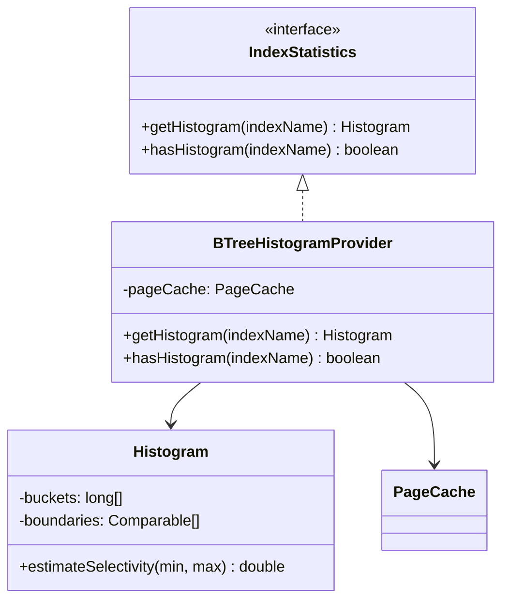
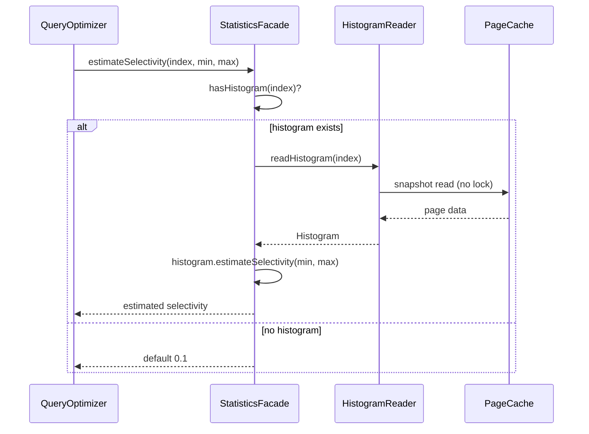

# Design Document Rules

The plan must be accompanied by a separate **design document** at
`docs/adr/<dir-name>/design.md` that explains **what will be implemented at a
design level** — not code, but the structural and behavioral design of the
solution.

## Purpose

- Bridge the gap between high-level architecture (Component Map, Decision Records)
  and track-level execution details
- Make complex or non-obvious parts of the implementation explicit so the execution
  agent and reviewers can verify intent without reverse-engineering code
- Provide a single place where the overall design can be understood as a coherent
  whole, not just as a collection of tracks

## Required content

**1. Class diagrams (Mermaid `classDiagram`)** — Show the key classes, interfaces,
and their relationships that this plan introduces or modifies. Focus on:
- New classes/interfaces and their responsibilities
- Inheritance and composition relationships
- Key method signatures that define the contracts between components
- Only include classes relevant to this plan — do not diagram the entire codebase

Include class diagrams when the plan introduces 2+ new classes/interfaces or
modifies relationships between existing classes.

Example:

````markdown

````

**2. Workflow/sequence diagrams (Mermaid `sequenceDiagram` or `flowchart`)** — Show
the runtime behavior of key operations. Use sequence diagrams for interactions
between components over time; use flowcharts for decision logic or state transitions.

Include workflow diagrams when the plan introduces a new operation flow or
significantly modifies an existing one.

Example:

````markdown

````

**3. Dedicated paragraphs for complex or opaque parts** — Any part of the design
that is non-obvious, involves subtle trade-offs, or could be misunderstood must
have its own section with:
- **What** the complex part is
- **Why** it is designed this way (not just what it does, but the reasoning)
- **Gotchas** — subtle behaviors, edge cases, or invariants that are easy to miss

Mark these with a `## <Topic>` heading. Examples of things that warrant dedicated
sections:
- Concurrency or locking strategies
- Crash recovery or durability guarantees
- Performance-sensitive paths with specific algorithmic choices
- Backward compatibility shims or migration logic
- Interactions with external systems or SPIs

## Rules

1. **Separate file** — the design document lives at `docs/adr/<dir-name>/design.md`,
   not inside the implementation plan.
2. **All diagrams must be Mermaid** — use `classDiagram`, `sequenceDiagram`,
   `flowchart`, or `stateDiagram` as appropriate. No external tools or image files.
3. **Design level, not code level** — describe classes, interfaces, relationships,
   and flows. Do not include implementation details like variable names, loop
   constructs, or error handling minutiae.
4. **Pair every diagram with prose** — a diagram without explanation is ambiguous.
   Always follow a diagram with a brief description of what it shows and why the
   design was chosen.
5. **Keep diagrams focused** — cap class diagrams at ~10-12 classes, sequence
   diagrams at ~6-8 participants. Split into multiple diagrams if larger.
6. **Complex parts are mandatory** — if any part of the design involves concurrency,
   crash recovery, performance-critical paths, or non-obvious invariants, it MUST
   have a dedicated section. Omitting these is a structural review finding.
7. **Frozen after Phase 1** — the original `design.md` is never modified after
   planning. A separate `design-final.md` is produced in Phase 4 to capture the
   actual implemented design. Both are kept for planned-vs-actual comparison.

## Structure

```markdown
# <Feature Name> — Design

## Overview
<Brief summary of the design approach — what the solution looks like at a
structural level, which major components are involved, and how they interact.>

## Class Design
<Mermaid classDiagram(s) + prose explaining responsibilities and relationships>

## Workflow
<Mermaid sequenceDiagram(s) and/or flowchart(s) + prose explaining runtime flows>

## <Complex Topic 1>
<Dedicated paragraph: what, why, gotchas>

## <Complex Topic 2>
<Dedicated paragraph: what, why, gotchas>
```
