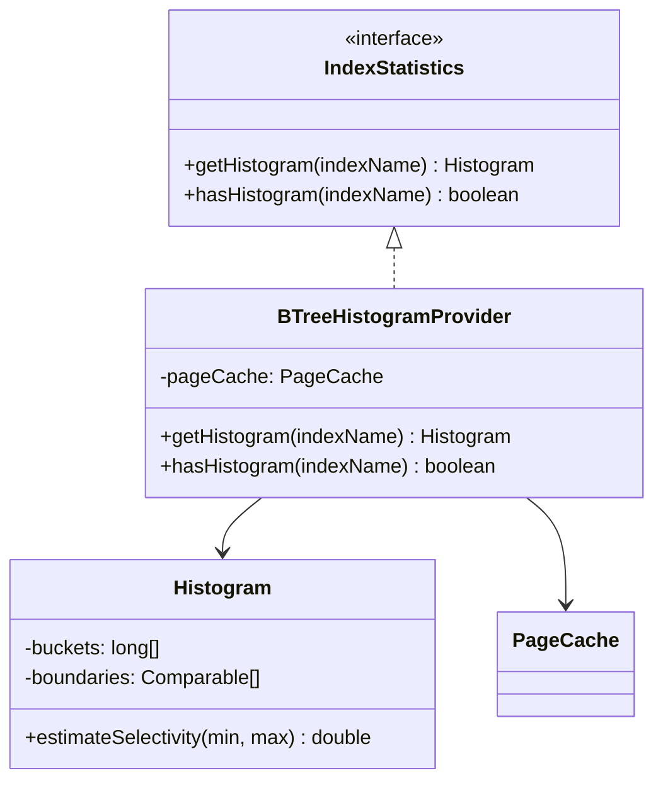
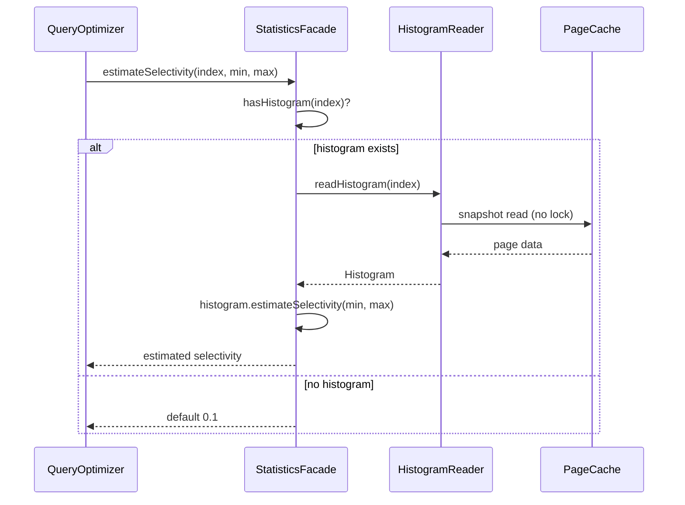

# Design Document Rules

The plan must be accompanied by a separate **design document** at
`docs/adr/<dir-name>/design.md` that explains **what will be implemented at a
design level** — not code, but the structural and behavioral design of the
solution.

## Purpose

- Bridge the gap between high-level architecture (Component Map, Decision Records)
  and track-level execution details
- Make complex or non-obvious parts of the implementation explicit so the execution
  agent and reviewers can verify intent without reverse-engineering code
- Provide a single place where the overall design can be understood as a coherent
  whole, not just as a collection of tracks
- Hold the **long-form** material that supports plan-level decisions
  (worked examples, layered diagrams, multi-paragraph rationale,
  crash-scenario walk-throughs) so the implementation plan can stay
  thin and strategic — see "Boundary with the implementation plan"
  below.

## Boundary with the implementation plan

The plan corpus is split across files with a strict content
boundary. Putting prose in the wrong file inflates the
`/execute-tracks` startup load (the plan file is read at every
session) and routinely produces duplication between the plan and the
design document.

| File | What it carries |
|---|---|
| `implementation-plan.md` | Goals, constraints, the **decisions themselves** (alternatives / rationale / risks / where-implemented / link-to-design), the Component Map (topology + short intent bullets), short invariant statements, short integration-point bullets, the track checklist. **Strategic, scannable, loaded every session.** |
| `design.md` | Reader Orientation; concept-first Overview; class diagrams; sequence/flow diagrams; **TL;DR-shaped** entries for every complex topic; condensed mechanism overview; edge-case bullets; references footer. **Loaded only when referenced; serves both human reviewers and execution agents.** |
| `design-mechanics.md` (optional, length-triggered) | Long-form derivations, file:line citations, edit-list subsections, full state-machine tables, exhaustive worked examples that don't fit in design.md's mechanism overview. **Created only when design.md exceeds the length trigger; cross-referenced from design.md's References footer.** |
| `implementation-backlog.md` | Per-track concrete deliverables — files, classes, methods, edit lists, ordering constraints, track-level diagrams. **Per-track edit detail, loaded only in Phase A of one track per session.** |

> **The rule, succinctly:** if you find yourself writing a worked
> example, a multi-paragraph derivation, a code-change inventory, or
> a "here is how all the pieces fit together" walk-through inside a
> decision record, an invariant, or an integration-point bullet,
> **stop and move it to `design.md`** (or, if it is per-track edit
> detail, to `implementation-backlog.md`). Replace the original
> location with a one-line link.

The reciprocal pointer is the `**Full design**: design.md §<section>`
line in the Decision Record template (see `planning.md` § Decision
Records). When a DR has long-form support, the DR itself stays at the
four-bullet form and the long-form material lives in `design.md` under
a section the DR links to.

**What this looks like in practice:**

- A decision whose rationale is "we picked B over A because A doesn't
  satisfy invariant X" — that's a 1-line rationale, no `design.md`
  section needed.
- A decision whose rationale needs a worked example (e.g., walking
  through what happens to a transaction when the rollback log is
  evicted mid-commit) — keep the four-bullet rationale at one
  sentence, then add a `design.md` section titled "Rollback log
  eviction during commit" that walks the example, and link to it from
  the DR's `**Full design**` line.
- An invariant like "WAL atomic operation boundaries enclose the
  histogram update" — one bullet, no `design.md` section needed.
- An invariant whose semantics need a multi-paragraph derivation
  (e.g., why the read path is safe under concurrent eviction) — keep
  the invariant entry at one bullet stating the rule, and add a
  `design.md` complex-topic section that derives it.

## Mutation discipline: every change is one atomic action

**Every modification to `design.md`** (and `design-mechanics.md`
when it exists) **is implemented as one atomic action that
internally bundles `(apply edit → auto-review → bounded iterate
→ present)`. The agent never directly Edits these files mid-
conversation; it invokes the mutation action, which wraps the
review gate.**

The discipline applies to every situation that touches the
design:

- Initial creation in Phase 1 (`phase1-creation`)
- Interactive iteration during Phase 1 (`mechanics-edit`,
  `design-sync`)
- Inline replanning during Phase 3 ESCALATE (direct mutation
  kinds — `content-edit`, `section-add`, etc.)
- Phase 4 production of `design-final.md` /
  `design-mechanics-final.md` (`phase4-creation`)

The same gate fires every time. Without this discipline, the
shape rules in the rest of this document are aspirational —
they catch failure modes only if someone or something runs the
check. Bundling the review with the write makes the rules
self-enforcing.

### The atomic action

Each mutation invocation receives:

- The intended edit (the diff, or the full new section content)
- The mutation kind, drawn from the full set of 11:
  - **Direct mutation kinds** (existing-doc edits, full discipline runs
    on every mutation): `content-edit`, `section-add`, `section-remove`,
    `section-rename`, `section-move`, `structural-rewrite`,
    `length-trigger-crossing`.
  - **Working/sync kinds** (Phase 1 iteration loop, deferred cold-read on
    mechanics): `phase1-creation`, `mechanics-edit`, `design-sync`.
  - **Phase 4 kind** (one-shot creation of the committed final artifact):
    `phase4-creation`.

  See the cold-read scope table below for the per-kind discipline; the
  full lifecycle for the working/sync kinds lives in § Two-mode editing —
  working vs sync.
- An iteration budget (default: 3 rounds)

The action runs:

1. **Apply edit.** Write the change to disk.
2. **Auto-review.** Two halves:
   - **Mechanical checks** — cheap, always run. See checks
     table below.
   - **Cold-read** — sub-agent reads the doc fresh, no prior
     context. Scope depends on mutation kind (see scope table
     below).
3. **Iterate.** If review finds blockers, attempt to fix and
   re-review. Bounded by the iteration budget. If the budget
   exhausts with blockers remaining, present findings + diff
   to the user for manual resolution rather than continuing
   to iterate.
4. **Present.** Show the user the resulting diff + the
   auto-review log. The action is complete.

The user never invokes the mechanical checks or the cold-read
directly; they invoke the mutation action and receive the
final state.

**Concrete invocation.** The design-doc mutation action is
implemented as the `edit-design` skill at
[`.claude/skills/edit-design/SKILL.md`](../../.claude/skills/edit-design/SKILL.md).
The mechanical checks half is the script at
[`.claude/scripts/design-mechanical-checks.py`](../../.claude/scripts/design-mechanical-checks.py).
The cold-read half is the sub-agent prompt at
[`prompts/design-review.md`](prompts/design-review.md). When the
agent needs to modify `design.md` or `design-mechanics.md`, it
invokes the skill — not raw `Edit` / `Write`.

### Cold-read scope by mutation kind

In the table below, the `--target` column reads as a function of whether a
`design-mechanics.md` companion exists. "design.md only" designs use
`--target=design`; designs that also touch mechanics (because the seeding
or rename or rewrite spans both files) use `--target=both`. Mutation kinds
whose `--target` depends on this condition are written as
`design \| both` and resolved by the `edit-design` skill at invocation
time.

| Mutation kind | Touches | Mechanical `--target` | Cold-read scope |
|---|---|---|---|
| `phase1-creation` (initial seed) | `design.md` only when mechanics is not needed; both files when the design will exceed the length trigger or already plans for a mechanics companion | `design \| both` | **Whole-doc** on `design.md` (mechanics is exempt — it's agent-targeted long-form) |
| `mechanics-edit` (working-mode edit) | mechanics only | `mechanics` | **NONE** — cold-read deferred to next `design-sync` |
| `design-sync` (re-distill design.md from current mechanics) | both files | `both` | **Whole-doc** on `design.md`, plus mechanics-link sweep |
| `content-edit` within an existing section | `design.md` | `design` | **Bounded** — changed section + 1-2 surrounding sections + Overview + (when present) Core Concepts |
| `section-add` | `design.md` | `design` | **Bounded** — new section + Overview + (when present) Core Concepts + structure roadmap (for placement check) |
| `section-remove` | `design.md` (+ plan/backlog ref cleanup) | `design` | **Whole-doc** — verify no broken references and no orphaned forward-pointers |
| `section-rename` | `design.md` + (when mechanics exists) the matching section in `design-mechanics.md` + plan/backlog ref propagation | `design \| both` | **Whole-doc** — every cross-reference to the renamed section must be updated, including the matching mechanics heading and every `**Full design**` ref in plan and backlog |
| `section-move` | `design.md` | `design` | **Whole-doc** — verify the new placement makes sense in the reader journey |
| `structural-rewrite` (multiple section adds/moves/renames) | `design.md` + (when mechanics exists and any rename or split propagates) the matching sections in `design-mechanics.md` | `design \| both` | **Whole-doc** |
| `length-trigger-crossing` (file crosses the 2,000-line / 50,000-token trigger) | both files | `both` | **Whole-doc** — verify split into `design-mechanics.md` is correctly applied |
| `phase4-creation` (Phase 4 production of `design-final.md` ± `design-mechanics-final.md`) | `design-final.md` + (optional) `design-mechanics-final.md` | `both` if mechanics-final exists, else `design` | **Whole-doc** on `design-final.md`. Plan/backlog ref propagation is **N/A** — Phase 4 produces a *new* committed artifact whose section structure may differ from the original `design.md`; the plan/backlog `**Full design**` refs continue to point at the original (frozen) `design.md`, not at the final variant. The skill omits `--plan-path` / `--backlog-path` so the cross-file ref check is naturally skipped. |

**Periodic whole-doc check.** Every Nth design-touching mutation
(default N=5, counted from the review log) triggers a whole-doc
cold-read regardless of the kind, to catch coherence drift across
many small edits. `mechanics-edit` mutations do **not** increment
this counter.

**Two distinct counters.** Both fire at "5", but they count
different things and trigger different actions. A small table to
keep them apart:

| Counter | Counts | Resets on | Triggers |
|---|---|---|---|
| Periodic whole-doc counter | All mutation log entries except `mechanics-edit` | Never resets — it's a running modulo over the log | Cold-read scope is escalated to `whole-doc` for the current mutation, regardless of its declared scope |
| Working-mode counter | `mechanics-edit` entries since the most recent `design-sync` (or since `phase1-creation` if no sync has happened yet) | Resets to 0 on every `design-sync` | The skill surfaces *"5 mechanics edits have accumulated since the last sync — want me to run `design-sync`?"* at the next conversational turn |

Both default to N=5 today; if that turns out to be confusing in
practice, change one of the two thresholds rather than relying on
context to disambiguate.

### Mechanical checks (always run)

| Check | Detection |
|---|---|
| Overview first | First `## ` heading must be `## Overview` (concept-first ordering — meta-navigation is folded into Overview's tail, not given its own header) |
| Core Concepts when applicable | If the doc has `# Part N` headings, a `## Core Concepts` section must exist between Overview and Class Design (`should-fix` if absent) |
| Per-section shape compliance | Per `^## ` section (excluding shape-exempt: Overview, Core Concepts, Class Design, Workflow, Part-level TL;DR): TL;DR present (`\*\*TL;DR\.\*\*` or similar bold-prefix paragraph in the first ~10 lines); References footer present (`### References` or `\*\*References\.\*\*` near section end) |
| Top-level cap | Flat count of `^## ` ≤ 15 always; when `# Part N` headings exist, an additional per-Part cap of ≤ 8 sections (warn at > 6) applies on top of the flat 15 |
| Per-section length cap | Each `^## ` section ≤ 300 lines (warn at 200) |
| D/S parenthetical asides | Regex set: `(per D…)`, `(per S…)`, `(see D…)`, `(see S…)`, each with optional comma- or slash-separated additional codes (`(per D1, D2)`, `(see S5/S6)`). Rejected inside prose; allowed inside `### References` / `**References.**` blocks and table rows. |
| Length trigger compliance | If file > 2,000 lines and `design-mechanics.md` doesn't exist, blocker |
| Same-shape sibling detection | Cluster of 3+ sibling `## ` sections with ≥80% sub-heading-name overlap → flag for consolidation |
| `Mechanics:` / mechanics-link resolution | Every `design-mechanics.md §"<name>"` reference appearing in `design.md` resolves to a real heading in `design-mechanics.md`. The check is applied to all such references — the canonical home for these is the per-section `Mechanics:` line in the References footer, but the script flags any unresolved reference regardless of how the line is prefixed. |
| `**Full design**` link resolution | Every `**Full design**: design.md §"<name>"` in `implementation-plan.md` and `implementation-backlog.md` resolves to a real section in `design.md` (and any chained `design-mechanics.md §"<name>"` resolves in mechanics). This is also the check that catches stale references after a rename — when a `section-rename` (or rename inside `structural-rewrite`) has not propagated, the un-updated `**Full design**` and `Mechanics:` lines simply fail to resolve here, blocking the mutation. |

### Findings and severities

- **blocker** — the mutation cannot stand. The iteration budget
  is consumed attempting to fix; if the budget exhausts with the
  blocker remaining, the action presents the diff + findings to
  the user and stops without "succeeding."
- **should-fix** — the mutation can stand but the finding should
  be addressed before completion. Iteration attempts a fix; if
  the budget exhausts, the finding is recorded in the review log
  and the action completes with a warning.
- **suggestion** — recorded in the review log, not retried
  automatically.

### Review log

Each mutation appends to
`docs/adr/<dir-name>/reviews/design-mutations.md`. Format per
entry:

```markdown
## Mutation N — <ISO date> — <mutation kind>

**Diff summary**: <one paragraph>

**Mechanical checks**: <PASS / N findings>
**Cold-read** (scope: <bounded|whole-doc>): <PASS / N findings>

**Findings**:
- <severity>: <description>

**Iterations**: 1 of 3 (PASS) | 3 of 3 (BLOCKER REMAINS)
```

The review log is a working artifact (deleted with the branch),
not committed — same lifecycle as other Phase working files.

### Cold-read sub-agent prompt

The cold-read half of the auto-review is implemented by the
prompt at
[`prompts/design-review.md`](prompts/design-review.md). The
prompt instructs a fresh sub-agent to read the design document
without context, answer comprehension questions, and report
structural findings. The mutation action invokes it once per
auto-review cycle (skipped entirely for `mechanics-edit`).

## Two-mode editing — working vs sync

Two complementary workflows live inside the mutation discipline.
Pick the right one based on where you are in the plan lifecycle.

### Direct mutation (existing kinds)

`content-edit`, `section-add`, `section-remove`, `section-rename`,
`section-move`, `structural-rewrite`, `length-trigger-crossing`.
Every mutation runs the **full discipline** (mechanical +
cold-read) on the file(s) the mutation actually touches — usually
`design.md` alone, but `length-trigger-crossing` and any
`section-rename` / `structural-rewrite` that propagates into a
mechanics companion will run mechanical and cold-read against both
files. Best for small, targeted changes after the design is
published — for example, a Phase 3 inline-replanning bullet add,
or a Phase 4 `design-final.md` edit.

### Working / sync (the iterative model)

For Phase 1 initial creation and any phase where the user wants to
iterate on the design with `design.md` staying stable as a
reference between batches, the workflow has three sub-phases:

```
Phase 1.1  phase1-creation     ── seed both files; full discipline
   │                             on design.md, stripped checks on
   │                             mechanics.
   ▼
Phase 1.2  mechanics-edit      ── agent processes user feedback by
   │ ↻                           mutating mechanics; mechanical-only
   │                             checks fire; cold-read DEFERRED;
   │                             working-mode counter increments.
   ▼
Phase 1.3  design-sync         ── re-distill design.md from current
   │                             mechanics; full discipline runs;
   │                             working-mode counter resets to 0.
   │
   └─→ back to Phase 1.2 or out to Phase 2 when stable.
```

**Why the split exists.** During iteration, distilling design.md
on every mechanics tweak is expensive (cold-read fires per change)
and produces churn in the human-facing summary. Working mode lets
mechanics evolve freely under cheap mechanical checks; sync
batches the distillation into one expensive review pass at a
deliberate publish point.

**Stable reference for review.** Between syncs, `design.md` stays
**frozen** relative to mechanics. The user reads `design.md` to
understand the design, then issues feedback against it. The
agent processes feedback by editing `mechanics`, not `design.md`.

**Sync trigger — hybrid.** Sync runs when **either**:
- The user explicitly requests it ("update design.md", "run
  design-sync", "publish the polished version", or any phrasing
  that conveys intent), **or**
- The working-mode counter reaches `N=5` and the agent
  auto-suggests at the next conversational turn: *"5 mechanics
  edits have accumulated since the last sync. Want me to run
  `design-sync` now, or keep iterating?"*

The user can defer the auto-suggestion. The skill does not
auto-trigger the sync — the user is the gate.

**What sync does.** The agent re-distills `design.md` from the
current state of `design-mechanics.md`:
- Each section's TL;DR + mechanism overview is re-written to
  reflect the current mechanics.
- Edge cases / Gotchas bullets are added/removed/edited.
- References footers updated for new D/S codes and any
  `Mechanics:` link changes.
- Sections **added** in mechanics get a corresponding new section
  in `design.md`.
- Sections **removed** in mechanics are removed from `design.md`.
- Sections **renamed** in mechanics propagate the rename to
  `design.md` and to every `**Full design**` ref in plan and
  backlog.

The sync's cold-read sub-agent gets an extended instruction:
*"Verify that every TL;DR and mechanism overview in design.md
accurately summarizes the current mechanics file's content for
the same-named section."*

**Staleness reconciliation.** Because `design.md` is frozen
between syncs while mechanics evolves, the user's feedback may
reference a `design.md` statement that mechanics has already
moved past. The agent reconciles explicitly rather than blindly
re-applying — see `edit-design/SKILL.md § Staleness reconciliation`
for the prompt template.

**Working/sync is preferred but not mandatory.** Small designs
(under ~5 sections) and one-off edits can use direct mutation
without the working/sync ceremony. The working/sync model pays
off when iteration depth justifies the deferred-cold-read win
— typically once the user has issued ≥3 substantive feedback
rounds on the same design.

## Overview (mandatory, first content)

Every `design.md` opens with a `## Overview` section as the first
content under the title. This is where a cold reader lands; it
must be **concept-first**, plain language, and short enough to
read in one sitting (≤40 lines).

The Overview carries, in order:

1. **The baseline being replaced**, in concrete terms. ("YouTrackDB
   today buffers all of a transaction's writes until commit, then
   flushes them as one atomic batch.")
2. **The change**, named and scoped. ("This design replaces that
   with in-place page updates scoped to a single component
   operation.")
3. **The enabling primitive(s)** — one or two sentences naming the
   load-bearing addition that makes the change possible.
4. **What else is restructured to fit** — a brief enumeration of
   the subsystems that change as a consequence of the core change.
5. **Companion-file pointer** (when `design-mechanics.md` exists)
   — a 2-3 line note on the section-name convention, the
   directionality rule (cross-refs go `design.md →
   design-mechanics.md`, never the reverse), and which artifacts
   (typically diagrams) appear in both files.
6. **Document-structure roadmap** — one sentence summarizing what
   the rest of the doc covers, in order. ("The rest of this
   document is structured as: Core Concepts → Class Design →
   Workflow → seven Parts that each tell one arc of the story.")

The Overview does **not** carry meta-navigation (audience block,
journey table). Those — when needed at all — go either into Core
Concepts' inline `→ Part X` pointers or are absorbed by the
Overview's structure roadmap. The doc's shape (TL;DRs at section
tops, References footers) makes the audience model self-evident
without an explicit block.

Absence of `## Overview` as the first `##` heading is a blocker.

## Core Concepts (mandatory when applicable)

When the design uses `# Part N` headings or introduces ≥3 new
domain terms that the reader will meet in subsequent sections,
add a `## Core Concepts` section **between Overview and Class
Design**. This is the vocabulary primer: each new term gets a
paragraph that names it, defines it in plain language, states
its delta from the baseline, and points at the Part(s) that
elaborate it.

```markdown
## Core Concepts

This design introduces N load-bearing ideas. Each is named and
used without re-definition in the Parts that follow; if a Part
later references one of these concepts, the relevant definition
is here. Each entry pairs the new concept with what it replaces,
so the delta from the baseline is visible at a glance.

**<Concept name>.** <One-sentence definition in plain language.>
<One sentence on the role this concept plays in the design.>
Replaces "<the corresponding baseline behavior>". → Part X
§"<elaborating section>".

**<Next concept>.** …
```

**Why a separate section.** Overview at ≤40 lines cannot absorb
seven new domain terms with their definitions and deltas; Class
Design jumps straight into structural detail using the
vocabulary; Parts dive into mechanics assuming the reader already
has it. Core Concepts is the missing layer that lets the reader
acquire vocabulary in one place before the deep dives. It also
absorbs what would otherwise be a separate "Key Changes" section
— each concept paragraph naturally states its delta from
baseline.

**Format rules:**

- 5-9 concepts is the sweet spot; under 3 means Overview was
  enough, over 10 means the boundary between "core" and "Part-
  internal" got blurry.
- Each concept paragraph: ≤8 lines. Plain language; technical
  precision is the Part's job. The Core Concepts entry is the
  reader's hook to know what to look for in the Part.
- Each concept ends with a `→ Part X §"<section>"` pointer (or a
  comma-separated list of multiple pointers for cross-cutting
  concepts).
- The section's intro paragraph (before the first concept) is the
  TL;DR-equivalent — it states how many concepts are below and
  the meta-pattern (one paragraph each, definition + role +
  delta + pointer). Don't add a separate `**TL;DR.**` block.
- No References footer required. The `→` pointers act as the
  References for each concept.

**Conditions for omitting:**

- Designs with no `# Part N` headings AND fewer than 3 new domain
  terms can skip Core Concepts. The Overview's enumeration of
  enabling primitives + restructured subsystems is enough.
- For agent-facing reviewers and execution agents, Core Concepts
  is also the section to load when starting a new track — it's
  the minimum vocabulary needed to read the relevant Part.

A multi-Part design without `## Core Concepts` is a
`should-fix` finding (not blocker — the design can stand without
it but the cold reader pays for its absence).

## Per-section mandatory shape

Every section under `design.md` (every `##` heading after the
preamble) follows a four-block shape:

```markdown
## <Section title>

**TL;DR.** <≤5 lines, plain prose, what + why. No file:line
citations. No parenthetical D/S asides like *(per D27)*. D/S
codes are allowed only when the decision IS the subject of the
sentence ("D27 makes histograms volatile").>

<Mechanism overview — diagrams + prose. Aim for ≤300 lines per
section (warn at 200). When a worked example or layered
derivation pushes past that, move it to `design-mechanics.md`
and link from the References footer.>

### Edge cases / Gotchas

- <bullets, one per gotcha>

### References

- D-records: D<n>, D<n>, …
- Invariants: S<n>, S<n>, …
- Mechanics: `design-mechanics.md §"<matching section name>"` —
  brief description of what's there
```

The mechanism block can have nested `###` subsections when the
content is structured (e.g., comparison tables, step-by-step
mechanism). Edge cases / Gotchas and References are sticky
trailing blocks.

## Top-level structure caps

- **Max ~15 top-level `##` sections in `design.md`.** Overflow
  forces either grouping into `# Part N — <name>` headings (one
  level up from `##`) or moving long-form material to
  `design-mechanics.md`.
- **Max ~300 lines per `##` section.** Warn at 200. Exceeding is
  a signal that long-form material has leaked in; move it to
  `design-mechanics.md`.
- **Reader-journey Parts are encouraged when the design has
  ≥6 distinct concern areas.** Group related sections under
  `# Part N — <name>` with a 1-2 sentence intro paragraph.
  Examples (project-agnostic): Read Path / Write Path / Rollback
  / Recovery / Testing.

## Consolidation form for sibling sections

When 3+ sibling `##` sections share the same internal structure
(same recurring sub-headings, same kind of content), **they MUST
be consolidated** into one parent section with the following
shape:

```markdown
## <Parent topic>

### TL;DR
<Pattern overview — what these instances have in common, why they
share a shape.>

### Comparison
<Table with one column per instance, one row per axis. Or one row
per instance, one column per axis — whichever fits.>

### Per-instance short bodies
**Instance A.** <2-4 sentence body covering what's specific.>
**Instance B.** <…>
**Instance C.** <…>

### Edge cases / Gotchas
<Shared. Per-instance gotchas live in design-mechanics.md.>

### References
- D-records: <one D-code per instance>
- Mechanics: `design-mechanics.md §"<each original section name>"`
```

The fully-detailed mechanism for each instance lives in
`design-mechanics.md` under its **original** section name, so
`implementation-plan.md`'s per-D `**Full design**` references
remain stable across the consolidation. The plan's link points
at the design.md Part 5 sub-section for the TL;DR, which footers
out to design-mechanics.md for the deep dive.

This form is what prevents the "9 sibling sections that all repeat
the same shape" anti-pattern.

## Length-triggered split into `design-mechanics.md`

When `design.md` exceeds **~2,000 lines / ~50,000 tokens** after
the per-section shape and consolidation rules have been applied,
the long-form mechanism content moves to a sibling
`design-mechanics.md`. The rule:

- `design.md` keeps: Overview, Core Concepts (when applicable),
  all class / workflow diagrams, every `##` section's TL;DR +
  mechanism overview + edge cases + references footer. Diagrams
  stay in `design.md` (visible to humans first).
- `design-mechanics.md` carries: long-form mechanism walk-throughs
  (deeper than the `design.md` overview prose), full state-machine
  tables, per-instance per-stat detail in a consolidated family,
  exhaustive worked examples, file:line citations, edit-list
  subsections.

**Section names match between the two files.** When a section in
`design.md` references its detailed mechanics, the link reads:
`Mechanics: design-mechanics.md §"<exact same section name>"`
(canonical form — same wording inside the per-section References
footer template above and on standalone inline lines). This
stability is what keeps `implementation-plan.md`'s per-D
`**Full design**` references resolvable across the split.

**Cross-references go one direction:** `design.md →
design-mechanics.md`, never the reverse. `design-mechanics.md`
must be self-contained for the agent reader who lands on a
specific mechanism without needing to flip back.

**Diagrams may appear in both files.** They are small and high-
value at both levels. When a diagram is updated, both copies must
be updated to match. This is the one acceptable form of
duplication — prose is not duplicated.

**Default is single file.** Most plans don't hit the length
trigger. The split is the escape hatch for plans whose mechanism
detail genuinely exceeds the budget; small designs stay in one
file.

## D/S code discipline

D-records (`D1`, `D27`, …) and invariant codes (`S5`, `S16`, …)
are load-bearing cross-references for execution agents but
visually noisy for human reviewers when scattered through prose.
Three rules:

1. **Forbidden as parenthetical asides anywhere.** Do not write
   "(per D27)" or "(see S14)" as inline qualifiers; they
   interrupt the narrative without adding information the
   reader can act on at that point.
2. **Allowed in mechanism prose when the code IS the subject of
   the sentence.** "D27 makes histograms volatile in steady
   state" is fine. "Histograms are volatile (D27)" is not.
3. **Collected in the References footer.** Every section ends
   with a References block listing every D and S code the
   section relates to. This is the load-bearing list for the
   execution agent.

**TL;DR exception.** When the section topic IS the consolidated
set of decisions (e.g., a Part titled "Volatile Statistics"
covering D27/D28/D29/D30/D31/D33/D34/D35/D38), the TL;DR may
name the D-codes because they are the subject. Use sparingly.

## Section naming stability

Renames and consolidations break references. When `design.md` or
`design-mechanics.md` is restructured, every `**Full design**:
design.md §"<section name>"` line in `implementation-plan.md`
and `implementation-backlog.md` that references the old name
**MUST be updated in the same commit** that renames the section.
Same rule for any file that cross-links to the design document.

The structural review's design-doc bloat checks include a "Full
design refs resolve" check that follows every `**Full design**`
line and verifies the target section exists.

When consolidating sibling sections via the consolidation form
above, prefer keeping the **original section names in
`design-mechanics.md`** so per-D refs stay stable; the
restructured names live in `design.md`'s consolidated parent.

## Required content

Overview and Core Concepts are covered in their dedicated sections
above (§ Overview, § Core Concepts). The remaining required content
is the diagrams and complex-part sections — Mermaid examples below.

**1. Class diagrams (Mermaid `classDiagram`)** — Show the key classes,
interfaces, and their relationships that this plan introduces or
modifies. Focus on:
- New classes/interfaces and their responsibilities
- Inheritance and composition relationships
- Key method signatures that define the contracts between components
- Only include classes relevant to this plan — do not diagram the entire codebase

Include class diagrams when the plan introduces 2+ new classes/interfaces or
modifies relationships between existing classes.

Example:

````markdown

````

**2. Workflow/sequence diagrams (Mermaid `sequenceDiagram` or `flowchart`)** — Show
the runtime behavior of key operations. Use sequence diagrams for interactions
between components over time; use flowcharts for decision logic or state transitions.

Include workflow diagrams when the plan introduces a new operation flow or
significantly modifies an existing one.

Example:

````markdown

````

**3. Dedicated `##` sections for complex or opaque parts**, each
following the per-section mandatory shape (TL;DR + mechanism
overview + edge cases + references footer). Examples of things
that warrant dedicated sections:
- Concurrency or locking strategies
- Crash recovery or durability guarantees
- Performance-sensitive paths with specific algorithmic choices
- Backward compatibility shims or migration logic
- Interactions with external systems or SPIs

## Rules

1. **Separate file** — the design document lives at `docs/adr/<dir-name>/design.md`,
   not inside the implementation plan.
2. **All diagrams must be Mermaid** — use `classDiagram`, `sequenceDiagram`,
   `flowchart`, or `stateDiagram` as appropriate. No external tools or image files.
3. **Design level, not code level** — describe classes, interfaces, relationships,
   and flows. Do not include implementation details like variable names, loop
   constructs, or error handling minutiae.
4. **Pair every diagram with prose** — a diagram without explanation is ambiguous.
   Always follow a diagram with a brief description of what it shows and why the
   design was chosen.
5. **Keep diagrams focused** — cap class diagrams at ~10-12 classes, sequence
   diagrams at ~6-8 participants. Split into multiple diagrams if larger.
6. **Overview is mandatory and first content.** Concept-first
   elevator pitch, ≤40 lines. Meta-navigation (audience block,
   journey table) is folded into Overview's tail or Core
   Concepts' inline `→ Part X` pointers — not given its own
   header. See § Overview (mandatory, first content).
7. **Core Concepts is mandatory when the doc has `# Part N`
   headings or introduces ≥3 new domain terms.** Vocabulary
   primer between Overview and Class Design. See § Core Concepts
   (mandatory when applicable). For small designs (no Parts,
   ≤2 new domain terms) Core Concepts is optional.
8. **Per-section shape is mandatory for content sections** —
   TL;DR + mechanism overview + edge cases + references footer.
   The shape-exempt sections are Overview, Core Concepts, Class
   Design, Workflow, and Part-level `## TL;DR` sections — each
   has its own format defined in the relevant rule. See § Per-
   section mandatory shape.
9. **Top-level structure caps apply** — ≤15 `##` sections;
   ≤300 lines per section. Group into `# Part N` headings or
   move long-form to `design-mechanics.md` when exceeded.
10. **Consolidate sibling sections that share structure.** 3+
    siblings with the same internal sub-heading sequence MUST be
    merged using the consolidation form.
11. **Length-triggered split.** When `design.md` exceeds ~2,000
    lines / ~50,000 tokens, agent-targeted long-form moves to
    `design-mechanics.md`. Section names match between files.
12. **D/S codes follow the discipline** — no parenthetical
    asides; allowed when subject; collected in References footer.
13. **Section renames update all `**Full design**` refs in plan
    and backlog same commit.**
14. **Complex parts are mandatory** — if any part of the design involves concurrency,
    crash recovery, performance-critical paths, or non-obvious invariants, it MUST
    have a dedicated section. Omitting these is a structural review finding.
15. **Frozen after Phase 1** — the original `design.md` (and
    `design-mechanics.md` if it exists) is never modified after
    planning. Phase 4 produces `design-final.md` (actual design,
    same shape rules) and `adr.md` (architecture decisions with
    actual outcomes) — the only git-tracked workflow artifacts.
    `design-final.md` goes through the mutation discipline via the
    `phase4-creation` kind; if the original had a mechanics
    companion, `design-mechanics-final.md` is created in the same
    invocation under matching section names.

## Structure

One annotated template covers all variants. Sections marked CONDITIONAL
appear only when their condition is met; sections marked OPTIONAL appear
only when scale justifies them.

```markdown
# <Feature Name> — Design

## Overview
<Concept-first elevator pitch, ≤40 lines. Closes with the
companion-file pointer (when `design-mechanics.md` exists) and a
one-sentence document-structure roadmap.>

## Core Concepts                  ← MANDATORY when doc has `# Part N`
                                    headings or introduces ≥3 new
                                    domain terms; OMIT otherwise.
<Intro paragraph: how many concepts, the meta-pattern (definition +
role + delta + → pointer).>

**<Concept 1>.** <Plain-language definition. Role in design.>
Replaces "<baseline>". → Part X §"<section>".

**<Concept 2>.** <…>
…

## Class Design
<Mermaid classDiagram(s) — each in a sub-section with TL;DR +
diagram + condensed prose + References footer>

## Workflow
<Mermaid sequenceDiagram(s) and/or flowchart(s) — same shape>

# Part 1 — <name>                 ← OPTIONAL grouping. Use when ≥6
                                    distinct concern areas justify
                                    reader-journey grouping.
<1-2 sentence intro>

## <Section under Part 1>
**TL;DR.** <≤5 lines>

<Mechanism overview>

### Edge cases / Gotchas
- <bullets>

### References
- D-records: …
- Invariants: …
- Mechanics: design-mechanics.md §"<name>"   ← ONLY when split applies

# Part 2 — <name>
…
```

When `design.md` exceeds the length trigger, a sibling
`design-mechanics.md` is created. It opens with a 4-line preamble
naming the convention, then per-section long-form content under
section names matching `design.md`:

```markdown
# <Feature Name> — Design Mechanics

> Companion to `design.md`. Long-form derivations, file:line
> citations, edit-list subsections, full state-machine tables.
> Cross-references go one direction: design.md → design-mechanics.md.
> Section names match `design.md` so per-D `**Full design**` refs
> resolve in either file.

## <Section name matching design.md>
<Long-form mechanism content>

…
```
