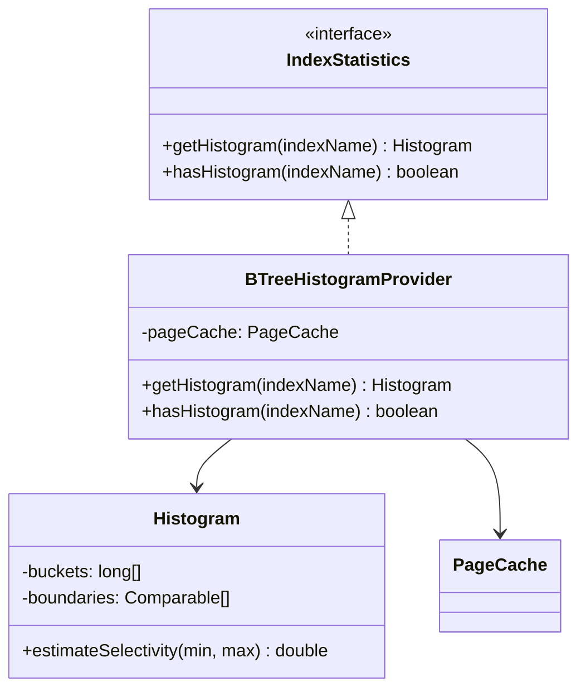
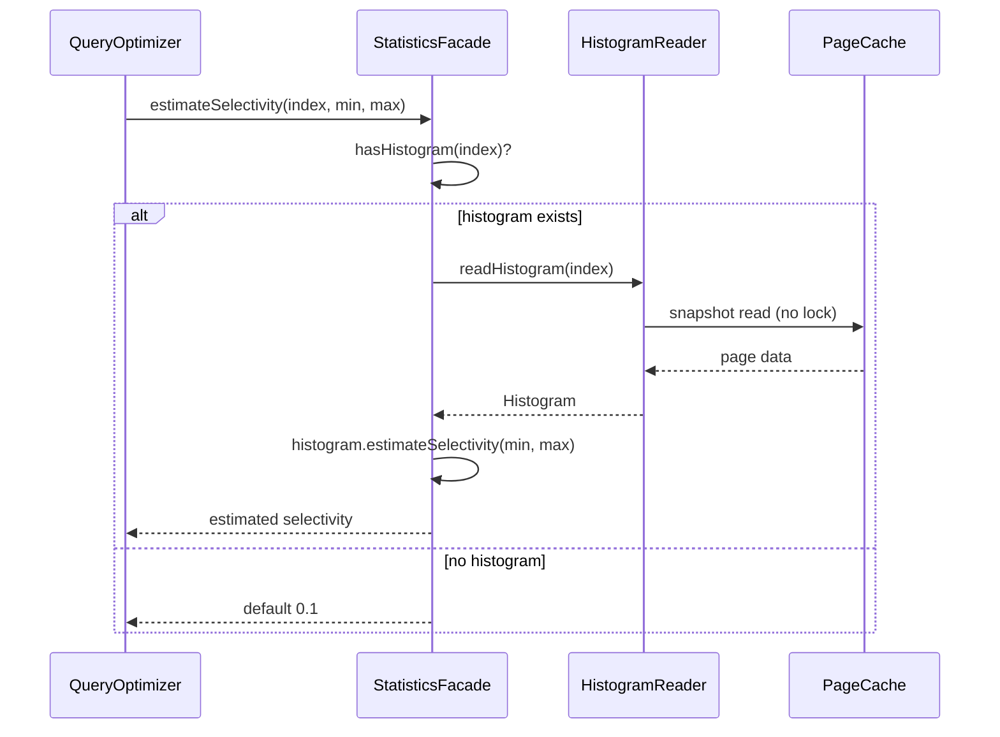

# Design Document Rules

The plan must be accompanied by a separate **design document** at
`docs/adr/<dir-name>/design.md` that explains **what will be implemented at a
design level** — not code, but the structural and behavioral design of the
solution.

## Purpose

- Bridge the gap between high-level architecture (Component Map, Decision Records)
  and track-level execution details
- Make complex or non-obvious parts of the implementation explicit so the execution
  agent and reviewers can verify intent without reverse-engineering code
- Provide a single place where the overall design can be understood as a coherent
  whole, not just as a collection of tracks
- Hold the **long-form** material that supports plan-level decisions
  (worked examples, layered diagrams, multi-paragraph rationale,
  crash-scenario walk-throughs) so the implementation plan can stay
  thin and strategic — see "Boundary with the implementation plan"
  below.

## Boundary with the implementation plan

The plan corpus is split across files with a strict content
boundary. Putting prose in the wrong file inflates the
`/execute-tracks` startup load (the plan file is read at every
session) and routinely produces duplication between the plan and the
design document.

| File | What it carries |
|---|---|
| `implementation-plan.md` | Goals, constraints, the **decisions themselves** (alternatives / rationale / risks / where-implemented / link-to-design), the Component Map (topology + short intent bullets), short invariant statements, short integration-point bullets, the track checklist. **Strategic, scannable, loaded every session.** |
| `design.md` | Reader Orientation; concept-first Overview; class diagrams; sequence/flow diagrams; **TL;DR-shaped** entries for every complex topic; condensed mechanism overview; edge-case bullets; references footer. **Loaded only when referenced; serves both human reviewers and execution agents.** |
| `design-mechanics.md` (optional, length-triggered) | Long-form derivations, file:line citations, edit-list subsections, full state-machine tables, exhaustive worked examples that don't fit in design.md's mechanism overview. **Created only when design.md exceeds the length trigger; cross-referenced from design.md's References footer.** |
| `implementation-backlog.md` | Per-track concrete deliverables — files, classes, methods, edit lists, ordering constraints, track-level diagrams. **Per-track edit detail, loaded only in Phase A of one track per session.** |

> **The rule, succinctly:** if you find yourself writing a worked
> example, a multi-paragraph derivation, a code-change inventory, or
> a "here is how all the pieces fit together" walk-through inside a
> decision record, an invariant, or an integration-point bullet,
> **stop and move it to `design.md`** (or, if it is per-track edit
> detail, to `implementation-backlog.md`). Replace the original
> location with a one-line link.

The reciprocal pointer is the `**Full design**: design.md §<section>`
line in the Decision Record template (see `planning.md` § Decision
Records). When a DR has long-form support, the DR itself stays at the
four-bullet form and the long-form material lives in `design.md` under
a section the DR links to.

**What this looks like in practice:**

- A decision whose rationale is "we picked B over A because A doesn't
  satisfy invariant X" — that's a 1-line rationale, no `design.md`
  section needed.
- A decision whose rationale needs a worked example (e.g., walking
  through what happens to a transaction when the rollback log is
  evicted mid-commit) — keep the four-bullet rationale at one
  sentence, then add a `design.md` section titled "Rollback log
  eviction during commit" that walks the example, and link to it from
  the DR's `**Full design**` line.
- An invariant like "WAL atomic operation boundaries enclose the
  histogram update" — one bullet, no `design.md` section needed.
- An invariant whose semantics need a multi-paragraph derivation
  (e.g., why the read path is safe under concurrent eviction) — keep
  the invariant entry at one bullet stating the rule, and add a
  `design.md` complex-topic section that derives it.

## Mutation discipline: every change is one atomic action

**Every modification to `design.md`** (and `design-mechanics.md`
when it exists) **is implemented as one atomic action that
internally bundles `(apply edit → auto-review → bounded iterate
→ present)`. The agent never directly Edits these files mid-
conversation; it invokes the mutation action, which wraps the
review gate.**

The discipline applies to every situation that touches the
design:

- Initial creation in Phase 1
- Interactive iteration during Phase 1 ("add a section about X")
- Inline replanning during Phase 3 ESCALATE
- Phase 4 production of `design-final.md`

The same gate fires every time. Without this discipline, the
shape rules in the rest of this document are aspirational —
they catch failure modes only if someone or something runs the
check. Bundling the review with the write makes the rules
self-enforcing.

### The atomic action

Each mutation invocation receives:

- The intended edit (the diff, or the full new section content)
- The mutation kind (one of: `content-edit`, `section-add`,
  `section-remove`, `section-rename`, `section-move`,
  `structural-rewrite`, `length-trigger-crossing`)
- An iteration budget (default: 3 rounds)

The action runs:

1. **Apply edit.** Write the change to disk.
2. **Auto-review.** Two halves:
   - **Mechanical checks** — cheap, always run. See checks
     table below.
   - **Cold-read** — sub-agent reads the doc fresh, no prior
     context. Scope depends on mutation kind (see scope table
     below).
3. **Iterate.** If review finds blockers, attempt to fix and
   re-review. Bounded by the iteration budget. If the budget
   exhausts with blockers remaining, present findings + diff
   to the user for manual resolution rather than continuing
   to iterate.
4. **Present.** Show the user the resulting diff + the
   auto-review log. The action is complete.

The user never invokes the mechanical checks or the cold-read
directly; they invoke the mutation action and receive the
final state.

**Concrete invocation.** The design-doc mutation action is
implemented as the `edit-design` skill at
[`.claude/skills/edit-design/SKILL.md`](../../.claude/skills/edit-design/SKILL.md).
The mechanical checks half is the script at
[`.claude/scripts/design-mechanical-checks.py`](../../.claude/scripts/design-mechanical-checks.py).
The cold-read half is the sub-agent prompt at
[`prompts/design-review.md`](prompts/design-review.md). When the
agent needs to modify `design.md` or `design-mechanics.md`, it
invokes the skill — not raw `Edit` / `Write`.

### Cold-read scope by mutation kind

| Mutation kind | Cold-read scope |
|---|---|
| Content edit within an existing section | **Bounded** — changed section + 1-2 surrounding sections + Reader Orientation + Overview |
| Section add | **Bounded** — new section + Reader Orientation + Overview + table of contents (for placement check) |
| Section remove | **Whole-doc** — verify no broken references and no orphaned forward-pointers |
| Section rename | **Whole-doc** — every cross-reference to the renamed section must be updated, including in plan and backlog |
| Section move | **Whole-doc** — verify the new placement makes sense in the reader journey |
| Structural rewrite (multiple section adds/moves/renames) | **Whole-doc** |
| Length crossing the 2,000-line / 50,000-token trigger | **Whole-doc** — verify split into `design-mechanics.md` is correctly applied |

**Periodic whole-doc check.** Every Nth mutation (default
N=5) of any kind triggers a whole-doc cold-read regardless,
to catch coherence drift across many small edits.

### Mechanical checks (always run)

| Check | Detection |
|---|---|
| Reader Orientation header present | Match `^## Reader Orientation` near the top |
| Per-section shape compliance | Per `^## ` section: TL;DR present (`\*\*TL;DR\.\*\*` or similar bold-prefix paragraph in the first ~10 lines); References footer present (`### References` or `\*\*References\.\*\*` near section end) |
| Top-level cap | Count of `^## ` ≤ 15 (excluding `# Part N` parts which group sections) |
| Per-section length cap | Each `^## ` section ≤ 300 lines (warn at 200) |
| D/S parenthetical asides | Regex `\([Pp]er D\d+\)`, `\(see [DS]\d+\)` — reject inside prose |
| Length trigger compliance | If file > 2,000 lines and `design-mechanics.md` doesn't exist, blocker |
| Same-shape sibling detection | Cluster of 3+ sibling `## ` sections with ≥80% sub-heading-name overlap → flag for consolidation |
| `Mechanics:` link resolution | Every `Mechanics: design-mechanics.md §"<name>"` resolves to a real section in `design-mechanics.md` |
| `**Full design**` link resolution | Every `**Full design**: design.md §"<name>"` in `implementation-plan.md` and `implementation-backlog.md` resolves to a real section in `design.md` |
| Section-rename ref propagation | If the mutation is a rename, every `**Full design**` and `Mechanics:` reference to the old name has been updated in the same mutation |

### Findings and severities

- **blocker** — the mutation cannot stand. The iteration budget
  is consumed attempting to fix; if the budget exhausts with the
  blocker remaining, the action presents the diff + findings to
  the user and stops without "succeeding."
- **should-fix** — the mutation can stand but the finding should
  be addressed before completion. Iteration attempts a fix; if
  the budget exhausts, the finding is recorded in the review log
  and the action completes with a warning.
- **suggestion** — recorded in the review log, not retried
  automatically.

### Review log

Each mutation appends to
`docs/adr/<dir-name>/reviews/design-mutations.md`. Format per
entry:

```markdown
## Mutation N — <ISO date> — <mutation kind>

**Diff summary**: <one paragraph>

**Mechanical checks**: <PASS / N findings>
**Cold-read** (scope: <bounded|whole-doc>): <PASS / N findings>

**Findings**:
- <severity>: <description>

**Iterations**: 1 of 3 (PASS) | 3 of 3 (BLOCKER REMAINS)
```

The review log is a working artifact (deleted with the branch),
not committed — same lifecycle as other Phase working files.

### Cold-read sub-agent prompt

The cold-read half of the auto-review is implemented by the
prompt at
[`prompts/design-review.md`](prompts/design-review.md). The
prompt instructs a fresh sub-agent to read the design document
without context, answer comprehension questions, and report
structural findings. The mutation action invokes it once per
auto-review cycle.

## Reader orientation header (mandatory)

Every `design.md` opens with a `## Reader Orientation` section
that names the audience, sketches the reader journey, and (when
applicable) points at the companion `design-mechanics.md`.
Without this header, a reader landing on the file cold has no
way to navigate it.

The header carries:

1. **One paragraph stating what the design is and what it
   replaces.** Concrete, not aspirational. ("Replaces the
   buffer-until-tx-commit storage model with in-place page
   updates scoped to a single component op.")
2. **Intended audience block.** A 2-row enumeration: human
   reviewers (TL;DRs are for them) and execution agents
   (References footers are for them). Each row says how to use
   the doc.
3. **Reader journey table.** One row per major Part with three
   columns: name, what it covers, when to read. Acts as the
   table of contents and lets a reader jump to the right Part
   without reading the whole doc.
4. **Companion-file block** (only if the length trigger applied
   and `design-mechanics.md` exists). States the section-name
   convention, the directionality rule (cross-refs go
   `design.md → design-mechanics.md`, never the reverse), and
   notes which artifacts (typically diagrams) are duplicated.

The reader-orientation header is a structural-review finding if
absent.

## Per-section mandatory shape

Every section under `design.md` (every `##` heading after the
preamble) follows a four-block shape:

```markdown
## <Section title>

**TL;DR.** <≤5 lines, plain prose, what + why. No file:line
citations. No parenthetical D/S asides like *(per D27)*. D/S
codes are allowed only when the decision IS the subject of the
sentence ("D27 makes histograms volatile").>

<Mechanism overview — diagrams + prose. Aim for ≤300 lines per
section (warn at 200). When a worked example or layered
derivation pushes past that, move it to `design-mechanics.md`
and link from the References footer.>

### Edge cases / Gotchas

- <bullets, one per gotcha>

### References

- D-records: D<n>, D<n>, …
- Invariants: S<n>, S<n>, …
- Mechanics: `design-mechanics.md §"<matching section name>"` —
  brief description of what's there
```

The mechanism block can have nested `###` subsections when the
content is structured (e.g., comparison tables, step-by-step
mechanism). Edge cases / Gotchas and References are sticky
trailing blocks.

## Top-level structure caps

- **Max ~15 top-level `##` sections in `design.md`.** Overflow
  forces either grouping into `# Part N — <name>` headings (one
  level up from `##`) or moving long-form material to
  `design-mechanics.md`.
- **Max ~300 lines per `##` section.** Warn at 200. Exceeding is
  a signal that long-form material has leaked in; move it to
  `design-mechanics.md`.
- **Reader-journey Parts are encouraged when the design has
  ≥6 distinct concern areas.** Group related sections under
  `# Part N — <name>` with a 1-2 sentence intro paragraph.
  Examples (project-agnostic): Read Path / Write Path / Rollback
  / Recovery / Testing.

## Consolidation form for sibling sections

When 3+ sibling `##` sections share the same internal structure
(same recurring sub-headings, same kind of content), **they MUST
be consolidated** into one parent section with the following
shape:

```markdown
## <Parent topic>

### TL;DR
<Pattern overview — what these instances have in common, why they
share a shape.>

### Comparison
<Table with one column per instance, one row per axis. Or one row
per instance, one column per axis — whichever fits.>

### Per-instance short bodies
**Instance A.** <2-4 sentence body covering what's specific.>
**Instance B.** <…>
**Instance C.** <…>

### Edge cases / Gotchas
<Shared. Per-instance gotchas live in design-mechanics.md.>

### References
- D-records: <one D-code per instance>
- Mechanics: `design-mechanics.md §"<each original section name>"`
```

The fully-detailed mechanism for each instance lives in
`design-mechanics.md` under its **original** section name, so
`implementation-plan.md`'s per-D `**Full design**` references
remain stable across the consolidation. The plan's link points
at the design.md Part 5 sub-section for the TL;DR, which footers
out to design-mechanics.md for the deep dive.

This form is what prevents the "9 sibling sections that all repeat
the same shape" anti-pattern.

## Length-triggered split into `design-mechanics.md`

When `design.md` exceeds **~2,000 lines / ~50,000 tokens** after
the per-section shape and consolidation rules have been applied,
the long-form mechanism content moves to a sibling
`design-mechanics.md`. The rule:

- `design.md` keeps: Reader Orientation, Overview, all class /
  workflow diagrams, every `##` section's TL;DR + mechanism
  overview + edge cases + references footer. Diagrams stay in
  `design.md` (visible to humans first).
- `design-mechanics.md` carries: long-form mechanism walk-throughs
  (deeper than the `design.md` overview prose), full state-machine
  tables, per-instance per-stat detail in a consolidated family,
  exhaustive worked examples, file:line citations, edit-list
  subsections.

**Section names match between the two files.** When a section in
`design.md` references its detailed mechanics, the link reads:
`**Mechanics**: design-mechanics.md §"<exact same section name>"`.
This stability is what keeps `implementation-plan.md`'s per-D
`**Full design**` references resolvable across the split.

**Cross-references go one direction:** `design.md →
design-mechanics.md`, never the reverse. `design-mechanics.md`
must be self-contained for the agent reader who lands on a
specific mechanism without needing to flip back.

**Diagrams may appear in both files.** They are small and high-
value at both levels. When a diagram is updated, both copies must
be updated to match. This is the one acceptable form of
duplication — prose is not duplicated.

**Default is single file.** Most plans don't hit the length
trigger. The split is the escape hatch for plans whose mechanism
detail genuinely exceeds the budget; small designs stay in one
file.

## D/S code discipline

D-records (`D1`, `D27`, …) and invariant codes (`S5`, `S16`, …)
are load-bearing cross-references for execution agents but
visually noisy for human reviewers when scattered through prose.
Three rules:

1. **Forbidden as parenthetical asides anywhere.** Do not write
   "(per D27)" or "(see S14)" as inline qualifiers; they
   interrupt the narrative without adding information the
   reader can act on at that point.
2. **Allowed in mechanism prose when the code IS the subject of
   the sentence.** "D27 makes histograms volatile in steady
   state" is fine. "Histograms are volatile (D27)" is not.
3. **Collected in the References footer.** Every section ends
   with a References block listing every D and S code the
   section relates to. This is the load-bearing list for the
   execution agent.

**TL;DR exception.** When the section topic IS the consolidated
set of decisions (e.g., a Part titled "Volatile Statistics"
covering D27/D28/D29/D30/D31/D33/D34/D35/D38), the TL;DR may
name the D-codes because they are the subject. Use sparingly.

## Section naming stability

Renames and consolidations break references. When `design.md` or
`design-mechanics.md` is restructured, every `**Full design**:
design.md §"<section name>"` line in `implementation-plan.md`
and `implementation-backlog.md` that references the old name
**MUST be updated in the same commit** that renames the section.
Same rule for any file that cross-links to the design document.

The structural review's design-doc bloat checks include a "Full
design refs resolve" check that follows every `**Full design**`
line and verifies the target section exists.

When consolidating sibling sections via the consolidation form
above, prefer keeping the **original section names in
`design-mechanics.md`** so per-D refs stay stable; the
restructured names live in `design.md`'s consolidated parent.

## Required content

**1. Reader Orientation header.** See dedicated section above.
First content under the title.

**2. Overview.** Concept-first elevator pitch. ≤40 lines. States
what the design is, what enables it, what it changes, where
each Part fits. **No spec-sheet listings of every component
change** — those belong in the relevant Parts. The Overview is
where a reader lands cold and decides whether to keep reading.

**3. Class diagrams (Mermaid `classDiagram`)** — Show the key classes, interfaces,
and their relationships that this plan introduces or modifies. Focus on:
- New classes/interfaces and their responsibilities
- Inheritance and composition relationships
- Key method signatures that define the contracts between components
- Only include classes relevant to this plan — do not diagram the entire codebase

Include class diagrams when the plan introduces 2+ new classes/interfaces or
modifies relationships between existing classes.

Example:

````markdown

````

**4. Workflow/sequence diagrams (Mermaid `sequenceDiagram` or `flowchart`)** — Show
the runtime behavior of key operations. Use sequence diagrams for interactions
between components over time; use flowcharts for decision logic or state transitions.

Include workflow diagrams when the plan introduces a new operation flow or
significantly modifies an existing one.

Example:

````markdown

````

**5. Dedicated `##` sections for complex or opaque parts**, each
following the per-section mandatory shape (TL;DR + mechanism
overview + edge cases + references footer). Examples of things
that warrant dedicated sections:
- Concurrency or locking strategies
- Crash recovery or durability guarantees
- Performance-sensitive paths with specific algorithmic choices
- Backward compatibility shims or migration logic
- Interactions with external systems or SPIs

## Rules

1. **Separate file** — the design document lives at `docs/adr/<dir-name>/design.md`,
   not inside the implementation plan.
2. **All diagrams must be Mermaid** — use `classDiagram`, `sequenceDiagram`,
   `flowchart`, or `stateDiagram` as appropriate. No external tools or image files.
3. **Design level, not code level** — describe classes, interfaces, relationships,
   and flows. Do not include implementation details like variable names, loop
   constructs, or error handling minutiae.
4. **Pair every diagram with prose** — a diagram without explanation is ambiguous.
   Always follow a diagram with a brief description of what it shows and why the
   design was chosen.
5. **Keep diagrams focused** — cap class diagrams at ~10-12 classes, sequence
   diagrams at ~6-8 participants. Split into multiple diagrams if larger.
6. **Reader Orientation header is mandatory.** See section above.
7. **Per-section shape is mandatory** — TL;DR + mechanism overview +
   edge cases + references footer. See section above.
8. **Top-level structure caps apply** — ≤15 `##` sections;
   ≤300 lines per section. Group into `# Part N` headings or
   move long-form to `design-mechanics.md` when exceeded.
9. **Consolidate sibling sections that share structure.** 3+
   siblings with the same internal sub-heading sequence MUST be
   merged using the consolidation form.
10. **Length-triggered split.** When `design.md` exceeds ~2,000
    lines / ~50,000 tokens, agent-targeted long-form moves to
    `design-mechanics.md`. Section names match between files.
11. **D/S codes follow the discipline** — no parenthetical
    asides; allowed when subject; collected in References footer.
12. **Section renames update all `**Full design**` refs in plan
    and backlog same commit.**
13. **Complex parts are mandatory** — if any part of the design involves concurrency,
    crash recovery, performance-critical paths, or non-obvious invariants, it MUST
    have a dedicated section. Omitting these is a structural review finding.
14. **Frozen after Phase 1** — the original `design.md` (and
    `design-mechanics.md` if it exists) is never modified after
    planning. Phase 4 produces `design-final.md` (actual design)
    and `adr.md` (architecture decisions with actual outcomes) —
    the only git-tracked workflow artifacts.

## Structure

Default (no length trigger):

```markdown
# <Feature Name> — Design

## Reader Orientation
<Audience block + reader-journey table + companion-file note (when applicable)>

## Overview
<Concept-first elevator pitch, ≤40 lines>

## Class Design
<Mermaid classDiagram(s) — each in a sub-section with TL;DR +
diagram + condensed prose + References footer>

## Workflow
<Mermaid sequenceDiagram(s) and/or flowchart(s) — same shape>

## <Complex Topic 1>
**TL;DR.** <≤5 lines>

<Mechanism overview>

### Edge cases / Gotchas
- <bullets>

### References
- D-records: …
- Invariants: …
- Mechanics: design-mechanics.md §"<name>" (when split applies)

## <Complex Topic 2>
…
```

When the length trigger applies and the design has 6+ distinct
concern areas, group into Parts:

```markdown
# <Feature Name> — Design

## Reader Orientation
…

## Overview
…

## Class Design
…

## Workflow
…

# Part 1 — <name>
<1-2 sentence intro>

## <Section under Part 1>
…

# Part 2 — <name>
…
```

When `design-mechanics.md` exists:

```markdown
# <Feature Name> — Design Mechanics

> Companion to `design.md`. Long-form derivations, file:line
> citations, edit-list subsections, full state-machine tables.
> Cross-references go one direction: design.md → design-mechanics.md.
> Section names match `design.md` so per-D `**Full design**` refs
> resolve in either file.

## <Section name matching design.md>
<Long-form mechanism content>

…
```
