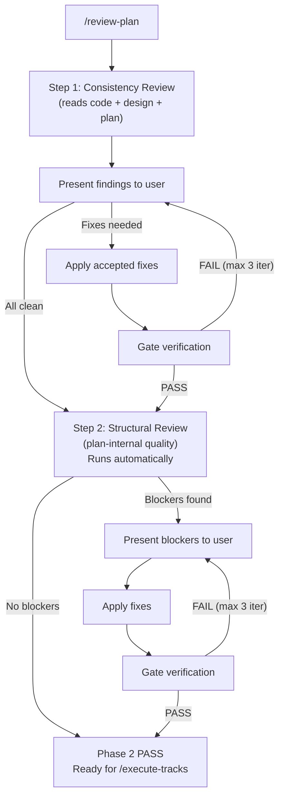

# Implementation Review (Phase 2)

## Overview

Phase 2 validates the plan before execution begins. It runs two steps
in sequence:

1. **Consistency Review** — reads the design document, implementation plan,
   backlog, and actual codebase to find gaps and inconsistencies between
   them. Findings are presented to the user for feedback. Iterates until
   clean.
2. **Structural Review** — validates plan-internal structure (dependency
   ordering, track sizing, scope indicators, architecture notes). Runs
   **automatically** after consistency review passes — no user interaction
   unless blockers are found.



## How to run

Start a new Claude Code session and run `/review-plan` (optionally pass a
directory name; if omitted, the current git branch is used). The slash
command is implemented by the skill at `.claude/skills/review-plan/SKILL.md`.

---

## Step 1: Consistency Review

Checks that the design document, implementation plan, and actual codebase
are aligned. Unlike structural review, this step **reads the codebase** to
verify code references, call flows, and class relationships.

Because the consistency review's findings are factual claims about the
code (a method exists / does not exist, a flow has these participants,
this class has these callers), they are reference-accuracy questions
under the rule in [`conventions.md`](conventions.md) §1.4 *Tooling
discipline*. When mcp-steroid is reachable per the SessionStart hook,
the verification routes through the IntelliJ PSI rather than grep —
preflight via `steroid_list_projects`, and instruct the consistency
sub-agent to use PSI find-usages for symbol questions (its prompt
already contains this instruction). When mcp-steroid is unreachable,
fall back to grep with explicit reference-accuracy caveats in the
findings.

### What it checks

- **Design ↔ Code**: class diagrams match real classes, workflow diagrams
  match real call flows, complex-part sections describe actual behavior
- **Plan ↔ Code**: Component Map and Decision Records reference real
  constructs, Integration Points exist, track descriptions don't reference
  phantom code
- **Design ↔ Plan**: diagrams align with track descriptions and Decision
  Records, scope indicators are consistent with design complexity
- **Gaps**: plan elements without design coverage, design elements no track
  covers, codebase constructs the documents should reference but don't

Each pending track's detailed description
(`**What/How/Constraints/Interactions**` subsections and any track-level
Mermaid diagram) lives in `implementation-backlog.md` rather than
inline in the plan file; the consistency review reads the backlog
alongside the plan.

### Sub-agent prompt

**Prompt file:** [`prompts/consistency-review.md`](prompts/consistency-review.md)

### Gate verification

**Prompt file:** [`prompts/consistency-gate-verification.md`](prompts/consistency-gate-verification.md)

### Review iteration

The consistency review iterates with user feedback:

```
Iteration 1: Full review → findings → present to user → user decisions → apply fixes
Iteration 2: Gate check → verify fixes + catch regressions → if blockers, present to user
Iteration 3: Gate check → if still blockers, escalate to user
```

Max 3 iterations. Finding IDs: `CR1, CR2, ...` (cumulative).

If consistency fixes significantly restructure the plan or design document
(tracks reordered, classes/flows redesigned, scope indicators changed
substantially), re-run the full consistency review instead of the gate
check to catch cascading inconsistencies.

If blockers persist after 3 iterations, escalate to the user and return to
Phase 1 (Planning) to rework the plan/design before re-entering.

### Review output

Saved to `docs/adr/<dir-name>/reviews/consistency.md`.

---

## Step 2: Structural Review

Runs **automatically** after the consistency review passes. Validates
plan-internal structure without reading the codebase.

If the structural review finds no blockers, it completes silently and
Phase 2 passes. If blockers are found, they are presented to the user.

### What it checks

Dependency ordering, track sizing, scope indicators, architecture notes
completeness, design document structure, decision traceability, internal
consistency.

Each pending track's detailed description (the subject of TRACK
DESCRIPTIONS checks, plus several cross-file bullets in TRACK SIZING,
SCOPE INDICATORS, and CONSISTENCY) lives in `implementation-backlog.md`
rather than inline in the plan file; the structural review reads the
backlog alongside the plan.

**Full details:** [`structural-review.md`](structural-review.md)

### Sub-agent prompt

**Prompt file:** [`prompts/structural-review.md`](prompts/structural-review.md)

### Gate verification

**Prompt file:** [`prompts/structural-gate-verification.md`](prompts/structural-gate-verification.md)

### Review iteration

```
Iteration 1: Full review → if no blockers, PASS. If blockers → present to user → fixes
Iteration 2: Gate check → if PASS, done. If blockers → present to user → fixes
Iteration 3: Gate check → if still blockers, escalate
```

Max 3 iterations. Finding IDs: `S1, S2, ...` (cumulative).

If structural fixes significantly restructure the plan (tracks reordered,
tracks added/removed, scope indicators changed substantially), re-run
the full structural review instead of the gate check.

### Review output

Saved to `docs/adr/<dir-name>/reviews/structural.md`.

---

## Completion

When both reviews pass, Phase 2 is complete. Proceed to Phase 3 execution
(`/execute-tracks`). Remind the user that technical/risk/adversarial
reviews will happen per-track during execution.
