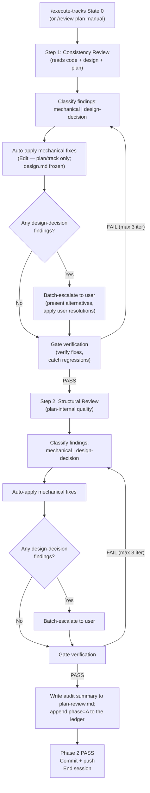

# Implementation Review (Phase 2)

<!--Document index start-->

| Section | Roles | Phases | Summary |
|---|---|---|---|
| §Overview | orchestrator,reviewer-plan | 2 | What Phase 2 plan review covers and when it runs. |
| §How to run | orchestrator | 2 | Entry points and preconditions for launching the review. |
| §Precondition (both entry points) | orchestrator | 2 | State that must hold before either entry point starts. |
| §Tier-driven pass selection (D9/D10) | orchestrator | 2 | Phase-2 passes key off the tier line: per-tier consistency shape, `minimal` drops structural, design-presence guards. |
| §Step 1: Consistency Review | orchestrator,reviewer-plan | 2 | The consistency pass: contradictions, missing links, mismatched counts. |
| §What it checks | reviewer-plan | 2 | Consistency dimensions the reviewer inspects. |
| §Sub-agent prompt | orchestrator,reviewer-plan | 2 | Prompt template for the consistency review sub-agent. |
| §Gate verification | orchestrator | 2 | Confirming the consistency reviewer's PASS is well-formed. |
| §Autonomous orchestration loop | orchestrator | 2 | The iterate-until-PASS loop the orchestrator runs autonomously. |
| §Review output | reviewer-plan | 2 | Shape of the consistency review report. |
| §Strategic review output path | orchestrator | 2 | The per-spawn review_file_path the orchestrator injects at the Phase 2 dispatch sites and partial-fetches from. |
| §Step 2: Structural Review | orchestrator,reviewer-plan | 2 | The structural pass: section shape, budgets, bloat. |
| §What it checks | reviewer-plan | 2 | Consistency dimensions the reviewer inspects. |
| §Sub-agent prompt | orchestrator,reviewer-plan | 2 | Prompt template for the consistency review sub-agent. |
| §Gate verification | orchestrator | 2 | Confirming the consistency reviewer's PASS is well-formed. |
| §Autonomous orchestration loop | orchestrator | 2 | The iterate-until-PASS loop the orchestrator runs autonomously. |
| §Review output | reviewer-plan | 2 | Shape of the structural review report. |
| §Mechanical vs. design-decision classifier | orchestrator | 2 | Deciding whether a finding the orchestrator can fix or must escalate. |
| §`mechanical` — orchestrator applies the fix without asking | orchestrator | 2 | Fixes the orchestrator applies directly with no user input. |
| §`design-decision` — orchestrator escalates to the user | orchestrator | 2 | Findings that change design and require user choice. |
| §Intent-axis pre-screen (consistency review only) | orchestrator,reviewer-plan | 2 | A pre-screen on the consistency pass to separate intent drift from wording. |
| §Audit trail | orchestrator | 2 | Where the review decisions are recorded for later reference. |
| §1. The `plan-review.md` document and the ledger review state | orchestrator | 2 | Recording the audit summary in `plan-review.md` and the review state in the phase ledger. |
| §2. The workflow-update commit | orchestrator | 2 | Committing the review result as a workflow-update commit. |
| §`design.md` is frozen — Phase 2 does not mutate it | orchestrator,reviewer-design | 2 | Design frozen after Phase 1; Phase 2 records design-touching findings, defers them to Phase 4, fixes only plan/track. |
| §Replanning | orchestrator | 2 | When a Phase 2 finding forces a return to planning. |
| §Completion | orchestrator | 2 | Closing Phase 2 and handing off to track execution. |

<!--Document index end-->

> **Loaded on-demand.** This document is read only when the
> `/execute-tracks` startup protocol detects **State 0** (the phase
> ledger records no `phase` boundary yet — plan review has not passed),
> or when the user manually invokes `/review-plan` to re-validate after
> inline replanning. Non-State-0 sessions never load this file, so its
> length carries no per-session cost.

## Overview
<!-- roles=orchestrator,reviewer-plan phases=2 summary="What Phase 2 plan review covers and when it runs." -->

Phase 2 validates the plan before track execution begins. It runs **autonomously** —
the orchestrator applies mechanical fixes itself and escalates only **design-level**
decisions to the user (missing Decision Records, track contradictions, target-state
vs. current-state ambiguity, ASPIRATIONAL/VIOLATED invariants). Two steps run in
sequence:

1. **Consistency Review** — reads the design document, implementation plan,
   track files (one per pending track), and actual codebase to find gaps and
   inconsistencies between them. Each finding carries a
   `Classification: mechanical | design-decision` tag emitted by the
   sub-agent. Mechanical fixes apply automatically; design decisions are
   batched and escalated to the user once at the end of the step.
2. **Structural Review** — validates plan-internal structure (dependency
   ordering, track sizing, scope indicators, architecture notes, bloat).
   All bloat findings are classified `mechanical` by construction; ordering
   and contradiction findings classify as `design-decision`. Same
   autonomous flow.

After both steps pass, the orchestrator writes the audit summary to
`plan-review.md` and records review state in the phase ledger by appending a
`phase=A` boundary (the ledger advancing off State 0 is what "plan review
passed" means now — D3/D7), commits the workflow update, and ends the session.
The next `/execute-tracks` invocation reads `phase=A` from the ledger and enters
State A (pre-Phase-A — the Track Pre-Flight gate runs against Track 1, with
Panel 1 skipped because no track has completed yet).

**Division of labor with the design mutation discipline.** Phase 2
does **not** separately review the narrative quality of `design.md`
(per-section shape, top-level caps, consolidation form, D/S code
discipline, length-trigger compliance, etc.). Those checks are
gated at **write time** by the Phase-1 authoring action (Step 4a
`edit-design` `phase1-creation`) defined in
design-document-rules.md:final-designer,planner,reviewer-design:1,4 § Mutation
discipline — every modification to `design.md` runs the
mechanical checks + cold-read sub-agent before the change stands,
and the design is frozen once Phase 1 closes. Phase 2's Consistency
Review still verifies design ↔ code ↔ plan alignment read-only (are
the diagrams accurate and the cross-links resolvable) and records
divergences; it does not modify `design.md`. The Structural Review
still owns plan-internal quality. Narrative readability of the design
document is the Phase-1 authoring action's responsibility.



## How to run
<!-- roles=orchestrator phases=2 summary="Entry points and preconditions for launching the review." -->

Phase 2 has two entry points:

1. **Autonomous (default).** Triggered by `/execute-tracks` when the startup
   protocol detects State 0 (the phase ledger records no `phase` boundary
   yet — plan review has not passed). The orchestrator loads this document
   on-demand and runs the flow below.
2. **Manual re-run.** The user runs `/review-plan` to re-validate the plan
   after inline replanning produced a revised plan, or to audit the plan
   independently. The skill at `.claude/skills/review-plan/SKILL.md` loads
   this document and runs the same flow regardless of the current ledger
   review state.

Both entry points share the same orchestration. The only difference is what
the orchestrator does after the flow completes:
- Autonomous entry: writes the audit summary to `plan-review.md`, appends a
  `phase=A` ledger boundary, commits, ends the session so the next
  `/execute-tracks` enters Phase A of Track 1.
- Manual re-entry: appends the fresh verdict (with its iteration count) to
  `plan-review.md` and re-appends the `phase=A` ledger boundary, commits,
  ends the session.

### Precondition (both entry points)
<!-- roles=orchestrator phases=2 summary="State that must hold before either entry point starts." -->

**Resolve active handoffs first.** If
`docs/adr/<dir-name>/_workflow/handoff-state0.md` exists, complete
mid-phase-handoff.md:orchestrator,planner:0,1,2,3A,3B,3C,4 §Resume protocol
(including the resolution commit) BEFORE running the clean-tree check
below. The resolution commit deletes the handoff file (the pause boundary
is now a ledger `paused` event, not a marker line in the plan — D8), so
leaving it for after the check would dirty the handoff path the check is
gating on.

Once any handoff is resolved (or there was none), check that the
plan-review files have no uncommitted changes:

```bash
git status --porcelain \
  docs/adr/<dir-name>/_workflow/implementation-plan.md \
  docs/adr/<dir-name>/_workflow/plan-review.md \
  docs/adr/<dir-name>/_workflow/phase-ledger.md \
  docs/adr/<dir-name>/_workflow/plan/ \
  docs/adr/<dir-name>/_workflow/design.md \
  docs/adr/<dir-name>/_workflow/design-mechanics.md \
  docs/adr/<dir-name>/_workflow/design-mutations.md
```

`implementation-plan.md` is absent under `minimal` (no plan) and
`design.md` / `design-mechanics.md` / `design-mutations.md` are absent under
`lite`/`minimal`; `design-mechanics.md` exists only when the length trigger
has fired and `design-mutations.md` is created on the first `edit-design` run.
Non-existent paths produce no output, so listing them is safe in every tier.

If the output is non-empty, halt and ask the user to commit (or stash)
those edits first — uncommitted changes to these files would otherwise
be bundled into the audit-trail commit alongside the auto-fixes,
muddling the trace. Other dirty paths in the working tree are safe to
ignore (the audit-trail `git add` is path-scoped to the files above).

---

## Tier-driven pass selection (D9/D10)
<!-- roles=orchestrator phases=2 summary="Phase-2 passes key off the tier line: per-tier consistency shape, minimal drops structural, design-presence guards." -->

Which Phase-2 passes run, and in what shape, is keyed off the **confirmed
tier** (D9), not off a step-count axis. Before launching Step 1, read the
tier **ledger-first**: the phase ledger's `tier` field
(`_workflow/phase-ledger.md`, last value wins); when no `phase-ledger.md`
exists (an in-flight pre-ledger `lite`/`full` plan), fall back to the **D18
tier line** in `implementation-plan.md`, the single change-level line
`create-plan` writes at confirmation, carrying the tier
(`full` / `lite` / `minimal`) and its centrally-matched HIGH-risk
categories. The ledger `tier` field is present in every tier (D4), so the
read resolves even under `minimal`, which has no plan to carry a tier line;
the develop-era plan tier line is the pre-ledger fallback only. The same
read happens on every entry — a fresh `/execute-tracks` State-0 session and a
manual `/review-plan` re-run both resolve the tier the same way.

**Per-tier pass selection.** Each Phase-2 pass either runs as today,
narrows, or drops (the change-level half of the design's Part-6 review
matrix):

| Pass | `full` | `lite` | `minimal` |
|---|---|---|---|
| Step 1 consistency | full (design + plan + tracks + code) | drops the design half (plan + tracks + code) | drops the design half **and** the plan-content cross-check (track + code only) |
| Step 2 structural | runs | runs | **dropped** (`minimal` has no plan, so there is no plan-file shape to validate) |

The two narrowings are independent. The **design half** of the
consistency review is dropped whenever no `design.md` exists — that is, in
`lite` and `minimal`. The **plan-content cross-check** is additionally
dropped in `minimal` only, because `minimal` has no plan (D2): with no
`implementation-plan.md` on disk there is no plan content to cross-check, so
the `minimal` consistency pass cross-checks track-vs-code only. `minimal` also
**drops the Step 2 structural pass** entirely: with no plan file there are no
decision records and no ordering to validate, so the structural pass has no
plan-file shape to check.

**Design-presence guard.** The two narrowings reduce to one mechanical
test the orchestrator and the sub-agent both apply: **does
`docs/adr/<dir-name>/_workflow/design.md` exist?** When it is absent
(every `lite`/`minimal` plan), every clause that opens, reads, cites, or
routes a finding to a design file is skipped. The passes are not rewritten
per tier — the same Step 1 / Step 2 flow runs with the design-reading
clauses guarded behind the design-presence test. A no-design dry-run of
the Step 1 flow must reach no instruction that dereferences `design.md`;
this is the track's no-design acceptance check.

**Findings-routing under no design.** With a `design.md` present, a
Phase-2 finding that touches frozen seed text defers to Phase 4 (see
§"`design.md` is frozen — Phase 2 does not mutate it" below). With no
design, every correction is plan-or-track-scoped: the defer-to-Phase-4
branch is **unreachable**, and all findings route to the plan or the track
files directly. The live decision always lives in the track regardless
(D7), so the only thing the no-design tiers lose is the deferral target,
not a routing destination.

**Mid-flight upgrade.** A `lite`/`minimal` plan that upgrades to `full`
mid-flight (the D12 ESCALATE path) gains a `design.md` and re-enters the
design-present branches from the upgrade point onward; findings already
routed as plan/track corrections before the upgrade are not retroactively
moved.

---

## Step 1: Consistency Review
<!-- roles=orchestrator,reviewer-plan phases=2 summary="The consistency pass: contradictions, missing links, mismatched counts." -->

Checks that the design document, implementation plan, and actual codebase
are aligned. Unlike structural review, this step **reads the codebase** to
verify code references, call flows, and class relationships.

Because the consistency review's findings are factual claims about the
code (a method exists / does not exist, a flow has these participants,
this class has these callers), they are reference-accuracy questions
under the rule in conventions.md:any:any `§1.4` *Tooling
discipline*. When mcp-steroid is reachable per the SessionStart hook,
the verification routes through the IntelliJ PSI rather than grep —
preflight via `steroid_list_projects`, and instruct the consistency
sub-agent to use PSI find-usages for symbol questions (its prompt
already contains this instruction). When mcp-steroid is unreachable,
fall back to grep with explicit reference-accuracy caveats in the
findings.

### What it checks
<!-- roles=reviewer-plan phases=2 summary="Consistency dimensions the reviewer inspects." -->

- **Design ↔ Code** (design half — `full` only): class diagrams match
  real classes, workflow diagrams match real call flows, complex-part
  sections describe actual behavior
- **Plan ↔ Code**: Component Map and Decision Records reference real
  constructs, Integration Points exist, track descriptions don't reference
  phantom code
- **Design ↔ Plan** (design half — `full` only): diagrams align with track
  descriptions and Decision Records, scope indicators are consistent with
  design complexity
- **Track ↔ Code**: each track's inline Decision Records and its
  in-scope/out-of-scope file lists reference real constructs (the track is
  the live decision carrier in every tier, D7)
- **Gaps**: plan elements without design coverage (design half — `full`
  only), design elements no track covers (design half — `full` only),
  codebase constructs the documents should reference but don't

The bullets tagged **design half** run only when `design.md` exists, i.e.
in `full`. In `lite`/`minimal` the design-presence guard (see
§"Tier-driven pass selection") skips them, and the review reads plan +
tracks + code (`lite`) or track + code (`minimal`). The **Plan ↔ Code**
and **Track ↔ Code** bullets are the plan-content and track-content
cross-checks: `minimal` also drops the plan-content cross-check (`minimal`
has no plan to verify, per D2), running **Track ↔ Code** only.

Each pending track's detailed description lives in that track's
track file (`plan/track-N.md`, written by `create-plan` at Phase 1)
rather than inline in the plan file — split across the four
track-level sections (`## Purpose / Big Picture`, `## Context and
Orientation`, `## Plan of Work`, `## Interfaces and Dependencies`),
with any track-level Mermaid diagram landing under `## Context and
Orientation`. The consistency review reads the track files alongside
the plan, and reads each track's `## Decision Log` inline DRs as the
live decision content (D7).

### Sub-agent prompt
<!-- roles=orchestrator,reviewer-plan phases=2 summary="Prompt template for the consistency review sub-agent." -->

**Prompt file:** prompts/consistency-review.md:reviewer-plan:2

The prompt embeds the **intent-axis pre-screen** (current-state vs.
target-state) and the **classification rules** (see §Mechanical vs.
design-decision classifier below). Each finding the sub-agent emits
carries a `Classification` field — the orchestrator routes on that
field, not on severity.

### Gate verification
<!-- roles=orchestrator phases=2 summary="Confirming the consistency reviewer's PASS is well-formed." -->

**Prompt file:** prompts/consistency-gate-verification.md:reviewer-plan:2

### Autonomous orchestration loop
<!-- roles=orchestrator phases=2 summary="The iterate-until-PASS loop the orchestrator runs autonomously." -->

```
Iteration 1 (full review):
  1. Spawn the consistency sub-agent with plan, track files, design,
     codebase, and a review_file_path (see §Strategic review output path
     below). The sub-agent writes its structured output to that file in
     the review-file schema and returns a thin manifest.
  2. Partial-fetch the file's `## Findings` section; each finding is
     tagged Classification: mechanical | design-decision.
  3. Apply ALL mechanical fixes immediately:
     - Plan / track-file edits: native Edit.
     - A finding whose correction would touch design.md is recorded
       only — design.md is frozen after Phase 1, so the design.md
       correction defers to the Phase-4 design-final.md reconciliation
       (see §`design.md` is frozen — Phase 2 does not mutate it below).
  4. If any design-decision findings remain: batch-present to the user
     once (single message listing all open design questions with proposed
     alternatives). Wait for user resolutions. Apply user-approved fixes
     using the same plan-vs-design routing.
  5. Spawn the gate verification sub-agent with the updated artifacts,
     the iteration's findings, and its own review_file_path; it writes
     the verdict-producer manifest variant and the orchestrator
     partial-fetches its `## Findings`.

Iteration 2-3 (gate, then full re-review if structure changed):
  - If the gate finds new findings, classify and re-route as in iteration 1.
  - If iteration 1 fixes significantly restructured the plan or design
    (tracks reordered, classes/flows redesigned, scope indicators changed
    substantially), re-run the FULL consistency review instead of the gate
    to catch cascading inconsistencies.

Cap: 3 iterations. Findings IDs cumulative (CR1, CR2, ... CR6, CR7).
```

If blockers persist after 3 iterations, escalate to the user with the
remaining open findings and recommend returning to Phase 1 (Planning) to
rework the plan/design before re-entering.

**Context consumption check** (mandatory between consistency review,
structural review, and any iteration boundary, except after the final
gate-PASS commit): run `cat /tmp/claude-code-context-usage-$PPID.txt`.
If the level is `warning` (≥40%) or `critical` (≥50%), do NOT start
the next review or iteration. Save all work and ask the user for a
session refresh (see `workflow.md` §Context Consumption Check). If the
pause leaves State 0 mid-flight (for example, consistency review
passed but structural review has not run, or an iteration's
mechanical fixes are applied but the gate sub-agent has not yet been
spawned), write a handoff file at
`docs/adr/<dir-name>/_workflow/handoff-state0.md` per
mid-phase-handoff.md:orchestrator,planner:0,1,2,3A,3B,3C,4. Capture the iteration
count, which classifier passes are done, and the verbatim list of
mechanical fixes that landed so the next session does not re-run them.

### Review output
<!-- roles=reviewer-plan phases=2 summary="Shape of the consistency review report." -->

The reviewer writes its structured output to the committed
`review_file_path` file (the durable record); the orchestrator
partial-fetches the file's `## Findings` for the iteration loop and
applies plan-side fixes via Edit to `implementation-plan.md` and the
affected `plan/track-N.md` files. A finding whose correction would
touch `design.md` is recorded only — `design.md` is frozen after Phase
1 and its correction defers to Phase 4. The off-context win is the
file's `## Evidence base`, which the orchestrator does not ingest; the
durable trace is:

- The committed review file under `plan/track-N/reviews/`.
- The resulting plan/design state.
- The gate-PASS commit.
- The audit summary written into `plan-review.md`, with review state
  recorded in the phase ledger (see §Audit trail below).

### Strategic review output path
<!-- roles=orchestrator phases=2 summary="The per-spawn review_file_path the orchestrator injects at the Phase 2 dispatch sites and partial-fetches from." -->

Both Phase 2 reviewers and their gate verifications are **strategic**
producers: each writes its structured output to a file in the
review-file schema (`conventions-execution.md` `§2.5`) and the
orchestrator partial-fetches the file's `## Findings` rather than
receiving the bodies inline. The orchestrator injects a per-spawn
`review_file_path` at each dispatch site, pointed at the `§2.1`
lifecycle home:

```
docs/adr/<dir-name>/_workflow/plan/track-N/reviews/<type>-iter<N>.md
```

`<type>` is the producer (`consistency` / `structural`, or
`consistency-gate-verification` / `structural-gate-verification`) and
`<N>` is the iteration, so each fan-out unit writes a distinct file.
The reviewer `mkdir -p`s the `reviews/` directory and writes the file
in file-when-handed-a-path mode (each prompt's output-mode block);
supplying no path is the develop-state run that falls back to today's
inline output. The output path is what wires the producer prompts'
file-when-handed-a-path branch to a caller — without it the reviewers
would emit inline and the orchestrator would have nothing on disk to
fetch.

The orchestrator still ingests `## Findings` (its consumer is the
planner revising the plan, not an implementer), so the strategic side
keeps the partial-fetch; the on-disk win is the evidence base staying
off-context, not the findings themselves. Before trusting the manifest
index the orchestrator validates the manifest `findings` count against
`grep -cE '^### [A-Z]+[0-9]+ '` (the `§2.5` S4 check); on a
`CONTRACT_VIOLATION` flag or a count mismatch it falls back to a
whole-section read of the file rather than the partial-fetch (the
orchestrator/planner owns the strategic fallback per `§2.5`).

---

## Step 2: Structural Review
<!-- roles=orchestrator,reviewer-plan phases=2 summary="The structural pass: section shape, budgets, bloat." -->

Runs **automatically** after the consistency review passes, **except under
`minimal`** — the `minimal` tier drops the structural pass entirely (see
§"Tier-driven pass selection"), because `minimal` has no plan (D2) — no
plan file, no decision records, no ordering for the structural pass to
validate. Under `full` and `lite` the structural pass runs. Validates
plan-internal structure without reading the codebase.

### What it checks
<!-- roles=reviewer-plan phases=2 summary="Consistency dimensions the reviewer inspects." -->

Dependency ordering, track sizing, scope indicators, architecture notes
completeness, design document structure, decision traceability, internal
consistency, and plan-file bloat.

Each pending track's detailed description (the subject of TRACK
DESCRIPTIONS checks, plus several cross-file bullets in TRACK SIZING,
SCOPE INDICATORS, and CONSISTENCY) lives in that track's track file
(`plan/track-N.md`, written by `create-plan` at Phase 1) rather than
inline in the plan file; the structural review reads the track files
alongside the plan.

**Full details:** structural-review.md:orchestrator,reviewer-plan:2,3A,3C

### Sub-agent prompt
<!-- roles=orchestrator,reviewer-plan phases=2 summary="Prompt template for the consistency review sub-agent." -->

**Prompt file:** prompts/structural-review.md:reviewer-plan:2

### Gate verification
<!-- roles=orchestrator phases=2 summary="Confirming the consistency reviewer's PASS is well-formed." -->

**Prompt file:** prompts/structural-gate-verification.md:reviewer-plan:2

### Autonomous orchestration loop
<!-- roles=orchestrator phases=2 summary="The iterate-until-PASS loop the orchestrator runs autonomously." -->

Same shape as the consistency review:

```
Iteration 1 (full review):
  1. Spawn the structural sub-agent with plan, track files, design, and a
     review_file_path (see §Strategic review output path below). The
     sub-agent writes its structured output to that file in the
     review-file schema and returns a thin manifest.
  2. Partial-fetch the file's `## Findings` section; each finding is
     tagged Classification: mechanical | design-decision.
     Per-prompt rule: ALL bloat findings classify as mechanical; track-ordering
     and contradiction findings classify as design-decision (see §Mechanical
     vs. design-decision classifier below).
  3. Apply mechanical fixes immediately (Edit for plan / track files).
     A finding whose correction would touch design.md is recorded only —
     design.md is frozen after Phase 1; the correction defers to Phase 4.
  4. Batch-escalate any design-decision findings to the user once. Apply
     user-approved fixes.
  5. Spawn the gate verification sub-agent with the updated artifacts,
     the iteration's findings, and its own review_file_path; it writes
     the verdict-producer manifest variant and the orchestrator
     partial-fetches its `## Findings`.

Iteration 2-3: gate or full re-review (re-run full review if fixes
significantly restructured the plan).

Cap: 3 iterations. Findings IDs cumulative (S1, S2, ... S6, S7).
```

If structural fixes significantly restructure the plan (tracks reordered,
tracks added/removed, scope indicators changed substantially), re-run
the full structural review instead of the gate check to catch cascading
issues.

### Review output
<!-- roles=reviewer-plan phases=2 summary="Shape of the structural review report." -->

Same as the consistency review — the reviewer writes its output to the
committed `review_file_path` file (see §Strategic review output path
above) and the orchestrator partial-fetches `## Findings` during the
loop; the durable trace is the committed review file, the plan-file
edits, the gate-PASS commit, and the audit-summary entry in
`plan-review.md` (with review state in the phase ledger).

---

## Mechanical vs. design-decision classifier
<!-- roles=orchestrator phases=2 summary="Deciding whether a finding the orchestrator can fix or must escalate." -->

The classifier lives in the review prompts so the sub-agent emits the
classification alongside each finding. The orchestrator trusts the
sub-agent's tag and routes on it.

### `mechanical` — orchestrator applies the fix without asking
<!-- roles=orchestrator phases=2 summary="Fixes the orchestrator applies directly with no user input." -->

ALL of these must hold for a consistency finding to classify as
`mechanical`:

1. The plan/design claim is about **current state** — code that should
   already exist at the time of writing, not code a track will create.
   (Aspirational claims about target state are pre-filtered; see
   §Intent-axis pre-screen below.)
2. There is exactly one unambiguous correct rendering — rename to the
   actual class, update to the real signature, fix the participant
   name in a sequenceDiagram, drop a phantom reference, etc.
3. Applying the fix doesn't change what the plan is trying to achieve.
   Only the description is updated; the plan's goals, scope, and
   architecture are unchanged.

For structural findings, **all bloat findings** are mechanical by
construction (DR length, intro length, component-intent length,
integration-point length, plan/design duplication, superseded DR
retained, plan-file budget, missing track-reference annotation,
scope-indicator format). The fix follows the rule mechanically —
trim back to the four-bullet form, replace duplicated body with a
one-line link, delete the superseded DR, etc. The fix lands on the
plan file via `Edit`; it never moves material into `design.md`,
which is frozen after Phase 1.

A `mechanical` finding whose only correct rendering would touch
`design.md` (a class-diagram or sequenceDiagram correction in the
design document, for example) is still recorded, but the `design.md`
edit is **not** applied at Phase 2 — it defers to the Phase-4
`design-final.md` reconciliation (see §`design.md` is frozen — Phase 2
does not mutate it below). The plan-side or track-side half of such a
finding, if any, is applied via `Edit` as usual.

### `design-decision` — orchestrator escalates to the user
<!-- roles=orchestrator phases=2 summary="Findings that change design and require user choice." -->

ANY of these triggers `design-decision`:

- The discrepancy reveals a **missing Decision Record** for a non-obvious
  choice. The user has the rationale; the orchestrator does not.
- The discrepancy is a **contradiction between two tracks** (Track 1
  assumes X, Track 3 assumes not-X). Which one is right is a design
  call.
- An **ASPIRATIONAL invariant has no implementing track**. Do we add a
  track or change the invariant? Both are plausible.
- A **VIOLATED invariant** exists. Do we fix the code (track scope
  expansion) or restate the invariant (design retreat)?
- **Design ↔ code mismatch where the plan describes a target state**
  (a `[ ]` track is meant to create what the design claims) and the
  divergence is whether to keep the target shape or change it. The
  pre-screening rule (§Intent-axis pre-screen) catches the
  no-divergence case; what reaches this rule is genuine design choice.
- **Track ordering** issues where reordering changes the contract
  (e.g., Track B's scope mentions wiring X, but X is introduced in
  Track C — does B move after C, or does X move into B?).

The classifier rules belong in the prompt files — the orchestrator
does not re-classify; it acts on the tag.

### Intent-axis pre-screen (consistency review only)
<!-- roles=orchestrator,reviewer-plan phases=2 summary="A pre-screen on the consistency pass to separate intent drift from wording." -->

Before emitting any finding, the consistency sub-agent classifies each
plan/design claim along the **intent axis**:

- **Current-state claim** — the plan/design says something about code
  that should already exist (Component Map describing a current
  module's role, `design.md` class diagram describing pre-existing
  classes, Architecture Notes referencing today's SPI). Discrepancies
  here become findings.
- **Target-state claim** — the plan/design says something about code
  a `[ ]` track will create (`**What**:` bullets in the track's step
  file, forward-looking Decision Records, `design.md` sections
  describing the post-implementation state). The current code
  naturally won't match — this is **not a finding** unless the target
  is unreachable from the current code (in which case the finding is
  `design-decision`).

The same rule already applies to invariants via the
`ENFORCED / ASPIRATIONAL / VIOLATED` tagging. The pre-screen extends
the same idea to all claims: a divergence with target-state code is
expected and silenced; a divergence with current-state code is a
finding.

---

## Audit trail
<!-- roles=orchestrator phases=2 summary="Where the review decisions are recorded for later reference." -->

Two durable traces survive the autonomous flow:

### 1. The `plan-review.md` document and the ledger review state
<!-- roles=orchestrator phases=2 summary="Recording the audit summary in plan-review.md and the review state in the phase ledger." -->

The audit splits into two homes (D7): the multi-line review *summary*
goes to `plan-review.md` (a cold record rarely read during development),
and the review *state* — "plan review passed" — is recorded in the phase
ledger so the resume hot path stays terse for `determine_state` to grep.
`plan-review.md` is present in every tier, so a `minimal` change with no
plan still has a review-fact home.

After Phase 2 passes, the orchestrator writes `plan-review.md` with the
audit summary:

```markdown
# Plan Review
- Plan review (consistency + structural) — passed at iteration <N>

**Auto-fixed (mechanical)**: <CR/S finding IDs with one-line summaries>.

**Escalated (design decisions)**: <CR/S finding IDs with one-line user resolutions, or "none">.
```

and records review state in the ledger by appending a `phase=A` boundary:

```bash
.claude/scripts/workflow-startup-precheck.sh --append-ledger --phase A
```

The ledger advancing off State 0 (an empty/absent `phase` is State 0; a
`phase=A` is "plan review passed") is what the startup protocol's State 0
detection reads now (D3) — there is no plan checkbox to flip. The two
writes are paired: the summary in `plan-review.md` is the human record,
the `phase=A` ledger boundary is the machine signal that drives resume.

If the user re-runs `/review-plan` later, the orchestrator appends the
new iteration's verdict to `plan-review.md` and re-appends the `phase=A`
ledger boundary (the ledger is append-only and last-value-wins, so a
re-append simply re-confirms the passed state).

### 2. The workflow-update commit
<!-- roles=orchestrator phases=2 summary="Committing the review result as a workflow-update commit." -->

After Phase 2 passes, the orchestrator stages `plan-review.md`, the
phase ledger, and any plan / track files the review touched (no design
files — `design.md` is frozen and Phase 2 does not touch it), and commits
with the message:

```
Plan review autonomous fixes for <plan-name>

Auto-fixed: <CR/S IDs>
Escalated: <CR/S IDs, or "none">
```

This is a single Workflow update commit per the table in
`commit-conventions.md` § Commit type prefixes. Push after commit.

---

## `design.md` is frozen — Phase 2 does not mutate it
<!-- roles=orchestrator,reviewer-design phases=2 summary="Design frozen after Phase 1; Phase 2 records design-touching findings, defers them to Phase 4, fixes only plan/track." -->

`design.md` is frozen after Phase 1. The design-first authoring froze
it at Step 4a (the `edit-design` `phase1-creation` review pass), which
runs before plan derivation in Step 4b and before Phase 2. So by the
time Phase 2 runs, the design is already frozen, and Phase 2 does
**not** mutate `design.md`.

A consistency finding whose correction would touch `design.md` is
recorded as a finding only. The plan-side or track-side correction is
applied via `Edit`; the `design.md` correction itself is deferred to
the Phase-4 `design-final.md` reconciliation against the real code,
where the final-designer reconciles the design's narrative with what
was actually built.

**This whole deferral mechanism applies only when a `design.md` exists,
i.e. in `full`.** In `lite`/`minimal` no design file exists (see
§"Tier-driven pass selection"), so no finding can touch frozen seed text:
the defer-to-Phase-4-design branch is unreachable and every correction is
plan-or-track-scoped, applied via `Edit` directly. The live decision lives
in the track in every tier (D7), so a no-design tier loses only the
deferral target, not a place to route the fix. A design-destination bloat
fix (one that would move live material into the frozen seed) re-routes
to the matching track section in **every** tier, including `full`, because
the seed is non-canonical under the carrier flip (the structural review
owns this re-route; see structural-review.md:orchestrator,reviewer-plan:2,3A,3C).

Plan-file and track-file edits use `Edit` directly (unchanged) — no
mutation discipline applies to those files.

---

## Replanning
<!-- roles=orchestrator phases=2 summary="When a Phase 2 finding forces a return to planning." -->

**Not a separate phase.** Replanning is handled within Phase 3
by the execution agent's ESCALATE flow (see "Inline Replanning
(ESCALATE)" in `workflow.md`).

**Why:** The execution agent reads all track episodes from the plan file
and can read/write it directly. It has the context to revise the plan
within the session. A separate phase would add unnecessary context loss.

**What happens on ESCALATE:**
1. Execution agent stops starting new steps.
2. Presents full situation to user (all episodes, what broke, what
   assumptions failed).
3. Proposes revised plan (new/modified tracks, reordering, removed
   tracks).
4. Spawns a structural review sub-agent to validate the revised plan
   (uses the same prompt as Phase 2 Step 2; classifier still applies).
5. On review PASS — updates the plan file with the revised plan and
   ends the session. Resets review state to State 0 (the replan invalidates
   the prior `phase=A` boundary) so the next `/execute-tracks` re-runs the
   full Phase 2 flow against the revised plan, picking up any new consistency
   issues introduced by the replan. The reset mechanics (append `phase=0` to
   the ledger) live in inline-replanning.md:orchestrator:3A,3C § Process
   step 6.
6. On review FAIL with persistent blockers — advises user to restart
   from Phase 1 (`/create-plan`) with accumulated episodes as input.

The only case that exits to Phase 1 is when the plan is so fundamentally
broken that incremental revision cannot fix it.

---

## Completion
<!-- roles=orchestrator phases=2 summary="Closing Phase 2 and handing off to track execution." -->

When both reviews pass:

1. Write the audit summary to `plan-review.md` and append the `phase=A`
   ledger boundary (see §Audit trail).
2. Stage and commit the audit-trail changes. Stage `plan-review.md`, the
   phase ledger, the plan file (when present — absent under `minimal`),
   and every track file the review actually touched (use `git status
   --porcelain docs/adr/<dir-name>/_workflow/plan/` to find them; pass each
   modified path explicitly rather than the whole `plan/` directory
   so unrelated files don't sneak in). No design files are staged —
   `design.md` is frozen after Phase 1 and Phase 2 does not touch it,
   so any `design.md` correction surfaced by the review is recorded as a
   finding and deferred to the Phase-4 `design-final.md` reconciliation:
   ```bash
   git add docs/adr/<dir-name>/_workflow/plan-review.md \
           docs/adr/<dir-name>/_workflow/phase-ledger.md \
           docs/adr/<dir-name>/_workflow/implementation-plan.md \
           docs/adr/<dir-name>/_workflow/plan/track-<N>.md \
           ... (one path per modified track file)
   git commit -m "Plan review autonomous fixes for <plan-name>

   Auto-fixed: <IDs>
   Escalated: <IDs, or 'none'>"
   git push
   ```
3. Inform the user that Phase 2 passed. The next `/execute-tracks`
   session will resume per the startup protocol — typically State A
   (pre-Phase-A — Track Pre-Flight runs against the first incomplete
   track) for a fresh plan, or whichever state was active before the
   manual re-validation. Remind them that technical/risk/adversarial
   reviews will happen per-track during execution.
4. **Run self-improvement reflection.** Load
   `.claude/workflow/self-improvement-reflection.md` on-demand and
   follow it. Reflection runs even when Phase 2 passed cleanly —
   ambiguity in `implementation-review.md` itself, classifier
   misfires, or sub-agent prompt issues are exactly the kind of
   workflow-process friction this step is meant to capture. The
   protocol creates approved proposals as YouTrack issues under
   `YTDB` with the `dev-workflow` tag (or skips with a notice if
   the YouTrack MCP server is unreachable); reflection produces no
   commit. Then proceed to Step 5.
5. **End the session.** Do not proceed to Phase A of Track 1 in the
   same session — the session boundary is mandatory (see
   `workflow.md` §Session Boundary Rules).
