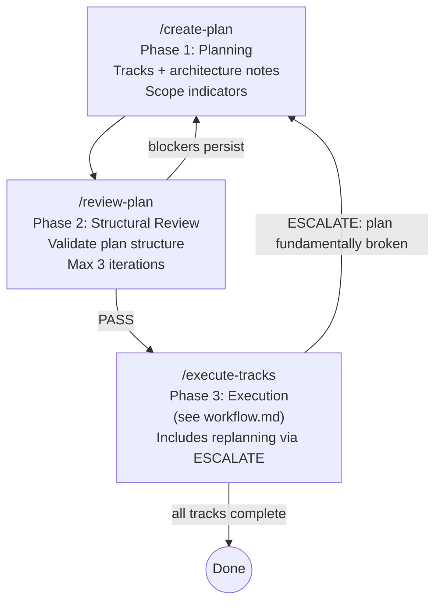
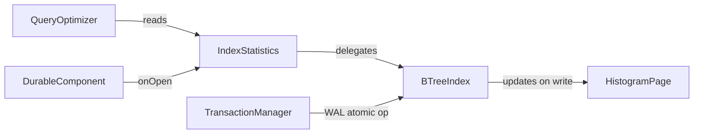

# Planning and Structural Review

## Overview

This document covers Phases 1 and 2 of the development workflow. These are
single-session conversations with no agent teams — the user interacts directly
with a single Claude Code session.

- **Phase 1 (Planning):** Iteratively develop a plan with Claude's help.
  Produce tracks with architecture notes and scope indicators.
- **Phase 2 (Structural Review):** Lightweight structural validation of the
  plan before execution begins.
- **Phase 3 (Execution):** Covered in `workflow.md`. Includes
  replanning via the ESCALATE flow.

Replanning (formerly Phase 4 in v1) is now handled within Phase 3 by the
execution agent's ESCALATE flow — see `workflow.md`.
There is no separate replanning phase or `/replan` command.



**Important:** The durable plan always lives in the **project's**
`docs/adr/<dir-name>/` directory (e.g., `docs/adr/ytdb-123-add-auth/implementation-plan.md`).
This is distinct from the global `~/.claude/plans/` where Claude Code stores
ephemeral auto-named session plans. The project plan file is the single source
of truth — it's human-readable, version-controlled, and serves as a lightweight
ADR (Architecture Decision Record) after the feature is complete.

---

## Phase 1: Planning

### Goal

Produce a plan markdown file with a high-level description, architecture notes,
and track-level decomposition. Step-level decomposition is **deferred to
execution** — tracks include scope indicators (a rough sketch of expected
work) but not detailed steps. Final step decomposition happens just-in-time
during Phase 3 when the execution agent has maximum codebase context from
prior tracks.

### How to run

Start a new Claude Code session and run `/create-plan` (optionally pass a
branch name; if omitted, the current git branch is used). The command prompt
is at `.claude/commands/create-plan.md`. After reading the workflow
documents, the agent will ask you to describe the aim and goal for the
planning session. Provide the goal, then iterate with Claude until the plan
is complete — ask for research, decomposition, risk analysis, dependency
ordering, etc.

### Plan file structure

The plan file structure is defined in `conventions.md` (section 1.2). The key
points:

- `docs/adr/<dir-name>/implementation-plan.md` — strategic: goals, architecture,
  tracks, track-level episodic summaries
- `docs/adr/<dir-name>/tracks/track-N.md` — tactical: decomposed steps, step
  episodes (created during Phase 3)
- `docs/adr/<dir-name>/reviews/structural.md` — structural review output

Track files do not exist during Phase 1 (planning) or
Phase 2 (structural review) — only scope indicators in the plan file exist
at that point.

**The plan is a strategic guide, not a rigid task graph.** Track descriptions,
architecture notes, and inter-track dependencies are the load-bearing parts.
Step-level detail is tactical and should emerge just-in-time during execution
when the execution agent has maximum codebase context. The execution agent
always has freedom to adapt step-level decomposition without formal replanning —
only track-level or decision-level changes require escalation.

### Architecture Notes format

Architecture notes document the structural context and design decisions for the plan.
They live in the `## High-level plan > ### Architecture Notes` section of the plan file.

#### Required sections

Every plan must include these two sections:

**1. Component Map** — The slice of the system this plan touches.

- Show only components this plan modifies plus their immediate neighbors.
- Use a **Mermaid diagram** when there are 3+ components with non-trivial
  relationships. For simpler cases (2 components, one arrow), a bullet list is
  clearer.
- Always pair the diagram with an **annotated bullet list** explaining what
  changes in each component and why. The diagram shows topology; the bullets
  show intent.
- Cap diagrams at ~15 nodes. If larger, split into multiple diagrams per track.

Example:

````markdown
### Component Map



- **QueryOptimizer** — read-only consumer, no changes
- **IndexStatistics** — new class, facade over per-index histograms
- **BTreeIndex** — modified: writes histogram metadata on leaf page splits/merges
- **HistogramPage** — new: 16-byte extension to leaf page header
- **TransactionManager** — unchanged, but histogram update must be inside its WAL scope
````

**2. Decision Records** — One block per non-obvious design choice:

```markdown
#### D1: <Decision title>
- **Alternatives considered**: <what else was on the table>
- **Rationale**: <why this option won — trade-offs, constraints>
- **Risks/Caveats**: <known downsides or things to watch>
- **Implemented in**: Track X (step references added during execution)
```

#### Optional sections (include when applicable)

**3. Invariants & Contracts** — What must remain true before/after the change.
Each invariant listed here must have a corresponding test in the relevant step.

```markdown
### Invariants
- Histogram updates must occur inside the same WAL atomic operation as the
  index update (no partial state on crash recovery)
- Histogram read path must not acquire write locks
```

**4. Integration Points** — How new code connects to existing code: entry points,
SPIs, callbacks, event flows.

```markdown
### Integration Points
- Query optimizer reads histograms via `IndexStatistics.getHistogram(indexName)`
- Histogram refresh triggered by `DurableComponent.onOpen()`
```

**5. Non-Goals** — Explicitly state what this plan does NOT attempt. Prevents
scope creep during execution.

```markdown
### Non-Goals
- Multi-column histograms (future work)
- Exact cardinality — this is an estimate
```

### Architecture Notes rules

1. **Component Map and at least one Decision Record are mandatory.** Other
   sections are "include if applicable."
2. **Decisions are immutable once execution starts.** If reality changes, the
   execution agent handles replanning via ESCALATE and adds a revision
   note — decisions are not silently overwritten.
3. **Each decision must reference the track(s) that implement it** — creates
   traceability between "why" and "where." Step references are added during
   Phase 3 execution when steps are decomposed.
4. **Invariants become test assertions** — any invariant listed must have a
   corresponding test in the relevant step.
5. **Keep it scannable** — bullet points and tables over prose. A reviewer should
   find any specific decision in under 10 seconds.
6. **Update diagrams with steps** — when a step modifies component interactions,
   updating the Component Map diagram is part of the episode capture or the
   strategy refresh ADJUST step.
7. **Mermaid diagrams are optional** — use them only when the topology is complex
   enough (3+ components, non-trivial relationships) that a bullet list alone
   would obscure the structure.

### Track descriptions

Each **track** in the checklist must have a description block (in a blockquote
under the track heading). There is no length cap — the description should be as
long as it needs to be to give the execution agent full context. Use bullet
points if it grows beyond a short paragraph.

The description should cover:
- **What** the track achieves
- **How** (high-level approach)
- **Track-specific constraints** (compatibility, performance, locking, etc.)
- **Interactions with other tracks** (dependencies, shared state, ordering)

**Track sizing rule:** If a track would need more than ~5-7 steps, split it
into separate dependent tracks during planning. The execution agent
handles sequencing and episode propagation between dependent tracks — this gives
the same "informed decomposition" benefit without added complexity. Track
sequencing and episode propagation between dependent tracks is handled by the
execution agent.

### Track-level component interaction diagrams

Tracks often have internal component interactions that are too detailed for the
top-level Component Map but too important to skip. Use a track-level Mermaid
diagram when:

- The track has 3+ internal components with non-trivial interactions
- The internal flow (who calls whom, data direction) isn't obvious from the
  description alone

Rules:
- **Optional**, not mandatory — only when the track's internal topology adds
  clarity beyond what the description provides.
- **Scoped to the track** — show only components internal to this track plus
  immediate external touchpoints. Do not repeat the top-level Component Map.
- **Cap at ~10 nodes** (track diagrams are narrower than the top-level map).
- **Pair with an annotated bullet list** — same rule as the top-level map.
- **Update when steps change interactions** — part of the "Update plan" step.

Example:

````markdown
- [ ] Track 2: Query optimizer histogram integration
  > The optimizer currently uses a fixed selectivity estimate (0.1) for all
  > range predicates. This track replaces that with histogram-based estimates.
  >
  > Approach: introduce an `IndexStatistics` facade that the optimizer queries
  > during plan costing. The facade reads histogram data lazily from the
  > B-tree leaf pages added in Track 1.
  >
  > ```mermaid
  > graph TD
  >     CBO[CostBasedOptimizer] -->|estimateSelectivity| SF[StatisticsFacade]
  >     SF -->|hasHistogram?| IC{IndexCache}
  >     IC -->|yes| HR[HistogramReader]
  >     IC -->|no| FE[FixedEstimate 0.1]
  >     HR -->|snapshot read| PC[PageCache]
  > ```
  >
  > - **CostBasedOptimizer** — modified: calls StatisticsFacade instead of
  >   hardcoded 0.1
  > - **StatisticsFacade** — new: checks if histogram exists, delegates
  >   accordingly
  > - **HistogramReader** — new: lock-free snapshot reads from page cache
  > - **PageCache** — unchanged, existing infrastructure from Track 1
  >
  > Constraints:
  > - Must not add latency to queries on indexes without histograms — fall
  >   back to the current fixed estimate.
  > - The optimizer holds no write locks, so histogram reads must be
  >   lock-free.
  > **Scope:** ~4 steps covering facade introduction, histogram reader
  > wiring, optimizer integration, and cost model tests
  > **Depends on:** Track 1
````

### Scope indicators

Every track must include a **Scope** line in its description block: a rough
sketch of the expected work — approximate step count and a brief list of what
they'd cover. Scope indicators are strategic signals, not tactical commitments.
The execution agent always does full step decomposition at execution time
regardless.

Format: `> **Scope:** ~N steps covering X, Y, Z`

Scope indicators serve three purposes:
1. **Structural review** can catch sizing issues (a track claiming ~2 steps
   but describing 8 distinct changes) and ordering problems (scope of
   track B implies a dependency on track A's output).
2. **Human reviewers** can quickly gauge relative effort across tracks.
3. **Execution planning** — the execution agent uses scope indicators as a
   starting point for just-in-time step decomposition, not as a binding contract.

**Rules:**
- The planner should focus energy on track descriptions, architecture notes,
  and inter-track dependencies — not premature step decomposition.
- Scope indicators are estimates. "~3-5 steps" is fine; exact counts are
  not required.
- The brief list (covering X, Y, Z) names the major pieces of work, not
  individual commits. Think "what" not "how."
- Do NOT include full step descriptions, `- [ ] Step:` items, or
  *(provisional)* markers. Steps are decomposed during Phase 3 execution.

### Checklist decomposition rules

Checklist decomposition rules are defined in `conventions.md` (section 1.8).
The key principles:

- Each step = one commit
- Each step = fully tested, self-contained, 85% line / 70% branch coverage
- If a step touches more than ~3 files or does unrelated things, split it
- Cross-cutting concerns are separate steps

---

## Phase 2: Structural Review

### Goal

Validate the plan's structure, consistency, and completeness before execution
begins. This is a lightweight check that does NOT read the codebase — it
catches plan-level defects (dependency cycles, missing descriptions,
contradictions) cheaply.

Technical, risk, and adversarial reviews happen later, adaptively per-track
during Phase 3, when the execution agent has maximum context about the
codebase and can benefit from what was learned executing earlier tracks.

### How to run

Start a new Claude Code session and run `/review-plan` (optionally pass a
branch name; if omitted, the current git branch is used). The command prompt
is at `.claude/commands/review-plan.md`.

### Structural review prompt

```
You are reviewing an implementation plan for structural correctness.
You do NOT need to read the codebase — this review is about plan quality,
not technical accuracy.

Inputs:
- Plan file: {plan_path}
- Workflow rules: {workflow_path}
- Previous findings: {previous_findings or "None — this is the first pass"}

Review the plan against these criteria:

SCOPE INDICATORS
- Does every track have a **Scope** line with approximate step count and
  brief list of what they cover?
- Are scope indicators plausible given the track description? (e.g., a
  track describing 8 distinct changes but claiming ~2 steps is suspect)
- Are there any full `- [ ] Step:` items or *(provisional)* markers?
  These should NOT be present — step decomposition is deferred to
  execution.

ORDERING & DEPENDENCIES
- Are tracks ordered so earlier tracks don't depend on later ones?
- Do scope indicators imply dependencies not captured in track descriptions?
  (e.g., Track B's scope mentions "wiring X" but X is introduced in Track C)
- Are cross-cutting concerns ordered before the tracks that depend on them?
- Are dependent tracks properly annotated with `**Depends on:** Track N`?

TRACK DESCRIPTIONS
- Does every track have a description covering what/how/constraints/interactions?
- Are track-level component diagrams present where needed (3+ internal
  components with non-trivial interactions)?
- Are track descriptions substantive enough for the execution agent to
  decompose steps from them?

TRACK SIZING
- Does any track's scope indicator suggest more than ~5-7 steps? If so,
  the track should be split into separate dependent tracks.
- Does any track's description cover work that would naturally split into
  distinct phases with internal sequencing? If so, splitting into
  dependent tracks would give better just-in-time decomposition.

ARCHITECTURE NOTES
- Is there a top-level Component Map?
- Does it include only touched components plus immediate neighbors?
- Is every component annotated with what changes and why?
- Is there at least one Decision Record?
- Does every Decision Record include: alternatives, rationale, risks,
  track references?
- Are Invariants listed where applicable? Do they map to testable assertions?
- Are Integration Points documented?
- Are Non-Goals stated where the scope boundary could be ambiguous?

DECISION TRACEABILITY
- Does every Decision Record reference the track(s) that implement it?
  (Step references are added during execution, not at planning time.)
- Does every track that implements a non-obvious choice have a corresponding
  Decision Record?

CONSISTENCY
- Do track descriptions, decision records, component maps, and scope
  indicators tell the same story?
- Are there contradictions between tracks (e.g., Track 1 says X, Track 3
  assumes not-X)?

For each issue found, produce a finding in this format:

### Finding S<N> [blocker|should-fix|suggestion]
**Location**: <where in the plan>
**Issue**: <what's wrong>
**Proposed fix**: <concrete change to the plan text>

Severity guide:
- blocker: Plan cannot be executed correctly (dependency cycle, missing track
  description, contradictions, track too large to execute)
- should-fix: Plan can be executed but quality/clarity suffers (implausible
  scope indicator, missing decision record for a key choice)
- suggestion: Improvement that isn't strictly necessary (better wording,
  optional diagram that would help)
```

### Gate verification

After fixes are applied, the structural review re-runs to verify.

```
You are re-checking a plan after fixes were applied based on your previous
structural review findings.

Inputs:
- Updated plan file: {plan_path}
- Previous findings: {findings_file}

For each previous finding:
1. If the finding was ACCEPTED: check if the fix was applied correctly
   and if the fix introduced any new issues (regressions).
2. If the finding was REJECTED: verify the rejection reason is sound
   and no downstream issue was introduced by leaving it unfixed.
   Mark as REJECTED (no action needed).

Then briefly scan for any new issues in the areas that were modified —
fixes sometimes shift problems rather than solving them.

Output:
- For each previous finding: VERIFIED, STILL OPEN (with explanation),
  or REJECTED (no action needed)
- New findings (if any) in the same format, with cumulative numbering
  (continue from the highest finding number)
- Summary: PASS (all verified/rejected, no new blockers) or FAIL (with
  list of remaining blockers)
```

### Review iteration

The structural review iterates until clean:

```
Iteration 1: Full review → findings → user decisions → apply fixes
Iteration 2: Gate check → verify fixes + catch regressions → if blockers, loop
Iteration 3: Gate check → if still blockers, escalate to user
```

Max 3 iterations. Finding IDs are cumulative (S1, S2, ... S6, S7).

If blockers persist after 3 iterations, escalate to the user and return to
Phase 1 (Planning) to rework the plan before re-entering structural review.

If structural fixes significantly restructure the plan (tracks reordered,
tracks added/removed, scope indicators changed substantially), re-run
the full structural review instead of the gate check to catch cascading
issues.

### Review output

The structural review document is saved to
`docs/adr/<dir-name>/reviews/structural.md`:

```markdown
# Structural Review

## Iteration 1

### Finding S1 [blocker] → FIXED
**Location**: Track 2 scope indicator
**Issue**: Track 2's scope mentions "wiring IndexStatistics" but
IndexStatistics is introduced in Track 3 — ordering violation.
**Proposed fix**: Reorder Track 3 before Track 2, or extract the
IndexStatistics interface into Track 1's scope.
**Resolution**: Accepted — moved IndexStatistics to Track 1's scope.

### Finding S2 [should-fix] → REJECTED
**Location**: Track 1 description
**Issue**: Missing interaction note with Track 3.
**Proposed fix**: Add interaction note.
**Resolution**: Rejected — Tracks 1 and 3 are independent.

## Iteration 2 (Gate Verification)

- S1: VERIFIED
- S2: REJECTED (no action needed)
- No new findings.
- **Summary: PASS**
```

When the structural review passes, proceed to Phase 3 execution
(`/execute-tracks`).

---

## Replanning (formerly Phase 4)

**Removed as a separate phase.** Replanning is now handled within Phase 3
by the execution agent's ESCALATE flow (see "Inline Replanning
(ESCALATE)" in `workflow.md`).

**Why:** The execution agent reads all track episodes from the plan file
and can read/write it directly. It has the context to revise the plan
within the session. A separate phase would add unnecessary context loss.

**What happens on ESCALATE:**
1. Execution agent stops starting new steps.
2. Presents full situation to user (all episodes, what broke, what assumptions
   failed).
3. Proposes revised plan (new/modified tracks, reordering, removed tracks).
4. Spawns a structural review sub-agent to validate the revised plan.
5. On review PASS — resumes track execution with the revised plan.
6. On review FAIL with persistent blockers — advises user to restart
   from Phase 1 (`/create-plan`) with accumulated episodes as input.

The only case that exits to Phase 1 is when the plan is so fundamentally
broken that incremental revision cannot fix it.
