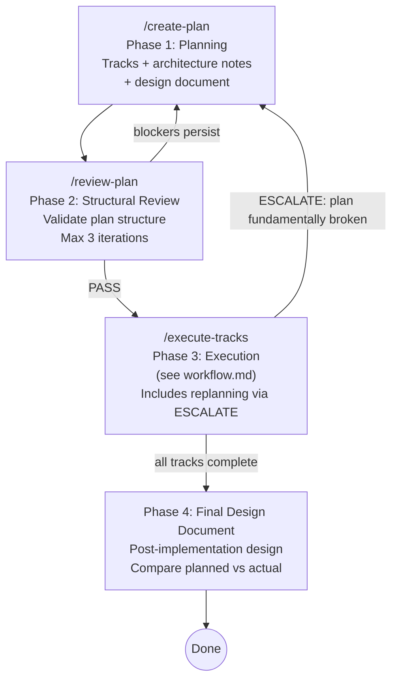
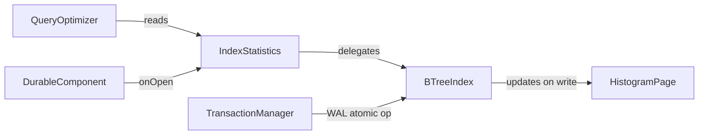
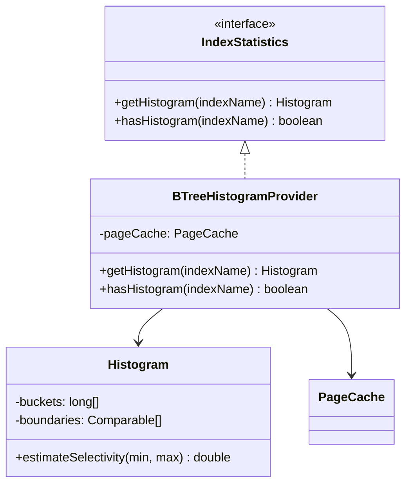
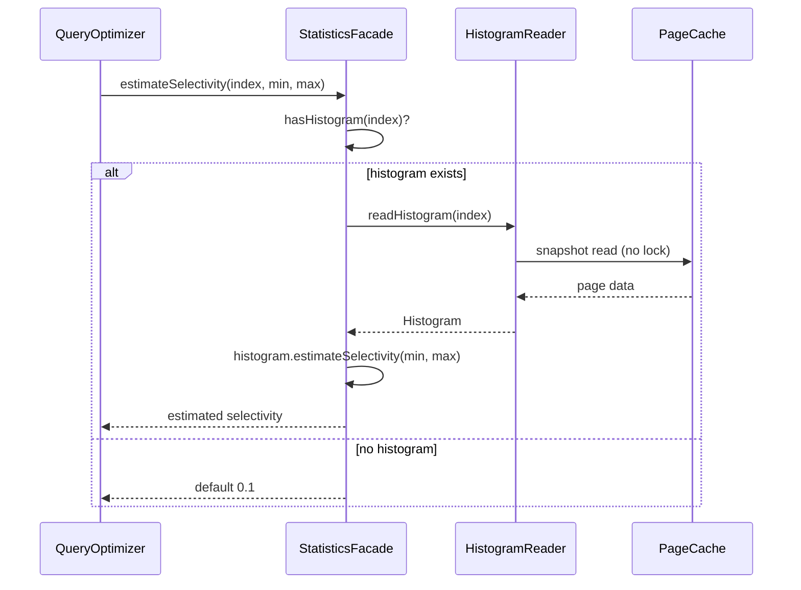

# Planning (Phase 1)

## Overview

This document covers Phase 1 of the development workflow — iteratively
developing an implementation plan. This is a single-session conversation
with no agent teams — the user interacts directly with a single Claude Code
session.

- **Phase 1 (Planning):** Iteratively develop a plan with Claude's help.
  Produce tracks with architecture notes, scope indicators, and design document.
- **Phase 2 (Structural Review):** See
  [`structural-review.md`](structural-review.md).
- **Phase 3 (Execution):** See [`workflow.md`](workflow.md).
- **Phase 4 (Final Design Document):** See [`workflow.md`](workflow.md)
  §Final Design Document.



**Important:** The durable plan always lives in the **project's**
`docs/adr/<dir-name>/` directory (e.g., `docs/adr/ytdb-123-add-auth/implementation-plan.md`).
This is distinct from the global `~/.claude/plans/` where Claude Code stores
ephemeral auto-named session plans. The project plan file is the single source
of truth — it's human-readable, version-controlled, and serves as a lightweight
ADR (Architecture Decision Record) after the feature is complete.

---

## Goal

Produce a plan markdown file with a high-level description, architecture notes,
and track-level decomposition. Step-level decomposition is **deferred to
execution** — tracks include scope indicators (a rough sketch of expected
work) but not detailed steps. Final step decomposition happens just-in-time
during Phase 3 when the execution agent has maximum codebase context from
prior tracks.

## How to run

Start a new Claude Code session and run `/create-plan` (optionally pass a
branch name; if omitted, the current git branch is used). The command prompt
is at `.claude/commands/create-plan.md`. Iterate with Claude until the plan
is complete — ask for research, decomposition, risk analysis, dependency
ordering, etc.

## Plan file structure

The plan file structure is defined in `conventions.md` (section 1.2). The key
points:

- `docs/adr/<dir-name>/implementation-plan.md` — strategic: goals, architecture,
  tracks, track-level episodic summaries
- `docs/adr/<dir-name>/design.md` — design-level: class diagrams, workflow
  diagrams, dedicated sections for complex/opaque parts
- `docs/adr/<dir-name>/tracks/track-N.md` — tactical: decomposed steps, step
  episodes (created during Phase 3)
- `docs/adr/<dir-name>/reviews/structural.md` — structural review output

Track files do not exist during Phase 1 (planning) or
Phase 2 (structural review) — only scope indicators in the plan file exist
at that point.

**The plan is a strategic guide, not a rigid task graph.** Track descriptions,
architecture notes, and inter-track dependencies are the load-bearing parts.
Step-level detail is tactical and should emerge just-in-time during execution
when the execution agent has maximum codebase context. The execution agent
always has freedom to adapt step-level decomposition without formal replanning —
only track-level or decision-level changes require escalation.

## Architecture Notes format

Architecture notes document the structural context and design decisions for the plan.
They live in the `## High-level plan > ### Architecture Notes` section of the plan file.

### Required sections

Every plan must include these two sections:

**1. Component Map** — The slice of the system this plan touches.

- Show only components this plan modifies plus their immediate neighbors.
- Use a **Mermaid diagram** when there are 3+ components with non-trivial
  relationships. For simpler cases (2 components, one arrow), a bullet list is
  clearer.
- Always pair the diagram with an **annotated bullet list** explaining what
  changes in each component and why. The diagram shows topology; the bullets
  show intent.
- Cap diagrams at ~15 nodes. If larger, split into multiple diagrams per track.

Example:

````markdown
### Component Map



- **QueryOptimizer** — read-only consumer, no changes
- **IndexStatistics** — new class, facade over per-index histograms
- **BTreeIndex** — modified: writes histogram metadata on leaf page splits/merges
- **HistogramPage** — new: 16-byte extension to leaf page header
- **TransactionManager** — unchanged, but histogram update must be inside its WAL scope
````

**2. Decision Records** — One block per non-obvious design choice:

```markdown
#### D1: <Decision title>
- **Alternatives considered**: <what else was on the table>
- **Rationale**: <why this option won — trade-offs, constraints>
- **Risks/Caveats**: <known downsides or things to watch>
- **Implemented in**: Track X (step references added during execution)
```

### Optional sections (include when applicable)

**3. Invariants & Contracts** — What must remain true before/after the change.
Each invariant listed here must have a corresponding test in the relevant step.

```markdown
### Invariants
- Histogram updates must occur inside the same WAL atomic operation as the
  index update (no partial state on crash recovery)
- Histogram read path must not acquire write locks
```

**4. Integration Points** — How new code connects to existing code: entry points,
SPIs, callbacks, event flows.

```markdown
### Integration Points
- Query optimizer reads histograms via `IndexStatistics.getHistogram(indexName)`
- Histogram refresh triggered by `DurableComponent.onOpen()`
```

**5. Non-Goals** — Explicitly state what this plan does NOT attempt. Prevents
scope creep during execution.

```markdown
### Non-Goals
- Multi-column histograms (future work)
- Exact cardinality — this is an estimate
```

### Architecture Notes rules

1. **Component Map and at least one Decision Record are mandatory.** Other
   sections are "include if applicable."
2. **Decisions are immutable once execution starts.** If reality changes, the
   execution agent handles replanning via ESCALATE and adds a revision
   note — decisions are not silently overwritten.
3. **Each decision must reference the track(s) that implement it** — creates
   traceability between "why" and "where." Step references are added during
   Phase 3 execution when steps are decomposed.
4. **Invariants become test assertions** — any invariant listed must have a
   corresponding test in the relevant step.
5. **Keep it scannable** — bullet points and tables over prose. A reviewer should
   find any specific decision in under 10 seconds.
6. **Update diagrams with steps** — when a step modifies component interactions,
   updating the Component Map diagram is part of the episode capture or the
   strategy refresh ADJUST step.
7. **Mermaid diagrams** — required when there are 3+ components with
   non-trivial relationships; omit for simpler cases where a bullet list
   alone is clearer.

## Track descriptions

Each **track** in the checklist must have a description block (in a blockquote
under the track heading). There is no length cap — the description should be as
long as it needs to be to give the execution agent full context. Use bullet
points if it grows beyond a short paragraph.

The description should cover:
- **What** the track achieves
- **How** (high-level approach)
- **Track-specific constraints** (compatibility, performance, locking, etc.)
- **Interactions with other tracks** (dependencies, shared state, ordering)

**Track sizing rule:** If a track would need more than ~5-7 steps, split it
into separate dependent tracks during planning. The execution agent
handles sequencing and episode propagation between dependent tracks — this gives
the same "informed decomposition" benefit without added complexity. Track
sequencing and episode propagation between dependent tracks is handled by the
execution agent.

## Track-level component interaction diagrams

Tracks often have internal component interactions that are too detailed for the
top-level Component Map but too important to skip. Use a track-level Mermaid
diagram when:

- The track has 3+ internal components with non-trivial interactions
- The internal flow (who calls whom, data direction) isn't obvious from the
  description alone

Rules:
- **Optional**, not mandatory — only when the track's internal topology adds
  clarity beyond what the description provides.
- **Scoped to the track** — show only components internal to this track plus
  immediate external touchpoints. Do not repeat the top-level Component Map.
- **Cap at ~10 nodes** (track diagrams are narrower than the top-level map).
- **Pair with an annotated bullet list** — same rule as the top-level map.
- **Update when steps change interactions** — part of the "Update plan" step.

Example:

````markdown
- [ ] Track 2: Query optimizer histogram integration
  > The optimizer currently uses a fixed selectivity estimate (0.1) for all
  > range predicates. This track replaces that with histogram-based estimates.
  >
  > Approach: introduce an `IndexStatistics` facade that the optimizer queries
  > during plan costing. The facade reads histogram data lazily from the
  > B-tree leaf pages added in Track 1.
  >
  > ```mermaid
  > graph TD
  >     CBO[CostBasedOptimizer] -->|estimateSelectivity| SF[StatisticsFacade]
  >     SF -->|hasHistogram?| IC{IndexCache}
  >     IC -->|yes| HR[HistogramReader]
  >     IC -->|no| FE[FixedEstimate 0.1]
  >     HR -->|snapshot read| PC[PageCache]
  > ```
  >
  > - **CostBasedOptimizer** — modified: calls StatisticsFacade instead of
  >   hardcoded 0.1
  > - **StatisticsFacade** — new: checks if histogram exists, delegates
  >   accordingly
  > - **HistogramReader** — new: lock-free snapshot reads from page cache
  > - **PageCache** — unchanged, existing infrastructure from Track 1
  >
  > Constraints:
  > - Must not add latency to queries on indexes without histograms — fall
  >   back to the current fixed estimate.
  > - The optimizer holds no write locks, so histogram reads must be
  >   lock-free.
  > **Scope:** ~4 steps covering facade introduction, histogram reader
  > wiring, optimizer integration, and cost model tests
  > **Depends on:** Track 1
````

## Scope indicators

Core scope indicator format and rules are in `conventions.md` §1.2. This
section provides additional planning-phase guidance.

Every track must include a **Scope** line in its description block: a rough
sketch of the expected work — approximate step count and a brief list of what
they'd cover. Scope indicators are strategic signals, not tactical commitments.
The execution agent always does full step decomposition at execution time
regardless.

Format: `> **Scope:** ~N steps covering X, Y, Z`

Scope indicators serve three purposes:
1. **Structural review** can catch sizing issues (a track claiming ~2 steps
   but describing 8 distinct changes) and ordering problems (scope of
   track B implies a dependency on track A's output).
2. **Human reviewers** can quickly gauge relative effort across tracks.
3. **Execution planning** — the execution agent uses scope indicators as a
   starting point for just-in-time step decomposition, not as a binding contract.

**Rules:**
- The planner should focus energy on track descriptions, architecture notes,
  and inter-track dependencies — not premature step decomposition.
- Scope indicators are estimates. "~3-5 steps" is fine; exact counts are
  not required.
- The brief list (covering X, Y, Z) names the major pieces of work, not
  individual commits. Think "what" not "how."
- Do NOT include full step descriptions, `- [ ] Step:` items, or
  *(provisional)* markers. Steps are decomposed during Phase 3 execution.

## Design Document

The plan must be accompanied by a separate **design document** at
`docs/adr/<dir-name>/design.md` that explains **what will be implemented at a
design level** — not code, but the structural and behavioral design of the
solution. The design document helps reviewers and the execution agent understand
the intent behind the implementation before any code is written.

### Purpose

- Bridge the gap between high-level architecture (Component Map, Decision Records)
  and track-level execution details
- Make complex or non-obvious parts of the implementation explicit so the execution
  agent and reviewers can verify intent without reverse-engineering code
- Provide a single place where the overall design can be understood as a coherent
  whole, not just as a collection of tracks

### Required content

**1. Class diagrams (Mermaid `classDiagram`)** — Show the key classes, interfaces,
and their relationships that this plan introduces or modifies. Focus on:
- New classes/interfaces and their responsibilities
- Inheritance and composition relationships
- Key method signatures that define the contracts between components
- Only include classes relevant to this plan — do not diagram the entire codebase

Include class diagrams when the plan introduces 2+ new classes/interfaces or
modifies relationships between existing classes.

Example:

````markdown

````

**2. Workflow/sequence diagrams (Mermaid `sequenceDiagram` or `flowchart`)** — Show
the runtime behavior of key operations. Use sequence diagrams for interactions
between components over time; use flowcharts for decision logic or state transitions.

Include workflow diagrams when the plan introduces a new operation flow or
significantly modifies an existing one.

Example:

````markdown

````

**3. Dedicated paragraphs for complex or opaque parts** — Any part of the design
that is non-obvious, involves subtle trade-offs, or could be misunderstood must
have its own section with:
- **What** the complex part is
- **Why** it is designed this way (not just what it does, but the reasoning)
- **Gotchas** — subtle behaviors, edge cases, or invariants that are easy to miss

Mark these with a `## <Topic>` heading. Examples of things that warrant dedicated
sections:
- Concurrency or locking strategies
- Crash recovery or durability guarantees
- Performance-sensitive paths with specific algorithmic choices
- Backward compatibility shims or migration logic
- Interactions with external systems or SPIs

### Design Document rules

1. **Separate file** — the design document lives at `docs/adr/<dir-name>/design.md`,
   not inside the implementation plan.
2. **All diagrams must be Mermaid** — use `classDiagram`, `sequenceDiagram`,
   `flowchart`, or `stateDiagram` as appropriate. No external tools or image files.
3. **Design level, not code level** — describe classes, interfaces, relationships,
   and flows. Do not include implementation details like variable names, loop
   constructs, or error handling minutiae.
4. **Pair every diagram with prose** — a diagram without explanation is ambiguous.
   Always follow a diagram with a brief description of what it shows and why the
   design was chosen.
5. **Keep diagrams focused** — cap class diagrams at ~10-12 classes, sequence
   diagrams at ~6-8 participants. Split into multiple diagrams if larger.
6. **Complex parts are mandatory** — if any part of the design involves concurrency,
   crash recovery, performance-critical paths, or non-obvious invariants, it MUST
   have a dedicated section. Omitting these is a structural review finding.
7. **Frozen after Phase 1** — the original `design.md` is never modified after
   planning. It represents the planned design. A separate `design-final.md` is
   produced in Phase 4 (after all tracks complete) to capture the actual
   implemented design. Both documents are kept for planned-vs-actual comparison.

### Design Document structure

```markdown
# <Feature Name> — Design

## Overview
<Brief summary of the design approach — what the solution looks like at a
structural level, which major components are involved, and how they interact.>

## Class Design
<Mermaid classDiagram(s) + prose explaining responsibilities and relationships>

## Workflow
<Mermaid sequenceDiagram(s) and/or flowchart(s) + prose explaining runtime flows>

## <Complex Topic 1>
<Dedicated paragraph: what, why, gotchas>

## <Complex Topic 2>
<Dedicated paragraph: what, why, gotchas>
```

## Checklist decomposition rules

Step decomposition is deferred to Phase 3 execution (Phase A: review +
decomposition). The canonical decomposition rules are in
`conventions-execution.md` §2.6. During planning, focus on track-level
descriptions and scope indicators — not step-level detail.
