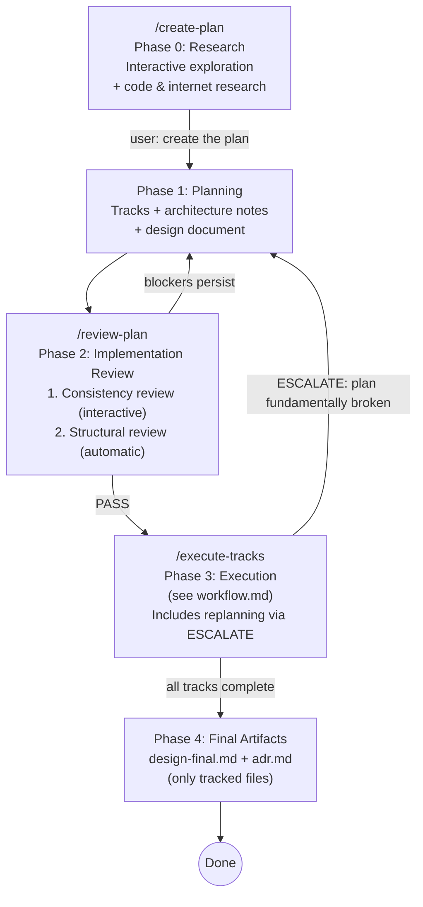

# Planning (Phase 1)

## Overview

This document covers Phase 1 of the development workflow — iteratively
developing an implementation plan. This is a single-session conversation
with no agent teams — the user interacts directly with a single Claude Code
session. Phase 1 is preceded by Phase 0 (Research) in the same session.

- **Phase 0 (Research):** See [`research.md`](research.md) — interactive
  research and exploration. The agent answers questions, explores code, and
  does internet research. Completes only when the user explicitly asks to
  create the plan.
- **Phase 1 (Planning):** Develop a plan informed by Phase 0 findings.
  Produce tracks with architecture notes, scope indicators, and design document.
- **Phase 2 (Implementation Review):** See
  [`implementation-review.md`](implementation-review.md) — two-step review:
  (1) consistency review (design doc ↔ code ↔ plan), (2) structural review.
- **Phase 3 (Execution):** See [`workflow.md`](workflow.md).
- **Phase 4 (Final Artifacts):** See [`workflow.md`](workflow.md)
  §Final Artifacts.



**Important:** The durable plan always lives in the **project's**
`docs/adr/<dir-name>/` directory (e.g., `docs/adr/ytdb-123-add-auth/implementation-plan.md`).
This is distinct from the global `~/.claude/plans/` where Claude Code stores
ephemeral auto-named session plans. The project plan file is the single source
of truth — it's human-readable, version-controlled, and serves as a lightweight
ADR (Architecture Decision Record) after the feature is complete.

---

## Goal

Produce a plan markdown file with a high-level description, architecture notes,
and track-level decomposition. Step-level decomposition is **deferred to
execution** — tracks include scope indicators (a rough sketch of expected
work) but not detailed steps. Final step decomposition happens just-in-time
during Phase 3 when the execution agent has maximum codebase context from
prior tracks.

## How to run

Start a new Claude Code session and run `/create-plan` (optionally pass a
branch name; if omitted, the current git branch is used). The command prompt
is at `.claude/commands/create-plan.md`.

The session begins with **Phase 0 (Research)** — an interactive exploration
where you ask questions, request code investigation, and discuss trade-offs.
The agent stays in research mode until you explicitly ask to create the plan
(e.g., "create the plan", "let's plan this"). At that point, the agent
transitions to Phase 1 (Planning) and produces the plan and design document,
incorporating all findings and decisions from the research phase.

## Plan file structure

The plan file structure is defined in `conventions.md` (section 1.2). The key
points:

- `docs/adr/<dir-name>/implementation-plan.md` — strategic: goals, architecture,
  tracks, track-level episodic summaries
- `docs/adr/<dir-name>/design.md` — design-level: class diagrams, workflow
  diagrams, dedicated sections for complex/opaque parts
- `docs/adr/<dir-name>/tracks/track-N.md` — tactical: decomposed steps, step
  episodes (created during Phase 3)
- `docs/adr/<dir-name>/reviews/structural.md` — structural review output

Track files do not exist during Phase 1 (planning) or
Phase 2 (structural review) — only scope indicators in the plan file exist
at that point.

**The plan is a strategic guide, not a rigid task graph.** Track descriptions,
architecture notes, and inter-track dependencies are the load-bearing parts.
Step-level detail is tactical and should emerge just-in-time during execution
when the execution agent has maximum codebase context. The execution agent
always has freedom to adapt step-level decomposition without formal replanning —
only track-level or decision-level changes require escalation.

## Architecture Notes format

Architecture notes document the structural context and design decisions for the plan.
They live in the `## High-level plan > ### Architecture Notes` section of the plan file.

### Required sections

Every plan must include these two sections:

**1. Component Map** — The slice of the system this plan touches.

- Show only components this plan modifies plus their immediate neighbors.
- Use a **Mermaid diagram** when there are 3+ components with non-trivial
  relationships. For simpler cases (2 components, one arrow), a bullet list is
  clearer.
- Always pair the diagram with an **annotated bullet list** explaining what
  changes in each component and why. The diagram shows topology; the bullets
  show intent.
- Cap diagrams at ~15 nodes. If larger, split into multiple diagrams per track.

**2. Decision Records** — One block per non-obvious design choice:

```markdown
#### D1: <Decision title>
- **Alternatives considered**: <what else was on the table>
- **Rationale**: <why this option won — trade-offs, constraints>
- **Risks/Caveats**: <known downsides or things to watch>
- **Implemented in**: Track X (step references added during execution)
```

### Optional sections (include when applicable)

**3. Invariants & Contracts** — What must remain true before/after the change.
Each invariant listed here must have a corresponding test in the relevant step.

```markdown
### Invariants
- Histogram updates must occur inside the same WAL atomic operation as the
  index update (no partial state on crash recovery)
- Histogram read path must not acquire write locks
```

**4. Integration Points** — How new code connects to existing code: entry points,
SPIs, callbacks, event flows.

```markdown
### Integration Points
- Query optimizer reads histograms via `IndexStatistics.getHistogram(indexName)`
- Histogram refresh triggered during storage open (via `AbstractStorage#open`)
```

**5. Non-Goals** — Explicitly state what this plan does NOT attempt. Prevents
scope creep during execution.

```markdown
### Non-Goals
- Multi-column histograms (future work)
- Exact cardinality — this is an estimate
```

### Architecture Notes rules

1. **Component Map and at least one Decision Record are mandatory.** Other
   sections are "include if applicable."
2. **Decisions are immutable once execution starts.** If reality changes, the
   execution agent handles replanning via ESCALATE and adds a revision
   note — decisions are not silently overwritten.
3. **Each decision must reference the track(s) that implement it** — creates
   traceability between "why" and "where." Step references are added during
   Phase 3 execution when steps are decomposed.
4. **Invariants become test assertions** — any invariant listed must have a
   corresponding test in the relevant step.
5. **Keep it scannable** — bullet points and tables over prose. A reviewer should
   find any specific decision in under 10 seconds.
6. **Update diagrams with steps** — when a step modifies component interactions,
   updating the Component Map diagram is part of the episode capture or the
   strategy refresh ADJUST step.
7. **Mermaid diagrams** — required when there are 3+ components with
   non-trivial relationships; omit for simpler cases where a bullet list
   alone is clearer.

## Track descriptions

Each **track** in the checklist must have a description block (in a blockquote
under the track heading). There is no length cap — the description should be as
long as it needs to be to give the execution agent full context. Use bullet
points if it grows beyond a short paragraph.

The description should cover:
- **What** the track achieves
- **How** (high-level approach)
- **Track-specific constraints** (compatibility, performance, locking, etc.)
- **Interactions with other tracks** (dependencies, shared state, ordering)

**Track sizing rule:** If a track would need more than ~5-7 steps, split it
into separate dependent tracks during planning. The execution agent
handles sequencing and episode propagation between dependent tracks — this gives
the same "informed decomposition" benefit without added complexity. Track
sequencing and episode propagation between dependent tracks is handled by the
execution agent.

## Track-level component interaction diagrams

Optional Mermaid diagrams inside track descriptions, for when the track has
3+ internal components with non-trivial interactions and the flow isn't
obvious from the description alone.

Rules:
- Scoped to the track — don't repeat the top-level Component Map.
- Cap at ~10 nodes. Pair with an annotated bullet list.
- Update when steps change interactions.

## Scope indicators

Format, rules, and purpose: see `conventions.md` §1.2 (Scope indicators).

Every track must include `> **Scope:** ~N steps covering X, Y, Z` in its
description block. Focus planner energy on track descriptions and
architecture, not premature step decomposition.

## Design Document

The plan must be accompanied by a separate **design document** at
`docs/adr/<dir-name>/design.md`. It explains the structural and behavioral
design (not code): class diagrams, workflow diagrams, and dedicated sections
for complex/opaque parts (concurrency, crash recovery, performance paths).

Required content: (1) Mermaid class diagrams, (2) Mermaid workflow/sequence
diagrams, (3) dedicated paragraphs for complex parts. All diagrams paired
with prose. Frozen after Phase 1 — `design-final.md` and `adr.md` are
produced in Phase 4 as the only git-tracked workflow artifacts.

**Full rules, examples, and structure:**
[`design-document-rules.md`](design-document-rules.md)

## Checklist decomposition rules

Step decomposition is deferred to Phase 3 execution (Phase A: review +
decomposition). The canonical decomposition rules are in
`conventions-execution.md` §2.6. During planning, focus on track-level
descriptions and scope indicators — not step-level detail.
