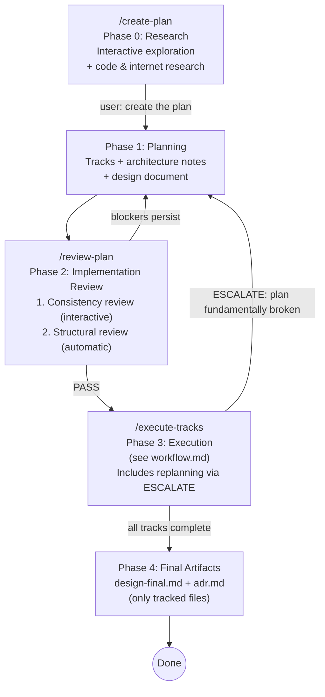

# Planning (Phase 1)

## Overview

This document covers Phase 1 of the development workflow — iteratively
developing an implementation plan. This is a single-session conversation
with no agent teams — the user interacts directly with a single Claude Code
session. Phase 1 is preceded by Phase 0 (Research) in the same session.

- **Phase 0 (Research):** See [`research.md`](research.md) — interactive
  research and exploration. The agent answers questions, explores code, and
  does internet research. Completes only when the user explicitly asks to
  create the plan.
- **Phase 1 (Planning):** Develop a plan informed by Phase 0 findings.
  Produce tracks with architecture notes, scope indicators, and design document.
- **Phase 2 (Implementation Review):** See
  [`implementation-review.md`](implementation-review.md) — two-step review:
  (1) consistency review (design doc ↔ code ↔ plan), (2) structural review.
- **Phase 3 (Execution):** See [`workflow.md`](workflow.md).
- **Phase 4 (Final Artifacts):** See [`workflow.md`](workflow.md)
  §Final Artifacts.



**Important:** The durable plan always lives in the **project's**
`docs/adr/<dir-name>/` directory (e.g., `docs/adr/ytdb-123-add-auth/implementation-plan.md`).
This is distinct from the global `~/.claude/plans/` where Claude Code stores
ephemeral auto-named session plans. The project plan file is the single source
of truth — it's human-readable, version-controlled, and serves as a lightweight
ADR (Architecture Decision Record) after the feature is complete. Claude may
internally use plan mode during any phase — that's fine, but insights must be
captured in the project's track episodes (plan file) and step episodes (step
files), never left only in `~/.claude/plans/`.

---

## Goal

Produce a plan markdown file with a high-level description, architecture notes,
and track-level decomposition. Step-level decomposition is **deferred to
execution** — tracks include scope indicators (a rough sketch of expected
work) but not detailed steps. Final step decomposition happens just-in-time
during Phase 3 when the execution agent has maximum codebase context from
prior tracks.

## How to run

Start a new Claude Code session and run `/create-plan` (optionally pass a
branch name; if omitted, the current git branch is used). The slash command
is implemented by the skill at `.claude/skills/create-plan/SKILL.md`.

The session begins with **Phase 0 (Research)** — an interactive exploration
where you ask questions, request code investigation, and discuss trade-offs.
The agent stays in research mode until you explicitly ask to create the plan
(e.g., "create the plan", "let's plan this"). At that point, the agent
transitions to Phase 1 (Planning) and produces the plan and design document,
incorporating all findings and decisions from the research phase.

## Plan file structure

The plan file structure is defined in `conventions.md` (section 1.2). The key
points:

- `docs/adr/<dir-name>/implementation-plan.md` — strategic: goals, architecture,
  tracks, track-level episodic summaries
- `docs/adr/<dir-name>/design.md` — design-level: class diagrams, workflow
  diagrams, dedicated sections for complex/opaque parts
- `docs/adr/<dir-name>/tracks/track-N.md` — tactical: decomposed steps, step
  episodes (created during Phase 3)
- `docs/adr/<dir-name>/reviews/structural.md` — structural review output

Track files do not exist during Phase 1 (planning) or
Phase 2 (structural review) — only scope indicators in the plan file exist
at that point.

**The plan is a strategic guide, not a rigid task graph.** Track descriptions,
architecture notes, and inter-track dependencies are the load-bearing parts.
Step-level detail is tactical and should emerge just-in-time during execution
when the execution agent has maximum codebase context. The execution agent
always has freedom to adapt step-level decomposition without formal replanning —
only track-level or decision-level changes require escalation.

## Architecture Notes format

Architecture notes document the structural context and design decisions for the plan.
They live in the `## High-level plan > ### Architecture Notes` section of the plan file.

### Boundary with `design.md` and `implementation-backlog.md`

Architecture Notes carry the **strategic** shape of the design — what
components are touched, what decisions were made, what must remain true,
where new code plugs in. Long-form material — worked examples, layered
design diagrams, audit findings, edit-by-edit walk-throughs, crash
scenarios, multi-paragraph rationale derivations — **does not belong
here**. It belongs in `design.md` (long-form architectural and
behavioral design) or `implementation-backlog.md` (per-track edit
detail). Architecture Notes link to those longer documents rather than
duplicating them.

The plan file is loaded at every `/execute-tracks` session startup, so
bloat in Architecture Notes is paid by every Phase A/B/C session for
the rest of the plan's life. The per-section budgets below exist to
keep that cost bounded; the table in *Per-section budget at a glance*
just below summarizes them, and each section restates its own budget
alongside its format rules.

> **Rule of thumb:** if you find yourself writing a worked example, a
> multi-paragraph derivation, a code-change inventory, or a "here is
> how all the pieces fit together" walk-through inside a decision
> record, an invariant, or an integration-point bullet, **stop and
> move it to `design.md`** (or, if it is per-track edit detail, to
> `implementation-backlog.md`). Replace the original location with a
> one-line link.

### Per-section budget at a glance

| Section | Budget |
|---|---|
| Component Map intent bullet | ≤ ~5 lines per component |
| Decision Record | 15–30 lines (four-bullet form + optional `**Full design**`) |
| Invariant | ≤ ~5 lines |
| Integration Point | ≤ ~3 lines per bullet |
| Track checklist intro | 1–3 sentences + `**Scope:**` + `**Depends on:**` |
| Plan file total | ~1,500 lines / ~30K tokens |

The Track-checklist-intro budget is enforced via the existing
TRACK DESCRIPTIONS and SCOPE INDICATORS checks in the structural
review prompt (sentence-count and Scope-line presence), not as a
separate mechanical bloat rule. Every other row above has a
corresponding mechanical check in [`structural-review.md`](structural-review.md)
§ Bloat checks.

Each section below restates its own budget alongside its format rules.
Where a plan would exceed a budget, the long-form material almost
always belongs in `design.md` (worked examples, layered diagrams,
complex-topic walk-throughs, multi-paragraph rationale) or
`implementation-backlog.md` (per-track edit detail — files, classes,
methods, edit ordering). The structural review (Phase 2) enforces the
budgets as first-class findings — see
[`structural-review.md`](structural-review.md) § Bloat checks.

### Required sections

Every plan must include these two sections:

**1. Component Map** — The slice of the system this plan touches.

- Show only components this plan modifies plus their immediate neighbors.
- Use a **Mermaid diagram** when there are 3+ components with non-trivial
  relationships. For simpler cases (2 components, one arrow), a bullet list is
  clearer.
- Always pair the diagram with an **annotated bullet list** explaining what
  changes in each component and why. The diagram shows topology; the bullets
  show intent.
- Cap diagrams at ~15 nodes. If larger, split into multiple diagrams per track.
- **Cap each component's intent bullet at ~5 lines** (one short
  paragraph, sub-bullets allowed). The bullets accompany the diagram —
  they are *not* a place for design-level descriptions. If a
  component's intent prose grows beyond ~5 lines, that's the signal to
  split out a `design.md` section for that component's behavioral
  change and link to it from the bullet.

**2. Decision Records** — One block per non-obvious design choice:

```markdown
#### D1: <Decision title>
- **Alternatives considered**: <what else was on the table>
- **Rationale**: <why this option won — trade-offs, constraints>
- **Risks/Caveats**: <known downsides or things to watch>
- **Implemented in**: Track X (step references added during execution)
- **Full design**: design.md §<section> (only when the decision drives
  a non-trivial design that needs walked examples, layered diagrams,
  or extended discussion — omit when the four lines above are the
  whole story)
```

**Decision Record rules:**

- **Cap each DR at ~30 lines.** A DR that exceeds 30 lines is a signal
  that long-form material has leaked in. The four-bullet form (plus
  optional `Full design` link) is naturally a 10–20 line block.
- **What a DR carries:** *alternatives considered*, *rationale*,
  *risks/caveats*, *where it lands*, and (optionally) *a one-line link
  to its long-form design*. Worked examples, audit findings, edit-by-
  edit guidance, layered designs, and crash-scenario walk-throughs
  **do not belong here** — they belong in `design.md` (long-form
  design) or `implementation-backlog.md` (per-track edit detail). The
  DR links to those rather than absorbing them.
- **Superseded DRs are deleted, not retained.** When a decision is
  replaced (e.g., DN supersedes DM), remove DM from the plan entirely
  and document the supersession in DN's rationale ("This replaces an
  earlier approach where ...") rather than keeping both. The plan
  reflects the *current* decision set, not the history. If the
  superseded approach matters for future readers, capture it in the
  Phase 4 `adr.md`.

**Good DR (~12 lines):**

````markdown
#### D7: Use coarse-grained snapshot for histogram refresh

- **Alternatives considered**: per-key incremental updates; background
  sampling; coarse snapshot at storage open and on schema change (chosen).
- **Rationale**: refresh frequency is bounded by schema-change rate,
  which is rare in this workload. Per-key incremental doubles
  write-path cost; sampling adds a background thread.
- **Risks/Caveats**: post-DDL window where stats reflect prior schema.
  Bounded by schema-change frequency; planner already tolerates
  approximate stats.
- **Implemented in**: Track 3
- **Full design**: design.md §"Histogram refresh strategy" (covers
  the on-open scan walk and the schema-change trigger hook)
````

**Bad DR (anti-pattern):** A DR that has grown past ~30 lines almost
always did so by absorbing material that belongs elsewhere — the
alternatives' implementation sketches, layered design diagrams, audit
result tables, edit-list bullets, crash-scenario walk-throughs. The
fix is mechanical: **trim back to the four-bullet form** and move the
long-form material to a new (or existing) `design.md` section, linked
from `Full design`. If the displaced material is per-track edit detail
(files to touch, methods to add), move it to the track section in
`implementation-backlog.md` instead.

### Optional sections (include when applicable)

**3. Invariants & Contracts** — What must remain true before/after the change.
Each invariant listed here must have a corresponding test in the relevant step.

```markdown
### Invariants
- Histogram updates must occur inside the same WAL atomic operation as the
  index update (no partial state on crash recovery)
- Histogram read path must not acquire write locks
```

**Cap each invariant at ~5 lines** (a one-paragraph statement plus
optional sub-clauses). Multi-paragraph derivations of invariant
semantics belong in a `design.md` complex-topic section; the invariant
entry here states the rule and (when a long-form derivation exists)
links to the section that explains why.

**4. Integration Points** — How new code connects to existing code: entry points,
SPIs, callbacks, event flows.

```markdown
### Integration Points
- Query optimizer reads histograms via `IndexStatistics.getHistogram(indexName)`
- Histogram refresh triggered during storage open (via `AbstractStorage#open`)
```

**Cap each integration-point bullet at ~3 lines.** Multi-step workflow
walk-throughs ("Step 1 / Step 2 / Step 3 ...") belong in `design.md`
Workflow sections; the bullet here names the connection point and (if
a workflow section exists) links to it.

**5. Non-Goals** — Explicitly state what this plan does NOT attempt. Prevents
scope creep during execution.

```markdown
### Non-Goals
- Multi-column histograms (future work)
- Exact cardinality — this is an estimate
```

### Architecture Notes rules

1. **Component Map and at least one Decision Record are mandatory.** Other
   sections are "include if applicable."
2. **Decisions are immutable once execution starts.** If reality changes, the
   execution agent handles replanning via ESCALATE and adds a revision
   note — decisions are not silently overwritten.
3. **Each decision must reference the track(s) that implement it** — creates
   traceability between "why" and "where." Step references are added during
   Phase 3 execution when steps are decomposed.
4. **Invariants become test assertions** — any invariant listed must have a
   corresponding test in the relevant step.
5. **Keep it scannable** — bullet points and tables over prose. A reviewer should
   find any specific decision in under 10 seconds.
6. **Update diagrams with steps** — when a step modifies component interactions,
   updating the Component Map diagram is part of the episode capture or the
   strategy refresh ADJUST step.
7. **Mermaid diagrams** — required when there are 3+ components with
   non-trivial relationships; omit for simpler cases where a bullet list
   alone is clearer.
8. **Respect the per-section budgets** — DR ≤ ~30 lines, invariant ≤ ~5
   lines, integration-point bullet ≤ ~3 lines, component intent bullet
   ≤ ~5 lines, plan file total ~1,500 lines / ~30K tokens (see the
   *Per-section budget at a glance* table above and each section's own
   rules for the rationale). Exceeding a budget is the signal that
   long-form material has leaked into the plan and should move to
   `design.md` or `implementation-backlog.md`.
9. **No plan/design duplication.** If a decision record, invariant, or
   integration-point bullet starts to repeat prose that already exists
   in `design.md`, replace the duplicated body with a one-line link to
   the design section. The plan is the **strategic** view; the design
   document is the **long-form** view; nothing should appear in full
   in both.

## Track descriptions

Each **track** in the checklist is described across two files:

- **`implementation-plan.md` (thin checklist entry):** a blockquote under
  the track heading containing an **intro paragraph** — a short paragraph
  of high-level context (typically 1-3 sentences) — plus the `**Scope:**`
  line and, when applicable, the `**Depends on:**` line. This is the
  content every `/execute-tracks` session loads at startup, so keep it
  compact.
- **`implementation-backlog.md` (detailed description):** a `## Track N:
  <title>` section with bold-label blockquote subsections covering the
  full detail. The intro paragraph lives in the plan entry only — the
  backlog section carries only the `**What/How/Constraints/Interactions**`
  subsections and any optional track-level diagram. Phase A assembles
  the step file's `## Description` section from both sources (intro
  from the plan; detail from the backlog). This content is read only
  in Phase A of one track per session; there is no length cap — make
  it as long as the execution agent needs.

The detailed description in the backlog should cover:
- **What** the track achieves (concrete deliverables — files to touch,
  APIs to add, behaviors to change)
- **How** (high-level approach — sequencing, invariants to preserve,
  ordering constraints)
- **Constraints** (in-scope/out-of-scope files, compatibility
  requirements, performance budgets, locking or crash-safety rules)
- **Interactions with other tracks** (dependencies, shared state,
  ordering, hand-off artifacts)

The file format and template for both files are defined in
`conventions.md` §1.2; the authoritative location of the detailed
description over time (Phase 1 → Phase A → Phase B/C) is given by the
description-lifecycle table in `conventions-execution.md` §2.1.

**Track sizing rule:** If a track would need more than ~5-7 steps, split it
into separate dependent tracks during planning. The execution agent
handles sequencing and episode propagation between dependent tracks — this gives
the same "informed decomposition" benefit without added complexity. Track
sequencing and episode propagation between dependent tracks is handled by the
execution agent.

## Track-level component interaction diagrams

Optional Mermaid diagrams that belong with a track's **detailed
description**, for when the track has 3+ internal components with
non-trivial interactions and the flow isn't obvious from the prose alone.

Location lifecycle:
- **Phase 1 (planning):** the diagram is written inside the track's
  section of `implementation-backlog.md` as a separate fenced `mermaid`
  block immediately after the `**Interactions**:` blockquote (outside
  the blockquote — see the template in `conventions.md` §1.2). It is
  **never rendered in `implementation-plan.md`** — plan readers who
  want visual reasoning about a specific track open the backlog (or,
  after Phase A, the step file).
- **Phase A (start of track execution):** the diagram moves with the
  rest of the description into the step file's `## Description`
  section. See the lifecycle row for track-level diagrams in
  `conventions-execution.md` §2.1.

Rules:
- Scoped to the track — don't repeat the top-level Component Map. If a
  track-level diagram starts to carry cross-track reasoning, that's a
  signal to elevate it into the plan's top-level Component Map instead.
- Cap at ~10 nodes. Pair with an annotated bullet list.
- Update when steps change interactions (the step file's `## Description`
  section is the authoritative copy during Phase B/C).

## Scope indicators

Format, rules, and purpose: see `conventions.md` §1.2 (Scope indicators).

Every track must include `> **Scope:** ~N steps covering X, Y, Z` in its
description block. Focus planner energy on track descriptions and
architecture, not premature step decomposition.

## Design Document

The plan must be accompanied by a separate **design document** at
`docs/adr/<dir-name>/design.md`. It explains the structural and behavioral
design (not code): class diagrams, workflow diagrams, and dedicated sections
for complex/opaque parts (concurrency, crash recovery, performance paths).

Required content: a concept-first Overview as first content (≤40
lines, plain language); Core Concepts vocabulary primer between
Overview and Class Design when the doc has `# Part N` headings or
introduces ≥3 new domain terms; Mermaid class diagrams; Mermaid
workflow/sequence diagrams; and dedicated `##` sections for
complex parts each following the per-section shape (TL;DR +
mechanism overview + edge cases + References footer). All
diagrams paired with prose. Frozen after Phase 1 —
`design-final.md` and `adr.md` are produced in Phase 4 as the
only git-tracked workflow artifacts.

**Mutation discipline.** Every modification to `design.md` —
whether the initial creation in this phase, a later interactive
revision ("add a section about X"), or a later inline-replanning
update — is implemented as **one atomic action that bundles
`(apply edit → auto-review → bounded iterate → present)`**. The
agent does not directly Edit `design.md` mid-conversation; it
invokes the mutation action, which wraps the auto-review gate
(mechanical checks + cold-read sub-agent). This makes the shape
rules in `design-document-rules.md` self-enforcing across every
situation that touches the design. See `design-document-rules.md`
§ Mutation discipline for the full protocol.

**Phase 1 sub-phases (working / sync model).** Phase 1 is
internally three sub-phases — see `design-document-rules.md`
§ Two-mode editing — working vs sync for the rationale and the
full protocol:

- **Phase 1.1 — Initial creation (`phase1-creation`).** Both
  `design.md` and `design-mechanics.md` are seeded together.
  Full discipline runs on `design.md`; mechanics gets stripped
  mechanical checks (it's agent-targeted long-form, not the
  human-facing summary).
- **Phase 1.2 — Working iteration (`mechanics-edit`).** The user
  reviews `design.md` (frozen as a stable reference) and issues
  feedback. The agent mutates only `design-mechanics.md` in
  response. Mechanical checks fire; **cold-read is deferred**.
  The working-mode counter increments; at N=5 the skill
  auto-suggests a sync (the user can defer or accept).
- **Phase 1.3 — Sync (`design-sync`).** The agent re-distills
  `design.md` from the current state of mechanics. Full discipline
  runs (mechanical + whole-doc cold-read). Plan/backlog
  `**Full design**` refs are propagated for any added/removed/
  renamed sections. The working-mode counter resets to 0. After
  sync, the loop returns to Phase 1.2 or moves to Phase 2.

The user can also explicitly request a sync at any working-mode
count ("update design.md now", "let's publish the polished
version") — explicit requests override the N=5 default.

**Invocation:** use the `edit-design` skill
([`.claude/skills/edit-design/SKILL.md`](../skills/edit-design/SKILL.md)),
not direct `Edit` / `Write` calls. The skill knows how to dispatch
each mutation kind and how to read the working-mode counter from
the review log.

**Full rules, examples, and structure:**
[`design-document-rules.md`](design-document-rules.md)

## Checklist decomposition rules

Step decomposition is deferred to Phase 3 execution (Phase A: review +
decomposition). The canonical decomposition rules are in
[`track-review.md`](track-review.md) §Step Decomposition. During planning,
focus on track-level descriptions and scope indicators — not step-level
detail.

## Tooling — PSI-backed Component Map and integration points

Architecture Notes that name code constructs (Component Map, Integration
Points, Decision Records that cite specific classes/methods, Invariants
that refer to existing enforcement sites) ride on the assumption that
the cited symbols exist with the cited shape and the cited callers.
Verify those facts through the IntelliJ PSI via mcp-steroid when the
IDE is connected — per the rule in
[`conventions.md`](conventions.md) §1.4 *Tooling discipline*. The
preflight (`steroid_list_projects`), the requirement that load-bearing
audits use PSI rather than grep, and the explicit-instruction rule for
sub-agent delegations all apply during planning.

In particular, when the plan claims a component is touched only in
specific places, an integration point has only specific callers, or a
new SPI has no preexisting consumer, those statements need PSI-backed
verification before they land in `implementation-plan.md` or
`design.md` — they shape Phase A complexity assessment and step
sizing, and silent grep misses become Phase A surprises.
