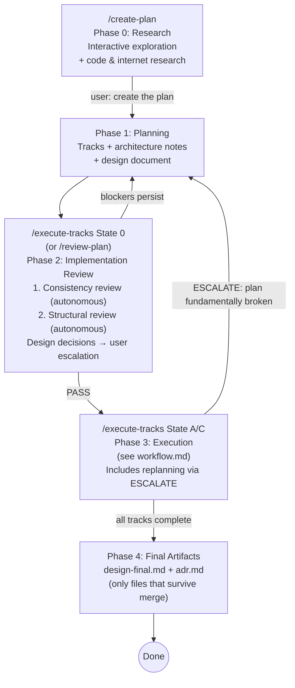

# Planning (Phase 1)

<!--Document index start-->

| Section | Roles | Phases | Summary |
|---|---|---|---|
| §Overview | planner | 1 | Phase 1 develops the implementation plan and design document in a single session, informed by Phase 0 research. |
| §Goal | planner | 1 | Author the design doc first in its own reviewed session, then derive the plan; step detail is deferred to execution. |
| §Tier classification | planner | 1 | The two-gate change tier (full/lite/minimal), decided at Phase 0 to 1, selects the Phase-1 artifact and review set. |
| §How to run | planner | 0,1 | Start /create-plan, run Phase 0 research, then transition to Phase 1 planning on the user's explicit go-ahead. |
| §Plan file structure | planner | 1 | The _workflow files (research log, plan, design, track files, mutation log); the per-tier artifact set governs which. |
| §Architecture Notes format | planner | 1 | Architecture Notes carry the strategic shape of the design; the section's per-component budgets keep the plan file lean. |
| §Boundary with `design.md` and track files | planner | 1 | Architecture Notes hold strategic shape only; long-form material belongs in the design doc or track narrative. |
| §Per-section budget at a glance | planner,reviewer-plan | 1,2 | The per-section line/token budgets (component, DR, invariant, integration, intro, total) enforced by structural review. |
| §Required sections | planner | 1 | The two mandatory Architecture Notes sections: Component Map and Decision Records, with their format and budget rules. |
| §Optional sections (include when applicable) | planner | 1 | The optional Architecture Notes sections: Invariants & Contracts, Integration Points, Non-Goals, with their budgets. |
| §Architecture Notes rules | planner | 1 | The nine Architecture Notes rules: mandatory sections, immutability, traceability, budgets, no plan/design duplication. |
| §Track descriptions | planner | 1 | Each track is described across the thin plan-file checklist entry and the four Phase 1 track-level sections. |
| §Track-level component interaction diagrams | planner | 1 | Optional per-track Mermaid diagrams live in the track file's Interfaces and Dependencies section, not the plan. |
| §Scope indicators | planner | 1 | Every track carries a `> **Scope:** ~N files covering X, Y, Z` line; format and purpose live in conventions. |
| §Design Document | planner | 1 | The design doc is authored first in its own reviewed session, then frozen; the plan derives from it. |
| §Checklist decomposition rules | planner | 1 | Step decomposition is deferred to Phase 3; the canonical rules live in the track-review §Step Decomposition. |
| §Tooling — PSI-backed Component Map and integration points | planner | 1 | Verify symbols, callers, and SPI consumers named in Architecture Notes through PSI via mcp-steroid before they land. |

<!--Document index end-->

## Overview
<!-- roles=planner phases=1 summary="Phase 1 develops the implementation plan and design document in a single session, informed by Phase 0 research." -->

This document covers Phase 1 of the development workflow — iteratively
developing an implementation plan. This is a single-session conversation
with no agent teams — the user interacts directly with a single Claude Code
session. Phase 1 is preceded by Phase 0 (Research) in the same session.

- **Phase 0 (Research):** See research.md:planner:0 — interactive
  research and exploration. The agent answers questions, explores code, and
  does internet research. Completes only when the user explicitly asks to
  create the plan.
- **Phase 1 (Planning):** Develop a plan informed by Phase 0 findings.
  Produce tracks with architecture notes, scope indicators, and design document.
- **Phase 2 (Implementation Review):** See
  implementation-review.md:orchestrator,reviewer-plan:2 — autonomous
  two-step review run as the first phase of `/execute-tracks` (State 0):
  (1) consistency review (design doc ↔ code ↔ plan), (2) structural
  review. Mechanical findings auto-fixed; only design-decision findings
  escalated to the user. Optionally re-invoked via `/review-plan`.
- **Phase 3 (Execution):** See workflow.md:orchestrator:2,3A,3B,3C,4.
- **Phase 4 (Final Artifacts):** See workflow.md:orchestrator:2,3A,3B,3C,4
  §Final Artifacts.



**Important:** The plan and every other working file always live in the
**project's** `docs/adr/<dir-name>/_workflow/` directory (e.g.,
`docs/adr/ytdb-123-add-auth/_workflow/implementation-plan.md`). This is
distinct from the global `~/.claude/plans/` where Claude Code stores
ephemeral auto-named session plans. The project plan file is the single
source of truth — it's human-readable, tracked in git for the branch
lifetime so the draft PR shows progress, and removed in the Phase 4
cleanup commit (only `design-final.md` and `adr.md` survive merge into
`develop` as the durable lightweight ADR record). Claude may internally
use plan mode during any phase — that's fine, but insights must be
captured in the project's track episodes (plan file) and step episodes
(track files), never left only in `~/.claude/plans/`.

---

## Goal
<!-- roles=planner phases=1 summary="Author the design doc first in its own reviewed session, then derive the plan; step detail is deferred to execution." -->

Produce a plan markdown file with a high-level description, architecture notes,
and track-level decomposition. The flow is **tier-adaptive** (§Tier
classification): the description below is the `full`-tier path, where the
plan is **derived from a frozen, reviewed `design.md`**; `lite` and
`minimal` shed the design and author the plan and track files directly
from the research log in a single session. In `full`, Phase 1 is
design-first: `create-plan` authors and reviews `design.md` first
(Step 4a), the design freezes and is committed when its review passes, and the
implementation plan is derived from that frozen seed (Step 4b) within the same
`/create-plan` invocation. The plan back-fills nothing the design has not
already settled, so the Decision Records mirror the design's decisions rather
than crystallizing ahead of it. The two steps no longer span a session
boundary; the context isolation that boundary forced is supplied by the
`design-author` sub-agent spawn, which reads the frozen committed design
regardless of session. `/create-plan` auto-resumes plan derivation as crash
recovery only — when `design.md` is committed and clean and
`implementation-plan.md` does not exist (see
`create-plan/SKILL.md` Step 1c / Step 4). Step-level decomposition is
**deferred to execution** in every tier — tracks include scope indicators (a
rough sketch of expected work) but not detailed steps. Final step
decomposition happens just-in-time during Phase 3 when the execution agent
has maximum codebase context from prior tracks.

## Tier classification
<!-- roles=planner phases=1 summary="The two-gate change tier (full/lite/minimal), decided at Phase 0 to 1, selects the Phase-1 artifact and review set." -->

Phase 1 is **tier-adaptive**: a one-line fix does not pay the ceremony a
durability rework needs. `create-plan` Step 4 classifies the change into
one of three tiers at the Phase 0 → 1 boundary, from the research log,
before any Phase-1 artifact is authored, and the user confirms it.

**The two gates.** The tier is two orthogonal yes/no questions, not one
ordinal scale:

| Gate | Question | Answers |
|---|---|---|
| Gate 1 | Does the change need a `design.md`? | yes / no |
| Gate 2 | Does the change span multiple tracks? | multi / single |

A design-needing change is multi-track by construction (a change worth a
design document is not a single-track stub), so the two gates collapse to
three reachable tiers:

| Tier | Gate 1 | Gate 2 | Phase-1 artifacts |
|---|---|---|---|
| `full` | design = yes | multi | research log + phase ledger + plan-review doc + `design.md` + thinned plan + track files |
| `lite` | design = no | multi | research log + phase ledger + plan-review doc + thinned plan + track files (no design) |
| `minimal` | design = no | single | research log + phase ledger + plan-review doc + one self-contained track file (no plan) |

The tier names are deliberately distinct from the per-step **risk tag**
(`low`/`medium`/`high`) and the Phase-3A step-count axis
(Simple/Moderate/Complex) so the three vocabularies never collide
(`conventions.md` `§1.1` glossary). The confirmed tier persists as a field
in the **phase ledger** (`_workflow/phase-ledger.md`, present in every
tier; D4, `conventions.md` `§1.2` *Per-tier artifact set*) so every fresh
`/execute-tracks` session reads it — the ledger, not a plan line, is the
resume-state and tier home, which is what lets `minimal` drop the plan.

**Gate 1 criteria — one source of truth with risk-tagging.** Gate 1's
"needs a design" test reuses the HIGH-risk category list in
`risk-tagging.md` §Gate 1 reuse (change-level) — `Concurrency`,
`Crash-safety / Durability`, `Public API`, `Security`,
`Architecture / cross-component coordination`, `Performance hot path`, and
`Workflow machinery` — read at the **change** level rather than the
per-step level. The same list drives the Phase-A per-step tagging; one
source of truth. Gate 1 is yes only when a category is **central to the
change's purpose**, not merely touched by one incidental edit. The agent
proposes the tier and the centrally-matched categories from the research
log; the user confirms or overrides in either direction, and may add or
drop an adversarial lens at confirmation. The centrally-matched categories
prime the relocated adversarial review's lenses
(`prompts/adversarial-review.md` §Research-log-scoped review).

**Per-tier Phase-1 flow.**

- `full` — design-first, exactly as §Goal and §Design Document describe:
  `design.md` is authored and reviewed in Step 4a, freezes and is committed
  when its review passes, and the thinned plan plus track files derive from
  that frozen seed in Step 4b — both within one `/create-plan` invocation, no
  longer across a session boundary (the `design-author` sub-agent spawn
  supplies the context isolation).
- `lite` — no `design.md`. The thinned plan and the track files are
  authored in a single Phase-1 session (Step 4b only); the track files
  carry the full inline Decision Records directly, with no design seed to
  derive from.
- `minimal` — no `design.md` and **no plan** (D2). **One** self-contained
  track file, authored in a single Phase-1 session, carries the whole
  change; resume state lives in the phase ledger
  (`conventions.md` `§1.2` *Per-tier artifact set*).

**The phase ledger and the inline-DR carrier (every tier).** The resume
state machine, the drift gate, and Phase-2 routing read the **phase
ledger** (`_workflow/phase-ledger.md`, present in every tier; D3) for
branch-level state, so dropping the `minimal` plan does not break the
machinery. The `implementation-plan.md`, where present (`lite`/`full`), is
a **derived-mirror plan** (D1): a cross-track summary that holds no fact a
track file does not already own. The **live decision
carrier is the track file** in every tier: each track's `## Decision Log`
carries the full inline Decision Record (D7, the track-canonical live
decision, `conventions.md` `§1.1` glossary). In `full`, the frozen `design.md` keeps a seed
copy of each D-record for derivation, navigation, and `**Full design**`
references — historical provenance, never the live authority. After a
track absorbs a decision, the track is the source of truth.

**Mid-flight tier upgrade.** Gate 2 stays an estimate until decomposition.
If the estimate is wrong mid-execution — a `minimal` single track balloons,
or a `lite` change turns out to need a design — the tier upgrade rides the
existing inline-replan ESCALATE path, adding the new tier's artifacts and
running its Phase-3A passes from the upgrade point onward. It does not
reach back to re-run a Phase-2 pass an earlier session already skipped, and
downgrades are likewise not automatic (a completed review cannot be
un-run).

## How to run
<!-- roles=planner phases=0,1 summary="Start /create-plan, run Phase 0 research, then transition to Phase 1 planning on the user's explicit go-ahead." -->

Start a new Claude Code session and run `/create-plan` (optionally pass a
branch name; if omitted, the current git branch is used). The slash command
is implemented by the skill at `.claude/skills/create-plan/SKILL.md`.

The session begins with **Phase 0 (Research)** — an interactive exploration
where you ask questions, request code investigation, and discuss trade-offs.
The agent stays in research mode until you explicitly ask to create the plan
(e.g., "create the plan", "let's plan this"). At that point, the agent
transitions to Phase 1 (Planning) and produces the plan and design document,
incorporating all findings and decisions from the research phase.

## Plan file structure
<!-- roles=planner phases=1 summary="The _workflow files (research log, plan, design, track files, mutation log); the per-tier artifact set governs which." -->

The plan file structure is defined in `conventions.md` `§1.2`,
including the `§1.2` *Per-tier artifact set* that says which of these the
change tier produces. The key points:

- `docs/adr/<dir-name>/_workflow/research-log.md` — the durable Phase-0/1
  decision ledger, produced in every tier (see `research.md` §The research
  log)
- `docs/adr/<dir-name>/_workflow/phase-ledger.md` — the append-only,
  unstamped event log that owns branch-level resume state (phase, active
  track, tier + matched categories, `§1.7` staging mode, pause events),
  produced in every tier; last-value-wins on read (D3/D6,
  `conventions.md` `§1.1` *Phase ledger*)
- `docs/adr/<dir-name>/_workflow/plan-review.md` — the Phase-2 consistency
  and structural audit summary, produced in every tier; a cold record the
  review state in the ledger points at (D7)
- `docs/adr/<dir-name>/_workflow/implementation-plan.md` — the
  **derived-mirror plan**: a cross-track summary (the `## Checklist` plus a
  thin cross-track Component Map) that mirrors content the track files own
  (`lite`/`full` only; `minimal` drops it — D1/D2)
- `docs/adr/<dir-name>/_workflow/design.md` — design-level: class diagrams, workflow
  diagrams, dedicated sections for complex/opaque parts (`full` tier only)
- `docs/adr/<dir-name>/_workflow/plan/track-N.md` — per-track ExecPlan, created at
  Phase 1 with its four track-level sections plus the inline Decision
  Records in `## Decision Log`; the `## Concrete Steps` roster is filled at
  Phase A
- `docs/adr/<dir-name>/_workflow/design-mutations.md` — append-only mutation log
  for `design.md` / `design-mechanics.md`; read by `edit-design`'s
  `design-sync` step (`full` tier only)

The `_workflow/` directory is tracked under git for the branch
lifetime (so the draft PR shows progress to teammates and so a
disk-loss never destroys work) and is removed in the Phase 4
cleanup commit before merge — see `conventions.md` `§1.2` and
`workflow.md` § Final Artifacts.

Track files **are** created during Phase 1, carrying the four track-level
sections (`## Purpose / Big Picture`, `## Context and Orientation`,
`## Plan of Work`, `## Interfaces and Dependencies`) and the inline
Decision Records in `## Decision Log`. What is deferred to Phase 3 is the
per-step decomposition (`## Concrete Steps`), not the track file itself —
at Phase 1/2 the roster is empty and only the track-level sections plus
the plan-file scope indicators are populated.

**The plan is a strategic guide, not a rigid task graph.** Track descriptions,
architecture notes, and inter-track dependencies are the load-bearing parts.
Step-level detail is tactical and should emerge just-in-time during execution
when the execution agent has maximum codebase context. The execution agent
always has freedom to adapt step-level decomposition without formal replanning —
only track-level or decision-level changes require escalation.

## Architecture Notes format
<!-- roles=planner phases=1 summary="Architecture Notes carry the strategic shape of the design; the section's per-component budgets keep the plan file lean." -->

**Disposition under the derived-mirror plan (D5).** The plan no longer
carries a full `### Architecture Notes` block. Each old part has a new
home, and the plan keeps only the thin cross-track Component Map:

- **`### Goals`** — dropped from the plan. The aim lives in the research
  log's `## Initial request` and the PR `## Motivation`.
- **Component Map** — stays in the plan as the thin **cross-track**
  Component Map (`## Component Map`), for cross-track impact assessment.
  The format and budget rules below still apply to it.
- **Decision Records** — track-canonical (D7): each track's
  `## Decision Log` carries the full inline DR. The plan no longer holds
  them. In `full`, the frozen `design.md` keeps the seed copy. The DR
  format below is the shape those track-file records take.
- **`### Constraints` + Invariants** — move to each track's combined
  `## Invariants & Constraints` section (D9). The Invariants format
  below is the shape they take there.
- **Integration Points** — move to each track's `## Interfaces and
  Dependencies` (D9). The format below is their shape there.
- **Non-Goals** — move to the research log and the PR `## Motivation`
  (and `design.md` in `full`).

The sub-sections below are retained as the **format reference** for these
parts in their new homes (the DR four-bullet shape, the invariant and
integration-point budgets); they no longer describe a single in-plan
`### Architecture Notes` block. The remainder of this section reads as the
format/budget rules wherever the content now lives.

Architecture notes document the structural context and design decisions for the change.
Under the derived-mirror model the thin cross-track Component Map lives in
the plan file's `## Component Map` section; Decision Records, invariants,
constraints, and integration points live in the track files (see the
disposition above).

### Boundary with `design.md` and track files
<!-- roles=planner phases=1 summary="Architecture Notes hold strategic shape only; long-form material belongs in the design doc or track narrative." -->

Architecture Notes carry the **strategic** shape of the design — what
components are touched, what decisions were made, what must remain true,
where new code plugs in. Long-form material — worked examples, layered
design diagrams, audit findings, edit-by-edit walk-throughs, crash
scenarios, multi-paragraph rationale derivations — **does not belong
here**. It belongs in `design.md` (long-form architectural and
behavioral design) or `plan/track-N.md` (the per-track narrative
sections — `## Context and Orientation`, `## Plan of Work`,
`## Interfaces and Dependencies`). Architecture Notes link to those
longer documents rather than duplicating them.

The plan file is loaded at every `/execute-tracks` session startup, so
bloat in Architecture Notes is paid by every Phase A/B/C session for
the rest of the plan's life. The per-section budgets below exist to
keep that cost bounded; the table in *Per-section budget at a glance*
just below summarizes them, and each section restates its own budget
alongside its format rules.

> **Rule of thumb:** if you find yourself writing a worked example, a
> multi-paragraph derivation, a code-change inventory, or a "here is
> how all the pieces fit together" walk-through inside a decision
> record, an invariant, or an integration-point bullet, **stop and
> move it to `design.md`** (or, if it is per-track edit detail, to the
> track file's narrative sections — `## Context and Orientation`,
> `## Plan of Work`, or `## Interfaces and Dependencies`, whichever
> fits). Replace the original location with a one-line link.

### Per-section budget at a glance
<!-- roles=planner,reviewer-plan phases=1,2 summary="The per-section line/token budgets (component, DR, invariant, integration, intro, total) enforced by structural review." -->

| Section | Budget |
|---|---|
| Component Map intent bullet | ≤ ~5 lines per component |
| Decision Record | 15–30 lines (four-bullet form + optional `**Full design**`) |
| Invariant | ≤ ~5 lines |
| Integration Point | ≤ ~3 lines per bullet |
| Track checklist intro | 1–3 sentences + `**Scope:**` + `**Depends on:**` |
| Plan file total | ~1,500 lines / ~30K tokens |

The Track-checklist-intro budget is enforced via the existing
TRACK DESCRIPTIONS and SCOPE INDICATORS checks in the structural
review prompt (sentence-count and Scope-line presence), not as a
separate mechanical bloat rule. Every other row above has a
corresponding mechanical check in structural-review.md:reviewer-plan:2
§ Bloat checks.

Each section below restates its own budget alongside its format rules.
Where a plan would exceed a budget, the long-form material almost
always belongs in `design.md` (worked examples, layered diagrams,
complex-topic walk-throughs, multi-paragraph rationale) or the track
file's narrative sections in `plan/track-N.md` —
`## Context and Orientation`, `## Plan of Work`, or
`## Interfaces and Dependencies` (per-track edit detail — files,
classes, methods, edit ordering). The structural review (Phase 2)
enforces the budgets as first-class findings — see
structural-review.md:reviewer-plan:2 § Bloat checks.

### Required sections
<!-- roles=planner phases=1 summary="The two mandatory Architecture Notes sections: Component Map and Decision Records, with their format and budget rules." -->

Every plan must include these two sections:

**1. Component Map** — The slice of the system this plan touches.

- Show only components this plan modifies plus their immediate neighbors.
- Use a **Mermaid diagram** when there are 3+ components with non-trivial
  relationships. For simpler cases (2 components, one arrow), a bullet list is
  clearer.
- Always pair the diagram with an **annotated bullet list** explaining what
  changes in each component and why. The diagram shows topology; the bullets
  show intent.
- Cap diagrams at ~15 nodes. If larger, split into multiple diagrams per track.
- **Cap each component's intent bullet at ~5 lines** (one short
  paragraph, sub-bullets allowed). The bullets accompany the diagram —
  they are *not* a place for design-level descriptions. If a
  component's intent prose grows beyond ~5 lines, that's the signal to
  split out a `design.md` section for that component's behavioral
  change and link to it from the bullet.

**2. Decision Records** — One block per non-obvious design choice:

```markdown
#### D1: <Decision title>
- **Alternatives considered**: <what else was on the table>
- **Rationale**: <why this option won — trade-offs, constraints>
- **Risks/Caveats**: <known downsides or things to watch>
- **Implemented in**: Track X (step references added during execution)
- **Full design**: design.md §<section> (only when the decision drives
  a non-trivial design that needs walked examples, layered diagrams,
  or extended discussion — omit when the four lines above are the
  whole story)
```

**Decision Record rules:**

- **Cap each DR at ~30 lines.** A DR that exceeds 30 lines is a signal
  that long-form material has leaked in. The four-bullet form (plus
  optional `Full design` link) is naturally a 10–20 line block.
- **What a DR carries:** *alternatives considered*, *rationale*,
  *risks/caveats*, *where it lands*, and (optionally) *a one-line link
  to its long-form design*. Worked examples, audit findings, edit-by-
  edit guidance, layered designs, and crash-scenario walk-throughs
  **do not belong here** — they belong in `design.md` (long-form
  design) or the track file's narrative sections —
  `## Context and Orientation`, `## Plan of Work`, or
  `## Interfaces and Dependencies` — for per-track edit detail. The DR
  links to those rather than absorbing them.
- **Superseded DRs are deleted, not retained.** When a decision is
  replaced (e.g., DN supersedes DM), remove DM from the plan entirely
  and document the supersession in DN's rationale ("This replaces an
  earlier approach where ...") rather than keeping both. The plan
  reflects the *current* decision set, not the history. If the
  superseded approach matters for future readers, capture it in the
  Phase 4 `adr.md`.

**Good DR (~12 lines):**

````markdown
#### D7: Use coarse-grained snapshot for histogram refresh

- **Alternatives considered**: per-key incremental updates; background
  sampling; coarse snapshot at storage open and on schema change (chosen).
- **Rationale**: refresh frequency is bounded by schema-change rate,
  which is rare in this workload. Per-key incremental doubles
  write-path cost; sampling adds a background thread.
- **Risks/Caveats**: post-DDL window where stats reflect prior schema.
  Bounded by schema-change frequency; planner already tolerates
  approximate stats.
- **Implemented in**: Track 3
- **Full design**: design.md §"Histogram refresh strategy" (covers
  the on-open scan walk and the schema-change trigger hook)
````

**Bad DR (anti-pattern):** A DR that has grown past ~30 lines almost
always did so by absorbing material that belongs elsewhere — the
alternatives' implementation sketches, layered design diagrams, audit
result tables, edit-list bullets, crash-scenario walk-throughs. The
fix is mechanical: **trim back to the four-bullet form** and move the
long-form material to a new (or existing) `design.md` section, linked
from `Full design`. If the displaced material is per-track edit detail
(files to touch, methods to add), move it to the relevant narrative
section in that track's `plan/track-N.md` —
`## Context and Orientation`, `## Plan of Work`, or
`## Interfaces and Dependencies` — instead.

### Optional sections (include when applicable)
<!-- roles=planner phases=1 summary="The optional Architecture Notes sections: Invariants & Contracts, Integration Points, Non-Goals, with their budgets." -->

**3. Invariants & Contracts** — What must remain true before/after the change.
Each invariant listed here must have a corresponding test in the relevant step.

```markdown
### Invariants
- Histogram updates must occur inside the same WAL atomic operation as the
  index update (no partial state on crash recovery)
- Histogram read path must not acquire write locks
```

**Cap each invariant at ~5 lines** (a one-paragraph statement plus
optional sub-clauses). Multi-paragraph derivations of invariant
semantics belong in a `design.md` complex-topic section; the invariant
entry here states the rule and (when a long-form derivation exists)
links to the section that explains why.

**4. Integration Points** — How new code connects to existing code: entry points,
SPIs, callbacks, event flows.

```markdown
### Integration Points
- Query optimizer reads histograms via `IndexStatistics.getHistogram(indexName)`
- Histogram refresh triggered during storage open (via `AbstractStorage#open`)
```

**Cap each integration-point bullet at ~3 lines.** Multi-step workflow
walk-throughs ("Step 1 / Step 2 / Step 3 ...") belong in `design.md`
Workflow sections; the bullet here names the connection point and (if
a workflow section exists) links to it.

**5. Non-Goals** — Explicitly state what this plan does NOT attempt. Prevents
scope creep during execution.

```markdown
### Non-Goals
- Multi-column histograms (future work)
- Exact cardinality — this is an estimate
```

### Architecture Notes rules
<!-- roles=planner phases=1 summary="The nine Architecture Notes rules: mandatory sections, immutability, traceability, budgets, no plan/design duplication." -->

1. **Component Map and at least one Decision Record are mandatory.** Other
   sections are "include if applicable."
2. **Decisions are immutable once execution starts.** If reality changes, the
   execution agent handles replanning via ESCALATE and adds a revision
   note — decisions are not silently overwritten.
3. **Each decision must reference the track(s) that implement it** — creates
   traceability between "why" and "where." Step references are added during
   Phase 3 execution when steps are decomposed.
4. **Invariants become test assertions** — any invariant listed must have a
   corresponding test in the relevant step.
5. **Keep it scannable** — bullet points and tables over prose. A reviewer should
   find any specific decision in under 10 seconds.
6. **Update diagrams with steps** — when a step modifies component interactions,
   updating the Component Map diagram is part of the episode capture or the
   Track Pre-Flight gate's review-mode loop (an `EDIT_PLAN` item per
   review-mode.md:orchestrator:3A,3C § Action types).
7. **Mermaid diagrams** — required when there are 3+ components with
   non-trivial relationships; omit for simpler cases where a bullet list
   alone is clearer.
8. **Respect the per-section budgets** — DR ≤ ~30 lines, invariant ≤ ~5
   lines, integration-point bullet ≤ ~3 lines, component intent bullet
   ≤ ~5 lines, plan file total ~1,500 lines / ~30K tokens (see the
   *Per-section budget at a glance* table above and each section's own
   rules for the rationale). Exceeding a budget is the signal that
   long-form material has leaked into the plan and should move to
   `design.md` or the relevant track's narrative section in
   `plan/track-N.md` (`## Context and Orientation`, `## Plan of Work`,
   or `## Interfaces and Dependencies`).
9. **No plan/design duplication.** If a decision record, invariant, or
   integration-point bullet starts to repeat prose that already exists
   in `design.md`, replace the duplicated body with a one-line link to
   the design section. The plan is the **strategic** view; the design
   document is the **long-form** view; nothing should appear in full
   in both.

## Track descriptions
<!-- roles=planner phases=1 summary="Each track is described across the thin plan-file checklist entry and the four Phase 1 track-level sections." -->

Each **track** in the checklist is described across two files:

- **`implementation-plan.md` (thin checklist entry):** a blockquote under
  the track heading containing an **intro paragraph** — a short paragraph
  of high-level context (typically 1-3 sentences) — plus the `**Scope:**`
  line and, when applicable, the `**Depends on:**` line. This is the
  content every `/execute-tracks` session loads at startup, so keep it
  compact.
- **`plan/track-N.md` (detailed description):** the track file's four
  Phase 1 track-level sections — `## Purpose / Big Picture`,
  `## Context and Orientation`, `## Plan of Work`, and
  `## Interfaces and Dependencies` — written by `create-plan` at
  Phase 1. `## Purpose / Big Picture` carries the BLUF + the same intro
  paragraph from the checklist entry (so the track file is
  self-sufficient context for Phase B/C sub-agents that don't read the
  plan); the remaining three sections plus any optional track-level
  Mermaid diagram carry the detailed track narrative. This content is
  read on demand — by Phase 2 reviews for pending tracks and by
  Phase A/B/C of the active track — so there is no length cap on the
  narrative; make it as long as the execution agent needs.

The detailed description in the track file is split across the four
Phase 1 track-level sections (see `conventions-execution.md` `§2.1` for
the full template and `design.md` §"New per-track file shape" for the
authoritative shape). At Phase 1 the four sections cover:

- **`## Purpose / Big Picture`** — one-line BLUF stating the
  user-visible behavior gained after this track lands, plus the intro
  paragraph restated from the checklist entry.
- **`## Context and Orientation`** — what state the codebase is in at
  the start of this track (files, modules, non-obvious terminology).
- **`## Plan of Work`** — the prose sequence of edits and additions
  (high-level approach, ordering constraints, invariants to preserve);
  Phase A later appends a per-step sequencing summary that references
  the `## Concrete Steps` roster.
- **`## Interfaces and Dependencies`** — file-scope and contract
  boundaries (in-scope / out-of-scope file lists), inter-track
  dependencies (which tracks supply prerequisites; which downstream
  tracks consume this one's output), and library / function signatures
  relevant to this track.

Beyond the four narrative sections, Phase 1 also populates the track's
**`## Decision Log`** with the full inline Decision Records the track is
responsible for — the **track-canonical live decision** carrier (D7,
`conventions.md` `§1.1` glossary). Each record is a complete four-bullet DR (Alternatives
considered, Rationale, Risks/Caveats, Implemented-in), authored from the
research log in `lite`/`minimal` and copied from the frozen `design.md`
seed in `full`. The track file is the live authority in every tier; in
`full`, the `design.md` seed copy is historical provenance with an
optional `**Full design**` line pointing at the seed's mechanism — it
never substitutes for the inline record. The write-time cold-read
(`prompts/design-review.md` §Track-scoped cold-read) checks at authoring
time that every load-bearing research-log decision in the track's scope is
absorbed into this section (and, in `full`, stays faithful to its seed).

Phase 1 also populates the track's combined **`## Invariants &
Constraints`** section (D9, the 15th track-file section): the per-track
testable constraints (technical, performance, compatibility) and the
testable invariants that the plan's Architecture Notes used to carry. Each
invariant becomes a test assertion in the relevant step. A process-only,
non-testable constraint goes to `## Context and Orientation` or the
`## Decision Log` instead; Integration Points go to `## Interfaces and
Dependencies`; Non-Goals to the research log and the PR `## Motivation`.
The section format and lifecycle are in `conventions-execution.md` `§2.1`.

The file format and template for both files are defined in
`conventions.md` `§1.2` and the track-file template in
`conventions-execution.md` `§2.1`; the authoritative section lifecycle
(Phase 1 → Phase A → Phase B/C writer/reader split) is given by the
*Section lifecycle* table in `conventions-execution.md` `§2.1`.

**Track sizing rule.** A track is one PR in a stacked-diff series: it builds
on the tracks before it, stands alone as an independently reviewable and
mergeable unit, and carries as much of the feature as one reviewable diff
holds. Size it by its planned in-scope file footprint (the count of distinct
files it changes, knowable at plan time from the track file's §Interfaces and
Dependencies), not by its step count.

*Maximize first.* Extend the track up to the footprint ceiling, packing in
autonomous units of work whether or not they are thematically related, and
open a new track only when the next unit would breach the ceiling or break the
track's independent mergeability. Prefer a dependency boundary as the cut. The
governing principle is to minimize the number of track cycles — each cycle
pays a fixed tax (a Phase A review and decomposition, a Phase B implementation
pass, a Phase C code review, and the session boundaries between them), subject
to the reviewability ceiling and inter-track mergeability. Two unrelated
autonomous changes bundled into one track stay autonomous and carry no
interaction, so reviewing them together costs no more than reviewing them
apart; internal thematic coherence is not a sizing criterion.

*Prefer overlap at the tie.* Among candidate units that fit
under the ceiling, prefer the one overlapping the track's current in-scope file
set (the files named in its `## Interfaces and Dependencies`). An overlapping
unit spends less of the footprint budget, so more change fits before the
ceiling forces a new track and its review fan-out, and it avoids a later
cross-track re-read of the shared file. When no candidate overlaps, pack and
maximize anyway, related or not, exactly as *Maximize first* says. Removing a
track's review fan-out is the dominant saving whether or not the packed units
share files. This is a tie-breaker on packing order, subordinate to the
mergeability and footprint bounds; it never shrinks a track below what the
ceiling allows, and it is not a sizing or relatedness criterion.

*Prefer the least-shared seam, then order adjacent.* When the
ceiling or a dependency forces a cut, "Prefer a dependency boundary as the cut"
above stays primary and wins any disagreement. Among otherwise-equal cuts,
prefer the seam that shares the fewest files, so a file does not straddle two
tracks and get cold-read by both their Phase A and Phase C passes. When overlap
genuinely cannot be co-located, because the ceiling, a dependency, or
independent mergeability forbids it, order the two resulting tracks adjacent so
rebase distance is minimal and the orchestrator's cross-track impact read of
the shared file is freshest. Adjacency between tracks that cannot share an agent
removes no review fan-out, so prefer co-location and adjacency where the bounds
permit; treat adjacency between unmergeable tracks as the residual fallback.

*Justify any overlap-split.* When the planner must split overlapping files
across non-adjacent tracks, it writes the reason in the track file — the same
written justification an out-of-bounds footprint already carries (the
*Argumentation gate* below). The Phase 2 structural review flags an undocumented
non-adjacent overlap-split as a `design-decision` finding (the overlap-split
criterion under that review's TRACK SIZING checks), so recording the reason up
front lets a deliberate, documented split pass while only a silent one
escalates.

*Then clamp with a two-sided bound.* Below: a track of ≤~12 in-scope files
that folds into an adjacent track under the ceiling is a **merge candidate** —
flag-only, never auto-merged, since re-partitioning PRs and preserving the
dependency DAG is a planner judgment, not a mechanical edit. Above: a track
over ~20-25 in-scope files is a **split candidate**. Both bounds are soft.

*Argumentation gate.* A track must carry a written justification in its track
file when it is out of bounds on either side: under the floor (≤~12 in-scope
files that folds into a neighbor), over the ceiling (>~20-25 in-scope files),
or stopped below the ceiling with a mergeable autonomous unit left unpacked.
The justification names why the track is not folded, not maximized further, or
not split, respectively. A documented out-of-bounds track passes planning
autonomously; an undocumented one is a `design-decision` finding at Phase 2
review and escalates. A track that stops below the ceiling with no further unit
to add is genuinely complete and satisfies the gate trivially ("this is the
whole change"), so a mid-range track is not under-target merely for sitting
between the floor and the ceiling.

The footprint thresholds (~12 / ~20-25) are soft review-capacity estimates,
recalibrated from execution-time measurements rather than pinned hard. Track
sequencing and episode propagation between dependent tracks is handled by the
execution agent.

## Track-level component interaction diagrams
<!-- roles=planner phases=1 summary="Optional per-track Mermaid diagrams live in the track file's Interfaces and Dependencies section, not the plan." -->

Optional Mermaid diagrams that belong with a track's **detailed
description**, for when the track has 3+ internal components with
non-trivial interactions and the flow isn't obvious from the prose alone.

Location: the diagram is written inside the track file's
`## Interfaces and Dependencies` section as a separate fenced `mermaid`
block (see the track-file template in `conventions-execution.md` `§2.1`).
It is **never rendered in `implementation-plan.md`** — plan readers who
want visual reasoning about a specific track open `plan/track-N.md`.
Phase 1 writes the diagram alongside the rest of the section; Track
Pre-Flight may amend it; inline replanning may rewrite it.

Rules:
- Scoped to the track — don't repeat the top-level Component Map. If a
  track-level diagram starts to carry cross-track reasoning, that's a
  signal to elevate it into the plan's top-level Component Map instead.
- Cap at ~10 nodes. Pair with an annotated bullet list.
- Update when steps change interactions (the track file's
  `## Interfaces and Dependencies` section is the authoritative copy
  during Phase B/C).

## Scope indicators
<!-- roles=planner phases=1 summary="Every track carries a `> **Scope:** ~N files covering X, Y, Z` line; format and purpose live in conventions." -->

Format, rules, and purpose: see `conventions.md` `§1.2` (Scope indicators).

Every track must include `> **Scope:** ~N files covering X, Y, Z` in its
description block. Focus planner energy on track descriptions and
architecture, not premature step decomposition.

## Design Document
<!-- roles=planner phases=1 summary="The design doc is authored first in its own reviewed session, then frozen; the plan derives from it." -->

**This section applies to the `full` tier only.** A `design.md` exists
only when Gate 1 says the change needs one (§Tier classification); in
`lite` and `minimal` there is no design document and the rest of this
section does not apply — the track files' inline Decision Records are the
sole decision carrier.

In `full`, the plan derives from a separate **design document** at
`docs/adr/<dir-name>/_workflow/design.md`. It explains the structural and behavioral
design (not code): class diagrams, workflow diagrams, and dedicated sections
for complex/opaque parts (concurrency, crash recovery, performance paths).

**Design-first authoring.** `design.md` is authored **first** in the
`create-plan` invocation (Step 4a) and freezes when its review passes; the
plan derives from that frozen seed (Step 4b) within the same invocation. This
is the inverse of back-filling the design after the plan has crystallized —
the design is the seed, not a trailing artifact. The design is authored via
the `edit-design` skill (`phase1-creation` kind), whose review runs
**adversarial first, then cold-read**: the adversarial pass challenges the
design's decisions and hidden assumptions against the real code, and only once
it settles does the cold-read pass assess whether a fresh reader can build a
working mental model — cold-read does not assess a design the adversarial pass
may still force to change. When the review passes (or the user accepts open
risks), the design is committed (the logical gate and crash checkpoint) and
the flow continues into plan derivation in the same invocation rather than
across a session boundary; `/create-plan` auto-resumes plan derivation only as
crash recovery, when `design.md` is committed and clean and
`implementation-plan.md` does not exist. Full flow in
`create-plan/SKILL.md` Step 1c / Step 4; the review ordering lives in
`edit-design/SKILL.md` § Workflow and `design-document-rules.md`
§ Working / sync.

Required content: a concept-first Overview as first content (≤40
lines, plain language); Core Concepts vocabulary primer between
Overview and Class Design when the doc has `# Part N` headings or
introduces ≥3 new domain terms; Mermaid class diagrams; Mermaid
workflow/sequence diagrams; and dedicated `##` sections for
complex parts each following the per-section shape (TL;DR +
mechanism overview + edge cases + References footer). All
diagrams paired with prose. Frozen after Phase 1 —
`design-final.md` and `adr.md` are produced in Phase 4 as the
only workflow artifacts that survive merge into `develop`
(everything under `_workflow/` is tracked during the branch
lifetime but removed in the Phase 4 cleanup commit).

**Mutation discipline.** Every modification to `design.md` —
whether the initial creation in this phase, a later interactive
revision ("add a section about X"), or a later inline-replanning
update — is implemented as **one atomic action that bundles
`(apply edit → auto-review → bounded iterate → present)`**. The
agent does not directly Edit `design.md` mid-conversation; it
invokes the mutation action, which wraps the auto-review gate
(mechanical checks + cold-read sub-agent). This makes the shape
rules in `design-document-rules.md` self-enforcing across every
situation that touches the design. See `design-document-rules.md`
§ Mutation discipline for the full protocol.

**Phase 1 sub-phases (working / sync model).** Phase 1 is internally
three sub-phases — `phase1-creation` (seed `design.md`; the
`edit-design` skill decides whether a `design-mechanics.md` companion
is needed up front, default single file), `mechanics-edit` (iterate on
mechanics with `design.md` frozen as a stable reference; cold-read
deferred), and `design-sync` (re-distill `design.md` from current
mechanics; full discipline runs). The user can request a sync
explicitly at any time, or accept the auto-suggestion that fires after
5 mechanics edits. Full protocol in `design-document-rules.md`
§ Two-mode editing — working vs sync.

**Invocation:** use the `edit-design` skill
(`edit-design/SKILL.md`),
not direct `Edit` / `Write` calls.

**Full rules, examples, and structure:**
design-document-rules.md:planner,final-designer,reviewer-design:1,4

## Checklist decomposition rules
<!-- roles=planner phases=1 summary="Step decomposition is deferred to Phase 3; the canonical rules live in the track-review §Step Decomposition." -->

Step decomposition is deferred to Phase 3 execution (Phase A: review +
decomposition). The canonical decomposition rules are in
track-review.md:orchestrator,decomposer:3A §Step Decomposition. During planning,
focus on track-level descriptions and scope indicators — not step-level
detail.

## Tooling — PSI-backed Component Map and integration points
<!-- roles=planner phases=1 summary="Verify symbols, callers, and SPI consumers named in Architecture Notes through PSI via mcp-steroid before they land." -->

Architecture Notes that name code constructs (Component Map, Integration
Points, Decision Records that cite specific classes/methods, Invariants
that refer to existing enforcement sites) ride on the assumption that
the cited symbols exist with the cited shape and the cited callers.
Verify those facts through the IntelliJ PSI via mcp-steroid when the
IDE is connected — per the rule in
conventions.md:any:any `§1.4` *Tooling discipline*. The
preflight (`steroid_list_projects`), the requirement that load-bearing
audits use PSI rather than grep, and the explicit-instruction rule for
sub-agent delegations all apply during planning.

In particular, when the plan claims a component is touched only in
specific places, an integration point has only specific callers, or a
new SPI has no preexisting consumer, those statements need PSI-backed
verification before they land in `implementation-plan.md` or
`design.md` — they shape Phase A complexity assessment and step
sizing, and silent grep misses become Phase A surprises.

Three recipes in conventions.md:any:any `§1.4` *Recipes*
are particularly useful during planning:

- **`hierarchy-search`** — when the Component Map names an SPI or
  abstract class with multiple implementers, use this recipe to
  enumerate them before deciding whether the contract change is
  in-scope for one track or needs to fan out across several.
- **`call-hierarchy`** — when a Decision Record contemplates
  changing a low-level signature, use this recipe to enumerate the
  caller sites a signature change touches and refine the track's
  `**Scope:** ~N files` footprint estimate.
- **`project-dependencies`** — when sketching the Component Map
  spans across modules, use this recipe to confirm the dependency
  edges in the diagram match the Maven reactor.
