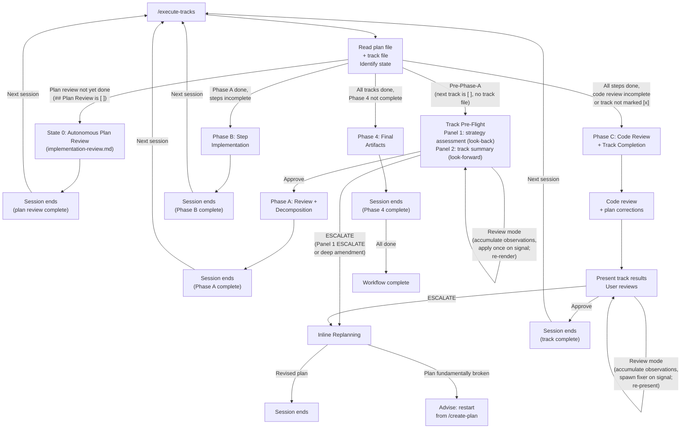

# Execution Workflow

## Overview

This is the session entry point for Phase 3 execution. You are a single agent
that reads the plan, determines where execution left off, and either runs
the Track Pre-Flight gate (strategy assessment + track summary) or
resumes track execution.

There are no agent teams or sub-teams. You execute tracks directly. Sub-agents
are used for two distinct purposes:

1. **Self-contained review tasks** (technical/risk/adversarial
   reviews, step-level dim review, track-level code review) where
   fresh perspective or parallel execution is valuable.
2. **Code-touching implementation work** delegated to the
   **implementer** sub-agent. The implementer runs at two levels:
   `level=step` for Phase B per-step implementation
   (`step-implementation.md`) and `level=track` for Phase C
   per-iteration review-fix application
   (`track-code-review.md`). Both share the same rulebook
   ([`implementer-rules.md`](implementer-rules.md)) and prompt
   template; the level switch is a single variable input. The
   orchestrator never edits source files itself in either Phase B
   or Phase C — Maven, Spotless, source-file reads, and IDE traffic
   are absorbed by the implementer's context.

> **House style for chat-scale prose.** User-facing prose produced from this file (status updates, escalation prompts, replanning summaries, review-mode loop turns, handoff notes, whichever apply) follows the AI-tell subset of `.claude/output-styles/house-style.md`: `## Banned vocabulary`, `## Banned sentence patterns`, `## Banned analysis patterns`, and `### Em-dash discipline`. Structural rules (`§ BLUF lead`, `§ Structural rules` for the ≤200-word section cap, `§ Document-shape rules (design / ADR-specific)`) do not apply to chat-scale prose. See [conventions.md §1.5 Writing style for Markdown and prose artifacts](conventions.md) for the workflow-level anchor and tier mapping.

### Terminology: Phases 0/1/2/3/4 vs Phases A/B/C

The overall workflow has five phases:
- **Phase 0 (Research)**: `/create-plan` — interactive research and exploration (same session as Phase 1)
- **Phase 1 (Planning)**: `/create-plan` — develop the implementation plan and design document, informed by Phase 0 findings
- **Phase 2 (Implementation Review)**: runs **autonomously** as the first
  phase of `/execute-tracks` when the startup protocol detects State 0
  (plan file's `## Plan Review` checklist entry is `[ ]`). Two-step review:
  (1) consistency review (design doc ↔ code ↔ plan, autonomous classifier
  with user escalation only for design decisions),
  (2) structural review (plan-internal quality, autonomous classifier).
  Optionally re-invoked via `/review-plan` for manual re-runs after inline
  replanning. Full orchestration in `implementation-review.md` (loaded
  on-demand only when State 0 is active).
- **Phase 3 (Execution)**: `/execute-tracks` — implement and review tracks
- **Phase 4 (Final Artifacts)**: `/execute-tracks` (State D) — produce `design-final.md` and `adr.md` (follows `prompts/create-final-design.md`)

Within Phase 3, each track goes through three sub-phases:
- **Phase A**: Review + Decomposition (`track-review.md`)
- **Phase B**: Step Implementation (`step-implementation.md`)
- **Phase C**: Code Review + Track Completion (`track-code-review.md`)

**Each session handles exactly one sub-phase of one track.** After completing
a sub-phase, the session ends and the user re-runs `/execute-tracks` to
start the next sub-phase with fresh context. This prevents context
dilution — review context doesn't clutter implementation, and implementation
context doesn't bias the code review.

Phase C includes both the track-level code review and track completion
(episode compilation, user approval, plan file update) in a single session.
This ensures the agent retains full context of which findings were fixed,
which were deferred to other tracks, and what plan corrections were made —
all of which feed into an accurate track episode.

Between sessions, the track file's **Progress** section and step episodes
bridge context. The user clears the session and re-runs `/execute-tracks`
at every phase boundary.

---

## Session Lifecycle



Each session handles **one phase of one track**. Phase boundaries are
mandatory session boundaries — the user clears context and re-runs
`/execute-tracks` after each phase completes. This keeps each session
focused: review context doesn't dilute implementation, and implementation
context doesn't bias code review.

The Track Pre-Flight gate's Panel 1 strategy assessment for a
just-completed track happens at the **start of the next session**,
not the end of the current one — this gives fresh perspective on
cross-track impact.

---

## Startup Protocol (Auto-Resume)

1. **Read the plan file** at `docs/adr/<dir-name>/_workflow/implementation-plan.md`
   (startup reads only the plan; per-track track files at
   `plan/track-N.md` are loaded later, when a track enters Phase A
   or its description is being amended).

2. **Identify all tracks** and their status:
   - `[ ]` — not started
   - `[x]` — completed
   - `[~]` — skipped

3. **Run the Branch Divergence Check.** Load
   [`branch-divergence-check.md`](branch-divergence-check.md) and
   follow it. This must happen in turn 1, before any per-commit push
   work — including handoff-resolution commits in the next step. A
   diverged branch left undetected makes every `git push` across the
   session reject silently and defeats the "push every commit"
   safety net (see `commit-conventions.md` § Push every commit). The
   protocol detects divergence and asks the user to pick one of three
   resolutions (local-authoritative, remote-authoritative, defer);
   no default is picked.

3a. **Run the Workflow Drift Check.** Load
   [`workflow-drift-check.md`](workflow-drift-check.md) and follow it.
   This step runs after the divergence check and before the handoff
   scan, so any user-driven migration changes the on-disk shape of
   `_workflow/**` before steps 4 and 5 read those files. The gate
   file owns the resolution detail (Migrate now / Defer / Suppress)
   and the Remote-authoritative re-entry note — see
   `workflow-drift-check.md`.

4. **Check for active handoffs.** Run:
   ```bash
   ls -t docs/adr/<dir-name>/_workflow/handoff-*.md 2>/dev/null
   ```
   `-t` sorts most-recent-first by mtime so the resume protocol
   processes handoffs in the correct order.
   If any files exist, load
   [`mid-phase-handoff.md`](mid-phase-handoff.md) and follow its
   §Resume protocol. That protocol re-presents the pending decision
   (or research findings) to the user, deletes resolved handoff files
   and their secondary PAUSED markers, and only then returns control
   to step 5 below. While a handoff is unresolved, the orchestrator
   MUST NOT spawn sub-agents, re-run gate-checks, or recompile
   episodes. See `mid-phase-handoff.md` for the full resume contract.

5. **Determine session state** from the plan file and track files.

   | Plan file state | Track file state | Session state |
   |---|---|---|
   | `## Plan Review` checklist entry is `[ ]` (or section missing entirely) | — | **State 0**: autonomous plan review (load `implementation-review.md` and follow it) |
   | `## Plan Review` is `[x]`; next track is `[ ]` | No track file | **State A**: pre-Phase-A — runs the Track Pre-Flight gate (`track-review.md` § Track Pre-Flight), then Phase A in the same session. Within the gate, Panel 1 (strategy assessment) is conditionally skipped via the `**Strategy refresh:**` idempotency check — see *State A internal branching* below. |
   | `## Plan Review` is `[x]`; a track is `[ ]` | Track file exists | **State C**: mid-track resume |
   | All tracks `[x]` or `[~]`; Phase 4 is `[ ]` or `[>]` | — | **State D**: Phase 4 (final artifacts) |
   | All tracks `[x]` or `[~]`; Phase 4 is `[x]` | — | **Done** |

   State 0 is checked **first** — plan review must complete before any
   track-level work begins. After State 0 passes, the session ends and
   the next `/execute-tracks` invocation re-evaluates the table starting
   from State A.

   **State A internal branching.** The Track Pre-Flight gate (see
   `track-review.md` § Track Pre-Flight) auto-detects whether to run
   Panel 1 (strategy assessment, look-back) based on whether a
   completed or skipped track exists with no `**Strategy refresh:**`
   line yet. The very first Phase A entry of the plan skips Panel 1
   (no anchor track); subsequent entries run both panels. State A is
   the same session state in either case — the panel skip is internal
   to the gate.

   **State C sub-states** (from track file Progress section):

   | Progress section | Resume action |
   |---|---|
   | `Review + decomposition` is `[ ]` | Enter `track-review.md` §Phase A Resume (often a no-op since the track file already has its description from Phase 1), then re-run only missing reviews and decompose. |
   | `Review + decomposition` is `[x]`, steps partially complete | Resume from next `[ ]` step (see step-implementation-recovery.md §Phase B Resume for orphan commit recovery) |
   | Steps contain `[!]` (failed) entries | Check if a retry `[ ]` step follows — if yes, resume from retry. If no retry step, present failed episode to user |
   | All steps `[x]`, code review `[ ]` or partial | Run Phase C from current iteration (single-step tracks skip code review but still run track completion — see track-code-review.md; includes track completion after review) |
   | All steps `[x]`, code review `[x]`, track still `[ ]` in plan | Resume track completion — compile episode, present to user for approval |

   Each resume handles exactly **one phase** — end session after that phase.

   **Section-discrepancy edge (roster `[x]` without matching Progress
   entry).** Sub-step 7's four-section writer may be interrupted
   between the roster `[ ]`→`[x]` flip (sub-step 7.1) and the
   Progress append (sub-step 7.2), leaving the on-disk track file in
   a partially-written state. Per the invariant in
   `step-implementation.md` sub-step 7.1, the roster `[x]` flip is
   the primary marker for "episode written"; resume-side
   reconciliation derives the missing Progress entry from the
   Episodes block before continuing. See
   `step-implementation-recovery.md` §Phase B Resume → "Crash
   between sub-step 7 and sub-step 8" for the procedure.

   **State D** (Phase 4 — final artifacts):

   | Phase 4 marker | Resume action |
   |---|---|
   | `[ ]` | Start Phase 4: mark `[>]`, follow `prompts/create-final-design.md` |
   | `[>]` | Resume Phase 4: check which artifacts exist. If both exist, review and complete. Otherwise, restart from Step 3 of `create-final-design.md` |

   **State 0** (autonomous plan review): load `implementation-review.md`
   on-demand and follow the autonomous orchestration loop there
   (consistency review → structural review, classifier-driven
   auto-fix vs. user escalation). End the session after the gate
   passes.

6. **Inform the user** of the auto-resume decision:
   - Which track you're working on and why (or that plan review is
     pending if State 0)
   - If resuming mid-track: which steps are done, which is next
   - If Phase 4: whether starting fresh or resuming an interrupted session
   - If State 0: that the autonomous plan review is about to run and
     only design-decision findings will be surfaced
   - If State A (fresh Phase A entry): note that the Track Pre-Flight
     gate will run before reviews start — see `track-review.md`
     §Track Pre-Flight. The gate combines a strategy assessment
     (look-back, when an earlier track has just completed/skipped)
     with the upcoming track's summary (look-forward). The gate is
     **skipped** on State C resume because the track file's four
     track-level sections (`## Purpose / Big Picture`, `## Context
     and Orientation`, `## Plan of Work`, `## Interfaces and
     Dependencies`) are already authoritative.

   The user can override: reorder tracks, skip a track, or choose a different
   resume point. But by default, you proceed without waiting for confirmation.

---

## Track Pre-Flight (Strategy Assessment + Track Summary)

Triggered at State A (pre-Phase-A — fresh entry). Combines a
backward-looking strategy assessment (when an earlier track has
just completed or been skipped) with a forward-looking summary of
the upcoming track. The user can apply light edits to remaining
tracks, attach clarifications to the upcoming track, or escalate to
inline replanning — all via the conversational review-mode loop (see
[`review-mode.md`](review-mode.md)). The gate runs in the same
session as Phase A; this is the only exception to mandatory phase
boundaries.

**Full protocol:** [`track-review.md`](track-review.md) § Track Pre-Flight

---

## Cross-Track Impact Monitoring

After each step implementation, the Phase B orchestrator performs a
lightweight self-assessment against the plan, fed by the per-step
implementer's `CROSS_TRACK_HINTS` return field. Triggered inside Phase B,
not at startup.

**Full protocol:** [`step-implementation.md`](step-implementation.md)
§Cross-Track Impact Check.

---

## Session Boundary Rules

### When to end a session

Phase boundaries are **mandatory** session boundaries. Each session handles
exactly one phase:

- **After State 0 (autonomous plan review)** — both consistency and
  structural reviews have passed, the plan / track files / design have
  been fixed (mechanical fixes auto-applied; design decisions resolved
  by the user), `## Plan Review` is marked `[x]` with the audit summary,
  and the workflow-update commit has been pushed. Session ends. Next
  session starts Phase A of Track 1.

- **After Phase A (review + decomposition)** — track file is written to disk
  with all steps as `[ ]` and `Review + decomposition` marked `[x]`. Session
  ends. Next session starts Phase B.

- **After Phase B (step implementation)** — all steps are implemented,
  tested, and committed. Episodes are written to the track file on disk.
  `Step implementation` is marked `[x]`. Session ends. Next session starts
  Phase C.

- **After Phase C (code review + track completion)** — review is complete,
  plan corrections saved (if any), user approved track results, track
  episode written and track marked `[x]` in the plan file on disk.
  Session ends. The next session's Track Pre-Flight gate runs Panel 1
  (strategy assessment) against this track's episode. If session is
  interrupted before user approval, the next session re-enters Phase C
  at the track completion stage (all phases `[x]` in track file, track
  still `[ ]` in plan file).

- **After ESCALATE resolution** — if inline replanning produces a revised
  plan, end the session. The next session starts fresh with the revised plan.

- **Context consumption too high** — if an active context check (see
  §Context Consumption Check below) shows usage at `warning` level (≥30%)
  or above, finish the current unit of work, save progress, and end the
  session.

### Context Consumption Check

At the end of each intermediate action within a phase (i.e., after every
step except the last one), the agent actively checks its context window
consumption. This replaces passive hook-based monitoring with an explicit
check built into the workflow.

**How to check:**

Run:
```bash
cat /tmp/claude-code-context-usage-$PPID.txt
```

The output looks like: `ctx: 7% level=safe`

**Levels:**

| Level | Trigger | Action |
|---|---|---|
| `safe` | <20% | Continue normally. |
| `info` | 20–29% | Continue, but prefer delegating exploration to sub-agents and avoid reading large files. |
| `warning` | 30–39% | **Do not start next unit of work.** Save progress and ask for session refresh. |
| `critical` | ≥40% | **Do not start next unit of work.** Save progress and ask for session refresh. |

**If the file does not exist or the command fails**, treat as `safe` and
continue normally — the statusline script may not have written the file
yet.

**Required behavior at `warning` or `critical`:**

1. **Do NOT start the next unit of work.** No next step (Phase B), no
   next review iteration (Phase C), no further decomposition (Phase A).
2. **Save all work:**
   - Ensure all code changes are committed
   - Ensure all progress is written to the track file on disk
   - Update the **Progress** section in the track file on disk
   - **Write a handoff file** per
     [`mid-phase-handoff.md`](mid-phase-handoff.md) if the pause
     leaves mid-phase state the next session cannot re-derive from
     the plan / track files alone. Mandatory for:
     - between-iteration pauses in Phase C;
     - post-decomposition / between-review pauses in Phase A;
     - mid-research pauses in Phase 0 / 1;
     - mid-section pauses in Phase 4;
     - any pause where verbatim re-present text or partial research
       notes would otherwise be lost.

     The handoff file goes under
     `docs/adr/<dir-name>/_workflow/handoff-<phase>.md`, paired with
     a `**PAUSED ...**` marker in the natural progress-tracking file
     (skipped for Phase 0 / 1 — see `mid-phase-handoff.md`
     §Secondary marker) and a cross-reference in MEMORY.md. All
     channels are written in a single commit with a bare imperative
     message such as `Pause <phase> for context refresh — write
     handoff`.
3. **Ask the user for a session refresh:**
   - Inform them of current progress and what remains
   - Instruct: "Context window is running low. Please clear the session
     and re-run `/execute-tracks` to continue with fresh context."

This is **mandatory** — the agent must not continue to the next unit of
work when context consumption is at `warning` level or above.

### What to do before ending a session

- Ensure all code changes are committed
- Ensure all step episodes are written to the track file under
  `_workflow/plan/`, the **Progress** section is up to date, and
  every workflow-file change has been committed (workflow files are
  tracked under `_workflow/` — see `commit-conventions.md`)
- Run **self-improvement reflection** per
  [`self-improvement-reflection.md`](self-improvement-reflection.md).
  This is mandatory for every phase (State 0, A, B, C, 4) and runs
  even on early-exit sessions (context warning, ESCALATE,
  two-failure rule). The phase docs invoke it as the second-to-last
  step before "End the session".
- Run `git push` so the branch's draft PR reflects the final state
  of the session (every commit is pushed; this is the safety net
  for unexpected session-end interruptions). If this push is
  rejected, follow `commit-conventions.md` § Push failure handling
  — a non-fast-forward rejection at session-end is the same
  divergence case as during phase work and routes to
  `branch-divergence-check.md` on first occurrence.
- **Report unpushed commits.** Run
  `git rev-list --count @{u}..HEAD` to count commits not yet pushed
  to the tracked remote. If the count is non-zero, the session-end
  summary MUST list both the count and the commits
  (`git log --oneline @{u}..HEAD`) so the user can act before the
  next session. A silent unpushed list defeats the "push every
  commit" safety net (see `commit-conventions.md` § Push every
  commit). If the branch has no upstream, substitute
  `origin/<branch>` and warn the user that upstream tracking is not
  configured.
- **Report deferred workflow drift.** If the Workflow Drift Check
  (see `workflow-drift-check.md`) recorded a Defer resolution in
  this session, read the `Deferred workflow drift: <count> commits
  since <short-stamp-base-SHA>` TaskCreate todo (or, if TaskCreate
  was unavailable, the same two fields held in in-context
  conversation memory) and recite the title verbatim, followed by an
  instruction to run `/migrate-workflow` from this worktree. The
  todo carries only the count and the short stamp-base SHA — no
  subject lines; the user can re-run § Detection's Phase 1 walk plus
  the Phase 2 `git log` for full context. Suppress and Migrate now
  leave no residue; the marker lives in conversation memory (or the
  todo, if one was created) and is discarded when the session ends.
- Inform the user of the session state so the next `/execute-tracks`
  auto-resumes correctly

---

## User Interaction Model

Everything within a phase is fully autonomous **except design decisions**
(choices affecting architecture, API shape, or behavioral semantics beyond
what the plan prescribes — pause and ask with alternatives + trade-offs).
**Full escalation protocol:** [`design-decision-escalation.md`](design-decision-escalation.md)

User interaction points:

| When | What you present | What the user decides |
|---|---|---|
| **Session start** | Auto-resume decision (which track, which phase, or State 0 plan review) | Confirm or override |
| **State 0 design-decision findings** | Batched list of CR/S findings the consistency and/or structural sub-agents classified as `design-decision`, with proposed alternatives and recommendation | Resolve each finding (choose alternative, provide guidance, defer) |
| **Track pre-flight (State A, pre-Phase-A)** | Two-panel summary: Panel 1: strategy assessment (look-back: CONTINUE / ADJUST / ESCALATE) when an earlier track has just completed/skipped; Panel 2: upcoming track summary built from the plan-file entry + the track file's four track-level sections (`## Purpose / Big Picture` intro, `## Context and Orientation` current-state framing plus any track-level diagram, `## Plan of Work` step sequencing, `## Interfaces and Dependencies` in-scope / out-of-scope and inter-track dependencies). Panel 1 is skipped on the very first Phase A entry (no anchor track) and on resume when the strategy-refresh line is already on disk. | Three one-step options per `review-mode.md` § Approval-panel contract: **Approve** (accept and start Phase A with any review-mode-accumulated amendments + clarifications); **Review mode** (conversational refinement loop per `review-mode.md` § Flow; Apply executes `EDIT_PLAN` / `EDIT_STEP_DESC` / `SKIP_TRACK`, buffers `CLARIFY`, answers `QUESTION` inline); **ESCALATE** (Panel 1 ESCALATE accepted, or review mode produced a deep amendment) → inline replanning. Skipped on State C resume. |
| **Phase A/B complete (and State 0 complete)** | Phase summary, what was done, next phase | User clears session, re-runs `/execute-tracks` |
| **Cross-track impact** | Which tracks affected, what broke, recommendation | Continue, pause, or escalate |
| **Track complete (end of Phase C)** | Track episode, step episodes, git log of commits, plan corrections | Three one-step options per `review-mode.md` § Approval-panel contract: **Approve** (write track episode + collapse + `[x]`); **Review mode** (conversational refinement loop per `review-mode.md` § Flow; on Apply, `FIX_FINDING` items spawn a fresh implementer with `mode=FIX_REVIEW_FINDINGS`, `QUESTION` items are answered inline); **ESCALATE** → inline replanning. |
| **Step failure (2nd attempt)** | What failed twice, what was tried, options | Retry differently, adjust, or escalate |
| **Design decision needed** | Alternatives with trade-offs, recommendation | Choose an alternative or provide guidance |
| **Self-improvement reflection (every session end)** | 0..N proposed YouTrack issues (capped at 3, deduped against existing `project: YTDB tag: dev-workflow` issues), each with title + Bug/Feature type + one-line summary; skipped with a notice when the YouTrack MCP server is unreachable | Pick which proposals to create in YouTrack (numbers, "all", or "none") |

---

## Failure Handling

Step-level failure handling (revert → failed episode → retry or split),
the two-failure rule, and track-level failure escalation are all triggered
inside Phase B.

**Full protocol:** [`step-implementation-recovery.md`](step-implementation-recovery.md)
§Step Failure, §Two-Failure Rule, §Track-Level Failure.

---

## Inline Replanning (ESCALATE)

Triggers when the Track Pre-Flight gate produces ESCALATE (Panel 1
strategy assessment ESCALATE accepted by the user, or review mode
produces an `ESCALATE` action item / a Mixed-set Escalate-now per
[`review-mode.md`](review-mode.md) § ESCALATE detection — i.e., the
requested change touches Decision Records, Architecture Notes,
Goals, Constraints, **adding** a new track, or cross-track
interaction surfaces; **removing** a remaining track is light
(`SKIP_TRACK`), not ESCALATE), cross-track impact detects
fundamental assumption failure, or a step failure cannot be
recovered with additional commits. Stops all new steps and enters
a propose → review → iterate cycle.

**Full protocol:** [`inline-replanning.md`](inline-replanning.md)

---

## Track Skip (`[~]`)

Triggered when a Phase A review sub-agent returns a `skip` severity finding
or the user requests skipping a track at session start / during strategy
refresh. Requires user confirmation — tracks are never skipped autonomously.

**Full protocol:** [`track-skip.md`](track-skip.md)

---

## Track Completion Protocol

Track completion is part of Phase C — it runs in the same session as the
track-level code review, after the review loop and any plan corrections.

**Full protocol:** [`track-code-review.md`](track-code-review.md) §Track
Completion.

---

## Final Artifacts (Phase 4)

After all tracks are complete, a separate session produces
`design-final.md` and `adr.md` — the two artifacts that survive
merge into `develop`. Phase 4 lands exactly two commits on the
branch:

1. **Final-artifacts commit.** Stage `design-final.md`,
   `design-mechanics-final.md` (if applicable), and `adr.md`; commit
   with the message defined in `prompts/create-final-design.md`
   § Step 4; push.
2. **Cleanup commit.** Run `git rm -r docs/adr/<dir-name>/_workflow/`
   to remove every working file under the `_workflow/` subtree
   (plan, design.md, design-mechanics.md, track files,
   design-mutations log). Commit with a message such
   as `Remove workflow scaffolding`. Push.

The end-of-session self-improvement reflection runs after both
commits land — it creates any approved proposals as YouTrack issues
under `YTDB` with the `dev-workflow` tag and produces **no commit**
on the branch (the YouTrack sink replaces the retired local
`workflow-issues/` buffer). See
[`self-improvement-reflection.md`](self-improvement-reflection.md).

After both commits are pushed and reflection has run, **inform the
user that Phase 4 is complete and stop**. If reflection created any
YouTrack issues, list their ids in the completion message. The user
manually flips the draft PR to "ready for review" when satisfied —
Claude does not run `gh pr ready`.

Tracked in the `## Final Artifacts` section of
`implementation-plan.md` (see State D markers in the Startup
Protocol table above).

**Full instructions:** [`prompts/create-final-design.md`](prompts/create-final-design.md)

---

## Conventions

This document defines the session lifecycle and cross-track coordination.
For other workflow components, see:

- **`conventions.md`** — shared formats, glossary, plan file structure,
  scope indicators, review iteration protocol
- **`conventions-execution.md`** — execution-specific: episodes, commit
  format, code review, complexity tiers, decomposition rules
- **`commit-conventions.md`** — commit message type prefixes for session
  resume (review fix, episode, track file updates)
- **`track-review.md`** — Phase A: review + decomposition
- **`step-implementation.md`** — Phase B: step implementation (happy path)
- **`track-code-review.md`** — Phase C: code review + track completion
- **`research.md`** — Phase 0 (research: interactive exploration before planning)
- **`planning.md`** — Phase 1 (planning)
- **`implementation-review.md`** — Phase 2 (autonomous implementation review: consistency + structural). **Loaded on-demand only when State 0 is active** (the startup protocol routes there when `## Plan Review` is `[ ]`); also loaded on manual `/review-plan` invocation. Non-State-0 sessions never read this file.
- **`prompts/create-final-design.md`** — Phase 4 (final artifacts: `design-final.md`, `adr.md`)

On-demand reference documents (loaded only when their specific situation arises):
- **`inline-replanning.md`** — full ESCALATE replanning protocol
- **`review-iteration.md`** — iteration limits, finding ID prefixes, gate format (loaded when running any review loop)
- **`code-review-protocol.md`** — two-tier dimensional code review (loaded by step-implementation.md and track-code-review.md)
- **`plan-slim-rendering.md`** — slim plan rendering for sub-agent contexts (loaded when assembling step-level or track-level review sub-agent prompts)
- **`episode-format-reference.md`** — detailed episode format, rules, examples
- **`design-document-rules.md`** — design document rules, examples, structure
- **`design-decision-escalation.md`** — when/how to escalate design decisions to the user
- **`structural-review.md`** — structural review details (loaded by implementation-review.md)
- **`track-skip.md`** — full track skip protocol (when `[~]` is triggered)
- **`branch-divergence-check.md`** — turn-1 divergence detection and three-resolution gate (loaded by the Startup Protocol step 3; also re-routed to from `commit-conventions.md` § Push failure handling on the first non-fast-forward rejection in the session)
- **`workflow-drift-check.md`** — turn-1 workflow-format drift detection and three-resolution gate (loaded by the Startup Protocol step 3a, immediately after the Branch Divergence Check; the Remote-authoritative re-entry contract is one-sided pending a symmetric edit to `branch-divergence-check.md` — see the gate file's `## After the choice` section, *Remote-authoritative re-entry — forward-looking note* paragraph)
- **`review-agent-selection.md`** — characteristic-based review agent selection (loaded by step-implementation.md and track-code-review.md)
- **`risk-tagging.md`** — per-step risk criteria and lifecycle (loaded by `track-review.md` during Phase A decomposition; loaded by `step-implementation-recovery.md` only on the rare Phase B upgrade path; **not** loaded by Phase B normal execution or by Phase C — those phases consume the per-step inline `risk:` token from the `## Concrete Steps` roster line directly)
- **`implementer-rules.md`** — Phase B per-step implementer sub-agent rulebook (loaded only by the implementer; orchestrators do not load it)
- **`step-implementation-recovery.md`** — Phase B Resume, non-`SUCCESS` orchestrator handlers, post-commit rollback handlers, Step Failure formats, Two-Failure Rule, Track-Level Failure (loaded by the Phase B orchestrator only when orphan commits are detected at startup or a non-`SUCCESS` implementer return arrives)
- **`ephemeral-identifier-rule.md`** — full forbidden / allowed / rewrite rule for durable content (loaded only when about to author source code, tests, Javadoc, PR title/body, `design-final.md`, or `adr.md`; the §2.3 stub in `conventions-execution.md` plus the pre-commit gate regex are usually enough)
- **`self-improvement-reflection.md`** — mandatory final step at the end of every session run by a calling skill that opts into reflection (`/execute-tracks` today; `/migrate-workflow` from this work forward). Phase identifiers depend on session-type (see `self-improvement-reflection.md` §Inputs). Reflects on workflow-process friction encountered in the session and creates approved proposals as YouTrack issues under `YTDB` with the `dev-workflow` tag (or skips with a notice when the YouTrack MCP server is unreachable). Produces no commit. Loaded on-demand at end-of-session by every phase doc.
