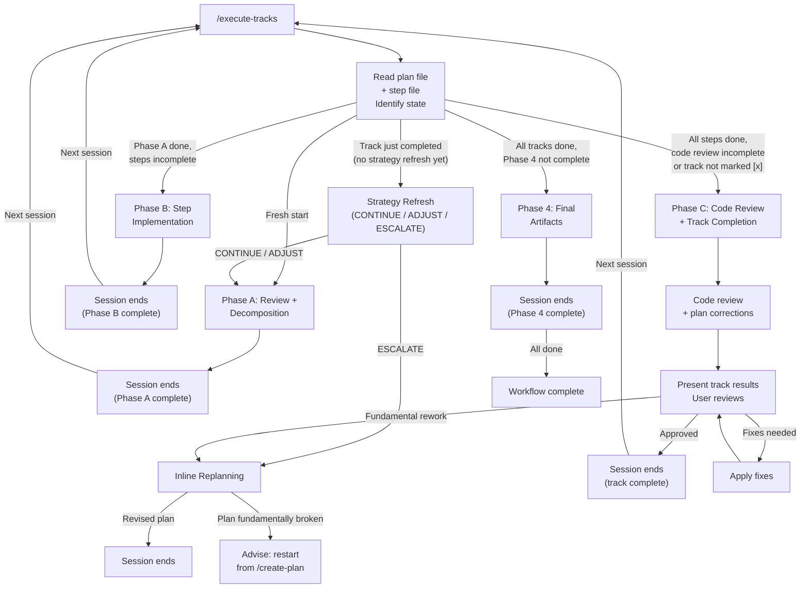

# Execution Workflow

## Overview

This is the session entry point for Phase 3 execution. You are a single agent
that reads the plan, determines where execution left off, and either performs
a strategy refresh or begins/resumes track execution.

There are no agent teams or sub-teams. You execute tracks directly. Sub-agents
are used only for self-contained review tasks (technical/risk/adversarial
reviews, code review, track-level code review) where fresh perspective or
parallel execution is valuable.

### Terminology: Phases 0/1/2/3 vs Phases A/B/C

The overall workflow has five stages:
- **Phase 0 (Research)**: `/create-plan` — interactive research and exploration (same session as Phase 1)
- **Phase 1 (Planning)**: `/create-plan` — develop the implementation plan and design document, informed by Phase 0 findings
- **Phase 2 (Implementation Review)**: `/review-plan` — two-step review:
  (1) consistency review (design doc ↔ code ↔ plan, interactive),
  (2) structural review (plan-internal quality, automatic)
- **Phase 3 (Execution)**: `/execute-tracks` — implement and review tracks
- **Phase 4 (Final Artifacts)**: produce `design-final.md` and `adr.md` (prompt: `prompts/create-final-design.md`)

Within Phase 3, each track goes through three sub-phases:
- **Phase A**: Review + Decomposition (`track-review.md`)
- **Phase B**: Step Implementation (`step-implementation.md`)
- **Phase C**: Code Review + Track Completion (`track-code-review.md`)

**Each session handles exactly one sub-phase of one track.** After completing
a sub-phase, the session ends and the user re-runs `/execute-tracks` to
start the next sub-phase with fresh context. This prevents context
dilution — review context doesn't clutter implementation, and implementation
context doesn't bias the code review.

Phase C includes both the track-level code review and track completion
(episode compilation, user approval, plan file update) in a single session.
This ensures the agent retains full context of which findings were fixed,
which were deferred to other tracks, and what plan corrections were made —
all of which feed into an accurate track episode.

Between sessions, the step file's **Progress** section and step episodes
bridge context. The user clears the session and re-runs `/execute-tracks`
at every phase boundary.

---

## Session Lifecycle



Each session handles **one phase of one track**. Phase boundaries are
mandatory session boundaries — the user clears context and re-runs
`/execute-tracks` after each phase completes. This keeps each session
focused: review context doesn't dilute implementation, and implementation
context doesn't bias code review.

Strategy refresh for a just-completed track happens at the **start of the
next session**, not the end of the current one — this gives fresh
perspective on cross-track impact.

---

## Startup Protocol (Auto-Resume)

1. **Read the plan file** at `docs/adr/<dir-name>/implementation-plan.md`.

2. **Identify all tracks** and their status:
   - `[ ]` — not started
   - `[x]` — completed
   - `[~]` — skipped

3. **Determine session state** from the plan file and step files:

   | Plan file state | Step file state | Session state |
   |---|---|---|
   | Last completed/skipped track (`[x]` or `[~]`) has no `**Strategy refresh:**` line | — | **State A**: strategy refresh first |
   | All `[x]`/`[~]` tracks have `**Strategy refresh:**`; next track is `[ ]` | No step file | **State B**: fresh start (Phase A) |
   | A track is `[ ]` | Step file exists | **State C**: mid-track resume |
   | All tracks `[x]` or `[~]`; Phase 4 is `[ ]` or `[>]` | — | **State D**: Phase 4 (final artifacts) |
   | All tracks `[x]` or `[~]`; Phase 4 is `[x]` | — | **Done** |

   **State C sub-states** (from step file Progress section):

   | Progress section | Resume action |
   |---|---|
   | `Review + decomposition` is `[ ]` | Enter `track-review.md` §Phase A Resume — description-move recovery (often a no-op), then re-run only missing reviews and decompose. |
   | `Review + decomposition` is `[x]`, steps partially complete | Resume from next `[ ]` step (see step-implementation.md §Phase B Resume for orphan commit recovery) |
   | Steps contain `[!]` (failed) entries | Check if a retry `[ ]` step follows — if yes, resume from retry. If no retry step, present failed episode to user |
   | All steps `[x]`, code review `[ ]` or partial | Run Phase C from current iteration (single-step tracks skip code review but still run track completion — see track-code-review.md; includes track completion after review) |
   | All steps `[x]`, code review `[x]`, track still `[ ]` in plan | Resume track completion — compile episode, present to user for approval |

   Each resume handles exactly **one phase** — end session after that phase.

   **State D** (Phase 4 — final artifacts):

   | Phase 4 marker | Resume action |
   |---|---|
   | `[ ]` | Start Phase 4: mark `[>]`, follow `prompts/create-final-design.md` |
   | `[>]` | Resume Phase 4: check which artifacts exist. If both exist, review and complete. Otherwise, restart from Step 3 of `create-final-design.md` |

4. **Inform the user** of the auto-resume decision:
   - Which track you're working on and why
   - If resuming mid-track: which steps are done, which is next
   - If strategy refresh is needed: do it and present results before
     proceeding
   - If Phase 4: whether starting fresh or resuming an interrupted session

   The user can override: reorder tracks, skip a track, or choose a different
   resume point. But by default, you proceed without waiting for confirmation.

---

## Strategy Refresh

Triggered at State A (track just completed). Produces a CONTINUE / ADJUST /
ESCALATE assessment. Strategy refresh + Phase A share a single session.

**Full protocol:** [`strategy-refresh.md`](strategy-refresh.md)

---

## Cross-Track Impact Monitoring

After each step implementation, the agent performs a lightweight
self-assessment against the plan. Triggered inside Phase B, not at startup.

**Full protocol:** [`step-implementation.md`](step-implementation.md)
§Cross-Track Impact Check.

---

## Session Boundary Rules

### When to end a session

Phase boundaries are **mandatory** session boundaries. Each session handles
exactly one phase:

- **After Phase A (review + decomposition)** — step file is written to disk
  with all steps as `[ ]` and `Review + decomposition` marked `[x]`. Session
  ends. Next session starts Phase B.

- **After Phase B (step implementation)** — all steps are implemented,
  tested, and committed. Episodes are written to the step file on disk.
  `Step implementation` is marked `[x]`. Session ends. Next session starts
  Phase C.

- **After Phase C (code review + track completion)** — review is complete,
  plan corrections saved (if any), user approved track results, track
  episode written and track marked `[x]` in the plan file on disk.
  Session ends. Strategy refresh happens in the next session. If session
  is interrupted before user approval, the next session re-enters Phase C
  at the track completion stage (all phases `[x]` in step file, track
  still `[ ]` in plan file).

- **Mid-Phase B checkpoint** — if you've completed 5+ steps and the track
  has more steps remaining, suggest ending the session. The step file with
  episodes provides full continuity. The next session resumes Phase B from
  the next incomplete step.

- **After ESCALATE resolution** — if inline replanning produces a revised
  plan, end the session. The next session starts fresh with the revised plan.

- **Context consumption too high** — if an active context check (see
  §Context Consumption Check below) shows usage at `warning` level (≥25%)
  or above, finish the current unit of work, save progress, and end the
  session.

### Context Consumption Check

At the end of each intermediate action within a phase (i.e., after every
step except the last one), the agent actively checks its context window
consumption. This replaces passive hook-based monitoring with an explicit
check built into the workflow.

**How to check:**

Run:
```bash
cat /tmp/claude-code-context-usage-$PPID.txt
```

The output looks like: `ctx: 7% level=safe`

**Levels:**

| Level | Trigger | Action |
|---|---|---|
| `safe` | <15% | Continue normally. |
| `info` | 15–24% | Continue, but prefer delegating exploration to sub-agents and avoid reading large files. |
| `warning` | 25–39% | **Do not start next unit of work.** Save progress and ask for session refresh. |
| `critical` | ≥40% | **Do not start next unit of work.** Save progress and ask for session refresh. |

**If the file does not exist or the command fails**, treat as `safe` and
continue normally — the statusline script may not have written the file
yet.

**Required behavior at `warning` or `critical`:**

1. **Do NOT start the next unit of work.** No next step (Phase B), no
   next review iteration (Phase C), no further decomposition (Phase A).
2. **Save all work:**
   - Ensure all code changes are committed
   - Ensure all progress is written to the step/review files on disk
   - Update the **Progress** section in the step file on disk
3. **Ask the user for a session refresh:**
   - Inform them of current progress and what remains
   - Instruct: "Context window is running low. Please clear the session
     and re-run `/execute-tracks` to continue with fresh context."

This is **mandatory** — the agent must not continue to the next unit of
work when context consumption is at `warning` level or above.

### What to do before ending a session

- Ensure all code changes are committed
- Ensure all step episodes are written to the step file on disk
- Update the **Progress** section in the step file on disk
- Inform the user of the session state so the next `/execute-tracks`
  auto-resumes correctly

---

## User Interaction Model

Everything within a phase is fully autonomous **except design decisions**
(choices affecting architecture, API shape, or behavioral semantics beyond
what the plan prescribes — pause and ask with alternatives + trade-offs).
**Full escalation protocol:** [`design-decision-escalation.md`](design-decision-escalation.md)

User interaction points:

| When | What you present | What the user decides |
|---|---|---|
| **Session start** | Auto-resume decision (which track, which phase) | Confirm or override |
| **Strategy refresh** | Assessment report (CONTINUE / ADJUST / ESCALATE) | Accept or override |
| **Phase A/B complete** | Phase summary, what was done, next phase | User clears session, re-runs `/execute-tracks` |
| **Cross-track impact** | Which tracks affected, what broke, recommendation | Continue, pause, or escalate |
| **Track complete (end of Phase C)** | Track episode, step episodes, git log of commits, plan corrections | Approve, request fixes, or rework |
| **Step failure (2nd attempt)** | What failed twice, what was tried, options | Retry differently, adjust, or escalate |
| **Design decision needed** | Alternatives with trade-offs, recommendation | Choose an alternative or provide guidance |

---

## Failure Handling

Step-level failure handling (revert → failed episode → retry or split),
the two-failure rule, and track-level failure escalation are all triggered
inside Phase B.

**Full protocol:** [`step-implementation.md`](step-implementation.md)
§Step Failure, §Two-Failure Rule, §Track-Level Failure.

---

## Inline Replanning (ESCALATE)

Triggers when strategy refresh is ESCALATE, an ADJUST would modify Decision
Records, cross-track impact detects fundamental assumption failure, or the
user requests "fundamental rework." Stops all new steps and enters a
propose → review → iterate cycle.

**Full protocol:** [`inline-replanning.md`](inline-replanning.md)

---

## Track Skip (`[~]`)

Triggered when a Phase A review sub-agent returns a `skip` severity finding
or the user requests skipping a track at session start / during strategy
refresh. Requires user confirmation — tracks are never skipped autonomously.

**Full protocol:** [`track-skip.md`](track-skip.md)

---

## Track Completion Protocol

Track completion is part of Phase C — it runs in the same session as the
track-level code review, after the review loop and any plan corrections.

**Full protocol:** [`track-code-review.md`](track-code-review.md) §Track
Completion.

---

## Final Artifacts (Phase 4)

After all tracks are complete, a separate session produces `design-final.md`
and `adr.md` — the only workflow files committed to git. Tracked in the
`## Final Artifacts` section of `implementation-plan.md` (see State D
markers in the Startup Protocol table above).

**Full instructions:** [`prompts/create-final-design.md`](prompts/create-final-design.md)

---

## Conventions

This document defines the session lifecycle and cross-track coordination.
For other workflow components, see:

- **`conventions.md`** — shared formats, glossary, plan file structure,
  scope indicators, review iteration protocol
- **`conventions-execution.md`** — execution-specific: episodes, commit
  format, code review, complexity tiers, decomposition rules
- **`commit-conventions.md`** — commit message type prefixes for session
  resume (review fix, episode, step file updates)
- **`track-review.md`** — Phase A: review + decomposition
- **`step-implementation.md`** — Phase B: step implementation
- **`track-code-review.md`** — Phase C: code review + track completion
- **`research.md`** — Phase 0 (research: interactive exploration before planning)
- **`planning.md`** — Phase 1 (planning)
- **`implementation-review.md`** — Phase 2 (implementation review: consistency + structural)
- **`prompts/create-final-design.md`** — Phase 4 (final artifacts: `design-final.md`, `adr.md`)

On-demand reference documents (loaded only when their specific situation arises):
- **`strategy-refresh.md`** — full strategy refresh protocol (State A)
- **`inline-replanning.md`** — full ESCALATE replanning protocol
- **`review-iteration.md`** — iteration limits, finding ID prefixes, gate format (loaded when running any review loop)
- **`code-review-protocol.md`** — two-tier dimensional code review (loaded by step-implementation.md and track-code-review.md)
- **`plan-slim-rendering.md`** — slim plan rendering for sub-agent contexts (loaded when assembling step-level or track-level review sub-agent prompts)
- **`episode-format-reference.md`** — detailed episode format, rules, examples
- **`design-document-rules.md`** — design document rules, examples, structure
- **`design-decision-escalation.md`** — when/how to escalate design decisions to the user
- **`structural-review.md`** — structural review details (loaded by implementation-review.md)
- **`track-skip.md`** — full track skip protocol (when `[~]` is triggered)
- **`review-agent-selection.md`** — characteristic-based review agent selection (loaded by step-implementation.md and track-code-review.md)
