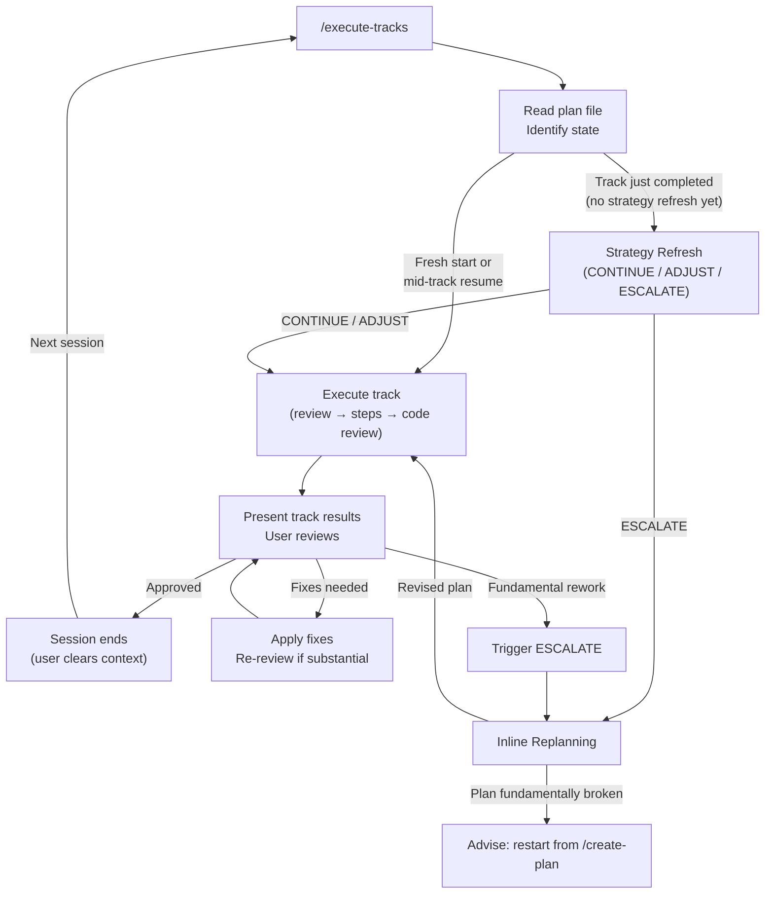

# Execution Workflow

## Overview

This is the session entry point for Phase 3 execution. You are a single agent
that reads the plan, determines where execution left off, and either performs
a strategy refresh or begins/resumes track execution.

There are no agent teams or sub-teams. You execute tracks directly. Sub-agents
are used only for self-contained review tasks (technical/risk/adversarial
reviews, code review, track-level code review) where fresh perspective or
parallel execution is valuable.

**Session boundaries replace agent boundaries.** Within a session, you have
full context from reading the plan through implementing steps. Between
sessions, episodic memories (step episodes in step files, track episodes in
the plan file) bridge context. The user clears the session and re-runs
`/execute-tracks` at natural boundaries.

---

## Session Lifecycle



Each session handles **one track** (or resumes an incomplete one). Strategy
refresh for the just-completed track happens at the **start of the next
session**, not the end of the current one — this gives fresh perspective on
cross-track impact.

---

## Startup Protocol (Auto-Resume)

1. **Read the plan file** at `docs/adr/<dir-name>/implementation-plan.md`.

2. **Identify all tracks** and their status:
   - `[ ]` — not started
   - `[x]` — completed
   - `[~]` — skipped

3. **Determine session state** using the detection rules in conventions.md
   §Session state detection:

   **State A — Track just completed (needs strategy refresh):**
   The last `[x]` track has a track episode but no `**Strategy refresh:**`
   line. Perform strategy refresh first (see Strategy Refresh below), then
   proceed to the next track.

   **State B — Fresh start:**
   All `[x]` tracks have strategy refresh lines (or no tracks are completed
   yet). The next `[ ]` track has no step file. Begin track execution from
   Phase A.

   **State C — Mid-track resume (step file exists):**
   A `[ ]` track has a step file. Read the **Progress** section in the step
   file to determine the exact resume point:
   - `Review + decomposition` incomplete → check **Reviews completed**
     section, re-run only missing reviews, then decompose steps
   - Steps partially complete → resume from the next `[ ]` step
   - All steps complete, `Track-level code review` incomplete → run Phase C
   - All phases complete → write track episode to plan file, mark `[x]`

4. **Inform the user** of the auto-resume decision:
   - Which track you're working on and why
   - If resuming mid-track: which steps are done, which is next
   - If strategy refresh is needed: do it and present results before
     proceeding

   The user can override: reorder tracks, skip a track, or choose a different
   resume point. But by default, you proceed without waiting for confirmation.

---

## Strategy Refresh

Triggered at the **start of a new session** when the previous session
completed a track (State A above).

### Process

1. **Read the full plan** with all track episodes accumulated so far.

2. **Assess remaining tracks** against accumulated discoveries:
   - Do any track episodes contradict assumptions in upcoming tracks?
   - Has the Component Map changed in ways affecting remaining tracks?
   - Are any Decision Records weakened by what was learned?
   - Are there new dependencies between tracks not in the original plan?

3. **Produce a strategy refresh report** (presented to the user, not
   persisted):

   ```markdown
   ### Strategy Refresh — After Track <N>

   **Episodes reviewed**: <count>
   **Discoveries with downstream impact**: <list or "none">

   **Assessment**: CONTINUE | ADJUST | ESCALATE

   **Adjustments** (if any):
   - Track M: description needs to account for <discovery>
   - Track P: constraint X no longer applies because <reason>

   **Rationale**: <brief explanation of why this assessment was chosen>
   ```

4. **Present the report to the user.** Wait for the user's decision:

   - **CONTINUE** — no issues found. Proceed to the next track.

   - **ADJUST** — minor fixes needed. Apply adjustments to the plan file
     (update track descriptions, reorder if needed), then proceed to the
     next track. Adjustments must be small and targeted.

     **ADJUST must NOT modify Decision Records.** Decision Records are
     immutable once execution starts (Architecture Notes rule 2). If a
     discovery invalidates a Decision Record, that is an automatic ESCALATE.

   - **ESCALATE** — accumulated discoveries have fundamentally changed the
     picture. Enter inline replanning (see Inline Replanning below).

5. **Write the `**Strategy refresh:**` line** to the plan file under the
   completed track's block (see conventions.md §After strategy refresh for
   format). For CONTINUE, a one-liner suffices. For ADJUST, include a brief
   summary of what was adjusted. ESCALATE does not write a strategy refresh
   line — it triggers replanning which restructures the plan directly.

6. **Proceed** to execute the next track in the same session.

---

## Cross-Track Impact Monitoring

After each step implementation, do a lightweight assessment — this is a quick
check, not a full strategy refresh. You have the plan context in your session,
so this is a natural self-check.

For each completed step, assess:

1. **Assumption validity** — Does this discovery contradict assumptions in any
   upcoming track's description?
2. **Architecture impact** — Does this change affect the Component Map or
   Decision Records in ways that touch other tracks?
3. **Dependency ordering** — Does this invalidate the dependency ordering of
   remaining tracks?

### If impact is detected

Alert the user immediately with:

- Which upcoming track(s) are affected
- What assumption is weakened or invalidated
- What the step discovered that triggered this alert
- Recommended action:
  - **Continue** (minor impact — note it, address during that track's review)
  - **Pause and ADJUST** (remaining steps in current track need revision)
  - **ESCALATE** (the discovery fundamentally changes the plan)

### If no impact is detected

Continue to the next step. No user notification needed.

---

## Session Boundary Rules

### When to end a session

- **After track completion** — always. Present results to user, get approval,
  then the session ends. Strategy refresh happens in the next session.

- **Mid-track checkpoint** — if you've completed 5+ steps and the track has
  more steps remaining, suggest ending the session. The step file with
  episodes provides full continuity. This is a suggestion, not a hard rule —
  if the remaining work is small, finishing in the same session is fine.

- **After ESCALATE resolution** — if inline replanning produces a revised
  plan, end the session. The next session starts fresh with the revised plan.

### What to do before ending a session

- Ensure all code changes are committed
- Ensure all step episodes are written to the step file and committed
- If the track is complete: compile the track episode and write it to the
  plan file
- Inform the user of the session state so the next `/execute-tracks`
  auto-resumes correctly

---

## User Interaction Model

User interaction is minimal and happens at specific points:

| When | What you present | What the user decides |
|---|---|---|
| **Session start** | Auto-resume decision (which track, where in it) | Confirm or override |
| **Strategy refresh** | Assessment report (CONTINUE / ADJUST / ESCALATE) | Accept or override |
| **Cross-track impact** | Which tracks affected, what broke, recommendation | Continue, pause, or escalate |
| **Track complete** | Track episode, step episodes, git log of commits | Approve, request fixes, or rework |
| **Step failure (2nd attempt)** | What failed twice, what was tried, options | Retry differently, adjust, or escalate |

### What does NOT involve the user

Everything within normal track execution is fully autonomous:

- Track reviews (technical, risk, adversarial) — run as sub-agents
- Step decomposition from scope indicators
- Step implementation, testing, and coverage verification
- Step-level code review iterations (up to 3 per step)
- Track-level code review (up to 3 iterations)
- Episode production after each step
- Within-track adaptation when a step episode affects upcoming steps
- Cross-track impact checks (unless impact is detected)

---

## Failure Handling

### Step failure

If a step fails (tests won't pass, coverage can't be met, wrong API
assumption):

1. Revert uncommitted changes
2. Produce a failed episode (see conventions.md §1.3)
3. Write the failed episode to the step file and commit it
4. Decide: **retry** with a different approach, or **split** the step

### Two-failure rule

If the same step fails twice (original attempt + one retry):

- **Stop and present the situation to the user.** Include both failed
  episodes, what was tried, and why it failed.
- The user decides: retry with specific guidance, adjust the approach,
  skip the step, or escalate.

### Track-level failure

If a failure undermines the track's overall approach (not just one step):

- Present the situation to the user with full context
- Recommend ESCALATE if the approach is fundamentally wrong
- The user decides how to proceed

---

## Inline Replanning (ESCALATE)

When strategy refresh produces ESCALATE, you handle replanning directly —
you have all the context: every track episode, the full plan file, and
architecture notes.

### When ESCALATE triggers

- Strategy refresh assessment is ESCALATE
- An ADJUST would require modifying Decision Records (automatic ESCALATE)
- Cross-track impact monitoring detects a fundamental assumption failure
- A step failure affects the track's approach at a level additional commits
  cannot fix
- User requests escalation during track review ("fundamental rework")

### Process

**1. Stop** — do not start new steps.

**2. Assess** — present the full situation to the user:

- All track episodes so far (completed tracks)
- Partial progress from any incomplete track (step episodes)
- What assumptions broke and why
- Which remaining tracks are affected and how
- What Decision Records are weakened or invalidated

**3. Propose** — draft a revised plan:

- New or modified tracks for remaining work
- Updated architecture notes (Component Map, Decision Records with revision
  notes, Invariants, Integration Points)
- Reordered dependencies based on what was learned
- Removed tracks that are no longer needed
- Clear rationale for each change

Decision Record revisions follow this format:
```markdown
#### D3: <Decision title> (revised after Track N)
- **Original decision**: <what was decided in planning>
- **What changed**: <discovery that invalidated it>
- **Revised decision**: <new approach>
- **Alternatives considered**: <what else was on the table>
- **Rationale**: <why this revision>
- **Risks/Caveats**: <known downsides>
- **Implemented in**: Track M (revised), Track P (new)
```

**4. Review** — spawn a sub-agent to validate the revised plan using the
structural review protocol from Phase 2 (see planning.md). The sub-agent
receives the full plan file including both completed track episodes and the
proposed revisions.

**5. Iterate** — if the review finds blockers, revise and re-review. Maximum
3 iterations.

**6. Resume or exit:**

- **Review PASS** — update the plan file with the revised plan. End the
  session. The next session picks up the revised plan and continues.

- **Blockers persist after 3 iterations** — the plan is fundamentally broken
  at a level that incremental revision cannot fix. Advise the user to restart
  from Phase 1 (`/create-plan`) with accumulated episodes as input context.

---

## Track Completion Protocol

After track-level code review passes (or max iterations):

1. **Compile the track episode** from all step episodes in the step file.
   The track episode is a strategic summary — what was built, key
   discoveries, plan deviations with cross-track impact.

2. **Write the track episode** to the plan file:

   ```markdown
   - [x] Track N: <title>
     > <description>
     >
     > **Track episode:**
     > <strategic summary — length proportional to cross-track impact>
     >
     > **Step file:** `tracks/track-N.md` (M steps, K failed)
   ```

3. **Mark the track as `[x]`** in the plan file.

4. **Present track results to the user:**
   - Track episode
   - All step episodes from the step file
   - Git log of track commits
   - Any unresolved track-level code review findings

5. **Wait for user response:**
   - **Approved** — session ends. Strategy refresh happens next session.
   - **Fixes needed** — apply the user's specific fixes as additional
     commits. Re-run track-level code review if fixes are substantial.
     Present updated results.
   - **Fundamental rework** — trigger ESCALATE.

---

## Conventions

This document defines the session lifecycle and cross-track coordination.
For other workflow components, see:

- **`conventions.md`** — shared formats, glossary, plan file structure,
  episode formats, commit conventions, complexity tiers, review protocols
- **`track-execution.md`** — how to execute a track: review, step
  implementation, track-level code review, episode production
- **`planning.md`** — Phase 1 (planning) and Phase 2 (structural review)
