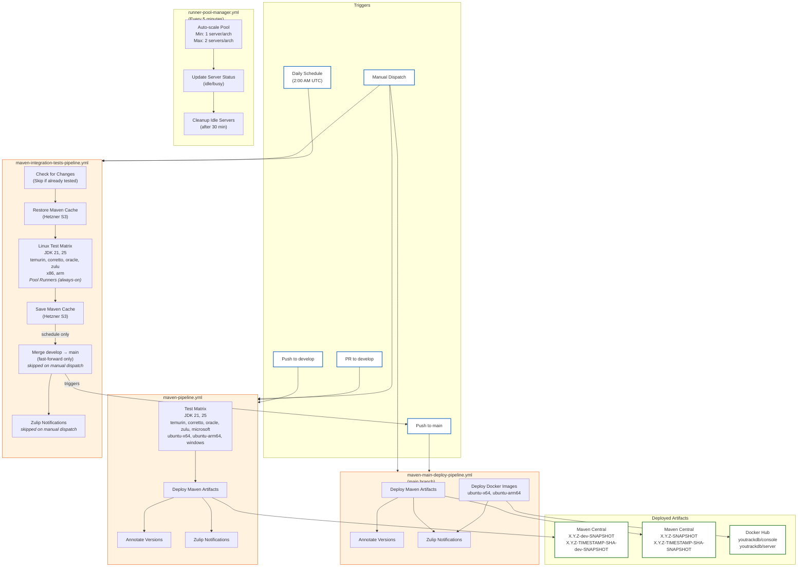

# CI/CD Pipeline Diagram

## Workflow Descriptions

### maven-pipeline.yml (Develop Branch)

This is the primary CI pipeline triggered on every push or pull request to the `develop` branch. It
runs the full test matrix across multiple JDK versions (21, 25), distributions (temurin, corretto,
oracle, zulu, microsoft), and platforms (ubuntu-x64, ubuntu-arm64, windows). On successful push (not
PRs), it deploys Maven artifacts with the `-dev-SNAPSHOT` suffix to Maven Central. Each deployment
is annotated with the exact version for traceability.

### maven-integration-tests-pipeline.yml (Nightly / Manual)

This pipeline runs on a daily schedule (2:00 AM UTC) to execute comprehensive integration tests. It
first checks if there are new changes since the last successful run to avoid redundant testing.

**Infrastructure**:

| Platform | Runners | JDK Distributions | Maven Goal | Tests |
|----------|---------|-------------------|------------|-------|
| Linux (Hetzner) | Pool runners (always-on) | temurin, corretto, oracle, zulu | `verify` | Unit + Integration |
| Windows (GitHub) | GitHub-hosted | temurin, corretto, oracle, zulu, microsoft | `package` | Unit only (disk limits) |

- **Runner Pool**: Managed by `runner-pool-manager.yml` (see below)
- **Maven cache**: Shared via Hetzner S3 Object Storage (synced before/after each job)

**Job Flow**:
1. `check-changes` - Skip if current commit was already tested successfully
2. `test-linux` - Restore Maven cache from S3, run full integration tests (16 jobs), save cache to S3
3. `test-windows` - Run unit tests only on GitHub-hosted runners (10 jobs)
4. `merge-to-main` - Fast-forward merge develop into main (schedule only)

Upon successful completion of all tests, it automatically merges `develop` into `main`
using fast-forward only, ensuring `main` always contains fully tested code.

**Manual Dispatch Mode**: When triggered manually via `workflow_dispatch`, the pipeline runs only the
tests without merging to `main` or sending Zulip notifications. This is useful for
validating changes before the nightly run or debugging test failures.

**Note**: Windows tests use `package` goal (unit tests only) instead of `verify` due to disk space
limitations on GitHub-hosted runners. Full integration tests run on Linux/Hetzner only.

### runner-pool-manager.yml (Runner Pool)

This workflow manages a pool of always-on Hetzner servers with GitHub self-hosted runners. It runs
every 5 minutes to maintain pool health and auto-scale based on demand.

**Pool Configuration**:

| Setting | Value | Description |
|---------|-------|-------------|
| MIN_SERVERS_PER_ARCH | 1 | Always keep at least 1 server per architecture (x86 + arm) |
| MAX_SERVERS_PER_ARCH | 2 | Maximum servers per architecture during high load |
| RUNNERS_PER_SERVER | 2 | Each server runs 2 GitHub runner instances |
| IDLE_TIMEOUT_MINUTES | 30 | Delete extra servers after being idle for this duration |

**Server Types**:
- x86: `cx53` (16 vCPUs, 32GB RAM, 160GB disk)
- arm: `cax41` (16 vCPUs, 32GB RAM, 160GB disk)

**How It Works**:
1. **Minimum Pool**: 2 servers always running (1 x86 + 1 arm), each with 2 runners = 4 parallel jobs
2. **Scale Up**: When pending jobs exceed available runners, add servers (up to max)
3. **Scale Down**: Extra servers deleted after 30 minutes of idle time
4. **Status Tracking**: Servers labeled as `idle` or `busy` based on runner activity

**Manual Actions** (via workflow_dispatch):
- `init` - Initialize pool with minimum servers
- `scale` - Run scaling logic (default)
- `status` - Show current pool status
- `cleanup` - Delete all pool servers

### maven-main-deploy-pipeline.yml (Main Branch)

Triggered by pushes to `main` (typically from the integration tests pipeline merge), this pipeline
handles production-ready deployments. It deploys Maven artifacts without the `-dev` prefix to Maven
Central and builds/publishes Docker images for both `console` and `server` components to Docker Hub.
This ensures that `main` branch artifacts are always the stable, fully tested versions.

## Workflow Summary

| Workflow                                 | Trigger                   | Purpose                                      | Infrastructure                                              | Artifacts                                                       |
|------------------------------------------|---------------------------|----------------------------------------------|-------------------------------------------------------------|-----------------------------------------------------------------|
| **maven-pipeline.yml**                   | Push/PR to `develop`      | Run tests, deploy dev artifacts              | GitHub-hosted runners                                       | `X.Y.Z-dev-SNAPSHOT`, `X.Y.Z-TIMESTAMP-SHA-dev-SNAPSHOT`        |
| **maven-integration-tests-pipeline.yml** | Daily schedule (2 AM UTC) | Run integration tests, merge to main         | Pool runners (Hetzner) + GitHub (Windows) + S3 cache        | N/A (triggers main pipeline)                                    |
| **maven-integration-tests-pipeline.yml** | Manual dispatch           | Run integration tests only (no merge/notify) | Pool runners (Hetzner) + GitHub (Windows) + S3 cache        | N/A                                                             |
| **runner-pool-manager.yml**              | Every 5 minutes           | Maintain runner pool, auto-scale             | Hetzner (2-4 servers, 4-8 runners)                          | N/A                                                             |
| **maven-main-deploy-pipeline.yml**       | Push to `main`            | Deploy release artifacts & Docker            | GitHub-hosted runners                                       | `X.Y.Z-SNAPSHOT`, `X.Y.Z-TIMESTAMP-SHA-SNAPSHOT`, Docker images |

## Version Format

- **Timestamp format**: `YYYYMMDD.HHMMSS` (UTC) - enables chronological sorting
- **Example versions**:
    - develop: `0.5.0-20260123.143052-abc1234-dev-SNAPSHOT`
    - main: `0.5.0-20260123.143052-abc1234-SNAPSHOT`
