# CI/CD Pipeline Diagram

```mermaid
flowchart TB
    subgraph triggers["Triggers"]
        push_develop["Push to develop"]
        pr_develop["PR to develop"]
        schedule["Daily Schedule<br/>(2:00 AM UTC)"]
        push_main["Push to main"]
        manual["Manual Dispatch"]
    end

    subgraph pr_checks["PR Validation Workflows"]
        direction TB
        block_merge["block-merge-commits.yml<br/>Reject merge commits"]
        check_prefix["check-commit-prefix.yml<br/>Verify YTDB-* prefix in commits"]
        pr_title["pr-title-prefix.yml<br/>Auto-add YTDB-* prefix to PR title"]
    end

    subgraph qodana_pipeline["qodana-scan.yml"]
        direction TB
        qodana_scan["Qodana Code Analysis<br/>JetBrains static analysis"]
        qodana_cleanup["Optional: Push cleanup fixes"]
        qodana_scan --> qodana_cleanup
    end

    subgraph maven_pipeline["maven-pipeline.yml<br/>(develop branch)"]
        direction TB
        mp_test["Test Matrix<br/>JDK 21, 25<br/>temurin, corretto, oracle, zulu, microsoft<br/>ubuntu-latest, ubuntu-24.04-arm, windows-latest"]
        mp_deploy["Deploy Maven Artifacts"]
        mp_annotate["Annotate Versions"]
        mp_notify["Zulip Notifications"]
        mp_test --> mp_deploy
        mp_deploy --> mp_annotate
        mp_deploy --> mp_notify
    end

    subgraph integration_pipeline["maven-integration-tests-pipeline.yml"]
        direction TB
        it_check["Check for Changes<br/>(Skip if already tested)"]
        it_test_linux["Linux Test Matrix<br/>JDK 21, 25<br/>temurin, oracle<br/>x86, arm<br/><i>TestFlows On-Demand Runners</i>"]
        it_test_windows["Windows Test Matrix<br/>JDK 21, 25<br/>temurin, oracle<br/><i>GitHub-hosted Runners</i>"]
        it_merge["Merge develop → main<br/>(fast-forward only)<br/><i>skipped on manual dispatch</i>"]
        it_notify["Zulip Notifications<br/><i>skipped on manual dispatch</i>"]
        it_check --> it_test_linux
        it_check --> it_test_windows
        it_test_linux -->|" schedule only "| it_merge
        it_test_windows -->|" schedule only "| it_merge
        it_merge --> it_notify
    end

    subgraph main_pipeline["maven-main-deploy-pipeline.yml<br/>(main branch)"]
        direction TB
        main_deploy["Deploy Maven Artifacts"]
        main_annotate["Annotate Versions"]
        main_docker["Deploy Docker Images<br/>ubuntu-latest, ubuntu-24.04-arm"]
        main_notify["Zulip Notifications"]
        main_deploy --> main_annotate
        main_deploy --> main_notify
        main_docker --> main_notify
    end

    subgraph artifacts["Deployed Artifacts"]
        direction TB
        maven_dev["Maven Central<br/>X.Y.Z-dev-SNAPSHOT<br/>X.Y.Z-TIMESTAMP-SHA-dev-SNAPSHOT"]
        maven_release["Maven Central<br/>X.Y.Z-SNAPSHOT<br/>X.Y.Z-TIMESTAMP-SHA-SNAPSHOT"]
        docker["Docker Hub<br/>youtrackdb/console<br/>youtrackdb/server"]
    end

%% PR validation triggers
    pr_develop --> pr_checks
    pr_develop --> qodana_pipeline
%% Main pipeline triggers
    push_develop --> maven_pipeline
    push_develop --> qodana_pipeline
    pr_develop --> maven_pipeline
    manual --> maven_pipeline
    manual --> integration_pipeline
    manual --> main_pipeline
    manual --> qodana_pipeline
    schedule --> integration_pipeline
    push_main --> main_pipeline
%% Pipeline to artifacts
    mp_deploy --> maven_dev
    main_deploy --> maven_release
    main_docker --> docker
%% Integration triggers main
    it_merge -->|" triggers "| push_main
%% Styling
    classDef trigger fill: #fff, stroke: #1565c0, stroke-width: 2px
    classDef pipeline fill: #fff3e0, stroke: #e65100
    classDef artifact fill: #fff, stroke: #2e7d32, stroke-width: 2px
    classDef validation fill: #e3f2fd, stroke: #1565c0
    class push_develop trigger
    class pr_develop trigger
    class schedule trigger
    class push_main trigger
    class manual trigger
    class maven_pipeline pipeline
    class integration_pipeline pipeline
    class main_pipeline pipeline
    class qodana_pipeline pipeline
    class pr_checks validation
    class maven_dev artifact
    class maven_release artifact
    class docker artifact
```

## Workflow Descriptions

### PR Validation Workflows

These workflows run on pull requests to ensure code quality and consistency:

#### block-merge-commits.yml

Rejects PRs that contain merge commits to enforce a linear commit history. Runs on PR open,
synchronize, and reopen events. If merge commits are detected, the check fails and prompts the
developer to rebase their branch.

#### check-commit-prefix.yml

Verifies that all commits in a PR contain the issue prefix from the PR title (e.g., `YTDB-123`).
This ensures traceability between commits and issues. Skips merge commits and provides instructions
for fixing commit messages if the check fails.

#### pr-title-prefix.yml

Automatically adds the issue prefix to the PR title based on the branch name. If the branch is named
`ytdb-123-feature-name` or `YTDB/123/feature`, the workflow extracts `YTDB-123` and prepends it to
the PR title if not already present.

### qodana-scan.yml

Runs JetBrains Qodana static code analysis on every push to `develop` and on pull requests. Uses a
baseline file to track known issues and can optionally apply automatic cleanup fixes when triggered
manually with the `cleanup` input set to true. Cleanup fixes are pushed to a separate branch for
review.

### maven-pipeline.yml (Develop Branch)

This is the primary CI pipeline triggered on every push or pull request to the `develop` branch. It runs the full test matrix across multiple JDK versions (21, 25), distributions
(temurin, corretto, oracle, zulu, microsoft), and platforms (ubuntu-latest, ubuntu-24.04-arm,
windows-latest). On successful push (not PRs), it deploys Maven artifacts with the `-dev-SNAPSHOT`
suffix to Maven Central. Each deployment is annotated with the exact version for traceability.

### maven-integration-tests-pipeline.yml (Nightly / Manual)

This pipeline runs on a daily schedule (2:00 AM UTC) to execute comprehensive integration tests. It
first checks if there are new changes since the last successful run to avoid redundant testing.

**Infrastructure**:

| Platform | Runners | JDK Distributions | Maven Goal | Tests |
|----------|---------|-------------------|------------|-------|
| Linux (Hetzner) | TestFlows on-demand | temurin, oracle | `verify` | Unit + Integration |
| Windows (GitHub) | GitHub-hosted | temurin, oracle | `package` | Unit only (disk limits) |

**TestFlows Runners**:
- Managed by external [TestFlows GitHub Hetzner Runners](https://github.com/testflows/testflows-github-hetzner-runners) service
- Runners created on-demand when jobs queue (~1-2 min startup)
- Zero cost when no jobs running (no idle servers)
- Uses base Ubuntu images with setup scripts (Docker, Git, Node.js, firewall, Maven cache)
- APT, Maven, and npm caches persisted via Hetzner volume mounts (`volume-cache` label)
- See [testflows-runner-setup.md](testflows-runner-setup.md) for deployment details

**Job Flow**:
1. `check-changes` - Skip if current commit was already tested successfully
2. `test-linux` - Run full integration tests on TestFlows runners (8 jobs) with volume-mounted Maven
   cache
3. `test-windows` - Run unit tests only on GitHub-hosted runners (4 jobs)
4. `merge-to-main` - Fast-forward merge develop into main (schedule only, requires both Linux and
   Windows tests to pass)

Upon successful completion of all tests, it automatically merges `develop` into `main`
using fast-forward only, ensuring `main` always contains fully tested code.

**Manual Dispatch Mode**: When triggered manually via `workflow_dispatch`, the pipeline runs only the
tests without merging to `main` or sending Zulip notifications. This is useful for
validating changes before the nightly run or debugging test failures.

**Note**: Windows tests use `package` goal (unit tests only) instead of `verify` due to disk space
limitations on GitHub-hosted runners. Full integration tests run on Linux/Hetzner only.

### maven-main-deploy-pipeline.yml (Main Branch)

Triggered by pushes to `main` (typically from the integration tests pipeline merge), this pipeline
handles production-ready deployments. It deploys Maven artifacts without the `-dev` prefix to Maven
Central and builds/publishes Docker images for both `console` and `server` components to Docker Hub.
This ensures that `main` branch artifacts are always the stable, fully tested versions.

## TestFlows Runner Setup

Self-hosted runners for integration tests are managed by TestFlows GitHub Hetzner Runners, an
external orchestrator running on a dedicated small Hetzner server.

For complete setup and configuration instructions, see [testflows-runner-setup.md](testflows-runner-setup.md).

## Workflow Summary

| Workflow                                 | Trigger                      | Purpose                                      | Infrastructure                                      | Artifacts                                                       |
|------------------------------------------|------------------------------|----------------------------------------------|-----------------------------------------------------|-----------------------------------------------------------------|
| **block-merge-commits.yml**              | PR to any branch             | Reject merge commits in PRs                  | GitHub-hosted runners                               | N/A                                                             |
| **check-commit-prefix.yml**              | PR to `develop`              | Verify commits have issue prefix             | GitHub-hosted runners                               | N/A                                                             |
| **pr-title-prefix.yml**                  | PR to `develop`              | Auto-add issue prefix to PR title            | GitHub-hosted runners                               | N/A                                                             |
| **qodana-scan.yml**                      | Push/PR to `develop`, Manual | Static code analysis                         | GitHub-hosted runners                               | N/A (optional cleanup branch)                                   |
| **maven-pipeline.yml**                   | Push/PR to `develop`, Manual | Run tests, deploy dev artifacts              | GitHub-hosted runners                               | `X.Y.Z-dev-SNAPSHOT`, `X.Y.Z-TIMESTAMP-SHA-dev-SNAPSHOT`        |
| **maven-integration-tests-pipeline.yml** | Daily schedule (2 AM UTC)    | Run integration tests, merge to main         | TestFlows (Hetzner/Linux) + GitHub-hosted (Windows) | N/A (triggers main pipeline)                                    |
| **maven-integration-tests-pipeline.yml** | Manual dispatch              | Run integration tests only (no merge/notify) | TestFlows (Hetzner/Linux) + GitHub-hosted (Windows) | N/A                                                             |
| **maven-main-deploy-pipeline.yml**       | Push to `main`, Manual       | Deploy release artifacts & Docker            | GitHub-hosted runners                               | `X.Y.Z-SNAPSHOT`, `X.Y.Z-TIMESTAMP-SHA-SNAPSHOT`, Docker images |

## Version Format

- **Timestamp format**: `YYYYMMDD.HHMMSS` (UTC) - enables chronological sorting
- **Example versions**:
    - develop: `0.5.0-20260123.143052-abc1234-dev-SNAPSHOT`
    - main: `0.5.0-20260123.143052-abc1234-SNAPSHOT`
