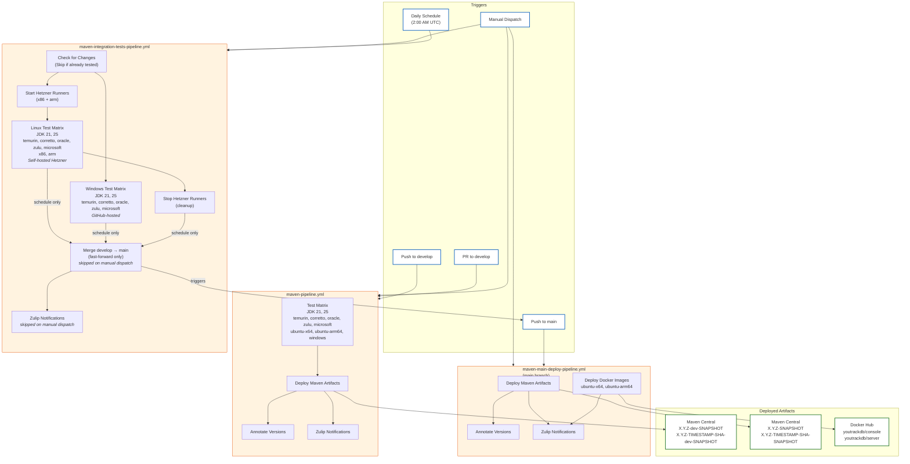

# CI/CD Pipeline Diagram

## Workflow Descriptions

### maven-pipeline.yml (Develop Branch)

This is the primary CI pipeline triggered on every push or pull request to the `develop` branch. It
runs the full test matrix across multiple JDK versions (21, 25), distributions (temurin, corretto,
oracle, zulu, microsoft), and platforms (ubuntu-x64, ubuntu-arm64, windows). On successful push (not
PRs), it deploys Maven artifacts with the `-dev-SNAPSHOT` suffix to Maven Central. Each deployment
is annotated with the exact version for traceability.

### maven-integration-tests-pipeline.yml (Nightly / Manual)

This pipeline runs on a daily schedule (2:00 AM UTC) to execute comprehensive integration tests. It
first checks if there are new changes since the last successful run to avoid redundant testing.

**Infrastructure**: Linux tests run on self-hosted Hetzner Cloud runners (x86 and arm64) that are
dynamically provisioned at the start of the pipeline and cleaned up after tests complete. Windows
tests run on GitHub-hosted runners. This approach provides cost-effective, dedicated compute for
Linux workloads while maintaining compatibility with Windows testing.

**Job Flow**:
1. `check-changes` - Skip if current commit was already tested successfully
2. `start-runners` - Provision Hetzner VMs and wait for runners to come online
3. `test-linux` / `test-windows` - Run test matrix in parallel on respective runners
4. `stop-runners` - Remove runners from GitHub and delete Hetzner servers (always runs)
5. `merge-to-main` - Fast-forward merge develop into main (schedule only)

Upon successful completion of all integration tests, it automatically merges `develop` into `main`
using fast-forward only, ensuring `main` always contains fully tested code.

**Manual Dispatch Mode**: When triggered manually via `workflow_dispatch`, the pipeline runs only the
integration tests without merging to `main` or sending Zulip notifications. This is useful for
validating changes before the nightly run or debugging test failures.

### maven-main-deploy-pipeline.yml (Main Branch)

Triggered by pushes to `main` (typically from the integration tests pipeline merge), this pipeline
handles production-ready deployments. It deploys Maven artifacts without the `-dev` prefix to Maven
Central and builds/publishes Docker images for both `console` and `server` components to Docker Hub.
This ensures that `main` branch artifacts are always the stable, fully tested versions.

## Workflow Summary

| Workflow                                 | Trigger                   | Purpose                                      | Infrastructure                          | Artifacts                                                       |
|------------------------------------------|---------------------------|----------------------------------------------|-----------------------------------------|-----------------------------------------------------------------|
| **maven-pipeline.yml**                   | Push/PR to `develop`      | Run tests, deploy dev artifacts              | GitHub-hosted runners                   | `X.Y.Z-dev-SNAPSHOT`, `X.Y.Z-TIMESTAMP-SHA-dev-SNAPSHOT`        |
| **maven-integration-tests-pipeline.yml** | Daily schedule (2 AM UTC) | Run integration tests, merge to main         | Hetzner (Linux), GitHub-hosted (Windows)| N/A (triggers main pipeline)                                    |
| **maven-integration-tests-pipeline.yml** | Manual dispatch           | Run integration tests only (no merge/notify) | Hetzner (Linux), GitHub-hosted (Windows)| N/A                                                             |
| **maven-main-deploy-pipeline.yml**       | Push to `main`            | Deploy release artifacts & Docker            | GitHub-hosted runners                   | `X.Y.Z-SNAPSHOT`, `X.Y.Z-TIMESTAMP-SHA-SNAPSHOT`, Docker images |

## Version Format

- **Timestamp format**: `YYYYMMDD.HHMMSS` (UTC) - enables chronological sorting
- **Example versions**:
    - develop: `0.5.0-20260123.143052-abc1234-dev-SNAPSHOT`
    - main: `0.5.0-20260123.143052-abc1234-SNAPSHOT`
