# CI/CD Pipeline Diagram

```mermaid
flowchart TB
    subgraph triggers["Triggers"]
        push_develop["Push to develop"]
        pr_develop["PR to develop"]
        schedule["Daily Schedule<br/>(2:00 AM UTC)"]
        push_main["Push to main"]
        manual["Manual Dispatch"]
    end

    subgraph maven_pipeline["maven-pipeline.yml<br/>(develop branch)"]
        direction TB
        mp_test["Test Matrix<br/>JDK 21, 25<br/>temurin, corretto, oracle, zulu, microsoft<br/>ubuntu-x64, ubuntu-arm64, windows"]
        mp_deploy["Deploy Maven Artifacts"]
        mp_annotate["Annotate Versions"]
        mp_notify["Zulip Notifications"]
        mp_test --> mp_deploy
        mp_deploy --> mp_annotate
        mp_deploy --> mp_notify
    end

    subgraph integration_pipeline["maven-integration-tests-pipeline.yml"]
        direction TB
        it_check["Check for Changes<br/>(Skip if already tested)"]
        it_test["Integration Test Matrix<br/>JDK 21, 25<br/>temurin, corretto, oracle, zulu, microsoft<br/>ubuntu-x64, ubuntu-arm64, windows"]
        it_merge["Merge develop → main<br/>(fast-forward only)"]
        it_notify["Zulip Notifications"]
        it_check --> it_test
        it_test --> it_merge
        it_merge --> it_notify
    end

    subgraph main_pipeline["maven-main-deploy-pipeline.yml<br/>(main branch)"]
        direction TB
        main_deploy["Deploy Maven Artifacts"]
        main_annotate["Annotate Versions"]
        main_docker["Deploy Docker Images<br/>ubuntu-x64, ubuntu-arm64"]
        main_notify["Zulip Notifications"]
        main_deploy --> main_annotate
        main_deploy --> main_notify
        main_docker --> main_notify
    end

    subgraph artifacts["Deployed Artifacts"]
        direction TB
        maven_dev["Maven Central<br/>X.Y.Z-dev-SNAPSHOT<br/>X.Y.Z-TIMESTAMP-SHA-dev-SNAPSHOT"]
        maven_release["Maven Central<br/>X.Y.Z-SNAPSHOT<br/>X.Y.Z-TIMESTAMP-SHA-SNAPSHOT"]
        docker["Docker Hub<br/>youtrackdb/console<br/>youtrackdb/server"]
    end

%% Trigger connections
    push_develop --> maven_pipeline
    pr_develop --> maven_pipeline
    manual --> maven_pipeline
    manual --> integration_pipeline
    manual --> main_pipeline
    schedule --> integration_pipeline
    push_main --> main_pipeline
%% Pipeline to artifacts
    mp_deploy --> maven_dev
    main_deploy --> maven_release
    main_docker --> docker
%% Integration triggers main
    it_merge -->|" triggers "| push_main
%% Styling
  classDef trigger fill: #fff, stroke: #1565c0, stroke-width: 2px
  classDef pipeline fill: #fff3e0, stroke: #e65100
  classDef artifact fill: #fff, stroke: #2e7d32, stroke-width: 2px
  class push_develop trigger
  class pr_develop trigger
  class schedule trigger
  class push_main trigger
  class manual trigger
  class maven_pipeline pipeline
  class integration_pipeline pipeline
  class main_pipeline pipeline
  class maven_dev artifact
  class maven_release artifact
  class docker artifact
```

## Workflow Summary

| Workflow                                 | Trigger                   | Purpose                              | Artifacts                                                       |
|------------------------------------------|---------------------------|--------------------------------------|-----------------------------------------------------------------|
| **maven-pipeline.yml**                   | Push/PR to `develop`      | Run tests, deploy dev artifacts      | `X.Y.Z-dev-SNAPSHOT`, `X.Y.Z-TIMESTAMP-SHA-dev-SNAPSHOT`        |
| **maven-integration-tests-pipeline.yml** | Daily schedule (2 AM UTC) | Run integration tests, merge to main | N/A (triggers main pipeline)                                    |
| **maven-main-deploy-pipeline.yml**       | Push to `main`            | Deploy release artifacts & Docker    | `X.Y.Z-SNAPSHOT`, `X.Y.Z-TIMESTAMP-SHA-SNAPSHOT`, Docker images |

## Version Format

- **Timestamp format**: `YYYYMMDD.HHMMSS` (UTC) - enables chronological sorting
- **Example versions**:
    - develop: `0.5.0-20260123.143052-abc1234-dev-SNAPSHOT`
    - main: `0.5.0-20260123.143052-abc1234-SNAPSHOT`
