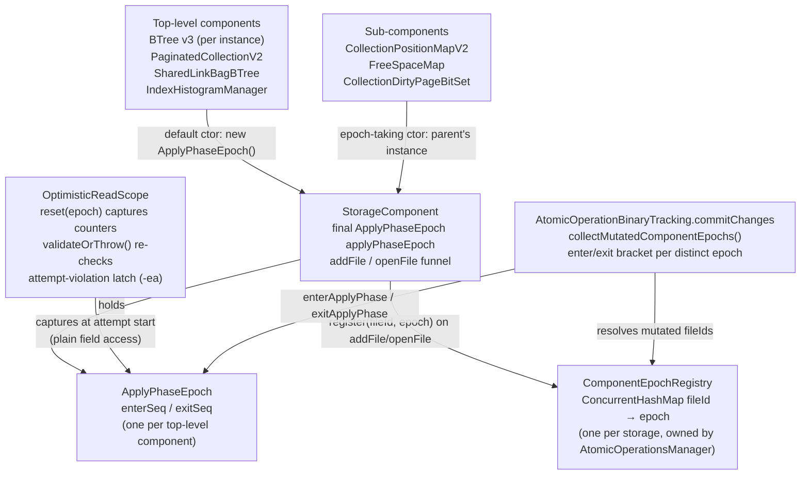

# Per-component apply-phase epoch granularity — Architecture Decision Record

## Summary

Refines the YTDB-1178 apply-phase epoch from one instance per storage to one
instance per top-level storage component. YTDB-1178 closed the
mixed-apply-state race — a committing transaction applies its page changes to
the shared read cache one page at a time, so an optimistic multi-page reader
overlapping that window could observe a mix of pre- and post-commit pages
with every per-page stamp still valid — by bracketing the commit-time apply
section with a two-counter seqlock-style epoch that readers capture before
the attempt and re-validate after the stamp loop. That epoch was
storage-wide, so *every* commit invalidated *every* concurrent optimistic
read in the storage, including reads of components the commit never touched.
This change makes `ApplyPhaseEpoch` a per-component instance held by the
`StorageComponent` base class, adds a writer-side `ComponentEpochRegistry`
(fileId → epoch) so commits resolve and bump only the epochs of components
they actually mutate, and adds `-ea`-only guards enforcing that one
optimistic read scope reads exactly one high-level component. Public API,
WAL format, and the on-disk format are unchanged.

## Goals

- **Stop over-invalidation**: a commit into one component must not fail
  concurrent optimistic reads of unrelated components. Achieved: readers
  validate the epoch of the component they read; commits bump only the
  epochs resolved from their actually-mutated fileIds.
- **Preserve the YTDB-1178 correctness guarantee**: an optimistic read
  overlapping a commit-time apply phase of the *same* component (or its
  sub-components) must still fail and fall back to the pinned path.
  Achieved: sub-components share the parent's epoch instance, and the
  reader/writer protocol on each instance is unchanged.
- **Keep the reader hot path free of lookups**: capturing the epoch at
  optimistic-attempt start is a plain field access on the component
  (`this.applyPhaseEpoch`), not a registry or map lookup.
- **Fail loud on funnel bypass**: a mutated file with no registered epoch is
  a correctness hole (its optimistic readers would silently lose apply-phase
  protection), so commit throws rather than skipping the bump.

## Constraints

- Edits stay inside `core`'s storage engine: `ApplyPhaseEpoch`,
  `OptimisticReadScope`, the new `ComponentEpochRegistry` (all in
  `storage/cache`), `StorageComponent`, `AtomicOperationBinaryTracking`,
  `AtomicOperationsManager`, and the component constructors that wire epoch
  sharing (`PaginatedCollectionV2` family).
- WAL format, replay-record schema, and on-disk layout unchanged.
- The reader/writer memory-ordering argument of YTDB-1178 is preserved
  verbatim per epoch instance: volatile enter/exit counters, exit-then-enter
  capture order, validation after the stamp loop.
- The attempt-protocol machinery (`enterAttempt`/`exitAttempt`, violation
  latch) is `-ea`-only: production builds pay only dead branches. Guards are
  invoked exclusively from `assert` statements.
- 2-space indent, 100-column, braces always, Spotless-clean, JDK 21.

## Architecture Notes

### Component Map

- `ApplyPhaseEpoch` itself is unchanged in protocol: two monotonic
  `AtomicLong` counters (`applyEnterSeq`, `applyExitSeq`); readers capture
  exit-then-enter and a read is valid only if `enterAtCapture ==
  exitAtCapture` and the live `enterSeq` is unchanged after the stamp loop.
  Two counters instead of odd/even parity because apply phases bumping the
  *same* epoch may now overlap: an epoch is shared between a parent and its
  sub-components, and two commits that locked different components of that
  family can apply concurrently — parity would flip back to "idle" and mask
  the overlap.
- `StorageComponent` gains a `private final ApplyPhaseEpoch applyPhaseEpoch`
  field with two constructor overloads: the default overload allocates a
  fresh instance (top-level components), the epoch-taking overload accepts
  the parent's instance (sub-components). A `protected final
  applyPhaseEpoch()` accessor exposes it to subclasses for wiring.
- `ComponentEpochRegistry` is a per-storage `ConcurrentHashMap<Long,
  ApplyPhaseEpoch>` owned by `AtomicOperationsManager`, keyed by external
  composed fileIds. A `uniform(epoch)` factory serves standalone atomic
  operations (tests, tooling): every fileId resolves to one private epoch,
  mirroring the pre-YTDB-1203 storage-wide semantics so the fail-loud
  resolution cannot misfire outside a real storage.
- `OptimisticReadScope.reset(ApplyPhaseEpoch)` binds the epoch per attempt,
  not per scope — the scope lives in the `AtomicOperation` and serves
  sequential attempts on different components within one transaction.
- `AtomicOperationBinaryTracking.commitChanges` computes the mutated-epoch
  set before mutating shared cache state and brackets the whole apply
  section (file deletion/creation/truncation plus the per-page apply loop)
  with one `enterApplyPhase`/`exitApplyPhase` pair per distinct epoch; exits
  run in a `finally` block so an escaping exception cannot leave an epoch
  permanently "in apply".

### Decision Records

#### D1: Epoch instance lives on `StorageComponent`; sub-components share the parent's

The component base class is the one place every page-holding storage
structure already passes through, so the epoch field is inherited rather
than re-implemented per component. Top-level components — each `BTree` (v3)
instance including both trees of the multi-value index engine,
`PaginatedCollectionV2`, `SharedLinkBagBTree`, `IndexHistogramManager` —
allocate their own instance via the default constructor. Sub-components —
`CollectionPositionMapV2`, `FreeSpaceMap`, `CollectionDirtyPageBitSet` —
receive `PaginatedCollectionV2`'s instance through the epoch-taking
overload, so one optimistic read spanning the collection family's files
(e.g., `.pcl` + `.cpm`) validates a single epoch and a commit into any
family file invalidates readers of the whole family exactly once.

**Alternatives rejected**: a `HighLevelStorageComponent` marker interface to
tag epoch owners — it adds no enforcement (nothing stops a sub-component
from implementing it or an owner from forgetting it), and the actual wiring
decision lives in constructor calls anyway; the constructor-overload split
already makes ownership explicit at the only place it matters.

#### D2: Reader captures the component epoch by plain field access

`StorageComponent.executeOptimisticStorageRead` passes its own
`applyPhaseEpoch` field to `OptimisticReadScope.reset(epoch)` at attempt
start. No registry lookup, no indirection — the optimistic hot path gains
zero cost over the YTDB-1178 storage-wide design. The registry (D3) exists
solely for the writer side, which cannot know component identity from the
fileIds it tracks.

**Alternatives rejected**: a striped per-file epoch array indexed by
`fileId % stripes`, with lazy per-file capture as the reader touches each
file. Rejected because (a) lazy capture reopens a cross-file capture-gap
risk — the mixed-state hazard the epoch exists to close reappears between
the capture points of two files read in one attempt; (b) it needs hot-path
capture machinery on every first-touch of a file instead of one field read
per attempt; (c) stripe sizing becomes a tuning knob with false-sharing
(too few stripes re-creates over-invalidation) on one side and footprint on
the other; (d) detecting "first touch of a new file in this attempt"
requires promoting the `-ea`-only attempt-active flag into production code.

#### D3: Writer-side `ComponentEpochRegistry`, populated in the `addFile`/`openFile` funnel

Commit-time apply works on fileIds (`deletedFiles`, `fileChanges`), not on
component references, so the writer needs a fileId → epoch mapping. Every
file a component creates or opens flows through `StorageComponent.addFile`
/ `openFile`, which registers the fileId under the component's epoch
(sub-components register under the parent's instance) via
`AtomicOperationsManager.registerComponentEpoch`. Registration can run
under the storage `stateLock` *read* side (e.g., `SharedLinkBagBTree`
creation during normal transactions), so the registry is a lock-free
`ConcurrentHashMap` assuming no external locking.

Lifecycle: **entries are never removed** (see I2 — the deleting commit must
still resolve the fileId after the component has unregistered itself), and
**re-registration overwrites** — the disk engine reuses the internal fileId
when a same-name file is recreated after a delete, and the recreating
component's registration simply replaces the stale mapping. `openFile`
re-registers on every storage open, which also refreshes mappings after a
delete/recreate cycle.

**Alternatives rejected**: avoiding `Long` boxing by reusing the in-tree
`ConcurrentLongIntHashMap` with `(fileId, 0)`-style keys plus a side table,
or porting BookKeeper's `ConcurrentLongHashMap`. The registry is cold-path
— puts happen on component create/open, gets happen once per commit — so
boxing overhead is immaterial, and a ported concurrent map would demand an
equivalent concurrent-stress test suite to earn the trust the JDK map gets
for free.

#### D4: Commit resolves actually-mutated fileIds, dedupes epochs by identity, fails loud on a miss

`collectMutatedComponentEpochs()` resolves exactly the fileIds the apply
section acts on: deleted files ∪ files flagged new ∪ files flagged
truncated ∪ files with at least one page carrying accumulated changes.
Merely-loaded files (empty `FileChanges`) resolve nothing, so read-only
atomic operations skip the epoch bracket entirely. Epochs are deduplicated
**by identity** — sub-components share the parent's epoch *instance* and one
commit frequently touches several files of the same family, which must
produce exactly one enter/exit pair per epoch; the mutated set is small
(typically 1–3 components), so a linear reference scan beats an identity
hash set. A mutated fileId with no registry entry throws
`IllegalStateException` (review finding AR-2): every production file is
registered by the funnel before it can be mutated, so a miss means a file
was created or loaded behind the funnel's back and its optimistic readers
would silently lose epoch protection if the bump were skipped.

**Alternatives rejected**: skip-and-log on a registry miss (converts a
correctness hole into a silent one); bumping every epoch in the registry on
a miss (re-creates storage-wide over-invalidation to paper over a bug).

#### D5: `-ea`-only one-component-per-scope guards with a latched-violation protocol

One optimistic attempt validates exactly one epoch, so an optimistic lambda
must not read files of two different top-level components. This invariant
was verified across all optimistic call sites at design time; runtime
enforcement is `-ea`-only, on **both** page-load paths: the optimistic load
(`loadPageOptimistic`) asserts the recorded page's registered epoch IS
(reference equality) the scope's captured epoch, and the pinned load asserts
the same whenever an optimistic attempt is in flight (a pinned read inside
an optimistic lambda that delegates into a different top-level component
would escape epoch validation entirely). Violations are **latched on the
scope** (`markAttemptViolation`) and surfaced by the attempt-closing
`exitAttempt()` assert — an `AssertionError` thrown *inside* the optimistic
lambda would otherwise be swallowed by the pinned-fallback catch, silently
converting a protocol bug into a fallback. The same latch also detects
nested `executeOptimisticStorageRead` calls (a nested `reset` would wipe the
outer scope's stamps and void its validation). `exitAttempt()` clears the
latch so a legitimate pinned-fallback retry does not trip a stale flag.

**Alternatives rejected**: production-grade enforcement (promotes the
attempt-active flag and per-page registry lookups into the hot path for a
design-time-verified invariant); throwing directly from the guard (swallowed
by the fallback catch, see above).

#### D6: Accepted narrowing on same-name drop+recreate (adversarial finding AR-3)

A stale component reference that survives a same-name drop+recreate cycle
reads the reused fileId's pages under the dead component's epoch: the
recreating component overwrote the registry mapping (D3), so commits into
the new incarnation bump the new epoch and the stale reader's validation
passes vacuously. This is a **pre-existing use-after-drop defect class** —
such access is already semantically void (the component was dropped) and is
excluded by the storage `stateLock` for live readers. The storage-wide
YTDB-1178 epoch would have *coincidentally* invalidated such reads (every
commit bumped the one epoch); the per-component epoch will not. Accepted:
the coincidental protection was never a contract, and restoring it would
require registry removal hooks that break I2.

### Invariants & Contracts

- **I1.** One optimistic read scope reads exactly one high-level component
  per attempt: every page recorded — or pinned-read while an attempt is in
  flight — belongs to a file whose registered epoch is reference-equal to
  the epoch captured at `reset`. Verified across all optimistic call sites
  at design time; enforced at runtime under `-ea` via the latched-violation
  protocol (D5).
- **I2.** `ComponentEpochRegistry` entries are never removed. This is
  load-bearing, not hygiene: components unregister from the storage-level
  maps **before** the deleting commit's page application runs, so the commit
  that deletes a file must still be able to resolve the deleted fileId to
  the owner's epoch and bump it. Removal on drop would make the deleting
  commit miss its own bump and expose concurrent readers of the dying
  component to mixed apply state.
- **I3.** Every fileId a production component mutates has a registry entry
  before the mutating commit applies — established by the `addFile`/
  `openFile` funnel (D3), enforced fail-loud at commit (D4).
- **I4.** Exactly one `enterApplyPhase`/`exitApplyPhase` pair per distinct
  epoch per commit, with exits in `finally` — an epoch can never be left
  permanently "in apply" (which would disable optimistic reads of that
  component for good). Rollbacks never enter `commitChanges`, so they bump
  no epoch.
- **I5.** Per epoch instance, the YTDB-1178 reader protocol is unchanged:
  capture `exitSeq` then `enterSeq` at attempt start; valid iff
  `enterAtCapture == exitAtCapture` and live `enterSeq` unchanged after the
  per-page stamp loop.

### Integration Points

- `StorageComponent.addFile` / `openFile` — the sole registry-population
  funnel; both call `AtomicOperationsManager.registerComponentEpoch(fileId,
  applyPhaseEpoch)`.
- `PaginatedCollectionV2` constructor — passes `applyPhaseEpoch()` to
  `CollectionPositionMapV2`, `FreeSpaceMap`, and
  `CollectionDirtyPageBitSet` so the family shares one instance.
- `BTreeMultiValueIndexEngine` — creates two `BTree` instances (main and
  `$null` sub-tree); each is its own top-level component with its own epoch.
- `AtomicOperationBinaryTracking.commitChanges` — computes
  `collectMutatedComponentEpochs()` before mutating shared cache state and
  brackets the apply section per resolved epoch.
- `AtomicOperationBinaryTracking` standalone constructor — wires
  `ComponentEpochRegistry.uniform(new ApplyPhaseEpoch())` so operations
  built outside a storage keep pre-per-component semantics with the
  fail-loud path unreachable.
- `OptimisticReadScope` — bound per attempt via `reset(epoch)`; carries the
  `-ea` attempt/violation state consumed by
  `StorageComponent.executeOptimisticStorageRead`.
- Rename operations are epoch-irrelevant by construction: component rename
  goes straight to `WriteCache.renameFile(fileId, newName)`, preserving the
  fileId and bypassing atomic-operation file tracking entirely — no
  registry entry changes and no epoch bump is needed.

### Non-Goals

- **Restoring cross-component invalidation for stale references** (the AR-3
  narrowing, D6) — use-after-drop is an orthogonal, pre-existing defect
  class.
- **Production-grade enforcement of the one-component-per-scope invariant**
  — deliberately `-ea`-only (D5).
- **Per-file or striped epoch granularity** — rejected (D2); per-component
  is the finest granularity that keeps single-capture semantics.
- **Registry entry reclamation** — entries are permanent by contract (I2);
  the footprint is one map entry per file ever opened, which is bounded by
  the storage's file population.
- **Engine-global epoch placement** (on `ReadCache`) — on the disk engine a
  single read cache is shared by all storages of the engine, which would be
  even coarser than per-storage.

## Key Discoveries

- **The never-remove registry rule is load-bearing.** Components unregister
  from storage-level maps *before* commit-time page application runs. If the
  registry dropped entries on component drop, the deleting commit's own
  epoch resolution would miss, skipping the bump exactly when concurrent
  readers of the dying component most need it. "Overwrite on reuse, never
  remove" is the only lifecycle that keeps the deleting commit sound.
- **Assertions inside optimistic lambdas are invisible.** The pinned-fallback
  catch in `executeOptimisticStorageRead` swallows everything the lambda
  throws — including `AssertionError` from `-ea` guards. Any invariant check
  that can fire inside the lambda must latch its violation on the scope and
  surface it from the attempt-closing assert *outside* the catch. This
  latched-violation pattern (D5) is reusable for future in-lambda checks.
- **Parity seqlocks break under shared epochs.** With sub-components sharing
  the parent's epoch instance, two commits that locked different family
  components can be in their apply phases concurrently. A single odd/even
  parity word would flip back to "idle" when the second writer enters; the
  two-counter form (`enter == exit` ⇔ idle) is what makes instance sharing
  sound. YTDB-1178 already chose two counters; per-component sharing is the
  first configuration where the choice is essential rather than defensive.
- **`reset(ApplyPhaseEpoch)` must never throw.** It runs outside the
  try/fallback block, so an exception there escapes past the pinned fallback
  instead of triggering it. The null-epoch check is an `assert`, not a
  production throw, for exactly this reason.
- **Fail-loud epoch resolution needs a standalone escape hatch.** Atomic
  operations constructed outside a storage (tests, tooling) have no funnel
  to populate a registry; without `ComponentEpochRegistry.uniform`, the
  AR-2 fail-loud contract would make every standalone commit throw. The
  uniform registry reproduces storage-wide semantics privately, keeping the
  production contract strict.
- **Rename never intersects the epoch machinery.** `renameFile` operates
  directly on the write cache with a preserved fileId and never enters the
  atomic-operation `deletedFiles`/`fileChanges` tracking, so renames need no
  registry maintenance — worth stating because rename is the one file-level
  operation the funnel does not see.
