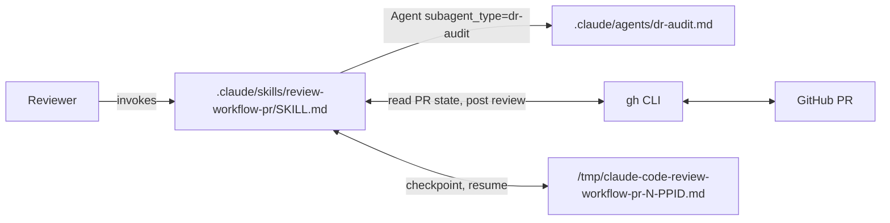

# review-workflow-pr — Architecture Decision Record

## Summary

A reviewer of a workflow-style PR previously had no shared place to
collect observations, no machinery to anchor Decision Record format
checks, and no one-shot mechanism to post many line-anchored comments
as a single bulk review. This work adds the `review-workflow-pr` skill
at `.claude/skills/review-workflow-pr/SKILL.md`, the registered
DR-audit sub-agent at `.claude/agents/dr-audit.md`, and the reviewer-
driven handoff mechanism under `/tmp` that lets a session pause and
resume across `/clear` without losing the observation list. The skill
posts the final bulk review via `gh api -X POST
/repos/{owner}/{repo}/pulls/{N}/reviews`, which is the only GitHub
endpoint that accepts a `comments[]` array of line-anchored items
inside one approve-or-request-changes review object.

## Goals

All five planned goals landed as designed; no goal was descoped.

- A user-invocable skill at `/review-workflow-pr <PR>` that the harness
  auto-registers.
- A reviewer pre-checks-out the PR locally (`gh pr checkout <N>`); the
  skill verifies `HEAD` matches the PR head SHA before loading
  artifacts.
- The skill is read-only against the workflow artifacts under review.
- Line-anchored bulk review submission via the GitHub REST API, not
  the per-comment UI.
- A reviewer-driven handoff and resume path that lets a session pause
  and continue without losing the observation list.

## Constraints

- The skill lives under `.claude/skills/review-workflow-pr/` so the
  harness auto-registers it. `user-invocable: true` is set in the
  frontmatter.
- The DR-audit sub-agent prompt lives at `.claude/agents/dr-audit.md`
  (not under the skill directory) so the spawn call resolves through
  `subagent_type: "dr-audit"`. This constraint surfaced during
  implementation; see D2 for the rationale.
- The skill never edits `design.md`, `implementation-plan.md`, or any
  `plan/track-*.md` on the branch under review.
- The submission step requires explicit reviewer confirmation. No
  silent posting.
- House-style applies to the skill's own Markdown (`SKILL.md`,
  `.claude/agents/dr-audit.md`) per
  `.claude/workflow/conventions.md` §1.5.
- The handoff file at `/tmp/claude-code-review-workflow-pr-<N>-$PPID.md`
  is written only on explicit reviewer cue. No auto-write on
  context-pressure, pre-dispatch, or submission-failure events.

## Architecture Notes

### Component Map

- **`SKILL.md`**: entry point for `/review-workflow-pr`. Owns argument
  parsing, PR resolution, HEAD verification, workflow-doc loading,
  artifact enumeration, research-mode Q&A, observation list state, the
  `dispatchLog`, the reviewer-driven handoff write and resume reload,
  and the end-of-session prune-confirm-POST flow.
- **`.claude/agents/dr-audit.md`**: registered project-scoped sub-agent
  with frontmatter `name: dr-audit`, `model: opus`, and a description
  that documents the dispatch contract. Spawned on demand to audit
  each Decision Record in `implementation-plan.md` for the four
  canonical bolded-key bullets and the optional `**Full design**` link
  resolution. Returns a structured Markdown findings block keyed by
  `## Summary` and `## Findings`.
- **`gh` CLI**: used for PR metadata reads (`gh pr view`,
  `gh repo view`), the per-file diff fetch (`gh pr diff` with a
  `gh api .../pulls/{N}/files --paginate` fallback when `gh pr view
  --json files` silently truncates at 100 entries), and the bulk
  review POST (`gh api -X POST .../reviews`).
- **GitHub PR**: destination for the submitted review.
- **Handoff file**: per-PR Markdown file under `/tmp` written on
  explicit reviewer cue. Captures PR context, local checkout state,
  workflow directory, sub-agent dispatch log, observation list, and
  reviewer notes. Deleted on the successful `.html_url`-returning POST
  branch.

### Decision Records

#### D1: Use `gh api` for line-anchored bulk review submission

- **Alternatives considered**: `gh pr review --request-changes --body`
  (single overall comment, no line anchors); a sequence of `gh pr
  comment` calls (one thread per observation, no unified review).
- **Rationale**: only `POST /repos/{owner}/{repo}/pulls/{N}/reviews`
  accepts a `comments[]` array of file/line-anchored items inside a
  single review object. That is the only mechanism that lets one
  approve-or-request-changes review carry many code-anchored comments.
- **Risks/Caveats**: the JSON payload must include `commit_id` equal to
  the current PR head SHA. If the head moves between fetch and submit,
  the POST fails; the skill re-fetches the head SHA just before
  posting and asks the reviewer to abort or refresh. On 422 the
  skill parses the offending comment index, prepends
  `[REJECTED: <reason from GitHub>]` to that observation's body, and
  returns to prune mode with the rest of the list intact.
- **Outcome**: implemented as planned. Two on-by-default fallbacks
  surfaced during execution and landed: the 100-entry pagination
  fallback (upstream `cli/cli#5368`) for `gh pr view --json files`,
  and the `gh pr diff` empty/errored fallback to the
  `pulls/{N}/files --paginate` `patch` field for hunk parsing.
- **Implemented**: `.claude/skills/review-workflow-pr/SKILL.md`
  §"Wrap-up and submission" sub-blocks `**Payload composer**`,
  `**Path validation**`, `**Line validation**`, and `**POST and URL**`.
  Long-form design rationale: `design-final.md` §"Wrap-up and submission".

#### D2: Register the DR-audit sub-agent in `.claude/agents/`

- **Alternatives considered**: host the prompt under
  `.claude/skills/review-workflow-pr/dr-audit.md` and spawn via an
  in-skill prompt path (the original plan); embed DR-audit logic inline
  in `SKILL.md`; reuse `structural-review.md`, `technical-review.md`,
  or `design-review.md` from `.claude/workflow/prompts/` wholesale.
- **Rationale**: Decision Record criteria are scattered across
  `planning.md` and `structural-review.md` and do not extract cleanly,
  so a focused sub-agent is simpler than carving them out. The
  registration location had to change from the original plan: a prompt
  path under the skill directory would not resolve through
  `subagent_type: "dr-audit"` at all. Registering the prompt at
  `.claude/agents/dr-audit.md` with `name: dr-audit`, `model: opus`,
  and a dispatch-contract description in the frontmatter makes the
  spawn call executable from a clean-context orchestrator via the
  Agent tool: `Agent({subagent_type: "dr-audit", prompt: "plan_path:
  <value>"})`.
- **Risks/Caveats**: the new sub-agent is a small surface to maintain;
  its output format (`## Summary` + `## Findings` with five
  per-finding fields) must stay aligned with the orchestrator's
  finding-to-observation translation in `SKILL.md`. The skill spawn
  call documents the literal Agent invocation shape so a future
  reader can verify the contract end-to-end.
- **Outcome**: implemented with the relocation noted above.
- **Implemented**: `.claude/agents/dr-audit.md` (registered sub-agent)
  and `.claude/skills/review-workflow-pr/SKILL.md` §"Sub-agent
  dispatch — DR audit". Long-form design rationale:
  `design-final.md` §"DR-audit sub-agent and findings translation".

#### D3: Free-form Q&A with auto-recorded observations; reviewer prunes at submit

- **Alternatives considered**: structured walkthrough (the skill drives
  a fixed sequence through design then DRs then tracks); reactive-only
  (the skill never auto-flags, only records when the reviewer
  explicitly says so).
- **Rationale**: matches the `/create-plan` research-mode pattern the
  reviewer already knows. Auto-record reduces friction during analysis.
  The end-of-session prune step keeps the reviewer in control of what
  reaches the PR.
- **Risks/Caveats**: the observation list can grow large during a long
  session. The 50-entry pre-flight warning catches the most common
  runaway case at submission time. `[STALE: verify line]` and
  `[REJECTED: <reason>]` body prefixes mark observations whose
  anchor changed mid-session or whose POST was rejected; both prefixes
  round-trip through the handoff file so resume re-presents them at
  prune time.
- **Outcome**: implemented as planned. Two body-prefix mechanisms
  emerged during execution: `[STALE: verify line]` and
  `[REJECTED: <reason>]`. Both are visible at prune time so the
  reviewer can drop or re-anchor the affected entries.
- **Implemented**: `.claude/skills/review-workflow-pr/SKILL.md`
  §"Research mode" `**Observation auto-recording**` and
  §"Wrap-up and submission" `**Prune commands**`. Long-form design
  rationale: `design-final.md` §"Observation list lifecycle".

#### D4: Require PR pre-checkout; verify HEAD matches PR head SHA

- **Alternatives considered**: fetch artifacts via `gh api` without a
  local checkout; auto-detect both modes.
- **Rationale**: with files on disk, line numbers in observations map
  directly to file line numbers, which then go into the `gh api`
  payload as `line` + `side=RIGHT`. Without a checkout, mapping back
  to PR-diff positions is significantly more complex and brittle.
- **Risks/Caveats**: the reviewer must remember to run
  `gh pr checkout` first. The skill's preflight error message names
  both the expected head SHA and the local HEAD so the reviewer can
  decide whether to reset.
- **Outcome**: implemented as planned, with three verification points:
  session start, the submission re-fetch immediately before composing
  the JSON payload, and resume reload against the persisted
  session-start snapshot.
- **Implemented**: `.claude/skills/review-workflow-pr/SKILL.md`
  §"Preflight" `**Verify local HEAD**`, §"Wrap-up and submission"
  `**Head-SHA re-fetch**`, and §"Handoff and resume"
  `**HEAD re-verification**`. Long-form design rationale:
  `design-final.md` §"HEAD-SHA verification".

#### D5: Reviewer-driven handoff in `/tmp` with PR + PID-glob resume

- **Alternatives considered**: user-global memory under
  `~/.claude/.../memory/` (wrong scope, pollutes the global memory
  index); in-workflow-dir handoff at
  `docs/adr/<dir>/_workflow/handoff-review-*.md` (violates the
  skill's read-only invariant against artifacts under review);
  auto-triggers on context-pressure or pre-dispatch (add polling and
  hidden writes); no handoff at all (loses expensive observation lists
  on `/clear`).
- **Rationale**: `/tmp` with `$PPID` suffix matches the project
  temp-file isolation rule. Reviewer-driven only keeps the skill
  simple: no polling, no hidden writes. PR-keyed glob
  (`...-<N>-*.md`) handles the new-shell case where `$PPID` changes
  but the PR number does not.
- **Risks/Caveats**: a `/clear` without an explicit checkpoint loses
  the observation list. The skill warns at session start that the
  reviewer is responsible for asking. `/tmp` lifetime: most systems
  clean `/tmp` on reboot. Cleanup is per-PR: a successful POST against
  the current PR deletes only that PR's handoff; handoffs from other
  PRs in the same shell stay in `/tmp` until the host reaps them.
- **Outcome**: implemented as planned. The `**POST and URL**` sub-block
  in `## Wrap-up and submission` is the load-bearing owner of the
  handoff-delete action on the success branch. Resume reload includes
  malformed-input recovery, workflow-directory mismatch handling, and
  PR-number cross-check between the filename, the persisted PR
  context, and the current `gh pr view` output.
- **Implemented**: `.claude/skills/review-workflow-pr/SKILL.md`
  §"Handoff and resume" sub-blocks `**Write trigger**`,
  `**Write path**`, `**File format**`, `**Resume discovery**`,
  `**Resume reload**`, `**HEAD re-verification**`,
  `**Dispatch-log re-presentation**`, and `**Cleanup discipline**`.
  Long-form design rationale: `design-final.md` §"Handoff and resume".

### Invariants & Contracts

- Every observation in the submission payload has a `path` present in
  the PR's changed file set and a `line` that falls within the file's
  current content or PR diff. Verified before composing the JSON
  payload; out-of-range entries are marked `[STALE: verify line]` and
  surfaced at prune time rather than silently dropped.
- The skill never modifies the workflow artifacts on the branch under
  review. No `Edit`, `Write`, or `git commit` against those files.
- The PR submission step requires explicit user confirmation. No
  silent posting.
- The handoff file at `/tmp/claude-code-review-workflow-pr-<N>-$PPID.md`
  is written only when the reviewer explicitly asks. The skill never
  auto-writes on context-pressure polling, pre-dispatch events, or
  submission-failure fallback.
- The `dispatchLog` is append-only and never auto-deduped. The latest
  entry per `sub-agent name` is the authoritative last-run summary at
  resume; earlier entries are preserved so the reviewer sees the
  spawn history.
- The persisted head SHA in the handoff file is the session-start
  snapshot, used at resume only for HEAD-drift detection. The
  in-memory wrap-up head-SHA cache is not persisted; resume re-derives
  it from a fresh `gh pr view` at preflight. The in-memory cache
  reverts to the session-start value on POST failure so the next
  wrap-up trigger re-runs the re-fetch from scratch.

### Integration Points

- `gh pr view <ref> --json headRefOid,number,files` reads PR metadata
  at session start and again at submission. Each element of `files`
  carries `path`, `additions`, `deletions`, and `changeType`; the
  skill reads `.path`. When the cached `files` array has exactly 100
  entries, the gh CLI has silently truncated the result (upstream
  `cli/cli#5368`); the skill re-fetches via
  `gh api repos/{owner}/{repo}/pulls/{N}/files --paginate -q '.[] |
  {path: .filename, changeType: .status}'`.
- `gh repo view --json nameWithOwner` resolves owner/repo for the API
  path.
- `gh pr diff` provides per-file diff hunks for line validation. When
  it errors or returns empty, the skill falls back to the per-file
  `patch` field returned by `gh api .../pulls/{N}/files --paginate`.
- `gh api -X POST /repos/{owner}/{repo}/pulls/{N}/reviews --input -`
  posts the bulk review with the composed JSON payload on stdin.
- Sub-agent dispatch target: `.claude/agents/dr-audit.md` via
  `Agent({subagent_type: "dr-audit", prompt: "plan_path: <value>"})`.
  The prompt body has `name: dr-audit` and `model: opus` in
  frontmatter; spawn does not override the model from the dispatch
  call.
- Filesystem path: `/tmp/claude-code-review-workflow-pr-<N>-$PPID.md`
  (handoff write target; PR-keyed glob `<N>-*.md` on resume).

### Non-Goals

- Reviewing track decomposition correctness (sizing, dependencies,
  scope indicators).
- House-style compliance review of the artifacts being reviewed.
- Cross-artifact consistency review (plan / design / track-file name
  and reference alignment).
- Running the `design.md` mutation discipline (`edit-design`) as part
  of review.
- Supporting non-workflow PRs. The skill assumes
  `docs/adr/<dir>/_workflow/` exists in the checkout and aborts
  cleanly when it does not.
- Automatic handoff triggers (context-pressure polling, pre-dispatch
  checkpoints, submission-failure fallback). Handoff is reviewer-
  driven only.

## Key Discoveries

The discoveries below surfaced during implementation and review. Each
has at least one referenced file or commit so a future reader can
verify the substance without the working-file artifacts that no longer
exist post-merge.

- **Skill prose under `.claude/skills/**` is durable content.** The
  project ephemeral-identifier exclude list covers
  `docs/adr/*/_workflow/**` and `.claude/workflow/**` only; everything
  under `.claude/skills/**` and `.claude/agents/**` ships to `develop`
  and must follow the ephemeral-identifier discipline. Cite by file
  path, class or method name, or stable workflow-doc anchor rather
  than ephemeral track / step / finding labels. Implication: the
  pre-commit gate fires on writer-side skill prose just as it does on
  source code.

- **`gh pr view --json files` silently truncates at 100 entries.**
  Upstream `cli/cli#5368`. The skill detects the truncation by
  checking `files.length == 100` and falls back to
  `gh api repos/{owner}/{repo}/pulls/{N}/files --paginate -q '.[] |
  {path: .filename, changeType: .status}'`. The fallback jq projection
  carries the same `path` and `changeType` fields the line-validation
  rules expect, so downstream code is uniform across the two paths.
  See `.claude/skills/review-workflow-pr/SKILL.md` §"Wrap-up and
  submission" `**Path validation**`.

- **`gh pr diff` is not always available.** Empty or errored output
  forces the skill to parse hunks from the per-file `patch` field
  returned by `gh api .../pulls/{N}/files --paginate` instead. The
  fallback covers the diff-too-large and gh-CLI-version cases. See
  `.claude/skills/review-workflow-pr/SKILL.md` §"Wrap-up and
  submission" `**Line validation**`.

- **DR-audit prompt registration shape.** A prompt path under the
  skill directory does not resolve through `subagent_type`. The
  prompt must live at `.claude/agents/<name>.md` with frontmatter
  `name:`, `description:`, and (when needed) `model:` so the Agent
  tool's `subagent_type: "<name>"` field finds it. The dispatch call
  documents the literal `Agent({subagent_type: "dr-audit", prompt:
  "plan_path: <value>"})` shape, which is what a clean-context
  orchestrator can execute. See D2 and
  `.claude/agents/dr-audit.md` frontmatter.

- **The `**POST and URL**` sub-block owns the handoff-delete action.**
  The handoff file is deleted only on the success branch that returns
  an `.html_url`. The owner is explicit in
  `.claude/skills/review-workflow-pr/SKILL.md` §"Wrap-up and
  submission" `**POST and URL**`, and the `## Handoff and resume`
  cleanup-discipline sub-block cross-references it by name. The
  earlier design draft described cleanup abstractly and did not pin
  the action-owner; the durable artifact names it.

- **`[STALE: verify line]` and `[REJECTED: <reason>]` are the two
  body-prefix marking mechanisms.** Both are visible to the reviewer
  at prune time and both round-trip through the handoff file's
  observation list. `[STALE: verify line]` fires when a sub-agent's
  quoted prose has drifted, when path or line validation marks an
  observation out of range, or when HEAD re-verification on resume
  forces a refresh. `[REJECTED: <reason from GitHub>]` fires on a
  422 POST response and tags the offending observation by index. The
  reviewer drops or re-anchors the affected entries; the skill does
  not silently drop either class.

- **The `dispatchLog` re-presentation has three distinct states per
  sub-agent name.** Missing entry means "audit never ran to
  completion" (the spawn errored before a well-formed `## Summary`,
  or no spawn was attempted). Entry with `findings_count=0` means
  "ran, no findings". Entry with `findings_count>0` means "ran, N
  findings recorded" and the matching observations are already
  restored. Missing entries are distinct from zero-finding entries;
  resume must not conflate them. See
  `.claude/skills/review-workflow-pr/SKILL.md` §"Handoff and resume"
  `**Dispatch-log re-presentation**`.

- **Pre-commit ephemeral-identifier regex pattern.** The regex
  `\b[A-Z]{1,3}-?[0-9]+\b` matches the intended forbidden tokens
  (`F-12`, `R-4`, `CQ33`, `A-7`, `S-2`) plus plausible-looking
  durable-content tokens like `ISO-8601`, RFC IDs, and file-format
  versions. Standards-suffix tokens hit the gate four times during
  this work; resolution is by inspection (the §Allowed list's
  "self-contained references" reading covers the case), not rewrite.
  A negative-lookahead tightening for the `ISO-`, `RFC-`, `BCP-`
  prefixes is a candidate workflow improvement; not in scope here.

- **`steroid_execute_code` Kotlin triple-quoted multi-line strings
  preserve code-side indentation.** Writing Markdown prose into a
  file via `VfsUtil.saveText` with a triple-quoted string corrupts
  the on-disk content (the indent renders as an indented code block
  and pulls the next `##` header into the same block).
  `listOf(...).joinToString("\n")` is the safe shape for multi-line
  Markdown injection through `VfsUtil.saveText`. Discovered while
  authoring the orchestrator's `## Research mode` section.

- **`findProjectFile(<absolute-path>)` returned null inside the open
  project's root on one spawn.** The same absolute path resolved
  correctly via
  `LocalFileSystem.getInstance().refreshAndFindFileByPath(<abs>)`.
  The `LocalFileSystem`-rooted form is the preferred resolver for
  paths inside the open project when `findProjectFile` is unreliable.

- **`steroid_apply_patch` is the better fit for short literal-text
  edits than `steroid_execute_code`.** `steroid_execute_code`'s
  suspend body must return `Unit`, not a string, which makes the
  script awkward for early-exit diagnostic returns on short
  literal-text edits. `steroid_apply_patch` runs the same single-hunk
  insertion atomically with no kotlinc compile cycle.

- **Forward-pointer discipline matters during drafting.** When a step
  authors the first half of a two-step section, citing the next step
  by number is a natural mental anchor that the pre-commit gate
  catches. Anchor forward-pointers by named subsection or by
  behavior rather than by step number, even though the gate would
  catch the leak before the commit lands.
