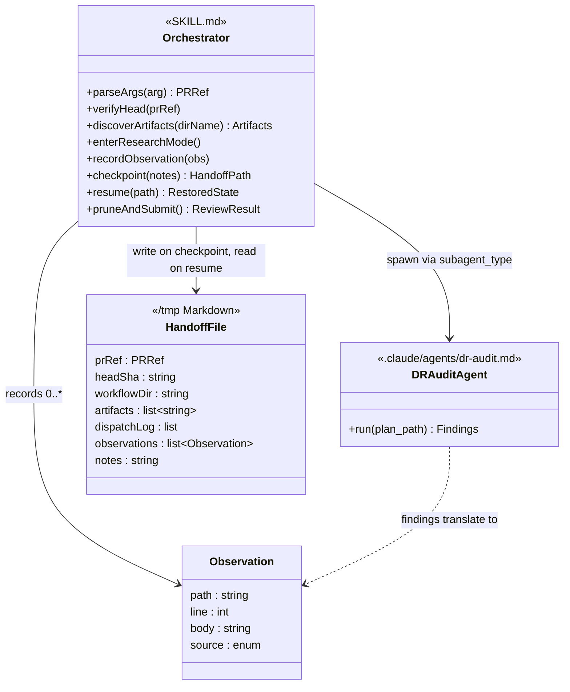

# review-workflow-pr — Design

## Overview

A reviewer of a workflow-style PR opens the design document, the
implementation plan, and the track files one tab at a time, accumulates
notes in scratch space, and (if anything is worth flagging) posts
comments in the GitHub UI by clicking through each line. There is no
machinery for pointing the Decision Record format rules at the reviewer,
no shared place to collect observations, and no one-shot submission that
bundles many line-anchored comments into a single review.

This design adds the `review-workflow-pr` skill: a `/review-workflow-pr
<PR>` command that loads the workflow review context, enters research
mode, helps the reviewer assess design soundness and the Decision
Records, auto-records observations into a single in-conversation list,
optionally persists session state to `/tmp` on explicit reviewer cue,
and at the reviewer's signal posts a bulk line-anchored review back to
the PR through the GitHub REST API.

The enabling primitives are (a) a registered DR-audit sub-agent at
`.claude/agents/dr-audit.md` with `subagent_type: "dr-audit"` spawn
shape and (b) the `POST /repos/{owner}/{repo}/pulls/{N}/reviews` REST
endpoint accessed through `gh api`, which is the only mechanism that
lets one review carry many file-and-line-anchored comments. The skill
is purely additive under `.claude/skills/review-workflow-pr/`; no
existing prompt or rule changes.

One deviation from the original plan: the DR-audit prompt was relocated
from `.claude/skills/review-workflow-pr/dr-audit.md` to
`.claude/agents/dr-audit.md` and registered as a project-scoped
sub-agent. A path under the skill directory would not resolve through
`subagent_type`, so a clean-context orchestrator could not have
dispatched the audit. All five Decision Records (D1–D5) landed as
designed; full rationale lives in the companion `adr.md` artifact.

The rest of the document covers Core Concepts, Class Design, Workflow,
then five dedicated sections: HEAD-SHA verification, observation list
lifecycle, DR-audit sub-agent and findings translation, wrap-up and
submission, and handoff and resume.

## Core Concepts

This design introduces four load-bearing ideas. Each is named and used
without re-definition in the dedicated sections that follow.

**Observation.** A structured record `{path, line, body, source}` where
`path` is an artifact path under `_workflow/`, `line` is a 1-based line
number (or a `start-end` range), `body` is a one-paragraph description
of the gap, and `source` is one of three tags: `dr-audit`,
`skill-analysis`, or `reviewer`. The reviewer's bulk-review submission
is built from the surviving observation list at wrap-up. Replaces
ad-hoc reviewer scratch notes that lived only in the reviewer's
working memory. → §"Observation list lifecycle".

**`dispatchLog`.** An in-conversation append-only ordered list of
`{sub-agent name, ISO-8601 UTC timestamp, summary}` entries, one per
sub-agent spawn including zero-finding spawns. Resume reads the latest
entry per `sub-agent name` as the authoritative last-run summary
without auto-deduping earlier entries. Provides the "which sub-agents
have run, and how many findings did each surface" view that the resume
flow re-presents to the reviewer. → §"DR-audit sub-agent and findings
translation", §"Handoff and resume".

**Handoff file.** One Markdown file at
`/tmp/claude-code-review-workflow-pr-<N>-$PPID.md` carrying six
sections (PR context, Local checkout, Workflow directory, Sub-agent
dispatch log, Observation list, Reviewer notes). Written only on
explicit reviewer cue and reloaded on the next invocation via a
PR-keyed glob. Replaces volatile in-memory state that a `/clear` would
otherwise discard. → §"Handoff and resume".

**Sub-agent dispatch via `subagent_type`.** The DR-audit prompt is
registered as a project-scoped sub-agent at `.claude/agents/dr-audit.md`
with frontmatter `name: dr-audit` and `model: opus`. The skill spawns
it via the Agent tool with `subagent_type: "dr-audit"`. Replaces the
plan's original "prompt under the skill directory" approach, which
would not have been dispatchable through `subagent_type` from a
clean-context orchestrator. → §"DR-audit sub-agent and findings
translation".

## Class Design



**TL;DR.** The skill has two Markdown artifacts (the orchestrator
`SKILL.md` and the DR-audit sub-agent prompt), one in-conversation data
type (`Observation`), one in-conversation log (`dispatchLog`), and one
optional on-disk artifact (the handoff file under `/tmp`). The
orchestrator runs in the main session and owns all session-level state.
The DR-audit sub-agent is stateless; each invocation returns a structured
findings block that the orchestrator parses and translates into one
`Observation` per finding. The handoff file is written only on explicit
reviewer checkpoint and reloaded on resume.

The orchestrator carries: the parsed PR reference, the head SHA verified
at session start (a snapshot used for HEAD-drift detection on resume), the
discovered artifact paths under `docs/adr/<dir>/_workflow/`, the running
observation list, and the `dispatchLog` (an append-only ordered list of
`{sub-agent name, ISO-8601 UTC timestamp, summary}` entries, one per
sub-agent spawn). The DR-audit sub-agent is registered at
`.claude/agents/dr-audit.md` with frontmatter `name: dr-audit`, `model:
opus`, and a description that documents the dispatch contract; spawn
happens via the Agent tool with `subagent_type: "dr-audit"`, so the
prompt body lives in the registered agent file rather than in the skill
directory.

## Workflow

```mermaid
sequenceDiagram
    actor R as Reviewer
    participant Sh as Shell
    participant Sk as Orchestrator
    participant GH as gh CLI
    participant Sub as DR-audit sub-agent
    participant Obs as Observation list
    participant HF as Handoff file

    R->>Sh: gh pr checkout <N>
    R->>Sk: /review-workflow-pr <N>
    Sk->>GH: gh pr view --json headRefOid,number,files
    GH-->>Sk: head SHA, files array
    Sk->>GH: gh repo view --json nameWithOwner
    GH-->>Sk: owner/repo
    Sk->>Sh: git rev-parse HEAD
    Sh-->>Sk: local SHA
    Note over Sk: assert local SHA == head SHA
    Sk->>Sh: glob /tmp/claude-code-review-workflow-pr-N-*.md
    Note over Sk: 0/1/many handoff candidates → optional resume reload
    Sk->>Sk: enumerate docs/adr/<dir>/_workflow/
    Sk->>R: ready, what do you want to investigate?

    R->>Sk: audit the DRs
    Sk->>Sub: Agent(subagent_type: dr-audit, plan_path: ...)
    Sub-->>Sk: ## Summary + ## Findings (Markdown)
    Sk->>Obs: append translated observations
    Note over Sk: append dispatchLog entry

    R->>Sk: checkpoint
    Sk->>R: any notes to carry over?
    R->>Sk: <notes>
    Sk->>HF: write /tmp/claude-code-review-workflow-pr-N-PPID.md
    Sk->>R: handoff written: <path>

    R->>Sk: wrap up
    Sk->>R: numbered observation table; prune?
    R->>Sk: drop 3, 7
    Sk->>GH: gh pr view --json headRefOid (re-fetch)
    Sk->>R: REQUEST_CHANGES with N comments to PR <N>?
    R->>Sk: yes
    Sk->>GH: gh api POST /repos/{o}/{r}/pulls/{N}/reviews
    GH-->>Sk: review URL
    Sk->>HF: delete handoff (only on this success branch)
    Sk->>R: posted <url>
```

**TL;DR.** Reviewer checks out the PR and invokes the skill. The skill
verifies the local HEAD matches the PR head, globs `/tmp` for any prior
handoff against this PR, optionally offers to resume, enters research
mode, and waits. The reviewer drives the conversation. A DR-audit
dispatch goes through the Agent tool with `subagent_type: "dr-audit"`,
and translated observations appear in the list along with a new
`dispatchLog` entry. The reviewer can ask the skill to checkpoint at any
time, which writes the observation list, the dispatch log, and reviewer
notes to a Markdown file under `/tmp`. At wrap-up the reviewer prunes,
the skill re-fetches the head SHA so the JSON payload uses a fresh
value, asks for one confirmation, POSTs the bulk review, and on success
deletes the handoff file so a follow-up invocation against the same PR
starts clean.

The flow has four gates: HEAD verification at session start, the resume
prompt when a prior handoff is found, the prune step at wrap-up, and the
one-line confirmation immediately before the `gh api` POST. No
submission is posted without an explicit yes.

## HEAD-SHA verification

**TL;DR.** Before the skill loads any artifact, it confirms the local
working tree is on the PR's head commit. If not, it stops and tells the
reviewer how to fix it. The check runs again just before submission so a
mid-session push does not cause the JSON payload to reference a stale
commit, and once more on resume to catch HEAD drift between the
checkpoint and the next session.

The verification has three phases. At session start the skill calls
`gh pr view <ref> --json headRefOid -q .headRefOid`, then compares
against `git rev-parse HEAD`. A mismatch aborts with `gh pr checkout
<ref>` as the suggested remediation. At submission time, just before
composing the JSON payload, the skill re-fetches the head SHA the same
way. If the head has moved between session start and submission, the
skill asks the reviewer whether to (a) refresh and re-verify line numbers
against the new content, or (b) abort the submission and re-checkout.
The default safe path is (b). At resume time the persisted session-start
head SHA from the handoff file is compared against the current
`git rev-parse HEAD`; on mismatch the reviewer chooses among **refresh
observations**, **abort and re-checkout**, or **proceed without
revalidation** (with the `[STALE: verify line]` risk acknowledged).

### Edge cases / Gotchas

- `gh pr checkout` typically creates a named local branch tracking the
  PR head, and uses a detached HEAD only with `--detach`. Either case
  is fine for the verification check: `git rev-parse HEAD` returns the
  head SHA regardless of branch shape.
- A reviewer who has cherry-picked or amended local commits on top of
  the PR checkout will fail verification. The skill's error message
  names both the expected head SHA and the local HEAD so the reviewer
  can decide whether to reset.
- The re-fetch at submission time uses a fresh `gh pr view` call rather
  than the cached value from session start. On POST failure the
  in-memory cache reverts to the session-start value so the next
  wrap-up trigger re-runs the re-fetch from scratch.
- The persisted head SHA in the handoff file is the session-start
  snapshot, used at resume only for HEAD-drift detection. The
  in-memory wrap-up cache is not persisted; resume re-derives it from
  a fresh `gh pr view` at preflight.

### References

- Decision records: D4 in [adr.md](adr.md) §"Decision Records"

## Observation list lifecycle

**TL;DR.** Observations live in the orchestrator's in-conversation state
for the duration of the session, plus optionally on disk if the reviewer
checkpoints. Each observation carries a `path`, a `line` (or start/end
line for ranges), a `body`, and a `source` tag (`dr-audit`,
`skill-analysis`, or `reviewer`). The reviewer reviews and prunes the
list at wrap-up; nothing reaches the PR before that confirmation.

Observations enter the list in three ways:

1. The skill auto-records when a sub-agent returns findings. One
   observation per finding, with the source tag set to the sub-agent
   name (currently only `dr-audit`).
2. The skill auto-records when its own analysis surfaces an issue
   mid-conversation. For example, when the reviewer asks "is D3 well
   grounded?" and the skill identifies a gap, the gap becomes an
   observation tagged `skill-analysis`.
3. The reviewer asks the skill to record something directly ("flag the
   missing risk in D5"). Source tag is `reviewer`.

At wrap-up the skill renders the list as a numbered Markdown table:
index (1-based), `path:line` (or `path:start-end` for ranges), source,
and body truncated at 120 characters. Pipe, backslash, and backtick
characters in cell bodies are escaped, and literal newlines are
replaced with `<br>` so each cell stays on one visual line. The
reviewer issues `drop`-verb commands: `drop 3, 7` (drop the entries at
the named indices), `drop all from dr-audit` (drop every entry whose
source matches the named tag), or `keep all`. Bare numeric arguments
always refer to the displayed index column, never to a numerically-
named source tag. The remaining items go into the JSON payload.

The list lives in memory by default. A `/clear` mid-session loses it
unless the reviewer has asked the skill to checkpoint to `/tmp` via the
handoff mechanism. The session-start prelude warns about this in one
line.

### Edge cases / Gotchas

- Two observations on the same `path:line` are not auto-merged. The
  reviewer may consolidate during prune by dropping one and re-recording
  the other.
- An observation whose anchor turns out to be stale (the file's
  surrounding prose was edited mid-session, or HEAD moved at resume)
  is marked by prepending the literal string `[STALE: verify line]` to
  its body. The reviewer sees the prefix at prune time and chooses to
  drop or re-anchor it.
- An observation rejected by GitHub on POST (a 422 response naming one
  or more offending comment indices) is marked with `[REJECTED: <reason
  from GitHub>]` prepended to its body, and the skill returns to prune
  mode with the list intact so the reviewer can drop or re-anchor each
  rejected entry.
- Observations from a sub-agent whose finding did not cite a specific
  line are anchored at the artifact's nearest section heading; the
  source tag still identifies the sub-agent.
- Repeated sub-agent spawns append observations verbatim; duplicates
  are not auto-deduped. The reviewer prunes duplicates at wrap-up.

### References

- Decision records: D3, D5 in [adr.md](adr.md) §"Decision Records"

## DR-audit sub-agent and findings translation

**TL;DR.** One sub-agent is wired into the skill: the DR-audit
sub-agent at `.claude/agents/dr-audit.md`, registered with `name:
dr-audit` and `model: opus` so the spawn target resolves through
`subagent_type: "dr-audit"`. The sub-agent returns structured findings
in a documented Markdown format. The orchestrator translates each
finding into one observation by mapping the finding's `plan_line` to a
line in `implementation-plan.md`, and appends one `dispatchLog` entry
per spawn.

**Sub-agent registration.** The prompt body lives in
`.claude/agents/dr-audit.md`, not under
`.claude/skills/review-workflow-pr/`. Hosting the prompt as a
registered sub-agent makes the spawn call executable from a
clean-context orchestrator: `Agent({subagent_type: "dr-audit", prompt:
"plan_path: <value>"})`. A prompt path under the skill directory would
not resolve through `subagent_type` at all.

**Spawn call.** Dispatched via the Agent tool with `subagent_type:
"dr-audit"`. The agent prompt opens with `plan_path: <value>` as the
first line so the sub-agent can parse the input before any other
content. The sub-agent reads `design.md` on demand when a Decision
Record cites `**Full design**: design.md §...`; the orchestrator does
not pre-pass `design.md`.

**Sub-agent parse contract.** The sub-agent enumerates each `#### D<n>:`
block under `### Architecture Notes` in `plan_path`, verifies the four
canonical bolded-key bullets (`**Alternatives considered**`,
`**Rationale**`, `**Risks/Caveats**`, `**Implemented in**`) and the
optional fifth (`**Full design**: design.md §...`), resolves the
`**Implemented in**` reference against the plan's `## Checklist`, and
resolves the optional `**Full design**` reference against a `## `
heading in `design.md`. Findings fall into four categories:
`missing-key`, `stub-content`, `unresolved-track`, and
`unresolved-full-design`. Bolded-key matching is case-sensitive with no
extra inner whitespace; heading matching is canonicalised (trim, collapse
internal whitespace, treat hyphen-minus as equivalent to space,
lower-case both sides).

**Sub-agent return shape.** A Markdown document with two top-level
headings: `## Summary` (lines `decisions_audited`, `findings_count`,
`plan_path`, `design_path_loaded`) and `## Findings` (one `### F<i>`
block per finding, each with `decision`, `category`, `plan_line`,
`quote`, `body`).

**Finding-to-observation translation.** For each `### F<i>` block, the
orchestrator builds one observation `{path = plan_path from Summary,
line = plan_line, body = finding body verbatim, source = "dr-audit"}`
and appends to the list under the auto-recording rules. The one-line
confirmation prints the same way it does for `skill-analysis`
observations.

**Dispatch-log entry.** Every spawn appends one entry to the
`dispatchLog`, including spawns that return zero findings. Entry shape:
`{sub-agent name, ISO-8601 UTC timestamp, one-line summary}` where the
summary echoes the sub-agent's `## Summary` as
`decisions_audited=<N>, findings_count=<N>`. Repeated spawns append
additional entries; the latest entry per `sub-agent name` is the
authoritative "last run" but earlier entries are preserved so the
reviewer sees the spawn history.

### Edge cases / Gotchas

- A finding without an explicit `plan_line` is anchored at the artifact
  the sub-agent reviewed, at the nearest `##` heading at or above the
  implied location.
- A finding whose `quote` does not match the current content at
  `plan_line` triggers a search of the artifact for the literal quote
  string. One match resolves to that line; zero or multiple matches
  keep the reported `plan_line` and prepend `[STALE: verify line]` to
  the body so the reviewer sees the flag at prune time.
- A dispatch failure (no parsable `## Summary`, missing `decisions_audited`
  or `findings_count`, individual `### F<i>` block missing required
  fields, spawn errors out) skips or partially-skips the `dispatchLog`
  append. Resume reads the absence of an entry as "audit never ran to
  completion" rather than "audit completed with zero findings".
- A reviewer who wants a broader cold-read of the design itself invokes
  the existing cold-read flow as a separate skill in the same session;
  that output does not flow back into this observation list
  automatically.

### References

- Decision records: D2 in [adr.md](adr.md) §"Decision Records"

## Wrap-up and submission

**TL;DR.** The skill renders the observation list as a numbered Markdown
table, accepts `drop`-verb prune commands, warns on lists larger than
50 entries, re-fetches the head SHA, asks for one confirmation, POSTs
the bulk line-anchored review via the `pulls/{N}/reviews` endpoint, and
on success deletes the handoff file. The empty-list branch skips the
table and prune and POSTs an `APPROVE` review with a one-line body. On
422 every offending observation is tagged `[REJECTED: <reason>]` and
the skill re-renders the prune table before returning to prune mode;
other failures keep the list intact for retry.

**Wrap-up trigger.** Treat any one of `wrap up`, `done`, `submit`, or
`finish` as the wrap-up cue, matched case-insensitively against the
reviewer's full message with whitespace and punctuation allowed but
substring matches in longer prose ignored. Multiple trigger words in
one message trigger a clarification path.

**Path validation.** Each comment's `path` must appear in the PR's
changed-file set. The skill uses the `.files[].path` cache from the
preflight `gh pr view --json files` call. When the cached array has
exactly 100 entries, the gh CLI has silently truncated the result
(upstream `cli/cli#5368`); the skill re-fetches the full list via
`gh api repos/{owner}/{repo}/pulls/{N}/files --paginate -q '.[] | {path:
.filename, changeType: .status}'` and uses that. Each fallback entry
carries both `path` and `changeType` so line validation can apply the
per-status rules below.

**Line validation.** Each comment's `line` must fall within the file's
PR diff or current content. The skill parses diff hunks from
`gh pr diff`, with a fallback to the per-file `patch` field returned
by `gh api .../pulls/{N}/files --paginate` when `gh pr diff` errors or
returns empty. The validation rules apply in this order: (1) for an
`ADDED` file, every line of current content is a valid target; (2) for
`MODIFIED`, `RENAMED`, `COPIED`, or `CHANGED` files, only the added or
modified lines reported by the diff hunks are valid; (3) lines outside
both the hunks and the current content are marked stale; (4) for a
`REMOVED` file no `line` is a valid `side=RIGHT` target, so every
observation against it is marked stale. Stale observations are tagged
with `[STALE: verify line]` and surfaced at prune time rather than
silently dropped.

**Payload composer.** The JSON body has four fields: `commit_id` (the
verified head SHA), `body` (auto-generated one-paragraph summary;
non-empty branch names the observation count and source mix, empty
branch is the one line `All workflow artifacts review clean.`),
`event` (`APPROVE` when the pruned list is empty, `REQUEST_CHANGES`
otherwise), and `comments[]` (one `{path, line, side: "RIGHT", body}`
per surviving single-line observation; range observations also carry
`start_line` set to the range start, with `line` set to the range end,
matching GitHub's multi-line review-comment shape; `comments[]` is
omitted on the empty-list `APPROVE` branch). The POST is issued via
`gh api -X POST /repos/{owner}/{repo}/pulls/{N}/reviews --input -` with
the composed JSON on stdin.

**POST and URL.** On confirmation, the skill POSTs the payload, parses
`.html_url` from the response, prints the URL on one line, and deletes
the handoff file at `/tmp/claude-code-review-workflow-pr-<N>-$PPID.md`
if it exists. This is the only success branch that deletes the
handoff; every other path preserves it. On 422 the skill parses every
offending comment index reported in the response body (GitHub may flag
more than one comment per submission), prepends `[REJECTED: <reason
from GitHub>]` to each affected observation's body, re-renders the
prune table so the rejected entries are visible alongside the rest of
the list, and returns to prune mode. On any other non-zero exit
(network, 5xx, rate limit, auth lapse) the observation list survives
and the in-memory head-SHA cache reverts to the session-start value so
the next wrap-up trigger re-runs the re-fetch from scratch.

### Edge cases / Gotchas

- GitHub rejects a review if a comment's `path` is not in the PR's
  changed-file set or if `line` falls outside the diff. Path and line
  validation run before the POST and mark anything out-of-range as
  stale.
- An empty observation list with `event=APPROVE` succeeds with no
  `comments[]` array on the JSON object. The body is a single line.
- Prune commands tolerate comma, space, or mixed separators (`drop 3,
  7`, `drop 3 7`, `drop 3,7` all parse the same). Out-of-range indices
  report the offending number and the rest of the list still processes;
  negative indices are rejected; unknown source tags log a one-line
  warning and drop zero entries.
- A 422 mutation tags every flagged observation in memory but does not
  auto-write to the handoff file. The reviewer must re-checkpoint
  explicitly if they want the rejection state to survive across
  `/clear`.

### References

- Decision records: D1 in [adr.md](adr.md) §"Decision Records"

## Handoff and resume

**TL;DR.** Long review sessions accumulate expensive state: the
observation list, the sub-agent dispatch log, the verified head SHA,
reviewer notes. When the reviewer needs to clear context or pause, they
ask the skill to checkpoint. The skill writes one Markdown file at
`/tmp/claude-code-review-workflow-pr-<N>-$PPID.md`. On the next
`/review-workflow-pr <N>` invocation the skill globs
`/tmp/claude-code-review-workflow-pr-<N>-*.md` (PR-keyed prefix, PID
wildcard so a new shell with a different `$PPID` still finds the
file), re-verifies HEAD, reloads state, and re-presents the observation
list.

**Reviewer-driven only.** The handoff is reviewer-driven, not
automatic. The skill does not poll the context monitor, does not write
before each sub-agent dispatch, and does not auto-checkpoint on
submission failure. The reviewer carries the responsibility for asking
when they want a checkpoint. Trigger phrases: `checkpoint`, `save
state`, `we're about to /clear` (case-insensitive, whole-message match
allowing surrounding whitespace and punctuation; substring matches in
longer prose do not fire). The inline shape `checkpoint <prose>` is
also accepted; the `<prose>` becomes the Reviewer notes section
directly. Otherwise the skill asks `Any notes to carry over?` as a
single conversational turn after every successful write.

**File format.** Six sections in this order, matching workflow state
ordering (audit log before user output):

1. **PR context.** Number, owner/repo, head SHA at session start.
2. **Local checkout.** Path (`pwd` output), HEAD at handoff time.
3. **Workflow directory.** `<dir>` resolved at preflight, the artifact
   paths enumerated by `## Artifact discovery`.
4. **Sub-agent dispatch log.** The `dispatchLog` as-written: one entry
   per spawn, in order, including zero-finding spawns. Repeated spawns
   of the same `sub-agent name` are preserved without auto-dedup.
5. **Observation list.** One numbered entry per observation in live
   conversation order, each carrying `path:line` (or `path:start-end`),
   source tag, and the full body verbatim (no truncation; the wrap-up
   table truncates to 120 chars for display, but the persisted state
   round-trips the full body). `[STALE: verify line]` and
   `[REJECTED: <reason>]` prefixes round-trip.
6. **Reviewer notes.** Free-form prose worth carrying over. An empty
   section persists a single blank line so resume sees an
   intentionally-empty section rather than a parse error.

**Resume discovery.** Runs after preflight resolves the PR number but
before artifact discovery loads anything. The glob result drives a
three-way branch: zero matches proceed as a fresh session; one match
prints the path and asks for explicit confirmation; multiple matches
list every candidate as a numbered table (full path plus mtime in
ISO-8601 UTC, sorted newest-first) and ask the reviewer to pick. The
mtime reflects the most recent write because the write trigger
overwrites the same path on every fire. The reviewer can pick an older
entry by index when they want to resume from an earlier state.

**Resume reload.** After the reviewer confirms a handoff, the skill
re-reads the file and parses the six sections. On any parse failure
(missing required section header, missing required field, sections out
of order, file truncated by a host crash mid-write), the skill names
the failure shape and the file path, then asks the reviewer to choose
between (a) discard the handoff and proceed as a fresh session, or (b)
abort so the reviewer can inspect or hand-edit the file. The
session-start head SHA from section 1 is cross-checked against the
filename's `<N>` and the current `gh pr view` output; on mismatch all
three values are surfaced and the reviewer chooses among proceed,
abort, or discard. The persisted `<dir>` from section 3 is compared
against `git branch --show-current`; on mismatch the reviewer picks
which `<dir>` to use. Each artifact path recorded in section 3 is
checked for existence on disk before research mode begins.

**HEAD re-verification.** Compares the persisted session-start head
SHA against the current `git rev-parse HEAD`. On match, resume
proceeds straight into research mode. On mismatch the reviewer picks
among three options, each surfaced with its consequence:

- **Refresh observations** (the named safe default). Re-runs the
  wrap-up head-SHA re-fetch procedure verbatim: re-fetches
  `gh pr view <ref> --json files,headRefOid`, re-runs path and line
  validation against the new diff for every observation, and prepends
  `[STALE: verify line]` to any observation whose anchor no longer
  resolves. Enters research mode after the refresh completes; does not
  jump to the wrap-up confirmation prompt.
- **Abort and re-checkout.** Tells the reviewer to run `gh pr checkout
  <ref>` and exits research mode. The just-resumed in-memory state is
  preserved across the abort so the reviewer can re-checkpoint before
  `/clear` if they want a fresh snapshot.
- **Proceed without revalidation.** Enters research mode against the
  new HEAD without refreshing. The wrap-up line validation runs
  against the new HEAD, so most or all observations may be marked
  `[STALE: verify line]` at wrap-up.

**Dispatch-log re-presentation.** After reload, the skill surfaces the
`dispatchLog` state to the reviewer as one of three distinct cases per
`sub-agent name` so they can decide whether to re-run any audit:

- **Not run.** No entry for the named sub-agent — the audit never ran
  to completion (the spawn errored before a well-formed `## Summary`
  block, or no spawn was attempted).
- **Ran, no findings.** Entry present with `findings_count=0`. The
  audit completed and surfaced nothing.
- **Ran, N findings recorded.** Entry present with `findings_count>0`.
  The corresponding observations are already in the restored list.

The latest entry per `sub-agent name` is the authoritative last-run
summary, but earlier entries are preserved so the reviewer sees the
full spawn history.

**Cleanup discipline.** The handoff file persists across resume
reloads — re-reading does not delete. The file is deleted only on a
successful `gh api` POST (the `**POST and URL.**` sub-block in
`## Wrap-up and submission` owns the delete action on the
`.html_url`-returning success branch). On every other path
(non-422 failure, reviewer cancels at confirmation, `/clear` without
explicit submit, host reboots mid-session) the file persists until the
next successful submission against this PR or until the reviewer
deletes it manually. Cleanup is per-PR: a successful POST against the
current PR deletes only that PR's handoff; handoffs from other PRs in
the same shell stay in `/tmp` until the host reaps them. On 422 the
in-memory observation list is mutated with `[REJECTED: <reason>]` on
every flagged entry but the handoff file is not auto-updated; the
reviewer must re-checkpoint explicitly if they want the rejection
state to survive across sessions.

### Edge cases / Gotchas

- `$PPID` is the parent shell's PID, not the session's. A new terminal
  changes the PID; the PR-keyed glob still finds the file.
- A stale handoff from a prior PR review that ended without submission
  stays in `/tmp` until the host reaps it (typically at reboot). The
  skill does not auto-delete on age.
- A handoff written mid-conversation that the reviewer then explicitly
  discards: the skill removes the file when the reviewer asks.
- Unpicked siblings on a multi-match discovery stay in `/tmp` until the
  host reaps them. The skill does not auto-delete unpicked candidates
  on multi-match resolution.

### References

- Decision records: D5 in [adr.md](adr.md) §"Decision Records"
