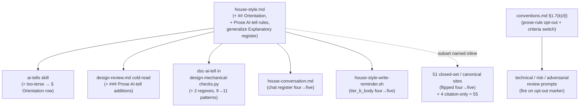

# Explanation-style enforcement — Architecture Decision Record

## Summary

The house style (`.claude/output-styles/house-style.md`, the single declarative
source for the repo's writing rules) had two prose-quality gaps that no enforcer
closed. Sentence-level over-dense AI-tells (run-on mechanism traces, lists spliced
into one sentence, inflated-abstraction labels) fell between the design cold-read,
which checks comprehension and document shape, and the `dsc-ai-tell` mechanical
check, a narrow regex set in `design-mechanical-checks.py`. And no always-on rule
caught the opposite failure: prose too terse to follow without opening the code.

This change closes both (YTDB-1084 for the over-dense axis, YTDB-1106 for the
too-terse floor). It adds a top-level `## Orientation` rule to the house style and
makes it the fifth member of the always-on **AI-tell subset** — the set of
house-style sections that apply at chat scale and at code-comment scale, not only
to full Markdown. It adds a `### Prose AI-tell additions` block to the design
cold-read and two regexes to `dsc-ai-tell` for the over-dense axis. The subset
four→five bump is propagated atomically across every site that names it as a
closed set. And it amends `conventions.md §1.7` with a prose-rule
self-application opt-out that let the branch edit the workflow rules **live**, so
the new rules held the branch's own design, tracks, and chat during the work
instead of being staged away until merge.

## Goals

- **Add the too-terse floor (YTDB-1106).** An always-on `## Orientation` rule:
  prose a reader cannot follow without opening the code is too terse, a finding
  the same as padding. Achieved.
- **Enforce the over-dense AI-tells (YTDB-1084).** A judgment-layer cold-read
  block for the cases regex cannot catch, plus two regexes for the
  cleanly-detectable cases. Achieved.
- **Make Orientation the fifth subset member everywhere.** Flip every closed-set
  enumeration four→five, atomically, so the branch's own consistency review never
  observes a four-vs-five window. Achieved across the 55-file grep universe.
- **Self-apply the new rules during the branch.** Edit the rules live rather than
  stage them, so the branch's own authoring is held to them. Achieved via the
  `§1.7` opt-out.

No goal was descoped. The one goal that changed shape during execution was the
subset-flip count: the issue estimated roughly ten sites, the as-built inventory
is 55 (see Key Discoveries).

## Constraints

- **Atomic subset flip.** The four→five flip lands inside one track with the
  four-vs-five window closed before that track's Phase C, or `review-workflow-consistency`
  (which reads cross-file, beyond the diff) flags the inconsistency the branch
  created deliberately. Held.
- **Demotable regex severity with a zero-finding calibration.** The two new
  regexes ship at `should-fix` (the rule's documented demotable severity);
  `dsc-ai-tell` has no blocker path. The calibration contract is zero findings of
  any severity from the two patterns on this branch's own design authoring,
  verified live in Phase 4. Held.
- **Judgment-layer-only opt-out.** The `§1.7` opt-out covers style rules, review
  criteria, prompt blurbs, and reviewer blocks. It changes no `_workflow/**`
  artifact schema; execution-procedure files stay staged. Held.
- **Mandatory stamp-advance.** Committing live `.claude/workflow|skills|agents`
  edits advances HEAD past the artifacts' stamp base, so the drift gate fires
  each session. After the last workflow-editing commit, `/migrate-workflow`
  re-armed the gate (a no-op replay over prose-only commits that reduced to a
  stamp-to-HEAD advance). Done.

## Architecture Notes

### Component Map

`house-style.md` is the one rule source. Four readers consume it without
restating the rules; a wider set of files restate the AI-tell subset's section
names inline; the hook and two tests pin the subset list.

### Decision Records

#### D1: Faithful full sync of the subset enumeration

Flip every site that names the AI-tell subset as a closed set to five, rather than
centralize the enumeration or update only the issue-named sites. Matches the
project's "the canonical subset moves together" discipline. The inline copies
exist for per-spawn self-containedness (a sub-agent reads its blurb without
opening another file), so centralizing would trade that for a per-spawn file read
across the review agents. **As built:** the flip touched the closed-set
enumeration sites and canonical carriers across a 55-file grep universe; the count
bump is semantic, not numeric (below). Landed atomically with the window closed
before Phase C.

#### D2: Orientation joins both subset tiers (chat + code-comment)

`## Orientation` joins both surfaces the subset governs: chat-scale prose (the
chat blurbs plus `house-conversation.md`) and `*.java`/`*.kt` code comments (the
`conventions.md §1.5` Tier-B row plus the `house-style-write-reminder.sh` hook),
rather than chat only. A Javadoc reader has the code open by definition, so the
literal "too terse to follow without opening the code" test does not transfer; the
code-comment surface carries a restated criterion — rationale comments must not
assume context outside the file (distant call-site behavior, issue history,
reviewer-thread knowledge) and must gloss the project-specific entity the
rationale turns on. **As built:** the Tier-B row and the hook `tier_b_body` carry
Orientation; the restatement lives in `§1.5` prose adjacent to the table, not in
the table cell.

#### D3: Generalize § Explanatory register into ## Orientation

`## Orientation` becomes the single always-on statement; the prior design-only
`### Explanatory register` reduces to a design-specific specialization that
cross-links up, keeping only its mechanism-overview nuance and the
mid-level-reader completeness bar. One general rule plus one specialization that
points at it is maintainable; two parallel statements drift. **As built:** three
reconciliations landed together so `house-style.md` stays self-consistent — the
document-shape scoping sentence was rewritten so `## Orientation` is not excluded
from issue/PR/status prose, `## Orientation` got its own finding category (the
prior rule cited a design-only section), and the Self-check entry moved to an
always-on item.

#### D4: New cold-read block runs for design AND tracks

The `### Prose AI-tell additions` block runs for both `target=design` (the
phase1-creation / phase4-creation / design-sync cold-reads) and `target=tracks`
(the Step-4b track cold-read), because track prose carries the same over-dense /
too-terse failure as design prose at creation time. **As built:** the block needs
its own applies-to line (it cannot copy the sibling Human-reader block's
design-kinds-only line) and an activation pointer at each cold-read invocation
site for both targets — an applies-to line without the pointers leaves the block
defined-but-never-run. The block's claim is bounded to creation-time prose; live
Phase-3 prose (decision-log entries, episodes, review findings) is held by the
always-on subset wiring on the writers, not by this block.

#### D4b: Two dsc-ai-tell regexes

`dsc-ai-tell` gains `INFLATED_ABSTRACTION_LABEL_RE` (subject-slot
inflated-abstraction labels) and `NEGATIVE_PARALLELISM_TRAILING_RE` (the
trailing-negation variant of negative parallelism), citing the existing
`§ Banned analysis patterns` and `§ Banned sentence patterns` — this change adds
no new rule text. **As built:** both narrowed during implementation to hold the
calibration corpus at zero. The trailing-negation regex matches only the
emphatic-intensifier form ("X, not just/merely/simply Y"); a plain contrast ("the
count bump is semantic, not numeric") passes. The inflated-abstraction regex
matches a curated closed inflation set, not an open participle arm that
self-flagged concrete-mechanism prose; it skips the `## Overview` section so a
conforming design Overview's sanctioned "the enabling primitive(s)" enumeration
does not self-flag. The pattern count moved nine→eleven in the rule documentation
and the in-file docstring.

#### D5: No staging — live-edit all surfaces

Edit the rules live rather than stage them. The change alters prose rules, prompt
text, one reviewer block, and one regex set; it changes no `_workflow/**` artifact
schema, so the destabilize-the-branch's-own-machinery hazard `§1.7` staging guards
against does not exist. The largest surfaces (`house-style.md`,
`house-conversation.md`, `design-mechanical-checks.py`) sit outside `§1.7`'s
covered prefixes already, so partial staging buys neither isolation nor
self-application. The two new regexes ship demotable. **As built:** the
stamp-advance ran end-of-branch via `/migrate-workflow`, re-arming the drift gate.

#### D6: Amend §1.7 with a prose-rule self-application opt-out

Authorize the live edit by amending `§1.7` with a **distinct opt-out marker** (not
the workflow-modifying marker), pinned with the case-sensitive stable prefix
`This plan uses the §1.7 prose-rule self-application opt-out:`. The
workflow-modifying marker switches on two roles — the staging mechanism (where
edits land) and the reviewer-criteria re-pointing (whether Phase-3A reviews read
references as workflow paths/anchors or as Java symbols). The opt-out disables the
first and keeps the second. With the workflow-modifying marker absent, every
staging consumer already defaults to live, so the staging half needs no consumer
edits and there is no bootstrap deadlock. **As built:** the only rewiring extended
three Phase-3A criteria-switch blocks (`technical-review.md`, `risk-review.md`,
`adversarial-review.md`) to fire on the opt-out marker as well. The amendment and
the extensions landed in the branch's first workflow-editing commit; because that
track's own Phase-A review trio ran before the commit landed, the load-bearing
instruction also lived in the plan's `### Constraints` opt-out note, which
re-points the review criteria in-plan. The opt-out criteria are consumer class,
not intent: no `_workflow/**` schema change, and every edited file's consumer is
judgment-layer.

### Invariants & Contracts

- **No four-of-five enumeration survives.** After the flip, no site enumerates the
  subset as four-of-five. The governance grep (`grep -rln` of the four
  banned-section names) returns 55 files; a separate anchored `## Orientation`-presence
  check confirms every closed-set enumeration names the fifth section. The
  presence check is anchored (`## ` prefix), never bare `Orientation`, which
  collides with `## Context and Orientation` headings.
- **Demotable-calibration contract.** Running `edit-design` on this branch's own
  `design-final.md` produces zero findings of any severity from the two new
  regexes. Verified live in Phase 4.
- **Hook body length budget.** Each reminder body stays ≤500 chars and the
  concatenation ≤1500, now guarded by a test (the hook comment previously claimed
  this without any test asserting it).

### Non-Goals

- Centralizing the inline subset enumeration into one canonical list (D1 rejected
  this as scope expansion that trades per-spawn self-containedness for a per-spawn
  file read).
- New rule text for the over-dense patterns: the regexes and the cold-read block
  cite existing `house-style.md` sections; they add enforcement, not rules.
- Touching any `_workflow/**` artifact schema: the opt-out's first criterion
  forbids it.

## Key Discoveries

- **The blast radius was roughly five times the issue's estimate, and
  hand-maintained.** As built, 55 files name a subset section; there is no
  generator (`workflow-reindex.py` rebuilds the TOC and stamps only; the hook is
  the one file that holds blurb text as a string). The sync was a hand edit across
  the universe.
- **The count bump is semantic, not numeric.** "Five banned-section slugs" is
  false — `## Orientation` is a positive floor, not a ban. The blurb was reworded
  once, canonically, and pasted byte-identically; the chat blurb took a
  find/replace pair rather than a pure append, which would double the "and."
- **A plain "X, not Y" is not a usable AI-tell signal.** It fires on legitimate
  contrast ("a defensive guard, not dead code"). The regex narrowed to the
  emphatic-intensifier form ("not just/merely/simply"); a probe for that form
  returns zero across the branch's design and the calibration ADRs.
- **An open participle arm over-matches concrete-mechanism prose.** The
  inflated-abstraction regex's first form, an open `[a-z]+ing`/`[a-z]+ed` arm
  crossed with concrete nouns, self-flagged sentences like "The locking mechanism
  is held…". It was replaced with a curated closed inflation set. A future genuine
  inflation word must be added to the set to fire — the intended trade: a missed
  tell is foregone review noise, a false positive is avoided review noise.
- **A cold-read block needs activation, not just declaration.** An applies-to line
  alone leaves a block defined-but-never-run; it needs an activation pointer at
  each cold-read invocation site. It also needs an output emit slot, or its
  findings have nowhere to land (the slot was added during track review, with an
  `over-dense:`/`too-terse:` prefix covering both `target=design` and
  `target=tracks`).
- **A documented cap was unguarded.** The hook's comment claimed its 500-char
  per-body cap was "validated by the test runner," but no test asserted any length
  budget and the body had already overrun it. A length-budget test now makes the
  comment true and guards future growth.
- **The governance grep counts pointer sites, not subset membership.** It stays
  keyed on the original four strings; `## Orientation` is added to a rename-enumeration
  grep only in the anchored form. The grep returning 55 files is the pointer
  universe; the four-of-five presence check is the separate membership assertion.

## Adversarial gate verdicts

Under the relocated decision/assumption challenge (D6), the pre-code adversarial
review ran as a gate on the research log at the Phase 0 → 1 boundary, not as a
per-mutation pass. The gate looped to clear:

| Iteration | Verdict | Blocker | Should-fix | Suggestion |
|---|---|---|---|---|
| 1 | NEEDS REVISION | 1 | 5 | 3 |
| 2 | NEEDS REVISION | 0 | 3 | 1 |
| 3 | NEEDS REVISION | 0 | 2 | 1 |
| 4 | PASS | 0 | 0 | — |

The initial blocker and every should-fix were resolved before the gate cleared at
iteration 4; suggestions do not gate. The design decisions seeded into `design.md`
had therefore survived challenge on the log before any code landed.

## Token usage telemetry

Snapshot from this worktree's sessions over its lifetime (N=12 sessions across 63 transcripts).

### Tool mix — share of total session context

| Component             | Share |
|-----------------------|------:|
| `Read` tool results   | 64.8% |
| `Bash` tool results   | 13.8% |
| `Grep` tool results   | 0.0% |
| `Edit` tool results   | 0.4% |
| Other tool results    | 1.9% |
| Prompts and output    | 19.1% |

### Top files by share of `Read` token consumption

| File                                            | Share of Read |
|-------------------------------------------------|--------------:|
| <outside-worktree>                              | 21.2% |
| docs/adr/explanation-style/_workflow/plan/track-1.md | 8.6% |
| .claude/workflow/implementer-rules.md           | 8.4% |
| docs/adr/explanation-style/_workflow/plan/track-2.md | 5.1% |
| .claude/workflow/prompts/design-review.md       | 4.0% |
| docs/adr/explanation-style/_workflow/implementation-plan.md | 4.0% |
| .claude/scripts/design-mechanical-checks.py     | 3.5% |
| .claude/workflow/prompts/adversarial-review.md  | 3.4% |
| .claude/output-styles/house-style.md            | 3.3% |
| .claude/workflow/self-improvement-reflection.md | 2.9% |

Generated by `.claude/scripts/measure-read-share.py` against
`~/.claude/projects/-home-andrii0lomakin-Projects-ytdb-explanation-style/`.
