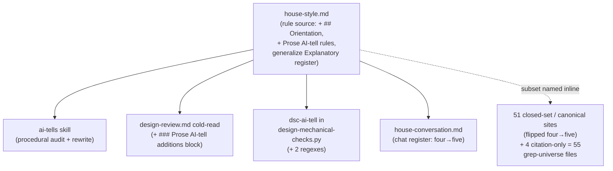
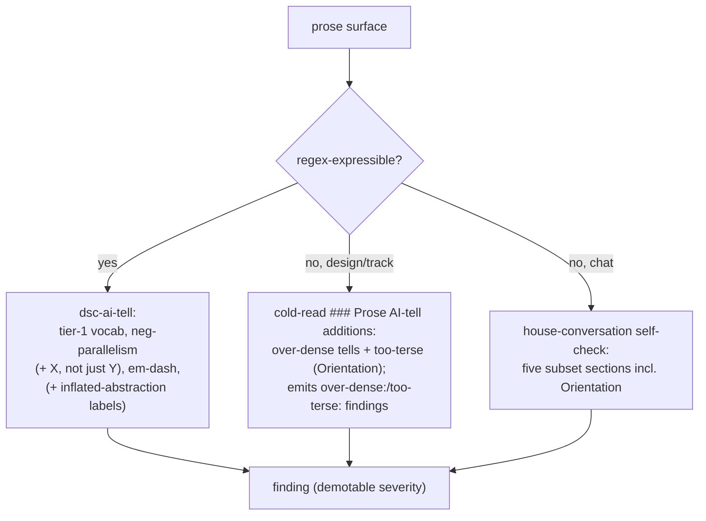

# Explanation-style enforcement — Design

## Overview

The house style (`.claude/output-styles/house-style.md`, the single declarative
source for the repo's writing rules) had two prose-quality gaps that no enforcer
closed. The sentence-level over-dense AI-tells (run-on mechanism traces, lists
spliced into one sentence, inflated-abstraction labels) fell between the design
cold-read (which checks comprehension and document shape) and the `dsc-ai-tell`
mechanical check (a narrow regex set in `design-mechanical-checks.py`), so they
passed clean. And there was no always-on rule against the opposite failure: prose
too terse to follow without opening the code.

This change closed both. It adds a top-level `## Orientation` rule to the house
style (the too-terse floor) and a `### Prose AI-tell additions` reviewer block to
the design cold-read (the over-dense enforcer), backed by two new regexes in
`dsc-ai-tell`. The orientation rule joins the **always-on AI-tell subset** (the
set of house-style sections that apply at chat scale and at code-comment scale),
so the canonical four-name subset became five.

The enabling primitives are the `## Orientation` rule text (which encodes a
register distinction, not "write more") and a new `§1.7` opt-out marker that let
this branch edit the workflow rules **live** and have them self-apply, instead of
staging them away until merge. Two existing things were restructured to fit: the
design-only `### Explanatory register` rule generalized up into `## Orientation`,
and the three Phase-3A review prompts gained a marker condition so a live-edit
prose branch still gets prose-criteria reviews. The reader is a maintainer of the
`.claude/` workflow machinery.

The rest of this document is structured as: Core Concepts → Enforcement surface
map → How a prose finding is produced → then four topic sections, one per
decision cluster (the Orientation rule, over-dense enforcement, the subset sync,
and the `§1.7` opt-out).

## Core Concepts

This design turns on five load-bearing ideas. Each is named here and used
without re-definition below.

**AI-tell subset.** The set of house-style sections that apply not only to full
Markdown but also at chat scale (terminal replies) and code-comment scale
(Javadoc rationale). It was four sections (`## Banned vocabulary`,
`## Banned sentence patterns`, `## Banned analysis patterns`,
`### Em-dash discipline`); this change made it five. Replaces the implicit
"these four move together" with an explicit five. → The §1.7 opt-out, Subset sync.

**The two prose-failure axes.** Over-dense prose (too much scaffolding: run-on
traces, inflated labels) and too-terse prose (too little orientation: bare
symbols, no gloss). They are opposite failures on one axis. YTDB-1084 enforces
the first; YTDB-1106 adds the floor for the second. Replaces the prior one-sided
enforcement (only padding was checked). → The Orientation rule, Over-dense prose
enforcement.

**Orientation register vs registry-terse.** A surface a human reads cold (chat,
issue bodies, design mechanism sections) carries its orientation in the text —
gloss each entity, linearize each causal chain. A registry surface (a decision
log, a research log) stays terse by design and pushes recurring entities into a
shared vocabulary block. The Orientation rule describes this relationship rather
than forcing every surface to expand. Replaces the absent floor with one that
does not contradict the bias-toward-less-text rule. → The Orientation rule.

**The §1.7 prose-rule opt-out marker.** A `### Constraints` marker, distinct from
the existing workflow-modifying marker, that lets a plan editing only
judgment-layer workflow prose skip the `§1.7` staging mechanism and edit live, so
the rules self-apply during the branch. Replaces the all-or-nothing "stage every
workflow edit" rule with a scoped opt-out. → The §1.7 opt-out.

**The marker's two roles.** The existing workflow-modifying marker switches on
both the staging mechanism (where edits land) and the reviewer-criteria
re-pointing (whether Phase-3A reviews read prose references as paths/anchors or as
Java symbols). The opt-out disables the first and keeps the second.
→ The §1.7 opt-out.

## Enforcement surface map

**TL;DR.** `house-style.md` is the one rule source; four readers consume it
without restating the rules, and a wider set of files restate the AI-tell
subset's section names inline. This change touched the rule source and every
consumer that names the subset as a closed set.

The rule source gained the new section and rule text; the four named readers each
adopted the fifth subset member in their own form; the inline copies took the
canonical reworded blurb (Subset sync). The dashed edge marks restatement, not
consumption — the duplication the Subset sync section confronts. The `dsc-ai-tell`
reader straddles the two: it consumes the rules as regexes and, because the new
cold-read block cites `§ Banned analysis patterns`, the design-review prompt also
joined the inline grep universe as the 55th file (a citation, not a closed-set
enumeration, so never a flip target).

### Edge cases / Gotchas

- The four named readers are not symmetric: the cold-read got a new judgment
  block, `dsc-ai-tell` got regexes, the chat register got a list item, the
  `ai-tells` skill got a catalogue row.
- The grep universe (`grep -rln` of the four banned-section names over
  `.claude/` and `CLAUDE.md`) is 55 files as-built. Four of those cite individual
  `§` section names rather than the four/five-name closed set, so they were never
  flip targets: `review-workflow-writing-style.md`, `design-mechanical-checks.py`,
  `design-document-rules.md`, and the design-review prompt that joined last.

### Decisions & invariants

- D-records: D1 (Subset sync), D2 (Orientation tiers), D3 (Explanatory-register
  generalization), D4 (cold-read block). See `adr.md` § Decision Records.

## How a prose finding is produced

**TL;DR.** A prose surface is checked by whichever enforcer covers it: the
mechanical regex catches the regex-expressible tells, the cold-read judges the
rest at design and track creation, and the chat self-check covers terminal
replies. Over-dense and too-terse are both in scope after this change.

The mechanical path stays regex-only and demotable. The cold-read path is the
judgment layer for both failure axes and writes its findings into the review
output under an `over-dense:` or `too-terse:` prefix. The chat path is
self-applied per the house-conversation register.

### Edge cases / Gotchas

- A registry surface (decision log, research log) is terse by design; the
  Orientation rule's anti-padding clause and shared-vocabulary escape keep it
  from being flagged for terseness.
- The cold-read block runs at creation only. Track prose written after the
  Step-4b cold-read (live decision-log entries, episodes, review findings) is
  held by the always-on subset wiring on the writers, not by this block.

### Decisions & invariants

- D-records: D2 (Orientation tiers), D4 (cold-read block, both targets). See
  `adr.md` § Decision Records.

## The Orientation rule

**TL;DR.** A top-level `## Orientation` section in `house-style.md`
(`house-style.md:54`) sets the floor the cut-rules cut to: prose a reader cannot
follow without opening the code is too terse, a finding the same as padding. It
joins the always-on AI-tell subset and generalizes the prior design-only
`### Explanatory register`.

The rule text follows the YTDB-1106 proposal. The reader is the house-style
`§ Voice and tone` reader: general Java/DB assumed, everything YouTrackDB-specific
glossed. It names three moves:

- lead with the plain claim;
- gloss each project-specific entity once at first use;
- linearize a causal chain, one link per sentence.

An anti-padding clause bounds those moves: the added words must be a definition
the reader needs or a causal link they would otherwise reconstruct from code,
never a hedge or restatement. The YTDB-1106 worked exemplar (a decision-log
re-explanation) is the rule's positive model.

The rule encodes a **register distinction** (Core Concepts): orientation register
for cold-read surfaces, registry-terse for decision/research logs that define
recurring entities once in a shared vocabulary block. Without this the rule would
read as "write more" and contradict `§ Voice and tone`'s bias toward less text.

**Two-tier membership (D2).** The rule joins both surfaces the subset governs:
chat-scale prose (the chat blurbs plus `house-conversation.md`) and `*.java`/`*.kt`
code comments (the `conventions.md §1.5` Tier-B row plus the
`house-style-write-reminder.sh` hook). A Javadoc reader has the code open by
definition, so the literal "open the code" test does not transfer; the
code-comment surface gets a restated criterion — rationale comments must not
assume context **outside the file** (distant call-site behavior, issue history,
reviewer-thread knowledge) and must gloss the project-specific entity the
rationale turns on.

**Generalization (D3).** `## Orientation` became the single always-on statement;
`### Explanatory register` (`house-style.md:451`, under `## Document-shape rules`,
design/ADR only) reduced to a design-specific specialization that cross-links up,
keeping only its mechanism-overview-section nuance and the mid-level-reader
completeness bar. Three reconciliations made the file self-consistent: the
document-shape scoping sentence was rewritten so `## Orientation` is not excluded
from issue/PR/status prose; `## Orientation` got its own finding category (the
prior rule cited `§ Why-before-what`, a design-only section); and the Self-check
entry moved out of item 8's "design/ADR only" bracket into an always-on item.

### Edge cases / Gotchas

- The anti-padding clause is load-bearing: without it the rule is abusable as
  license to pad, which `§ Voice and tone` forbids.
- The code-comment restatement must not read as "add tutorial comments" — it
  bans out-of-file assumptions, not in-file terseness.

### Decisions & invariants

- D-records: D2 (two-tier membership plus code-comment restatement), D3
  (generalize `### Explanatory register`, the three-edit reconciliation set). See
  `adr.md` § Decision Records.

## Over-dense prose enforcement

**TL;DR.** Two additions enforce the over-dense AI-tells YTDB-1084 names: a
judgment-layer `### Prose AI-tell additions` block in the design cold-read
(`design-review.md:186`), and two regex additions to `dsc-ai-tell` for the
cleanly-detectable cases. Both ship at demotable `should-fix` severity.

The cold-read block sits sibling to `### Human-reader cold-read additions` and
instructs the reviewer to scan the changed sections against
`§ Banned analysis patterns`, `§ Mechanism traces and inline citations`,
lists-disguised-as-sentences, and inflated-abstraction labels — the judgment
cases regex cannot catch. It also scans the too-terse direction (the Orientation
rule), so one block covers both axes. The block carries its own applies-to line
(it cannot copy the sibling block's design-kinds-only line) and an activation
pointer at each cold-read invocation site for `target=design` (the three design
kinds) and `target=tracks`; an applies-to line without the pointers leaves the
block defined-but-never-run. Its findings land in the review output under an
`over-dense:` or `too-terse:` prefix, the emit slot added during track review.

**Regex additions (YTDB-1084 scope; severity per D5).** `dsc-ai-tell` gained
`INFLATED_ABSTRACTION_LABEL_RE` (the inflated-abstraction labels: "the enabling
primitive", "the key abstraction", "the underlying mechanism", and the
participle-plus-category-noun shape) and `NEGATIVE_PARALLELISM_TRAILING_RE` (the
trailing-negation variant of negative parallelism). Both ship at the rule's
documented demotable `should-fix` severity; `dsc-ai-tell` has no blocker path, so
a false positive pollutes a review with a spurious `should-fix` rather than
halting `edit-design`. The pattern count in the rule's documentation and in-file
docstring moved nine→eleven.

**Realized regex forms.** Both patterns narrowed during implementation to hold
the calibration corpus at zero findings. The trailing-negation regex matches
**only** the emphatic-intensifier form ("X, not just/merely/simply Y") — the
"not just A" half of the canonical "Not just A, but B." A plain trailing contrast
("the count bump is semantic, not numeric") is ordinary prose and passes. The
inflated-abstraction regex matches a **curated closed inflation set** (the
participles plus the inflated adjectives), not an open `[a-z]+ing`/`[a-z]+ed`
participle arm; the open arm self-flagged concrete-mechanism prose like "The
locking mechanism is held…", so it was removed. A future genuine inflation word
will not fire until added to the set.

### Edge cases / Gotchas

- The `### Prose AI-tell additions` block syncs the design-review TOC row and a
  `§ Tone and depth` reviewer-tone clause, and extends the design-review entry of
  the `readability-feedback` Rule sync map. The "five Human-reader rules" count
  stays five — the new block gets its own evidence-tone clause, not a count bump.
- `## Orientation` is judgment-layer only — no `dsc-ai-tell` change is needed for
  the too-terse direction.
- The inflated-abstraction-label regex collides with the design-doc Overview
  template, which prescribes naming "the enabling primitive(s)"
  (`design-document-rules.md § Overview`). The regex skips the `## Overview`
  section and targets the subject-slot inflated label, so a conforming design
  Overview does not self-flag.
- This document is the live calibration target. Running `edit-design` on it in
  Phase 4 produces zero findings of any severity from the two new regexes — the
  real demotable-calibration contract, since `dsc-ai-tell` has no blocker path.

### Decisions & invariants

- D-records: D4 (cold-read block, both targets, applies-to and activation
  asymmetry); D4b (the two regexes, the Overview-template collision, the
  closed-set realization, the demotable calibration); D5 (the regexes ship at
  the documented demotable severity). See `adr.md` § Decision Records.

## Subset sync across the naming sites

**TL;DR.** Making the subset five meant editing every file that enumerated the
four-name set; the count bump is semantic, not numeric, and it had to land
atomically so the branch's own consistency review did not flag a four-vs-five
window.

The inventory is pinned at 55 files: the `grep -rln` governance universe of the
four banned-section names over `.claude/` and `CLAUDE.md`. It partitions as:

| Category | Files |
|---|---|
| Banned-slug blurb (28 byte-identical single-line paste + 2 wrapped hand-edits) | 30 |
| Chat "AI-tell subset of" blurb (10 find/replace + 1 wrapped hand-edit) | 11 |
| Canonical carriers, the hook, two tests, the `ai-tells` catalogue, two governance greps, and two wrapped/variant closed-set hand-edits | 10 |
| Citation-only (cite individual `§` sections; never flip targets) | 4 |
| **Total (governance grep)** | **55** |

The 51 non-citation rows are the flip targets and the canonical rule carriers
(`house-style.md`, `house-conversation.md`, `conventions.md §1.5`). The four
citation-only rows (`review-workflow-writing-style.md`,
`design-mechanical-checks.py`, `design-document-rules.md`, and the design-review
prompt that joined the universe last) name individual `§` sections rather than
the closed set, so they were never flipped.

**Semantic count bump (D1).** "Five banned-section slugs" would be false:
`## Orientation` is a positive floor, not a ban. The banned-slug blurb was
reworded once, canonically, to *"the five AI-tell subset section slugs to apply
are `## Banned vocabulary`, `## Banned sentence patterns`, `## Banned analysis
patterns`, `### Em-dash discipline`, and `## Orientation`."* It was pasted
byte-identically at the 28 single-line sites; the two banned-slug sites that wrap
across lines were hand-fitted to the same wording. The 11 chat-blurb sites took a
find/replace pair (not a pure append, which would double the "and"), with the one
that wraps across lines hand-fitted; the two governance greps gained `Orientation`
in the anchored `## Orientation` form so future audits enumerate the fifth
section.

**Atomic sync (D1).** The edits landed inside a single track with the
four-vs-five window closed before that track's Phase C — otherwise
`review-workflow-consistency` (which reads cross-file, beyond the diff) flags the
inconsistency the branch created deliberately. Faithful full sync beat
centralizing the enumeration: the inline copies exist for per-spawn
self-containedness (a sub-agent reads its blurb without opening another file), so
centralizing trades that for a per-spawn file read.

### Edge cases / Gotchas

- The paste-vs-hand-edit axis is whether the literal is line-wrapped, not which
  grep bucket the site falls in. Five sites took the reworded sentence adapted to
  context instead of the byte-identical paste: two narrow-grep-miss sites, one
  hard-wrapped chat blurb, and two banned-slug blurbs whose literal wraps across
  lines.
- `test_house_style_hook.py` pins the subset section-name list, so it gates the
  sync's correctness for the hook; it landed with the hook edit in the same
  commit.
- The `ai-tells` catalogue gained a too-terse-fingerprint → `§ Orientation` row.
  That file is a fingerprint→section map, not a closed-set enumeration, so the
  edit is a new row, not a four→five flip.

### Decisions & invariants

- D-records: D1 (faithful full sync, atomic, the canonical reworded blurb). See
  `adr.md` § Decision Records.

## The §1.7 opt-out

**TL;DR.** The branch edited the workflow rules **live** (no staging) so they
self-apply, authorized by a new `§1.7` opt-out clause this branch carries
(`conventions.md §1.7(k)`/`(l)`). The opt-out disables only the staging
mechanism, keeps reviewer-criteria re-pointing on, and is bounded to
judgment-layer edits with a mandatory stamp-advance.

**Why live-edit, not staging (D5).** This change altered prose rules, prompt
text, one reviewer block, and one regex set — it changed no `_workflow/**`
artifact schema, so the destabilize-the-branch's-own-machinery hazard `§1.7`
staging guards against did not exist. The largest surfaces (`house-style.md`,
`house-conversation.md`, `design-mechanical-checks.py`) sit outside `§1.7`'s
covered prefixes already, so partial staging would buy neither isolation nor
self-application. Self-application was the goal: the branch's own design, tracks,
and chat were held to the new rules during the branch.

**The opt-out clause (D6).** The prior `§1.7(b)`/`(h)` bound this branch to stage;
the legitimacy came from amending `§1.7`, not from claiming an opt-out that did
not exist. The amendment was chosen for the lowest surface: the plan carries a
**distinct opt-out marker** (not the workflow-modifying marker), with the pinned
case-sensitive stable prefix `This plan uses the §1.7 prose-rule self-application
opt-out:`, so every staging-mechanism consumer defaults to live with no edits and
no bootstrap deadlock. The only rewiring extended the **three** Phase-3A
criteria-switch blocks (`technical-review.md`, `risk-review.md`,
`adversarial-review.md`) to fire on the opt-out marker too, keeping
prose-criteria reviews on for this all-prose branch. The opt-out covers only
**judgment-layer** edits (style rules, review criteria, prompt blurbs, reviewer
blocks); execution-procedure files stay staged. It records a **mandatory
stamp-advance** (run `/migrate-workflow` after the last workflow-editing commit)
so the drift gate re-arms for real develop drift instead of being suppressed every
session.

**Landing order and in-plan re-pointing (D6).** The amendment and the three
criteria-switch extensions landed in the branch's first workflow-editing commit.
That track's own Phase-A review trio ran before the commit landed, so the
load-bearing instruction also lived in the plan's `### Constraints` opt-out note,
which every reviewer reads: it acknowledges the staging deviation and re-points
the review criteria in-plan (treat references as workflow paths/anchors, apply the
five prose criteria). The prompt-file extensions then serve future opt-out
branches.

### Edge cases / Gotchas

- Until the amendment landed, the `### Constraints` note was self-justifying
  (it cited the in-flight amendment) so a reviewer reading unamended `§1.7` saw an
  acknowledged deviation, not a phantom reference.
- The opt-out clause self-applies once its first commit lands, since the branch
  reads its own amended `§1.7` thereafter.
- The stamp-advance ran end-of-branch: `/migrate-workflow` replayed over the
  prose-only commits and reduced to advancing every artifact stamp to HEAD, which
  re-armed the drift gate.

### Decisions & invariants

- D-records: D5 (live-edit substance, stamp-advance, demotable regex), D6 (the
  `§1.7` opt-out marker shape, three criteria-switch extensions, consumer-class
  criterion, landing order, in-plan re-pointing). See `adr.md` § Decision Records.
