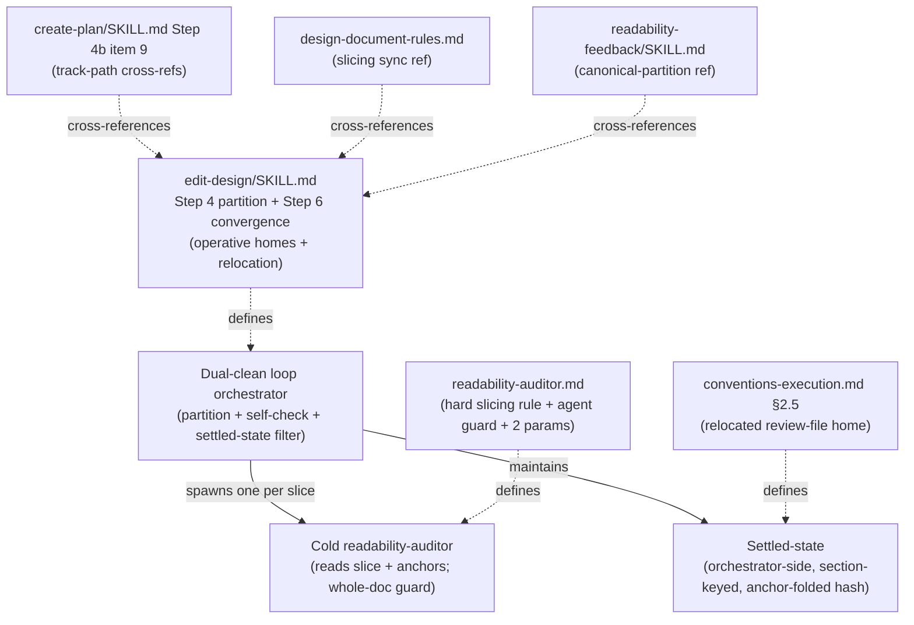

# Harden readability-auditor slicing and convergence — Architecture Decision Record

## Summary

The in-loop `readability-auditor` — the cold sub-agent that reads a slice of a
`design.md` or track file with no prior context and reports every passage a
mid-level developer cannot follow — had two defects on the design path. Its
fan-out was unenforced: the orchestrator was told the auditor "is range-sliced"
but given no partition rule, no slice count, and no floor, so it could run a
single whole-doc spawn over a 700-line document and read each passage too
shallowly to catch real findings. And the auditor was a stateless cold spawn
every round, so the dual-clean review loop re-rolled already-settled prose past a
fresh reader each round and oscillated instead of converging (measured finding
counts ran 13 → 8 → 3 → 8, with one slice swinging 0 → 5 on byte-identical prose).

This change hardens the loop in three parts, shipped as one staged workflow-prose
diff across six files. It makes the design-path slice partition a **deterministic
orchestrator obligation** (≈200-line windows on `##` / `# Part` boundaries, capped
at ≈6, one auditor per window, with a hard floor against a single whole-doc slice
above 300 lines) plus an agent-side guard that flags a collapse-to-one-slice as a
wiring error. It adds **orchestrator-side section-keyed settled-state** that drops
re-flags on unchanged settled sections while the auditor stays fully cold. And it
**relocates** every Phase-1 authoring-loop params and review file from
`_workflow/plan/` into `_workflow/reviews/`, leaving `plan/` holding only
`track-N.md` artifacts.

## Goals

- **Stop under-catching on long documents.** An orchestrator reading the spawn
  instruction must have an exact slice count to produce and a self-check to assert
  against — with no way to read it as permitting one whole-doc slice over a long
  doc. (Met.)
- **Make a collapsed fan-out detectable, not silent.** A collapse-to-one-slice
  must surface as a wiring error even if the orchestrator's own self-check is
  bypassed. (Met, via the agent-side guard.)
- **Make the loop converge.** A settled, unchanged section must have its re-flags
  dropped, so the measured clean→dirty oscillation cannot recur on byte-identical
  prose; the never-clean dense-but-acceptable tail must terminate through the
  existing budget + escalation path. (Met.)
- **Keep the cold-read guarantee intact.** The auditor must receive no
  settled-state and read no research log; the new spawn params must carry only
  slicing metadata constant across the fan-out. (Met.)
- **Declutter `plan/`.** Every authoring-loop params and review file must live
  under `_workflow/reviews/`, leaving `plan/` for `track-N.md` only. (Met.)
- **No drift across the sibling files.** Window size, cap, and the convergence
  rule must have one source of truth, cross-referenced rather than restated. (Met.)

## Constraints

- **No new scripts or agents.** The whole change is workflow prose. The "verifiable
  spawn count" requirement is satisfied by a stated orchestrator obligation
  (compute the expected count, self-check the spawned count) rather than a helper
  script — the originating issue explicitly accepts that alternative. Correctness
  is established by spec inspection and the workflow reviewers, not by a unit test.
- **Staging (I6).** This is a workflow-modifying branch, so every edit lands under
  `_workflow/staged-workflow/.claude/...`; the live tree stays at develop-state
  until a single Phase-4 promotion commit copies the staged subtree live. The
  branch's own planning and review phases run the unmodified live loop — it cannot
  exercise its own fix during its own authoring.
- **One prose owner per surface (S4).** The readability auditor remains the sole
  owner of the prose AI-tell axis; the de-warmed comprehension gate runs no prose
  axis. The change introduces no second prose owner.

## Architecture Notes

### Component Map

The change touches one control-flow protocol — the dual-clean review-iteration
loop — and the files that describe it. The orchestrator and the cold auditor are
the runtime components; the six files are where the rules live.

- **edit-design/SKILL.md** — the operative home: Step 4 carries the partition
  algorithm, the expected-slice-count self-check, the two new spawn params, and the
  relocated params home; Step 6 carries the canonical convergence-mechanism
  statement and the relocated resume round-count glob.
- **readability-auditor.md** — the agent: "Range-sliced fan-out" became a hard
  requirement plus the whole-doc guard, fed by two new params (`slice_count`,
  `total_lines`) added to its `## Inputs` block; a note that the settled-state is
  orchestrator-side and the agent receives none.
- **conventions-execution.md §2.5** — generalizes the third-scope review-file home
  to cover the whole Phase-1/Phase-4 authoring loop (the relocation target).
- **create-plan / design-document-rules / readability-feedback** — consumers that
  cross-reference the canonical homes above; no rule is duplicated.

### Decision Records

#### D1: Deterministic design-path slice partition is a prose orchestrator obligation
The design-path auditor fan-out became a mandatory deterministic prose rule, ported
from the existing `/readability-feedback` partition: split the document into ≈200-line
windows aligned on `##` / `# Part` boundaries, cap at ≈6 windows, spawn exactly one
auditor per window, and never emit a single whole-doc slice for a doc over 300 lines.
The orchestrator computes the expected slice count from values it already holds (total
line count, the ≈200-line window, the ≈6 cap), spawns exactly that many auditors, and
self-checks `slices_spawned == expected_slice_count`; on a mismatch it surfaces a wiring
error rather than proceeding with a thinned fan-out.
- **Rationale:** this is the exact partition that produced the 5-slice fan-out the
  originating issue cites as the run that caught the misses, so it is the rule with a
  demonstrated catch rather than an untested invention. Stating it as a prose
  obligation keeps the rule where the orchestrator acts and adds no machinery.
- **Alternatives rejected:** a helper script that emits the slice ranges — truly
  deterministic and would give free spawn-count verifiability, but rejected for
  lightness (prose obligation over new script-plus-test machinery, matching the track
  path's existing "one spawn per `track-N.md`" style).
- **Outcome:** implemented as planned in `edit-design` Step 4.

#### D2: File distribution and the agent-side whole-doc guard
The rule is distributed across files rather than centralized. The operative partition
algorithm lives in `edit-design` Step 4, because the orchestrator reads Step 4 when
spawning and never reads the agent's `.md` file. `readability-auditor.md` turns
"Range-sliced fan-out" from a description into a hard requirement and adds a guard: the
auditor flags a wiring error when its params say `slice_count == 1 AND total_lines > 300`.
The orchestrator's partition is the primary enforcement; the agent guard is the secondary
detector. Because the cold auditor's read-scope (S1) bars it from learning the document's
total length, the orchestrator passes `slice_count` and `total_lines` as two new params so
the guard is computable. The other three files cross-reference the shared principle
(`create-plan` Step 4b item 9 for the per-file track path, `design-document-rules.md` for
the cold-read-mechanics doc, `/readability-feedback` for the partition value only).
- **Rationale:** the algorithm must live where the orchestrator acts and the guard where
  it runs; cross-references prevent drift without duplicating the rule. The two params are
  constant across a round's fan-out — slicing metadata, not conclusions about the prose —
  so passing them cannot nudge any auditor toward a finding (S1-safe).
- **Alternatives rejected:** a single canonical home inside the agent file (the
  orchestrator never reads it); duplicating the full rule in each file (drift risk).
- **Refined during execution:** the guard is **self-gating** — it applies only when both
  params are present. See Key Discoveries. Implemented in `edit-design` Step 4 and
  `readability-auditor.md` (the guard plus the two `## Inputs` params).

#### D3: Cross-round settled-state lives entirely orchestrator-side
The auditor's cross-round state lives entirely with the orchestrator. The auditor is never
handed the settled-state and never told which sections are settled; it reads its slice plus
the standing anchors fully cold every spawn. The orchestrator holds the settled-state,
decides which sections to re-spawn, and filters the returned findings.
- **Rationale:** zero state on the agent resolves the issue's stated tension by
  construction — with nothing carried into the spawn there is no conclusion-priming, so the
  cold-read guarantee is strictly intact.
- **Alternatives rejected:** an exclusion-list-in-spawn (pass a `do_not_reflag` list into
  each later-round spawn) — primes the reader, and a per-round-varying params list
  invalidates the shared-prompt cache the fan-out relies on.
- **Outcome:** implemented as planned in `edit-design` Step 6.

#### D4: Section-keyed settled-state with an anchor-folded content hash
The settled-state is tracked per `##` / `# Part` section, keyed on section identity plus a
content hash — never on line ranges. A section is **settled** when it returned clean. Each
round, a settled and unchanged section (hash matches) has its findings dropped and its slice
may be skipped; a changed section (hash differs, or never settled) is re-audited fresh. The
hash folds in not just the section's own text but the standing anchors that exist — on
`target=design`, `## Overview` plus `## Core Concepts` when present — because the auditor
reads those anchors and resolves cross-references against them, so an anchor edit must
re-open every dependent section.
- **Rationale:** section identity survives the re-partitioning D1 introduces (a section is
  the same section whether it lands in slice 2 or slice 3 next round), so line-keyed memory
  is the wrong key. Anchor-folding closes the hole where an Overview rewrite would otherwise
  leave a section wrongly marked "settled, unchanged".
- **Alternatives rejected:** a passage-level do-not-re-flag list — a clean slice leaves no
  quotes to carry forward, so it cannot suppress the clean→dirty oscillation a section hash
  can.
- **Outcome:** implemented as planned in `edit-design` Step 6. Tolerates an absent
  `## Core Concepts` (folds in only the anchors that exist).

#### D5: The convergence fix covers both the design and track paths
The track path runs the identical defect — `create-plan` Step 4b item 9 spawns the same
`readability-auditor` agent, one cold spawn per `track-N.md` each round — so the convergence
fix (D3/D4) applies to both. The mechanism is identical; only two parameters differ: the
settled-state key (per `##` / `# Part` section on the design path; per `track-N.md` file on
the track path) and the standing-anchor set (`## Overview` + `## Core Concepts` for
`target=design`; the plan Component Map + each track's `## Purpose / Big Picture` for
`target=tracks`). The canonical mechanism is stated once in `edit-design` Step 6,
parameterized; `create-plan` Step 4b item 9 cross-references it.
- **Rationale:** the track path is the same agent and round structure, so a single canonical
  statement referenced by both paths prevents the two loops from drifting. Only the
  readability auditor needs the fix — the absorption half does not oscillate, because
  coverage-matching is near-deterministic.
- **Alternatives rejected:** fixing only the design path (leaves the track loop chasing the
  same variance); restating the full mechanism in both files (drift risk).
- **Outcome:** implemented as planned. Item 9 already carried the per-file slicing rule and
  the track-path anchors; this added only the convergence-mechanism cross-reference,
  preserving the existing per-file partition (the slicing unit stays per-file — the
  reference reads "same convergence mechanism, parameterized," never "apply the same
  partition").

#### D6: All Phase-1 authoring-loop files move to `_workflow/reviews/`
Every authoring-loop per-spawn params file (author, readability-auditor, absorption /
fidelity, comprehension) and every authoring-loop review output file moved out of
`_workflow/plan/` into the plan-scoped `_workflow/reviews/`. The "authoring loop" spans both
creation kinds — Phase-1 design/track authoring and Phase-4 design-final authoring — so the
one design-path comprehension `output_path` literal (the `phase4-creation` cold-read output)
followed the move. The design-path resume round-count glob followed the files to the new
home. After the move, `plan/` holds only `track-N.md` artifacts.
- **Rationale:** the plan-scoped `_workflow/reviews/` is chosen over the track-anchored
  `plan/track-N/reviews/` because the design path runs before any `plan/track-N/` directory
  exists and the author/comprehension spawns operate on the whole plan. `conventions-execution.md`
  §2.5 already defined that directory for the Phase-0→1 gate's files, so generalizing it is
  the smallest change that fits.
- **Alternatives rejected:** moving only the literal "auditor and comprehension" files (the
  author and absorption/fidelity files also pollute `plan/` and the resume glob reads all of
  them); adding a track-path resume glob (out of scope, a pre-existing gap orthogonal to file
  location).
- **Outcome:** implemented as planned. Two `plan/`-rooted references in `create-plan` item 9
  stay put — the author `output_path` and the absorption `draft_path` address the `track-N.md`
  artifacts, not review files — so only the per-spawn params-file home relocated. Generalizing
  §2.5 widened that section's annotation axes; see Key Discoveries.

#### D7: Tier is `full`; §1.7 routing is full staging, not the §1.7(k) prose-rule opt-out
The tier is `full` because the convergence concern is a genuine mechanism design
(section-keyed settled-state, the anchor-folded content-hash subtlety, the populate / drop
rules) that warrants a `design.md`. §1.7 routing is full staging — every edit lands under
`_workflow/staged-workflow/.claude/...` and a Phase-4 promotion commit copies it live —
rather than the §1.7(k) prose-rule opt-out.
- **Rationale:** the core edits are an executable orchestration loop, not judgment-layer
  prose, so they fail §1.7(k) criterion 2 (which names the orchestration loops). Staging is
  the safe choice regardless: editing the loop live would let the branch's own later phases
  run the half-modified loop, the destabilization staging prevents (I6).
- **Alternatives rejected:** the §1.7(k) opt-out (would gain self-application of the fixes,
  but fails criterion 2 and would destabilize the branch's own planning).
- **Outcome:** implemented as planned. Accepted consequence: the branch ran the unmodified
  live loop during its own design / track authoring and its own Phase-4 design-final
  authoring, exhibiting the old unenforced-slicing and oscillation behavior — the standard
  staging trade-off, not a regression.

#### D8: Drop calibrated holds — settled = returned-clean only; the tail is iteration_budget + S5
A section is **settled** only when it returned clean; there is no accept-as-held path. The
settled-state filter (D3/D4) still kills the dominant clean→dirty oscillation. The never-clean
tail — a section the cold auditor never returns clean on because its prose is irreducibly
dense but acceptable — never becomes settled and re-audits every round, but the loop is bounded
anyway: `iteration_budget` (default 3) caps the rounds, and on budget exhaustion with only
should-fix findings open the loop exits through the existing S5 user-is-the-gate path (apply
the cheap unambiguous fixes, surface the residual for the user to accept).
- **Rationale:** convergence is already guaranteed by the settled-state filter plus the budget
  cap plus S5 escalation; holds were a droppable early-exit-and-audit-trail layer, not a
  convergence requirement, and S5 already owns the accept-the-residual decision the holds
  duplicated.
- **Alternatives rejected:** a per-finding calibrated-hold mechanism (record a verbatim quote
  and a reason, mark the section settled) — the early self-termination it buys is outweighed by
  the hold concept the reader must track, a user-veto backstop, and a verbatim-quote ritual
  applied to findings that are often cold-spawn variance.
- **Outcome:** implemented as planned in `edit-design` Step 6, which also reconciled the live
  monotonic-convergence paragraph so the never-clean dense-but-acceptable tail reads as a
  designed budget + S5 exit, not a pathology. (This ADR's own Phase-4 design-final authoring
  hit exactly this terminal exit — see Key Discoveries.)

### Invariants & Contracts

- **I6 — a running phase never reads a half-modified workflow.** All edits stayed under
  `_workflow/staged-workflow/.claude/...`; the live tree is untouched until the single
  Phase-4 promotion commit.
- **S1 — the auditor reads no research log and receives no settled-state.** Its read-scope
  stays its slice, the standing anchors, and `house-style.md`; the new params carry only
  slicing metadata (`slice_count`, `total_lines`, `range`), constant across the round's fan-out.
- **S4 — the prose AI-tell axis has exactly one owner per surface.** The auditor remains the
  sole prose-axis owner; the de-warmed comprehension gate runs no prose axis.
- **Whole-doc floor.** The partition never emits a single whole-doc slice for a doc over
  300 lines (the ≈200-line window forces ≥2 slices above ~250), and the agent-side guard
  re-checks the floor from inside the auditor.
- **Deterministic-partition obligation.** Two orchestrator runs on the same document produce
  the same slice set (a pure function of total line count, the ≈200-line window, the ≈6 cap).
- **Verifiable-count obligation.** The orchestrator computes the expected slice count and
  self-checks `slices_spawned == expected_slice_count`, surfacing a mismatch as a wiring error.

### Non-Goals

- **A track-path mid-loop resume glob.** The `create-plan` Step 4b loop has no resume
  round-count glob today (a pre-existing gap). The relocation is forward-compatible if one is
  added later, but adding one is out of scope.
- **A helper script for slicing.** Rejected in D1; the verifiable-count requirement is met by
  the stated orchestrator obligation.

## Key Discoveries

- **The whole-doc guard had to be self-gating.** An unconditional guard reading
  `slice_count` / `total_lines` would have fired a wiring-error blocker on legitimate
  single-pass spawns. Two of the auditor's three spawn sites omit both params — the
  track-path per-file fan-out and the `design-sync` single whole-document pass — and
  `design-sync` runs a single pass over a `design.md` routinely above 300 lines, which is
  exactly the `slice_count == 1 AND total_lines > 300` shape the guard flags. The guard now
  applies only when both params are present; both omitting spawn sites carry an inert-guard
  note. This closed a gap left unstated at design time (the design covered only the
  short-doc-under-the-floor case), and is a refinement within the original guard contract,
  not a deviation. (In `readability-auditor.md` § "The whole-doc guard" and its `## Inputs`.)
- **The guard floor is exact; the window and cap are approximate.** The guard fires on the
  exact integer `300` because a hard blocker-emitting gate needs a deterministic boundary,
  while the orchestrator's `~200`-line window and `~6`-window cap remain approximate sizing
  targets. The two threshold styles are deliberate: the soft window/cap shape the fan-out,
  the exact `300` floor decides a pass/fail finding.
- **The self-check and the agent guard are not coextensive.** The agent-side guard fires only
  on the *total* collapse (`slice_count == 1`); a *partial* count mismatch — say 2 slices
  spawned where the partition demands 5 — is invisible to the guard and is caught by the
  orchestrator's self-check alone. The redundancy is full only for the total-collapse case.
  A reader should not over-trust the guard as covering every fan-out error.
- **Generalizing the §2.5 review-file home widened that section's annotation axes.** Moving the
  third-scope home from "the Phase-0→1 gate's files" to "plan-scoped authoring-loop review
  scaffolding" meant the authoring-loop callers now write into that home at phases 1 and 4, not
  only the Phase-0→1 gate at phase 1 — so the section's roles axis gained `orchestrator,final-designer`
  and its phases axis gained `4`, on both the TOC row and the section comment.
- **The `/readability-feedback` cross-reference couples the partition value only.** That tool
  fans out `general-purpose` sub-agents with a self-contained inline prompt, not the
  `readability-auditor` agent, so it shares the window size, boundary set, and cap but adopts
  neither the whole-doc guard nor the `slice_count` / `total_lines` params.

## Adversarial gate verdicts

The Phase-0→1 research-log adversarial gate ran two iterations and cleared:

- **Iteration 1 — NEEDS REVISION** (2 blockers, 4 should-fix, 1 suggestion). The blockers were
  a guard the cold agent could not compute and a vacuous resume-glob rationale on the track
  path; the should-fix and suggestion findings covered the anchor-hash's Core-Concepts
  assumption, the verifiable-count requirement, the comprehension-gate-as-backstop framing, the
  tier / §1.7-routing resolution, and track-path anchor stability.
- **Iteration 2 — PASS** (verdict-producer variant). All seven prior findings verified against
  the revised decision records; 0 blockers, 0 unaddressed should-fix, 0 new findings. The gate
  cleared, so Phase-1 artifacts could derive.

Resolved verdict: **passed, blockers resolved then cleared at iteration 2.** The gate ran on
`opus` (the `full`-tier model pin names `fable`, which was unavailable in the environment — a
documented environment degradation, not a model-downgrade decision).

## Token usage telemetry

Snapshot from this worktree's sessions over its lifetime (N=7 sessions across 75 transcripts).

### Tool mix — share of total session context

| Component             | Share |
|-----------------------|------:|
| `Read` tool results   | 69.2% |
| `Bash` tool results   | 7.7% |
| `Grep` tool results   | 0.6% |
| `Edit` tool results   | 0.5% |
| Other tool results    | 4.1% |
| Prompts and output    | 17.9% |

### Top files by share of `Read` token consumption

| File                                            | Share of Read |
|-------------------------------------------------|--------------:|
| docs/adr/harding-readability-audit/_workflow/plan/track-1.md | 18.5% |
| docs/adr/harding-readability-audit/_workflow/design.md | 13.1% |
| .claude/output-styles/house-style.md            | 8.4% |
| docs/adr/harding-readability-audit/design-final.md | 8.0% |
| .claude/skills/edit-design/SKILL.md             | 6.7% |
| docs/adr/harding-readability-audit/_workflow/staged-workflow/.claude/skills/edit-design/SKILL.md | 5.2% |
| docs/adr/harding-readability-audit/_workflow/research-log.md | 3.7% |
| <outside-worktree>                              | 2.9% |
| .claude/workflow/conventions-execution.md       | 2.0% |
| .claude/workflow/self-improvement-reflection.md | 2.0% |

Generated by `.claude/scripts/measure-read-share.py` against
`~/.claude/projects/-home-andrii0lomakin-Projects-ytdb-harding-readability-audit/`.
