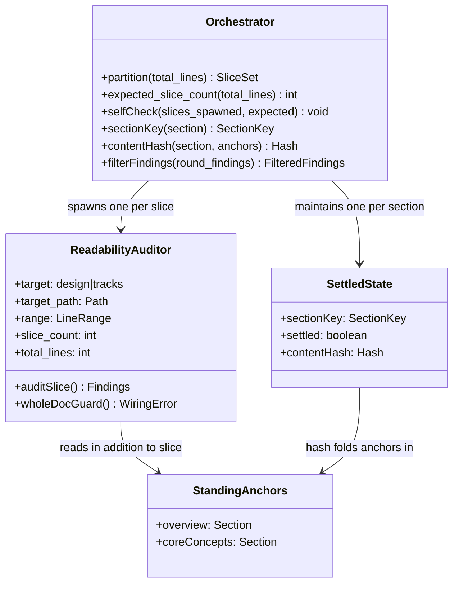
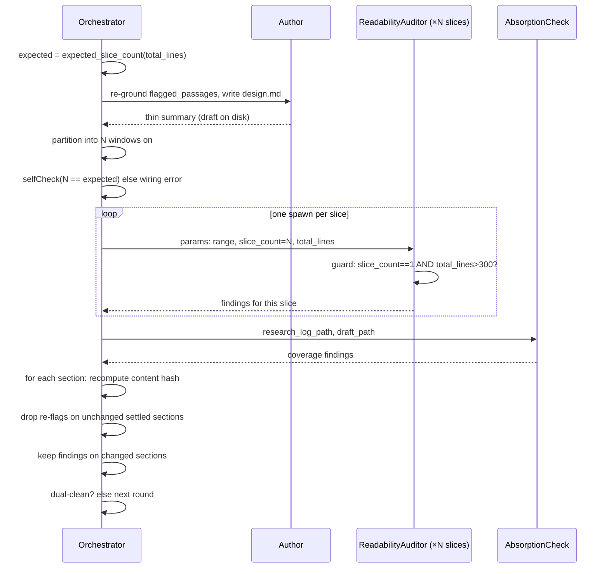

# Harden readability-auditor slicing and convergence — Design

## Overview

This change hardened the in-loop `readability-auditor` — the cold sub-agent that
reads a slice of `design.md` (or a track file) with no prior context and reports
every passage a mid-level developer cannot follow — against two defects on the
design path. It made the slice fan-out a **deterministic orchestrator obligation**
(~200-line windows on `##` / `# Part` boundaries, capped at ~6, one auditor per
window, with a hard floor against a single whole-doc slice), it added
**orchestrator-side section-keyed settled-state** so the dual-clean review loop
stops re-flagging prose it already settled, and it **relocated** every Phase-1
authoring-loop params and review file out of `_workflow/plan/` into the
plan-scoped `_workflow/reviews/`. The shipped diff is one staged workflow-prose
change across six files, promoted live by a Phase 4 promotion commit.

The first defect was an unenforced fan-out. The orchestrator was told the auditor
"is range-sliced" but was given no partition rule, no slice count, and no floor,
so it could run a single whole-doc spawn over a 700-line `design.md` and spread
per-passage attention thin enough to miss real findings. The second was
oscillation: the auditor is a stateless cold spawn every round, and the dual-clean
loop iterates until both reviewers — the readability auditor and the absorption
check that verifies the draft covers the research log — report a clean round. A
stateless auditor re-rolls already-settled prose through a fresh reader each round,
so the loop swung instead of converging. The originating issue measured it:
finding counts ran 13 → 8 → 3 → 8 across rounds — not a descent to zero — and one
slice swung from 0 findings to 5 on byte-identical prose.

This design assumes familiarity with the Phase-1 dual-clean authoring loop and the
cold-read sub-agent contract it drives. It is written for contributors who
maintain the `edit-design` and `create-plan` authoring skills and the
`readability-auditor` agent. Core Concepts defines the six load-bearing terms;
Class Design and Workflow model the components and one loop round; Parts 1–3 then
cover slicing, convergence, and relocation-and-meta.

## Core Concepts

This design introduces six load-bearing ideas. Each is named and used without re-definition in the Parts that follow; if a Part references one of these, its definition is here. Each entry also names what it replaces, so the contrast with the old behavior is visible.

**Deterministic slice partition.** A rule that maps a document's line count to an exact set of auditor slices: ~200-line windows aligned on `##` / `# Part` boundaries, capped at ~6 windows, one auditor spawn per window. Deterministic means two orchestrator runs on the same document produce the same slice set. Replaces "the auditor is range-sliced" with no stated rule. → Part 1 §"Deterministic design-path slice partition".

**Whole-doc floor invariant.** The hard rule that the partition never emits a single whole-doc slice for a document above ~300 lines (a 200-line window already forces ≥2 slices above ~250). Replaces the absent floor that let a single whole-doc spawn run. → Part 1 §"Deterministic design-path slice partition".

**Expected-slice-count self-check.** The orchestrator computes the slice count it should produce from values it already holds (total line count, the ~200-line window, the ~6 cap), spawns exactly that many auditors, then checks `slices_spawned == expected_slice_count` and surfaces a mismatch as a wiring error. This is the "verifiable spawn count" the issue asks for, satisfied by a stated obligation rather than a script. Replaces an unverifiable spawn count. → Part 1 §"Verifiable spawn count without a script".

**Agent-side whole-doc guard.** A secondary detector inside the auditor: it flags a wiring error when its params file says `slice_count == 1 AND total_lines > 300`. The guard runs only when both params are present. Replaces silent reliance on the orchestrator never collapsing the fan-out. → Part 1 §"The agent-side whole-doc guard" (for the exact-`300`-vs-`~300` boundary and the param-presence gating).

**Section-keyed settled-state.** Orchestrator-side memory keyed per `##` / `# Part` section (never per line range), recording whether each section is settled and storing its content hash. On the next round the orchestrator drops re-flags on unchanged settled sections and re-audits only changed ones. Replaces the loop's whole-document re-roll every round. → Part 2 §"Section-keyed settled-state".

**Standing anchor.** A section the auditor always reads in addition to its slice, so it can resolve cross-references without false-positiving on every defined term. On the design path the anchors are `## Overview` plus `## Core Concepts` (when present). The settled-state content hash folds the anchors in, because an anchor edit changes what the auditor sees and so re-opens dependent sections. → Part 2 §"The anchor-folded content hash".

## Class Design

This is a workflow-prose change, so the diagram below models the **workflow components** of the dual-clean loop — the orchestrator that drives it, the cold auditor it fans out, and the new settled-state record — not Java classes. The contracts shown are the params each component reads and the obligations each owns.

The orchestrator owns every cross-round decision: it computes the partition and the expected slice count, spawns the auditors, computes each section's content hash, and filters the returned findings against the settled-state. The auditor owns only the read of its own slice plus the standing anchors, and the secondary whole-doc guard; it holds no cross-round memory and reads no research log.

`SettledState` is orchestrator working memory (not a file), one record per section, carrying the section's settled flag and its anchor-folded content hash. The `slice_count` and `total_lines` fields on the auditor are the slicing metadata the orchestrator passes so the guard is computable.

One might worry the orchestrator could steer an auditor by varying these params per slice. But a bias would require the value to differ per slice, encoding a hint about that slice's content; because every slice in a round sees the same two values, they carry no per-slice signal that could steer one auditor.

The auditor runs on three spawn paths: the design-path creation-kind fan-out (the design / design-final authoring fan-out, one auditor per slice), the track-path per-file fan-out, and the standalone single-pass spawn. Only the first carries the `slice_count` / `total_lines` fields; the other two omit both, which leaves the guard inert there (Part 1).

### Edge cases / Gotchas

- The `slice_count` / `total_lines` fields are present on exactly one of the auditor's spawn paths. Where they are absent the guard does not run, so the diagram's `wholeDocGuard()` is a no-op on the track-path and single-pass spawns — by design, not a wiring gap (Part 1).

### References

- D1: deterministic partition
- D2: operative home plus agent guard
- D3: settled-state is orchestrator-side
- D4: section-keyed, anchor-folded hash
- Invariant S1: the auditor reads no research log
- Invariant S4: the prose AI-tell axis has exactly one owner per surface

## Workflow

The diagram below shows one round of the design-path dual-clean inner loop with the slicing obligation (D1/D2) and the settled-state filter (D3/D4) wired in. The track path runs the same shape with two parameters swapped (Part 2).

Two filters run on the orchestrator side and are the heart of this design. The expected-slice-count self-check (D1) runs before the fan-out: the orchestrator computes how many slices the partition rule demands and refuses to proceed if it spawned a different number. The settled-state filter (D4) runs after the fan-out: the orchestrator recomputes each section's anchor-folded content hash, drops every finding on a section that is both settled and hash-unchanged, and keeps findings on changed sections. The auditor between them is unchanged in kind — a cold reader of one slice — except that it now carries the `slice_count` / `total_lines` params that make its whole-doc guard computable.

### Edge cases / Gotchas

- A legitimate single-slice short doc (under the ~300-line floor) is not a collapse: the partition emits one slice, the self-check expects one, and the agent guard does not fire because `total_lines` is at or below the floor.
- The track path has no mid-loop resume glob today; this design did not add one (Part 3).

### References

- D1, D2: the slicing obligation and its self-check / guard
- D3, D4: the settled-state filter
- D5: both paths share the mechanism
- Invariant S1: the auditor reads no research log

# Part 1 — Deterministic slicing

Concern A made the design-path slice partition a deterministic, verifiable
orchestrator obligation, and added an agent-side guard that catches the degenerate
collapse-to-one-slice case the obligation alone cannot self-detect. The three
sections below state the partition rule, its expected-count self-check, and the
in-agent guard.

## Deterministic design-path slice partition

**TL;DR.** The design-path auditor fan-out became a mandatory deterministic
prose rule, ported from the existing `/readability-feedback` partition: split
`design.md` into ~200-line windows aligned on `##` / `# Part` boundaries, cap at
~6 windows, spawn exactly one auditor per window. A hard floor forbids a single
whole-doc slice for any doc over ~300 lines. The rule lives in `edit-design`
Step 4 (where the orchestrator acts) and is cross-referenced from the track path,
`readability-auditor.md`, `design-document-rules.md`, and `/readability-feedback`.

Before this change the design-path spawn carried no slice rule at all. `edit-design` Step 4 § "Spawning the per-round auditor and second check" said only that the auditor "is range-sliced: each slice gets its own spawn whose params file carries `target=design`, `target_path`, and the slice `range`." There was no slice count, no boundary rule, and no floor against a single whole-doc slice. An orchestrator reading that line could satisfy it with one spawn whose `range` spanned the whole document — which is exactly the under-catching failure the issue reported, because a cold reader handed 700 lines spreads per-passage attention thin.

The fix ports the partition rule that already works. `/readability-feedback` Procedure step 2 reads: "Split the doc into ~200-line ranges on `##` / `# Part` boundaries; give each companion file (`design-mechanics.md`) its own range. Cap at ~6 sub-agents." That rule produced the 5-slice fan-out that caught the misses in the originating run. It is chosen for that demonstrated catch. The in-loop design path audits only `design.md` (the companion `design-mechanics.md` is marked skip-review — the in-loop auditor never reads it), so the companion-file clause does not apply; the rest ports verbatim.

The partition rule:

1. Capture section boundaries (the `##` and `# Part` heading lines) and the total line count.
2. Walk the boundaries, accumulating ~200-line windows that always break on a heading, so no `##` section is split across two slices. Keeping sections whole matters because the auditor reads its slice plus the Overview / Core Concepts standing anchors and resolves "defined in Core Concepts" against them; a section split across slices would lose that resolution.
3. Cap at ~6 windows. Windows grow past 200 lines only when the cap binds — that is, on docs over ~1200 lines.
4. Spawn exactly one auditor per window.

**The whole-doc floor invariant.** The floor is stated as a hard invariant, not a separate tunable knob: the partition never emits a single whole-doc slice for a doc above ~300 lines. The 200-line window already forces this — any doc over ~250 lines yields ≥2 windows — so the floor is a property of the window size, restated explicitly so a reader cannot misread the rule as permitting a single slice.

**Warm-up is severed from slicing.** The cache warm-up — the wiring step in `edit-design` Step 4 that inserts a fixed delay between the first auditor spawn and the rest so later spawns hit a warm prefix — governs only the *sequencing* of the N>1 spawns. It never reduces N to 1. "Disable the warm-up" therefore means "pay N cold prefixes," never "run one whole-doc spawn." The two decisions are independent: the warm-up is a tunable cost lever, the partition is a correctness obligation, and the prose states each in its own place so they cannot be conflated.

### Edge cases / Gotchas

- Uneven sections: a single `##` section longer than ~200 lines is its own window (the walk breaks only on headings, so it never splits the section); the cap binds before the window count grows unbounded.
- A doc under the ~300-line floor produces one slice legitimately — the floor is the boundary, not a defect.

### References

- D1: deterministic ~200-line partition as a prose orchestrator obligation, no helper script
- D2: the rule's operative home is `edit-design` Step 4, with the other files cross-referencing it
- Invariant: whole-doc floor (no single slice above ~300 lines)
- Mirrors: `/readability-feedback` Procedure step 2 (the source rule); the track path partitions per file, not per window (D5)

## Verifiable spawn count without a script

**TL;DR.** The issue's "verifiable spawn count" requirement is satisfied at the
obligation level rather than by a check script. The orchestrator computes the
expected slice count deterministically, spawns exactly that many auditors, and
self-checks `slices_spawned == expected_slice_count`, surfacing a mismatch as a
wiring error. The issue explicitly accepts a stated orchestrator obligation as an
alternative to a machine check.

The issue's point-3 asks for a verifiable spawn count and accepts "a stated orchestrator obligation" as an alternative to a check. So the design added no new machinery. The orchestrator already holds the three inputs the partition rule needs: total line count, the ~200-line window size, the ~6 cap. Because the partition rule (above) is deterministic, the expected slice count is a pure function of those three inputs. The orchestrator computes it, spawns exactly that many auditors, and then asserts `slices_spawned == expected_slice_count`. A mismatch means the fan-out wiring is wrong, and the orchestrator surfaces it as a wiring error rather than proceeding with a thinned fan-out.

This is a prose check the orchestrator runs in working memory, with no script and no test machinery. It pairs with the agent-side guard (next section): the self-check catches a wiring error visible to the orchestrator (it spawned the wrong count), and the guard catches the degenerate case from inside the auditor (a single whole-doc slice over the floor). The two do not cover the same cases. The agent-side guard fires only on the *total* collapse to one slice; a *partial* count mismatch — say 2 slices spawned where the partition demands 5 — is invisible to the guard and is caught by the orchestrator self-check alone. `edit-design` Step 4 states this so a reader does not over-trust the guard as covering every fan-out error.

A helper script that emitted the slice ranges was considered and rejected. A script would be truly deterministic, would give free spawn-count verifiability, and would share one definition between `/readability-feedback` and the in-loop path. It was rejected for lightness: the prose obligation was chosen over new script-plus-test machinery, and the prose rule already matches the track path's existing style ("one spawn per `track-N.md`").

### Edge cases / Gotchas

- The self-check is the orchestrator's own assertion; it is not visible to the auditor, which is why the agent-side guard exists as the second, independent detector.

### References

- D1: the deterministic partition the count is computed from
- D2: the verifiable-count obligation pairs with the agent-side guard

## The agent-side whole-doc guard

**TL;DR.** `readability-auditor.md` turned "Range-sliced fan-out" from a
description into a hard requirement and added a guard: the auditor flags a wiring
error when its params say `slice_count == 1 AND total_lines > 300`. The
orchestrator's partition (D1) is the primary enforcement; the agent guard is the
secondary detector. Because a cold auditor cannot learn the document's total
length on its own, the orchestrator passes `slice_count` and `total_lines` as two
new params fields. The guard runs only when both fields are present.

The orchestrator's partition obligation is the primary enforcement — it spawns exactly the computed count, ≥2 above the floor. But a stated obligation can be violated silently if the orchestrator collapses the fan-out, and the issue asks for the collapse to be detectable rather than silent. A check script would have provided that detection; without the script, the agent guard recovers most of it.

The guard cannot read the document's total length on its own. The auditor's read-scope (the S1 cold-read invariant) bars it from reading anything but `house-style.md`, its slice, and the standing anchors — so it cannot count the lines of a document it only ever sees one slice of. The guard is therefore computable only if the orchestrator hands it the two facts: how many slices the round fanned out into (`slice_count`) and how long the whole document is (`total_lines`). Both are constant across a round's fan-out and are slicing metadata, not conclusions about the prose. So passing them does not prime the reader and does not violate the cold-read guarantee — the same S1 reasoning that keeps the settled-state off the auditor.

The auditor params file therefore gained two fields — `slice_count` and `total_lines` — added to the existing `target`, `target_path`, and `range`. The auditor fires the guard when `slice_count == 1 AND total_lines > 300`: a single slice over the floor is a collapse and is reported as a `blocker` wiring error. A single-slice short doc under the floor is legitimate and does not fire the guard.

**The guard runs only when both fields are present.** The two new fields ride only the design-path creation-kind fan-out spawn. Two other spawn sites use the same agent but omit both fields: the track-path per-file fan-out (`create-plan` Step 4b item 9), and the `design-sync` single whole-document prose pass. When the params file does not carry **both** fields, the guard does not apply — the auditor proceeds with a normal slice audit. This gating is load-bearing: `design-sync` is a single whole-document pass over a `design.md` routinely above 300 lines, which is exactly the `slice_count == 1 AND total_lines > 300` shape the guard would otherwise flag as a wiring-error blocker on a legitimate single-pass spawn. The implementation discovered this during the change: an unconditional guard would have blocked `design-sync` on every long document, so the param-absent gating is a refinement.

**The floor is the exact integer `300`; the window and cap stay approximate.** The guard fires on `slice_count == 1 AND total_lines > 300` — an exact integer comparison. A hard blocker-emitting gate needs a deterministic boundary, so the guard floor is exact and admits no fuzziness. The orchestrator's `~200`-line window and `~6`-window cap remain approximate sizing targets: they shape the fan-out but never decide a pass/fail finding. The two threshold styles are deliberate, not an inconsistency — the soft window and cap size the slicing, while the exact `300` floor decides a blocker finding. The partition rule's prose uses `~300` for the floor as a sizing description; the guard condition uses the exact `300` because it is the boundary of a pass/fail gate.

**Where the rule lives, and why it is distributed.** The operative partition algorithm lives in `edit-design` Step 4 § auditor, because the orchestrator reads Step 4 when spawning and never reads the agent's `.md` file — the algorithm has to live where it acts. `readability-auditor.md` carries the hard requirement plus the guard, because the guard runs inside the agent. The other three files cross-reference the shared principle rather than duplicating it:

- `create-plan` Step 4b item 9 — the track path, whose unit differs (per file, not per window).
- `design-document-rules.md` — its `### Cold-read sub-agent prompt` section gained a one-line cross-reference to the canonical slicing home, since it documented the cold-read mechanics but carried no slicing statement.
- `/readability-feedback` — so the standalone tool and the in-loop path cannot drift on window size or cap. The `/readability-feedback` cross-reference couples the partition **value only** — window size, boundary set, cap — because that tool fans out `general-purpose` sub-agents with a self-contained inline prompt rather than the `readability-auditor` agent; it therefore adopts neither the whole-doc guard nor the `slice_count` / `total_lines` params (its sub-agents take no params file). A single canonical home inside `readability-auditor.md` was rejected because the orchestrator never reads the agent file; duplicating the full rule verbatim in each file was rejected for drift risk.

### Edge cases / Gotchas

- The guard is secondary: it catches the orchestrator-collapsed case from inside the auditor, but the orchestrator's partition + self-check is what normally prevents the collapse from happening at all.
- `slice_count` and `total_lines` are constant across the round's fan-out, so every slice's auditor receives the same two values; only `range` varies per slice.
- The track-path and `design-sync` spawns omit both fields, so the guard is inert there; that is the param-presence gating, not a missing param.

### References

- D2: the "range-sliced" description becomes a hard requirement plus the agent-side whole-doc guard, made computable by the `slice_count` / `total_lines` params and gated on their presence
- Invariant S1: the auditor reads no research log; slicing metadata is S1-safe (constant across the fan-out, not conclusion-priming); the settled-state stays off the auditor by the same reasoning (Part 2)

# Part 2 — Convergence

Concern B gave the dual-clean loop a way to stop re-rolling settled prose while
keeping the auditor fully cold. The mechanism below is orchestrator-side
section-keyed settled-state, and it covers the design path and the track path
alike.

## Section-keyed settled-state

**TL;DR.** The convergence fix is orchestrator-side memory keyed per `##` /
`# Part` section, recording whether each section is settled and storing its
anchor-folded content hash. A settled section whose hash is unchanged between
rounds has its re-flags dropped (and its slice may be skipped); a changed section
is re-audited fresh. The auditor stays fully cold — it never receives the
settled-state — so the cold-read guarantee is intact by construction.

The root cause of the oscillation is that the auditor is a stateless cold spawn every round, so the loop re-rolls already-settled prose through a fresh reader. `edit-design` Step 6 asserted the loop "moves monotonically toward dual-clean — typically one or two rounds."

But the per-round state (round, budget, `flagged_passages`) lived only in orchestrator working memory. The author re-grounds only the flagged passages, not the whole document. So each round's auditor was a fully cold spawn with no do-not-re-flag set, and it re-flagged settled dense prose — a slice that returned 0 findings one round could return 5 on byte-identical prose the next. That variance was the dominant source of the 13 → 8 → 3 → 8 finding counts.

**The state lives entirely orchestrator-side (D3).** The auditor is never handed the settled-state and never told which sections are settled; it reads its slice plus the anchors fully cold every spawn. The orchestrator holds the settled-state, decides which sections to re-spawn, and filters the returned findings. This resolves the issue's stated tension by construction: with zero state on the agent there is no conclusion-priming, so the cold-read guarantee — the auditor's whole value — is strictly intact. The rejected alternative was an exclusion-list-in-spawn: passing a `do_not_reflag` list into each later-round spawn. That was rejected on two grounds. First, it primes the reader ("these passages are blessed"), the exact conclusion-priming the issue warns against. Second, a per-round-varying params list invalidates the shared-prompt cache the fan-out relies on.

**Keyed per section, not per line (D4).** The state is tracked per `##` / `# Part` section, keyed on section identity plus a content hash, never on line ranges. Line ranges would break, because the document grows between rounds and the deterministic partition (Part 1) can regroup sections into different windows — so any line-keyed memory is stale after the next partition. Section identity survives re-partitioning: a section is the same section whether it lands in slice 2 this round or slice 3 next round.

**Settled, and what the orchestrator does with it.** A section is **settled** when it returned clean — no open finding. The orchestrator then does one of two things per section each round:

- **Settled and unchanged** (hash matches last round): drop all the section's findings. The orchestrator may also skip re-spawning a slice that covers only such sections — a cost optimization, since the filter would drop the findings anyway. This is what kills the clean→dirty oscillation on byte-identical prose.
- **Changed** (hash differs, or never settled): re-audit fresh, keep the returned findings, then re-evaluate the section's settled-state.

The settled-and-unchanged filter collapses the issue's main carry-forward source — already-clean prose re-rolled through a fresh cold spawn — into one mechanical filter the orchestrator runs without re-reading the document. The literal passage-level do-not-re-flag list from the issue comment was rejected, because a clean slice (a round's 0 findings) leaves no quotes to carry forward. With no quotes to carry forward, a passage list cannot suppress the clean→dirty oscillation that is the dominant variance source. The section hash can suppress it, because it carries the "this section was clean and is unchanged" verdict that a quote list cannot.

### Edge cases / Gotchas

- Skipping the re-spawn of an all-settled slice is optional; the filter alone is correct, and an orchestrator that re-spawns every slice still converges because the filter drops the re-flags.

### References

- D3: the cross-round state lives entirely orchestrator-side; the auditor stays cold
- D4: the state is section-keyed, not a passage do-not-re-flag list
- Invariant S1: the auditor reads no research log and receives no settled-state
- Invariant S4: the prose AI-tell axis has one owner per surface

## The anchor-folded content hash

**TL;DR.** A section's content hash folds in its own text plus whichever standing
anchors exist, because the auditor reads those anchors too — so an anchor edit
must re-open every dependent section. On `target=design` the anchors are
`## Overview` (always present) plus `## Core Concepts` (present only
conditionally). The hash tolerates an absent Core Concepts.

The settled-state hash cannot be over a section's own text alone, because the auditor does not read a section's text alone. It reads its slice plus the standing anchors, and it resolves cross-references like "defined in Core Concepts" against them. So a section's auditability depends on the anchor text as well: if the Overview is rewritten, a section that leaned on an Overview definition may now read differently to the cold auditor even though the section's own bytes are untouched. A hash over the section text alone would mark that section "settled, unchanged" and wrongly suppress findings the anchor edit just introduced.

The hash therefore folds in the standing anchors that exist. On `target=design` that is `## Overview` plus `## Core Concepts` **when present**. Core Concepts is seeded only conditionally — when the doc has Parts or introduces ≥3 new domain terms — so the hash must tolerate its absence: when there is no Core Concepts section, the hash folds in the Overview alone, and the auditor (which resolves anchors on demand) tolerates the absence the same way. An edit to either anchor changes every section's hash, so every section re-audits, which is the correct behavior — an anchor edit is exactly the case where settled verdicts go stale.

### Edge cases / Gotchas

- An absent `## Core Concepts` is normal on short single-Part designs; the hash folds in only the anchors that exist, so a missing Core Concepts is not an error and does not force a re-audit by itself.
- Folding the anchors in means an Overview rewrite re-audits the whole document. That is intentional, not over-conservative: the cold auditor's reading of every section can shift when the anchor it resolves against changes.

### References

- D4: the section-keyed hash folds in the standing anchors the auditor reads, tolerating an absent Core Concepts
- Invariant S1: the auditor reads no research log

## Convergence backstop: the iteration budget and S5

**TL;DR.** The loop does not depend on every section reaching clean. A section
the auditor never returns clean on, because its prose is irreducibly dense but
acceptable, never becomes settled, so it re-audits each round. The loop is
bounded anyway: `iteration_budget` (default 3) caps the rounds, and on budget
exhaustion it exits through the S5 user-is-the-gate path — the orchestrator
applies the cheap unambiguous fixes and surfaces the residual for the user to
accept or reject. No separate hold mechanism was added.

The settled-state filter from the previous sections kills the dominant
clean→dirty oscillation, but it cannot settle a section the auditor flags every
round on irreducible density: floor vocabulary the audience already knows,
glossed once in the doc's footers, where an inline gloss everywhere would only
bloat the prose. Such a section stays unsettled and re-audits each round.

That is not a non-termination risk, because the loop is already bounded. The
`iteration_budget` caps the rounds at 3 by default, and on budget exhaustion with
only should-fix findings open (no blockers), the orchestrator takes the
S5 user-is-the-gate path: it applies the cheap unambiguous fixes in a final
targeted pass and surfaces the residual for the user to accept or push back on.
S5 already owns this accept-the-residual decision, so converging on
dense-but-acceptable prose needs no new machinery.

The shipped Step 6 reconciled this with the live monotonic-convergence claim
rather than appending beside it. The prior text read that the loop "moves
monotonically toward dual-clean … the budget plus escalation is the backstop for
a pathological case, not the expected path." The reconciled text holds monotonic
convergence on the settled sections while framing the never-clean
dense-but-acceptable tail, bounded by `iteration_budget` + S5, as a **designed**
terminal exit, not a pathology. The two adjacent claims agree: the loop descends
toward dual-clean on every section that can settle, and the residual dense tail
exits through the budget-plus-S5 path by design.

A per-finding **calibrated-hold** mechanism was considered and rejected: accept a
dense-but-followable should-fix, record its verbatim quote and a reason, and mark
the section settled so the loop reaches dual-clean and exits before the budget.
It would buy early self-termination and a per-finding accept trail, but it adds a
hold concept the reader must track and a user-veto backstop that exists only
because S4 leaves the prose axis with no second catcher, and it applies a
verbatim-quote ritual to findings that are often cold-spawn variance rather than
real defects. The budget cap plus S5 already terminate the loop, so the hold
layer was removed.

### Edge cases / Gotchas

- A decision-shaped finding is never a prose-density case: it re-opens the S3
  freeze-order gate — the rule that a contested decision must survive adversarial
  challenge before the comprehension gate runs (the loop's final cold
  comprehension-review step, run once after the inner loop converges). Only
  prose-density should-fix findings ride the budget-plus-S5 tail.

### References

- D8: calibrated holds dropped; a section is settled only when it returned clean; the never-clean tail is bounded by `iteration_budget` and the S5 user-is-the-gate path
- Invariant S4: the prose AI-tell axis has one owner — the auditor; the comprehension gate reads no log and runs no prose axis

## Both paths get the convergence fix

**TL;DR.** The same stateless-cold-auditor loop runs on the track path
(`create-plan` Step 4b item 9 spawns the same `readability-auditor` each round),
so the convergence fix applies to both paths. The mechanism (D3/D4) is identical;
only two parameters differ — the settled-state key and the standing-anchor set.
The canonical statement lives in `edit-design` Step 6; `create-plan` Step 4b
item 9 cross-references it with the track-path parameters.

The track path runs the identical defect. `create-plan` Step 4b item 9 calls its loop "the track-path analog of the `edit-design phase1-creation` loop, parameterized to `target=tracks`," and spawns the **same** `readability-auditor` agent — one cold spawn per `track-N.md` each round, same dual-clean structure, same `iteration_budget`. So the convergence defect applied to the track path too, and is worse there, because each round re-rolls N track files. (The absorption half does not oscillate — coverage-matching is near-deterministic — so only the readability auditor needed the fix, on both paths.)

The mechanism is identical across the two paths; only two parameters differ, mirroring the slicing split in Part 1:

| Parameter | `target=design` | `target=tracks` |
|---|---|---|
| Settled-state key | per `##` / `# Part` section of `design.md` | per `track-N.md` file |
| Standing-anchor set | `## Overview` + `## Core Concepts` (when present) | the plan Component Map + each track's `## Purpose / Big Picture` (whichever exist) |

The canonical convergence mechanism is stated once in `edit-design` Step 6, parameterized by the settled-key and the anchor set; `create-plan` Step 4b item 9 cross-references it with the track-path values above. Item 9 **already** carried the per-file deterministic slicing rule (one `readability-auditor` spawn per `plan/track-N.md`, whole-file `range`) and the track-path standing anchors, so this change added only the *convergence-mechanism* cross-reference — the settled-state and anchor-folded hash item 9 lacked. The existing per-file partition is preserved verbatim. The slicing *unit* differs by design — per-window on the design path, per-file on the track path. So the reference reads "same convergence mechanism, parameterized; the slicing unit stays per-file as already stated here," never "apply the same partition." Fixing only the design path was rejected — it leaves the track-path loop chasing the same variance; restating the full mechanism in both files was rejected for drift risk.

**Track-path anchor stability.** On the track path, `create-plan` Step 4b items 1–8 settle the plan Component Map and the track skeletons *before* item 9's dual-clean loop runs. So the standing anchors the settled-state hash folds in are byte-stable for the loop's duration — they are not still moving while the loop iterates. The cross-reference states this explicitly so a `lite` / `minimal` reader — one on the reduced-artifact workflow tiers — does not assume the Component Map is still in flux during the loop.

### Edge cases / Gotchas

- The track path has no `## Core Concepts`; its anchors are the Component Map and the per-track Purpose sections, so the hash folds in a different anchor set, but the folding rule is the same.
- An anchor on the track path is the whole-plan vocabulary a single track-file slice lacks; an edit to the Component Map re-opens every track's settled-state, the same way an Overview edit does on the design path.

### References

- D2: the per-file/per-window split is symmetric with the D2 home for slicing
- D3, D4: the convergence mechanism
- D5: the same fix covers the track path, with two path-specific parameters; consistent with `create-plan` Step 4b already deferring to `edit-design`'s loop contracts
- Invariant S1: the auditor reads no research log

# Part 3 — Relocation and meta

Concern C moved the authoring-loop files to `_workflow/reviews/`; decision D7
settled two things: tier `full` and full §1.7 staging. The consequence is that
this branch ran the unmodified live loop during its own authoring. The two sections
below cover each in turn.

## File relocation to `_workflow/reviews/`

**TL;DR.** Every Phase-1 authoring-loop per-spawn params file (author,
readability-auditor, absorption / fidelity, comprehension) and every review
output file moved out of `_workflow/plan/` into the plan-scoped
`_workflow/reviews/`. The design-path resume round-count glob followed.
`conventions-execution.md` §2.5 generalized its third-scope home to cover the
authoring loop. After the move `plan/` holds only `track-N.md` artifacts.

Before the move, the authoring-loop files polluted `plan/`. `edit-design` Step 4 wrote one params file per spawn "under `_workflow/plan/`," and the comprehension gate's `phase4-creation` `output_path` was also "under `_workflow/plan/`." Concern C moved both of those sites — and every other authoring-loop params and review file — into the plan-scoped `_workflow/reviews/` directory. The new per-slice params files (Part 1) and the settled-state scaffolding (Part 2) inherit this home.

**Why the plan-scoped `_workflow/reviews/`, not the track-anchored `plan/track-N/reviews/`.** The canonical execution-phase review home is the track-anchored `plan/track-N/reviews/` (`conventions-execution.md` §2.1 Review-file lifecycle). But the design path runs in Step 4a *before any `plan/track-N/` directory exists*, and the author and comprehension spawns operate on the whole plan, not a single track — so a track-anchored home cannot host them uniformly. The plan-scoped `_workflow/reviews/` is the natural home, and `conventions-execution.md` §2.5 already defined exactly that directory for the Phase-0→1 gate's files. So the change generalized §2.5's "Third-scope review-file home" from "the Phase-0→1 gate's files" to "plan-scoped authoring-loop review scaffolding." That scope now spans the Phase-0→1 research-log gate it named before, plus Phase-1 design/track authoring (`phase1-creation`) and Phase-4 design-final authoring (`phase4-creation`). The generalization widened the section's annotation axes on two surfaces — the TOC row and the section comment: roles gained `orchestrator,final-designer`, and phases gained `4` because the authoring-loop callers now write into that home at phases 1 and 4, not only the Phase-0→1 gate at phase 1. Execution-phase review files (Phase 2/3, `track-review`) keep their existing track-anchored home — C touched only the Phase-1 authoring loop.

**The two values, and where each applies.** The primary value on both paths is decluttering `plan/` so it holds only `track-N.md` artifacts. The secondary "resume glob reads one location" benefit applies only to the design path. The `edit-design` Step 6 dual-clean loop can resume after an interruption, and it recovers which round it was on by counting the per-round params files already on disk. Because relocating those files changed where they live, the glob's path updated with them — from `_workflow/plan/` to `_workflow/reviews/`. The `create-plan` Step 4b track-path loop has **no** resume round-count glob at all — a pre-existing gap, see the edge cases below — so the move's track-path value is only the `plan/` cleanup. The move is forward-compatible: if a track-path resume glob is ever added, it reads `_workflow/reviews/` consistently with the design path.

**What stays put.** Two `plan/`-rooted references in `create-plan` Step 4b item 9 are **not** review scaffolding and were left in place: the author `output_path` and the absorption-check `draft_path`. Both address the `track-N.md` artifacts the loop writes — they point at the `plan/` directory where the track files land and are read back — not a review file. Only item 9's per-spawn params-file home relocated. Moving the two artifact-addressing paths would have written the authored track files into `reviews/`, so the relocation instruction names the params-file home explicitly rather than "item 9 paths" wholesale.

**Scope of edits.** `edit-design` Step 4 (params + comprehension `output_path`) and Step 6 (the resume round-count glob), `create-plan` Step 4b item 9 (params-file home only), and `conventions-execution.md` §2.5. The agent files needed no change: they read whatever params path the spawn prompt names, so they are path-agnostic on file location.

### Edge cases / Gotchas

- The track-path Step-4b loop has no mid-loop resume mechanism today (a pre-existing gap): `edit-design` Step 6 has an explicit resume block that re-derives the round count from the latest per-round params files, but the `create-plan` Step 4b loop writes the same per-spawn params with no equivalent glob. This change did not add one — that is out of scope and orthogonal to file location — but the move is forward-compatible if one is ever added.
- Moving only the literal "auditor and comprehension" files named in the Concern-C comment was rejected: the author and absorption / fidelity params files also pollute `plan/`, and the design-path resume glob reads all of them, so a partial move leaves the mess and splits the glob.

### References

- D6: all Phase-1 authoring-loop files move to `_workflow/reviews/`; the design-path resume glob follows; §2.5 generalizes
- Mirrors: `conventions-execution.md` §2.1 Review-file lifecycle (the track-anchored execution-phase home, unchanged); §2.5 Third-scope review-file home (the generalized Phase-1 home)

## Meta: tier and §1.7 routing

**TL;DR.** Tier is `full`, because Concern B is a genuine mechanism design
(section-keyed settled-state, the anchor-hash subtlety, the populate / drop
rules) that warrants a `design.md`. The centrally-matched HIGH-risk category is
`Workflow machinery`. §1.7 routing is full staging rather than the §1.7(k)
prose-rule opt-out, because the core edits are an executable orchestration loop.
The consequence: this branch ran the unmodified live loop during its own
authoring.

**Tier = `full`.** Concern B is a real mechanism design — the section-keyed settled-state, the anchor-folded content-hash subtlety, the populate / drop rules — so it warrants a `design.md`. The centrally-matched HIGH-risk category is `Workflow machinery`: the change edits a load-bearing control-flow protocol, the dual-clean review-iteration loop.

**§1.7 routing = full staging.** The §1.7 staging discipline governs how workflow-modifying branches keep their own running phases off a half-modified workflow. §1.7(k) offers a prose-rule opt-out for branches whose edits are judgment-layer prose, letting them edit live and gain self-application. This branch did **not** qualify, on two grounds. First, §1.7(k)'s criterion 2 disqualifies a plan from the prose-rule opt-out when a running phase reads its edited files as executable procedure rather than merely as prose. The criterion explicitly names "the step-implementation orchestration loop." This change's core edits are the dual-clean orchestration loop (`edit-design` Step 4/6, `create-plan` Step 4b) plus the resume glob, so the opt-out fails criterion 2. Second, staging is the safe choice regardless. Editing the loop live would let this branch's own Phase 4 design-final authoring and Phase 3C re-reads run the half-modified loop. That is the exact destabilization staging prevents: a running phase must never read a half-modified workflow (I6).

**The accepted consequence.** Implementation edits landed under `_workflow/staged-workflow/.claude/...` and a Phase 4 promotion commit copies them live. This branch's own Phase 1 authoring (Step 4a `design.md`, Step 4b tracks) and all later phases ran the **live develop-state, unmodified** loop — so the branch could not exercise its own fixes during its own planning. Its own design / track authoring exhibited the old unenforced-slicing and oscillation behavior, which was expected and accepted — the standard staging trade-off every staged workflow-modifying branch accepts.

### Edge cases / Gotchas

- The branch's own authoring oscillating or running a single whole-doc auditor slice is not a regression in this change; it is the live-loop behavior the staged fix had not yet promoted.

### References

- D7: tier `full`; §1.7 routing is full staging, not the prose-rule opt-out; the branch runs the unmodified live loop during its own authoring
- Invariant I6: a running phase never reads a half-modified workflow
