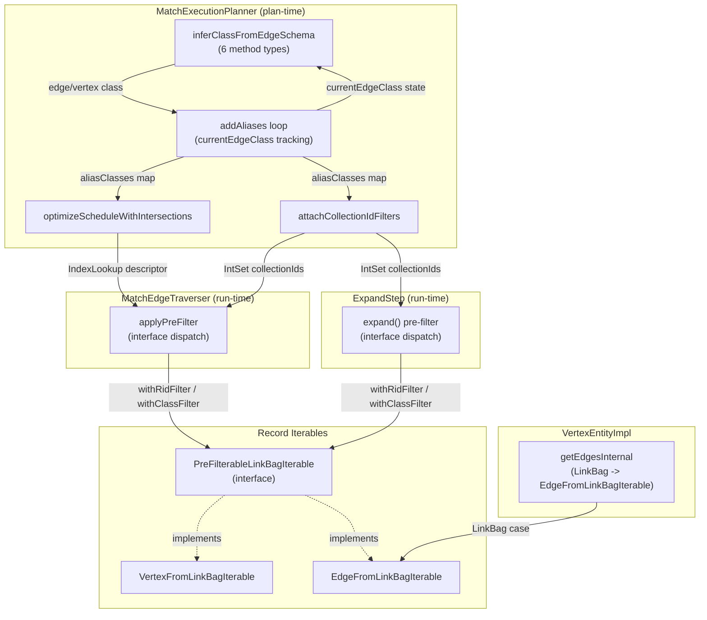

# Index-Assisted Traversal for Edge-Method MATCH Patterns — Architecture Decision Record

## Summary

MATCH queries using edge-method patterns (`outE`/`inE` followed by
`inV`/`outV`) could not benefit from index intersection pre-filtering,
even when indexed edge properties existed (e.g., `WORK_AT.workFrom`,
`HAS_MEMBER.joinDate`). This forced full edge record loading for every
link bag entry. This feature extends the existing pre-filter mechanism to
edge-method patterns, enabling zero-I/O skipping of non-matching edges
at the iterator level.

The solution introduces a shared `PreFilterableLinkBagIterable` interface,
a new `EdgeFromLinkBagIterable`/`EdgeFromLinkBagIterator` pair for
edge-level filtering, extended class inference in the MATCH planner for
six method types, and interface-based dispatch in the traverser and
expand layers.

## Goals

- **Extend index pre-filtering to edge-method MATCH patterns** — achieved.
  `outE`/`inE` patterns with indexed edge properties now skip non-matching
  edge records without loading them from storage.
- **Unified interface for pre-filterable iterables** — achieved.
  `PreFilterableLinkBagIterable` provides a single dispatch point for both
  vertex and edge iterables.
- **Class inference for edge-method aliases** — achieved. The planner
  infers edge classes from `outE`/`inE` parameters and vertex classes
  from `inV`/`outV` via the edge's LINK schema.
- **Adaptive abort guards apply identically** — achieved. The same
  `maxRidSetSize`, `maxSelectivityRatio`, and `minLinkBagSize` knobs
  govern edge pre-filtering.

No goals were descoped or changed during implementation.

## Constraints

- **`bothE()` is out of scope** — unchanged. `bothE()` returns a
  `ChainedIterable` which does not implement `PreFilterableLinkBagIterable`,
  so it silently degrades to unfiltered iteration.
- **No generated code changes** — upheld. All changes are planner-level
  and runtime-level.
- **Backward compatibility** — upheld. Pre-filter is strictly an
  optimization; no query results change.

No new constraints were discovered during implementation.

## Architecture Notes

### Component Map

- **`addAliases` loop**: Tracks `currentEdgeClass` state. `outE`/`inE` set
  it; `inV`/`outV` consume and reset it; all other methods reset it.
- **`inferClassFromEdgeSchema`**: Handles six method types (`out`, `in`,
  `outE`, `inE`, `inV`, `outV`). Uses `extractEdgeClassName` for V2E and
  `lookupLinkedVertexClass` for E2V inference.
- **`optimizeScheduleWithIntersections`** and
  **`attachCollectionIdFilters`**: No changes needed — once `aliasClasses`
  has the correct class, existing logic finds indexes and resolves
  collection IDs naturally.
- **`applyPreFilter`**: Dispatches on `PreFilterableLinkBagIterable`
  interface instead of concrete type. Inherited by
  `MatchReverseEdgeTraverser`.
- **`ExpandStep`**: Same interface-based dispatch.
- **`getEdgesInternal`**: LinkBag case returns `EdgeFromLinkBagIterable`
  instead of RID-projecting `EdgeIterable`.

### Decision Records

#### D1: Shared interface vs. multi-instanceof check
- **Implemented as planned.** `PreFilterableLinkBagIterable` interface
  extracted, both vertex and edge iterables implement it.
- `iterator()` was added directly to the interface (returning
  `Iterator<?>`) because Java does not allow `extends Iterable<?>`
  with a wildcard supertype. Concrete implementations satisfy it
  via covariant return types.

#### D2: Edge class inference via forward-propagation in addAliases loop
- **Implemented as planned.** Single-pass forward-propagation using
  `currentEdgeClass` state variable. `outE`/`inE` set the state;
  `inV`/`outV` consume and reset it; all other methods reset it.
- `lookupLinkedVertexClass` was extracted as a shared helper for both
  V2V and E2V schema lookups.
- `extractEdgeClassName` was hardened with an empty-string guard.

#### D3: EdgeFromLinkBagIterable filters on primary RIDs
- **Implemented as planned.** New `EdgeFromLinkBagIterable` and
  `EdgeFromLinkBagIterator` wrap LinkBag directly, filtering on
  `primaryRid()` (edge RID) before loading from storage. Mirrors
  the `VertexFromLinkBagIterable`/`VertexFromLinkBagIterator` pattern
  but targets edge records instead of vertices.
- `getEdgesInternal` returns `EdgeFromLinkBagIterable` for the LinkBag
  case; non-LinkBag cases (`Identifiable`, `EntityLinkSetImpl`,
  `EntityLinkListImpl`) continue using `EdgeIterable`.

### Invariants

- Pre-filter never excludes a record that would pass the WHERE clause.
- Class filter collection IDs include all subclass collection IDs
  (polymorphic), matching `collectionIdsForClass()` behavior.
- Adaptive abort guards apply identically to edge and vertex
  pre-filtering.
- `EdgeFromLinkBagIterator` validates every `RidPair` via
  `validateEdgePair()` and gracefully skips `RecordNotFoundException`
  (dangling RID pattern).

### Non-Goals

- `bothE()` pre-filtering (deferred — requires
  `PreFilterableChainedIterable` wrapper)
- Multi-property-name edge cases: when `getEdgesInternal()` matches
  multiple property names, it returns `chainedIterable(...)` which
  doesn't implement the interface — silently degrades to unfiltered
- `expand()` edge-method-specific behavior beyond the `instanceof`
  type change
- Index creation or schema changes — assumes indexes already exist

## Key Discoveries

- **Java wildcard supertype limitation**: `extends Iterable<?>` is not
  allowed in Java interface declarations. Solved by declaring
  `Iterator<?> iterator()` directly on the interface, with concrete
  implementations providing covariant return types.

- **Direction mapping asymmetry between V2V and E2V inference**: For V2V
  (`out('X')`/`in('X')`), the direction is flipped (`out` reads the `in`
  LINK property). For E2V (`inV()`/`outV()`), the direction is direct
  (`inV()` reads the `in` property). This is because V2V traverses
  *through* the edge to the opposite vertex, while E2V traverses *along*
  the edge's own direction.

- **Small-dataset adaptive abort**: With small datasets (e.g., 10 edges),
  the runtime pre-filter's adaptive abort (`minLinkBagSize=50`) skips
  intersection-based pre-filtering. The planner still attaches the index
  via PREFETCH/SET steps. Integration test EXPLAIN assertions must check
  for `FETCH FROM INDEX` and `FETCH FROM CLASS` rather than
  `(intersection: index ...)` for small-dataset tests.

- **Edge-method cost model interaction**: `outE`/`inE` patterns introduce
  intermediate edge aliases that change the cost model's scheduling
  behavior compared to direct V2V patterns. A 2-step edge-method chain
  has different cost characteristics, which can affect scheduling order.
  This is a pre-existing characteristic of the cost model, not a bug
  introduced by this feature.

- **Two existing tests depended on `EdgeIterator` concrete type**: Two
  tests in `DoubleSidedEdgeLinkBagTest` explicitly cast the iterator to
  `EdgeIterator` to test reset/multiValue behavior. These were
  `EdgeIterator`-specific features that don't apply to
  `EdgeFromLinkBagIterator`. Replaced with type verification tests.

- **`extractEdgeClassName` edge cases**: The helper needed hardening for
  empty strings, non-string parameters, and case-insensitivity. Added
  during code review.
