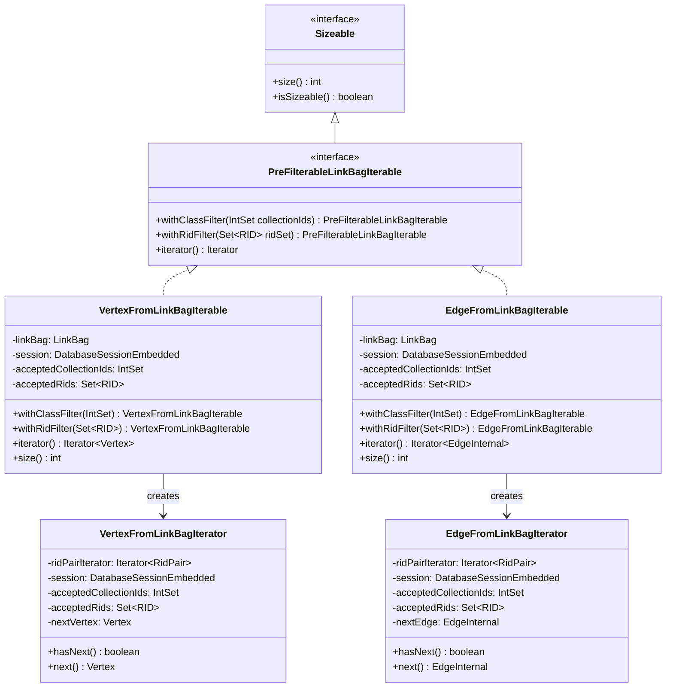
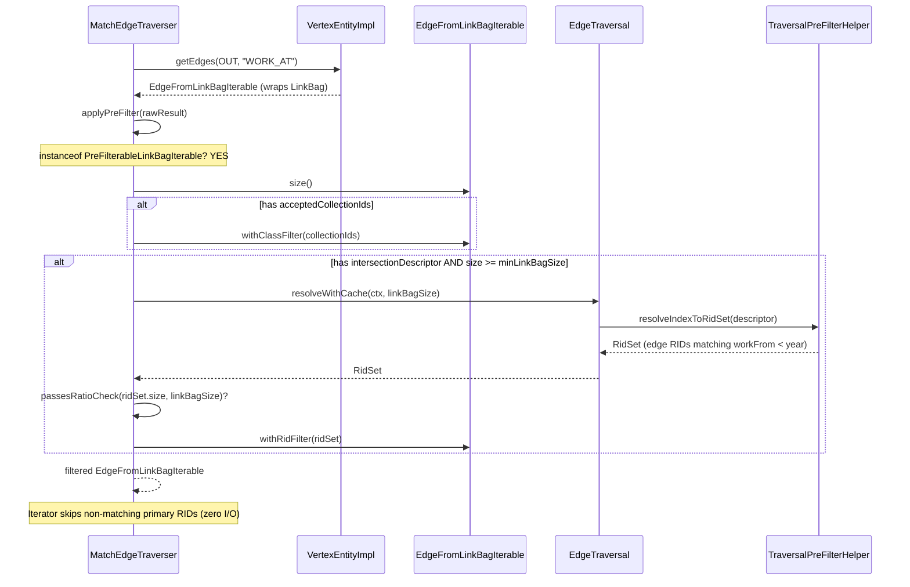

# Index-Assisted Traversal for Edge-Method MATCH Patterns — Final Design

## Overview

This feature extends the MATCH index intersection pre-filter — previously
limited to `expand()` and vertex-to-vertex edges (`out`/`in`) — to
edge-method patterns (`outE`/`inE` followed by `inV`/`outV`). This allows
queries with indexed edge properties (e.g., `WORK_AT.workFrom`,
`HAS_MEMBER.joinDate`) to skip non-matching edge records without loading
them from storage.

The implementation has three structural layers:

1. **Iterator layer**: A shared `PreFilterableLinkBagIterable` interface and
   a new `EdgeFromLinkBagIterable` that wraps a LinkBag and yields edge
   records from primary RIDs with zero-I/O class and RID filtering.
2. **Planner layer**: Extended class inference in `MatchExecutionPlanner`
   that recognizes `outE('X')`/`inE('X')` as targeting edge class `X`, and
   `inV()`/`outV()` as targeting the vertex class from the preceding edge's
   LINK schema.
3. **Traverser layer**: `applyPreFilter` in `MatchEdgeTraverser` and
   `ExpandStep` generalized from the concrete `VertexFromLinkBagIterable`
   type to the shared interface.

No deviations from the original plan occurred. `bothE()` remains out of
scope. All adaptive abort guards apply identically to edge pre-filtering.

## Class Design



`PreFilterableLinkBagIterable` extends `Sizeable` (inheriting `size()` and
`isSizeable()`) and declares `withClassFilter()`, `withRidFilter()`, and
`iterator()`. Java does not allow `extends Iterable<?>` with a wildcard
supertype, so the `iterator()` method returning `Iterator<?>` is declared
directly on the interface — concrete implementations satisfy it via
covariant return types (`Iterator<Vertex>` and `Iterator<EdgeInternal>`).

Both `withClassFilter` and `withRidFilter` return new instances with the
filter applied (immutable-copy pattern). Filters compose: calling
`withClassFilter` then `withRidFilter` produces an iterable that applies
both. The underlying LinkBag is shared (not copied) across filtered
instances.

`EdgeFromLinkBagIterable` mirrors `VertexFromLinkBagIterable` structurally.
The key difference is in the iterator: `VertexFromLinkBagIterator` reads
`ridPair.secondaryRid()` (the opposite vertex), while
`EdgeFromLinkBagIterator` reads `ridPair.primaryRid()` (the edge record
itself). Both apply collection-ID and RID-set filters before loading from
storage.

## Workflow

### Pre-filter attachment (plan time)

```mermaid
sequenceDiagram
    participant MP as MatchExecutionPlanner
    participant CI as inferClassFromEdgeSchema
    participant AC as aliasClasses map
    participant OPT as optimizeScheduleWithIntersections
    participant TPH as TraversalPreFilterHelper

    Note over MP: addAliases loop: currentEdgeClass = null
    MP->>CI: item = outE('WORK_AT')
    CI-->>MP: class = "WORK_AT"
    MP->>AC: put("workEdge", "WORK_AT")
    Note over MP: currentEdgeClass = "WORK_AT"

    MP->>CI: item = inV(), currentEdgeClass = "WORK_AT"
    CI-->>MP: class = "Organisation" (from WORK_AT.in LINK)
    MP->>AC: put("company", "Organisation")
    Note over MP: currentEdgeClass = null (reset)

    Note over MP: After all aliases collected
    MP->>OPT: schedule + aliasClasses + aliasFilters
    OPT->>AC: get("workEdge") -> "WORK_AT"
    OPT->>TPH: findIndexForFilter(WHERE workFrom < year, "WORK_AT")
    TPH-->>OPT: IndexSearchDescriptor (WORK_AT.workFrom index)
    OPT->>OPT: attach IndexLookup to edge alias
```

The `addAliases` loop processes MATCH expression items sequentially,
tracking a `currentEdgeClass` variable:

- **`outE('X')` / `inE('X')`**: `inferClassFromEdgeSchema` returns `X`
  directly (the edge class name is the method parameter). `currentEdgeClass`
  is set to `X`.
- **`inV()` / `outV()`**: `inferClassFromEdgeSchema` uses `currentEdgeClass`
  to look up the LINK property on the edge schema. `inV()` reads the `in`
  property; `outV()` reads the `out` property. `currentEdgeClass` is reset
  to null afterward.
- **`out('X')` / `in('X')`** (existing V2V): direction is flipped — `out`
  reads the `in` property because it traverses to the vertex on the `in`
  side. `currentEdgeClass` is reset.
- **Any other method**: `currentEdgeClass` is reset.

Once `aliasClasses` is populated, `optimizeScheduleWithIntersections` and
`attachCollectionIdFilters` work unchanged — they find the target alias
class, query for matching indexes, and attach `IndexLookup` or
`collectionIds` descriptors.

### Pre-filter application (run time)



At runtime, `applyPreFilter` checks the traversal result against the
`PreFilterableLinkBagIterable` interface. For `outE('WORK_AT')`, the result
is an `EdgeFromLinkBagIterable` (returned by
`VertexEntityImpl.getEdgesInternal()` for the LinkBag case). The same
adaptive abort guards apply:

- **`minLinkBagSize`**: skip pre-filtering if the link bag is too small
  (overhead exceeds benefit).
- **`maxSelectivityRatio`**: skip if the RID set is too large relative to
  the link bag (not selective enough).
- **`maxRidSetSize`**: the index resolution itself aborts if the estimated
  result set is too large (checked inside `resolveWithCache`).

The `ExpandStep` operator uses the same interface-based dispatch for
`expand()` expressions.

## Primary vs Secondary RID Filtering

The LinkBag stores `RidPair(primaryRid, secondaryRid)` entries where
`primaryRid` is the edge record RID and `secondaryRid` is the opposite
vertex RID.

| Iterator | Filters on | Use case |
|---|---|---|
| `VertexFromLinkBagIterator` | `secondaryRid` | V2V traversal — skip vertices that don't match |
| `EdgeFromLinkBagIterator` | `primaryRid` | V2E traversal — skip edges that don't match |

Both filters operate before loading from storage (zero I/O), because the
RID is in memory from the LinkBag entry. The collection-ID check
(`acceptedCollectionIds.contains(rid.getCollectionId())`) and the RID-set
check (`acceptedRids.contains(rid)`) are both O(1).

This distinction is critical: an index on `WORK_AT.workFrom` returns edge
RIDs, not vertex RIDs. `EdgeFromLinkBagIterator` filters primary RIDs
against this set, ensuring only edges with matching `workFrom` values are
loaded from storage.

## Class Inference for Edge-Method Patterns

`inferClassFromEdgeSchema` handles six method types in two categories:

**V2E methods (`outE('X')`, `inE('X')`):** The alias represents an edge
record. The inferred class is the edge class itself — the method parameter
provides the class name directly. No schema lookup is needed.

**E2V methods (`inV()`, `outV()`):** The alias represents a vertex reached
via the preceding edge. The method has no parameters, so the edge class
comes from the `currentEdgeClass` state variable set by the preceding
`outE`/`inE`. The LINK property name matches the method direction directly
(`inV()` reads `in`, `outV()` reads `out`). This differs from V2V inference
where direction is flipped (`out('X')` reads `in`).

Edge cases handled:
- `currentEdgeClass` is null (no preceding `outE`/`inE`): inference skipped
- Edge class not in schema: inference skipped
- LINK property not declared: inference skipped
- `extractEdgeClassName` returns null for empty strings, non-string
  parameters, and missing parameters

## Integration Points

| Component | Change | File |
|---|---|---|
| `VertexEntityImpl.getEdgesInternal()` | LinkBag case returns `EdgeFromLinkBagIterable` instead of `EdgeIterable` | `VertexEntityImpl.java` |
| `MatchEdgeTraverser.applyPreFilter()` | `instanceof PreFilterableLinkBagIterable` instead of concrete type | `MatchEdgeTraverser.java` |
| `ExpandStep` | Same `instanceof` change for expand() expressions | `ExpandStep.java` |
| `MatchExecutionPlanner.addAliases()` | `currentEdgeClass` tracking across items | `MatchExecutionPlanner.java` |
| `MatchExecutionPlanner.inferClassFromEdgeSchema()` | Six method types, `lookupLinkedVertexClass` helper | `MatchExecutionPlanner.java` |
