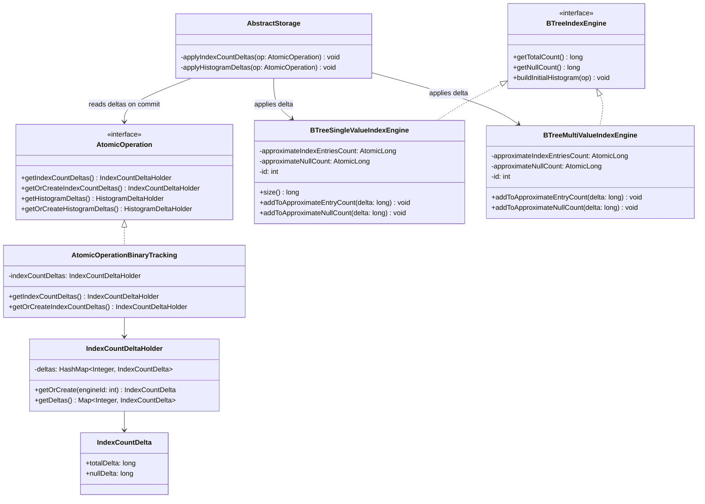
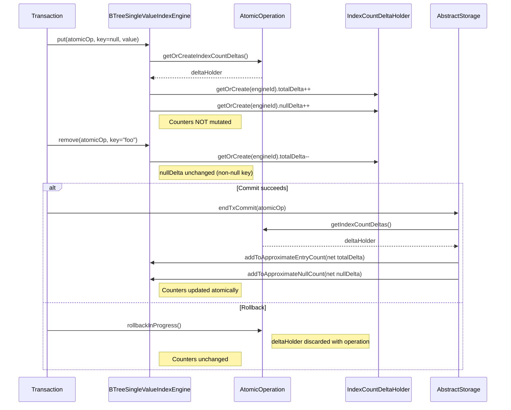

# Deferred Index Entry Count — Design

## Overview

The solution maintains two in-memory `AtomicLong` counters per B-tree
index engine — `approximateIndexEntriesCount` (total) and
`approximateNullCount` (null-keyed entries). These counters provide O(1)
`size()`, `getTotalCount()`, and `getNullCount()`.

Counter mutations are deferred from operation time to commit time.
Instead of mutating the `AtomicLong` fields directly inside
`put`/`remove`/`validatedPut`, each operation accumulates a `totalDelta`
(±1) and `nullDelta` (±1 when key is null) on an `IndexCountDeltaHolder`
stored on the `AtomicOperation`. After `endTxCommit()` succeeds,
`AbstractStorage` iterates the accumulated deltas and applies them to
each engine's counters. On rollback, the delta holder is discarded — the
counters are never touched.

Counters are initialized accurately on `load()` via a full
visibility-filtered scan (one-time cost at database open).
`buildInitialHistogram()` keeps its own full scan and recalibrates
`approximateIndexEntriesCount` (existing). It must be updated to also
set `approximateNullCount` from the `nullCount` variable already
computed in the scan.

This follows the existing `HistogramDeltaHolder` pattern already used for
histogram delta accumulation on the same commit path.

## Class Design

**`IndexCountDeltaHolder`** is a lightweight per-operation accumulator.
It uses `HashMap<Integer, IndexCountDelta>` for engine-ID-keyed access,
mirroring the `HistogramDeltaHolder` pattern. `IndexCountDelta` is a simple mutable pair of
`totalDelta` and `nullDelta` longs. The `getOrCreate()` method mirrors
`HistogramDeltaHolder.getOrCreate()`.

**`BTreeSingleValueIndexEngine` / `BTreeMultiValueIndexEngine`** gain a
new `approximateNullCount` field alongside the existing
`approximateIndexEntriesCount`. Both are initialized accurately on
`load()` via a visibility-filtered scan. The engines expose
`addToApproximateEntryCount(long)` and `addToApproximateNullCount(long)`
— package-private methods called by
`AbstractStorage.applyIndexCountDeltas()`.

**`getTotalCount()`** becomes `approximateIndexEntriesCount.get()` —
dropping the full scan. **`getNullCount()`** becomes
`approximateNullCount.get()`. Both are O(1).

**`AbstractStorage.applyIndexCountDeltas()`** mirrors the existing
`applyHistogramDeltas()`: called after `endTxCommit()`, iterates the
delta map, resolves each engine by ID, and calls both
`addToApproximateEntryCount()` and `addToApproximateNullCount()`.

## Workflow

On the commit path, `applyIndexCountDeltas` runs after `endTxCommit()`
and before the transaction is considered complete. It is wrapped in its
own try-catch that logs a warning on failure — matching the
`applyHistogramDeltas()` resilience pattern, since it is a cache-only
operation whose failure must not mask a successful commit. On the rollback path,
the `AtomicOperation` (and its `IndexCountDeltaHolder`) is simply
discarded — no counter mutation occurs.

## Counter Initialization and Lifecycle

| Event | `approximateIndexEntriesCount` | `approximateNullCount` |
|---|---|---|
| `create()` | set to 0 | set to 0 |
| `load()` | set from visibility-filtered scan | set from visibility-filtered scan |
| `buildInitialHistogram()` | recalibrated from exact scan (existing) | recalibrated from exact scan (add `approximateNullCount.set(nullCount)`) |
| `clear()` | set to 0 | set to 0 |
| `put`/`remove` (committed) | delta applied after commit | delta applied (if null key) |
| `put`/`remove` (rolled back) | unchanged (delta discarded) | unchanged (delta discarded) |

**`load()`** initializes both counters via a full visibility-filtered scan.
This replaces the current `sbTree.size()` approach which is inaccurate
because B-tree size includes tombstones and snapshot markers after SI
changes. The scan is a one-time cost at database open.

**`buildInitialHistogram()`** remains unchanged — it does its own full
scan for building histogram buckets and recalibrates both counters as a
self-healing mechanism.

## Null Key Tracking

Both engines already know whether a key is null at the call site:

- **`BTreeSingleValueIndexEngine`**: `put(op, key, value)`,
  `remove(op, key)`, `validatedPut(op, key, value, validator)` all
  receive the `key` parameter directly. `key == null` → increment
  `nullDelta`.
- **`BTreeMultiValueIndexEngine`**: `put()` and `remove()` branch on
  `key != null` before delegating to `doPut`/`doRemove`. The null-ness
  is known at the caller level.

## Rollback Safety

The key property: **no counter mutation happens until after
`endTxCommit()` succeeds**. If the atomic operation fails at any point —
during B-tree writes, during validation (`RecordDuplicatedException`), or
during WAL commit — the delta holder is discarded. Both counters retain
their pre-transaction values.

Concrete scenario (the bug this fixes):
1. Transaction begins. `approximateIndexEntriesCount = 1`.
2. `validatedPut("B", rid1)` → delta holder gets `totalDelta +1`.
   Counter stays 1.
3. `validatedPut("B", rid2)` → validator throws
   `RecordDuplicatedException`.
4. Transaction rolls back. Delta holder discarded. Counter stays **1**.
5. `size()` returns 1. Correct.

## Crash Between Commit and Delta Application

If the JVM crashes after `endTxCommit()` but before
`applyIndexCountDeltas()`, the counters will be stale when the engine is
reloaded. This is acceptable because `load()` re-initializes both
counters from a full visibility-filtered scan on restart.
`buildInitialHistogram()` also recalibrates as an additional self-healing
mechanism.

## Concurrency

The `IndexCountDeltaHolder` is **not** thread-safe — it doesn't need to
be. Each `AtomicOperation` is owned by a single thread throughout its
lifetime. The delta holder is created on that thread and accessed only by
that thread until commit time.

At commit time, `applyIndexCountDeltas()` runs on the committing thread.
It calls `addAndGet(delta)` on the `AtomicLong` fields — lock-free and
linearizable. Multiple concurrent commits update the counters safely.
