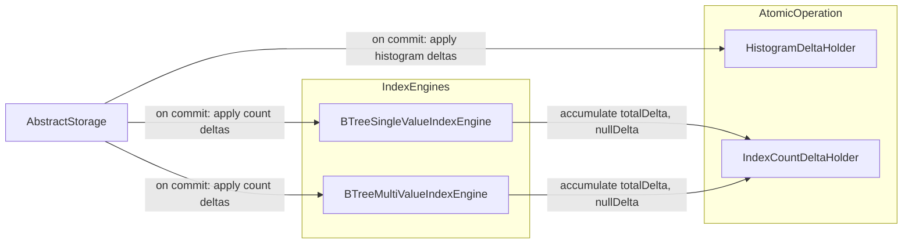

# Deferred Index Entry Count — Rollback-Safe O(1) Counters

## Design Document
[design.md](design.md)

## High-level plan

### Goals

Provide O(1) `size()`, `getTotalCount()`, and `getNullCount()` for
`BTreeSingleValueIndexEngine` and `BTreeMultiValueIndexEngine` that are
approximately correct even after rolled-back transactions. The counters
must not drift when an `AtomicOperation` fails (e.g.,
`RecordDuplicatedException` on a unique index).

On develop, `size()` returned `sbTree.size(atomicOperation)` — a
page-level counter that auto-reverts on rollback. The SI branch replaced
it with an in-memory `AtomicLong` (`approximateIndexEntriesCount`) that
is mutated eagerly inside `put`/`remove`/`validatedPut`. This counter is
not part of the atomic operation and therefore not rolled back, causing
observable drift (e.g., `IndexTest.testTransactionUniqueIndexTestTwo`
expects 1, gets 2).

Additionally, `getTotalCount()` and `getNullCount()` currently do full
visibility-filtered scans — they should also become O(1) reads from
maintained counters.

### Constraints

- **O(1) read**: `size()`, `getTotalCount()`, `getNullCount()` must all
  return `AtomicLong.get()` — no full-index scans.
- **Accurate initialization**: `load()` must initialize both counters via
  a full visibility-filtered scan so they start accurate. This is a
  one-time cost at database open.
- **Rollback safety**: follow the `HistogramDeltaHolder` pattern already on
  `AtomicOperation` — accumulate per-engine deltas, apply on commit only,
  discard on rollback.
- **Thread safety**: multiple concurrent transactions may modify different
  engines; the delta holder is per-operation (single-threaded), and the
  `AtomicLong` is updated with `addAndGet` at commit time.
- **Self-healing**: `buildInitialHistogram()` already recalibrates
  `approximateIndexEntriesCount` from its full scan. It must be updated
  to also recalibrate the new `approximateNullCount` (the `nullCount`
  variable is already computed in the scan — just needs one extra set).
- **`clear()` stays direct**: `clear()` runs in its own atomic operation
  and resets both counters to 0.

### Architecture Notes

#### Component Map

- **`IndexCountDeltaHolder`** (new): per-operation accumulator using
  `HashMap<Integer, IndexCountDelta>` (mirroring `HistogramDeltaHolder`).
  Maps engine ID → `IndexCountDelta(totalDelta, nullDelta)`. Stored on
  `AtomicOperation` alongside the existing `HistogramDeltaHolder`. Lazily
  allocated. Discarded on rollback.
- **`BTreeSingleValueIndexEngine`**: `put()`, `remove()`, `validatedPut()`
  stop mutating counters directly. Instead they accumulate
  `totalDelta ±1` and (when `key == null`) `nullDelta ±1` on the delta
  holder. New `approximateNullCount` field alongside existing
  `approximateIndexEntriesCount`. `getTotalCount()` and `getNullCount()`
  become O(1) reads. `size()` unchanged (already O(1)). `load()`
  initializes both counters via visibility-filtered scan.
- **`BTreeMultiValueIndexEngine`**: same changes in `doPut()` and
  `doRemove()` (caller passes null-ness). New `approximateNullCount`
  field. `load()` initializes both counters via visibility-filtered scan.
- **`AbstractStorage`**: new `applyIndexCountDeltas(atomicOperation)` method
  called after `endTxCommit()`, alongside `applyHistogramDeltas()`. Iterates
  the delta map and applies both `totalDelta` and `nullDelta` to each
  engine.
- **`AtomicOperation` / `AtomicOperationBinaryTracking`**: new field and
  accessor pair (`getIndexCountDeltas()` / `getOrCreateIndexCountDeltas()`),
  mirroring the histogram delta pattern.

#### D1: Defer counter mutation to commit time via delta holder

- **Alternatives considered**:
  1. *Rollback callback on AtomicOperation* — register compensating
     decrements. Requires new callback infrastructure; fragile if multiple
     engines interact.
  2. *Re-read `sbTree.size()` on rollback* — B-tree size includes
     tombstones and markers after SI changes, so it's inaccurate.
  3. *Piggyback on `HistogramDelta`* — the histogram already tracks
     `totalCountDelta`/`nullCountDelta` via `onPut`/`onRemove`. However,
     `histogramManager` can be null (error recovery path), which would
     leave no delta accumulated. Coupling counter correctness to histogram
     availability is fragile.
  4. *Accept drift, rely on self-healing* — `buildInitialHistogram()` already
     recalibrates. But between rollback and next histogram build, `size()`
     returns wrong values, breaking existing tests.
- **Rationale**: A separate `IndexCountDeltaHolder` follows the proven
  `HistogramDeltaHolder` pattern, requires minimal new infrastructure, and
  is independent of histogram manager availability.
- **Risks/Caveats**:
  - `clear()` still mutates counters directly (sets to 0). It is called
    both from standalone `AbstractStorage.clearIndex()` and from within
    `commitIndexes()` (when `changes.cleared` is true). In the
    `commitIndexes` path, `clear()` sets counters to 0 first, then
    subsequent puts in the same commit accumulate deltas on the holder.
    On commit, those deltas are applied to the already-zeroed counters,
    producing the correct final value. On runtime rollback (no crash),
    the counters remain incorrectly zeroed until the next
    `buildInitialHistogram()` run — this is a pre-existing limitation,
    not introduced by this plan. On crash+restart, `load()` re-initializes
    from a full scan.
  - Crash between `endTxCommit()` and `applyIndexCountDeltas()` would lose
    the delta. Acceptable because `load()` re-initializes from a full scan
    on restart, and `buildInitialHistogram()` recalibrates as self-healing.
    Addressed by [`persist-visible-count`](../persist-visible-count/implementation-plan.md):
    `persistIndexCountDeltas()` now writes counts to entry point pages
    *inside* the WAL atomic operation (before `endTxCommit`), eliminating
    this crash window entirely.
- **Implemented in**: Track 1

#### D2: Accurate initialization via visibility-filtered scan on load()

- **Alternatives considered**:
  1. *Use `sbTree.size()`* — fast but inaccurate (includes tombstones and
     snapshot markers). Current approach.
  2. *Full visibility-filtered scan* — accurate, one-time O(n) cost at
     database open per index.
- **Rationale**: Since the counters are now the source of truth for
  `size()`, `getTotalCount()`, and `getNullCount()`, they must start
  accurate. The one-time scan cost at database open is acceptable.
- **Risks/Caveats**: Adds startup time proportional to total index entries.
  For very large indexes this could be noticeable, but it only runs once
  per database open.
- **Implemented in**: Track 1
- **Superseded by**: [`persist-visible-count`](../persist-visible-count/implementation-plan.md)
  — the O(n) full visibility-filtered scan on every `load()` turned out to
  be too expensive for large production databases where startup time must be
  independent of index size. That plan persists the approximate entries
  count to the BTree entry point page (`APPROXIMATE_ENTRIES_COUNT` field)
  within the WAL atomic operation at commit time, making `load()` an O(1)
  page read instead of a full scan. The `buildInitialHistogram()` scan
  remains as the self-healing recalibration path.

#### D3: Two counters — total and null

- **Alternatives considered**:
  1. *Single total counter only* — `getNullCount()` stays as a full scan.
     Simpler but leaves one O(n) method.
  2. *Two counters (total + null)* — both O(1), both rollback-safe via the
     same delta holder.
- **Rationale**: The null counter follows the same delta pattern at near-zero
  additional cost (one extra `long` field per engine in the delta holder).
  Both counters are recalibrated together by `buildInitialHistogram()`.
- **Risks/Caveats**: None beyond those in D1.
- **Implemented in**: Track 1

#### Invariants

- After a rolled-back transaction, both `approximateIndexEntriesCount` and
  `approximateNullCount` must equal their pre-transaction values (no drift
  from the rolled-back operations).
- After a committed transaction, both counters must reflect the net effect
  of all put/remove operations in that transaction.
- `size()`, `getTotalCount()`, `getNullCount()` remain O(1).
- `buildInitialHistogram()` recalibrates both counters from exact scan
  (self-healing for any residual drift).
- `load()` initializes both counters accurately (originally via
  visibility-filtered scan; now via persisted entry point page read — see
  [`persist-visible-count`](../persist-visible-count/implementation-plan.md)).

#### Non-Goals

- Exact counters under crash scenarios — they are approximate by design.
  Self-healed by `load()` (restart) and `buildInitialHistogram()`.
- Changing `clear()` to use the delta path.
- Changing `buildInitialHistogram()` scan logic — it keeps its own full
  scan. Only adding `approximateNullCount.set(nullCount)` alongside the
  existing `approximateIndexEntriesCount.set(totalCount)`.

## Checklist

- [x] Track 1: Delta holder infrastructure, engine changes, and O(1) counters
  > Add `IndexCountDeltaHolder` class with per-engine `totalDelta` and
  > `nullDelta`, wire it into `AtomicOperation` /
  > `AtomicOperationBinaryTracking` with lazy accessors.
  >
  > Add `approximateNullCount` (`AtomicLong`) to both engines alongside the
  > existing `approximateIndexEntriesCount`. Change `load()` in both engines
  > to initialize both counters via a full visibility-filtered scan (replacing
  > the current `sbTree.size()` approach). For `BTreeMultiValueIndexEngine`,
  > the scan must iterate both `svTree` (through `indexesSnapshot`) and
  > `nullTree` (through `nullIndexesSnapshot`) separately — summing for
  > `approximateIndexEntriesCount` and using the null tree count for
  > `approximateNullCount`. Initialize both to 0 in `create()`.
  > Reset both in `clear()`. Update `buildInitialHistogram()` in both engines
  > to also set `approximateNullCount` from the `nullCount` variable already
  > computed in the scan (currently only `approximateIndexEntriesCount` is
  > recalibrated).
  >
  > Modify `BTreeSingleValueIndexEngine` (`put`, `remove`, `validatedPut`)
  > and `BTreeMultiValueIndexEngine` (`doPut`, `doRemove`, callers pass
  > null-ness) to accumulate deltas on `IndexCountDeltaHolder` instead of
  > mutating counters directly.
  >
  > Change `getTotalCount()` → `approximateIndexEntriesCount.get()` and
  > `getNullCount()` → `approximateNullCount.get()` (drop the scans).
  >
  > Add `applyIndexCountDeltas()` in `AbstractStorage` called after
  > `endTxCommit()`, alongside `applyHistogramDeltas()`. Wrap in its own
  > try-catch that logs a warning on failure (same resilience pattern as
  > `applyHistogramDeltas()` — cache-only operation whose failure must not
  > mask a successful commit). Add `addToApproximateEntryCount(long)` and
  > `addToApproximateNullCount(long)` methods on engines for
  > `AbstractStorage` to call.
  >
  > Constraints: the `AtomicOperation` interface change must be mirrored in
  > `AtomicOperationBinaryTracking`. The `id` field on each engine provides
  > the key for the delta map. The `key` parameter in put/remove tells
  > whether to increment `nullDelta`.
  >
  > **Scope:** ~4-5 steps covering new holder class, AtomicOperation wiring,
  > engine counter fields + load() initialization, engine method delta
  > changes, AbstractStorage commit-path integration
  >
  > **Track episode:**
  > Built the complete delta-holder pipeline for rollback-safe index entry
  > counters. Added `IndexCountDeltaHolder`/`IndexCountDelta` as a
  > transaction-local accumulator on `AtomicOperation`, mirroring the
  > existing `HistogramDeltaHolder` pattern. Modified both engines to
  > accumulate `totalDelta`/`nullDelta` on the holder via a static
  > `IndexCountDelta.accumulate()` helper instead of mutating `AtomicLong`
  > counters directly. Changed `getTotalCount()` and `getNullCount()` from
  > O(n) scans to O(1) counter reads. Updated `load()` to initialize
  > counters accurately via visibility-filtered scan. Added
  > `applyIndexCountDeltas()` to `AbstractStorage` commit path. No plan
  > deviations — implementation matched the design closely.
  >
  > **Step file:** `tracks/track-1.md` (4 steps, 0 failed)

- [ ] Track 2: Tests
  > Verify rollback safety with existing and new tests.
  > `DuplicateUniqueIndexChangesTxTest.testDuplicateCreateThrows` and
  > `testDuplicateUpdateThrows` already assert `size()` after rollback
  > (added earlier in this session). Run `IndexTest` from the `tests`
  > module in CI mode to confirm `testTransactionUniqueIndexTestTwo` passes.
  > Add a unit test that directly exercises the delta holder lifecycle
  > (accumulate, commit → applied; accumulate, rollback → discarded).
  > Add tests verifying `getNullCount()` and `getTotalCount()` return O(1)
  > values consistent with committed state after rollback.
  >
  > **Scope:** ~2-3 steps covering new delta holder unit test,
  > null/total count rollback tests, existing test verification adjustments
  > (if needed)
  > **Depends on:** Track 1

## Final Artifacts
- [ ] Phase 4: Final artifacts (`design-final.md`, `adr.md`)
