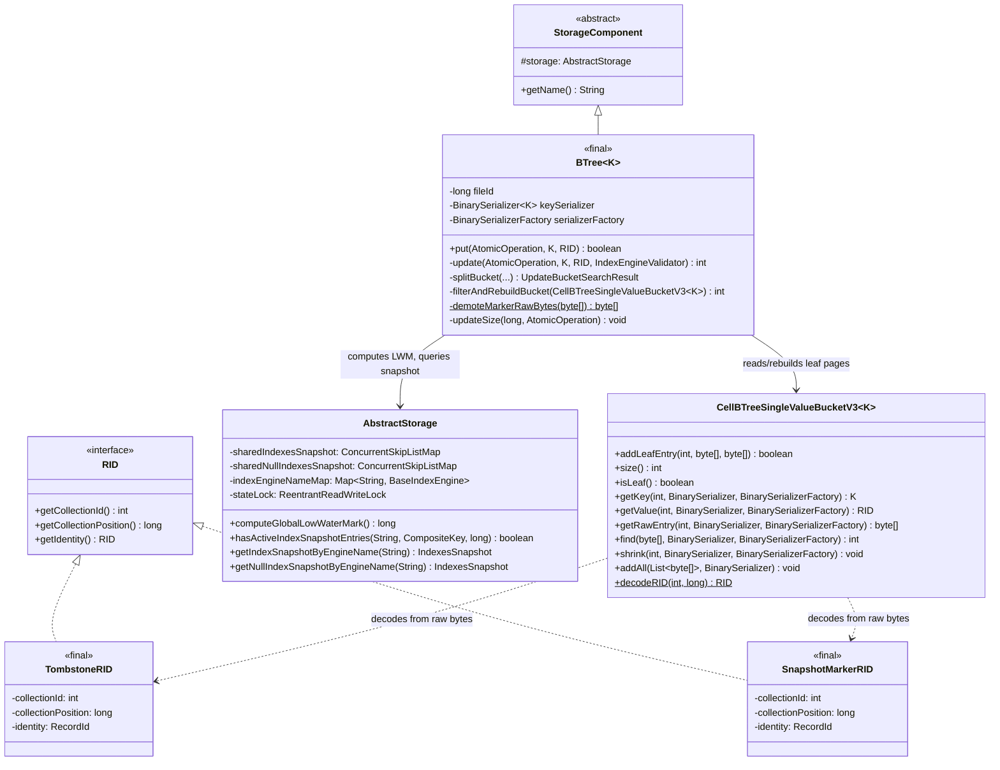
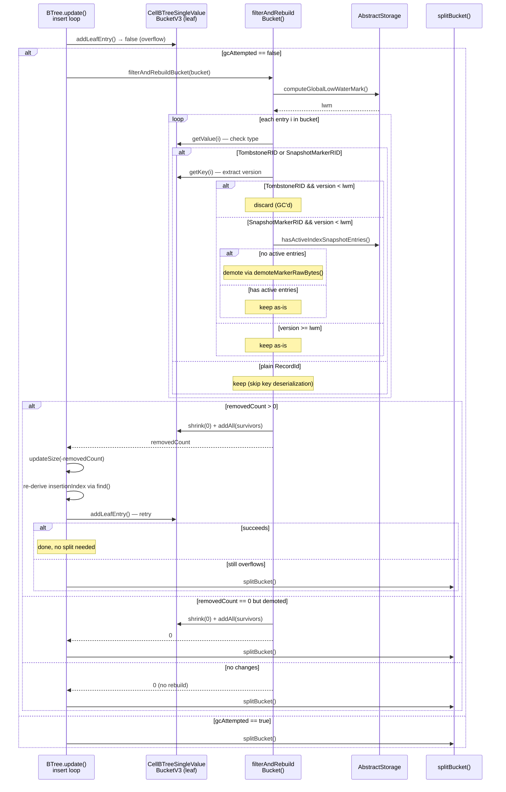
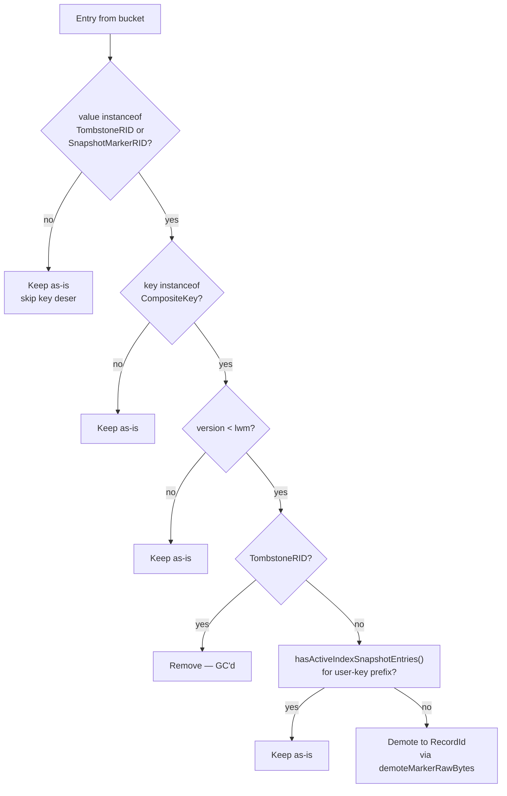

# Index BTree Tombstone GC During Leaf Bucket Overflow — Final Design

## Overview

Tombstone garbage collection was added to `BTree` (the shared B-tree
implementation used by both `BTreeSingleValueIndexEngine` and
`BTreeMultiValueIndexEngine`), triggered when a leaf bucket overflows during
`put()`. When a bucket is full, the GC filters out removable `TombstoneRID`
entries and demotes stale `SnapshotMarkerRID` entries, rebuilds the bucket
with survivors only, and retries the insert. A split occurs only if the
bucket is still full after filtering.

The implementation follows the filter-rebuild-retry pattern established by
the edge tombstone GC in `SharedLinkBagBTree`, with two key differences:
(1) tombstones are removed unconditionally below LWM (no snapshot entry
check needed), and (2) `SnapshotMarkerRID` entries are demoted to plain
`RecordId` rather than removed.

No deviations from the original design plan were needed — the
implementation matches the planned architecture.

## Class Design

`BTree<K>` extends `StorageComponent` (which provides the `storage`
reference to `AbstractStorage`) and implements `CellBTreeSingleValue<K>`.
Two private methods were added: `filterAndRebuildBucket()` performs the
GC scan and rebuild, `demoteMarkerRawBytes()` rewrites SnapshotMarkerRID
encoding in raw bytes. Both are contained entirely within `BTree`.

`AbstractStorage` gained three new public methods:
`hasActiveIndexSnapshotEntries()` queries the `ConcurrentSkipListMap` for
active snapshot entries by engine name and user-key prefix;
`getIndexSnapshotByEngineName()` and `getNullIndexSnapshotByEngineName()`
resolve scoped snapshots for test infrastructure. All three guard
`indexEngineNameMap` access with `stateLock.readLock()`.

`TombstoneRID` and `SnapshotMarkerRID` are final classes implementing
`RID`, storing primitive fields directly (avoiding intermediate `RecordId`
allocation on the hot decode path). `TombstoneRID` encodes collectionId
as `-(id + 1)`; `SnapshotMarkerRID` encodes collectionPosition as
`-(pos + 1)`. `CellBTreeSingleValueBucketV3.decodeRID()` distinguishes
the three types by sign.

## Workflow

### Filter-Rebuild-Retry in put()

The `update()` method's `while (!addLeafEntry(...))` loop handles bucket
overflow. GC is inserted as a first-attempt optimization before splitting.
The `gcAttempted` boolean ensures filtering runs at most once per `put()`
call. An important optimization (T5): plain `RecordId` entries skip key
deserialization entirely — only `TombstoneRID` and `SnapshotMarkerRID`
entries need the key to extract the version.

### Tombstone Eligibility Flowchart

Three outcomes for each entry:
1. **Remove** — TombstoneRID below LWM is discarded. Tree size decremented.
2. **Demote** — SnapshotMarkerRID below LWM with no active snapshot entries
   has its raw bytes rewritten to a plain RecordId. Tree size unchanged.
3. **Keep** — all other entries preserved as-is.

## SnapshotMarkerRID Demotion Encoding

`SnapshotMarkerRID` encodes `collectionPosition` as `-(realPos + 1)`.
Demotion rewrites the last 8 bytes of the raw leaf entry (the
`collectionPosition` field) back to the real positive value using
`LongSerializer` read-modify-write. The `collectionId` is unchanged
(always positive for `SnapshotMarkerRID`).

Raw leaf entry layout: `[serialized_key | 2-byte collectionId | 8-byte
collectionPosition]`.

The `demoteMarkerRawBytes()` method modifies the byte array in-place and
returns it. The caller passes the same array to `addAll()` during bucket
rebuild.

**Gotcha**: The demotion check requires a `subMap()` range query on the
`ConcurrentSkipListMap` for each `SnapshotMarkerRID` candidate. This is
O(log S) per marker, acceptable during overflow handling since markers
are typically a small fraction of bucket entries.

## Snapshot Query for Demotion Safety

Before demoting a `SnapshotMarkerRID`,
`AbstractStorage.hasActiveIndexSnapshotEntries()` checks whether any
snapshot entries with `version >= LWM` exist for the same user-key prefix.

The method:
1. Resolves the `$null` suffix — if the engine name ends with `$null`,
   strips it and uses `sharedNullIndexesSnapshot`; otherwise uses
   `sharedIndexesSnapshot`.
2. Looks up the engine by resolved name in `indexEngineNameMap` under
   `stateLock.readLock()` to avoid racing with concurrent index
   creation/deletion.
3. Constructs range keys: `CompositeKey(indexId, userKeyPrefix..., lwm)` to
   `CompositeKey(indexId, userKeyPrefix..., Long.MAX_VALUE)`.
4. Queries via `subMap(lower, true, upper, true).isEmpty()`.

**Gotcha**: `indexEngineNameMap` is a plain `HashMap`, not a concurrent
map. All access must be guarded by `stateLock`. The existing codebase
already follows this pattern; the new methods were aligned to match.

## Tree Size Accounting

Tree size is tracked in the B-tree entry point page. `updateSize()` is
called with `-removedCount` immediately after GC succeeds. The subsequent
insert's size change is handled by the existing `updateSize(sizeDiff)` at
the end of `update()`.

Partition invariant: `removedCount + survivors.size() == bucketSize` —
enforced by an assertion after the scan loop.

## Performance Characteristics

| Operation | Cost | Notes |
|---|---|---|
| LWM computation | O(T), T = active threads | Once per GC attempt |
| Entry iteration | O(N), N = bucket entries | Value deserialization for all; key deserialization only for tombstones/markers |
| Snapshot query | O(log S) per marker | S = snapshot index size. Only for SnapshotMarkerRID below LWM |
| Bucket rebuild | O(N), N = survivors | shrink(0) + addAll(). Only when changes found |
| Overall | O(N + M log S) | M = markers below LWM, typically small |

When no tombstones or markers exist in the bucket, the only overhead is
the `instanceof` check on each entry's value — key deserialization is
skipped entirely. When tombstones exist but no markers do, there are zero
snapshot queries.
