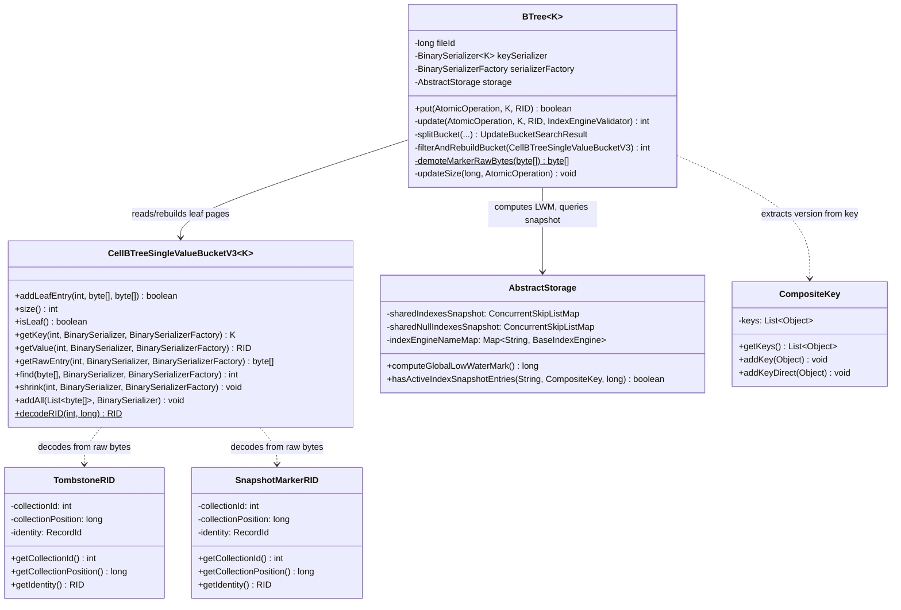
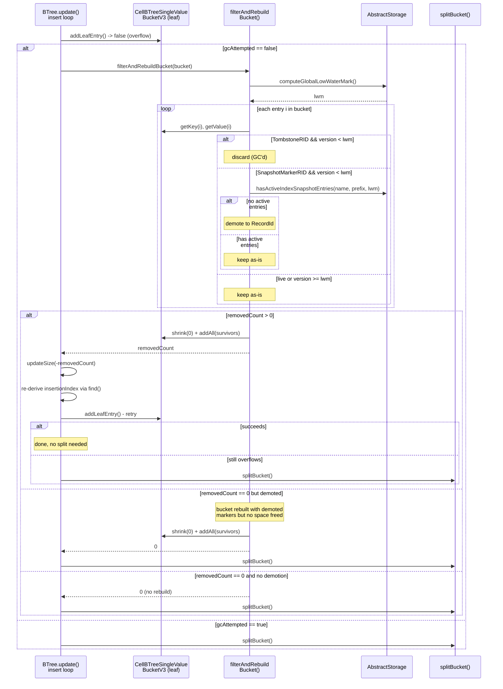
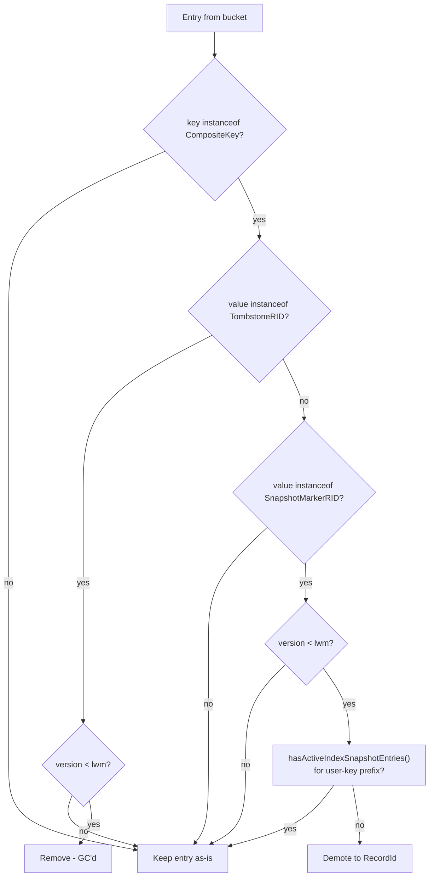
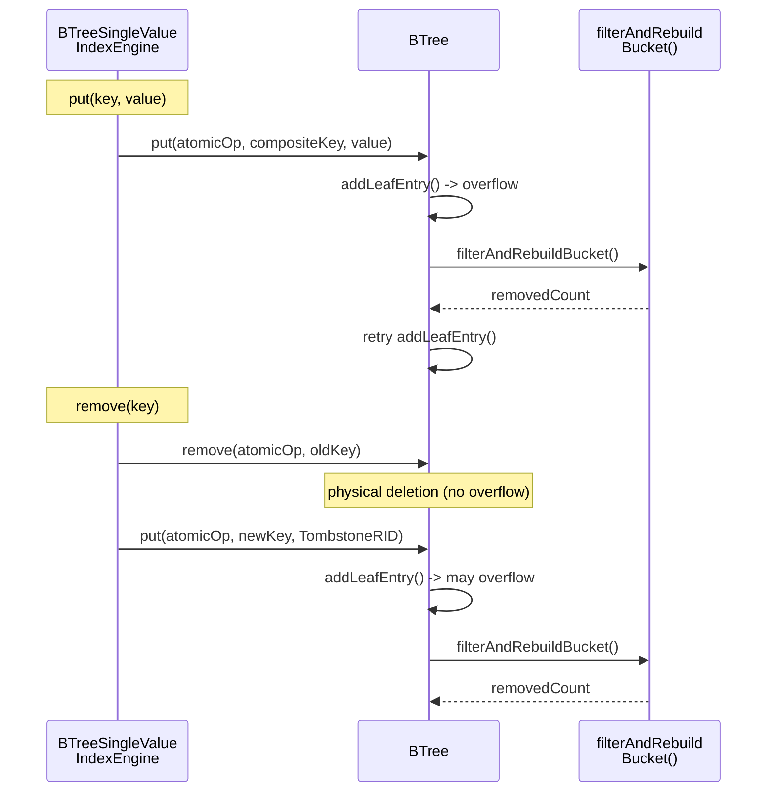

# Index BTree Tombstone GC During Leaf Bucket Overflow — Design

## Overview

The design adds tombstone garbage collection to `BTree` (the shared B-tree
implementation used by both `BTreeSingleValueIndexEngine` and
`BTreeMultiValueIndexEngine`), triggered when a leaf bucket overflows during
`put()`. When a bucket is full, the GC filters out removable `TombstoneRID`
entries and demotes stale `SnapshotMarkerRID` entries, rebuilds the bucket
with survivors only, and retries the insert. A split occurs only if the
bucket is still full after filtering.

The approach mirrors the edge tombstone GC in `SharedLinkBagBTree` but with
two key differences: (1) tombstones are removed unconditionally below LWM
(no snapshot entry check needed), and (2) `SnapshotMarkerRID` entries are
demoted to plain `RecordId` rather than removed.

## Class Design



**`BTree`** is the only class with new methods. Two private methods are added:
`filterAndRebuildBucket()` (iterates bucket entries, filters tombstones,
demotes markers, rebuilds) and `demoteMarkerRawBytes()` (rewrites the
`SnapshotMarkerRID` encoding in raw bytes). One call site is modified: the
`while (!addLeafEntry(...))` loop in `update()` (called by `put()`).

**`AbstractStorage`** gains one new public method:
`hasActiveIndexSnapshotEntries()` — resolves an engine by name (handling
the `$null` suffix for null-key trees), constructs range keys from the
user-key prefix and LWM, and queries the shared `ConcurrentSkipListMap` via
`subMap()`. Returns `true` if any snapshot entries exist with
`version >= LWM` for the user-key prefix.

**`CellBTreeSingleValueBucketV3`** is unchanged. **`TombstoneRID`** and
**`SnapshotMarkerRID`** were refactored from records to final classes with
primitive fields (avoiding intermediate `RecordId` allocation on the hot
decode path), but their on-disk encoding is unchanged — `instanceof` checks
and `demoteMarkerRawBytes()` byte-level rewriting remain valid.
**`CompositeKey`** gained `addKeyDirect()` (bypasses unmodifiable-view cache
invalidation) but `addKey()` is still the public API used by the GC.

## Workflow

### Filter-Rebuild-Retry in put()



The `update()` method (called by `put()`) already contains a
`while (!addLeafEntry(...))` loop that handles bucket overflow by splitting.
The GC is inserted as a first-attempt optimization before splitting. The
`gcAttempted` boolean ensures filtering runs at most once per `put()` call,
preventing repeated scans.

### Tombstone Eligibility Flowchart



Three outcomes for each entry:
1. **Remove** — TombstoneRID below LWM is discarded entirely. The tree
   size is decremented.
2. **Demote** — SnapshotMarkerRID below LWM with no active snapshot
   entries is rewritten to a plain RecordId in the raw bytes. The tree
   size is unchanged (entry is preserved, just re-typed).
3. **Keep** — all other entries are preserved as-is.

### Engine-Level Call Chain



Both the engine-level `put()` and `remove()` paths flow through
`BTree.put()`. The engine's `remove()` first does a physical deletion
(`BTree.remove()`), then inserts a tombstone entry (`BTree.put()`) — the
tombstone insertion can trigger overflow and thus GC. This means GC in
`BTree.put()` covers all scenarios.

## SnapshotMarkerRID Demotion Encoding

`SnapshotMarkerRID` uses a negative `collectionPosition` encoding:
`-(realPosition + 1)`. A plain `RecordId` uses the real positive value.
Demotion rewrites the last 8 bytes of the raw entry (the `collectionPosition`
field) from the negative encoding back to the real value.

Raw leaf entry layout: `[serialized_key | 2-byte collectionId | 8-byte
collectionPosition]`.

For `SnapshotMarkerRID`:
```
collectionPosition = -(realPosition + 1)
```

After demotion:
```
collectionPosition = realPosition
```

The `collectionId` remains unchanged (it is always positive for
`SnapshotMarkerRID`). This is a single `LongSerializer` read-modify-write
on the raw byte array — no deserialization/reserialization of the full entry
is needed.

**Gotcha**: The demotion modifies the byte array in-place and returns it.
The caller must ensure the byte array is the one that will be passed to
`addAll()` during bucket rebuild.

## Snapshot Query for SnapshotMarkerRID Safety

Before demoting a `SnapshotMarkerRID`, the GC must verify that no active
snapshot entries exist for the same user-key prefix with `version >= LWM`.
This prevents a scenario where:

1. A `SnapshotMarkerRID` M is demoted to `RecordId`.
2. A concurrent reader using the snapshot index sees an older version of
   the same key (stored in `IndexesSnapshot`).
3. The reader's visibility logic misinterprets the demoted entry because
   the marker flag is gone.

The check queries `AbstractStorage.hasActiveIndexSnapshotEntries()`, which:
1. Resolves the engine by name from `indexEngineNameMap` (handles `$null`
   suffix for null-key trees in multi-value indexes).
2. Constructs range keys: `CompositeKey(indexId, userKeyPrefix..., lwm)` to
   `CompositeKey(indexId, userKeyPrefix..., Long.MAX_VALUE)`.
3. Queries the shared `ConcurrentSkipListMap` via
   `subMap(lower, true, upper, true)` (inclusive on both bounds).
4. Returns `true` if any entries exist in the range.

The `indexId` used in range key construction is resolved internally from
the `engineName` parameter via `indexEngineNameMap`.

**Gotcha**: The user-key prefix is extracted by stripping the last element
(version) from the `CompositeKey`. For single-value indexes, this is the
original user key. For multi-value indexes, this includes both the user key
and the RID (e.g., `CompositeKey(userKey, rid)` without the version).

## Tree Size Accounting

Tree size is tracked in the B-tree entry point page and must equal the
actual number of leaf entries. Size changes during GC-enabled insert:

| Scenario | Size change |
|---|---|
| New entry, no GC | +1 |
| New entry, GC removed N tombstones | -N (GC) then +1 (insert) |
| Replacement (SnapshotMarkerRID), no GC | 0 (remove old -1, insert new +1) |
| Replacement with GC | -N (GC) then 0 (replacement) |
| Demotion only (no removal) | 0 (entry preserved, just re-typed) |

`updateSize(-removedCount)` is called immediately after GC succeeds.
The final `updateSize(sizeDiff)` at the end of `update()` handles the
insert itself.

Note: Rows without "GC" in the scenario name document existing behavior
for context — no changes are needed for those paths.

## Performance Characteristics

| Operation | Cost | Notes |
|---|---|---|
| LWM computation | O(T), T = active threads | Once per GC attempt. Iterates `TsMinHolder` instances, typically < 100. |
| Entry iteration | O(N), N = bucket entries | Key + value deserialization per entry. N bounded by bucket capacity (~hundreds for 8 KB pages). |
| Snapshot query | O(log S) per marker | S = snapshot index size. Only for `SnapshotMarkerRID` entries passing the LWM check. Tombstones require no snapshot query. |
| Bucket rebuild | O(N), N = survivors | `shrink(0)` + `addAll()`. Only when removedCount > 0 or demotion occurred. |
| Overall per GC attempt | O(N + M log S), M = markers | M is typically a small fraction of N. Tombstones are filtered cheaply by `instanceof` check. |

The GC adds no cost when there are no tombstones or markers in the bucket
(the `instanceof` check on each entry is the only overhead). When tombstones
exist but no markers do, there are zero snapshot queries — removal is
unconditional.
