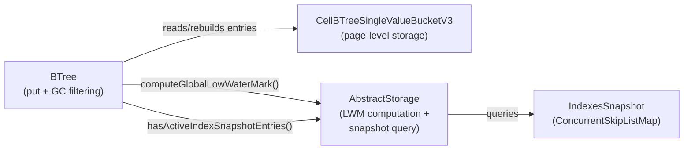

# Index BTree Tombstone GC During Leaf Bucket Overflow

## Design Document
[design.md](design.md)

## High-level plan

### Goals

Garbage-collect tombstone entries (`TombstoneRID`) and demote stale snapshot
markers (`SnapshotMarkerRID`) from index B-trees during leaf bucket overflow.
Tombstones are created by cross-transaction index updates and deletions and
accumulate indefinitely in the B-tree today, leading to index search slowdown
and wasted space. By filtering them out when a leaf bucket overflows — when
entries are already being redistributed — we reclaim space with minimal
overhead and without a separate background GC sweep.

A tombstone is safe to remove when:
1. Its version (last element of the `CompositeKey`) is strictly below the
   global low-water mark (LWM), meaning all active transactions can already
   see past the deletion.

No snapshot entry check is needed for tombstone removal — the in-memory
`IndexesSnapshot` is cleaned separately via
`AbstractStorage.evictStaleIndexesSnapshotEntries()`.

A `SnapshotMarkerRID` is safe to demote to a plain `RecordId` when:
1. Its version is strictly below LWM.
2. No snapshot entries with `version >= LWM` exist for the same user-key
   prefix in the shared `IndexesSnapshot` map.

Both `BTreeSingleValueIndexEngine` and `BTreeMultiValueIndexEngine` are
covered — they both delegate to the same `BTree.java` implementation.

### Constraints

- **Performance**: Bucket overflow is on the write hot path. The GC check
  must be cheap. Deserializing key+value for each entry adds cost, but
  the overflow already iterates all entries during split — the additional
  deserialization is bounded by bucket size (~hundreds of entries per 8 KB
  page).
- **Snapshot query cost**: Checking the index snapshot for SnapshotMarkerRID
  demotion requires a range query per marker. This is a
  `ConcurrentSkipListMap.subMap()` call — O(log n) per marker, acceptable
  during overflow handling.
- **LWM computation**: Computing the global LWM iterates all `TsMinHolder`
  instances (one per thread with active transactions). Computed once per GC
  attempt, not per entry.
- **Atomicity**: Tombstone removal during overflow must be atomic with the
  insert — both happen within the same `AtomicOperation`. The tree size
  counter must be adjusted for removed tombstones.
- **Non-leaf nodes**: Only leaf buckets contain tombstones. Internal
  (non-leaf) nodes store separator keys without values. Filtering applies
  only to leaf buckets.
- **WAL correctness**: No new WAL record types needed. Filtered entries
  simply don't appear in the rebuilt page. Crash recovery replays as-is.
- **Null-key trees**: For multi-value indexes, the null-key tree is a
  separate `BTree` instance with `$null` suffix — GC applies automatically
  since it's the same `BTree.java`. For single-value indexes, null keys use
  a single-page `CellBTreeSingleValueV3NullBucket` (not a BTree) — no GC
  applicable.
- **Only put() path**: `BTree.remove()` performs physical deletion only
  (no `addLeafEntry()`, no overflow possible). Tombstone insertion happens
  at the engine level via `BTree.put()`, so the `put()` GC path covers both
  insert and delete scenarios at the engine level.

### Architecture Notes

#### Component Map

- **BTree**: Modified to filter removable tombstones and demote stale
  markers during leaf bucket overflow in `put()`. Computes LWM once per GC
  attempt via the `storage` reference inherited from `StorageComponent`.
  Queries snapshot index via `AbstractStorage.hasActiveIndexSnapshotEntries()`
  for each `SnapshotMarkerRID` candidate.
- **CellBTreeSingleValueBucketV3**: Unchanged. Entries are filtered before
  being passed to `addAll()` on the rebuilt bucket. Existing `shrink()`,
  `addAll()`, `getRawEntry()`, `getKey()`, `getValue()`, `find()` methods
  are used as-is.
- **AbstractStorage**: New helper method `hasActiveIndexSnapshotEntries()`
  added — queries the shared `ConcurrentSkipListMap` for active snapshot
  entries by engine name and user-key prefix. Existing
  `computeGlobalLowWaterMark()` is used as-is.
- **IndexesSnapshot**: Read-only during GC check. Not modified by the
  GC filtering. Cleaned separately by `evictStaleIndexesSnapshotEntries()`.

#### D1: GC during bucket overflow vs. separate background sweep

- **Alternatives considered**:
  1. Background sweep: periodic scan of all leaf pages to remove stale
     tombstones. Requires full tree traversal, extra I/O, and a separate
     locking protocol.
  2. GC during bucket overflow (chosen): piggyback on the overflow's entry
     redistribution. Zero extra I/O — entries are already being copied.
  3. GC during reads: check and remove on read. Violates read-only
     semantics and adds write contention to reads.
- **Rationale**: Overflow handling already iterates and copies all entries.
  Filtering during this redistribution adds minimal overhead (one LWM
  computation + one snapshot query per SnapshotMarkerRID) while avoiding a
  separate sweep infrastructure. Tombstones accumulate in hot pages (pages
  that receive writes and thus overflow), so overflow-time GC naturally
  targets the right pages.
- **Risks/Caveats**: Tombstones in pages that never overflow again will
  never be collected. This is acceptable — such pages are cold and the
  space waste is bounded. A future background sweep can address this if
  needed.
- **Implemented in**: Track 1

#### D2: Filter-rebuild-retry before splitting

- **Alternatives considered**:
  1. Filter during entry collection for split: skip tombstones when
     building left/right entry lists, always proceed with the split.
  2. Filter-rebuild-retry (chosen): collect surviving entries, rebuild
     the bucket without tombstones, then retry the insert. Only proceed
     with the split if the insert still fails (bucket still full).
- **Rationale**: If tombstone removal frees enough space, the insert
  succeeds without splitting at all — avoiding an unnecessary split that
  would create two under-filled buckets. The rebuild uses the existing
  `shrink(0)` + `addAll()` pattern. This naturally handles every case:
  all entries removed (empty bucket, insert trivially succeeds), some
  removed (may or may not need split), none removed (normal split).
- **Risks/Caveats**: The rebuild adds one extra page write when
  tombstones are found but the insert still fails. When only demotions
  occur (no tombstones removed), the bucket is still rebuilt to persist
  the demoted entries, adding one page write before the inevitable split.
  Both costs are negligible compared to the split's own page writes.
- **Implemented in**: Track 1

#### D3: No snapshot check for TombstoneRID removal

- **Alternatives considered**:
  1. Check snapshot index before removing tombstones (as edge GC does).
  2. Remove tombstones unconditionally below LWM (chosen).
- **Rationale**: The edge GC must check the snapshot index because edge
  snapshot entries can linger due to lazy/threshold-based cleanup — removing
  a tombstone without checking could cause ghost resurrection via stale
  snapshot entries. For index B-trees, the `IndexesSnapshot` is cleaned
  separately via `evictStaleIndexesSnapshotEntries()`, and tombstones below
  LWM are unreachable by any active transaction. The B-tree tombstone's
  purpose is to signal "deleted" to concurrent readers; once below LWM,
  no reader needs it.
- **Risks/Caveats**: Correctness depends on the assumption that
  `IndexesSnapshot` cleanup runs independently and that stale snapshot
  entries cannot cause ghost resurrection after tombstone removal. This
  is validated by the existing `evictStaleIndexesSnapshotEntries()`
  mechanism.
- **Implemented in**: Track 1
- **Validated in**: Track 2, Track 3

#### D4: SnapshotMarkerRID demotion vs. removal

- **Alternatives considered**:
  1. Remove SnapshotMarkerRID entries (same as tombstones).
  2. Demote to plain RecordId by rewriting raw bytes (chosen).
- **Rationale**: A `SnapshotMarkerRID` marks that a key was re-inserted
  or updated — the underlying `RecordId` is still a valid live value.
  Removing it would lose the live entry. Demotion rewrites the negative
  `collectionPosition` encoding back to positive, converting the marker
  to a plain `RecordId` while preserving the entry.
- **Risks/Caveats**: Demotion must only happen when no active snapshot
  entries exist for the user-key prefix with `version >= LWM`. Otherwise,
  a concurrent reader using the snapshot index could see inconsistent
  state.
- **Implemented in**: Track 1
- **Validated in**: Track 2, Track 3

#### D5: LWM computation — once per GC attempt

- **Alternatives considered**:
  1. Cache LWM globally with periodic refresh.
  2. Compute per entry.
  3. Compute once per GC attempt (chosen).
- **Rationale**: LWM computation iterates `TsMinHolder` instances
  (typically <100). Computing once per GC attempt amortizes the cost
  across all entry checks.
- **Risks/Caveats**: LWM may advance between computation and use. This
  is safe — using a stale (lower) LWM is conservative: we may skip some
  eligible entries but never remove one prematurely.
- **Implemented in**: Track 1
- **Validated in**: Track 2, Track 3

#### Invariants

- **No ghost resurrection**: After tombstone removal, the index read
  path (via `iterateEntriesBetween()` and snapshot lookups) must never
  return a live entry for an index key that was deleted. Guaranteed by
  the LWM threshold — all active transactions see past the tombstone.
- **Tree size consistency**: The entry point's `treeSize` must equal the
  actual number of leaf entries. Tombstone removal must decrement the
  counter via `updateSize(-removedCount, atomicOperation)`.
- **No unnecessary splits**: If tombstone removal frees enough space for
  the insert, no split occurs — the tree depth and bucket count remain
  unchanged.
- **Partition invariant**: `removedCount + survivors.size() == bucketSize`
  — every original entry is either removed or kept.
- **SnapshotMarkerRID demotion safety**: A marker is demoted only when no
  active snapshot entries exist for the same user-key prefix with
  `version >= LWM`.

#### Integration Points

- **`BTree.update()` while loop (called by `put()`)**: Entry point for
  the GC logic. The filtering happens before `splitBucket()` when
  `addLeafEntry()` fails.
- **`AbstractStorage.computeGlobalLowWaterMark()`**: Existing method,
  already used by snapshot cleanup.
- **`AbstractStorage.hasActiveIndexSnapshotEntries()`**: New method —
  queries the shared `ConcurrentSkipListMap` for active snapshot entries
  by engine name and user-key prefix.
- **`BTree.updateSize()`**: Existing method to adjust tree size counter.

#### Non-Goals

- Background sweep of cold pages (tombstones in pages that never overflow).
- GC of non-tombstone stale versions (these go to the snapshot index and
  are already cleaned by `evictStaleIndexesSnapshotEntries()`).
- Compaction or defragmentation of pages after tombstone removal.
- IndexesSnapshot cleanup — handled separately, out of scope.

## Checklist

- [x] Track 1: Core GC implementation in BTree and AbstractStorage
  > Implement tombstone GC and SnapshotMarkerRID demotion during leaf
  > bucket overflow in `BTree.put()`. This is the core implementation
  > track, following the filter-rebuild-retry pattern established by the
  > edge GC in `SharedLinkBagBTree`.
  >
  > **Track episode:**
  > Implemented tombstone GC and SnapshotMarkerRID demotion during leaf
  > bucket overflow in `BTree.put()`, following the filter-rebuild-retry
  > pattern from `SharedLinkBagBTree`. Added `filterAndRebuildBucket()`
  > — removes TombstoneRID below LWM, demotes SnapshotMarkerRID below
  > LWM when no active snapshot entries exist, rebuilds bucket via
  > `shrink(0)` + `addAll()`. GC runs at most once per insert via
  > `gcAttempted` flag. Added `hasActiveIndexSnapshotEntries()` to
  > `AbstractStorage` with `stateLock.readLock()` protection. Also added
  > `getIndexSnapshotByEngineName()` / `getNullIndexSnapshotByEngineName()`
  > helpers for Track 2. Key discovery: `indexEngineNameMap` is a plain
  > `HashMap` requiring `stateLock` — fixed by adding `stateLock.readLock()`
  > around the map lookup. Post-validation against edge GC found two
  > missing defensive assertions (post-rebuild size checks, strict LWM
  > positivity) — aligned.
  >
  > **Step file:** `tracks/track-1.md` (1 steps, 0 failed)
  >
  > **Strategy refresh:** CONTINUE — no downstream impact detected. Track 2/3 assumptions remain valid; helpers for Track 2 confirmed available.
  >
  > **What**:
  > - Add `filterAndRebuildBucket()` to `BTree` — iterates all entries
  >   in a leaf bucket, collects survivors (removing TombstoneRID below
  >   LWM, demoting SnapshotMarkerRID below LWM when safe), rebuilds the
  >   bucket via `shrink(0)` + `addAll()`.
  > - Add `demoteMarkerRawBytes()` static helper — rewrites the negative
  >   `collectionPosition` encoding of `SnapshotMarkerRID` back to positive.
  > - Integrate GC into `BTree.put()` `while (!addLeafEntry(...))` loop:
  >   before calling `splitBucket()`, attempt tombstone filtering at most
  >   once per insert (`gcAttempted` flag). If tombstones removed, update
  >   tree size and re-derive insertion index, then retry.
  > - Add `hasActiveIndexSnapshotEntries()` to `AbstractStorage` — queries
  >   the shared `ConcurrentSkipListMap` for active snapshot entries by
  >   engine name and user-key prefix. Handles `$null` suffix resolution.
  >
  > **Constraints**:
  > - LWM computed once per GC attempt.
  > - GC runs at most once per insert — `gcAttempted` flag prevents
  >   repeated filtering.
  > - Only leaf buckets are filtered.
  > - WAL: no new record types; filtered entries don't appear in rebuilt
  >   page.
  > - Applies to both single-value and multi-value index engines
  >   (both use `BTree.java`).
  >
  > **Scope:** ~3-4 steps covering BTree GC filtering methods, put() loop
  > integration, and AbstractStorage snapshot query helper

- [x] Track 2: Tests for index tombstone GC
  > Comprehensive tests verifying tombstone GC correctness during bucket
  > overflow. Tests must cover: basic tombstone removal, LWM boundary
  > conditions, SnapshotMarkerRID demotion, snapshot entry preservation,
  > live entry safety, tree size consistency, and mixed scenarios.
  >
  > **Track episode:**
  > Comprehensive test suite for BTree tombstone GC (15 tests, 95.6% line /
  > 90.0% branch coverage). Covers tombstone removal below LWM, preservation
  > above and at-exact LWM, no ghost resurrection, live entry safety,
  > SnapshotMarkerRID demotion with/without active snapshot entries, tree size
  > consistency, splits with no GC candidates, mixed entry types, sort order
  > preservation, and AbstractStorage helper edge cases. Key discovery: GC
  > triggers during initial insertion phase — bucket overflows during
  > tombstone/marker insertion cause GC on already-inserted entries.
  > Assertions use `isLessThan(before / 2)` thresholds to catch regressions
  > while accommodating this behavior. No cross-track impact — Track 3
  > assumptions remain valid.
  >
  > **Step file:** `tracks/track-2.md` (2 steps, 0 failed)
  > **Depends on:** Track 1
  >
  > **Strategy refresh:** CONTINUE — no downstream impact detected. Track 3 assumptions remain valid.

- [x] Track 3: Concurrent and durability tests
  > Robustness tests verifying tombstone GC correctness under concurrent
  > access and after non-graceful shutdown.
  >
  > **Track episode:**
  > Comprehensive concurrent and durability test suite for BTree tombstone
  > GC (3 stress tests + 1 durability test). Stress tests cover: concurrent
  > put with interleaved tombstones/live entries (cross-thread GC
  > correctness), concurrent put-and-remove with pre-populated entries
  > (remover/inserter interleaving), and concurrent read-during-write
  > (optimistic read path under GC-triggered bucket restructuring). Durability
  > test verifies index state after non-graceful close — both full-scan and
  > index-directed lookups confirm no ghost resurrection and no data loss. No
  > cross-track impact — all findings resolved in-track.
  >
  > **Step file:** `tracks/track-3.md` (2 steps, 0 failed)
  > **Depends on:** Track 1
  >
  > **Strategy refresh:** CONTINUE — all implementation tracks complete, no downstream impact.

## Final Artifacts
- [x] Phase 4: Final artifacts (`design-final.md`, `adr.md`)
