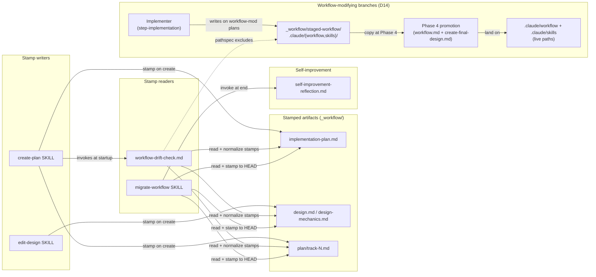

# In-Place Workflow Migration — Architecture Decision Record

## Summary

The `/migrate-workflow` skill now runs entirely inside the branch's own worktree. Per-artifact SHA stamps on line 1 of every ephemeral `_workflow/**` artifact replace the develop-versus-branch fork-point heuristic. The drift gate and the migration both compute `BASE_SHA..HEAD` from those stamps; the branch is treated as a self-contained capsule, so no `git fetch origin develop` runs at gate time. A second class of branches (those whose plan edits `.claude/workflow/**` or `.claude/skills/**`) stages its workflow changes under `<plan-dir>/_workflow/staged-workflow/`, keeping the live workflow at develop's state throughout execution; a Phase 4 promotion commit lands the staged subtree on the live tree immediately before the final-artifacts commit.

The shipped scope matches the plan. Two execution-time adjustments: the drift-gate file received a full caller-symmetric sweep (12 surfaces) rather than the originally scoped intro-only generalization, and the staging-architecture track surfaced four follow-on design enhancements that were filed as separate `dev-workflow` issues rather than absorbed into this PR.

## Goals

Move `/migrate-workflow` from a develop-worktree-driven, two-worktree dance into a single in-branch operation. Replace the fork-point heuristic with per-artifact workflow-SHA stamps so the migration's "what range do I replay?" decision is data-driven and survives rebases. Add a self-improvement reflection step to the skill so per-session frictions feed the same `dev-workflow` YouTrack queue that `/execute-tracks` already populates.

The skill previously required the user to switch to a `develop` worktree, run the migration against a separate branch worktree, and then rebase the migrated workflow files back into the branch's working topology. Each handoff between worktrees was a place to forget which worktree owned which file. The replacement runs entirely inside the branch's own worktree; the migration's input range is read from stamps on the artifacts it migrates, and the resulting edits land directly on the branch where they're needed.

## Constraints

- **Branch is a self-contained capsule.** Workflow commits enter the branch's view only via explicit rebase or merge. Drift detection and migration both range over `BASE_SHA..HEAD`, scoped to the active plan's `_workflow/` directory, never against `origin/develop`; no `git fetch` is part of the gate. See D10 (range bound) and D13 (per-plan scope).
- **Backward compatibility with legacy artifacts.** Branches alive at the time of this work had no stamps. The drift check treats unstamped-artifact presence as drift unconditionally and routes to migration; the migration prompts the user once for a base SHA covering every unstamped artifact in the active plan, then proceeds. The first successful migration of a legacy branch writes stamps to all its artifacts as a side effect; no separate backfill script. There is no silent fallback to any auto-computed reference — see D8 for why.
- **No Phase 4 stamping.** `design-final.md` and `adr.md` survive merge into `develop` and never get re-migrated. Stamping them is dead weight; the parser scopes to `_workflow/**`.
- **Markdown-only change.** No Java, no scripts, no hooks beyond what already exists. Bash one-liners embedded in the relevant SKILL and workflow files do the SHA reads.
- **House style applies to every Markdown surface touched.** SKILL bodies, workflow rule files, and the artifact templates this work edits all live under the full Tier-A coverage of `.claude/workflow/conventions.md` §1.5: banned vocabulary, em-dash discipline, BLUF leads.

## Architecture Notes

### Component Map

- **`create-plan` SKILL** emits the stamp on line 1 of `implementation-plan.md` and each `plan/track-N.md` it creates. Invokes the drift gate at session start so a re-invocation after the user rebases the branch onto a newer develop catches post-rebase drift before any research investment. A one-line bash helper computes the SHA: `git log -1 --format=%H HEAD -- .claude/workflow .claude/skills`, with `git rev-parse HEAD` as the empty-output fallback.
- **`edit-design` SKILL** emits the stamp on `design.md` (`phase1-creation` mutation) and `design-mechanics.md` (`length-trigger-crossing` mutation). Stamp updates only on migration replay, never on subsequent mutation kinds. `design-mutations.md` is deliberately excluded; see Non-Goals.
- **`workflow-drift-check.md`** walks every `_workflow/**` artifact in the active plan's `_workflow/` directory (D13) and reads each line-1 stamp. Any unstamped artifact triggers drift unconditionally; the gate skips the fold and routes to migration. When every artifact is stamped, the fold runs and the gate compares `BASE_SHA..HEAD` against workflow paths (no `git fetch`). On no-drift with non-uniform stamps, normalizes every stamp to the fold result and creates a separate commit (D11). Invoked from both `/execute-tracks` turn 1 and `/create-plan` between Step 1 and Step 1a.
- **`migrate-workflow` SKILL** runs against the active plan's `_workflow/` directory (D13; one plan at a time, matching today's skill contract). Preflight refuses on develop-worktree requirement (dropped) and on tracked-uncommitted or untracked files under the active plan's `_workflow/**` (D12; progress-sentinel carve-out kept). When unstamped artifacts exist, the skill prompts the user once for a base SHA covering the unstamped set, validates it, and folds it in with the stamped set. Range is `BASE_SHA..HEAD`. A final post-loop step re-stamps every artifact in the active plan to `HEAD`'s SHA in one batch (D2).
- **`self-improvement-reflection.md`** gains a session-type parameter (`execute-tracks` or `migrate-workflow`) controlling the commit-clean check, phase value, and applicability text. The `migrate-workflow` SKILL gains a final step that invokes it.
- **`implementer-rules.md` and `step-implementation.md`** gain a path-mapping rule so an implementer working on a workflow-modifying plan writes to `<plan-dir>/_workflow/staged-workflow/.claude/{workflow,skills}/...` instead of the live paths. The rule is silent on plans that don't modify workflow tooling. Sourced from D14.
- **`workflow.md` § Final Artifacts and `prompts/create-final-design.md`** gain a "Promote workflow changes" step that copies the staged subtree to the live paths in one commit before the existing final-artifacts commit, on plans where `<plan-dir>/_workflow/staged-workflow/` exists. Changes Phase 4 from a two-commit shape to a three-commit shape on workflow-modifying plans. Sourced from D14.
- **`workflow-drift-check.md` pathspec site** gains a defensive comment at `git log ... -- .claude/workflow .claude/skills` noting that the path scoping naturally excludes the staged subtree under `docs/adr/*/_workflow/staged-workflow/...`. The exclusion already holds by virtue of the prefix difference; the comment documents the property so future edits don't break it.
- **`conventions.md` §1.6 staging invariant** records the I6 statement as the canonical source the plan-file restatement cross-references. Sourced from D14.

### Decision Records

#### D1: Per-artifact SHA stamp, not single sentinel

- **Alternatives considered**: single `_workflow/.workflow-sha` sentinel file; mixed scheme (stamps + summary sentinel cache).
- **Rationale**: per-artifact stamps let any single stamp serve as the durable progress marker mid-migration — a `/clear` between per-commit replays leaves stamps non-uniform, and the next session reads any stamp to find the last-replayed SHA. A single sentinel loses that crash-resume property: the sentinel would have to be written atomically alongside each per-commit replay to play the same role, doubling the writer site and adding a sync-or-corrupt failure mode. Secondary benefits: stamps survive file copies, isolated re-creation carries provenance, the user's framing was explicit ("each workflow artifact has a SHA").
- **Risks/Caveats**: marginally more parsing work in the drift check and migration. Cost is one `head -1` per artifact — negligible.
- **Implemented in**: stamp format and parser idioms in `.claude/workflow/conventions.md` §1.6; writer sites in `.claude/skills/create-plan/SKILL.md` and `.claude/skills/edit-design/SKILL.md`; reader sites in `.claude/workflow/workflow-drift-check.md` and `.claude/skills/migrate-workflow/SKILL.md`.
- **Full design**: `design-final.md` §"Core Concepts" + §"Stamp range computation"

#### D2: Lockstep per-commit advance + final stamp-to-HEAD batch

- **Alternatives considered**: advance only the stamps of artifacts a given commit edited; skip per-commit advance entirely (only stamp to HEAD at end).
- **Rationale**: per-commit lockstep advance preserves crash-resume. The next session reads any stamp; if it equals HEAD the migration completed, otherwise replay resumes from where the stamps point. A final post-loop step then re-stamps every artifact to `HEAD`'s SHA in one batch — including artifacts every per-commit replay skipped. Final invariant: post-migration, every stamp equals `git rev-parse HEAD`. Per-artifact advancement creates an irregular tree of stamps; skipping the per-commit phase loses crash resumption.
- **Risks/Caveats**: an artifact untouched by any replayed commit still ends at HEAD's SHA. Correct semantics — the artifact is synced to the workflow state HEAD reflects, even when the replays didn't touch it. The HEAD-final stamp replaces the prior "last replayed commit's SHA" framing (see D10).
- **Implemented in**: per-commit advance sub-step and final HEAD batch in `.claude/skills/migrate-workflow/SKILL.md`.
- **Full design**: `design-final.md` §"Per-commit replay and lockstep advance"

#### D3: Ephemeral artifacts only, no Phase 4 stamping

- **Alternatives considered**: stamp `design-final.md` and `adr.md` for symmetry.
- **Rationale**: Phase 4 artifacts survive squash-merge into `develop`. They become git history at that point and no per-branch migration ever applies to them. Stamping them adds a writer site without a reader.
- **Risks/Caveats**: parser must scope to `_workflow/**`. One extra glob check.
- **Implemented in**: positive list in `.claude/workflow/conventions.md` §1.6(f); exclusion respected by `.claude/skills/edit-design/SKILL.md`'s `phase4-creation` branch (which skips the stamp directive).

#### D4: "Migrate now" ends session; user re-invokes `/migrate-workflow`

- **Alternatives considered**: run migration inline in the same session after the user picks Migrate now.
- **Rationale**: the migration skill has its own per-commit context-check loop and resume protocol. Mixing two long-running protocols in one session risks a mid-migration context warning triggering the wrong handoff. Ending the session keeps the boundary clean — matches today's contract; only the worktree changes.
- **Risks/Caveats**: one extra `/clear` for the user. Acceptable.
- **Implemented in**: § Resolutions of `.claude/workflow/workflow-drift-check.md`.

#### D5: No legacy backfill — migration's user-prompt bootstraps stamps

- **Alternatives considered**: backfill script that walks `docs/adr/*/_workflow/` on every active branch and writes stamps en masse.
- **Rationale**: the migration's unstamped-artifact prompt (see D8) is already the bootstrap path. A separate backfill script would duplicate that prompt outside the migration loop, with the added coordination cost of remembering to run it on every active branch. The migration already runs whenever drift surfaces; bundling bootstrap into the migration keeps one path.
- **Risks/Caveats**: legacy branches with no pending drift still need to be migrated to acquire stamps. In practice every legacy branch hits drift the moment any workflow commit lands on `develop` after it was cut, so the bootstrap usually happens on the next `/execute-tracks` startup. Branches that never re-engage with the workflow gate keep their unstamped state, which is fine — they're inert.
- **Implemented in**: bootstrap prompt step in `.claude/skills/migrate-workflow/SKILL.md`.

#### D6: Parameterize `self-improvement-reflection.md`, don't fork it

- **Alternatives considered**: new file `migrate-workflow-reflection.md` mirroring most of the protocol.
- **Rationale**: the reflection protocol is genuinely the same. The differences are small (commit-clean check, phase identifier, applicability sentence). Adding a session-type parameter keeps one source of truth; the alternative duplicates ~600 lines of stable protocol for the sake of three conditional clauses.
- **Risks/Caveats**: the parameter has to be plumbed through ten conditional surfaces inside the protocol document. The actual implementation revealed this number; see Key Discoveries.
- **Implemented in**: `## Inputs` block, applicability sentence, skip-conditions, friction examples, procedure Step 2 conditional, and template literals in `.claude/workflow/self-improvement-reflection.md`; final-step invocation in `.claude/skills/migrate-workflow/SKILL.md`.

#### D7: HTML-comment stamp on line 1, before the H1

- **Alternatives considered**: YAML frontmatter; trailing-line footer; first-line H1 attribute.
- **Rationale**: `<!-- workflow-sha: <40-char SHA> -->` on line 1 is invisible in rendered Markdown, parseable with `head -1` plus a grep, and gives the artifact a uniform top-of-file location no matter what the H1 says. Frontmatter is the established convention for `.claude/skills/**` SKILL bodies, so the "new convention to learn" framing is wrong — but adopting frontmatter for `_workflow/**` would force a one-shot rewrite of every existing artifact across every in-flight branch (line 1 shifts down by `---\n<keys>\n---\n`), and the migration replay against pre-frontmatter snapshots would have to special-case that line-1 shift on every commit. The HTML-comment scheme touches existing artifacts less intrusively: one new line at the top, no document-shape change otherwise. Trailing-line footer is fragile against append operations.
- **Risks/Caveats**: line 1 has to be the stamp, line 2 has to be the H1 — a writer that gets this wrong leaves a malformed file. Format check is a one-line regex.
- **Implemented in**: format definition in `.claude/workflow/conventions.md` §1.6(a) plus canonical parser idioms in §1.6(a1).
- **Full design**: `design-final.md` §"Core Concepts"

#### D8: Ask user for unstamped-artifact base SHA, don't silently auto-compute

- **Alternatives considered**: silently default unstamped artifacts to `HEAD`; silently default to `git merge-base origin/develop HEAD`; silently default to fork-point with develop; halt the migration with a generic error and refuse to proceed.
- **Rationale**: any auto-computed reference fails after rebase. A legacy branch's unstamped artifacts, rebased onto a develop that has had workflow commits in the meantime, would have any auto-computed reference land at (or near) the new HEAD — and the silent fallback would then declare the artifacts already-synced, skipping the migration. The data loss is silent: artifacts stay at their unmigrated content while the drift gate reports "no drift." A one-time prompt at migration time forces the bootstrap event into the in-conversation paper trail; a silent default produces a fold result with no documented anchor for "what SHA did we assume?" The prompt does not by itself guarantee correctness: a user supplying a semantically wrong but technically valid SHA produces a fold that's only partially caught by the per-commit replay loop's halt-on-ambiguity (a too-old SHA silently bloats the replay range; a too-new SHA silently skips needed migrations). The prompt is the documentation anchor, not the safety net.
- **Risks/Caveats**: one prompt per migration session on legacy branches (a small UX cost). Mitigated by presenting the prompt only when unstamped artifacts exist — fully-stamped branches never see it. The user has to supply a meaningful SHA; if they pick wrong, the per-commit replay loop's halt-on-ambiguity contract surfaces the mismatch.
- **Implemented in**: short-circuit on unstamped-artifact presence in `.claude/workflow/workflow-drift-check.md`; user prompt with two-subcommand validation and three-attempt cap in `.claude/skills/migrate-workflow/SKILL.md`.
- **Full design**: `design-final.md` §"Core Concepts" + §"Stamp range computation"

#### D9: Drift gate fires at `/create-plan` startup, not only `/execute-tracks`

- **Alternatives considered**: gate only at `/create-plan` Step 4 (just-before-write); gate uniformly at every workflow-touching skill startup; rely on the user to re-invoke after rebasing.
- **Rationale**: between planning sessions the user rebases onto a newer develop to pick up critical workflow changes; after a rebase, HEAD's history contains imported workflow commits the artifacts haven't been migrated to. Without a gate at `/create-plan` startup, a subsequent planning session would mutate `_workflow/**` atop the drifted shape. Gating `/create-plan` startup catches that case before research investment. Gating at Step 4 wastes prior session work; uniform gating across every skill is overkill — `/edit-design` runs only inside parent skills, so transitive coverage holds.
- **Risks/Caveats**: research-only `/create-plan` sessions on a branch with existing artifacts pay the one-`git log` gate cost even when no writes will follow. Acceptable.
- **Implemented in**: Step 1.5 of `.claude/skills/create-plan/SKILL.md`; full caller-symmetric language sweep across `.claude/workflow/workflow-drift-check.md`.

#### D10: Comparison range is `BASE_SHA..HEAD`; branch is a self-contained capsule

- **Alternatives considered**: `BASE_SHA..origin/develop` (the develop-relative comparison the prior `/execute-tracks` gate used); a hybrid (compare against `origin/develop` when reachable, fall back to HEAD); compare against `git merge-base origin/develop HEAD`.
- **Rationale**: workflow commits enter the branch's view only when the user explicitly rebases (or merges develop). Until then, the branch's drift is purely a function of its own commit graph. Comparing against `origin/develop` would force a `git fetch` on every gate run and surface drift the user hasn't opted into; comparing against HEAD ties detection to the explicit rebase event. The hybrid options muddy the semantics for marginal benefit.
- **Risks/Caveats**: on a workflow-modifying branch (the very branch where this plan ran), the user's own workflow commits register as drift, triggering migration of in-progress workflow changes. Accepted as dogfood — and the staging convention in D14 resolves it cleanly for future workflow-modifying branches.
- **Implemented in**: range definition in `.claude/workflow/conventions.md` §1.6(c); drift check `.claude/workflow/workflow-drift-check.md`; migration range derivation in `.claude/skills/migrate-workflow/SKILL.md`.
- **Full design**: `design-final.md` §"Stamp range computation"

#### D11: On no-drift with non-uniform stamps, normalize to fold result + auto-commit

- **Alternatives considered**: leave stamps as-is on no-drift; normalize but don't auto-commit (let the user fold the stamp change into their next commit); always normalize regardless of stamp uniformity.
- **Rationale**: when the drift gate determines no drift but artifacts carry distinct stamps (typically because they were created or last migrated at different times), normalizing every stamp to the fold result collapses future-gate computation from N-way pairwise `git merge-base` to a single-value read. The performance gain is small on today's plan sizes (~50–250 ms per gate run for a 4–6-artifact plan); the load-bearing reason for the auto-commit is auditability — the stamp change lands in git history rather than riding along with the user's next code commit, and a reviewer can see "the gate normalized stamps" as a discrete history entry. Leaving stamps as-is is also workable; the chosen approach future-proofs the gate against larger plans and against future `_workflow/**` schema changes that shift stamps around. Deferring the commit risks the stamp change tangling with the user's next code commit.
- **Risks/Caveats**: an extra commit appears on the branch on a no-drift gate run with non-uniform stamps. One commit per such run; branches with already-uniform stamps see none. The auto-commit must verify that nothing outside the stamp lines changes in the diff before committing (refuses otherwise to avoid swallowing unrelated edits).
- **Implemented in**: no-drift normalization section of `.claude/workflow/workflow-drift-check.md` with two-pronged diff-shape guard (`git diff -U0` hunk-header check + `git status --porcelain` cross-check + `git checkout` restore on mismatch).
- **Full design**: `design-final.md` §"Workflow → Drift detection at session startup"

#### D12: Migration preflight refuses on uncommitted or untracked `_workflow/**` state

- **Alternatives considered**: silently stash; warn and continue; pure clean-tree check across the whole repo (today's behavior, modulo progress-sentinel).
- **Rationale**: the migration mutates files under `_workflow/**` and commits them. Uncommitted edits or untracked files in that subtree would either get clobbered by the migration's writes or get pulled into the migration's commit boundaries unintentionally. Stashing is destructive (the user might not realize their stash got popped on top of migrated content); warn-and-continue normalizes around the failure mode rather than preventing it. The whole-repo clean check is too strict — unrelated edits under `core/` or `server/` have no bearing on the migration.
- **Risks/Caveats**: the progress-sentinel carve-out remains so the migration can manage its own transient file. Users with unfinished planning work under `_workflow/**` see a refusal until they commit, stash, or remove those files.
- **Implemented in**: narrow-scope dirty-tree check in preflight of `.claude/skills/migrate-workflow/SKILL.md`.

#### D13: Drift detection and migration scope to the active plan directory, not the whole branch

- **Alternatives considered**: walk every `docs/adr/*/_workflow/` on the branch and fold their stamps together; restrict only the migration to one plan while keeping the drift check branch-wide.
- **Rationale**: each plan directory is migrated independently. Folding stamps across plans yields a `BASE_SHA` that's older than the active plan needs, inflating the replay range with commits the active plan was always synced past. The session itself is already plan-scoped (the `/create-plan <dir>` and `/execute-tracks <dir>` invocations operate on one plan), and today's `/migrate-workflow` already targets exactly one plan (prompts the user to pick when multiple plan directories exist on the branch). A branch-wide drift check would surface drift the migration that's supposed to resolve it cannot act on as a unit. The convention on this project is one plan directory per branch; the rare multi-plan-per-branch case sees drift in non-active plans only when the user invokes a session against them.
- **Risks/Caveats**: a user on a multi-plan branch who runs a session against plan A doesn't learn about drift in plan B until they invoke a session against plan B. Notification is delayed, not lost; data integrity holds.
- **Implemented in**: active-plan-scope rule in `.claude/workflow/conventions.md` §1.6(g); drift check `.claude/workflow/workflow-drift-check.md`; migration range derivation and replay in `.claude/skills/migrate-workflow/SKILL.md`; gate at `/create-plan` startup in `.claude/skills/create-plan/SKILL.md`.
- **Full design**: `design-final.md` §"Stamp range computation"

#### D14: Stage workflow document changes under `<plan-dir>/_workflow/staged-workflow/`; promote at Phase 4

- **Alternatives considered**: edit `.claude/workflow/**` and `.claude/skills/**` directly in place (the prior behavior); separate git worktree on a sibling branch holding only the workflow changes; per-track Phase C citation hygiene plus migration-side surfacing of plan-content drift (an earlier draft of this decision).
- **Rationale**: workflow-modifying branches face a bootstrap problem the in-place pattern does not solve. Staging the workflow changes under `<plan-dir>/_workflow/staged-workflow/.claude/workflow/...` and `.../staged-workflow/.claude/skills/...` keeps the branch's own live workflow at develop's state throughout execution. At Phase 4, a "Promote workflow changes" step copies the staged subtree to the live paths in one commit, immediately before the existing final-artifacts commit. The earlier draft routed plan-content drift through per-track Phase C hygiene and migration-side surfacing; isolation at the source is cleaner.
- **Risks/Caveats**: branches cannot dogfood the new workflow during execution. Bugs surface at promotion time. Mitigation: optional smoke-test via a sibling test branch. Promotion conflicts follow the rebase conflict shape. The drift gate's `git log` pathspec naturally excludes the staged subtree because the staged paths live under a different prefix; a defensive comment lands at the pathspec site so a future broadening of the pathspec is forced to acknowledge the exclusion explicitly.
- **Implemented in**: path layout, canonical marker sentence, two-signal detection split, reads-precedence rule, additive-only contract, and resume semantics in `.claude/workflow/conventions.md` §1.7; path-mapping rule and pre-commit gate in `.claude/workflow/implementer-rules.md`; prompt-template static block reference in `.claude/workflow/step-implementation.md`; three-commit Phase 4 shape in `.claude/workflow/workflow.md` § Final Artifacts and `.claude/workflow/prompts/create-final-design.md` Step 4.
- **Full design**: `design-final.md` §"Staging for workflow-modifying branches"

### Invariants & Contracts

- **I1**: Every `_workflow/**` artifact created by the writer sites carries `<!-- workflow-sha: <40-char SHA> -->` on line 1, with the H1 on line 2.
- **I2**: At the moment the migration's final stamp-to-HEAD batch completes, every stamped artifact in the active plan's `_workflow/` has its line-1 SHA equal to `git rev-parse HEAD`. The user's subsequent commit of the migration's working-tree changes moves HEAD forward; this invariant is a snapshot at batch completion, not a steady-state claim.
- **I3**: When every artifact in the active plan's `_workflow/` is stamped, the drift detection range is `BASE_SHA..HEAD`, where `BASE_SHA` is the oldest stamp reachable from HEAD — derived by folding the active plan's stamps pairwise through `git merge-base`. When any artifact in the active plan is unstamped, the drift check short-circuits to "drift detected" and the migration extends the fold input set by a user-supplied base SHA covering the unstamped set.
- **I4**: Mutations through `edit-design` (`content-edit`, `section-add`, `section-move`, `structural-rewrite`) never touch the stamp's text and never displace it from line 1. Only artifact creation, migration replay, and no-drift normalization write the stamp. Line-1 position preservation is the runtime complement to the no-touch rule; together they keep the stamp parseable from `head -1` after any mutation sequence.
- **I5**: After a no-drift gate run with non-uniform stamps in the active plan, one of two states holds: either every stamped artifact's line-1 SHA equals the fold result AND a separate commit captures the normalization, or the working tree is restored to its pre-normalization state and no commit is created (the diff-shape check refused because the working tree carries unrelated edits). The "in-between" state (stamps rewritten on disk without a normalization commit) is not reachable under correct invocation.
- **I6**: On workflow-modifying branches (plans whose execution writes to `.claude/workflow/**` or `.claude/skills/**`), the live workflow paths in the branch's checkout stay at develop's state throughout execution. Workflow document changes accumulate under `<plan-dir>/_workflow/staged-workflow/.claude/{workflow,skills}/...` instead; the Phase 4 promotion commit is the only transition that moves the staged content to the live paths.

### Integration Points

- **`/create-plan` Step 4 templates** — stamp written at the top of `implementation-plan.md` and each `plan/track-N.md` immediately before the H1.
- **`edit-design` skill `phase1-creation`** — stamp written at the top of `design.md`; same for `design-mechanics.md` when mechanics is created during `length-trigger-crossing`. `design-mutations.md` is deliberately excluded (see Non-Goals).
- **`workflow-drift-check.md` Detection section** — uses stamp-walking logic scoped to the active plan's `_workflow/` directory (D13); range is `BASE_SHA..HEAD` (no `git fetch`); short-circuits to "drift detected" whenever any artifact in the active plan is unstamped. On no-drift with non-uniform stamps in the active plan, normalizes every artifact's stamp to the fold result and creates a separate commit.
- **`migrate-workflow` SKILL preflight** — refuses to start if any tracked file under the active plan's `_workflow/**` has uncommitted changes (working tree or index), or if any untracked file lives there (D13 scope). Progress-sentinel carve-out kept.
- **`migrate-workflow` SKILL range and replay** — same stamp-walking logic for range computation, scoped to the active plan's `_workflow/` (D13); range is `BASE_SHA..HEAD`. The bootstrap step prompts the user for a base SHA covering unstamped artifacts in the active plan (when any exist). The per-commit replay loop advances stamps in lockstep after each commit's replay; the final batch re-stamps every artifact in the active plan to `HEAD`'s SHA in one batch after the loop exits.
- **`migrate-workflow` SKILL final step** — invokes `self-improvement-reflection.md` with `session-type=migrate-workflow`.
- **`/create-plan` SKILL between Step 1 and Step 1a** — invokes `workflow-drift-check.md` after reading the workflow docs and before the handoff scan. Three resolutions translate symmetrically with `/execute-tracks`: Migrate now ends the session for in-branch `/migrate-workflow`; Defer continues knowing artifacts may be drifted; Suppress same continue path without the session-end reminder.
- **Phase 4 promotion step in `workflow.md` § Final Artifacts** — copies `<plan-dir>/_workflow/staged-workflow/.claude/{workflow,skills}/**` to the corresponding live paths in one commit before the final-artifacts commit; fires only for workflow-modifying plans (detected by the presence of `<plan-dir>/_workflow/staged-workflow/.claude/`). Changes Phase 4 from a two-commit shape (final-artifacts + cleanup) to a three-commit shape (promote-staged-workflow + final-artifacts + cleanup) on those plans only.

### Non-Goals

- Stamping Phase 4 final artifacts (`design-final.md`, `adr.md`).
- Stamping `design-mutations.md`. Append-only log; its stamp would always equal `design.md`'s (same creation moment, same lockstep advance, untouched by I4). Writers and readers all skip this file; schema commits affecting the log are replay-immune by the log's append-only contract.
- Backfilling stamps onto existing in-flight branches via a script.
- Refactoring the per-commit classification rules (`format` / `skill` / `rename` / `noop`) — those stay as-is.
- Extending the migration to handle non-workflow commits.
- Adding a helper script under `.claude/scripts/` — the SHA read is a one-liner inlined where needed.
- Rewriting the renames-tracker mechanism — it stays in a transient `.migration-progress` block per session.
- Modifying other phases of the workflow beyond what's strictly needed for the in-branch migration flow.
- Stamping the staged subtree (`<plan-dir>/_workflow/staged-workflow/**`). The artifact walk does not enumerate these paths, and the subtree mirrors live workflow shapes rather than `_workflow/**` artifact templates; the drift gate's path-scoped `git log` naturally excludes the staged paths.

## Key Discoveries

- **`.claude/workflow/conventions.md` §1.6 became the durable single source for the stamp format.** It carries the format itself, the canonical parser idioms (value-extraction and presence-check regex), the SHA computation rule with empty-output fallback, the `BASE_SHA..HEAD` range with `git merge-base`-failure recovery, the unstamped-artifact bootstrap protocol with bounded retry, the no-silent-auto-default non-rule, the stamped-artifact positive list (and Phase 4 / `design-mutations.md` exclusions), the active-plan scope rule, and the Phase 1 walk bash block. Rendering the deliverables as `### (a)`–`### (h)` subsections freezes the anchor surface so every downstream writer cites anchors verbatim instead of re-quoting prose. A future change from subsections to a table would invalidate every downstream citation.

- **The Phase 1 walk byte-copy contract survives extension.** Between `.claude/workflow/workflow-drift-check.md` and `.claude/skills/migrate-workflow/SKILL.md`, the Phase 1 bash that walks artifacts and partitions them into `STAMPED_SHAS` / `UNSTAMPED_FILES` is byte-identical. The migration-side `STAMPED_PAIRS` extension (a paired `<file>=<sha>` array used by the merge-base-failure recovery prompt) is purely additive (one init line plus one assignment inside the stamped branch), so the byte-copy property holds. Future format changes need only diff the two copies. A defensive note in the drift-check file's "both files must remain text-identical" claim carries an explicit `STAMPED_PAIRS` carve-out so a future maintainer reading only that side cannot "fix" the migration back to byte-identity.

- **First→second-caller pattern repeated across multiple workflow-modifying tracks.** Under-specified boundary conditions when adding a second caller to a previously single-caller protocol: the drift-gate file required a 12-surface caller-symmetric sweep to handle `/create-plan` alongside `/execute-tracks` (the original "intro paragraph only" scope was wrong). The reflection protocol required a 10-surface session-type sweep. Future work adding a third caller to a similar two-caller shape should plan a boundary-condition audit pass during the equivalent of Phase A decomposition.

- **The drift-gate no-drift normalization commit's diff-shape guard uses two independent checks.** A `git diff -U0` hunk-header verification plus a `git status --porcelain` cross-check, with a `git checkout` restore on mismatch. The redundancy is deliberate; either check on its own catches single-vector violations but not the combined "stamp line stays at line 1 but the artifact also gained an unrelated edit elsewhere" case.

- **Merge-base-failure recovery uses continue-and-collect, not break-on-first-failure.** A single user prompt covers every failing stamp pair, avoiding quadratic re-prompting on heavily-pruned histories. The drift check escalates the entire failed set to "drift detected" without folding past the failure; the migration extends the bootstrap prompt to cover the combined unstamped + merge-base-failed file set, sharing the three-attempt cap with the initial unstamped prompt.

- **The Phase 4 promotion bash for workflow-modifying plans uses three sharpening choices.** First, the directory-presence guard checks for `.claude/` under the staged path (`[ -d "$STAGED_DIR/.claude" ]`), not the bare `staged-workflow/` directory; a partially-stripped or empty shell would otherwise trigger a no-op promotion commit on a non-workflow-modifying plan. Second, the divergence sanity check measures `merge-base..origin/develop` past the fork-point, not `merge-base..HEAD`; the formula is resume-neutral on the branch's own promote commit. Third, the commit step uses `git diff --cached --quiet || git commit` for empty-commit short-circuiting on Phase 4 resume.

- **The ephemeral-identifier pre-commit gate excludes `_workflow/**` and `.claude/workflow/**` but not `.claude/skills/**`.** Plan-file Decision Record IDs cited inside SKILL bodies would fail the resolvability test, because SKILL.md survives the squash but plan DR IDs do not. Work touching SKILL bodies should restate D-references as inline prose at SKILL.md edit sites.

- **The ephemeral-identifier gate's regex matches Markdown structural-element names and SKILL-internal procedural step labels.** Headings like `H1`, `H2`, `H3` and a file's own "Step 4" prose both trip the regex. Both pass under the inspect-then-rewrite contract — they are self-contained references that resolve trivially inside the same file, not the workflow-internal "Step N of Track N" labels the rule actually forbids.

- **Forward-applicable carve-out for the implementing branch.** This branch did not stage its own workflow edits because no prior version of `conventions.md` §1.7 existed during its execution. The staging convention applies to the next workflow-modifying branch that opens a plan after this PR merges. The first such branch exercises the path-mapping rule, the Phase 4 promotion guard, and the drift-gate exclusion end-to-end.

- **Seventeen follow-on findings recorded for future work.** The staging-architecture track's review surfaced four design enhancements (reads-precedence enforcement at commit time, a pre-commit inverse-misroute gate, gate-checked-vs-final-`-m` coupling, post-rebase staged-subtree audit), three context-budget refactors against the explicit inline-shape choice in the staging-architecture decision log, four minor documentation gaps, one long-bullet readability observation at the soft cap by design, and three ephemeral / orchestrator-side surface edits that vanish with the cleanup commit. The design-enhancement subset is filed as separate `dev-workflow` YouTrack issues.
