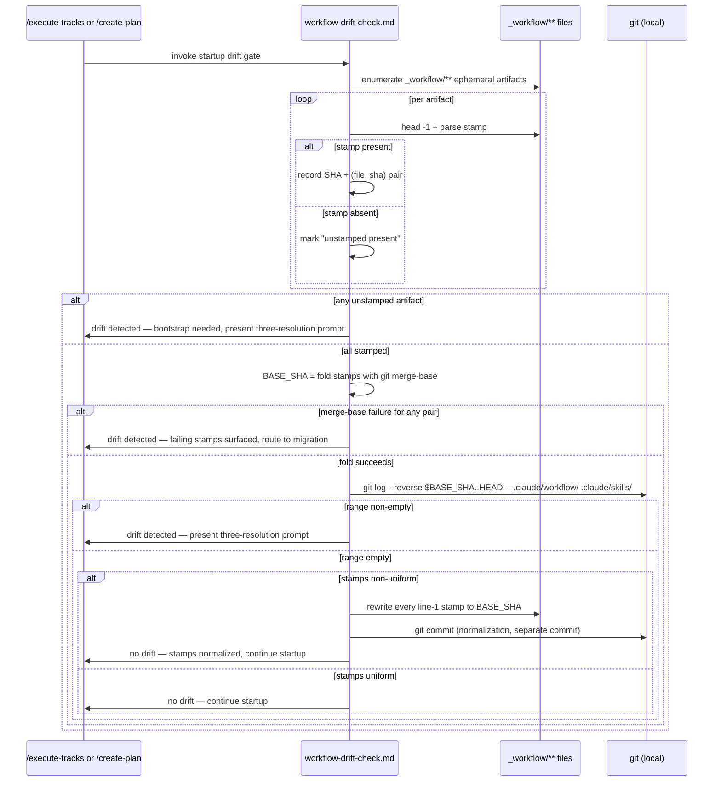
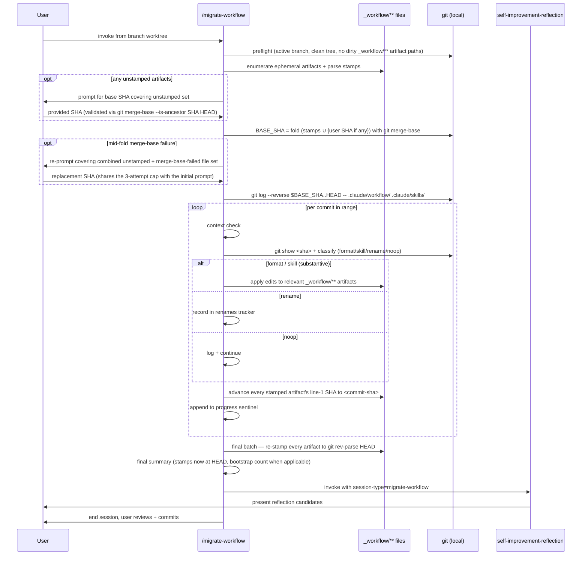
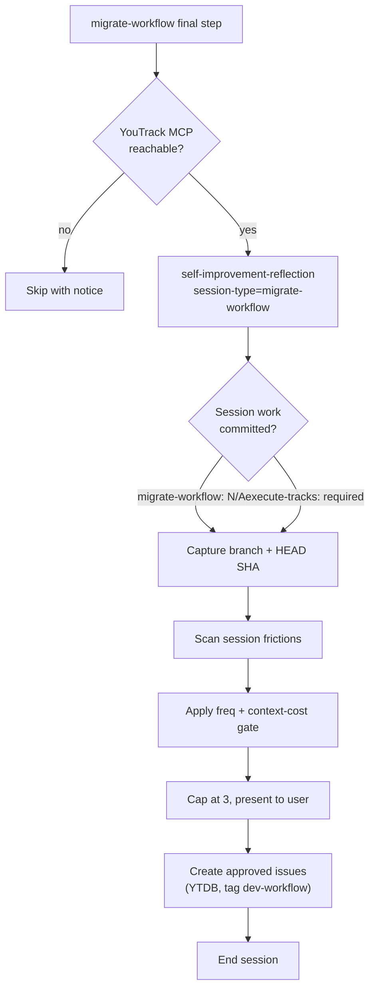

# In-Place Workflow Migration — Design

## Overview

The `/migrate-workflow` skill replays workflow-format commits from `develop` onto a feature branch's `docs/adr/<dir>/_workflow/**` artifacts whenever a workflow-format change lands on `develop` after the branch was cut. Today's skill runs from a `develop` worktree against a separate branch worktree and computes its replay range as `merge-base(develop, branch)..develop`. The two-worktree dance and the fork-point heuristic are both fragile: a user picks the wrong worktree, the fork-point shifts under a rebase, and the post-migration branch state needs manual reconciliation against develop.

The replacement is a per-artifact stamp on line 1 of every ephemeral `_workflow/**` artifact: `<!-- workflow-sha: <40-char SHA> -->`. The stamp records the workflow version the artifact was created against. The drift check and the migration both compute their replay range as `BASE_SHA..HEAD`, where `BASE_SHA` is the oldest stamp reachable from HEAD, derived by folding the stamp set through `git merge-base` (which returns the common ancestor whether the stamps are linearly related or sit on diverged histories). The branch is a self-contained capsule: workflow commits enter the branch's view only when the user explicitly rebases or merges develop. Unstamped artifacts carry no implicit fallback; their presence signals drift to the drift gate (the startup check defined in §"Workflow → Drift detection at session startup"), and the migration prompts the user once per session for a base SHA covering every unstamped artifact in the active plan. The migration runs entirely inside the branch's own worktree, with no develop checkout and no `git fetch`.

The enabling primitive is the stamp itself, advanced in lockstep across all stamped artifacts after each successful per-commit replay during migration and re-stamped in one batch to `git rev-parse HEAD` at the end of the migration session. On a no-drift gate run with non-uniform stamps, the gate normalizes every stamp to the fold result and commits the change in a separate commit, so the next gate's fold input is O(1). The drift check, the migration's range derivation, the migration's progress tracking, and the post-migration "we're synced to HEAD" claim all read from the same stamps. The self-improvement reflection step that closes every `/execute-tracks` session is generalized via a `session-type` parameter so migration sessions feed the same `dev-workflow` YouTrack queue.

A second class of branches needs different treatment: branches whose plan modifies `.claude/workflow/**` or `.claude/skills/**` themselves. Direct in-place edits cause the branch to migrate against its own work — plan citations go stale immediately, reviewers see anchors disappear at the next commit, and the drift gate trips on the branch's own commits. The staging convention isolates those edits under `<plan-dir>/_workflow/staged-workflow/.claude/{workflow,skills}/...`; the live workflow stays at develop's state throughout execution; a Phase 4 promotion commit copies the staged subtree onto the live tree immediately before the final-artifacts commit.

What else changes: `create-plan` and `edit-design` gain stamping at every artifact-creation site; `workflow-drift-check.md` swaps fork-point math for stamp-walking and gains the no-drift normalization commit; `migrate-workflow/SKILL.md` drops its develop-worktree preflight and worktree-resolution step, gains the unstamped-artifact bootstrap prompt, the per-commit lockstep advance, and the final stamp-to-HEAD batch; `self-improvement-reflection.md` takes a session-type parameter; `implementer-rules.md` gains the path-mapping rule and a pre-commit gate refusing live workflow path writes outside the Phase 4 promotion commit; `workflow.md` § Final Artifacts and `prompts/create-final-design.md` document the three-commit Phase 4 shape on workflow-modifying plans.

The rest of this document covers Core Concepts (seven new domain terms), Workflow (three runtime flows), Stamp range computation (the `git merge-base` fold and its caller-specific recovery), Per-commit replay and lockstep advance (crash-resume semantics), Reflection parameterization (the session-type knob), and Staging for workflow-modifying branches (the inverse case). The full Decisions (D-records) and Invariants catalogue lives in the companion `adr.md`; this document cites them by short label in each References footer.

Shipped substantively as planned. Two structural adjustments landed during execution: the drift-gate file's caller-specific phrasing was swept end-to-end so the same gate serves `/execute-tracks` and `/create-plan` symmetrically (rather than the originally-scoped intro-only generalization), and the staging-architecture track's review surfaced a set of follow-on design enhancements (reads-precedence enforcement at commit time, a pre-commit inverse-misroute gate, gate-checked-vs-final-message coupling, post-rebase staged-subtree audit) recorded as follow-up `dev-workflow` issues rather than absorbed into this PR. All Decision Records carry through to `adr.md` under their original numbering.

## Core Concepts

Seven new domain terms appear throughout this design. Each gets one paragraph below: name, plain-language definition, role in the architecture, and a pointer to the elaborating section.

**Workflow-SHA stamp.** A line-1 HTML comment on every ephemeral `_workflow/**` artifact: `<!-- workflow-sha: <40-char SHA> -->`. Records the latest commit touching `.claude/workflow/` or `.claude/skills/` reachable from `HEAD` at the time the artifact was created or last migrated. Computed at creation time via `git log -1 --format=%H HEAD -- .claude/workflow .claude/skills`, with `git rev-parse HEAD` as a fallback when the path-scoped log returns empty. Invisible in rendered Markdown; parseable with `head -1` plus an anchored grep. Replaces the implicit notion that an artifact's effective workflow version is the branch's fork-point with develop. → §"Stamp range computation".

**Stamp range.** The commit range used by the drift check and the migration: `<BASE_SHA>..HEAD`, where `BASE_SHA` is the oldest stamp reachable from HEAD, computed by folding the set of stamps with `git merge-base` (pairwise common ancestor). The upper bound is HEAD because the branch is a self-contained capsule: workflow commits enter the branch's view only via explicit rebase or merge, no `git fetch origin develop` involved. When the active plan contains unstamped artifacts, the migration extends the fold input set by the user-provided bootstrap SHA. The drift check never computes the range against unstamped state; it short-circuits to "drift detected" on unstamped-artifact presence alone. Replaces the today-skill's `git merge-base origin/develop HEAD..origin/develop`. → §"Stamp range computation".

**Unstamped-artifact bootstrap.** When the migration starts and one or more `_workflow/**` artifacts have no line-1 stamp, the skill halts before computing the range and asks the user once: "These N artifacts are unstamped: [list]. Provide the workflow-SHA to treat as their base." The provided SHA enters the fold as a single contributor covering every unstamped artifact in the session, validated via `git rev-parse --verify "$SHA^{commit}"` and `git merge-base --is-ancestor "$SHA" HEAD`. No auto-computed reference is a silent default. Under rebase, any auto-computed reference shifts forward and would silently mark legacy artifacts as already-current, skipping the migration. The user-supplied SHA captures intent the system cannot infer. → §"Stamp range computation" and §"Workflow → Migration replay loop".

**Lockstep stamp advance.** After each per-commit replay succeeds during migration, every stamped artifact in the active plan's `_workflow/` has its line-1 stamp rewritten to the just-replayed commit's SHA, including artifacts the commit did not edit. This is the crash-resume marker. After the per-commit loop exits successfully, a final batch re-stamps every artifact to `git rev-parse HEAD`, even artifacts the loop already advanced. Replaces the implicit notion that migration progress lived only in a transient `.migration-progress` file. → §"Per-commit replay and lockstep advance".

**No-drift normalization.** When the drift gate determines no drift but the `STAMPED_SHAS` set contains more than one distinct SHA, the gate rewrites every artifact's line-1 stamp to `BASE_SHA` (the fold result) and creates a separate commit. The next gate run sees uniform stamps and a single-element fold input. → §"Workflow → Drift detection at session startup".

**Session-type parameter.** A new input to `self-improvement-reflection.md` distinguishing `execute-tracks` (existing behavior) from `migrate-workflow` (the new caller). Controls the commit-clean preflight, the `**Phase:**` value in the issue body, the applicability sentence in §"When it runs", and the in-scope migration-shaped friction examples. Replaces the hard-coded `/execute-tracks`-only scoping. → §"Reflection parameterization".

**Staged workflow subtree.** A path inside the branch's `_workflow/` directory at `<plan-dir>/_workflow/staged-workflow/.claude/{workflow,skills}/...` mirroring the structure of the live workflow paths. Workflow-modifying branches accumulate their workflow document changes here instead of editing `.claude/workflow/` and `.claude/skills/` directly, so the live workflow in the branch's checkout stays at develop's state throughout execution. Phase 4 promotes the staged subtree to the live paths in one commit immediately before the final-artifacts commit; the cleanup commit then removes `_workflow/` along with the staged subtree. → §"Staging for workflow-modifying branches".

## Workflow

Two runtime flows change shape: drift detection at session startup and the migration replay loop. A third flow, reflection at session end, gains a new caller.

### Drift detection at session startup



**TL;DR.** Invoked from `/execute-tracks` turn 1 (between the Branch Divergence Check and the handoff scan) and `/create-plan` between Step 1 and Step 1a; both callers run the same detection block. Drift detection walks every `_workflow/**` artifact in the active plan's `_workflow/` directory and reads each line-1 stamp. Any unstamped artifact short-circuits to "drift detected" — no fold, no range computation, no silent default; the migration captures the user's intent for those artifacts. When every artifact is stamped, the gate folds the set pairwise through `git merge-base` to derive `BASE_SHA` and runs `git log $BASE_SHA..HEAD` against the workflow paths; non-empty output means drift. The branch is a self-contained capsule, so the upper bound is HEAD and no `git fetch` runs. On no-drift with non-uniform stamps, the gate normalizes every artifact's stamp to `BASE_SHA` and commits the change in a separate commit so the next gate's fold input is O(1). The three-resolution prompt (Migrate now / Defer / Suppress) is HEAD-relative; Migrate now points the user at `/migrate-workflow` in the same worktree.

Stamp reading is one `head -1 <path> | grep -oE 'workflow-sha: [0-9a-f]{40}' | grep -oE '[0-9a-f]{40}$'` per artifact. The walk is cheap; no network I/O is involved because the comparison is purely local. The pathspec `git log -- .claude/workflow/ .claude/skills/` carries a defensive comment recording that the trailing slashes and the verbatim path list deliberately exclude the staged subtree at `docs/adr/*/_workflow/staged-workflow/.claude/{workflow,skills}/`, a different prefix; a future change that broadens the pathspec must re-check the exclusion.

#### Edge cases / Gotchas

- The gate scopes to the active plan's `_workflow/` directory — the one the caller resolved at startup. A branch carrying multiple plan directories (uncommon; the convention is one plan dir per branch) walks only the active one. Drift in other plan directories surfaces only when the user invokes a session against them. Cross-directory folding is avoided because each plan directory is migrated independently, and folding across them would over-include older commits the active plan was always synced past.
- An artifact whose first line is anything other than a stamp or an H1 is treated as unstamped; same drift-signal path as a legacy artifact.
- A mid-fold `git merge-base` failure (a stamp pointing at a `git gc`-pruned commit, or two stamps with no reachable common ancestor in the local repo) routes the failing stamps' affected pairs to "drift detected" — the gate cannot fold past the failure but it also cannot claim no-drift, so it escalates to the migration where the user supplies a base SHA covering the affected artifacts.
- The detection path is read-only; the no-drift normalization path writes line-1 of stamped artifacts and creates one commit. The normalization step refuses to commit if the diff contains anything outside those line-1 stamp lines (`git diff -U0` hunk-header check plus `git status --porcelain` cross-check), restoring via `git checkout` on mismatch.
- Caller-specific skip behavior: the gate's "active plan's `_workflow/` doesn't exist" skip fires on brand-new `/create-plan` invocations before the SKILL creates the active plan's `_workflow/`. Step 1.5 runs before Step 1b's `mkdir` so the skip sees the pre-creation state.
- Workflow-modifying branches under the staging convention do not register their own workflow edits as drift, because the staged paths live at a different prefix and the pathspec excludes them. Plans authored before the convention existed continue to register their own workflow commits as drift on the next gate run.

#### References

- D-records: D1 (per-artifact stamp), D5 (no backfill), D7 (HTML-comment format), D8 (ask, don't guess unstamped SHA), D9 (gate at /create-plan startup), D10 (BASE_SHA..HEAD; branch as capsule), D11 (no-drift normalization + commit), D13 (active-plan scope), D14 (staging excludes the staged subtree)
- Invariants: I1 (line-1 stamp), I3 (merge-base fold range), I5 (post-normalization uniformity)

### Migration replay loop



**TL;DR.** Migration runs in the branch's own worktree, scoped to the active plan's `_workflow/` directory. Preflight refuses if any tracked file under the active plan's `_workflow/**` artifact paths has uncommitted changes or any untracked file lives there; the `.migration-progress` sentinel and the staged subtree are explicit carve-outs. Before computing the range, the skill checks for unstamped artifacts in the active plan; if any exist, it asks the user once for a base SHA covering the unstamped set and validates the input is reachable from HEAD. The user-provided SHA enters the fold as a single contributor. A mid-fold `git merge-base` failure routes the failing stamps' affected paths back through the same bootstrap prompt (combined unstamped + merge-base-failed set, shared 3-attempt cap). The per-commit replay loop (classify, apply, advance stamps in lockstep, log) is the same shape as today's substantive step, with an extra "advance stamps in lockstep" sub-step after each commit lands (the crash-resume marker). A final post-loop batch re-stamps every artifact in the active plan to `git rev-parse HEAD`. The develop-worktree machinery is gone; no `git fetch` runs. At the end, the SKILL invokes the parameterized reflection step before the user reviews and commits.

The user reviews the diff after the loop exits and commits it through normal git workflow. The skill never commits the migration's content edits — that contract carries over. (The drift gate's no-drift normalization commit, when it fires, is a different surface and does commit its own change.)

#### Edge cases / Gotchas

- Mid-loop `/clear` or process kill: the next invocation re-reads stamps, finds the next pending commit, resumes. The transient progress sentinel is a backstop for in-flight crash detection only; the stamps are the durable progress marker.
- A commit that does not edit any branch artifact (a workflow-format change to a section the branch's plan does not carry) still advances every stamp — the artifact was "synced to" that workflow version even though the diff happened to be empty for it. The final HEAD batch then advances every stamp to HEAD's SHA, which may be ahead of the last replayed commit when develop has non-workflow commits past the last workflow tip.
- Renames in the workflow itself are recorded in a per-session renames tracker and consulted by later commits whose diffs reference the renamed paths. The tracker is rebuilt fresh on every migration invocation.
- A commit that modifies the stamp format itself (a hypothetical schema change to `conventions.md` §1.6 that swaps the HTML-comment shape for YAML frontmatter) halts the per-commit loop: the in-place migration cannot self-bootstrap a stamp-format change because the writer's `old_string`-match contract assumes the prior format. An out-of-band migration handles the format change.
- Plans authored before the staging convention existed accept dogfood semantics: the branch's own workflow commits show up in `BASE_SHA..HEAD` and trigger migration of the branch's in-progress workflow changes. One migration session per commit cluster touching `.claude/workflow/` or `.claude/skills/`. The staging convention solves the dogfood case for future plans.

#### References

- D-records: D2 (per-commit lockstep + final HEAD batch), D4 (end-session Migrate now), D8 (ask, don't guess unstamped SHA), D10 (BASE_SHA..HEAD; branch as capsule), D12 (preflight refuses on dirty `_workflow/**`), D13 (active-plan scope), D14 (staging absorbs future dogfood)
- Invariants: I2 (post-migration stamps equal HEAD), I3 (range derivation), I4 (mutations do not move stamps)

### Reflection at end of migration



**TL;DR.** The migrate-workflow SKILL invokes `self-improvement-reflection.md` as its final step, passing `session-type=migrate-workflow`. The reflection protocol's steps run unchanged except for four conditional clauses: the commit-clean preflight is skipped (migration intentionally leaves the worktree dirty), the `**Phase:**` value in the issue body is `migrate-workflow`, the applicability sentence reads "every `/migrate-workflow` session" alongside the existing `/execute-tracks` phrasing, and the in-scope examples list adds migration-shaped frictions (ambiguous classification rules, missing replay patterns, halt-and-ask conditions firing without docs, edge cases in the renames tracker). The Source line points at `HEAD` pre-migration since no post-migration commit exists at session end.

The frequency-and-context-cost gate, the 3-issue cap, the severity → priority mapping, the duplicate filter against open `dev-workflow` issues, and the user-confirmation gate before issue creation all carry through without change.

#### Edge cases / Gotchas

- YouTrack MCP unreachable: same skip-with-notice path. The notice text names the migration session.
- Zero candidate frictions: same "No improvements proposed" terminal state.
- Migration ended early (context warning during replay): reflection still fires — the friction that caused the early exit is exactly the kind of finding worth recording.
- An unrecognized `session-type` (a typo or a future caller without parameter discipline) halts the document with `ERROR: unrecognized session-type "<value>"; expected execute-tracks or migrate-workflow` and ends the session. Reflection never silently degrades to the default.

#### References

- D-records: D6 (parameterize, don't fork)
- See also: `self-improvement-reflection.md` §"When it runs"

## Stamp range computation

**TL;DR.** Three callers need the same lower bound to stay consistent: drift detection, migration replay, and the post-migration "synced to HEAD" claim. One bash block is shared verbatim where the inputs match. The block folds the set of line-1 markers across every ephemeral artifact in the active plan's `_workflow/` directory through `git merge-base` to find the oldest reachable ancestor in HEAD's commit graph; that ancestor becomes `BASE_SHA`. The upper bound is HEAD: the branch is a self-contained capsule, so no `git fetch origin develop` runs and no comparison against `origin/develop` happens. Unstamped artifacts carry no implicit fallback. At migration time the skill prompts the user once for a base SHA covering the unstamped set, and that SHA enters the fold as one additional contributor; the drift check never reaches the fold when any artifact is unstamped (it short-circuits to "drift detected" and routes to migration). The full rule set (format, parser idioms, fold algorithm, upper-and-lower bounds, and the Phase 1 walk bash) lives in `.claude/workflow/conventions.md` §1.6.

SHAs have no inherent ordering, so "lowest" or "min" is not the right primitive. `git merge-base` is. For linearly related SHAs it returns the older of the two; for SHAs on divergent histories it returns their common ancestor. Both behaviors are exactly what `BASE_SHA` needs: the range `BASE_SHA..HEAD` captures every workflow commit any stamp might be missing.

The derivation has two phases. **Phase 1 (shared):** walk artifacts in the active plan's `_workflow/`, classify as stamped or unstamped, parse stamps. `$PLAN_DIR` is the plan directory the caller resolved at startup.

```bash
PLAN_DIR="docs/adr/<resolved-dir-name>"
STAMPED_SHAS=""
UNSTAMPED_FILES=""
for f in $(ls "$PLAN_DIR/_workflow/implementation-plan.md" \
              "$PLAN_DIR/_workflow/design.md" \
              "$PLAN_DIR/_workflow/design-mechanics.md" \
              "$PLAN_DIR/_workflow/plan/"track-*.md 2>/dev/null); do
    SHA="$(head -1 "$f" | grep -oE 'workflow-sha: [0-9a-f]{40}' | grep -oE '[0-9a-f]{40}$')"
    if [ -n "$SHA" ]; then
        STAMPED_SHAS="$STAMPED_SHAS $SHA"
    else
        UNSTAMPED_FILES="$UNSTAMPED_FILES $f"
    fi
done
```

The drift-check call site and the migration call site copy this block byte-for-byte. The migration call site additionally builds a paired `STAMPED_PAIRS` array (`<file>=<sha>`) inside the same stamped branch so the merge-base-failure recovery prompt can name failing artifact paths rather than bare SHAs; the addition is purely additive (one init line plus one assignment) and the rest of the block stays byte-identical with the drift-check copy.

**Phase 2 (caller-specific):**

- **Drift check.** If `UNSTAMPED_FILES` is non-empty, signal drift unconditionally (no fold, no `git log`). Otherwise fold `STAMPED_SHAS` and run `git log $BASE_SHA..HEAD -- .claude/workflow/ .claude/skills/`; non-empty output signals drift. A mid-fold `git merge-base` failure routes the failing pair to drift-detected without folding past the failure. When the range is empty and `STAMPED_SHAS` contains more than one distinct SHA, the gate rewrites every artifact's line-1 stamp to `BASE_SHA` and creates a separate normalization commit.
- **Migration.** If `UNSTAMPED_FILES` is non-empty, prompt the user once for a base SHA, validate it (`git rev-parse --verify $SHA^{commit}` and `git merge-base --is-ancestor $SHA HEAD`), capture the canonical 40-char `rev-parse` stdout as `$USER_BOOTSTRAP_SHA` (the regex `[0-9a-f]{40}` rejects shorter values on subsequent parse), then fold `STAMPED_SHAS` plus the validated user SHA. A continue-and-collect fold gathers every `git merge-base` failure into `MERGE_BASE_FAILED` before exiting the loop; a single re-prompt then routes the combined unstamped + merge-base-failed file set back through the same bootstrap, replacing the prior `$USER_BOOTSTRAP_SHA` and sharing the 3-attempt cap. When the Phase 1 walk produces both `STAMPED_SHAS` and `UNSTAMPED_FILES` empty (a freshly-created `_workflow/` directory holding only a transient `handoff-*.md`, for example), the migration halts with `no artifacts to migrate` and exits with no edits applied.

The fold itself:

```bash
BASE_SHA=""
MERGE_BASE_FAILED=""
for SHA in $STAMPED_SHAS $USER_BOOTSTRAP_SHA; do
    if [ -z "$BASE_SHA" ]; then
        BASE_SHA="$SHA"
        continue
    fi
    # Fold pairwise through merge-base. Linear stamps yield the older
    # ancestor; divergent stamps yield the common ancestor. Failure
    # (no common ancestor in HEAD's graph, typical of a stamp on a
    # git-gc-pruned commit) collects the participating stamps for
    # caller-specific recovery rather than aborting the fold.
    if ! NEW_BASE="$(git merge-base "$SHA" "$BASE_SHA" 2>/dev/null)"; then
        MERGE_BASE_FAILED="$MERGE_BASE_FAILED $SHA"
        continue
    fi
    BASE_SHA="$NEW_BASE"
done

# Caller-specific recovery happens here when MERGE_BASE_FAILED is
# non-empty: the drift check escalates to "drift detected"; the
# migration extends its bootstrap prompt to cover the combined
# unstamped + merge-base-failed set, then re-runs the fold. On the
# success path, the range is BASE_SHA..HEAD.
git log --reverse --format='%H %s' "$BASE_SHA..HEAD" -- .claude/workflow .claude/skills
```

`git merge-base` is the load-bearing primitive: it picks the older of two linearly related SHAs, returns the common ancestor of two divergent ones, and exits non-zero when no common ancestor exists at all. Folding the whole set pairwise lands on the single SHA that is ancestor of every input, which is exactly the "earliest workflow version any artifact was synced to" anchor the range needs.

**Why no silent auto-computed reference.** Any auto-computed reference for unstamped artifacts (`git merge-base origin/develop HEAD`, HEAD itself, fork-point with develop, or anything else) fails the same way: it shifts forward whenever the user rebases the branch onto a newer develop. A legacy branch carrying unstamped artifacts, rebased onto a develop that has had workflow commits in the meantime, would have any auto-computed reference land at or near the new HEAD; a silent fallback would then declare the artifacts already-synced, skipping the migration. The data loss is silent: artifacts stay at their unmigrated content while the drift gate reports "no drift." Asking the user once for an explicit SHA at migration time buys correctness across rebase.

### Edge cases / Gotchas

- An artifact whose stamp parses but whose SHA is not reachable from HEAD (a stamp left from a workflow commit that was dropped during rebase): the SHA enters the fold; `git merge-base` reduces it against the other stamps to whatever common ancestor exists in HEAD's graph, and `git log $BASE_SHA..HEAD` returns commits reachable from HEAD that are not on that ancestor. The unreachable stamp itself contributes only to the fold input, not to the range upper bound.
- The active plan's `_workflow/` directory exists but has zero stampable artifacts (a freshly-created `_workflow/` holding only a transient `handoff-*.md`, for example): the drift check exits successfully with no drift to report, and the migration halts with `no artifacts to migrate`. The drift check's existing "active plan's `_workflow/` doesn't exist" skip condition catches the brand-new-plan case before the loop runs.
- The enumeration lists the four stamped artifact types explicitly inside the active plan's `_workflow/`. Adding a new stamped artifact type means adding one line to each call site, small enough to inline. `design-mutations.md` is an append-only log and is deliberately excluded: its stamp would always equal `design.md`'s stamp, and schema commits affecting the log are replay-immune by virtue of the log's append-only contract.
- The user-supplied bootstrap SHA fails validation (`git rev-parse --verify` rejects it, or `git merge-base --is-ancestor` says it is not reachable from HEAD): the migration re-prompts. Three rejected attempts in a row abort the session with a clear error and no edits applied. The counter is session-bound; a `/clear` between attempts resets it.
- The user supplies a SHA that is valid but semantically wrong (an unrelated commit): no system check can catch this. The fold yields a `BASE_SHA` that is correct given the input; the per-commit replay loop's classify-and-apply contract determines whether the resulting edits make sense, with halt-on-ambiguity as the safety net.

### References

- D-records: D1 (per-artifact stamp), D5 (no backfill), D7 (HTML-comment format), D8 (ask, don't guess unstamped SHA), D10 (BASE_SHA..HEAD; branch as capsule), D11 (no-drift normalization + commit), D13 (active-plan scope)
- Invariants: I3 (merge-base fold range), I5 (post-normalization uniformity)

## Per-commit replay and lockstep advance

**TL;DR.** Inside the migration loop, the stamp-advance sub-step fires immediately after the apply-edits sub-step succeeds and before the progress-sentinel sub-step runs. Every stamped artifact in the active plan's `_workflow/` has its line-1 stamp rewritten to the just-replayed commit's SHA, including artifacts the commit did not touch. This is the crash-resume marker: the next invocation reads any stamp, finds the last successfully-replayed SHA, and resumes from the commit after that. After the per-commit loop exits successfully, a final batch re-stamps every artifact in the active plan to `git rev-parse HEAD`, even artifacts the loop already advanced to the same value. Invariant I2 lands at the final batch, so HEAD-relative consistency holds even when the last replayed commit precedes HEAD.

The per-commit advance writes one `Edit` against line 1 per artifact, run after the per-commit edits land:

```bash
for f in <list of stamped artifacts in the active _workflow/>; do
    # Edit against line 1 with the prior stamp as old_string. Idempotent
    # on equal SHA; previously-unstamped artifacts gain their first
    # stamp here as a side effect.
done
```

The final batch uses the same loop with the new SHA resolved to `$(git rev-parse HEAD)`:

```bash
HEAD_SHA="$(git rev-parse HEAD)"
for f in <every stamped artifact in the active plan's _workflow/>; do
    # Edit against line 1; old_string is the prior stamp, new_string is
    # HEAD's SHA. Optional artifacts absent from disk are silently
    # skipped by the §1.6(h) walk's ls 2>/dev/null shape.
done
```

A legacy-unstamped artifact gains a stamp on its first migration during the per-commit phase. Subsequent migrations of the same branch overwrite the existing stamp.

The order matters: apply edits → per-commit advance → progress sentinel → task flip → ... → final HEAD batch. A crash between apply-edits and advance leaves stamps still at commit X-1; the next invocation replays X over already-edited content, and the user's `git diff` before resuming detects duplicate edits. A crash between advance and progress-sentinel leaves every stamp at commit X (advance fired in lockstep) but the progress sentinel does not record X; the next invocation's fold yields `BASE_SHA = X`, range computation gives `X..HEAD`, and the per-commit loop re-queues commits X+1..HEAD without re-applying X. A mid-advance crash leaves some artifacts at X and others at X-1; the fold over non-uniform stamps gives the older common ancestor, the range re-queues commit X, the apply-edits sub-step re-applies its file-shape edits idempotently, and the user's pre-resume `git diff` catches non-idempotent residue. The migration's re-invocation does not enter the drift gate's no-drift normalization path; that path fires only when `git log $BASE_SHA..HEAD` returns an empty range on the drift-check caller, which is a separate surface from the migration's per-commit loop. A crash between the per-commit loop and the final HEAD batch leaves stamps at the last replayed commit (still a valid resume point); the next invocation finds the range empty and lands at the final batch directly.

### Edge cases / Gotchas

- An artifact that does not yet exist (a future track file the branch has not created): not enumerated, no advance, no problem. The advance is best-effort per-file.
- A commit that triggers the apply-edits halt-on-ambiguity (`section-rename onto existing name`, `section-remove with user content`, `field-add with no safe default`): the loop pauses; stamps stay at the prior commit's SHA. When the user resolves the halt and the loop continues, the advance for the current commit fires.
- A commit recorded as `manual-review-needed` (user invoked "skip" from a halt): the advance still fires — the commit was "applied" in the sense that the user opted out, and leaving the stamp behind would cause the same commit to be re-presented on the next run.

### References

- D-records: D2 (per-commit lockstep + final HEAD batch), D10 (BASE_SHA..HEAD), D13 (active-plan scope)
- Invariants: I2 (post-migration stamps equal HEAD), I4 (mutations do not move stamps)

## Reflection parameterization

**TL;DR.** One `session-type` knob on the existing end-of-session protocol lets it serve migration runs alongside `/execute-tracks`; four sections branch on the value, every other section runs identically. The parameter takes values `execute-tracks` (default; existing behavior) or `migrate-workflow` (new caller). The four branching sections are: §"When it runs" applicability sentence and body enumeration of phase steps; the commit-clean preflight in the closing protocol (skipped for `migrate-workflow` since migration leaves the worktree dirty by design); the issue-body template's `**Phase:**` field and the `**Source session:**` template literal; and the in-scope examples list under §"What counts as a worth-recording issue" (four migration-shaped sub-bullets apply only when `session-type=migrate-workflow`). The freq/context-cost gate, the 3-issue cap, the duplicate filter, the user gate, and the YouTrack creation flow are untouched.

The parameterization is a minimal edit:

- A new `## Inputs` block at the top of `self-improvement-reflection.md` lists `session-type: execute-tracks | migrate-workflow`. Omitting the parameter defaults to `execute-tracks`. Any other value halts the document with `ERROR: unrecognized session-type "<value>"; expected execute-tracks or migrate-workflow` and ends the session.
- §"When it runs" generalizes its intro; an Applicability-by-session-type sub-clause maps each session-type to its phase identifiers (`/execute-tracks` → state-0/phase-a/phase-b/phase-c/phase-4; `/migrate-workflow` → migrate-workflow).
- The commit-clean preflight (Step 2 of the reflection procedure) carries a conditional: skip the check when `session-type=migrate-workflow`. The Source line points at `HEAD` pre-migration; `git rev-parse HEAD` and `git rev-parse --abbrev-ref HEAD` in Step 3 still run.
- §"Issue body template" extends the `**Phase:**` allowed values list to include `migrate-workflow`. The `**Source session:**` literal renders as a one-of-two alternation, one line per session-type.
- §"What counts as a worth-recording issue" adds four sub-bullets that apply only when `session-type=migrate-workflow`: ambiguous classification rules, missing replay patterns, halt-and-ask conditions firing without docs, edge cases in the renames tracker.

The migrate-workflow SKILL's new final step:

```markdown
## Step 6 — Self-improvement reflection

Mark Step 0's umbrella task `Self-improvement reflection` as `in_progress`.
Invoke the reflection protocol at `.claude/workflow/self-improvement-reflection.md`
with `session-type=migrate-workflow`. The protocol handles its own
MCP-reachability check and end-of-session contract; nothing else fires
after it returns. Mark the umbrella task `completed` before the
reflection invocation returns control, since the protocol's terminal
step ends the session.
```

### Edge cases / Gotchas

- The duplicate filter (Step 6 of reflection) searches `project: YTDB tag: dev-workflow`. Migration-session frictions land in the same queue as `/execute-tracks` frictions; the triager treats them uniformly. No queue split needed.
- A reflection candidate that names a `migrate-workflow/SKILL.md` step explicitly is more likely to clear the frequency prong than a hypothetical `/execute-tracks` finding, because migration sessions are themselves rare. The gate's "deterministic trigger fires on every matching session" path handles that case (one Bug that fires deterministically once still passes the prong).
- The session-end summary in the SKILL's preceding step runs before reflection in the new flow. Reflection's "End the session" terminal action is what truly ends the migration session.

### References

- D-records: D6 (parameterize, don't fork)
- See also: §"Workflow → Reflection at end of migration" for the runtime sequence.

## Staging for workflow-modifying branches

**TL;DR.** Workflow document edits on a workflow-modifying branch route to `<plan-dir>/_workflow/staged-workflow/.claude/{workflow,skills}/...` rather than touching `.claude/workflow/` and `.claude/skills/` directly. The live workflow in the branch's checkout stays at develop's state throughout execution, so the plan reads stable rules, reviewers see no drift, and the branch never migrates against itself. At Phase 4 a "Promote workflow changes" step copies the staged subtree to the live paths in one commit; the existing cleanup commit then removes `_workflow/` (the staged subtree included) so the squash-merge into develop carries only the live workflow files plus `design-final.md` and `adr.md`. The in-place migration handles drift on feature plans that do not author workflow changes; this section handles the inverse case where the plan is itself the source of drift. The canonical statement of the path layout, marker spelling, detection rule, reads-precedence rule, write routing, additive-only contract, rebase-precedes-promotion rule, and resume semantics lives in `.claude/workflow/conventions.md` §1.7.

The bootstrap problem this convention solves: when a branch edits `.claude/workflow/X.md` directly in its own tree, its own subsequent sessions read the changed rules. Every plan citation authored before the edit goes stale immediately; the drift gate trips on the branch's own changes; reviewers waste cycles flagging "this anchor no longer exists"; Phase B implementers read a moving target. Staging isolates the workflow changes from the live workflow until Phase 4, so the plan's citations stay coherent against develop's workflow throughout execution.

The staging tree mirrors the structure of the live workflow paths it replaces:

```
docs/adr/<dir-name>/_workflow/staged-workflow/
  .claude/
    workflow/
      <files that change land here, same names as live>
    skills/
      <skill-name>/
        SKILL.md
```

Only files the branch is changing land in the staged subtree. Unchanged workflow files do not get a staged copy; the implementer reads them from the live paths as usual.

The plan declares itself workflow-modifying via a canonical marker sentence in its `### Constraints` section: `This plan is workflow-modifying: it edits .claude/workflow/** or .claude/skills/**.` Two signals drive two consumers: the Constraints declaration drives the implementer enforcement gate (active from the first step); the `<plan-dir>/_workflow/staged-workflow/.claude/` directory presence drives the Phase 4 promotion guard (active once any staged write exists). Constraints declared without any staged content is allowable; it produces a silent no-op at Phase 4 promotion (legitimate dry-run or abandoned-work shape).

The implementer rulebook gains one rule and one gate. The path-mapping rule routes every write whose target path begins with `.claude/workflow/` or `.claude/skills/` to `<plan-dir>/_workflow/staged-workflow/<same-relative-path>` when the active plan declares the marker. Reads check for the staged copy first per the reads-precedence rule: if a staged copy exists, read staged; else read live. This rule keeps multi-step authoring within one track working — a step that adds rule X to staged `conventions.md` and a later step that cites rule X both see the same state. The pre-commit gate refuses `git diff --cached -- .claude/workflow/ .claude/skills/` matches outside the Phase 4 promotion commit; the gate's allow-clause keys off the commit's prepared message prefix `Promote workflow changes from <plan-dir>/_workflow/staged-workflow`. The pattern mirrors the existing ephemeral-identifier gate's shape.

The promotion step lands in `workflow.md` § Final Artifacts and `prompts/create-final-design.md` as a new commit immediately before the final-artifacts commit, changing Phase 4 from two commits to three (promote-staged-workflow → final-artifacts → cleanup) on workflow-modifying plans only:

```bash
PLAN_DIR="docs/adr/<dir-name>"
STAGED_DIR="$PLAN_DIR/_workflow/staged-workflow"

if [ -d "$STAGED_DIR/.claude" ]; then
  git fetch origin develop --quiet
  DIVERGENCE=$(git log "$(git merge-base origin/develop HEAD)..origin/develop" -- .claude/workflow .claude/skills)
  if [ -n "$DIVERGENCE" ]; then
    echo "ERROR: origin/develop carries .claude/workflow or .claude/skills commits this branch has not absorbed."
    echo "Rebase the branch onto current origin/develop before promotion."
    exit 1
  fi
  cp -r "$STAGED_DIR/.claude/." .claude/
  git add .claude/workflow .claude/skills
  git diff --cached --quiet || git commit -m "Promote workflow changes from $STAGED_DIR"
  git push
fi
```

The directory-presence guard checks for the `.claude/` subdirectory under the staged path rather than the bare `staged-workflow/` directory, so a partially-stripped or empty shell would not trigger a no-op promotion commit. The divergence sanity check compares `merge-base..origin/develop` past the fork-point rather than `merge-base..HEAD`, with a `git fetch origin develop` prelude; the formula is resume-neutral on the branch's own promote commit. The `git diff --cached --quiet || git commit` empty-commit short-circuit keeps Phase 4 resume clean: an aborted promotion that left the staged content already merged into the live tree produces no second commit on the second pass. The cleanup commit that follows removes the staged subtree along with everything else under `_workflow/`.

The drift gate's existing `git log` pathspec (`.claude/workflow .claude/skills`) excludes the staged subtree because the staged paths live under `docs/adr/*/_workflow/staged-workflow/.claude/workflow/`, a different prefix. A defensive comment at the pathspec site records the property so a future change that broadens the pathspec is forced to acknowledge it explicitly. The migration skill's range computation uses the same pathspec; the same exclusion applies symmetrically.

The promotion is additive only. `cp -r` carries no deletion semantics, so a plan that removes a live file from staging cannot remove it via promotion. A plan that needs to delete a live workflow file lands the deletion outside staging in a separate commit before Phase 4.

### Edge cases / Gotchas

- **Rebase during execution.** When develop's workflow moves between the branch beginning and Phase 4, a rebase before Phase 4 brings new live workflow files into the branch. The staged subtree may now conflict with the new live shape. The branch's normal rebase conflict resolution applies; the staged subtree is conflict-resolved by hand against the new base before promotion runs. The divergence sanity check at the start of the promotion step refuses to run if `origin/develop` still carries workflow commits the branch has not absorbed.
- **Staged file with no corresponding live target.** When develop's workflow deleted a file the branch was modifying, the staged version represents content that has nowhere to land. Promotion creates the live file fresh from the staged version. The branch author decides whether the deletion should be reverted (the branch wants the file back) or the staged version dropped (the branch accepts the deletion).
- **Mid-branch testing.** The branch's own sessions cannot exercise the new workflow rules during execution because the live workflow stays at develop's state. Testing happens via a sibling test branch that rebases on the promoted commit and runs a fresh workflow session.
- **Aborted promotion.** When the promotion commit lands but the final-artifacts commit fails, the next session re-enters Phase 4 at State D with the promotion already on disk. The `[ -d "$STAGED_DIR/.claude" ]` guard re-fires the promotion bash but the `git diff --cached --quiet || git commit` short-circuit skips the commit when the staged content is already in the live tree. Mid-phase handoff acknowledges the pause window between the promotion commit and the final-artifacts commit as a resumable site.
- **The branch's own `_workflow/implementation-plan.md`.** The plan file lives under `_workflow/`, not under `staged-workflow/`. Edits to the plan during execution land in `_workflow/implementation-plan.md` directly, same as on feature branches. Only workflow document changes (under `.claude/workflow/` and `.claude/skills/`) route to the staged subtree.
- **Forward-applicable carve-out.** This branch did not stage its own workflow edits, because no prior version of the staging convention existed during its earlier execution. The convention applies to the next workflow-modifying branch that opens a plan after this PR merges. The first such branch exercises the path-mapping rule, the Phase 4 promotion guard, and the drift-gate exclusion end-to-end.

### References

- D-records: D10 (branch as self-contained capsule), D13 (active-plan scope), D14 (staging convention)
- Invariants: I6 (live workflow paths stay at develop's state during execution; the Phase 4 promotion commit is the only intra-branch authoring transition)
