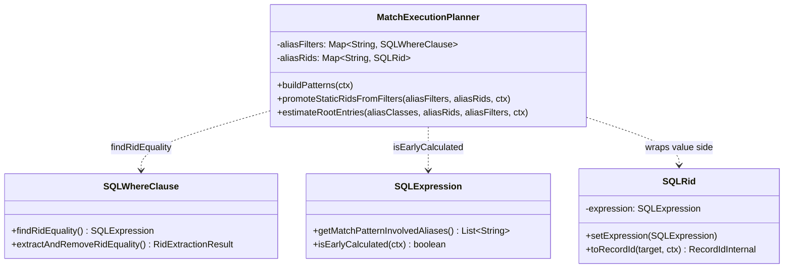

# MATCH Static-RID-in-WHERE Promotion — Design

## Overview

When a MATCH node carries a static RID equality inside its WHERE clause
(`WHERE: (@rid = #25:7)` or `WHERE: (@rid = :param)`), the planner does not
treat it as a singleton root candidate. `estimateRootEntries()` only collapses
to 1 for aliases present in `aliasRids`, and `aliasRids` is populated solely
from the parser's dedicated `{rid: #N:M}` slot. RID equalities living in
`aliasFilters` fall through to the `count/2` heuristic in
`SQLWhereClause.estimate`.

The proposed change adds one pass at the end of `buildPatterns()`:
`promoteStaticRidsFromFilters` walks each per-alias filter, locates a static
`@rid` equality, and copies it into `aliasRids` while leaving the filter
intact. This fixes two downstream effects:

1. `estimateRootEntries()` collapses the alias's estimate to 1, so the
   topological scheduler picks it as the cheapest root.
2. `createSelectStatement()` takes the `FetchFromRids` fast path instead of
   a class scan plus post-filter.

The fix is planner-only. No parser, runtime, public-API, or storage surface
is touched. Reverse traversal code (`MatchReverseEdgeTraverser`,
`updateScheduleStartingAt`) already handles the resulting plan shape.

## Class Design

The promoter reuses three existing helpers:

- `SQLWhereClause.findRidEquality()` returns the value-side `SQLExpression`
  of a non-destructive `@rid = <expr>` match, handling the AND/OR wrapping
  produced by `addAliases`.
- `SQLExpression.getMatchPatternInvolvedAliases()` returns the list of
  `$matched.X` references inside the expression; non-empty means back-ref.
- `SQLExpression.isEarlyCalculated(ctx)` returns true for literals, params,
  and other context-independent expressions.

The value-side `SQLExpression` is wrapped via `SQLRid.setExpression(...)`
(new setter; the field was previously protected and unreachable from the
`executor.match` package). `SQLRid.toRecordId()` already evaluates the
expression slot at execution time and unwraps the resulting `Identifiable`.

## Why Keep the @rid Term in the Filter

`MatchExecutionPlanner` already has a pre-filter pass (around line 3050)
that walks the edge schedule and attaches `RidFilterDescriptor.DirectRid`
on the producing edge whenever the target alias's WHERE contains a literal
or parameter `@rid`. That pass reads from `aliasFilters` via
`findRidEquality()`.

If the promoter stripped the `@rid` term, the pre-filter would no longer
fire for aliases that ended up as non-roots, regressing existing behaviour.
Keeping the term in place is safe:

- When the alias becomes a root, the post-fetch filter evaluates
  `@rid = #25:7` against the singleton RID set returned by `FetchFromRids`.
  The check is true, so the only cost is one boolean evaluation per record.
- When the alias is a non-root, the existing `DirectRid` pre-filter narrows
  the link bag to a singleton, unchanged.

A future change could split the term, attach `DirectRid` from `aliasRids`,
and remove it from the filter. That is out of scope here.

## Skipped Cases

The promoter only handles equalities that resolve without per-row context.
Three filters are explicitly skipped:

1. **Pre-existing RID slot.** When `aliasRids.containsKey(alias)`, the
   parser has already populated the slot via the `{rid: #N:M}` grammar.
   Overwriting would discard a stronger signal.
2. **`$matched.X.@rid` back-refs.** Detected via
   `getMatchPatternInvolvedAliases()`. These need runtime bindings and are
   handled by `EdgeRidLookup`, Pattern A back-ref hash join, or Chain
   Semi-Join in the downstream pre-filter pass. Promoting them would break
   those handlers and produce an unresolvable RID at plan time.
3. **Non-early-calculable expressions.** Anything that depends on the
   current row context (`$currentMatch.something`, computed expressions
   needing input data) cannot resolve to a RID at planning time.

The skip list is enforced by three guards in order, so the promoter is a
no-op on any expression it cannot prove is safe.

## Risks

- **Filter shape coverage.** `findRidEquality` recognises AND-of-equalities
  with the standard parser-emitted wrapper shapes. Filters that nest the
  `@rid` term inside an OR, NOT, or other non-AND boolean would not match,
  so the promoter quietly leaves them untreated. Acceptable: those queries
  are degenerate and rare; the pre-existing behaviour is preserved.
- **Duplicate evaluation.** When the alias is picked as a root, the WHERE
  post-filter re-evaluates `@rid = #N:M` against the singleton RID set.
  Cost is one boolean per record (the singleton). Negligible.
- **Cache-key churn.** `YqlExecutionPlanCache` keys plans by statement text.
  `aliasFilters` is mutated only by removing redundant terms today; the
  promoter does not strip, so the cache key remains identical. No churn.

## Test Plan

Unit (in place, `PromoteStaticRidsFromFiltersTest`, 7 tests):

- literal RID is promoted
- compound `@rid = X AND name = 'foo'` is promoted
- parameter RID `:param` is promoted
- `$matched.X.@rid` back-ref is left alone
- non-RID filter is left alone
- pre-existing `aliasRids` entry is not overwritten
- empty input produces empty output

Integration (to add):

- Multi-hop MATCH from the issue example
  (`{Person, as: p}.out('Knows'){Person}.out('Likes'){Comment, WHERE: (@rid = #N:M)}`)
  that asserts the produced plan has `FetchFromRids` as the root step and
  reverses traversal direction.
- End-to-end run against a real schema (Person/Comment/Knows/Likes) that
  asserts row count equals 1 for a known-good RID and 0 for a non-existent
  RID, with execution time within a sane budget.

Benchmark (optional, post-merge):

- LDBC-style query with one side restricted to a singleton RID and the
  other to a large class. Expect a one-shot O(degree) traversal instead
  of the full class scan + edge expansion.
