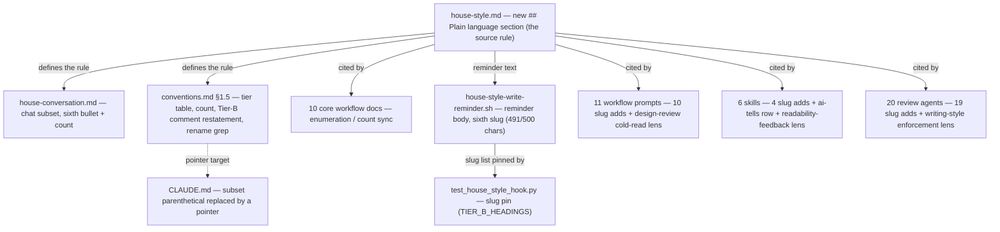

# Plain-language house-style rule for mid-level-English readers — Architecture Decision Record

## Summary

This change adds one rule, `## Plain language`, to the project house style at
`.claude/output-styles/house-style.md`, and makes every prose surface the house
style governs read clearly for a developer with mid-level English. The house
style already assumed a mid-level *Java and database* reader, a
technical-knowledge floor. It said nothing about English reading level. The new
rule adds that second axis. It covers chat, documentation, and issue and
pull-request text, so it joins the always-on AI-tell subset (the house-style
sections that apply to every prose surface, not only durable Markdown). That
subset grew from five sections to six, the same way `## Orientation` joined it
in the earlier explanation-style work (PR #1142, YTDB-1084 and YTDB-1106).

The rule is plain-language guidance, not a graded target. It asks the writer to
prefer the common word, keep sentences short, drop idioms and ambiguous phrasal
verbs, expand a non-floor acronym on first use, and keep grammar explicit. It
governs general English only. It never simplifies technical content and never
re-teaches the Java and database floor.

The work was a `lite`-tier change: no design document, a multi-track rollout. It
landed across about 53 files in three stages — the source rule with its
canonical homes plus the core docs, hook, and test; the workflow prompts and
skills; the review agents. Most edits are one-line enumeration syncs; a handful
are real content additions in the reviewers that enforce prose.

## Goals

- Add a `## Plain language` section to `house-style.md` that states the
  plain-language moves and a hard boundary against simplifying technical
  content. Done.
- Make the rule always-on by joining it to the AI-tell subset, so it reaches
  chat and code-comment rationale, not only durable Markdown. Done.
- Sync every site that names or counts the subset, so all of them list the same
  six section slugs and read "six". Done and verified.
- Give the reviewers that actively enforce prose a real Plain-language lens, so
  the rule is checked, not just cited. Done in four reviewers.

## Constraints

- Judgment guidance only. The change added no new mechanical check: no new
  regex rule, no sentence-length counter, no new test logic. It did sync the
  existing write-reminder hook and its existing pin test from five slugs to six.
  That is enumeration sync of checks that already existed, not new enforcement.
- The two "mid-level"s stay distinct. Mid-level *Java and database* is the
  unchanged technical-knowledge floor; mid-level *English* is the new
  reading-level axis. The new section states this boundary so the two never
  collide.
- The branch is held to its own new rule. Every artifact it wrote (the plan,
  the track files, the section itself) reads in plain language.
- The branch edits workflow prose live under the `conventions.md` §1.7(k)
  prose-rule self-application opt-out, rather than staging it. Live edits to
  `.claude/workflow`, `.claude/skills`, and `.claude/agents` advance the branch
  past its workflow-stamp base, so the workflow-drift gate fires on the branch's
  own authoring each session. It is suppressed per session.

## Architecture Notes

### Component Map

`house-style.md` is the single source of the rule; its new `## Plain language`
section sits right after `## Orientation`. Everything else cites the subset by
section name and was synced to name and count six sections. `house-conversation.md`
(the chat register) and `conventions.md §1.5` (the tier mapping) are the two
canonical subset homes. The 10 core workflow docs, the 11 prompts, the 6 skills,
and the 20 review agents each cite the subset. The write-reminder hook prints
the subset on every Write or Edit, and its pin test asserts each slug exists in
`house-style.md`. `CLAUDE.md` now points at the canonical homes instead of
listing the sections itself.

### Decision Records

#### D1: Plain-language target, not a graded band

The rule states plain-language moves with no number. It does not anchor to CEFR
B1–B2 (the Common European Framework of Reference, an English-proficiency scale)
or to a reading-grade band like Flesch-Kincaid 8–10. A named band or grade
implies a measurement the project will not run. Plain-language moves are
teachable and reviewable by eye, which fits the judgment-only enforcement in D2.
Implemented as planned.

#### D2: Judgment guidance only; no new mechanical enforcement

Plain-language quality is a judgment call: a short sentence can still be unclear,
and a long one can be clear. A regex would produce false positives and a
maintenance burden the em-dash counter already shows is touchy. So the rule lives
as prose in the style docs and the reviewer lenses, with no new check.

The one mechanical touch is enumeration sync: the write-reminder hook reminder
body and its pin test moved from five slugs to six. During execution the hook
body fit the sixth slug plus a folded code-comment carve note at 491 characters,
under the existing hard 500-character cap, so no cap was re-tuned. D2's intent
held: the rule itself is judgment-enforced, and the only test touched is the
anchor-existence pin that already guarded the slug list.

#### D3: Join the always-on subset (five to six) with natural reach and a Tier-B restatement

The rule joins the AI-tell subset, so it reaches chat, durable Markdown, and
`*.java`/`*.kt` code-comment rationale — the same reach `## Orientation` has. No
carve-out excludes code comments. The aim names conversation, which only the
subset reaches, and matching the Orientation precedent avoids a special case.

"Same reach as Orientation" is not "no per-surface text". Orientation carries a
Tier-B restatement at `conventions.md:574-581` because its literal test does not
transfer to a reader who has the file open. Plain language has the same gap, so
`conventions.md §1.5` gained a parallel paragraph: at code-comment scale the
common-word, acronym-expansion, and no-idiom moves apply; the
short-sentence / clause-nesting move does not. The new section and the hook
reminder both state this carve in one line. Implemented as planned.

#### D4: Take the §1.7(k) prose-rule self-application opt-out

The branch edits `.claude/workflow`, `.claude/skills`, and `.claude/agents` live
and is held to its own new rule while it runs, rather than staging the edits.
Both opt-out criteria hold: no `_workflow/**` artifact schema moves, and the
edits touch judgment-layer prose (the subset-enumeration sentence), not a parsed
control structure. The earlier explanation-style flip edited the same
execution-procedure files live under the same opt-out and shipped.

The cost is the workflow-drift gate firing each session on the branch's own
authoring, since live edits advance the branch past its stamp base. The plan's
remedy was to suppress the gate per session and run `/migrate-workflow` once at
the end. During execution this end-of-branch migration proved moot: the final
phase deletes the entire `_workflow/` subtree whose artifacts carry the stamps,
and the surviving artifact (this ADR) carries no stamp, so there is no future
reader of a re-stamped artifact. The drift gate was suppressed each session and
no migration was needed.

#### D5: New `## Plain language` section after `## Orientation`, with a boundary clause

The rule is its own section, placed right after `## Orientation`. A dedicated
section parallels Orientation (structural clarity) as its word-and-sentence
complement, so neither duplicates the other. The name "Plain language" is itself
plain and does not collide with the "mid-level Java and database developer"
reader phrase.

The section states two precedence rules. Against `## Banned vocabulary`: the
banned list owns the closed AI-tell word set, and plain language owns
general-English word choice outside it and never re-bans a tier word. Against
`## Voice and tone` "bias toward less text": plain language reduces word count
and shares the anti-padding stance, so it is never a license to add tutorial
text. The boundary clause is load-bearing: plain language governs general English
only and never simplifies a domain term such as MVCC, idempotent, latch, RID, or
WAL. Implemented as planned.

#### D6: De-enumerate `CLAUDE.md`, do not grow its count

`CLAUDE.md` listed the subset as a four-item parenthetical that already lagged:
it omitted `## Orientation`, because the earlier flip never touched the file.
Re-enumerating it to six would re-arm the same drift. Instead the parenthetical
became a pointer to the canonical homes. That fixes the lag and removes
`CLAUDE.md` from every future flip's blast radius, which matches the
single-source-of-truth discipline the rules already follow. A reader now follows
one pointer hop instead of reading an inline example. Implemented as planned.

#### D7: Active prose reviewers get a real lens; passive citations get only a slug

Sites that only cite the subset in a house-style preamble received a one-slug
addition. The four sites that actively enforce or audit prose received a real
Plain-language check: the cold-read in `prompts/design-review.md`, the `ai-tells`
skill catalogue, the `readability-feedback` audit, and the
`review-workflow-writing-style.md` reviewer. An always-on prose rule is inert if
the reviewers that judge prose do not check it. A slug in a citation is
documentation; a lens in a reviewer is enforcement.

Two execution details fell out of this. The `design-review.md` lens landed in the
block that already checks `## Orientation` and that runs on track review as well
as design review, which is the reach the rule needs; adding it there organized
the block's scan around a third "hard-to-read" axis. And the writing-style
reviewer's output contract had to grow with the lens: its finding-axis enum
gained a `plain language` value and its evidence-base description named the new
certificate shape, or a plain-language finding would be mislabeled as
banned-vocabulary, which the lens's own scope guard forbids. A new enforcement
criterion is not finished until the agent's output contract can carry its
findings. New decision.

#### D8: Complete and anchor the rename-detection grep helper

The `conventions.md §1.5` rename-detection helper finds every pointer to a subset
section, so a rename can update them in one commit. It listed only four of the
six headings, so renaming `## Orientation` or `## Plain language` found zero
pointer sites: the helper silently missed its job. Commit `7b8ad4f424` completed
it to all six and anchored the two common-word names (`Orientation`,
`Plain language`) to their `##`/`§` heading-pointer form. Anchoring matters:
bare matching of "Orientation" hit about 109 lines from the unrelated phrase
"Context and Orientation", while the anchored form returns 122 clean pointer-site
lines with none of those false hits. A verbatim copy of the helper in
`readability-feedback/SKILL.md` was synced byte-for-byte to match. New decision.

### Invariants & Contracts

- Every site that names the subset lists the same six slugs (`## Orientation`,
  `## Banned vocabulary`, `## Banned sentence patterns`,
  `## Banned analysis patterns`, `### Em-dash discipline`, `## Plain language`),
  and every numeric count of the subset reads "six". Verified after the rollout:
  all 20 review agents carry the slug and none still read "five"; the counts in
  `house-style.md`, `house-conversation.md`, and `conventions.md §1.5` read
  "six"; the pin test (`test_house_style_hook.py`) passes its full run, including
  the section-name guard that asserts all six headings exist in `house-style.md`.
- The new section governs general English only. No move in it bans, replaces, or
  re-teaches a technical term in the mid-level Java and database floor.

### Non-Goals

- No graded reading-level target: no CEFR anchor, no Flesch-Kincaid band. (D1)
- No new mechanical or regex check for plain language. (D2)
- No change to any `_workflow/**` artifact schema, resume-state field,
  drift-gate format, or stamp format. (D4)
- No rewrite of existing prose to plain language across the repo. The rule binds
  new and edited prose going forward, the way every other house-style rule binds.

## Key Discoveries

- The write-reminder hook reminder body has a hard 500-character cap, enforced by
  a budget test. The sixth slug plus a code-comment carve note fit at 491
  characters by folding the Orientation and Plain-language carves into one clause
  and dropping a secondary parenthetical. The cap stayed unchanged, which kept
  the judgment-only stance intact.

- `CLAUDE.md` already lagged before this change: its subset parenthetical listed
  four sections and omitted `## Orientation`, because the prior flip never edited
  the file. A live-prose surface that re-enumerates a list drifts every time the
  list grows. De-enumerating to a pointer fixed the lag and took the file out of
  future flips.

- The rename-detection grep helper listed only four of the six headings, so a
  rename of either common-word section would have found no pointer sites.
  Completing it to six and anchoring the two common-word names to their
  heading-pointer form yields clean matches with no false positives; bare
  matching of "Orientation" produced about 109 false hits from "Context and
  Orientation". The same helper had a verbatim copy in a second file that had to
  be synced.

- The design cold-read block organizes its scan by named axes. The new rule fit
  as a third "hard-to-read" axis, which meant syncing three restatement and
  routing sites plus the block's own index summary, not adding a single line. The
  expanded index summary first overran the 120-character index-row cap and failed
  the workflow reindex check until it was tightened.

- Adding an enforcement criterion to a review agent is not done until the agent's
  output contract can carry the finding. The writing-style reviewer's finding-axis
  enum and certificate shape had to grow with the new lens, or a plain-language
  finding would be mislabeled as one its scope guard forbids.

- Two coincidental "five" occurrences (one in a startup script's
  state-substate list, one in a research-log section reference) name unrelated
  things and were left unchanged. A wider grep would have flagged them as count
  sites; the in-scope set was reconciled by hand against the grep rather than
  taken from raw grep output.

- The workflow reindex tool reflows every file it scans, so its write mode
  repaired pre-existing index drift in five unrelated files. Those edits were
  reverted to keep the change scoped. A future workflow-doc edit that runs the
  reindex writer should expect the same out-of-scope reflow and revert it.

## Adversarial gate verdicts

The pre-code adversarial gate over the research log cleared on its third
iteration, against an iteration budget of three. The two earlier iterations
returned should-fix and suggestion findings only, with zero blockers at any
point, and every should-fix was resolved before the gate passed. The user added
a workflow-machinery prose lens to the gate for this change. No blocker or
should-fix remained when the gate cleared, so Phase-1 derivation proceeded.

## Token usage telemetry

Snapshot from this worktree's sessions over its lifetime (N=13 sessions across 61 transcripts).

### Tool mix — share of total session context

| Component             | Share |
|-----------------------|------:|
| `Read` tool results   | 63.0% |
| `Bash` tool results   | 14.3% |
| `Grep` tool results   | 0.0% |
| `Edit` tool results   | 0.4% |
| Other tool results    | 1.7% |
| Prompts and output    | 20.6% |

### Top files by share of `Read` token consumption

| File                                            | Share of Read |
|-------------------------------------------------|--------------:|
| <outside-worktree>                              | 15.5% |
| .claude/workflow/implementer-rules.md           | 11.2% |
| docs/adr/mid-level-english/_workflow/plan/track-1.md | 6.4% |
| .claude/workflow/self-improvement-reflection.md | 5.1% |
| docs/adr/mid-level-english/_workflow/implementation-plan.md | 4.6% |
| docs/adr/mid-level-english/_workflow/plan/track-2.md | 4.3% |
| .claude/workflow/prompts/adversarial-review.md  | 4.3% |
| .claude/output-styles/house-style.md            | 4.2% |
| .claude/workflow/step-implementation.md         | 3.6% |
| .claude/workflow/track-code-review.md           | 3.3% |

Generated by `.claude/scripts/measure-read-share.py` against
`~/.claude/projects/-home-andrii0lomakin-Projects-ytdb-mid-level-english/`.
