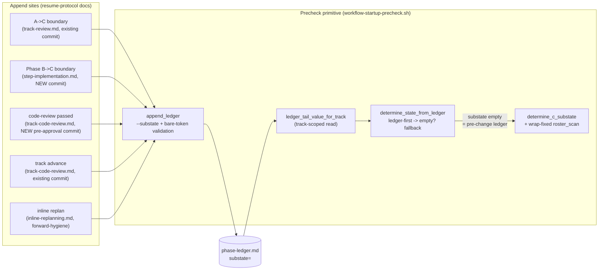

# Mid-track resume: route the State-C sub-state from the phase ledger — Architecture Decision Record

## Summary

A mid-track resume mis-routed when a step description hard-wrapped: the
`workflow-startup-precheck.sh` `roster_scan` miscounted the wrapped step, so a
finished track resolved to `steps-partial` instead of `steps-done-review-pending`
and the resume re-entered Phase B looking for a `[ ]` step that did not exist
(YTDB-1134). The fix removes the failure class rather than hardening one parser:
the within-track resume signal now lives on a track-scoped `substate` key on the
phase ledger — the durable append-only log that already owns the coarse resume
signal — and the precheck reads it ledger-first, keeping a wrap-fixed
`roster_scan` only as the fallback for pre-change and non-ledger plans.

The change is bash and markdown workflow machinery, in two halves: a read side
(the `substate` ledger key, a track-scoped reader, the ledger-first resolution,
the wrap fix, and the test surface in `workflow-startup-precheck.sh` and its test
file) and an append side (a `--substate` append at each within-track boundary
across the resume-protocol docs). The read side is independently mergeable and
landed dormant; the append side activates it.

## Goals

- Remove the wrap-induced resume mis-route (YTDB-1134) by sourcing the State-C
  sub-state from a durable place, not a fragile parse. **Met.**
- Land the literal YTDB-1134 acceptance criterion — count a step whose `risk:`
  tail wrapped onto a continuation line, with a regression test. **Met** (the
  wrap-fixed `roster_scan` plus its regression, including the two-adjacent-wrapped
  case).
- Keep the read side independently mergeable so the primitive can land before the
  wiring depends on it. **Met** — with no append site wired, every `substate` read
  is empty and resolution falls back to the wrap-fixed roster (the pre-change
  behavior plus the wrap fix).
- Leave the phase enum, the append atomicity, and the existing ledger keys
  untouched. **Met** — `substate` is added as the seventh bare-token key in the
  pre-`categories` block; nothing else in the grammar changes.

## Constraints

- **Committed-boundary cadence.** Every `substate` append must ride a commit that
  is already part of the protocol, so the ledger records only sub-states that
  survive the implementer's `git reset --hard HEAD` revert path. Held — and it
  surfaced that two boundaries, not one, needed a new commit to satisfy it (see
  Decision Records, D1).
- **The wiring pair must land together.** The A→C `steps-partial` append and the
  track-advance `decomposition-pending` append must land in one mergeable change;
  a split that wires one without the other leaves a `phase=C` track with no
  `substate` and silently triggers the fallback — the exact failure mode this work
  fixes. Held by keeping both appends in one step.
- **Staging.** This is a workflow-modifying change, so every edit accumulated
  under `_workflow/staged-workflow/.claude/...` and the live `.claude/` tree stayed
  at develop-state for the whole branch until the Phase 4 promotion commit.

## Architecture Notes

### Component Map

The change touches one script and the resume-protocol docs that call it, with the
phase ledger between them: the append sites write a `substate` key at each
within-track boundary, and the precheck reads that key to route a resume.

- **`workflow-startup-precheck.sh`** — the read side: the `--substate` append flag
  with bare-token validation, the bare `substate` token emitted before the quoted
  `categories` field, the track-scoped reader `ledger_tail_value_for_track`, the
  ledger-first read in `determine_state_from_ledger`'s `phase=C` arm, and the
  `roster_scan` continuation-line join (extracted into a `roster_process_step`
  helper). The header grammar comment names `substate` as the seventh key.
- **Resume-protocol docs** — the append sites: `track-review.md` (A→C
  `steps-partial`, on the existing decomposition commit), `step-implementation.md`
  (a new Phase-B-complete commit carrying `steps-done-review-pending`),
  `track-code-review.md` (a new pre-approval commit carrying
  `review-done-track-open`, plus `decomposition-pending` on the existing
  track-advance commit), and `inline-replanning.md` (a forward-hygiene
  `steps-partial` beside the `--phase 0` reset).
- **`phase-ledger.md`** — the existing append-only log gains one bare key,
  `substate`, the data contract both halves share.

### Decision Records

- **D1 — source the State-C sub-state from a track-scoped `substate` ledger key,
  populated by a committed-boundary append cadence.** The fine-grained resume
  signal lived in a fragile-to-parse place (the `## Concrete Steps` roster) when a
  durable one (the phase ledger) already recorded the coarse signal. One
  `substate=<slug>` key, read track-scoped (the ledger is last-value-wins across
  the whole file, so a global read would leak a completed prior track's terminal
  sub-state), resolves the sub-state without touching the track file. The four
  committed slugs map 1:1 to the slugs the resume protocol already routes on, so
  the phase enum is untouched. Each append rides an already-committed boundary so
  the ledger records only sub-states that survive `git reset --hard HEAD`;
  `failed-step` is excluded because its writes are uncommitted and
  working-tree-reconciled. **Changed during execution:** the design recorded "three
  boundaries ride existing commits; only Phase B→C needs a new commit." Wiring the
  appends found that the code-review-passed boundary had no committed home either —
  its "when all reviews pass" step was commit-free, and the only pre-approval
  commit fired before the gate verdict and on every fix iteration, so it could not
  mean "review passed." So **two** boundaries needed a new commit (Phase B→C and
  the pre-approval code-review-passed boundary), not one. The committed-boundary
  cadence decision itself is unchanged; only the incidental count moved.
  *Rejected:* a real `phase=B` token plus flags (widens the phase enum and touches
  every consumer that branches on it, and still cannot express
  `failed-step`/`review-done-track-open` without an extra field); the narrow
  `roster_scan`-only hardening (leaves the fragile-parse class as the routing
  source).

- **D2 — drop `section-discrepancy` from the routing path; keep and fix
  `roster_scan` as the fallback.** `section-discrepancy` is a torn-write
  cross-check that exists only because the old resume read two track-file sources
  (the roster and `## Progress`) that can disagree. With the ledger as the single
  routing source there is nothing to cross-check, and the ledger line commits
  atomically with the track-file change. So `section-discrepancy` leaves the ledger
  path but stays alive in `determine_c_substate`, which is reached only when the
  ledger read is empty (a pre-change or non-ledger plan). The wrap fix makes that
  fallback correct. A dual-path parity test pins the two readers to the same result
  on the four shared slugs. *Rejected:* fully retire `roster_scan` (breaks
  mid-flight and pre-ledger plans); keep `section-discrepancy` on the ledger path
  (no second source to disagree with, so dead code there). **Implemented as
  decided.**

- **D3 — the track-advance append sets `substate=decomposition-pending`
  explicitly.** On a current-scheme ledger every `phase=C` track then carries a
  non-empty `substate`, so an empty read means exactly one thing — a pre-change
  ledger — the unambiguous trigger to fall back. An empty default would conflate
  "genuinely not decomposed" with "append lost / old ledger" and revive the
  silent-default failure mode, the same mode the bug is an instance of. This pairs
  with D1's A→C append as a wiring pair both of which must land together.
  **Implemented as decided.** Its closure guarantee was refined during execution
  from "every `phase=C` track carries an explicit `substate`" to the accurate
  **non-emptiness** form: the empty-read fallback is never taken for a current
  plan; the terminal value matches lifecycle position for a multi-step track, and a
  single-step track terminates at a slug that still routes correctly to completion.

### Invariants & Contracts

- **S1 — track-scoped read.** The `substate` read keeps the last `substate` on a
  line whose `track=` equals the active track, never the global last value.
- **S2 — empty `substate` is pre-change-ledger.** On a current-scheme `phase=C`
  ledger every track carries a non-empty `substate`; an empty read triggers the
  roster fallback and nothing else.
- **S3 — dual-path parity.** For a track whose ledger `substate` and whose
  roster/`## Progress` imply the same slug, the ledger path and the ledger-stripped
  fallback path resolve to the identical sub-state.
- **S4 — committed-boundary cadence.** Every `substate` append rides a commit that
  survives `git reset --hard HEAD`. Verified by review of the append cadence (no
  direct unit test — the appends land in prose) plus the ledger-path test for the
  slug the new Phase-B-complete commit writes.
- **S5 — wrapped-roster fallback correctness.** The wrap-fixed `roster_scan` counts
  a step whose `risk:` tail wrapped onto a continuation line.
- **S6 — loud-reject append validation.** A `substate` value with a space or
  newline is rejected on append with exit 3 and a stderr diagnostic, the posture
  every bare-token field takes.

### Integration Points

- The `--substate <slug>` flag on `--append-ledger` is the contract between the
  append sites and the read side. The read side validates only bare-token-ness,
  not enum membership; the append sites are the sole writers of `substate` values,
  so the typo backstop is the by-inspection check that each appended slug is
  byte-identical to one of the four canonical slugs, not a runtime guard.
- The resume protocol's routing step is unchanged: the four committed slugs are
  byte-identical to the slugs it already routes on.

### Non-Goals

- A defensive enum-membership guard on `--substate` was weighed and deferred: the
  read side emits whatever slug it finds and the append validates only
  bare-token-ness, so a typo would pass through to the routing step, which has no
  catch-all row. Declined for this work as script-hardening outside the doc-only
  append boundary, and unnecessary while the append sites are the sole, reviewed
  writers. A future script-hardening change can add it.

## Key Discoveries

- **A cross-component test interaction is invisible to per-component review and
  only the cumulative pass catches it.** Staging one convention document moved
  where the test suite's repo-root resolver (`_resolve_live_repo_root()`) anchored:
  once a staged `conventions.md` existed, the resolver stopped at the staged-workflow
  root, so a fallback that resolves `track-review.md` landed inside the staged
  mirror (where that file was absent on this branch) and a pre-existing test
  false-failed. The fix hardens the walk to skip the `staged-workflow` segment and
  reach the real repo root. The break appeared only when both edits were present
  together, which the per-component review could not see and the cumulative track
  review did.

- **The code-review-passed boundary had no committed home.** The "when all reviews
  pass" step in the review protocol carried no commit, and the only pre-approval
  commit fired before that iteration's gate verdict and on every fix iteration, so
  it could not mean "review passed." Pinning a `review-done-track-open` append to a
  durable boundary therefore required adding a new pre-approval commit, distinct
  from the post-approval track-completion commit (which carries the next track's
  `decomposition-pending`). This is why two boundaries, not one, needed a new
  commit.

- **The new Phase-B-complete commit incidentally fixes a latent wart.** The old
  Phase B completion marked `Step implementation [x]` in `## Progress` and ended the
  session with no commit — the flip was uncommitted at session end and survived only
  because the per-step flips were already committed in each episode. The new commit
  stages that flip alongside the `steps-done-review-pending` append, so the
  previously-uncommitted flip now lands in a commit, symmetric with the A→C
  boundary.

- **The inline-replan `substate` append is forward-hygiene, not the routing
  mechanism.** An inline replan resets the phase with `--phase 0`, which is
  last-value-wins, and the resolver returns the State-0 result before the `phase=C`
  arm that reads `substate`. So the `--substate steps-partial` written on the replan
  commit is never read on the replan resume itself; it is kept only as cheap
  forward-hygiene that survives the revert and keeps the track's last-value-wins
  `substate` from claiming review-pending. The `--phase 0` reset is the routing
  signal.

- **A single-step track's terminal `substate` depends on its risk tag.** A
  `risk: high` single-step track skips the track-level review loop and terminates at
  `steps-done-review-pending`; a `risk: medium`/`low` single-step track runs the
  full review loop, reaches the new pre-approval commit, and terminates at
  `review-done-track-open`. Both slugs route correctly to completion, because the
  resume checks whether review applies before proceeding.

## Adversarial gate verdicts

The pre-code adversarial gate ran on the research log at the Phase 0→1 boundary
and cleared before any code was written:

- **Research-log adversarial gate: PASS at iteration 3** (2026-06-23). Iterations 1
  and 2 returned should-fix findings only (0 blockers) — drop `step-failure` from
  the ledger append sites, pin the `review-done-track-open` append to the
  pre-approval commit, add the dual-path parity test and the empty-`substate`
  closure invariant, and add the missing committed Phase-B→C boundary — all absorbed
  into the decisions. Iteration 3 cleared with 0 new findings, 0 blockers,
  0 should-fix.

The per-track pre-implementation gates (technical, risk, adversarial) each passed
at iteration 2 with all findings accepted, except one adversarial challenge to the
core→consumer track split, which was rejected on the merits (the sizing
justification held). Model note: the adversarial gate ran on `opus` throughout
(`fable` unavailable in the environment, a documented fallback, not a downgrade).

## Token usage telemetry

Snapshot from this worktree's sessions over its lifetime (N=10 sessions across 83 transcripts).

### Tool mix — share of total session context

| Component             | Share |
|-----------------------|------:|
| `Read` tool results   | 68.6% |
| `Bash` tool results   | 8.2% |
| `Grep` tool results   | 0.4% |
| `Edit` tool results   | 0.3% |
| Other tool results    | 2.8% |
| Prompts and output    | 19.7% |

### Top files by share of `Read` token consumption

| File                                            | Share of Read |
|-------------------------------------------------|--------------:|
| .claude/scripts/workflow-startup-precheck.sh    | 10.5% |
| docs/adr/mid-track-resume/_workflow/plan/track-1.md | 9.4% |
| docs/adr/mid-track-resume/_workflow/plan/track-2.md | 8.3% |
| docs/adr/mid-track-resume/_workflow/design.md   | 6.7% |
| <outside-worktree>                              | 5.8% |
| .claude/output-styles/house-style.md            | 5.7% |
| docs/adr/mid-track-resume/_workflow/staged-workflow/.claude/scripts/workflow-startup-precheck.sh | 4.9% |
| .claude/workflow/implementer-rules.md           | 4.1% |
| .claude/workflow/track-code-review.md           | 4.0% |
| .claude/workflow/self-improvement-reflection.md | 3.3% |

Generated by `.claude/scripts/measure-read-share.py` against
`~/.claude/projects/-home-andrii0lomakin-Projects-ytdb-mid-track-resume/`.
