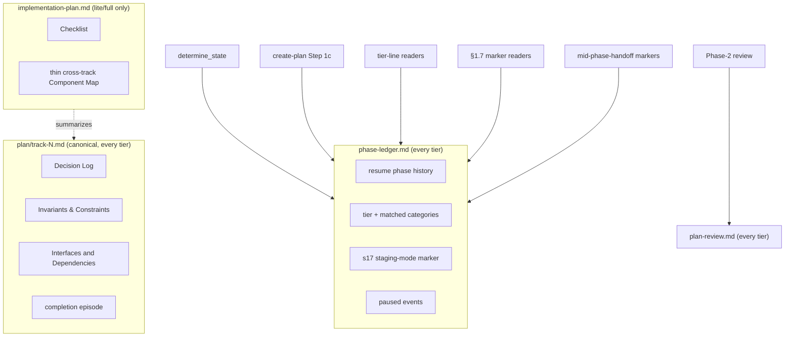

# no-track-for-minimal — Architecture Decision Record

## Summary

The workflow used to ship `implementation-plan.md` in every tier. The `minimal`
tier shipped a shape-complete stub of it only because the resume state machine
(`determine_state`), the drift gate, and Phase-2 routing parsed the plan, so the
file had to exist for the machinery to read. The plan also owned strategic
content — Goals, Constraints, Architecture Notes — that the track files either
already owned or should own.

This change makes `implementation-plan.md` a derived summary of the track files
and drops it entirely in the single-track `minimal` tier. The enabling primitive
is an append-only **phase ledger** (`_workflow/phase-ledger.md`) that owns the
branch-level state the machinery reads: resume phase, the change tier and its
matched categories, the §1.7 staging mode, and pause events. Once the ledger
owns that state, the plan carries none of it, the track files become the single
canonical home for per-track content, and a one-track `minimal` change has
nothing left to keep a plan for. A new `plan-review.md` holds the Phase-2 audit
summary in every tier; the track template gains a combined
`## Invariants & Constraints` section.

It closes YTDB-1123 (build the script-maintained phase ledger and drop the
`minimal` stub plan) and YTDB-1125 (the `minimal` stub had no `### Constraints`
home for the §1.7 staging marker) under one model: branch-level facts live in
the ledger, per-track facts live in the track files, the cross-track summary
lives in the plan.

## Goals

All planned goals were met as designed.

- Make `implementation-plan.md` a derived mirror of the track files: the plan
  holds no fact a track does not already own.
- Drop the plan outright in `minimal`; thin it to a Checklist plus a thin
  cross-track Component Map in `lite`/`full`.
- Give branch-level machine-read state a non-plan home (the phase ledger) so the
  `minimal` drop does not break resume, the drift gate, or Phase-2 routing.
- Keep resume backward-compatible: an in-flight `lite`/`full` plan created before
  the ledger scheme still resumes from its checkboxes.

## Constraints

- **Resume backward compatibility held.** `determine_state` stays a two-level
  lookup: the ledger owns the top-level phase and active track, the track file's
  `## Progress` owns the within-track sub-state. With no ledger present, the
  script falls back to the unchanged plan-checkbox walk, so existing in-flight
  plans resume unchanged. Every re-pointed runtime read is ledger-first with the
  develop-era plan or `### Constraints` read kept as the pre-ledger fallback.
- **The drift gate keeps a stamped anchor.** Dropping the `minimal` plan does not
  weaken drift detection: `track-1.md` is always present and stamped, so the
  §1.6(h) stamp fold still has an anchor. The ledger and `plan-review.md` are
  unstamped, added to the §1.6(f) exclusion list by omission from the drift
  gate's hardcoded artifact set.
- **§1.7 staging scope had to grow (new constraint, D14).** The planned scope
  assumed "every `.claude/**` edit stages," but the develop-era §1.7 routed only
  `.claude/workflow/**`, `.claude/skills/**`, and `.claude/agents/**`. Because the
  change's enabling primitive is a `.claude/scripts/` file, the convention was
  extended to a fourth prefix, `.claude/scripts/**`.
- **A Track-canonical spec needed a narrow cross-track amendment.** The §1.7(c)
  read-side spec in `conventions.md` still said "the implementer reads
  `### Constraints`." Leaving it stale while its consumers read the ledger would
  make the spec contradict its consumers, so the §1.7(c) read-side wording was
  amended alongside the consumer re-point that depends on it.

## Architecture Notes

### Component Map

The artifact model has three homes and one new sibling document. Each fact has
one owner; the plan reads as a summary of the tracks, never a second copy. The
topology was implemented as designed.

- **`phase-ledger.md`** — append-only event log, one line per phase boundary,
  carrying an ISO timestamp, a `[ctx=…]` marker, and the key set `{phase, track,
  tier, categories, s17, paused}`; last-value-wins on read. Written by the
  orchestrator's `workflow-startup-precheck.sh --append-ledger` subcommand.
  Unstamped.
- **`plan/track-N.md`** — canonical for every per-track fact; gained the combined
  `## Invariants & Constraints` section (now fifteen sections) and now owns the
  completion episode the `minimal` tier writes directly.
- **`implementation-plan.md`** — dropped in `minimal`; thinned in `lite`/`full`
  to the `## Design Document` link (full only), a thin cross-track Component Map,
  and the Checklist.
- **`plan-review.md`** — holds the Phase-2 consistency/structural audit summary in
  every tier; the review *state* lives in the ledger, the review *fact and
  summary* live here.

### Decision Records

D1 through D13 were implemented as planned (the design was frozen on them). D14
emerged during execution.

- **D1 — Plan is a derived mirror of the tracks.** The track files are canonical
  for detailed content; the plan summarizes only next-track continuation and
  cross-track impact. *Implemented as planned* in `conventions.md` §1.2,
  `planning.md`, and the `create-plan` templates.
- **D2 — Minimal drops the plan; lite/full thin it.** A one-track plan mirrors a
  single track and its cross-track view is vacuous, so `minimal` ships no
  `implementation-plan.md`. *Implemented as planned* (per-tier artifact set;
  `create-plan` dropped the `minimal` stub template and thinned the `lite`/`full`
  aggregator).
- **D3 — Ledger authoritative for resume state.** The startup script derives
  State 0 / A / C / D / Done from the ledger tail instead of plan checkboxes.
  *Implemented as planned* in `workflow-startup-precheck.sh`.
- **D4 — Branch-level facts live in the ledger.** The tier line with its matched
  categories and the §1.7 staging mode are whole-change properties no single
  track owns, so they sit in one fixed ledger location (the `tier`, `categories`,
  and `s17` fields). *Implemented as planned.*
- **D5 — Old plan sections disposed per section.** `### Goals` dropped (its aim
  lives in the research log and the PR `## Motivation`); Architecture Notes
  Decision Records are track-canonical; the completion episode is canonical in
  the track file with a one-line summary and pointer in the `lite`/`full`
  Checklist. *Implemented as planned.*
- **D6 — Ledger is an append-only event log written by an orchestrator
  subcommand.** One append per phase boundary, last-value-wins on read; a
  mid-flight tier change appends a new value. *Implemented as planned* via the
  `--append-ledger` subcommand. The subcommand grew a published validation
  contract during execution (see Key Discoveries).
- **D7 — Phase-2 audit summary moves to a new plan-review.md.** Review *state*
  stays in the ledger (an appended `phase=A` boundary event); the multi-line
  review *summary* lives in the document, which exists in every tier. *Implemented
  as planned* in `implementation-review.md`, `review-plan/SKILL.md`, the
  structural-review docs, and the Phase-4 fold.
- **D8 — Pause boundaries recorded as ledger events.** The two mid-phase-handoff
  secondary markers that sat beneath the removed `## Plan Review` and
  `## Final Artifacts` plan sections move to ledger `paused` events; the recovery
  grep was extended to the ledger and a clear-on-resolution rule added.
  *Implemented as planned* in `mid-phase-handoff.md`.
- **D9 — Combined `## Invariants & Constraints` track section (the 15th).**
  Testable constraints and the Architecture Notes invariants share one home;
  Integration Points move to `## Interfaces and Dependencies`, Non-Goals to the
  research log and PR `## Motivation`. *Implemented as planned* in
  `conventions-execution.md` §2.1, `planning.md`, and the `create-plan` track
  template.
- **D10 — Step 1c routes resume on the ledger, not plan presence.** A plan-less
  `minimal` resume reads the ledger (present plus a readable `tier` field) and the
  `plan/track-1.md` glob as a secondary signal, instead of hitting the
  "neither file exists — fresh start" branch and re-running research, tier
  classification, and the gate. `lite`/`full` keep plan presence as the signal.
  *Implemented as planned* in `create-plan` Step 1c.
- **D11 — Minimal→lite/full escalation materializes the dropped plan and design.**
  `inline-replanning` is a tier-line writer, not only a reader; a
  `minimal`→`lite`/`full` upgrade writes the upgraded tier as a ledger event and
  creates the `implementation-plan.md` (and `design.md` for `full`) the source
  tier never had. *Implemented as planned* in `inline-replanning.md`.
- **D12 — Branch is §1.7(b) staging-bound, not §1.7(k)-eligible.** Moving the
  resume-state field and adding a track-file section each independently fail the
  §1.7(k) opt-out criterion, so every `.claude/**` edit stages under
  `_workflow/staged-workflow/`. *Implemented as planned* (this branch's own
  artifacts stayed current-format and staged every workflow edit).
- **D13 — Ledger is unstamped (research-log precedent).** An append-only log that
  no §1.6(h) walk enumerates and no phase re-derives is replay-immune, so a
  stamp would be dead weight and would trip the drift gate's unstamped detection.
  *Implemented as planned* — the ledger and `plan-review.md` are excluded by
  omission from the drift gate's artifact list; no `detect_drift` code change was
  needed.
- **D14 — §1.7 staging covers `.claude/scripts/**` (emerged during execution).**
  Pre-execution adversarial review of the change found that the design's
  "every `.claude/**` edit stages" assertion was not backed by the convention,
  which routed only three prefixes and omitted `.claude/scripts/**` from the
  Phase-4 promotion `git add` and divergence check. The user ratified extending
  §1.7 to a fourth prefix. *Implemented* in `conventions.md` §1.7(a)/(b)/(d)/(e),
  the `implementer-rules` pre-commit live-path gate, and the
  `create-final-design.md` Phase-4 divergence check plus `git add`. Because the
  extension takes effect only after this branch's own promotion, the branch ran
  under the develop-era three-prefix §1.7 and staged its own script and tests by
  manual copy-then-edit.

### Invariants & Contracts

- The ledger tail is the single source of resume top-level phase state;
  within-track sub-state stays in the track file's `## Progress`.
- The plan holds no fact a track does not already own; every Checklist track
  resolves to a `plan/track-N.md`.
- Every per-track constraint and invariant has exactly one home in the track
  file's `## Invariants & Constraints`.
- A tier upgrade never leaves the destination tier missing a required artifact.
- The branch stages every live workflow edit; nothing edits `.claude/**` in
  place until the Phase-4 promotion commit.
- The `--append-ledger` subcommand is a loud-fail contract: a malformed field
  value or an unrecognized `phase` token exits 3 with a stderr diagnostic, and a
  write failure exits non-zero rather than silently dropping or corrupting the
  tail. Callers check the exit status rather than assume success.

### Integration Points

- `workflow-startup-precheck.sh` — `determine_state` reads the ledger tail; the
  `--append-ledger` subcommand owns the atomic append.
- `create-plan` — Step 1c resume routing reads the ledger; Phase-1 seeds the
  ledger with `--phase 0`, the `tier`, and `categories`.
- The tier-line readers, the §1.7 marker readers, the gate-recheck prompts, the
  implementer pre-commit gate, the mid-phase-handoff markers, and the Phase-4
  start/resume signal all read or write the ledger.
- `implementation-review.md` / `review-plan` — write the audit summary to
  `plan-review.md` and the review state to the ledger.

### Non-Goals

- No change to the within-track sub-state walk (`## Progress` / `## Concrete
  Steps`); only the top-level phase state moved to the ledger.
- No automatic tier downgrade and no re-run of a completed review on escalation.
- No change to the handoff file itself; only its two plan-anchored secondary
  markers relocated to the ledger.
- This branch's own artifacts were not converted to the plan-as-mirror shape;
  they stayed current-format (D12).

## Key Discoveries

- **A latent shell-glob newline guard was silently broken and is worth avoiding
  elsewhere.** The append's field validator first tested for an embedded newline
  with `*"$(printf '\n')"*`, which degenerates to `*""*` because command
  substitution strips the trailing newline — so the glob matched every value
  rather than only newline-bearing ones. The fix uses a `$'\n'` ANSI-C variable
  inside a `case` glob. Any future bash field-validation guard in the workflow
  scripts should use the ANSI-C form, not a command-substitution glob.
- **The ledger `phase` vocabulary is a fixed published set, deliberately coarse.**
  The `phase` token is one of `{0, A, C, D, Done}`; an unrecognized token is a
  loud parse error (exit 3). The within-track sub-phase is never written to the
  ledger (the design diagram's illustrative `phase=3C` does not occur on disk) —
  it stays in the track file under the two-level resume rule. Callers must emit
  exactly these tokens.
- **`phase=0` is a clean reset under the append-only model.** Resetting Plan
  Review is a single `--append-ledger --phase 0` append; last-value-wins makes a
  "remove the prior `phase=A` line" operation unnecessary.
- **The consumer inventory was larger than the initial file-scope estimate.**
  Pre-execution and per-track review found consumers of the removed plan sections
  beyond the first cut: the drift gate's Phase-4 migration-skip, the
  `execute-tracks` State-0 end-session read, the `review-plan` audit write side,
  the workflow-level `structural-review.md` (distinct from the prompt of the same
  name), and the slim-plan renderer's "keep `## Final Artifacts` verbatim" rule.
  Within-file coherence also forced re-pointing co-resident secondary marker reads
  that, left on the old source, would have made a file contradict itself.
- **A thinned plan needs the structural reviewer's presence checks re-pointed, or
  it draws false findings.** The structural-review presence checks asserted that
  Decision Records, Invariants, and Integration Points "all live in the plan."
  Against a legitimately thinned plan that carries none, those checks would emit
  false "missing Decision Record" findings, so their source tags were re-pointed
  to the track-canonical homes (`## Decision Log`, `## Invariants & Constraints`,
  `## Interfaces and Dependencies`).
- **The staging-mode token spelling was deliberately left unpinned by the
  primitive and pinned by the consumer.** The script validates only that the
  `s17` value is a bare, metacharacter-free token; the literal staging-mode
  spelling was fixed by the consumer re-point rather than the ledger primitive, so
  the primitive does not pre-empt its consumers.

## Adversarial gate verdicts

The pre-code adversarial gate ran on the research log at the Phase 0 → 1
boundary and cleared before any code was written.

- First run: NEEDS REVISION — 1 blocker, 2 should-fix, 2 suggestions.
- Second run: PASS — the blocker and should-fix items were resolved (the Step-1c
  ledger rewire, the `minimal`→`lite`/`full` escalation materialization, the
  branch's §1.7(b) staging mode, and the unstamped ledger); one suggestion was
  rejected on a held owner decision (the separate `plan-review.md` was kept rather
  than folded into a ledger event). No new findings; gate cleared, design
  authoring unblocked.

Verdict: passed at iteration 2 (blockers-resolved-then-passed).

## Token usage telemetry

Snapshot from this worktree's sessions over its lifetime (N=9 sessions across 62 transcripts).

### Tool mix — share of total session context

| Component             | Share |
|-----------------------|------:|
| `Read` tool results   | 66.8% |
| `Bash` tool results   | 13.1% |
| `Grep` tool results   | 0.0% |
| `Edit` tool results   | 0.6% |
| Other tool results    | 1.5% |
| Prompts and output    | 18.0% |

### Top files by share of `Read` token consumption

| File                                            | Share of Read |
|-------------------------------------------------|--------------:|
| <outside-worktree>                              | 22.7% |
| docs/adr/no-track-for-minimal/_workflow/plan/track-2.md | 9.1% |
| .claude/workflow/implementer-rules.md           | 7.2% |
| docs/adr/no-track-for-minimal/_workflow/plan/track-1.md | 6.4% |
| docs/adr/no-track-for-minimal/_workflow/implementation-plan.md | 5.0% |
| docs/adr/no-track-for-minimal/_workflow/staged-workflow/.claude/workflow/conventions.md | 2.8% |
| docs/adr/no-track-for-minimal/_workflow/staged-workflow/.claude/scripts/workflow-startup-precheck.sh | 2.6% |
| .claude/workflow/self-improvement-reflection.md | 2.6% |
| docs/adr/no-track-for-minimal/_workflow/design.md | 1.9% |
| docs/adr/no-track-for-minimal/_workflow/staged-workflow/.claude/skills/create-plan/SKILL.md | 1.9% |

Generated by `.claude/scripts/measure-read-share.py` against
`~/.claude/projects/-home-andrii0lomakin-Projects-ytdb-no-track-for-minimal/`.
