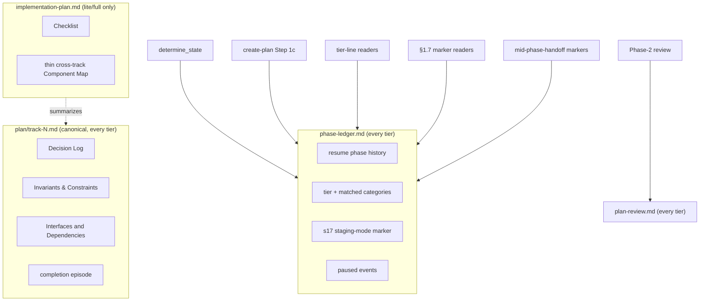
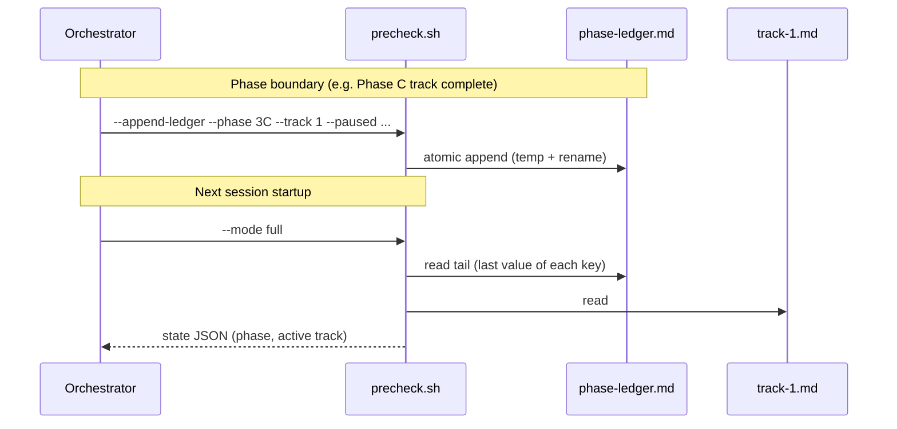

# no-track-for-minimal — Design

## Overview

Before this change every tier shipped `implementation-plan.md`. The `minimal`
tier shipped a shape-complete stub of it for one reason: the resume state
machine (`determine_state`), the drift gate, and Phase-2 routing parsed the
plan, so the file had to exist for the machinery to read. The plan also owned
strategic content — Goals, Constraints, Architecture Notes — that the track
files either already owned (Decision Records) or should have owned.

This change makes `implementation-plan.md` a **derived summary** of the track
files. The track files are now the single canonical home for detailed content;
the plan keeps only what the next session needs to pick up the next track and
assess cross-track impact. The `minimal` tier, where there is one track, drops
the plan outright.

The enabling primitive is an append-only **phase ledger** under `_workflow/`.
The ledger owns the branch-level state the machinery reads: resume phase, the
change tier and its matched categories, and the §1.7 staging mode. Once the
ledger owns that state, the plan carries none of it, and a one-track `minimal`
change has nothing left to keep a plan for.

Several consumers moved to fit. `determine_state` reads the ledger tail instead
of plan checkboxes. `create-plan` Step 1c routes a resume on the ledger, not on
plan presence. The tier-line and §1.7 marker readers read the ledger, falling
back to the old plan or track scan for branches created before the ledger
scheme. The Phase-2 audit summary moved to a new `plan-review.md`. The two
mid-phase-handoff markers that sat in plan sections moved to the ledger.
Per-track constraints gained a combined `## Invariants & Constraints` track
section. A `minimal`→`lite`/`full` escalation materializes the plan and design
the source tier never had. The build also extended the §1.7 staging convention
to cover `.claude/scripts/**`, because the branch's enabling primitive is a
script (D14).

The rest of this document covers the Core Concepts, the artifact model and
consumer topology (Class Design), the runtime flows (Workflow), then one
section each for the ledger, resume routing, the thinned plan and the
plan-review document, the track-file dispositions, the mid-flight tier upgrade,
and this branch's own §1.7 staging mode.

## Core Concepts

This design introduces five load-bearing ideas. Each is named and used without
re-definition in the sections that follow; each entry pairs the new idea with
the baseline behavior it replaces.

**Phase ledger.** An append-only event log at `_workflow/phase-ledger.md`, one
line per phase boundary, owning the branch-level state the machinery reads. Each
line carries an ISO timestamp, a `[ctx=…]` marker, and the key set `{phase,
track, tier, categories, s17, paused}`; a reader keeps the latest value of each
key. The `s17` field is the §1.7 staging-mode home. Replaces the plan checkboxes
and the plan tier line that the startup script parsed. → §"The phase ledger".

**Derived-mirror plan.** `implementation-plan.md` reduced to a cross-track
summary — the Checklist plus a thin cross-track Component Map — that mirrors
content the track files own. Replaces the plan as an owner of Goals,
Constraints, and Architecture Notes. → §"The thinned plan and the plan-review
document".

**Plan-review document.** A new `_workflow/plan-review.md` holding the Phase-2
consistency and structural audit summary. Replaces the audit text that
overwrote the plan's `## Plan Review` section. → §"The thinned plan and the
plan-review document".

**Combined Invariants & Constraints section.** A new track-file section that
holds both per-track constraints and the testable invariants the plan's
Architecture Notes carried. Replaces the plan `### Constraints` block and the
Architecture Notes `Invariants & Contracts` list. → §"Track-file dispositions".

**Three canonical homes.** The rule that each fact lives in exactly one place:
branch-level state in the ledger, per-track content in the track files,
cross-track summary in the plan. Replaces the dual ownership the workflow-SHA
stamp gate exists to catch. → §"Class Design".

## Class Design

The artifact model has three homes and one new sibling document. Each fact has
one owner; the plan reads as a summary of the tracks, never a second copy.

Each home owns a distinct slice. The ledger owns branch-level machine-read
state. The track files own every per-track fact: decisions, constraints,
invariants, interfaces, and the completion episode. The plan, present only in
`lite` and `full`, owns the cross-track view: the Checklist with track ordering
and dependencies, and a thin Component Map for impact assessment. It holds no
fact a track does not already own. The plan-review document holds the Phase-2
audit summary in every tier.

## Workflow

Three runtime flows change: the phase-boundary ledger write, resume routing,
and the `minimal`→`lite`/`full` escalation.

On a phase boundary the orchestrator calls the `--append-ledger` subcommand,
which appends one event line atomically. On the next startup the script reads
the ledger tail to derive the top-level phase and the active track, then reads
the track file's `## Progress` for the within-track sub-state, exactly as it did
when it parsed plan checkboxes. A `minimal`→`lite`/`full` escalation appends the
upgraded tier as a ledger event and creates the `implementation-plan.md` (and
`design.md` for `full`) the source tier lacked, through the existing
inline-replan ESCALATE path.

## The phase ledger

**TL;DR.** An append-only event log at `_workflow/phase-ledger.md` owns the
branch-level state the machinery reads. D3 makes it authoritative for resume
state, D6 fixes its event-log shape and orchestrator-written subcommand, D4
moves the tier line and §1.7 marker into it, D8 records pause markers as events,
and D13 keeps it unstamped on the research-log precedent.

D3 makes the ledger the authoritative carrier of resume phase state. The startup
script reads the ledger to derive State 0 / A / C / D / Done instead of parsing
plan checkboxes. The rejected alternative kept a parsed stub plan in every tier;
it blocks the `minimal` drop and leaves two writers of the same fact.

D6 fixes the ledger as an append-only event log: one line per phase boundary
carrying an ISO timestamp, a `[ctx=…]` marker, and the key set `{phase, track,
tier, categories, s17, paused}`, written by the orchestrator's
`workflow-startup-precheck.sh --append-ledger` subcommand at the same points it
flipped checkboxes. A reader takes the latest value of any key, so a mid-flight
tier change appends a new value rather than rewriting one. The `phase` and
`track` fields feed `determine_state`; `tier`, `categories`, and `s17` serve the
tier-line and §1.7 readers; `paused` carries the relocated handoff markers. The
rejected current-state-file alternative would need an in-place atomic rewrite;
the rejected script-infers-boundaries alternative would force the script to
reconstruct orchestrator actions.

The `--append-ledger` subcommand validates each field so a malformed value can
never split the single-line-per-event contract the rest of the machinery greps:
a value carrying an embedded newline or `=`, or a double quote inside the quoted
`categories` field, is rejected with a stderr diagnostic and exit 3, and the
`phase` token is checked against the published vocabulary `{0, A, C, D, Done}`
with a mismatch exiting 3 as well. The append fails loud on a write error rather
than silently dropping an event. The field validation is backed by a
shell-glob guard whose first form was latently broken — the newline test
degenerated to a match against the empty string — so the guard was rewritten to
actually fire before the contract could rely on it.

D4 puts the branch-level facts in the ledger: the tier line with its matched
categories, and the §1.7 staging mode (the `s17` field). These are whole-change
properties that no single track owns in a multi-track `lite`/`full` plan, so a
per-tier home would scatter them. One fixed ledger location serves the
implementer §1.7(c) gate, the §1.7(l) review re-point, and the tier-line
readers.

D8 records a paused phase boundary as a ledger event. The two
mid-phase-handoff secondary markers that sat beneath `## Plan Review` and
`## Final Artifacts` (Phase-2/State-0 and Phase-4) move here, because those plan
sections are removed. The handoff file itself is unchanged; only the in-plan
defense-in-depth marker relocates. A ledger paused event is read by
`determine_state` on resume, which is stronger than a human-only cue.

D13 keeps the ledger unstamped, following the `research-log.md` precedent: an
append-only log that no §1.6(h) walk enumerates and no phase re-derives is
replay-immune, so a workflow-SHA stamp would be dead weight and would trip the
drift gate's unstamped detection. The ledger is added to the §1.6(f) exclusion
list alongside `research-log.md` and `plan-review.md`.

### Edge cases / Gotchas

- An interrupted append is reconciled the same way `determine_state` already
  reconciles an interrupted `## Progress` write: the temp-file-plus-rename
  append is atomic, so a torn write leaves the prior tail intact and the prior
  state resolves. A `RETURN` trap removes the temp file on any exit path.
- The drift gate still folds the stamp of `track-1.md`, which is always present
  and stamped, so dropping the plan does not weaken drift detection.

### Decisions & invariants

- D-records: D3 (ledger authoritative for resume state), D4 (branch-level facts
  live in the ledger), D6 (append-only event log, orchestrator-written
  subcommand), D8 (pause boundaries recorded as ledger events), D13 (ledger
  unstamped, research-log precedent).
- Invariants: the ledger tail is the single source of resume phase state;
  within-track sub-state stays in the track file's `## Progress`. A malformed
  ledger field is loud-rejected, never silently absorbed.

## Resume routing

**TL;DR.** D10 rewires `create-plan` Step 1c to disambiguate a resume on the
ledger, not on plan-file presence, so a plan-less `minimal` branch resumes to
its real state instead of restarting.

`determine_state` reads the ledger tail for the top-level phase and active
track, then the track file's `## Progress` for the within-track sub-state. This
is the change from the three-checkbox parse described in the ledger section
above. A branch whose ledger is absent — an in-flight `lite`/`full` plan created
before the ledger scheme — falls back to the old plan-checkbox walk, so existing
work resumes unchanged.

Resume is a two-level lookup by design. The ledger owns the top-level phase and
the active track; the track file owns the within-track sub-state. Folding the
within-track sub-state into the ledger, so the ledger is the single state file,
was rejected for two reasons. A step's status is glued to its content: the
description, risk tag, commit SHA, and episode all live in the track's
`## Concrete Steps` and `## Episodes`, so moving the status alone would separate
a step's status from its identity. The ledger also appends only once per phase
boundary, whereas per-step status changes on every step and every review
iteration; that granularity is too coarse to carry sub-state. Each level keeps
one canonical home, so the ledger is the single source for the state it owns
without being the single file for all state.

D10 covers a second resume consumer the dissolution analysis first missed:
`create-plan` Step 1c. It routed on whether `design.md` and
`implementation-plan.md` exist; a `minimal` resume with neither would hit the
"Neither file exists — fresh start" branch and re-run research, tier
classification, and the adversarial gate. D10 makes Step 1c read the ledger:
when the ledger is present and its `tier` field is readable, the session resumes
to the recorded state. The `plan/track-1.md` glob is the secondary signal for
the `minimal` resume target. For `lite`/`full`, plan presence stays the signal,
because the plan still exists.

### Edge cases / Gotchas

- The narrow window where the Phase-1 gate cleared but no ledger entry was
  written yet reads as a fresh start, which is correct: nothing durable was
  produced.
- The tier-line and §1.7 marker readers resolve the ledger first and fall back
  to the plan or track `### Constraints` scan, so a branch predating the ledger
  scheme reads its mode from the location it actually wrote.

### Decisions & invariants

- D-records: D10 (Step 1c routes resume on the ledger, not plan presence).
- Invariants: a resume never restarts a `minimal` change that has a ledger.

## The thinned plan and the plan-review document

**TL;DR.** D1 makes `implementation-plan.md` a derived summary of the tracks; D2
drops it entirely in `minimal` and thins it in `lite`/`full`; D5 disposes of
each old plan section; D7 moves the Phase-2 audit into a new `plan-review.md`.

D1 makes the plan a derived mirror of the track files. The track files are
canonical for detailed content; the plan summarizes only what the next session
needs — next-track continuation and cross-track impact. The rejected status-quo
kept the plan canonical for Architecture Notes, which left two writers of the
same fact and the drift the stamp gate exists to catch.

D2 scopes the change by tier. The `minimal` tier has one track, so a plan would
mirror a single track and a cross-track view is vacuous; `minimal` drops
`implementation-plan.md` outright. The `lite` and `full` tiers keep a thinned
plan. The rejected all-tiers-keep-a-plan alternative leaves `minimal` carrying a
redundant one-track summary.

D5 disposes of the old plan sections. `### Goals` is dropped: it was read only by
the structural bloat check, and the aim lives in the research log's
`## Initial request` and the PR `## Motivation`. Architecture Notes Decision
Records are track-canonical, so the plan stops carrying them; the plan keeps only
a thin cross-track Component Map for impact. The completion episode is canonical
in the track file, and the `lite`/`full` Checklist keeps a one-line summary and
pointer. The Checklist itself stays in `lite`/`full` as the cross-track
navigation layer.

D7 moves the Phase-2 audit summary out of the plan's `## Plan Review` section
into a new `_workflow/plan-review.md`. The review *state* lives in the ledger
(the resume hot path, an appended `phase=A` boundary event); the review *fact
and summary* live in the document (a cold record, rarely read during
development). The audit summary is multi-line review prose, so keeping it out of
the append-only ledger tail keeps that tail terse for `determine_state` to grep.
The document exists in every tier, so `minimal` has a review-fact home without a
plan. Phase 4 folds the verdict into `adr.md` or the `minimal` PR-description
summary as it did before.

### Edge cases / Gotchas

- With `## Plan Review` and `## Final Artifacts` removed, the thinned
  `lite`/`full` plan is the top-level heading, the `## Design Document` link
  (`full` only), the thin Component Map, and the Checklist.
- `/review-plan` re-runs append their verdict to `plan-review.md`.

### Decisions & invariants

- D-records: D1 (plan is a derived mirror of the tracks), D2 (minimal drops the
  plan, lite/full thin it), D5 (old plan sections disposed per section), D7
  (Phase-2 audit moves to plan-review.md).
- Invariants: the plan holds no fact a track does not own; every Checklist track
  resolves to a `plan/track-N.md`.

## Track-file dispositions

**TL;DR.** D9 adds a combined `## Invariants & Constraints` track section that
holds both per-track constraints and the Architecture Notes invariants, and
routes Integration Points and Non-Goals to sections that already exist.

D9 adds one track-file section, `## Invariants & Constraints`, making the track
template fifteen sections. The testable technical, performance, and
compatibility constraints from the plan's `### Constraints` and the Architecture
Notes `Invariants & Contracts` are the same shape — a property that must hold,
backed by a test — so they share one home rather than two. A process-only
constraint that is not testable (for example, a rule to use the IDE refactor
engine) goes to `## Context and Orientation`, or the Decision Log when it is a
real decision. Integration Points move to the existing
`## Interfaces and Dependencies`. Non-Goals move to the research log and the PR
`## Motivation`, and in `full` to `design.md`; per-track out-of-scope already
lives in `## Interfaces and Dependencies`. The rejected alternatives were a
separate `## Constraints` section with invariants left in
`## Validation and Acceptance`, which scatters two like concepts, and folding
both into `## Validation and Acceptance`, which buries binding constraints under
acceptance criteria.

### Edge cases / Gotchas

- The new section is additive; the rest of the prior fourteen-section track
  template is unchanged.

### Decisions & invariants

- D-records: D9 (combined Invariants & Constraints track section; Integration
  Points → Interfaces and Dependencies, Non-Goals → research log / PR).
- Invariants: every per-track constraint and invariant has one home in the track
  file.

## Mid-flight tier upgrade

**TL;DR.** D11 makes a `minimal`→`lite`/`full` escalation materialize the plan
(and design, for `full`) the source tier never had, since inline-replanning is a
tier-line writer, not only a reader.

D11 covers the escalation path. The tier-line consumers include
`inline-replanning`, which is a writer: an ESCALATE tier upgrade rewrites the
tier line, and a `lite`→`full` upgrade writes a new design seed. Under D2 the
`minimal` tier has no plan and no design, so a `minimal`→`lite`/`full` upgrade
must create them. The upgrade carrier writes the upgraded tier as a ledger event
and materializes `implementation-plan.md` (and `design.md` for `full`) as part
of the upgrade. The plain "tier-line readers → ledger" routing under-specified
this writer-and-materialization side.

### Edge cases / Gotchas

- A downgrade is not automatic; a completed review is not re-run, matching the
  existing mid-flight upgrade rule.

### Decisions & invariants

- D-records: D11 (minimal→lite/full escalation materializes the dropped plan and
  design).
- Invariants: an upgrade never leaves the destination tier missing an artifact
  it requires.

## This branch's §1.7 staging mode

**TL;DR.** D12 records that this branch is workflow-modifying under §1.7(b) and
stages all `.claude/**` edits; it does not qualify for the §1.7(k) prose-rule
opt-out. D14 extends the staging convention itself to cover `.claude/scripts/**`,
because the branch's enabling primitive is a script.

D12 fixes the branch's own §1.7 mode. The §1.7(k) opt-out criterion 1
disqualifies any plan that moves a resume-state field or a track-file section.
This branch moves the resume-state field from plan checkboxes to the ledger and
adds a track-file section; each independently fails that criterion, so the
branch is staging-bound under §1.7(b). Every `.claude/**` edit stages under
`_workflow/staged-workflow/`: `workflow-startup-precheck.sh`, the `create-plan`
SKILL, `conventions.md`, `planning.md`, the tier-line-reader prompts,
`track-code-review`, `mid-phase-handoff`, and `inline-replanning`. The derived
plan's `### Constraints` carries the §1.7(b) marker, and implementer and
reviewer steps use staged-read precedence.

D14 extends the shipped §1.7 convention to a fourth path prefix. Before this
change §1.7 routed `.claude/workflow/**`, `.claude/skills/**`, and
`.claude/agents/**`; it did not auto-route `.claude/scripts/**`. This branch
edits `.claude/scripts/workflow-startup-precheck.sh` and its two test files, and
D12 asserts that every `.claude/**` edit stages, so the convention must back that
claim. §1.7(a), (b), (d), and (e) now list `.claude/scripts/**`, the
workflow-modifying marker sentence names four prefixes, and the implementer
pre-commit gate refuses a live `.claude/scripts/**` edit outside the promotion
commit. The Phase 4 promotion divergence check and `git add` were extended to
include `.claude/scripts` so a promoted startup script reaches `develop`.

### Edge cases / Gotchas

- The §1.7-covers-scripts extension takes effect only after this branch's own
  Phase 4 promotion, so the branch ran under the develop-era §1.7 that routed
  three prefixes. Its script and the two test files were staged by manual
  copy-then-edit, and the develop-era pre-commit gate did not guard a live-script
  slip — the staging was a branch-local discipline until promotion makes the gate
  enforce it.
- This branch's own `implementation-plan.md` is a current-format full aggregator
  plan with the §1.7 marker in its `### Constraints`; the plan-as-mirror shape
  applies to changes planned after this one merges.

### Decisions & invariants

- D-records: D12 (branch is §1.7(b) staging-bound, not §1.7(k)-eligible), D14
  (§1.7 staging covers `.claude/scripts/**`).
- Invariants: the branch stages every live workflow edit; nothing edits
  `.claude/**` in place. After promotion, a workflow-modifying branch that ships
  a script stages it under the same convention as every other workflow file.
