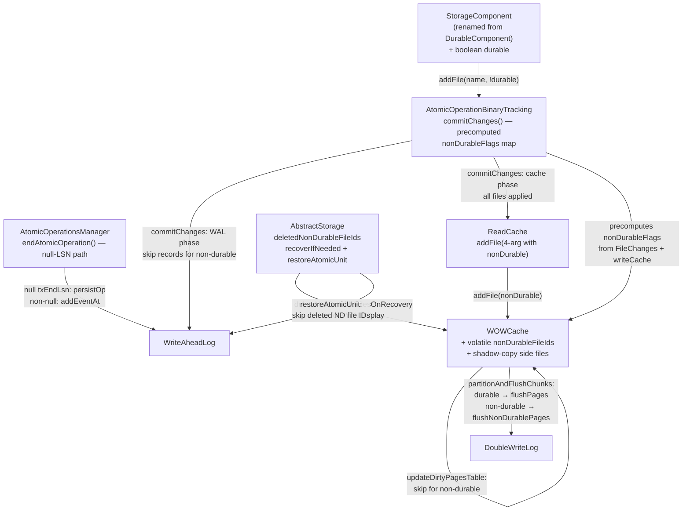

# Non-Durable Data Structure Support in WOWCache — Architecture Decision Record

## Summary

YouTrackDB's WOWCache (Write-Once-Write cache) is the disk-based write cache for
all paginated storage. This feature adds per-file non-durability support so that
cache-backed data structures can opt out of WAL logging, double-write log
protection, and fsync while still participating in the normal page cache
lifecycle. Non-durable files are automatically deleted on crash recovery and
preserved on clean shutdown. This infrastructure enables future non-durable data
structures (e.g., MVCC redo-log) without touching the existing durability
contract for all current storage components.

## Goals

1. **Per-file non-durability**: Components declare durability at construction
   time via `StorageComponent(storage, name, ext, lockName, durable)`.
   Non-durable files skip WAL, DWL, and fsync on their I/O paths.
   *Achieved as planned.*

2. **Mixed atomic operations**: A single atomic operation can touch both durable
   and non-durable files. WAL records are emitted only for durable file changes;
   non-durable changes are applied to cache without logging.
   *Achieved as planned.*

3. **Backward compatibility**: Existing storages with no non-durable files work
   without migration. The side file is only created when the first non-durable
   file is registered. All new interface methods use `default` implementations
   that preserve durable-only behavior.
   *Achieved as planned.*

4. **Crash recovery safety**: Non-durable files are deleted before WAL replay.
   WAL replay gracefully skips records referencing deleted non-durable file IDs.
   *Achieved as planned.*

## Constraints

- **No new name-id map version**: Non-durability tracked in a separate side file,
  not in the v3 name-id map format. *Upheld.*
- **No LSN for non-durable pages**: Non-durable pages use null LSN throughout
  the cache application phase. `setEndLSN()` and `setLsn()` are skipped.
  *Upheld.*
- **Checksums preserved**: Non-durable pages still get magic numbers and CRC32
  checksums for runtime corruption detection. *Upheld.*
- **Flush I/O separation**: Non-durable pages bypass DWL and fsync.
  *Upheld.*
- **DurablePage class unchanged**: The page header layout class is shared by both
  durable and non-durable pages. *Upheld.*
- **New constraint discovered**: `filesLock` (ReadersWriterSpinLock) is not
  reentrant. The crash recovery deletion method uses a snapshot-then-release
  pattern instead of holding the lock during deletion.

## Architecture Notes

### Component Map

- **StorageComponent**: Base class for all storage data structures. Holds
  immutable `boolean durable` field. 9 existing subclasses pass `true`.
- **WOWCache**: Tracks non-durable file IDs in `volatile IntOpenHashSet`
  (copy-on-write under `filesLock`). Persists in versioned shadow-copy side file
  pair. `partitionAndFlushChunks()` replaces all `flushPages()` call sites.
- **AtomicOperationBinaryTracking**: Precomputes `Long2BooleanOpenHashMap` of
  non-durable flags per operation for consistent classification across WAL and
  cache phases. Defers `AtomicUnitStartRecord` until first durable change.
- **AtomicOperationsManager**: Handles null `txEndLsn` from pure non-durable
  operations by persisting immediately (no WAL event deferral).
- **ReadCache**: Gained `addFile(String, long, WriteCache, boolean)` default
  method to forward non-durable flag during commit.
- **AbstractStorage**: Deletes non-durable files in `recoverIfNeeded()` before
  `restoreFromWAL()`. `restoreAtomicUnit()` skips all three WAL record types
  for deleted non-durable file IDs.

### Decision Records

#### D1: Side file vs name-id map v4 for durability persistence

- **Implemented as planned.** Shadow-copy side file pair
  (`non_durable_files.cm` + `non_durable_files_shadow.cm`).
- **Modification**: Added a 4-byte version field at the start of the file
  format, not in the original design. This was a low-cost addition recommended
  during Track 2 review for forward compatibility. The version field is not
  covered by the xxHash (version check runs before hash verification).
- **Format**: `[version(4)][xxHash64(8)][count(4)][fileIds(count x 4)]`.
  Total: `16 + 4N` bytes.

#### D2: Separate flush path vs conditional skips in flushPages()

- **Modified during execution.** Instead of a separate flush method called by
  callers who pre-partition their page sets, the implementation uses a single
  `partitionAndFlushChunks()` method that replaced all 6 `flushPages()` call
  sites. This method snapshots `nonDurableFileIds` once, classifies chunks by
  the first page's file ID, and routes to either `flushPages()` (durable) or
  `flushNonDurablePages()` (non-durable).
- **Rationale for change**: Centralizing the partitioning eliminated the need
  for callers to understand durability — only one method needs to know about
  the split. A fast path skips partitioning entirely when no non-durable files
  exist (the common case).
- **Shared helpers**: `copyPageChunksIntoTheBuffers` and
  `writePageChunksToFiles` are reused by both paths. The original plan called
  for extracting these as new helpers, but they already existed as internal
  methods.

#### D3: Rename DurableComponent -> StorageComponent

- **Implemented as planned.** ~25 files renamed/updated. Exception classes
  renamed (`StorageComponentException`, `CommonStorageComponentException`).
  Test class renamed. Steps 1 and 2 consolidated into a single commit because
  the bulk `sed` rename changed class names inside exception files, requiring
  both renames in the same commit for compilability.

#### D4: WAL logging skip in mixed atomic operations

- **Implemented with enhancement.** The deferred single-pass approach works as
  designed. Enhancement: non-durable flags are precomputed into a
  `Long2BooleanOpenHashMap` at the start of `commitChanges()` instead of
  querying `writeCache.isNonDurable()` inline during each phase.
- **Rationale for change**: Track 5 code review discovered that two separate
  volatile reads of `nonDurableFileIds` (one per phase) could see different
  snapshots if another thread mutates the set between phases. The precomputed
  map guarantees consistent classification.
- **Null txEndLsn handling**: When an operation contains only non-durable
  changes, `commitChanges()` returns null. `AtomicOperationsManager
  .endAtomicOperation()` handles this by calling `persistOperation()`
  immediately rather than deferring via `writeAheadLog.addEventAt(null, ...)`.

#### D5: Flush-path WAL isolation (emerged during execution)

- **New decision.** Two WAL-related findings in the flush path were deferred
  from Track 4 to Track 5:
  1. `executeFileFlush()` unconditionally called `writeAheadLog.flush()` even
     when all files are non-durable. Fixed with a guard that checks whether any
     file in the set is durable.
  2. `flushExclusiveWriteCache()` accumulated `maxFullLogLSN` from non-durable
     pages. Analysis showed non-durable pages have null `endLSN` (set in
     Track 5), so the existing null check in the max-LSN accumulation loop
     naturally excludes them. A defensive assertion was added.
- **Rationale**: These are correctness and performance concerns — unnecessary
  WAL flushes waste syscalls, and incorrect LSN accumulation could block WAL
  truncation.

#### D6: Crash recovery snapshot-then-release pattern (emerged during execution)

- **New decision.** `deleteNonDurableFilesOnRecovery()` cannot hold `filesLock`
  while calling `readCache.deleteFile()` because the lock is not reentrant
  (`ReadersWriterSpinLock`). The method snapshots non-durable IDs under a read
  lock, releases, then iterates the snapshot to delete files (each deletion
  re-acquires the write lock internally).
- **Partial failure handling**: If deletion fails for a file, its ID remains
  in the returned `deletedIds` set. WAL replay still skips records for it.
  The updated registry is persisted so the next recovery attempt can retry.
- **Rationale**: The snapshot-then-release pattern is the simplest approach
  given the non-reentrant lock. Partial failure safety was added during
  Track 6 code review (finding CS1) — the original implementation removed
  failed IDs from the set, which would have allowed WAL replay to restore
  stale non-durable data.

### Invariants

- Non-durable pages must never enter the `dirtyPages` table (enforced by
  `updateDirtyPagesTable()` early return; defensive assert in
  `flushWriteCacheFromMinLSN()`).
- Non-durable pages must never be written to the double-write log (enforced by
  `partitionAndFlushChunks()` routing).
- Non-durable file data must never trigger `fsync` (enforced in
  `flushNonDurablePages()`, `syncDataFiles()`, `executeFileFlush()` tail loop).
- Crash recovery must delete all non-durable files before WAL replay starts
  (enforced by `recoverIfNeeded()` call order).
- If both side files are missing or corrupt, treat all files as durable (safe
  fallback implemented in `readNonDurableRegistry()`).
- Mixed atomic operations must produce correct WAL records for the durable
  subset only, with atomic unit start/end records emitted only if at least one
  durable change exists (enforced by deferred `walUnitStarted` flag and
  precomputed `nonDurableFlags` map).
- Failed non-durable file deletions during crash recovery must keep the file ID
  in `deletedIds` to prevent WAL replay from restoring stale data.

### Integration Points

- Components declare non-durability via
  `StorageComponent(storage, name, ext, lockName, /* durable */ false)`.
- `WriteCache.addFile(String, long, boolean)` — default method accepts
  `nonDurable` flag.
- `WriteCache.isNonDurable(long fileId)` — O(1) check against volatile set.
- `WriteCache.deleteNonDurableFilesOnRecovery(ReadCache)` — crash recovery API.
- `AtomicOperation.addFile(String, boolean)` — abstract method; 1-arg default
  delegates with `nonDurable=false`.
- `ReadCache.addFile(String, long, WriteCache, boolean)` — default method
  forwards non-durable flag to write cache.

### Non-Goals

- Implementing any specific non-durable data structure (this is infrastructure
  only).
- Modifying the name-id map format (v3 is unchanged).
- Changing `DurablePage` page header layout.
- Non-durable file support for in-memory storage (`EngineMemory`).

## Key Discoveries

1. **TOCTOU race in addFile()**: The original design had two separate
   `filesLock` acquisitions in `addFile()` — one for the name-id map entry and
   one for the non-durable set update. This created a window where a file could
   be visible to other threads but not yet marked non-durable. Fixed by merging
   the 2-arg `addFile` into the 3-arg method under a single lock hold (Track 2,
   Step 1).

2. **Inseparable WAL and cache phases**: Track 5 planned separate steps for the
   WAL skip and cache application adjustments. In practice, skipping WAL records
   without adjusting the cache phase causes NPEs (`setLsn(null)`) because
   `changeLSN` is never set for non-durable files. These must be implemented
   together.

3. **startLSN capture timing**: The initial implementation captured `startLSN`
   after `AtomicUnitEndRecord` instead of after the start record. This would
   cause dirty pages to pin the wrong WAL segment, potentially blocking WAL
   truncation. Fixed during Track 5 step review.

4. **Non-reentrant filesLock**: `ReadersWriterSpinLock` does not support
   reentrant acquisition. This affected crash recovery (Track 6) where the
   deletion loop needed to release the lock before calling
   `readCache.deleteFile()` which re-acquires it internally. The
   snapshot-then-release pattern was the solution.

5. **Mock stub cascade**: Changing `AtomicOperation.addFile()` from 1-arg to
   2-arg broke 101 tests in `CollectionPositionMapV2Test` because existing
   Mockito mocks only stubbed the 1-arg signature. The default method delegation
   pattern (1-arg delegates to 2-arg) was specifically chosen to avoid this, but
   `StorageComponent.addFile()` calls the 2-arg version directly, bypassing the
   default (Track 3, Step 2).

6. **Flush thread crash safety**: The initial `flushNonDurablePages()` had a
   `copiedPages` counter mismatch in the error path — on partial failure, the
   count didn't match the actual number of buffers allocated, which would crash
   the flush thread during cleanup. Fixed during Track 4 review. Additionally,
   direct memory buffer leaks on error were identified and fixed.

7. **Side file deletion order**: During Track 2 code review, the shadow file
   deletion order was corrected — shadow must be deleted before primary to
   maintain the invariant that the shadow is always at least as old as the
   primary during normal writes.

8. **Partial failure in crash recovery**: The initial Track 6 implementation
   removed failed file IDs from the deletion set in the catch block. This would
   allow WAL replay to restore pages for a file that was supposed to be
   non-durable — a data corruption risk. Fixed by keeping failed IDs in the
   returned `deletedIds` set (finding CS1).

9. **Unnecessary WAL flush**: `executeFileFlush()` unconditionally called
   `writeAheadLog.flush()` even when all files in the flush set are
   non-durable. While low-impact (one syscall), it was unnecessary. A guard was
   added to skip the flush when no durable files are present (Track 5, Step 3).
