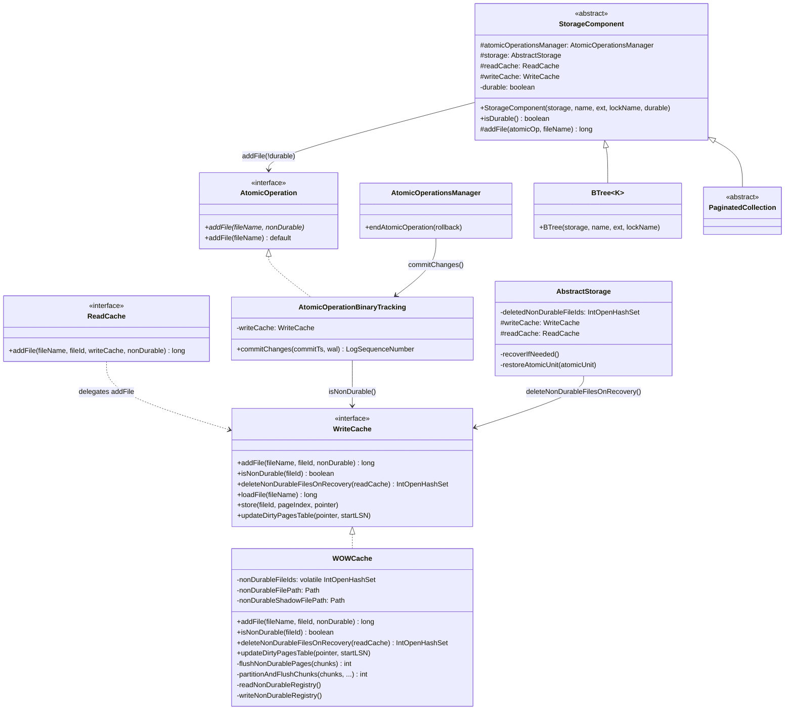
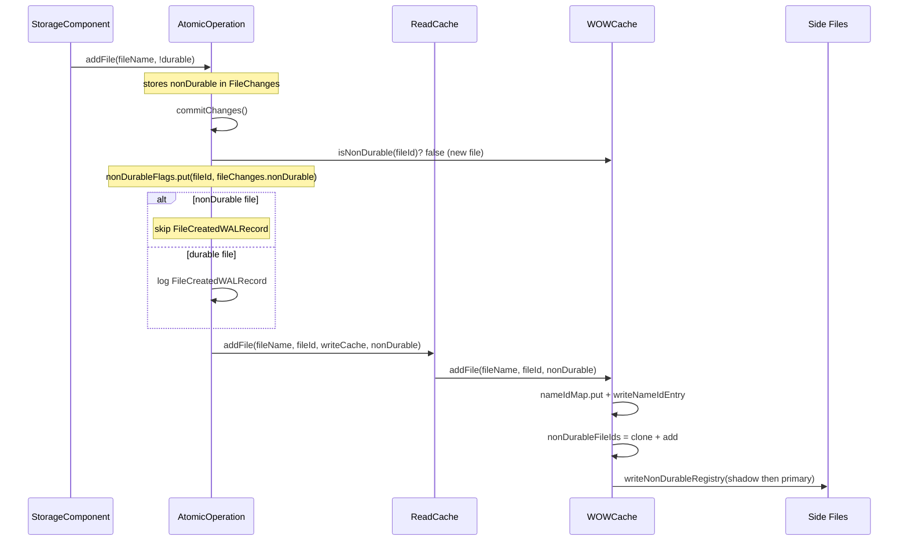
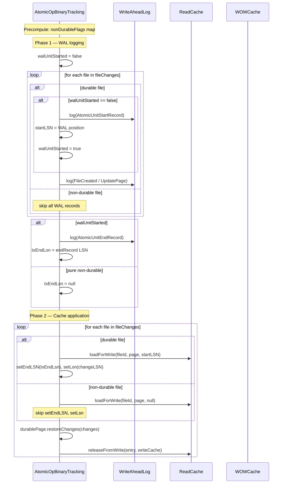
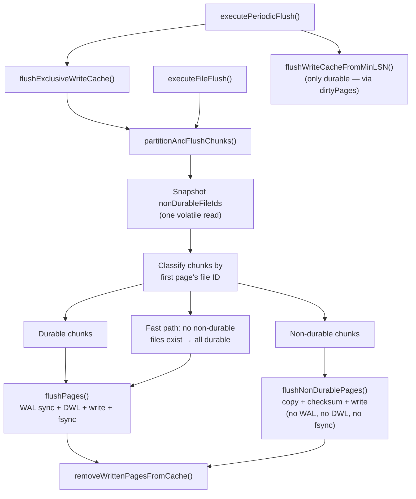
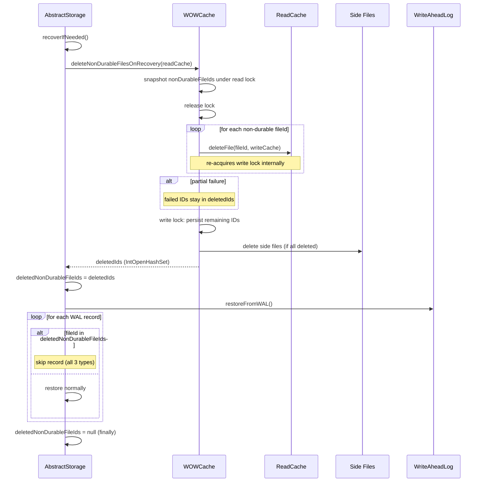

# Non-Durable Data Structure Support in WOWCache — Final Design

## Overview

This feature adds per-file non-durability support to the WOWCache write cache,
allowing disk-cache-backed data structures to opt out of WAL logging,
double-write log protection, and fsync while still participating in the normal
page cache lifecycle. Non-durable files are automatically deleted on crash
recovery and preserved on clean shutdown.

The implementation spans four layers: (1) `StorageComponent` declares durability
at construction time, (2) `WOWCache` tracks non-durable file IDs in a volatile
set with shadow-copy side file persistence, (3) `AtomicOperationBinaryTracking`
skips WAL records for non-durable files during commit, and (4) `AbstractStorage`
deletes non-durable files before WAL replay on crash recovery.

**Deviations from original design:**
- Steps were frequently consolidated (e.g., Track 1 merged rename + exception
  renames; Track 5 merged WAL phase + cache application phase) because
  interdependent changes could not compile independently.
- Side file format gained a 4-byte version field (not in original design).
- `commitChanges()` precomputes non-durable flags into a
  `Long2BooleanOpenHashMap` instead of making two separate volatile reads of
  `nonDurableFileIds` — a consistency fix discovered during Track 5 review.
- `partitionAndFlushChunks()` replaced all `flushPages()` call sites instead
  of having callers build separate chunk lists — cleaner than the original
  "extract shared helpers" approach.

## Class Design



**StorageComponent** (renamed from `DurableComponent`) is the abstract base class
for all storage-backed data structures. It holds an immutable `boolean durable`
field set at construction. All 9 existing subclasses pass `true`. The `addFile()`
helper passes `!durable` to `AtomicOperation.addFile(String, boolean)`.

**WriteCache** interface gained three default methods: `addFile(String, long,
boolean)` (delegates to 2-arg with `nonDurable=false`), `isNonDurable(long)`
(returns `false`), and `deleteNonDurableFilesOnRecovery(ReadCache)` (returns
empty set). These defaults preserve backward compatibility with test mocks.

**WOWCache** implements the non-durable registry using a `volatile IntOpenHashSet`
with copy-on-write semantics under `filesLock`. Mutations (add/delete/replace)
clone the set, mutate, and publish atomically. Readers (flush paths,
`updateDirtyPagesTable`, `commitChanges`) read the volatile reference without
locking for O(1) contains checks with no boxing overhead.

**AtomicOperationBinaryTracking** precomputes per-file non-durable flags into a
`Long2BooleanOpenHashMap` at the start of `commitChanges()`, combining both
`FileChanges.nonDurable` (for newly created files) and
`writeCache.isNonDurable()` (for existing files loaded via `loadFile()`). This
single snapshot ensures consistent classification across both the WAL emission
and cache application phases.

**AtomicOperationsManager** handles null `txEndLsn` from pure non-durable
operations by calling `persistOperation()` immediately instead of deferring via
`writeAheadLog.addEventAt(lsn, ...)`.

**AbstractStorage** stores `deletedNonDurableFileIds` during crash recovery (set
by `deleteNonDurableFilesOnRecovery()`, consumed by `restoreAtomicUnit()`,
cleared in `finally`).

## Workflow

### File Registration



The non-durable flag flows from `StorageComponent` through `AtomicOperation` to
`ReadCache` to `WOWCache` at commit time. Within `WOWCache.addFile()`, the 2-arg
overload delegates to the 3-arg version under a single `filesLock` hold,
eliminating a TOCTOU window where a file could be visible but not yet marked
non-durable.

### Atomic Operation Commit (Mixed Durable + Non-Durable)



The WAL phase uses a deferred single-pass approach: `AtomicUnitStartRecord` is
emitted on the first durable file encountered. `startLSN` is captured
immediately after the start record (not after the end record — critical for
correct dirty page table segment tracking). For pure non-durable operations,
`txEndLsn` is null and `AtomicOperationsManager` handles this by persisting
immediately.

### Flush Path



`partitionAndFlushChunks()` replaces all 6 former `flushPages()` call sites. It
takes a single volatile snapshot of `nonDurableFileIds` and classifies each chunk
by checking the first page's internal file ID. A fast path skips partitioning
entirely when the non-durable set is empty (the common case for existing
storages).

`flushNonDurablePages()` reuses `copyPageChunksIntoTheBuffers` and
`writePageChunksToFiles` but omits the double-write log, WAL sync, and fsync
steps. On error, it logs a warning and returns without calling
`removeWrittenPagesFromCache()` — the pages remain in the exclusive write cache
and will be retried on the next flush cycle.

`executeFileFlush()` conditionally skips `writeAheadLog.flush()` when all files
in the flush set are non-durable. The tail fsync loop also skips non-durable
files.

### Crash Recovery



Non-durable files are deleted before WAL replay begins. The
`deleteNonDurableFilesOnRecovery()` method uses a snapshot-then-release pattern
because `filesLock` (ReadersWriterSpinLock) is not reentrant — it snapshots
non-durable IDs under a read lock, releases, then calls `readCache.deleteFile()`
for each (which re-acquires the write lock internally).

If deletion fails for a file, that file's ID remains in the returned
`deletedIds` set. This ensures WAL replay still skips records for it — the
failed file is treated as deleted even though it may still exist on disk. The
updated registry is persisted so the next recovery attempt can retry.

`restoreAtomicUnit()` checks `deletedNonDurableFileIds.contains()` for all three
WAL record types (`FileDeletedWALRecord`, `FileCreatedWALRecord`,
`UpdatePageRecord`) and skips records referencing deleted non-durable files.

## Non-Durable Side File Format

Non-durable file IDs are persisted using a shadow-copy pair:
`non_durable_files.cm` (primary) and `non_durable_files_shadow.cm` (shadow).

**Format** (both files identical):
```
[4 bytes version] [8 bytes xxHash64 of payload] [4 bytes count] [count x 4 bytes fileId]
```

Total size: `16 + 4 x N` bytes (N = number of non-durable files). The version
field (value 1) precedes the hash and is not covered by it — the version check
runs before hash verification, which is acceptable since an unrecognized version
causes a safe fallback to the shadow copy.

**Write protocol**: shadow -> fsync -> primary -> fsync. If the process crashes
between the two writes, the shadow has the new state and the primary has the old
state. Both are valid — the reader picks whichever has a valid hash.

**Read protocol**: primary first; if missing or corrupt, fall back to shadow; if
both invalid, treat as empty (safe fallback — all files treated as durable).
After reading, stale IDs not present in `idNameMap` are filtered out.

Side files are only created when at least one non-durable file exists. They are
deleted when the non-durable set becomes empty. On clean shutdown, side files are
preserved so crash recovery can identify non-durable files if the next startup
follows a crash.

## Consistent Non-Durable Classification in commitChanges()

The `commitChanges()` method in `AtomicOperationBinaryTracking` reads the
volatile `nonDurableFileIds` reference to classify files. Because the method has
two phases (WAL emission and cache application) that both need the same
classification, a single per-operation snapshot is built at the start:

```java
Long2BooleanOpenHashMap nonDurableFlags = new Long2BooleanOpenHashMap();
for (entry : fileChanges) {
    nonDurableFlags.put(fileId,
        entry.nonDurable || writeCache.isNonDurable(fileId));
}
```

This combines two sources: `FileChanges.nonDurable` (for files created in this
operation) and `writeCache.isNonDurable()` (for files that already existed and
were loaded via `loadFile()`). The map is consulted in both phases, guaranteeing
consistent classification even if the volatile set is mutated concurrently by
another thread's `addFile()` or `deleteFile()`.

**Gotcha:** Without this precomputation, the WAL phase could classify a file as
durable (emitting WAL records) while the cache phase classifies it as
non-durable (skipping LSN bookkeeping), or vice versa — a correctness hazard
discovered during Track 5 code review.

## Flush Thread Error Safety

`flushNonDurablePages()` is designed to be safe against I/O errors without
crashing the flush thread:

- On error during page copy or file write, the method logs a warning and returns
  immediately with the count of pages flushed so far.
- It does NOT call `removeWrittenPagesFromCache()` for the failed batch — pages
  remain in the exclusive write cache and will be retried.
- Direct memory buffers allocated for page copies are explicitly released in the
  error path to prevent memory leaks.
- The `copiedPages` counter is maintained correctly across the error path to
  prevent mismatches in buffer accounting (a blocker found during Track 4 review).
