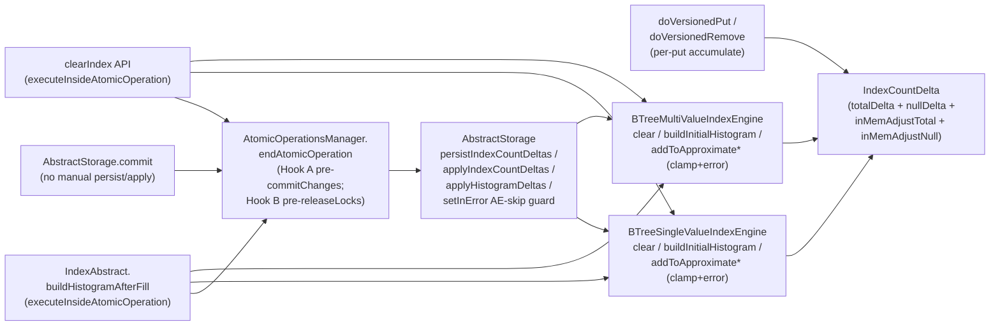

# Index Counter Divergence Elimination — Architecture Decision Record

## Summary

Eliminates the divergence trigger between the persisted and in-memory index entry counters on `BTreeMultiValueIndexEngine` and `BTreeSingleValueIndexEngine`. Before the fix, `clear()` and `buildInitialHistogram()` wrote to both the WAL-tracked entry-point page and the in-memory `AtomicLong` inside the atomic op; rollback reverted only the persisted side, and the next decrement underflowed the engine-level `assert updated >= 0`, escaped `AbstractStorage.commit`'s `catch (RuntimeException)`, and tripped InError mode. The cascade produced 330 underflows, 2,643 poisoned commits, and Gradle JVM OOM in the Hub log `Pre_Tests_Test_REST_2026.2.51599.log`.

The fix establishes three structural invariants via mixed-mode encoding on both seams, a single-lifecycle gate, and a three-layer cascade containment chain. Both `clear()` and `buildInitialHistogram()` write the persisted entry-point page absolute target inline (`setApproximateEntriesCount(op, 0L)` for clear; `setApproximateEntriesCount(op, target)` for recalibration), WAL-tracked and revertable. The in-memory `AtomicLong` writes route through a new `IndexCountDelta.accumulateInMemRecalibration` accumulator consumed by `AtomicOperationsManager.endAtomicOperation` Hook B after `commitChanges` but before the inner-finally `releaseLocks`. The three manual `persistIndexCountDeltas` / `applyIndexCountDeltas` / `applyHistogramDeltas` calls in `AbstractStorage.commit` are deleted; the lifecycle gate moves into `endAtomicOperation`. The engine-level `assert updated >= 0` becomes `reportAndClampUnderflow` with `compareAndSet(observed, 0)` and a one-shot stack-trace dump per engine.

## Goals

- Make the clear-rollback divergence and the recalibration-rollback divergence structurally impossible on both `BTreeMultiValueIndexEngine` and `BTreeSingleValueIndexEngine`.
- Contain `AssertionError` from any of the four engine-level mutators so it cannot reach the outer `catch (Error)` chokepoint at `AbstractStorage.commit`.
- Close the read-stale-in-mem race window the prior manual `applyIndexCountDeltas` call left open on the main commit path by holding the per-index lock during apply.
- Land containment as a defense-in-depth foundation layer first, so the cascade is bounded even if subsequent layers were reverted.
- Preserve the heap-only per-put / per-remove hot path; no per-mutation EP-page I/O.

Adjustments during execution: the original plan framed `clear()` as pure-delta encoding (in-memory and persisted advanced through the same delta) and `buildInitialHistogram()` as mixed-mode. Execution surfaced that pure-delta-for-`clear()` accepted a drift-amplification regression: pre-existing in-mem-vs-persisted drift from a prior `reportAndClampUnderflow` clamp event would transfer to the persisted EP page under `-ea` off, leaving persisted below the absolute target. The retrofit closed that regression by moving `clear()` to mixed-mode (inline absolute persisted write plus in-mem accumulator), symmetric with `buildInitialHistogram()`. Both seams now enforce Invariant 1 via the same accumulator method.

## Constraints

- **Coverage gate**: 85% line / 70% branch on changed code (CI enforced).
- **Hot path**: the per-put / per-remove cost stays heap-only via `IndexCountDelta.accumulate(op, engineId, sign, isNullKey)`. The fix does not regress index put/remove to per-mutation EP-page I/O.
- **Recovery**: the new hooks are no-ops during the recovery-time atomic ops on storage open. Hook A's `if (error == null && !operation.isRollbackInProgress() && holder != null && !holder.isPersisted())` gate plus Hook B's `if (error == null && holder != null)` gate both short-circuit when no delta accumulated.
- **WAL invariant preserved**: the in-memory side cannot move without a successful WAL commit. The invariant targets the in-memory `AtomicLong` write specifically (which Hook B serializes post-`commitChanges`), not any persisted-side write inside the atomic op (which is WAL-tracked and revertable). Tightened by the retrofit: persisted-side drift no longer amplifies on `clear()`.
- **Lock-window invariant**: on the main commit path, `applyIndexCountDeltas` and `applyHistogramDeltas` run with the per-index lock acquired at `lockIndexes` still held. Achieved by placing Hook B inside `endAtomicOperation`'s inner try, between `commitChanges` and the inner-finally `releaseLocks`. The standalone `clearIndex` API and `buildHistogramAfterFill` paths do not hold the lock during apply; ordering is harmless because `AtomicLong.addAndGet` is additive.
- **Independent revertability**: each change landed as a logical commit so reverts are surgical.

## Architecture Notes

### Component Map

- **`IndexCountDelta`** — per-(engine, atomic-op) heap accumulator. Carries two pairs of counters: `totalDelta` / `nullDelta` from `accumulate(op, id, sign, isNullKey)` (the per-put / per-remove hot path) and `inMemAdjustTotal` / `inMemAdjustNull` from `accumulateInMemRecalibration(op, id, totalDelta, nullDelta)` (the `clear()` and `buildInitialHistogram()` in-memory recalibration). A third accumulator `accumulateClearOrRecalibrate` survives as a callerless API pending follow-up cleanup. Hook B sums the two pairs per axis before calling the engine mutators.
- **`BTreeMultiValueIndexEngine` / `BTreeSingleValueIndexEngine`** — `clear()` and `buildInitialHistogram()` write the persisted entry-point page absolute target inline and record an in-memory-only delta via `accumulateInMemRecalibration`. The engine-level `addToApproximate{Entries,Null}Count` mutators replace `assert updated >= 0` with `reportAndClampUnderflow(name, counter, delta, updated)` (one-shot stack-trace dump per engine via a shared `AtomicBoolean firstUnderflowDumped` latch; clamp via `compareAndSet(observed, 0)` with no retry). Engine mutators have zero direct production callers; they are reached only via the `BTreeIndexEngine` interface dispatch from `AbstractStorage.applyIndexCountDeltas` inside Hook B.
- **`AtomicOperationsManager.endAtomicOperation`** — owns the single lifecycle gate. Hook A (`storage.persistIndexCountDeltas`) fires before `commitChanges` with a conversion catch (`RuntimeException | AssertionError` → rollback) plus an explicit `storage.moveToErrorStateIfNeeded(persistFailure)` call inside the catch to preserve the prior `setInError` contract. Hook B routes both `storage.applyIndexCountDeltas` and `storage.applyHistogramDeltas` through a shared `tryApply(Runnable, String)` helper with cache-only log-and-swallow catches (`RuntimeException | AssertionError`); both apply branches latch the holder up-front (`setPersisted()` / `setApplied()`) so a partial-loop throw still latches the once-per-atomic-op semantics.
- **`AbstractStorage`** — visibility of `persistIndexCountDeltas` / `applyIndexCountDeltas` / `applyHistogramDeltas` rises from `private` to `public` to cross the package boundary (the manager and storage live in different packages; `public` matches the existing manager-callback surface on the same class). The three manual call sites in `commit(FrontendTransactionImpl, boolean)` and their surrounding post-`endTxCommit` log-and-swallow catches are deleted. The pre-`endTxCommit` catch broadens to also accept `AssertionError`. `setInError(Throwable)` carries an `AssertionError` entry-point skip guard.

### Decision Records

**D1: Mixed-mode encoding over pure-delta-on-both-sides or collection-style self-healing.**

- *Alternatives considered*: (1) Collection-style overwrite-from-persisted (`approximateRecordsCount = state.getApproximateRecordsCount() + delta`, the `PaginatedCollectionV2` shape); (2) Pure-delta encoding on both persisted and in-memory sides via `IndexCountDelta`; (3) Mixed-mode encoding — persisted side writes absolute target inline, in-memory side routes through `accumulateInMemRecalibration` (chosen, on both seams); (4) Snap to persisted at apply time (re-read EP pages inside `applyIndexCountDeltas`).
- *Rationale*: **Per-put cost.** Alternative (1) forces 2 EP-page reads + 1 write on every MV null put (split-tree); the existing `IndexCountDelta` per-put accumulator keeps the hot path heap-only. **Recalibration semantics.** `buildInitialHistogram` writes an absolute target, not a delta; alternative (1) would erase that target on the next post-recalibration put. **MV split-tree cost.** Total = sv + null sourced from two EP pages; alternative (1) doubles read traffic on every null put. **Drift-amplification.** Alternative (2) transfers pre-existing in-memory-vs-persisted drift (from a prior `reportAndClampUnderflow` clamp event) to the persisted EP page on `clear()` under `-ea` off, leaving persisted below the absolute target instead of healing to it. Alternative (4) adds per-commit EP-page reads but does not address the in-atomic-op write hazard. **Chosen path.** Alternative (3) preserves the heap-only hot path, lands the absolute persisted target inline on every successful operation (drift-healing on both seams symmetrically), and respects Invariant 1 because the in-memory `AtomicLong` mutates only after `commitChanges` returns.
- *Risks / Caveats*: the long-form `accumulateInMemRecalibration(long, long)` accumulator accepts arbitrarily-signed deltas (no sign-alignment precondition), so a future caller using it for ordinary put/remove instead of the sign + isNullKey form would bypass Invariant 1. Mitigated by naming and Javadoc; the four call sites are documented as clear/recalibration only. `accumulateClearOrRecalibrate(long, long)` (which does carry the `|nullDelta| <= |totalDelta|` + sign-alignment precondition) survives in the source as a callerless API pending follow-up cleanup (`@Deprecated(forRemoval=true)` + body removal + `IndexCountDeltaHolderTest` fixture migration).
- *Implemented in*: `core/src/main/java/com/jetbrains/youtrackdb/internal/core/index/engine/IndexCountDelta.java` (the new `accumulateInMemRecalibration` accumulator at line 195; the four fields and getters that pair with it); `BTreeMultiValueIndexEngine.clear` at line 283 and `.buildInitialHistogram` at line 641; `BTreeSingleValueIndexEngine.clear` at line 242 and `.buildInitialHistogram` at line 656; `AbstractStorage.applyIndexCountDeltas` Hook B per-axis sum at lines 2538–2541. Initial encoding (pure-delta on clear, mixed-mode on buildInitialHistogram) landed first; a follow-up commit moved `clear()` to mixed-mode for symmetry.

**D2: Single lifecycle gate over manual+hooks coordination.**

- *Alternatives considered*: (1) Manual invocations in `AbstractStorage.commit` coexist with lifecycle hooks; coordinate via idempotency flags so neither runs twice; (2) Single lifecycle gate — delete manual invocations, route every counter sync through `endAtomicOperation` (chosen); (3) Snap-to-persisted at apply time without restructuring the lifecycle.
- *Rationale*: lock-window correctness. The prior manual `applyIndexCountDeltas` at the post-`endTxCommit` position ran *after* `endAtomicOperation`'s inner-finally `releaseLocks` had released the per-index lock acquired by `lockIndexes`. The intervening lines between lock release and the manual apply were enough for a concurrent TX to read stale in-memory state at the top of `clear()` or `buildInitialHistogram` (which the encoding uses to compute its delta) and produce wrong arithmetic: for the next TX's `clear` or recalibration, the delta is `target - currentInMem`, and `currentInMem` is the stale value. Placing the apply hook inside `endAtomicOperation` *before* `releaseLocks` closes the window. Alternative (1) preserves the bug because the manual apply still runs after the lock release; the flags only coordinate against double-application, not against the race. Alternative (3) adds per-commit EP-page reads without addressing the in-atomic-op write hazard, so it only partly fixes the bug.
- *Risks / Caveats*: every commit now routes counter persist through Hook A and apply through Hook B; the blast radius for hook bugs widens beyond the standalone-atomic-op paths to the main commit. Mitigated by the regression-test suite covering both the main-commit path (`MainCommitCounterSyncTest`) and the `clearIndex` API path (`ClearIndexApiRollbackTest`). The persist-failure-to-rollback conversion is load-bearing across three failure vectors with distinct contracts:
  - **`RuntimeException`**: Hook A's catch reproduces the prior path's `setInError` behavior via the explicit `moveToErrorStateIfNeeded(persistFailure)` call inside the catch, because `endAtomicOperation`'s entry-level `moveToErrorStateIfNeeded(error=null)` is a no-op and `AbstractStorage.logAndPrepareForRethrow(RuntimeException)` does not call `setInError`.
  - **`AssertionError`**: the `setInError` entry-point guard (Layer 2 of cascade containment) skips it. The storage stays out of error mode; rollback recovers.
  - Other `Error` subclasses (`OutOfMemoryError`, `StackOverflowError`, `LinkageError`, `InternalError`) deliberately escape Hook A's catch and propagate out of `endAtomicOperation`, landing at `AbstractStorage.commit`'s outer `catch (Error)` → `logAndPrepareForRethrow(Error)` → `setInError`. Genuine VM errors still poison the storage.
- *Implemented in*: `AtomicOperationsManager.endAtomicOperation` at line 258 (Hook A and Hook B inside; `tryApply(Runnable, String)` helper at line 444); deletion of the three manual call sites in `AbstractStorage.commit` and their surrounding post-`endTxCommit` log-and-swallow catches; visibility of `persistIndexCountDeltas` (line 2465), `applyIndexCountDeltas` (line 2496), `applyHistogramDeltas` (line 2552) raised to `public`. Hook A's catch is `RuntimeException | AssertionError` (narrowed from the originally-planned `IOException | RuntimeException | AssertionError` triple because `persistIndexCountDeltas` does not declare `IOException`).

**D3: Histogram delta gets the same lifecycle gate.**

- *Alternatives considered*: (1) Wire only the index-count hooks; leave the manual `applyHistogramDeltas` at its prior post-`endTxCommit` position; (2) Move both `applyIndexCountDeltas` and `applyHistogramDeltas` into `endAtomicOperation` symmetrically (chosen).
- *Rationale*: `applyHistogramDeltas` carries the same cache-only contract and the same lock-window race as `applyIndexCountDeltas`. Asymmetric wiring (one apply moved into the lifecycle, the other still at the post-`endTxCommit` position after `releaseLocks`) would leave the histogram delta exposed to the same stale-read race and become a confusing landmine for future readers. Persist-side: there is no manual `persistHistogramDeltas` today (histogram delta writes happen lazily under `IndexHistogramManager`), so the persist parallel is a no-op for now; the design retains symmetric naming so a future persist hook drops in cleanly.
- *Risks / Caveats*: histogram delta serialization is keyed differently from index-count delta (engineId is an `Integer` in `HistogramDeltaHolder`, not an `int` as in `IndexCountDeltaHolder`); each holder keeps its existing keying. No new serialization is needed. Inherited nested-op vulnerability (not a regression introduced by this change): `IndexHistogramManager.applyDelta` (invoked from Hook B's `applyHistogramDeltas`) conditionally invokes `flushSnapshotToPage`, which spawns a nested `executeInsideAtomicOperation`. If the nested op's `commitChanges` throws `IOException`, the nested `endAtomicOperation` calls `moveToErrorStateIfNeeded(error) → setInError`, flipping the storage to permanent error state inside a "successful" outer commit. The prior manual `applyHistogramDeltas` site already carried this vulnerability; this change inherits it without widening exposure. Follow-up tracked separately.
- *Implemented in*: the `tryApply(...)` call for `applyHistogramDeltas` inside `AtomicOperationsManager.endAtomicOperation` at line 258; `AbstractStorage.applyHistogramDeltas` at line 2552.

**D5: Containment is the foundation layer.**

- *Alternatives considered*: (1) Land containment per-engine across multiple commits; (2) One coherent containment change for all four mutators plus the pre-`endTxCommit` catch broadening (chosen).
- *Rationale*: containment is self-contained and unblocks every other change because it removes the cascade pressure that made the bug visible. Splitting it across changes would create artificial dependencies. The four mutators mirror each other; clamping one without the others would leave inconsistent posture across engines. The handler emits an **error** (not a warn) because PSI find-usages confirm `addToApproximate{Entries,Null}Count` has exactly one production caller per engine: `AbstractStorage.applyIndexCountDeltas` reached via the `BTreeIndexEngine` interface dispatch. That caller is inside Hook B, which runs before the inner-finally `releaseLocks` on the main commit path, so the per-index lock is held during apply. Concurrent commits on the same engine serialize through that window; concurrent commits on different engines touch different `AtomicLong` counters. Every underflow at apply time signals a real divergence between persisted and in-memory state (the clear-rollback divergence, the SV `load()` null-counter recalibration drift tracked at YTDB-953, or a future regression), warranting error-level visibility.
- *Risks / Caveats*: the broadened catch at the pre-`endTxCommit` position covers the pre-`endTxCommit` path; an `AssertionError` from `commitIndexes` (which can fire if `BTree.addToApproximateEntriesCount` underflows on the persisted side) now routes through rollback instead of escaping. This is the intended behavior: persisted-side underflow is a structural inconsistency and rollback is the correct response. The post-`endTxCommit` apply catches are deleted alongside the manual calls they surrounded; Hook B's `tryApply` log-and-swallow catch takes their place.
- *Implemented in*: `AbstractStorage.commit` pre-`endTxCommit` catch (broadens to `IOException | RuntimeException | AssertionError`); `AtomicOperationsManager.executeInsideAtomicOperation` at line 157, `calculateInsideAtomicOperation` at line 130, `executeInsideComponentOperation` at line 184, `calculateInsideComponentOperation` at line 218 — each wrapper catch broadens to also accept `AssertionError`; `AbstractStorage.setInError(Throwable)` at line 1756 (entry-level `AssertionError` skip guard); `BTreeMultiValueIndexEngine.reportAndClampUnderflow` at line 767 and `BTreeSingleValueIndexEngine.reportAndClampUnderflow` at line 772 (clamp via `compareAndSet`, one-shot dump latch).

**D6: Bug C (YTDB-953) explicitly out of scope.**

- *Alternatives considered*: (1) Fold YTDB-953's SV `load()` unconditional null-count reset into this branch; (2) Leave for YTDB-953 (chosen).
- *Rationale*: YTDB-953 is independent of the clear-rollback divergence. After cascade containment lands, YTDB-953's underflow downgrades from `AssertionError` to a single logged error per engine (the one-shot dump latches per engine, the subsequent occurrences compact-log), so urgency drops. Combining the fixes would conflate the structural divergence story with a separate "load path needs to scan for nulls" change.
- *Risks / Caveats*: after this fix lands, YTDB-953 is the only remaining trigger for in-memory null underflows in normal operation. The one-shot dump bounds log volume; expect YTDB-953's signature to dominate the next Hub run's error lines.
- *Implemented in*: tracked separately at [YTDB-953](https://youtrack.jetbrains.com/issue/YTDB-953).

### Invariants & Contracts

- **Invariant 1: in-memory mutates only after WAL commit succeeds.** The two in-memory `AtomicLong` counters on each engine (`approximateIndexEntriesCount`, `approximateNullCount`) advance only via the engine's `addToApproximate{Entries,Null}Count` mutator, reachable only from `AbstractStorage.applyIndexCountDeltas` inside Hook B, which runs after `commitChanges` returns. No in-atomic-op path writes the `AtomicLong` directly. The persisted side may write inline (the `setApproximateEntriesCount(op, target)` calls in `clear()` and `buildInitialHistogram()`) because those writes are WAL-tracked and revertable on rollback.
- **Invariant 2: AssertionError from any of the four engine mutators stays contained.** Layer 1 (broadened pre-`endTxCommit` catch plus four broadened `AtomicOperationsManager` wrapper catches) plus Layer 2 (`setInError` AE-skip guard) plus Layer 3 (engine-level clamp+error) ensure no `AssertionError` from the engine mutators reaches the outer `catch (Error)` at `AbstractStorage.commit`. The engine itself no longer throws `AssertionError` from these mutators under normal operation (the underflow is clamped and logged); the broadened catches and the `setInError` guard cover any residual path.
- **Invariant 3: apply runs with the per-index lock held on the main commit path.** Bifurcated posture. On the main commit path: `lockIndexes` at `AbstractStorage.lockIndexes` (line 5796) acquires each index's exclusive lock; `releaseLocks` at `AtomicOperationsManager.releaseLocks` (line 452) releases them in the inner-finally; Hook B fires between `commitChanges` and `releaseLocks`, so the per-index lock is held during apply. On the `clearIndex` API and `buildHistogramAfterFill` paths: no per-index lock is held during Hook B's apply, but `AtomicLong.addAndGet` is additive, so ordering is harmless on those paths.

### Integration Points

- **`IndexCountDelta.accumulate(op, id, int sign, boolean isNullKey)`** at line 88 — the per-put / per-remove `±1` accumulator. Five production callers (the per-put / per-remove hot path on `VersionedIndexOps`).
- **`IndexCountDelta.accumulateInMemRecalibration(op, id, long totalDelta, long nullDelta)`** at line 195 — added by this change; no sign-alignment precondition (in-mem-only deltas are arbitrarily signed by drift nature). Sole accumulator on the in-memory side for both `clear()` and `buildInitialHistogram()`. Four production callers: `BTreeMultiValueIndexEngine.clear` (line 361), `BTreeMultiValueIndexEngine.buildInitialHistogram` (line 715), `BTreeSingleValueIndexEngine.clear` (line 320), `BTreeSingleValueIndexEngine.buildInitialHistogram` (line 720). Hook B's `applyIndexCountDeltas` sums `getTotalDelta() + getInMemAdjustTotal()` and `getNullDelta() + getInMemAdjustNull()` at `AbstractStorage.java:2538–2541` before calling the engine mutators.
- **`IndexCountDelta.accumulateClearOrRecalibrate(op, id, long totalDelta, long nullDelta)`** at line 141 — survives as a callerless API pending follow-up cleanup. Carries the `|nullDelta| <= |totalDelta|` + sign-alignment precondition that was load-bearing on the prior pure-delta-for-`clear()` shape; the precondition is preserved for the eventual cleanup PR.
- **`AtomicOperationsManager.endAtomicOperation`** at line 258 — gains Hook A (`storage.persistIndexCountDeltas(op)` before `commitChanges`, persist-failure-to-rollback conversion) and Hook B (`storage.applyIndexCountDeltas(op)` and `storage.applyHistogramDeltas(op)` after `commitChanges` but before the inner-finally `releaseLocks`, both routed through the shared `tryApply(Runnable, String)` helper at line 444). Visibility of `persistIndexCountDeltas` (line 2465), `applyIndexCountDeltas` (line 2496), and `applyHistogramDeltas` (line 2552) on `AbstractStorage` raised from `private` to `public`.
- **`AbstractStorage.commit(FrontendTransactionImpl, boolean)`** at line 2179 — three manual invocations of `persistIndexCountDeltas`, `applyIndexCountDeltas`, and `applyHistogramDeltas` deleted; the surrounding post-`endTxCommit` log-and-swallow catches deleted. The pre-`endTxCommit` catch broadened to also accept `AssertionError`.
- **`BTreeIndexEngine` interface dispatch** — the engine-level mutators `addToApproximate{Entries,Null}Count` are no longer called directly by production code on either engine. They are reached only via the interface dispatch from `AbstractStorage.applyIndexCountDeltas` inside Hook B. The `BTreeIndexEngine` interface contract is unchanged.

### Non-Goals

- **YTDB-953** — SV `load()` unconditional null-count recalibration drift; tracked separately.
- **`PaginatedCollectionV2.approximateRecordsCount`** — structurally adjacent dual-counter, deliberately not fixed. Research confirmed the overwrite-from-persisted pattern self-heals on the next mutation; cost-estimation-only drift in steady state.
- **YTDB-952 (DBSequence.callRetry)** and **XD-1272 (RemovedTransientEntity blob reattach)** — orthogonal defects observed in the same Hub log.
- **Migration of `IndexCountDelta` to per-put EP-page I/O** — explicitly rejected by D1.

## Key Discoveries

- **The engine mutators are reachable only through Hook B.** PSI find-usages confirm `addToApproximate{Entries,Null}Count` has zero direct production callers on either engine; they are reached only via the `BTreeIndexEngine` interface dispatch from `AbstractStorage.applyIndexCountDeltas` inside Hook B. This single-caller fact is what justifies error-level (not warn-level) logging on the clamp branch in `reportAndClampUnderflow`: every underflow at apply time signals a real divergence, not a transient race. It also means the cascade containment's Layer 3 (clamp+error) only fires from inside Hook B, where the per-index lock is held on the main commit path.
- **Cross-engine asymmetry between MV and SV.** MV's `IndexCountDelta` consumes the total-vs-null split as two separate EP pages (`svTree` for non-null, `nullTree` for null). SV's `IndexCountDelta` consumes the total split as a single EP page; `persistCountDelta` ignores `nullDelta` because the single tree stores nulls and non-nulls together. The in-memory `approximateNullCount` counter on SV recalibrates via a `countNulls(atomicOperation)` scan during `load()` rather than via the persisted EP page, which is why YTDB-953 surfaces as a separate concern. Material context for any future change to either engine.
- **Bifurcated lock posture between main-commit and standalone paths.** The main commit path acquires per-index locks via `lockIndexes` at `AbstractStorage.lockIndexes` (line 5796); they are released by `releaseLocks` at `AtomicOperationsManager.releaseLocks` (line 452) in the inner-finally; Hook B sits between `commitChanges` and `releaseLocks`, so the per-index lock is held during apply. The `clearIndex` API and `buildHistogramAfterFill` paths call `executeInsideAtomicOperation`, which takes a per-tree component lock during the body but releases it before Hook B fires. The standalone paths therefore run Hook B without the per-index lock; ordering is harmless because `AtomicLong.addAndGet` is additive. This bifurcation is the contract surface for any future apply-side change.
- **Drift-amplification closure via the mixed-mode retrofit.** The original encoding for `clear()` was pure-delta on both persisted and in-memory sides (record `Δ = -current` once, both sides advance through Hook A and Hook B respectively). Pre-existing drift from a `reportAndClampUnderflow` clamp event (in-mem clamped to 0, persisted unchanged) would propagate through the encoding: Hook A would write `Δ = -0 = 0` to the persisted side, leaving persisted carrying the pre-clear drift. The retrofit moves both seams to mixed-mode (persisted side writes the absolute target inline, WAL-tracked, drift-healing regardless of in-memory state). Both seams now share the same mixed-mode pattern via the same `accumulateInMemRecalibration` accumulator. The follow-up cleanup of the now-callerless `accumulateClearOrRecalibrate` is queued.
- **The `IndexHistogramManager` nested atomic-op vulnerability is inherited, not introduced.** `applyDelta` (invoked from Hook B's `applyHistogramDeltas`) conditionally calls `flushSnapshotToPage`, which spawns a nested `executeInsideAtomicOperation`. If the nested op's `commitChanges` throws `IOException`, the nested `endAtomicOperation` calls `moveToErrorStateIfNeeded(error) → setInError`, flipping the storage to permanent error state inside a "successful" outer commit. The prior manual `applyHistogramDeltas` site already carried this vulnerability; the consolidation inherits it. Material context for the eventual histogram-delta-persist work.
- **`IndexHistogramManager.cache` and `indexesSnapshot` carry eager-mutation residue out of scope.** Both data structures advance inside the atomic op without the deferred-publication discipline this fix applies to the counters. The same rollback-divergence risk exists in principle on these data structures, but their downstream consumers tolerate transient inconsistency in ways the counter mutators do not (the counters fed an `assert updated >= 0` that escaped the catch chain). Material context for any future eager-mutation audit.
- **`logAndPrepareForRethrow` overload asymmetry.** Only the `Error` overload at line 5851 and the `Throwable` overload at line 5870 call `setInError`; the `RuntimeException` overload at line 5831 does not. This asymmetry is why Hook A's persist-failure catch needs an explicit `moveToErrorStateIfNeeded(persistFailure)` call to preserve the prior `setInError` contract on `RuntimeException` paths (the prior manual `persistIndexCountDeltas` site routed through `AbstractStorage.commit`'s pre-`endTxCommit` catch, which used the `Throwable` overload). Material context for any future `setInError` audit.
- **`forceDatabaseClose` does NOT exercise WAL replay.** The two regression tests originally framed as "crash recovery" routed through `storage.shutdown() → doShutdown() → flushAllData()`, not through WAL replay. A true crash variant via `WalTestUtils.withWalProtection` is deferred. Material context for any future crash-recovery test design.
