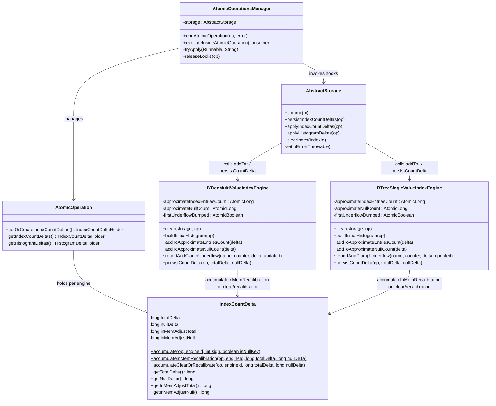
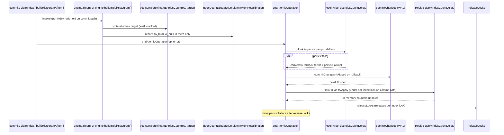

# Index counter divergence elimination — design

## Overview

Index entry counters (`approximateIndexEntriesCount`, `approximateNullCount`) on `BTreeMultiValueIndexEngine` and `BTreeSingleValueIndexEngine` diverged from their persisted counterparts on rollback. The trigger: `clear()` and `buildInitialHistogram()` wrote to both the WAL-tracked entry-point page and the in-memory `AtomicLong` inside the atomic op. Rollback reverted only the persisted side; the in-memory side stayed. The next decrement underflowed the engine-level assertion, escaped `AbstractStorage.commit`'s `catch (RuntimeException)`, and tripped InError mode. That cascade produced 330 underflows + 2,643 poisoned commits + Gradle OOM in `Pre_Tests_Test_REST_2026.2.51599.log`.

The fix establishes three structural invariants. **Invariant 1**, *in-memory counter mutates only after WAL commit succeeds*: the four in-atomic-op writes to the in-memory `AtomicLong`s move onto the `IndexCountDelta` accumulator, consumed by Hook B after `commitChanges`. **Invariant 2**, *AssertionError from any of the four engine mutators stays contained*: the pre-`endTxCommit` catch in `AbstractStorage.commit` and the four `AtomicOperationsManager` wrapper catches now accept `AssertionError`; the engine-level `assert updated >= 0` is replaced with clamp+error carrying engine `name`+`id`; `setInError(Throwable)` skips `AssertionError` at the chokepoint. **Invariant 3**, *apply runs with the per-index lock held on the main commit path*: `persistIndexCountDeltas`, `applyIndexCountDeltas`, and `applyHistogramDeltas` move into `AtomicOperationsManager.endAtomicOperation` as the single lifecycle gate; the manual calls in `AbstractStorage.commit` are deleted; apply runs before the inner-finally `releaseLocks`. The standalone `clearIndex` API and `buildHistogramAfterFill` paths do not hold the per-index lock during apply; ordering is harmless because `AtomicLong.addAndGet` is additive.

The fix composes with two existing primitives plus one new accumulator. `IndexCountDelta` already accumulates per-(engine, atomic-op) totals for the per-put / per-remove path via `accumulate(op, id, sign, isNullKey)`. The new accumulator `accumulateInMemRecalibration(op, id, totalDelta, nullDelta)` is the sole in-memory writer for both `clear()` and `buildInitialHistogram()`; it records arbitrarily-signed deltas with no precondition. `AtomicOperationsManager.endAtomicOperation` already owns the WAL atomic-op lifecycle; the new hooks attach as Hook A (persist) before `commitChanges` and Hook B (apply + histogram-apply) after `commitChanges` but before the inner-finally `releaseLocks`. Hook A converts persist failures (`RuntimeException | AssertionError`) to rollback so the failure does not escape into the outer `catch (Error)` cascade.

Both seams (`clear()` and `buildInitialHistogram()`) use mixed-mode encoding. The persisted side of `clear()` writes `setApproximateEntriesCount(op, 0L)` inline per tree; the persisted side of `buildInitialHistogram()` writes `setApproximateEntriesCount(op, target)` inline. Both writes are WAL-tracked, drift-healing on every successful operation, and revertable on rollback — they respect Invariant 1, which targets the in-memory `AtomicLong` write specifically, not any persisted-side write inside the atomic op. The in-memory side of both seams routes through `accumulateInMemRecalibration`, consumed by Hook B.

This design assumes familiarity with the `IndexCountDelta` accumulator, the WAL atomic-op lifecycle (`startAtomicOperation` / `commitChanges` / `endAtomicOperation`), and the BTree entry-point page (`CellBTreeSingleValueEntryPointV3`).

The document proceeds: Core Concepts establishes vocabulary; Class Design shows the touched types; Workflow covers the unified execution path; the topic sections cover the mixed-mode encoding, the lifecycle gate, the cascade containment chain, and the alternatives ruled out during research and execution.

## Core Concepts

| Term | Meaning |
|---|---|
| **Dual-counter pattern** | A pair of counters tracking the same quantity: one persisted (WAL-tracked entry-point page), one in-memory (`AtomicLong`). The two are intended to advance in lockstep. |
| **`IndexCountDelta` accumulator** | Per-(engine, atomic-op) heap accumulator at `core/src/.../index/engine/IndexCountDelta.java`. Three static accumulators: `accumulate(op, id, int sign, boolean isNullKey)` for the per-put / per-remove hot path; `accumulateInMemRecalibration(op, id, long totalDelta, long nullDelta)` for `clear()` and `buildInitialHistogram()`; `accumulateClearOrRecalibrate(op, id, long, long)` survives as a callerless API pending follow-up cleanup. |
| **Mixed-mode encoding** | The pattern this branch establishes for `clear()` and `buildInitialHistogram()`: the persisted entry-point page writes happen inline (absolute target, WAL-tracked, revertable, drift-healing); the in-memory `AtomicLong` writes route through `accumulateInMemRecalibration` and apply at Hook B. Replaces today's dual in-atomic-op writes that left in-memory state stranded after WAL rollback. |
| **Single lifecycle gate** | `persistIndexCountDeltas` / `applyIndexCountDeltas` / `applyHistogramDeltas` live inside `AtomicOperationsManager.endAtomicOperation`, not at `AbstractStorage.commit`. Every counter sync (main commit + `clearIndex` API + `buildHistogramAfterFill`) advances through one place. The holder is consumed exactly once per atomic op via `setPersisted` / `setApplied` latches set on the entry side of each apply method. |
| **Lock-window invariant** | On the main commit path, apply runs with the per-index lock acquired at `lockIndexes` still held. Achieved by placing Hook B inside `endAtomicOperation`'s inner try, between `commitChanges` and the inner-finally `releaseLocks` call. The `clearIndex` API and `buildHistogramAfterFill` paths do not hold the lock during apply; the additive `AtomicLong.addAndGet` semantics make ordering harmless on those paths. |
| **Cascade containment** | The three-layer safety net at the catch and mutator surfaces: broadened pre-`endTxCommit` catch plus four `AtomicOperationsManager` wrapper catches now accept `AssertionError`; `setInError(Throwable)` skips `AssertionError` at the chokepoint; the four engine-level `addToApproximate{Entries,Null}Count` mutators replace `assert updated >= 0` with clamp via `compareAndSet(observed, 0)` and a one-shot stack-trace dump per engine. |

## Class Design



`IndexCountDelta` carries two pairs of counters: `totalDelta` / `nullDelta` from the per-put / per-remove `accumulate` overload, and `inMemAdjustTotal` / `inMemAdjustNull` from `accumulateInMemRecalibration`. Hook B's `applyIndexCountDeltas` sums the two pairs per axis (`getTotalDelta() + getInMemAdjustTotal()` and the null mirror) before calling the engine mutators. The third accumulator `accumulateClearOrRecalibrate` keeps its body and its `|nullDelta| <= |totalDelta|` + sign-alignment precondition pending follow-up cleanup; no production caller invokes it.

`AtomicOperationsManager.endAtomicOperation` gains two callback points: Hook A invokes `storage.persistIndexCountDeltas(op)` before `commitChanges` with a conversion catch (`RuntimeException | AssertionError` → rollback) plus an explicit `moveToErrorStateIfNeeded(persistFailure)` to preserve the prior `setInError` contract; Hook B routes `applyIndexCountDeltas` and `applyHistogramDeltas` through a shared `tryApply(Runnable, String)` helper that wraps each in a cache-only log-and-swallow catch (`RuntimeException | AssertionError`). Visibility of those three storage methods rises from `private` to `public` to cross the package boundary (the manager and storage live in different packages, so package-private would not cross; `public` matches the existing manager-callback surface on the same class).

The two engine classes lose their direct in-memory writes in `clear()` and `buildInitialHistogram()`; the persisted-side writes via `setApproximateEntriesCount(op, target)` stay inline. The new field `firstUnderflowDumped` on each engine latches the one-shot stack-trace dump in `reportAndClampUnderflow`. Engine mutators `addToApproximate{Entries,Null}Count` have zero direct production callers; they are reached only via the `BTreeIndexEngine` interface dispatch from `AbstractStorage.applyIndexCountDeltas` inside Hook B.

## Workflow

Three call paths (main commit, `clearIndex` API, `buildHistogramAfterFill`) flow into the same `endAtomicOperation`, where Hook A and Hook B own counter sync. The diagram collapses the histogram-delta hook for readability; it fires symmetrically with the index-count apply via the same `tryApply` helper.



On rollback (`error != null` at entry, OR Hook A's conversion fires), Hook B does not run. The page-level operations on the entry-point pages (including the inline persisted-side recalibration writes from `clear()` and `buildInitialHistogram()`) revert via WAL, and the holder is discarded along with the atomic op. Both sides stay consistent. The per-index lock is held throughout Hook B's execution on the main commit path because `releaseLocks` fires only in the inner-finally after Hook B returns; the `clearIndex` API and `buildHistogramAfterFill` paths do not hold the lock during apply, but the additive `AtomicLong.addAndGet` semantics make ordering harmless on those paths.

## Mixed-mode encoding for clear() and buildInitialHistogram()

**TL;DR.** Both sites split the counter advance across two stages. The persisted entry-point page advances to an absolute target inline (`setApproximateEntriesCount(op, 0L)` for clear; `setApproximateEntriesCount(op, target)` for recalibration), WAL-tracked and revertable. The in-memory `AtomicLong` advances at Hook B, after `commitChanges`, via `IndexCountDelta.accumulateInMemRecalibration(op, id, totalDelta, nullDelta)`. On rollback the holder is discarded with the atomic op and the persisted EP page reverts via WAL; neither side mutates.

**Mechanism.** The MV engine's `clear()` body becomes:

```
clearSVTree(op);                              // takes per-tree component lock
currentTotal = approximateIndexEntriesCount.get();
currentNull  = approximateNullCount.get();
svTree.setApproximateEntriesCount(op, 0L);    // persisted, WAL-tracked
nullTree.setApproximateEntriesCount(op, 0L);  // persisted, WAL-tracked
IndexCountDelta.accumulateInMemRecalibration(op, id, -currentTotal, -currentNull);
mgr.resetOnClear(op);                         // may throw IOException; rolls back
```

The two direct `AtomicLong.set(0)` calls disappear; the two `setApproximateEntriesCount(op, 0L)` writes stand alone as the persisted-side mutation. The SV engine mirrors this with one tree and a method-level `try/catch` that wraps `IOException` as `IndexException`. No new try/catch is needed on either engine for the persisted writes — `setApproximateEntriesCount` declares no checked exception (the underlying `executeInsideComponentOperation` rewraps `IOException` as the unchecked `CommonStorageComponentException`); the existing `mgr.resetOnClear` catch is the sole `IOException` source on the body.

`buildInitialHistogram()` encodes its recalibration symmetrically:

```
currentTotal = approximateIndexEntriesCount.get();
currentNull  = approximateNullCount.get();
targetTotal  = scannedNonNull + exactNullCount;
svTree.setApproximateEntriesCount(op, scannedNonNull);   // persisted, WAL-tracked
nullTree.setApproximateEntriesCount(op, exactNullCount); // persisted, WAL-tracked
IndexCountDelta.accumulateInMemRecalibration(op, id,
                                             targetTotal - currentTotal,
                                             exactNullCount - currentNull);
```

The two direct `AtomicLong.set` calls disappear; the two persisted-side writes stay inline. Recalibration deltas can be arbitrarily signed by drift nature; `accumulateInMemRecalibration` carries no sign-alignment precondition.

**Worked example** (MV engine, start `sv=995, null=5, total=1000`).

| Step | totalDelta | nullDelta | inMemAdjustTotal | inMemAdjustNull | persisted_sv | persisted_null | in-mem total | in-mem null |
|---|---|---|---|---|---|---|---|---|
| start of TX | 0 | 0 | 0 | 0 | 995 | 5 | 1000 | 5 |
| `clear()` writes persisted=0 inline; records inMem Δ = (−1000, −5) | 0 | 0 | −1000 | −5 | 0 | 0 | 1000 | 5 |
| post-clear: +3 non-null, +2 null puts | +5 | +2 | −1000 | −5 | 0 | 0 | 1000 | 5 |
| Hook A `persistIndexCountDeltas` (pre-`commitChanges`) | — | — | — | — | 3 | 2 | 1000 | 5 |
| `commitChanges` succeeds | — | — | — | — | 3 | 2 | 1000 | 5 |
| Hook B `applyIndexCountDeltas` sums per axis | — | — | — | — | 3 | 2 | 5 | 2 |
| `releaseLocks` releases per-index lock | — | — | — | — | 3 | 2 | 5 | 2 |

Hook B's per-axis sum at the engine-mutator call sums `getTotalDelta() + getInMemAdjustTotal() = +5 + (−1000) = −995` and `getNullDelta() + getInMemAdjustNull() = +2 + (−5) = −3`, producing the in-memory transitions `1000 → 5` and `5 → 2`. End state matches what the prior code produced. On rollback at any step before Hook A completes, the atomic op is discarded along with the holder; the WAL reverts the persisted-side recalibration writes; neither side mutates; `(995, 5, 1000, 5)` stays consistent.

**Edge cases.** (1) On every successful `clear()` or `buildInitialHistogram()`, the persisted EP page lands at the absolute target regardless of prior in-memory-vs-persisted drift — both seams drift-heal symmetrically. (2) The persisted entry-point page is transiently at the new absolute target during a clear's atomic op while the in-memory side has not yet caught up. Safe because `BTree.getApproximateEntriesCount` is read in production only from `load()`, which never runs concurrently with a clear. (3) The SV engine's `persistCountDelta` ignores `nullDelta` because the single tree stores nulls and non-nulls together; the in-memory null counter recalibrates via `countNulls(atomicOperation)` during `load()`. (4) The in-memory reads at the start of `clear()` happen under the per-tree component lock taken transitively by `clearSVTree` / `doClearTree`; the reads at `buildInitialHistogram()` happen under the bucket-sizing read lock. The lock posture differs between the two seams but is sufficient on both. (5) `accumulateInMemRecalibration` accepts arbitrarily-signed deltas; the four call sites are documented as clear/recalibration only.

### References
- D1: Mixed-mode encoding over pure-delta-on-both-sides or collection-style self-healing
- Invariant 1: in-memory mutates only after WAL commit

## endAtomicOperation lifecycle

**TL;DR.** The manager method already drives the commit chain — rollback marking, `commitChanges` WAL flush, `atomicOperationsTable` book-keeping, lock release. The change adds two hook points inside the same method: Hook A `persistIndexCountDeltas` before `commitChanges` with persist-failure-to-rollback conversion; Hook B `applyIndexCountDeltas` plus `applyHistogramDeltas` (both routed through the shared `tryApply` helper) after `commitChanges` but before the inner-finally `releaseLocks`. Hook B's placement before `releaseLocks` keeps the per-index lock held during apply on the main commit path, closing the lock-window race. Manual calls at `AbstractStorage.commit` and their surrounding post-`endTxCommit` catches are deleted.

**Mechanism.** The annotated lifecycle:

```
endAtomicOperation(op, error):
  try {
    storage.moveToErrorStateIfNeeded(error);
    if (error != null) operation.rollbackInProgress();

    // Hook A: index-count persist (before WAL flush)
    if (error == null && !operation.isRollbackInProgress()) {
      var holder = operation.getIndexCountDeltas();
      if (holder != null && !holder.isPersisted()) {
        holder.setPersisted();                  // latch up-front
        try { storage.persistIndexCountDeltas(operation); }
        catch (RuntimeException | AssertionError persistFailure) {
          storage.moveToErrorStateIfNeeded(persistFailure);
          error = persistFailure;
          operation.rollbackInProgress();
        }
      }
    }

    try {
      if (!operation.isRollbackInProgress()) {
        operation.commitChanges(commitTs, writeAheadLog);
      }
      if (error != null) atomicOperationsTable.rollbackOperation(commitTs);
      else { atomicOperationsTable.commitOperation(commitTs); ... }

      // Hook B: apply + histogram-apply (after WAL flush, BEFORE releaseLocks)
      if (error == null) {
        tryApply(() -> storage.applyIndexCountDeltas(operation), "applyIndexCountDeltas");
        tryApply(() -> storage.applyHistogramDeltas(operation), "applyHistogramDeltas");
      }
    } finally {
      releaseLocks(operation);                  // per-index lock released here
      operation.deactivate();
    }

    if (error != null) throw error;
  } finally {
    writeOperationsFreezer.endOperation();
  }
```

The `tryApply` helper sets the matching apply latch (`setApplied()`) on the entry side of each apply method before invoking the body, so a partial-loop throw inside the apply still latches the holder. The helper's catch is `RuntimeException | AssertionError`; throws log-and-swallow per the cache-only contract.

**Three correctness properties.**

*First, persist failure converts to rollback.* A throw from `persistIndexCountDeltas` would have escaped the prior manual call at `AbstractStorage.commit` and been caught at the pre-`endTxCommit` site. After the move, the throw fires from inside `endAtomicOperation`, which has no enclosing catch on the caller's side. The inner try/catch in Hook A converts the throw to `error = persistFailure; operation.rollbackInProgress()` so the subsequent `commitChanges` is skipped and `rollbackOperation` runs. The throw is re-raised at `if (error != null) throw error;` after the lock-release finally block. The explicit `storage.moveToErrorStateIfNeeded(persistFailure)` call in the catch preserves today's `setInError` contract: `endAtomicOperation`'s entry-level `moveToErrorStateIfNeeded(error=null)` is a no-op, so without the explicit call the storage would not enter error mode on persist `RuntimeException` (matching `AbstractStorage.logAndPrepareForRethrow(RuntimeException)`, which also does not set the error state). The catch is bounded to `RuntimeException | AssertionError` because `persistIndexCountDeltas` does not declare `IOException`. Other `Error` subclasses (`OutOfMemoryError`, `StackOverflowError`, `LinkageError`, `InternalError`) deliberately escape Hook A and propagate out of `endAtomicOperation`, landing at `AbstractStorage.commit`'s outer `catch (Error)` → `logAndPrepareForRethrow(Error)` → `setInError`.

*Second, apply failure is logged and swallowed.* The cache-only contract holds: `tryApply` catches `RuntimeException | AssertionError` and logs at warn level. The behavior mirrors today's deleted catches at the manual `applyIndexCountDeltas` and `applyHistogramDeltas` sites in `AbstractStorage.commit`. The broadened catch matches the four engine-mutator clamp+error rewrites: an `AssertionError` arriving at apply time signals a real divergence, gets logged with the engine identity, and does not crash the commit.

*Third, the per-index lock is held during apply on the main commit path.* `lockIndexes` at `AbstractStorage.lockIndexes` acquires each index's exclusive lock via `acquireExclusiveLockTillOperationComplete`, which adds the component to `operation.lockedComponents()`. The inner-finally `releaseLocks` call at `AtomicOperationsManager.releaseLocks` iterates `lockedComponents()` and unlocks each. Placing Hook B before that finally block means Hook B runs with all per-index locks still held — including the ones the next TX is blocked on. The race window the old design left open (manual apply running after the lock release inside `endAtomicOperation`) is closed. The standalone `clearIndex` API and `buildHistogramAfterFill` paths do not call `lockIndexes`; the per-tree component lock is held during the persisted-side write but is released before Hook B fires. Ordering is harmless on those paths because `AtomicLong.addAndGet` is additive.

**Edge cases.** (1) `endTxCommit` is a one-liner that delegates to `endAtomicOperation(operation, null)`. The main commit path passes `error = null` here; Hook A fires; `commitChanges` runs; Hook B fires before `releaseLocks`. (2) `rollback` is also a one-liner delegating to `endAtomicOperation(operation, error)`. On this path `error != null` at entry, so `operation.rollbackInProgress()` is set immediately, Hook A skips, `commitChanges` skips, and Hook B skips because the `error == null` gate fails. The atomic op rolls back cleanly. (3) `executeInsideAtomicOperation` paths (`clearIndex` API, `buildHistogramAfterFill`) pass through with `error = null` on success and run both hooks. Persist failures convert to rollback as described. (4) `calculateInsideAtomicOperation` (read-only callers) accumulates no delta; both hooks are no-ops via the holder-presence check. (5) The `setPersisted()` / `setApplied()` latches sit on the entry side of each apply method so a partial-loop throw still latches the holder, preserving once-per-atomic-op semantics. (6) `IndexHistogramManager.applyDelta` (invoked from Hook B's `applyHistogramDeltas`) conditionally invokes `flushSnapshotToPage`, which spawns a nested `executeInsideAtomicOperation`. If the nested op's `commitChanges` throws `IOException`, the nested `endAtomicOperation` calls `moveToErrorStateIfNeeded(error) → setInError`, flipping the storage to permanent error state inside a "successful" outer commit. This is an inherited vulnerability from the prior manual `applyHistogramDeltas` site; not widened by the consolidation. Tracked separately.

### References
- D2: Single lifecycle gate over manual+hooks coordination
- D3: Histogram delta gets the same lifecycle gate
- Invariant 2: AssertionError stays contained
- Invariant 3: apply runs with the per-index lock held on the main commit path

## Cascade containment

**TL;DR.** Three layers stop in-memory `AtomicLong` underflows from reaching the outer `catch (Error)` chokepoint in `AbstractStorage.commit`. Layer 1 broadens the pre-`endTxCommit` catch in `AbstractStorage.commit` and the four `AtomicOperationsManager` wrapper catches (`executeInsideAtomicOperation`, `calculateInsideAtomicOperation`, `executeInsideComponentOperation`, `calculateInsideComponentOperation`) to also accept `AssertionError`. Layer 2 adds an `AssertionError` entry-point guard to `AbstractStorage.setInError(Throwable)` so any `AssertionError` reaching the chokepoint via a top-level storage method's outer `catch (Error)` clause does not poison the storage. Layer 3 replaces the engine-level `assert updated >= 0` with `reportAndClampUnderflow` (clamp via `compareAndSet(observed, 0)`) on each of the four `addToApproximate{Entries,Null}Count` mutators; emits a one-shot stack-trace dump per engine via a shared `AtomicBoolean firstUnderflowDumped` latch.

**Mechanism.**

| Site | Before | After |
|---|---|---|
| `AbstractStorage.commit` pre-`endTxCommit` catch | `catch (IOException \| RuntimeException e)` | `catch (IOException \| RuntimeException \| AssertionError e)` |
| `AtomicOperationsManager.executeInsideAtomicOperation` wrapper catch | `catch (Exception e)` | `catch (Exception \| AssertionError e)` |
| `AtomicOperationsManager.calculateInsideAtomicOperation` wrapper catch | `catch (Exception e)` | `catch (Exception \| AssertionError e)` |
| `AtomicOperationsManager.executeInsideComponentOperation` wrapper catch | `catch (Exception e)` | `catch (Exception \| AssertionError e)` |
| `AtomicOperationsManager.calculateInsideComponentOperation` wrapper catch | `catch (Exception e)` | `catch (Exception \| AssertionError e)` |
| `AbstractStorage.setInError(Throwable)` entry | (no guard) | `if (error instanceof AssertionError) return;` skip guard |
| `AbstractStorage.commit` post-`endTxCommit` apply catches | manual `catch (RuntimeException)` covering manual `applyIndexCountDeltas` and `applyHistogramDeltas` | deleted alongside the manual calls; Hook B's `tryApply` log-and-swallow takes their place |
| `endAtomicOperation` Hook A | did not exist | `catch (RuntimeException \| AssertionError)` → rollback + explicit `moveToErrorStateIfNeeded` |
| `endAtomicOperation` Hook B (via `tryApply`) | did not exist | `catch (RuntimeException \| AssertionError)` → log + swallow |
| MV `addToApproximateEntriesCount` | `assert updated >= 0` | `reportAndClampUnderflow(name, counter, delta, updated)` |
| MV `addToApproximateNullCount` | `assert updated >= 0` | `reportAndClampUnderflow(name, counter, delta, updated)` |
| SV `addToApproximateEntriesCount` | `assert updated >= 0` | `reportAndClampUnderflow(name, counter, delta, updated)` |
| SV `addToApproximateNullCount` | `assert updated >= 0` | `reportAndClampUnderflow(name, counter, delta, updated)` |

`reportAndClampUnderflow` sketch (shared shape across MV and SV):

```
void reportAndClampUnderflow(String counterName, AtomicLong counter,
                             long delta, long updated) {
  if (firstUnderflowDumped.compareAndSet(false, true)) {
    LogManager.instance().error(this,
        "First in-memory %s underflow on engine=%s id=%d delta=%d updated=%d."
            + " Stack trace follows; subsequent underflows on this engine"
            + " will be compact-logged.",
        counterName, name, id, delta, updated,
        new Exception(counterName + " underflow stack"));
  } else {
    LogManager.instance().error(this,
        "In-memory %s underflow on engine=%s id=%d delta=%d updated=%d, clamping to 0.",
        counterName, name, id, delta, updated);
  }
  counter.compareAndSet(updated, 0);
}
```

The clamp uses `compareAndSet(updated, 0)` so a concurrent delta applied between `addAndGet` and the clamp is not silently overwritten; on failed CAS the helper is a no-op. The one-shot dump latches per engine via `AtomicBoolean.compareAndSet(false, true)`; the field is shared between the two `addToApproximate*Count` methods on the same engine. The messages carry engine `name` and `id` so future occurrences are attributable.

**Why error-level (not warn-level) logging.** PSI find-usages confirm `addToApproximate{Entries,Null}Count` has exactly one production caller on each engine: `AbstractStorage.applyIndexCountDeltas` reached via the `BTreeIndexEngine` interface dispatch. The single caller is inside Hook B, which runs before the inner-finally `releaseLocks` on the main commit path, so concurrent commits on the same engine serialize through the lock window; concurrent commits on different engines touch different `AtomicLong` counters. Every underflow at apply time therefore signals a real divergence between persisted and in-memory state, warranting error-level visibility.

**Edge cases.** (1) The pre-`endTxCommit` catch now also covers persisted-side `AssertionError` from `BTree.addToApproximateEntriesCount`'s own assert (raised inside `commitIndexes`). Routing that through rollback is correct; persisted-side underflow indicates a structural inconsistency. (2) The `cleanupSnapshotIndex` catch is left alone (no current code path in that method asserts). (3) After Layer 3, the SV `load()` unconditional null-count reset noted in YTDB-953 downgrades from `AssertionError` to a single logged error per SV engine. The one-shot dump per engine bounds log volume. (4) `logAndPrepareForRethrow` overload asymmetry: only the `Error` and `Throwable` overloads call `setInError`; the `RuntimeException` overload does not. The `setInError` entry-point guard in Layer 2 closes the residual cascade vector left by Layer 1 — an `AssertionError` fired in a top-level storage method's outer `catch (Error)` clause that routes through `logAndPrepareForRethrow(Error)` lands at the chokepoint and is now skipped.

### References
- D5: Containment is the foundation layer
- D6: Bug C remains out of scope
- Invariant 2: AssertionError stays contained
- Invariant 3: apply runs with the per-index lock held on the main commit path

## Why mixed-mode, not pure-delta-on-both-sides or collection-style self-healing

**TL;DR.** Two alternatives were ruled out. The first (a symmetric delta encoding on persisted and in-memory sides) was retrofitted away during execution because it transferred pre-existing in-memory-vs-persisted drift to the persisted EP page on rollback under `-ea` off, amplifying the divergence rather than healing it. The second (the overwrite-from-persisted shape that `PaginatedCollectionV2` uses for `approximateRecordsCount`) costs per-mutation EP-page I/O and erases recalibration targets.

**Why not pure-delta on both sides.** Worked example with pre-existing drift. Suppose the clamp+error from cascade containment has fired once on the in-memory `approximateIndexEntriesCount` of some MV engine: persisted=995, in-mem=0 (clamped). Under pure-delta-for-`clear()`, the engine reads `currentInMem = 0` and records `Δ = -0 = 0` on both sides. Hook A's `persistCountDelta` writes `0` to the persisted side, leaving persisted at `995` (no-op). The in-memory side stays at `0`. After the clear completes, persisted carries the pre-clear drift `995` instead of the absolute target `0`; the next concurrent `put` advances both sides by `+1` and the divergence carries forward. Under mixed-mode, the engine writes `setApproximateEntriesCount(op, 0L)` inline, WAL-tracked, regardless of in-memory state. The persisted side lands at the absolute target `0`; the in-memory side stays consistent at `0` (Hook B's `Δ = -0 = 0` no-op). The drift heals on every successful operation. An earlier design framing accepted the drift-amplification risk for the pure-delta-for-`clear()` shape because `Δ = -current` was thought to converge both sides to zero regardless of drift; execution surfaced that the convergence holds only when in-memory and persisted both move under the same delta, which is exactly what the broken in-atomic-op write the fix removes.

**Why not collection-style self-healing.** `PaginatedCollectionV2` carries the same dual-counter shape with `approximateRecordsCount`, but its increment/decrement reads the persisted value first (`count = state.getApproximateRecordsCount(); approximateRecordsCount = count + 1;`), so post-rollback drift self-heals on the next mutation. Three reasons that pattern does not transfer to indexes.

*Per-put cost.* The index put cost is one in-heap `IndexCountDelta.accumulate(op, engineId, +1, isNullKey)`. Zero page I/O on the counter path; the EP page writes batch at `persistCountDelta` once per engine per tx. Self-healing forces per-mutation read+write of the EP page. For a bulk-import tx inserting 100K records the cost goes from roughly two page writes to ~300K (MV) or ~200K (SV).

*Recalibration semantics.* `buildInitialHistogram` writes an absolute target value (the result of a full scan), not a `±1` delta. Under self-healing, the next post-recalibration put reads the previous persisted value, advances by `1`, and overwrites the in-memory recalibration target. The recalibration effect is erased.

*MV split-tree.* MV engine total = sv + null, sourced from two separate EP pages. Self-healing increment for a null put would need to read both pages to recompute the total. Double the EP-page read traffic on every null put.

**What this branch borrows from the collection pattern.** The *posture*, not the *mechanism*. Collection tolerates short-lived drift via overwrite-from-persisted self-healing; index tolerates short-lived drift via the cascade containment's clamp+error and the recalibration target's drift-healing inline persisted writes. Two different mechanisms, same end posture: wrong values get corrected, no crash.

**Edge cases.** (1) An alternative considered during research, "snap to persisted at apply time" (re-read EP pages inside `applyIndexCountDeltas`), would add per-commit page reads but does not address the in-atomic-op write hazard at `clear()` and `buildInitialHistogram()`. It only partly fixes the bug. Rejected. (2) `PaginatedCollectionV2.approximateRecordsCount` is deliberately not fixed in this branch; the self-heal mitigates the divergence to a query-optimizer-cost-estimation-only drift, and changing the pattern carries regression risk.

### References
- D1: Mixed-mode encoding over pure-delta-on-both-sides or collection-style self-healing
