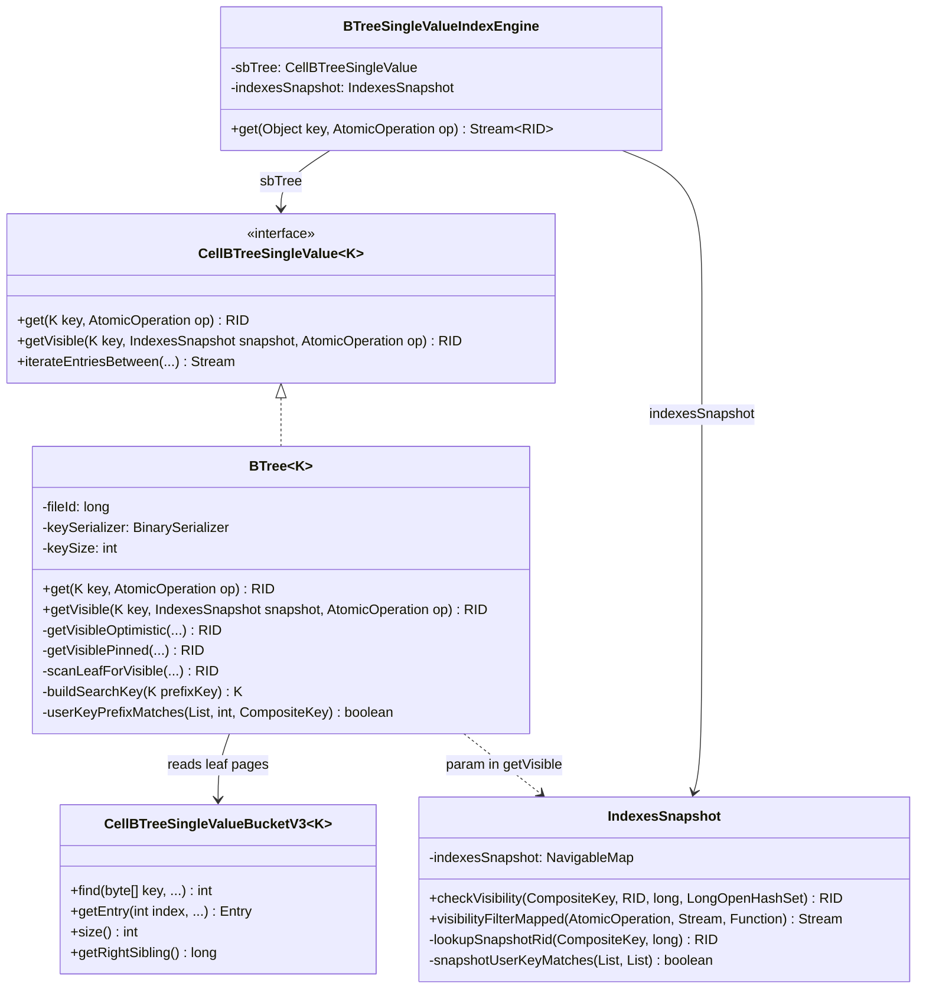
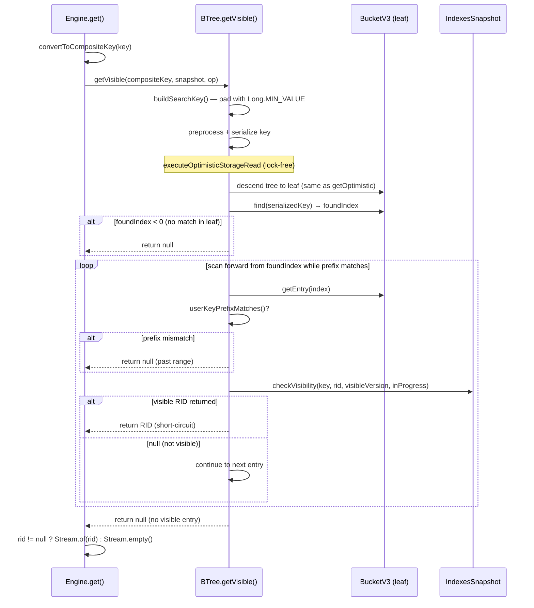
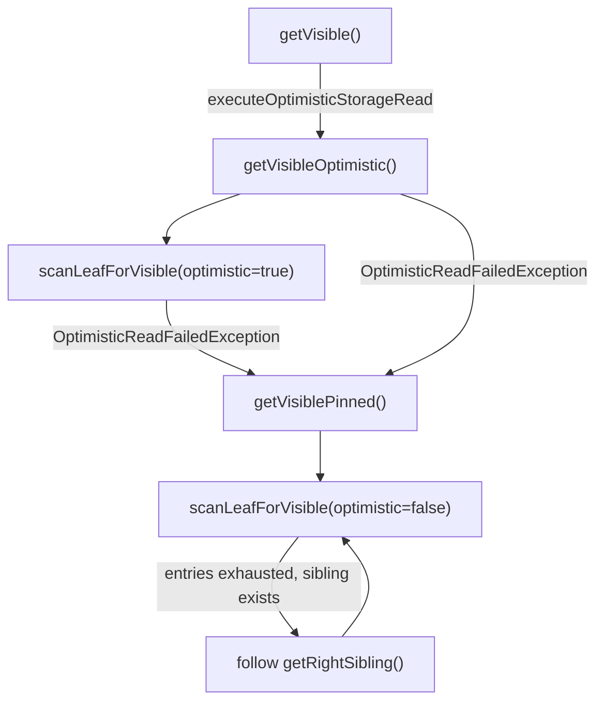

# Optimize BTreeSingleValueIndexEngine.get() — Final Design

## Overview

Replaced the `BTreeSingleValueIndexEngine.get(key)` stream pipeline
(`iterateEntriesBetween` + `visibilityFilter` + `map`) with a direct leaf-page
lookup via `BTree.getVisible()`. The optimization eliminates ~14 allocations per
call and removes shared-lock acquisition on the hot path, restoring the pre-SI
`get()` cost profile with lock-free optimistic reads.

Key deviations from the original design:

- **Search key construction** (D3 adaptation): raw prefix key serialization
  fails because `IndexMultiValuKeySerializer` requires the full element count.
  Instead, `buildSearchKey()` pads with `Long.MIN_VALUE` as the version
  component, which eliminates the leftward scan entirely — `bucket.find()`
  returns the insertion point at the first matching entry directly.
- **Null key handling**: null keys use the same `getVisible()` path as non-null
  keys. The original design anticipated this, and it works because
  `buildSearchKey()` only pads the version slot (always `LONG` type), so null
  user-key elements are not affected. A partial-key guard in `getVisible()`
  rejects composite-index calls where the key has fewer user elements than
  expected (no "null key" concept for composite indexes).
- **Dead code removal**: `emitSnapshotVisibility()` was removed after
  `visibilityFilterMapped()` was refactored to delegate to `checkVisibility()`.
  `snapshotUserKeyMatches()` was extracted from `lookupSnapshotRid()` for
  clarity.

## Class Design

**BTree\<K\>** implements `getVisible()` with a two-path pattern: an optimistic
lock-free happy path (`getVisibleOptimistic`) and a pinned shared-lock fallback
(`getVisiblePinned`). Both delegate to `scanLeafForVisible()` for the forward
entry scan with inline visibility checking. Helper methods `buildSearchKey()`
(pads user key with `Long.MIN_VALUE` version) and `userKeyPrefixMatches()`
(compares all elements except version) support the scan logic.

**IndexesSnapshot** provides `checkVisibility()` as the single source of truth
for visibility decisions. Both `visibilityFilterMapped()` (stream path for range
scans) and `scanLeafForVisible()` (direct path for point lookups) delegate to
it. The `lookupSnapshotRid()` helper handles historical version lookup in the
snapshot index, with `snapshotUserKeyMatches()` guarding against cross-key
contamination from the non-atomic write order in `addSnapshotPair()`.

**BTreeSingleValueIndexEngine** simplifies `get()` to: convert key →
`sbTree.getVisible()` → `Stream.of(rid)` or `Stream.empty()`.

## Workflow

### Engine `get()` Flow

The flow eliminates: `SpliteratorForward`, `ArrayList` dataCache,
`ReferencePipeline`, `mapMulti` stage, `map` stage, lambda captures, shared-lock
acquisition, and the 2 enhanced `CompositeKey` allocations from
`enhanceFromKey`/`enhanceToKey`. The tree descent and leaf page read are
identical to the pre-SI `getOptimistic()` path.

### Optimistic/Pinned Fallback

The optimistic path descends the tree and scans the leaf without acquiring locks.
If any page is evicted or modified concurrently (`OptimisticReadFailedException`),
the pinned path retries with a shared lock. The pinned path also handles
cross-page entries via `getRightSibling()`, which the optimistic path cannot
safely follow (it throws `OptimisticReadFailedException` to trigger the
fallback).

## Optimistic Read Scope for Leaf Scan

The pre-SI `getOptimistic()` reads a single entry and returns. The new
`getVisibleOptimistic()` scans multiple versioned entries within the leaf.

- **Single-page scan (common case):** All versions of a unique-index key fit on
  one leaf page. The optimistic scope covers tree descent + entire leaf scan,
  validated implicitly by successful return.
- **Cross-page scan (rare):** If the scan exhausts the leaf page without finding
  a visible entry, `scanLeafForVisible()` throws
  `OptimisticReadFailedException`, forcing fallback to the pinned path which
  follows `getRightSibling()` safely under shared lock.
- **IndexesSnapshot lookups** (`checkVisibility` → `lookupSnapshotRid` →
  `ConcurrentSkipListMap.lowerEntry()`) are pure in-memory operations outside
  the page scope — safe under either path.

## Visibility Logic — Single Source of Truth

`IndexesSnapshot.checkVisibility(CompositeKey key, RID rid, long visibleVersion,
LongOpenHashSet inProgressVersions)` returns `@Nullable RID`:

1. **In-progress check:** `inProgressVersions.contains(version)` →
   `TombstoneRID`/`SnapshotMarkerRID` delegates to `lookupSnapshotRid()`;
   plain `RecordId` returns null (pending insert, not yet visible).
2. **Committed check:** `version < visibleVersion` → `RecordId` returns as-is;
   `SnapshotMarkerRID` returns `rid.getIdentity()`; `TombstoneRID` returns null.
3. **Phantom check:** `version >= visibleVersion` with `RecordId` → null.
4. **Snapshot fallback:** `TombstoneRID`/`SnapshotMarkerRID` with
   `version >= visibleVersion` → `lookupSnapshotRid()`.

Both callers use it identically:
- `visibilityFilterMapped()`: calls per entry in `mapMulti`, emits non-null
  results via `downstream.accept()`
- `scanLeafForVisible()`: calls per entry in a plain loop, returns immediately
  on non-null (short-circuit)

## Search Key Construction

`buildSearchKey()` creates `CompositeKey(userKey..., Long.MIN_VALUE)` from the
user-facing prefix key. This approach replaced the original plan's raw prefix key
(D3 option 2) because `IndexMultiValuKeySerializer.serialize()` iterates up to
`types.length` elements — a shorter key causes `IndexOutOfBoundsException`.

`Long.MIN_VALUE` sorts before any real version number, so `bucket.find()` returns
the insertion point at or before the first versioned entry for the given user key.
This eliminates the leftward scan from the original design — the forward scan
starts at exactly the right position.

## Null Key Handling

Null keys (`CompositeKey(null, version)`) are handled uniformly by
`getVisible()`. `buildSearchKey()` pads only the version slot (always `LONG`
type), so null user-key elements pass through preprocessing and serialization
unchanged. The `userKeyPrefixMatches()` check correctly matches null elements
via `DefaultComparator`.

For composite indexes (multi-field keys), a partial-key guard at the top of
`getVisible()` returns null immediately if the key has fewer user elements than
`keySize - 1`. This prevents `CompositeKey(null)` from being misinterpreted as
a valid single-null-field lookup in a multi-field index.
