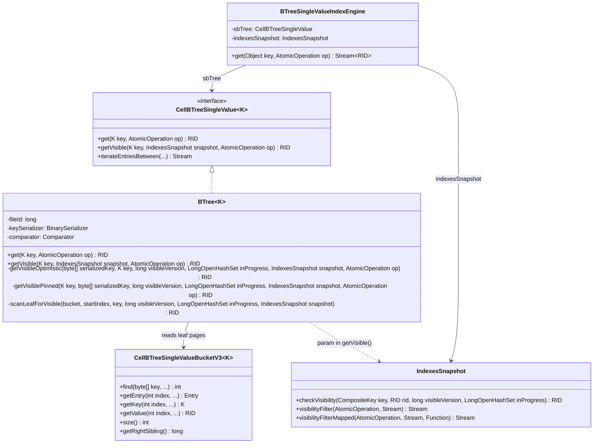
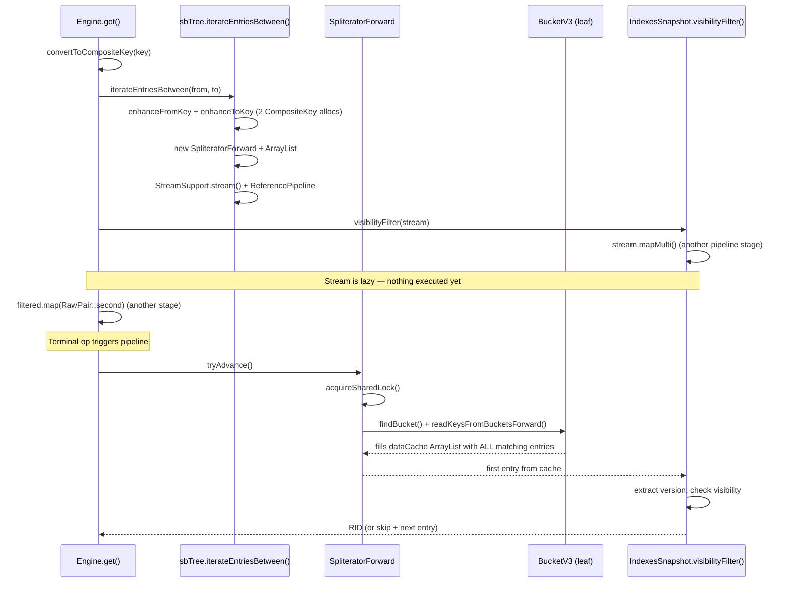
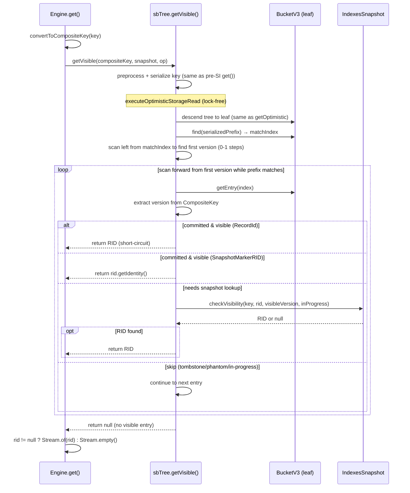

# Optimize BTreeSingleValueIndexEngine.get() — Design

## Overview

The current `get(key)` path in `BTreeSingleValueIndexEngine` constructs a full
range-scan pipeline (`iterateEntriesBetween` + `visibilityFilter` + stream
`.map()`) to find a single visible entry. This allocates ~14 objects and acquires
a shared lock on every call.

The optimization adds a `getVisible()` method to `BTree<K>` that reuses the
existing `findBucket()` → leaf page → direct read pattern from the pre-SI `get()`,
extending it with a forward scan within the leaf to check versioned entries
against visibility rules. The method accepts `IndexesSnapshot` as a parameter to
apply visibility inline without BTree holding SI state. A key design constraint
is minimizing lambdas with captured state on hot paths — visibility logic is
extracted into a plain method (`IndexesSnapshot.checkVisibility()`) that both the
stream pipeline and the direct `getVisible()` path can call without lambdas.

## Class Design



**BTree\<K\>** gains `getVisible()` as a new public method alongside the existing
`get()`. Internally it splits into `getVisibleOptimistic()` (lock-free happy path)
and `getVisiblePinned()` (shared-lock fallback), both of which call
`scanLeafForVisible()` — a private method that iterates entries within a leaf
bucket applying visibility logic.

**IndexesSnapshot** gains one new method — `checkVisibility(CompositeKey, RID,
long visibleVersion, LongOpenHashSet inProgressVersions)` — that encapsulates
the full visibility decision for a single entry and returns `@Nullable RID`.
The existing `visibilityFilterMapped()` is refactored to delegate to
`checkVisibility()` per entry inside its `mapMulti`, eliminating logic
duplication. Both the stream path and the direct `getVisible()` path share the
same visibility logic.

**BTreeSingleValueIndexEngine** simplifies `get()` to a single `getVisible()`
call + `Stream.of`/`Stream.empty` wrapping.

## Workflow

### Current get() flow (before optimization)



### Optimized getVisible() flow (after optimization)



The optimized flow eliminates: SpliteratorForward, ArrayList dataCache,
ReferencePipeline, mapMulti stage, map stage, lambda captures, shared lock
acquisition, and the 2 enhanced CompositeKey allocations. The tree descent and
leaf page read are identical to the pre-SI `getOptimistic()` — same
preprocess + serialize + findBucket path, lock-free with stamp validation.

If `find()` returns a negative value (no prefix match in the leaf), `getVisible()`
returns null immediately — no scan is performed.

## Optimistic Read Scope for Leaf Scan

The existing `getOptimistic()` reads a single entry from the leaf and returns.
The new `getVisibleOptimistic()` must scan multiple entries within the leaf (all
versions of the same key). This changes the optimistic scope:

- **Single-page scan (common case):** All versions fit on one leaf page. The
  optimistic scope covers the tree descent + the entire leaf scan. The scope is
  validated once at the end (or implicitly by returning successfully without
  `OptimisticReadFailedException`).

- **Cross-page scan (rare case):** Versions span two leaf pages (after a page
  split at a version boundary). The scan reads `getRightSibling()`, loads the
  next page via `loadPageOptimistic()` (same as tree descent pages), and
  continues. The optimistic scope validates the stamp before following the
  sibling pointer — same pattern as the tree descent validates after following
  child pointers.

- **Fallback:** Any `OptimisticReadFailedException` (page evicted, concurrent
  restructuring) falls through to `getVisiblePinned()` which acquires a shared
  lock and re-reads — identical to the existing `get()` fallback on develop.

The `IndexesSnapshot` lookups (`emitSnapshotVisibility` → `ConcurrentSkipListMap.lowerEntry()`)
are pure in-memory operations and do not participate in the optimistic page scope.
They are safe to call from either the optimistic or pinned path.

## Visibility Logic — Single Source of Truth

The visibility decision for a single entry is extracted into
`IndexesSnapshot.checkVisibility(CompositeKey key, RID rid, long visibleVersion,
LongOpenHashSet inProgressVersions)`. This method returns `@Nullable RID`:

1. **Extract version**: `long version = (Long) key.getKeys().getLast()`

2. **In-progress check**: if `inProgressVersions.contains(version)`:
   - `rid instanceof RecordId` → return null (new insert by in-progress TX)
   - Otherwise → snapshot fallback via `emitSnapshotVisibility()` → return
     RID or null

3. **Committed check**: if `version < visibleVersion`:
   - `rid instanceof RecordId` → return `rid` (visible, alive)
   - `rid instanceof SnapshotMarkerRID` → return `rid.getIdentity()` (re-added)
   - `rid instanceof TombstoneRID` → return null (deleted)

4. **Phantom check**: `version >= visibleVersion`:
   - `rid instanceof RecordId` → return null (phantom insert)
   - Otherwise → snapshot fallback → return RID or null

Both callers use `checkVisibility()`:
- **`visibilityFilterMapped()`** (stream path): calls `checkVisibility()` inside
  `mapMulti` — if non-null, emits via `downstream.accept()`
- **`BTree.scanLeafForVisible()`** (direct path): calls
  `snapshot.checkVisibility()` per entry in a loop — if non-null, returns
  immediately (short-circuit)

No logic duplication. The only per-entry allocation in `scanLeafForVisible()` is
the `getEntry()` call which deserializes the key and decodes the RID — both
unavoidable and present in the current path too.

## IndexesSnapshot.checkVisibility()

A new public method on `IndexesSnapshot`:

```
@Nullable RID checkVisibility(CompositeKey key, RID rid,
    long visibleVersion, LongOpenHashSet inProgressVersions)
```

This encapsulates the full visibility decision that was previously spread across
the `mapMulti` lambda in `visibilityFilterMapped()`. The existing
`visibilityFilterMapped()` is refactored to call `checkVisibility()` per entry,
and the existing `emitSnapshotVisibility()` remains as a package-private helper
for the snapshot fallback path within `checkVisibility()`.

## Null Key Handling

Null keys require no special treatment in `getVisible()`. They are stored in the
main B-tree as `CompositeKey(null, version)` entries. The prefix key
`CompositeKey(null)` is preprocessed + serialized the same way as any other key.
`bucket.find()` uses `CompositeKey.compareTo()` which returns 0 for prefix
matches — so it will find `CompositeKey(null, version)` entries.

The current `get(null)` has an extra filter to avoid matching
`CompositeKey(null, "Smith", version)` — a composite key where null is only the
first field, not a true null key. The current code uses `extractKey(pair.first()) == null`
which returns null only when the user-key portion is a single null element (i.e.,
the CompositeKey has exactly 2 components: one null user key + one version).
In `getVisible()`, the same check is applied inline during the forward scan:
verify the entry's CompositeKey has exactly 2 components (one user-key element +
one version) and the first component is null. This matches `extractKey()`
semantics and correctly rejects multi-field composite keys like
`CompositeKey(null, null, version)`.
