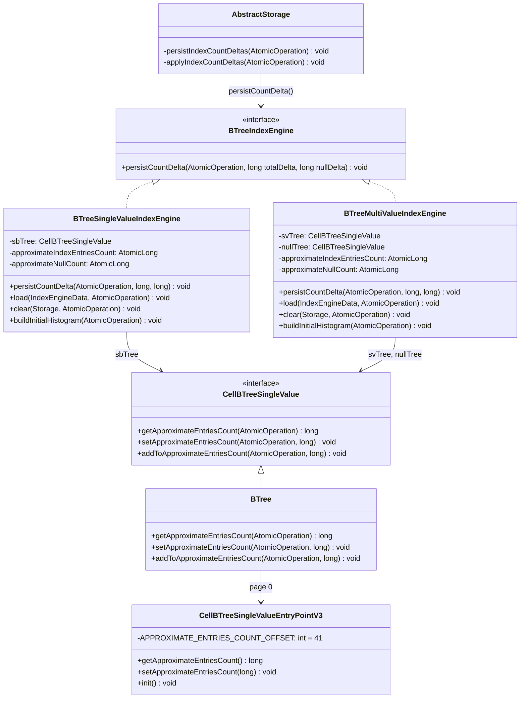
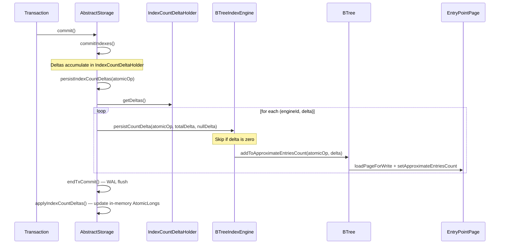
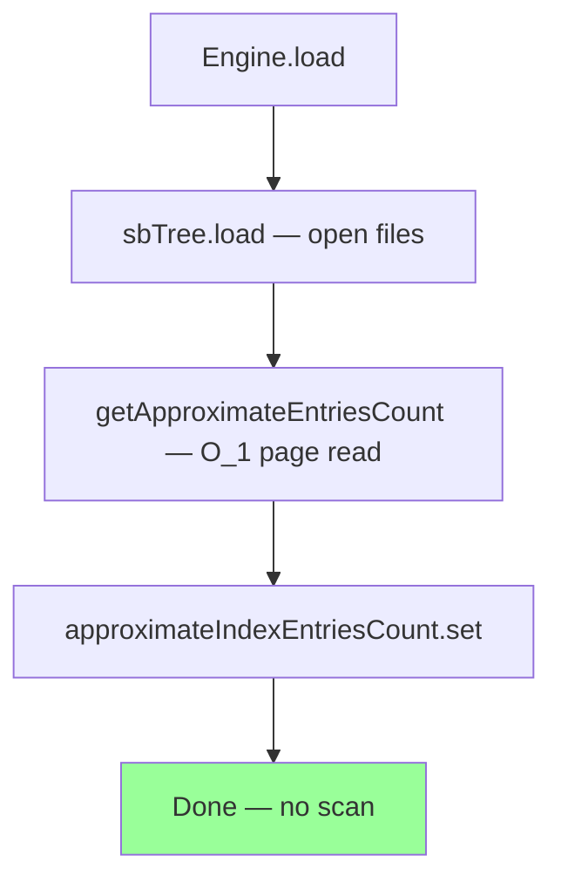

# Persist Approximate Index Entries Count — Final Design

## Overview

This feature eliminates the O(n) full BTree visibility-filtered scan that
previously ran on every `load()` of `BTreeSingleValueIndexEngine` and
`BTreeMultiValueIndexEngine` during database open. Instead, each BTree
persists an `APPROXIMATE_ENTRIES_COUNT` field on its entry point page
(page 0). The count is maintained transactionally via a deferred delta
pattern — deltas accumulated during the transaction are persisted to the
entry point page within the WAL atomic operation, then applied to the
in-memory `AtomicLong` counters post-commit. On load, the engine reads
the persisted count in O(1) instead of scanning.

No deviations from the original design. Implementation matched the plan
closely across both tracks (8 steps total, 0 failures).

## Class Design

**Key relationships:**

- `CellBTreeSingleValueEntryPointV3` has `APPROXIMATE_ENTRIES_COUNT` at byte
  offset 41 (after `TREE_SIZE`), shifting `PAGES_SIZE` to 49 and
  `FREE_LIST_HEAD` to 53. The `init()` method sets it to 0.
- `BTree` exposes three methods on the `CellBTreeSingleValue` interface:
  `get` uses `executeOptimisticStorageRead` (matching `size()`), `set`/`addTo`
  use `executeInsideComponentOperation` + `loadPageForWrite` (matching
  `updateSize()`). Non-negative asserts guard both page-level and BTree-level
  writes.
- `BTreeIndexEngine.persistCountDelta` is implemented by both engines with
  zero-delta guards to skip unnecessary page writes.
- `AbstractStorage.persistIndexCountDeltas` mirrors the defensive checks of
  `applyIndexCountDeltas` (bounds, null, instanceof).

## Workflow

### Commit-Time Persistence

The critical ordering: `persistIndexCountDeltas()` runs **inside** the WAL
atomic operation (between `commitIndexes()` and the catch clause). If
persistence fails, the entire transaction rolls back. Post-commit,
`applyIndexCountDeltas()` updates the in-memory `AtomicLong` fields.

### Load-Time Read

Single-value: reads one count from `sbTree`, sets `approximateNullCount`
to 0 (recalibrated by `buildInitialHistogram()`).

Multi-value: reads `svTree` and `nullTree` counts independently, composites
`total = svCount + nullCount`, `nullCount = nullTreeCount`.

## Entry Point Page Layout

| Offset | Size | Field |
|--------|------|-------|
| 28 | 1 | KEY_SERIALIZER |
| 29 | 4 | KEY_SIZE |
| 33 | 8 | TREE_SIZE |
| **41** | **8** | **APPROXIMATE_ENTRIES_COUNT** |
| 49 | 4 | PAGES_SIZE |
| 53 | 4 | FREE_LIST_HEAD |

## Delta Splitting for Multi-Value Engine

The multi-value engine splits deltas across two trees:
- `svTree.addToApproximateEntriesCount(atomicOp, totalDelta - nullDelta)`
- `nullTree.addToApproximateEntriesCount(atomicOp, nullDelta)`

Both calls are guarded: if the respective delta is zero, the page write is
skipped entirely to avoid unnecessary WAL records on the commit path.

## Crash Recovery

The visible count update is part of the same WAL atomic operation as the
index mutations. On crash before WAL flush, the entire transaction rolls
back. On crash after WAL flush, WAL replay restores the entry point page
to the committed state. No special recovery logic is needed.

## Null Count Handling for Single-Value Engine

The single-value engine does not separately persist the null count. On
`load()`, `approximateNullCount` is set to 0 — temporarily inaccurate by
at most 1 entry until `buildInitialHistogram()` recalibrates from a full
scan. This is acceptable because single-value indexes have at most 1 null
entry, and the count is approximate by design.
