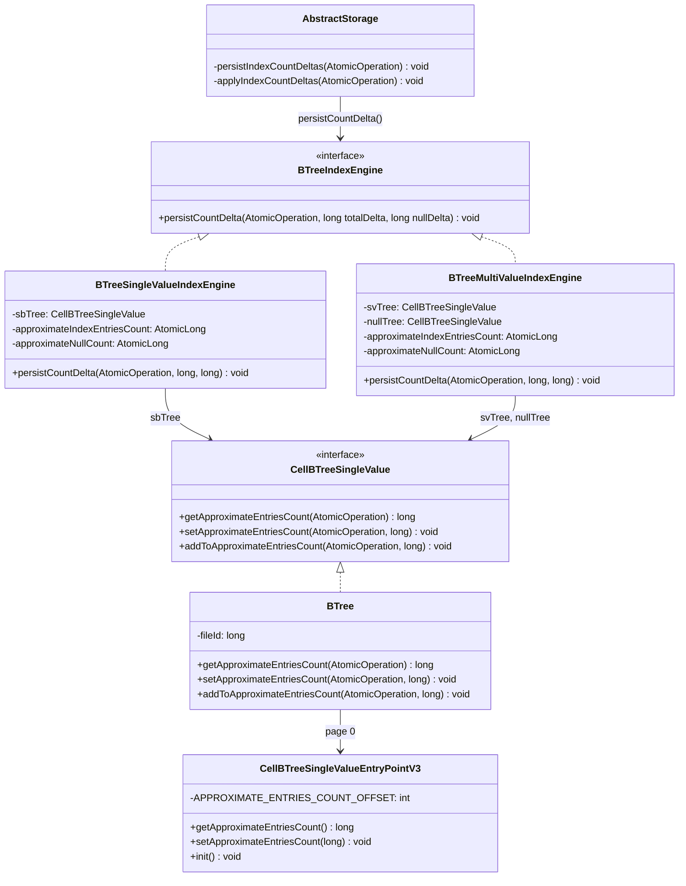
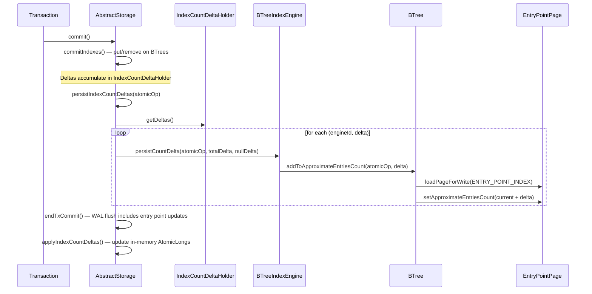

# Persist Approximate Index Entries Count — Design

## Overview

This design eliminates the O(n) full BTree scan that currently runs on every
`load()` of `BTreeSingleValueIndexEngine` and `BTreeMultiValueIndexEngine`.
Instead, each BTree persists a `APPROXIMATE_ENTRIES_COUNT` field on its entry point page
(page 0). The count is maintained transactionally via a deferred delta pattern
— deltas accumulated during the transaction are persisted to the entry point
page within the atomic operation (WAL-protected), then applied to the
in-memory `AtomicLong` counters post-commit. On load, the engine reads the
persisted count instead of scanning.

The approach mirrors `PaginatedCollectionV2.approximateRecordsCount` but
adapts it for the deferred delta pattern already used by index count tracking.

## Definition: APPROXIMATE_ENTRIES_COUNT

`APPROXIMATE_ENTRIES_COUNT` is the persisted count of **live index entries** in
a BTree — entries that survive MVCC visibility filtering. Specifically, it
counts all BTree entries **except** those whose value is a `TombstoneRID`
(logically deleted entries). This includes:

- **Regular entries** (`RecordId`) — user-visible index mappings
- **Snapshot markers** (`SnapshotMarkerRID`) — live entries with MVCC version
  markers that will be resolved to regular entries after snapshot eviction

Tombstones remain in the BTree until snapshot eviction reclaims them. The
existing `TREE_SIZE` field on the entry point page counts **all** BTree entries
(including tombstones and markers). `APPROXIMATE_ENTRIES_COUNT` is always
≤ `TREE_SIZE`.

The count is "approximate" because concurrent transactions may commit between
the read and use of the value — the same semantics as
`PaginatedCollectionV2.approximateRecordsCount`.

## Class Design

**Key relationships:**

- `CellBTreeSingleValueEntryPointV3` gains an `APPROXIMATE_ENTRIES_COUNT`
  field at byte offset 41 (immediately after `TREE_SIZE`), shifting
  `PAGES_SIZE` and `FREE_LIST_HEAD` by 8 bytes. The `init()` method sets it
  to 0 (new index is empty).
- `BTree` exposes three new methods on the `CellBTreeSingleValue` interface:
  `getApproximateEntriesCount`, `setApproximateEntriesCount`, `addToApproximateEntriesCount`. These are thin
  wrappers around entry point page read/write operations.
- `BTreeIndexEngine` gains `persistCountDelta(AtomicOperation, totalDelta, nullDelta)`.
  Each engine implementation knows how to map the total/null delta to its
  underlying tree(s).
- `AbstractStorage` gains `persistIndexCountDeltas()` — called within the
  atomic operation, between `commitIndexes()` and `endTxCommit()`.

## Workflow

### Commit-Time Persistence

The critical change: `persistIndexCountDeltas()` runs **inside** the atomic
operation, so the entry point page update is WAL-logged alongside the index
mutations. If persistence fails, the entire transaction rolls back — no
inconsistency between index data and the persisted count.

Post-commit, `applyIndexCountDeltas()` still updates the in-memory
`AtomicLong` fields for O(1) reads during the session.

### Load-Time Read

```mermaid
flowchart TD
    LOAD[Engine.load] --> BTLOAD[sbTree.load — open files]
    BTLOAD --> READ_SV[sbTree.getApproximateEntriesCount]
    READ_SV --> SET_TOTAL[approximateIndexEntriesCount.set]
    SET_TOTAL --> SET_NULL[approximateNullCount.set — 0 for single-value]
    SET_NULL --> DONE[Done — no scan]

    style DONE fill:#9f9
```

For single-value engine: reads one count from `sbTree`. Sets
`approximateNullCount` to 0 (corrected later by `buildInitialHistogram()`).

For multi-value engine: reads `svTree.getApproximateEntriesCount()` and
`nullTree.getApproximateEntriesCount()` separately. Computes
`total = svVisible + nullVisible`, `nullCount = nullVisible`.

## Entry Point Page Layout

The existing `CellBTreeSingleValueEntryPointV3` layout (byte offsets from page
start):

| Offset | Size | Field |
|--------|------|-------|
| 28 | 1 | KEY_SERIALIZER |
| 29 | 4 | KEY_SIZE |
| 33 | 8 | TREE_SIZE |
| **41** | **8** | **APPROXIMATE_ENTRIES_COUNT (new)** |
| 49 | 4 | PAGES_SIZE (shifted from 41) |
| 53 | 4 | FREE_LIST_HEAD (shifted from 45) |

The new field is placed immediately after `TREE_SIZE` to group both count
fields together. This shifts `PAGES_SIZE` and `FREE_LIST_HEAD` by 8 bytes —
acceptable because no backward compatibility is required. The
entry-point-specific metadata (after `DurablePage.NEXT_FREE_POSITION` at
offset 28) grows from 21 bytes (offsets 28–48) to 29 bytes (offsets 28–56).
Page 0 is 8 KB by default — ample space.

`init()` sets `APPROXIMATE_ENTRIES_COUNT` to 0 alongside the existing fields.
This is correct because a newly created index is empty.

## Delta Splitting for Multi-Value Engine

`IndexCountDelta` carries `totalDelta` and `nullDelta`. The multi-value
engine splits them across its two trees:

- `svTree.addToApproximateEntriesCount(atomicOp, totalDelta - nullDelta)` — non-null
  entries
- `nullTree.addToApproximateEntriesCount(atomicOp, nullDelta)` — null entries

The single-value engine applies the full `totalDelta` to its single tree:

- `sbTree.addToApproximateEntriesCount(atomicOp, totalDelta)`

This split is encapsulated inside each engine's `persistCountDelta()` method.

## Crash Recovery

The visible count update is part of the same WAL atomic operation as the
index mutations. On crash:

- **Before WAL flush:** The entire transaction (including visible count update)
  is rolled back. The persisted count remains consistent with the index data.
- **After WAL flush:** WAL replay restores the entry point page (including the
  visible count) to the committed state.

No special recovery logic is needed — the existing WAL mechanism handles it.

## Null Count Handling for Single-Value Engine

The single-value engine stores null and non-null entries in the same BTree.
The single `APPROXIMATE_ENTRIES_COUNT` field tracks the total (null + non-null). The
null count is not separately persisted because:

1. For single-value indexes, null count is always 0 or 1
2. The null key is stored as `CompositeKey(null, version)` in the main BTree
   file (`.cbt`), not in the BTree's internal null bucket file (`.nbt`), so
   deriving it cheaply is not possible
3. `buildInitialHistogram()` recalibrates both counts from a full scan

On `load()`, `approximateNullCount` is set to 0. This is temporarily
inaccurate (off by at most 1) until the first `buildInitialHistogram()` call
corrects it.
