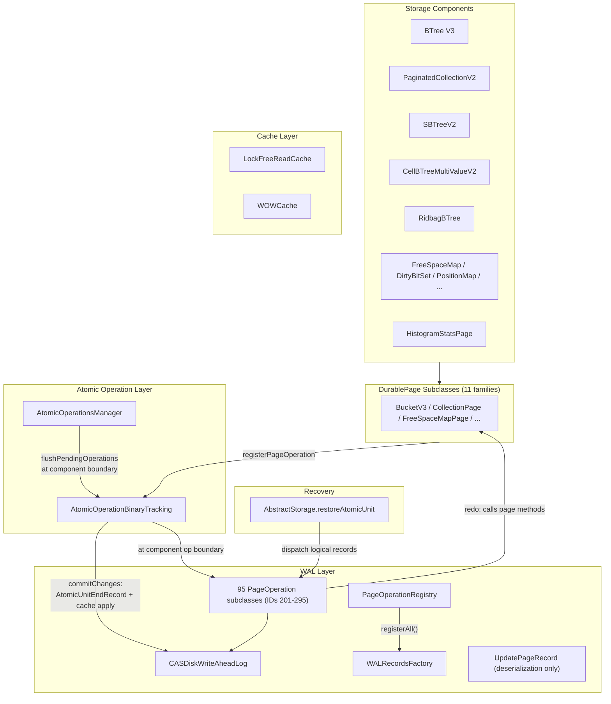

# Physiological WAL Logging — Architecture Decision Record

## Summary

Replaced binary-diff WAL records (`UpdatePageRecord` + `WALPageChangesPortion`
serialization) with 95 page-level logical WAL records (`PageOperation`
subclasses) across all active page type families. The in-memory overlay
(`WALPageChangesPortion`) is unchanged. Logical records capture operation
parameters (serialized keys, indices, flags) rather than byte-level diffs,
resulting in smaller WAL records (~40% theoretical reduction), faster
serialization, and semantic clarity for future recovery optimizations.

## Goals

**Achieved as planned:**
- Smaller WAL size — logical records store only operation parameters, not full
  32-byte chunks of modified page regions. Theoretical ~40% reduction (empirical
  measurement deferred).
- Faster WAL writes — less data serialized per operation.
- Semantic clarity — WAL records describe intent, not byte-level effects.
- Foundation for future optimizations — logical records enable smarter recovery
  and replication.

**Descoped:**
- `PaginatedVersionStateV0` and versionmap `MapEntryPoint` conversion — dropped
  because they are dead code (zero external references from any component class).

## Constraints

**Preserved as planned:**
- WAL-before-data invariant — dirty pages not flushed before WAL records are on
  stable storage. `startLSN` anchors segment retention, `endLSN` gates WOWCache
  flush.
- `initialLsn` acts as CAS during page restore — preserved in all 95 logical
  record types (12 bytes each).
- LSN-based idempotency — `pageLsn < walRecordLsn` check prevents re-application.
- Incremental backup compatibility — LSN-based skip works for any record type.
- `WALPageChangesPortion` stays for in-memory overlay.
- Legacy V1 page types skipped.

**New constraints discovered:**
- `flushPendingOperations()` must be called at the top of `commitChanges()` for
  standalone atomic operations that bypass `executeInsideComponentOperation`
  boundaries (e.g., histogram snapshot flush). Without this, pending ops would
  never be flushed and the `changeLSN == null` safety guard would throw.
- `CollectionPage.appendRecord()` redo requires capturing the coalesced
  `holeSize` from `findHole()` — the hole marker on the page may represent only
  one fragment of a merged hole. Reading the page marker during redo is
  insufficient.

## Architecture Notes

### Component Map

Updated from plan:
- `PageOperationRegistry` added as centralized registration point (not in
  original plan — emerged during Track 4 to ensure WAL record types are
  registered before `recoverIfNeeded()`).
- `Ridbag` and `Histogram` added as explicit component families.
- `UpdatePageRecord` annotated as "deserialization only" — creation path
  removed in Track 8.

### Decision Records

#### D1: Page-level logical records (not component-level)
**Implemented as planned.** 95 page-level records across 11 page type families.
The mechanical nature of per-page-type conversion was confirmed — each family
follows the same pattern with minor adaptations for serialization format and
conditional registration.

#### D2: WAL writes at executeInsideComponentOperation boundary
**Implemented as planned with one addition.** `flushPendingOperations()` is
called at component operation boundaries as designed. Additionally, it is called
at the top of `commitChanges()` for standalone atomic operations that bypass
component boundaries (discovered during Track 8).

#### D3: Keep WALPageChangesPortion for in-memory overlay
**Implemented as planned.** Two representations coexist during an operation:
the overlay (for reads) and the logical record list (for WAL). The byte-array
`toStream`/`fromStream` methods on `WALChanges` were removed as dead code;
ByteBuffer variants retained for `UpdatePageRecord` backward-compat
deserialization.

#### D4: Logical record redo reuses DurablePage methods with changes=null
**Implemented as planned.** All 95 redo methods call the same DurablePage
subclass methods used during normal operation. Redo suppression works via
`instanceof CacheEntryChanges` guard — during recovery, the page is constructed
from `CacheEntryImpl` (not `CacheEntryChanges`), so `registerPageOperation()` is
never called.

Two page types required dedicated redo helpers to avoid serializer dependencies:
- `HistogramStatsPage`: `writeSnapshotRaw()` and `writeHllRaw()` — avoid
  `BinarySerializer`/`BinarySerializerFactory` dependency during recovery.
- `CellBTreeSingleValueBucketV3`: `updateKeyWithOldKeySize()` — avoids key
  serializer for computing old key size during redo.
- `CollectionPage`: `appendRecordAtPosition()` — deterministic redo that writes
  directly to the captured position, handling hole-split and free-pointer paths.

B-tree bulk operations (`shrink`) use a `resetAndAddAll()` package-private
helper: reset `freePointer` and `size` to 0, then call `addAll()` with
retained entries. This avoids needing the key serializer in redo.

#### D5: initialLsn preserved as CAS for page restore
**Implemented as planned.** All 95 record types carry `initialLsn` (12 bytes).
False-positive CAS mismatch logs occur for 2nd+ operations on the same page
within one atomic unit (e.g., during B-tree splits). This matches the
pre-existing `UpdatePageRecord` behavior and is not a correctness issue — tracked
as optional improvement.

#### D6: New WAL record type IDs (200+)
**Implemented as planned.** `PAGE_OPERATION_ID_BASE = 200` in `WALRecordTypes`.
95 types use IDs 201–295. Old PO IDs (35–198) remain tombstoned in
`WALRecordsFactory`'s switch statement. An assertion in `registerNewRecord()`
enforces `id >= PAGE_OPERATION_ID_BASE` to prevent collisions.

The `WALRecordsFactory.idToTypeMap` was changed from `Int2ObjectOpenHashMap` to
`ConcurrentHashMap` to fix a thread-safety issue discovered during Track 4 code
review (concurrent `registerAll()` calls from different storage instances).

#### D7: Incremental per-page-type conversion with mixed WAL records
**Completed.** The D7 transition period (Tracks 2–7) allowed `UpdatePageRecord`
and `PageOperation` to coexist in the same atomic unit. `changeLSN != null`
served as the discriminator for converted vs. unconverted pages. After all page
types were converted (Track 8), the `UpdatePageRecord` creation path was removed
and replaced with a `StorageException` safety guard. The transitional
`clearPendingOperations()` fallback was removed as dead code. Recovery retains
both dispatch paths for backward compatibility.

#### D8: Conditional PageOperation registration (new — emerged during execution)
Not in the original plan. Many mutation methods have failure paths (page full,
entry not found, threshold exceeded) that must not register a `PageOperation`.
The pattern established during execution: register only on the success path,
after the mutation is confirmed. Methods with multiple success return points
(e.g., `CellBTreeMultiValueV2Bucket.removeLeafEntry`) were refactored to use
extracted `doRemoveLeafEntry()` private methods for centralized registration.

#### D9: PageOperationRegistry for centralized WAL record type registration (new)
Not in the original plan. Created during Track 4 to ensure all PageOperation
types are registered with `WALRecordsFactory` before `recoverIfNeeded()` in both
`AbstractStorage.open()` and `create()` paths. Uses `synchronized` to handle
concurrent registration from multiple storage instances. Registration count
tracked in tests (updated from 18 to 95 across tracks).

### Invariants

All invariants from the plan are preserved:
- **WAL-before-data** — dirty pages not flushed before `WAL.flushedLsn >= endLSN`.
- **startLSN anchors segment retention** — `dirtyPages[pageKey] = startLSN`.
- **Atomic unit completeness** — only complete units applied during recovery.
- **Page LSN monotonicity** — `pageLsn < walRecordLsn` prevents re-application.
- **initialLsn CAS** — diagnostic check, not hard failure.

New invariant:
- **changeLSN non-null for durable pages with changes** — enforced by
  `StorageException` in `commitChanges()`. Detects missing `PageOperation`
  registration for any page type.

### Integration Points

- **WALRecordsFactory.registerNewRecord()** — dynamic registration API with
  `ConcurrentHashMap<Integer, Supplier>`. ID validation assertion prevents
  collisions.
- **AtomicOperationsManager.executeInsideComponentOperation()** — post-execution
  `flushPendingOperations()` call (line 178).
- **AtomicOperationsManager.calculateInsideComponentOperation()** — post-execution
  `flushPendingOperations()` call (line 206). Return value captured before flush.
- **AtomicOperationBinaryTracking.commitChanges()** — initial
  `flushPendingOperations()` for standalone operations (line 694). Safety guard
  for missing `changeLSN` (lines 753–758).
- **AbstractStorage.restoreAtomicUnit()** — `case PageOperation pageOp` branch
  (line 5275) alongside existing `UpdatePageRecord` branch (line 5206).
- **PageOperationRegistry.registerAll()** — called in both `AbstractStorage.open()`
  and `create()` paths before `recoverIfNeeded()`.

### Non-Goals

Implemented as planned — no changes:
- Undo logging — only redo records produced.
- Logical replication — not in scope.
- WAL compression changes — existing LZ4 applies automatically.
- Non-durable component changes — bypass WAL entirely.
- Legacy V1 page type conversion.

## Key Discoveries

Synthesized from all 36 step episodes across 8 tracks:

1. **`appendRecord` hole-reuse requires capturing coalesced `holeSize`.**
   `CollectionPage.findHole()` merges adjacent holes into a size that may exceed
   any individual hole marker on the page. Reading the page marker during redo is
   insufficient. The WAL record must capture the coalesced size for deterministic
   hole-split behavior. (Track 8, Step 3 — caught by crash-safety code review)

2. **Standalone atomic operations bypass component boundaries.** Operations like
   histogram snapshot flush use `executeInsideAtomicOperation()` directly. Without
   a `flushPendingOperations()` call in `commitChanges()`, their ops would never
   be flushed. (Track 8, Step 1)

3. **`WALRecordsFactory.idToTypeMap` requires thread safety.** The original
   `Int2ObjectOpenHashMap` was not safe for concurrent `registerAll()` calls from
   different storage instances. Fixed to `ConcurrentHashMap`. (Track 4, Step 1)

4. **PageOperationRegistry registration must be immediate, not deferred.** Once
   Track 4 wired `flushPendingOperations()` at component boundaries, any newly
   registered mutation methods are immediately active. Deferring factory
   registration to a later step causes crash recovery failures if WAL files
   contain the new record types. (Track 5, Step 1)

5. **`updateValue` non-leaf branch is vestigial.** Non-leaf entries in
   `CellBTreeSingleValueBucketV3` have no value slot (`[leftChild][rightChild][key]`
   layout). The `if (!isLeaf())` branch in `updateValue` would overflow the
   entry if called. (Track 5, Step 2)

6. **Multi-value `addAll`/`shrink` need leaf/non-leaf variants.** Unlike
   single-value B-trees where `getRawEntry()` returns opaque bytes,
   multi-value entries have structured fields (key, mId, entriesCount, RID list
   for leaf; key, leftChild, rightChild for non-leaf). (Track 6, review)

7. **`SBTreeBucketV2`/`NullBucketV2` are dead production code.** No component
   class uses them. Converted for completeness with unit tests only. (Track 7a)

8. **`WOWCacheTestIT` used `(byte)128 = -128` as test WAL record ID.** This
   collided with the `id >= PAGE_OPERATION_ID_BASE` assertion added in Track 1.
   Fixed to ID 250. (Track 5, Step 5)

9. **D7 transition assertion timing.** The strict `pendingOps.isEmpty()` assertion
   in `commitChanges()` cannot be added until the component-boundary flush hook
   is wired (Track 4). During the transition (Tracks 2–3), a transitional
   `clearPendingOperations()` is needed because `UpdatePageRecord` already covers
   the mutations via binary diff. (Track 2, Step 1)

10. **Conditional registration is critical for correctness.** Many mutation methods
    have failure paths that must not register a `PageOperation`. Unconditional
    registration would cause phantom replays during recovery. Centralized
    registration via extracted helper methods prevents missed registration points
    in methods with multiple return paths. (Tracks 2–7)

11. **`HistogramStatsPage` and `updateKey` need serializer-free redo helpers.**
    Key/value serializers may not be available during crash recovery. Dedicated
    redo helpers (`writeSnapshotRaw`, `writeHllRaw`, `updateKeyWithOldKeySize`)
    avoid these dependencies while maintaining the single-source-of-truth
    principle for page layout. (Tracks 5, 7b)
